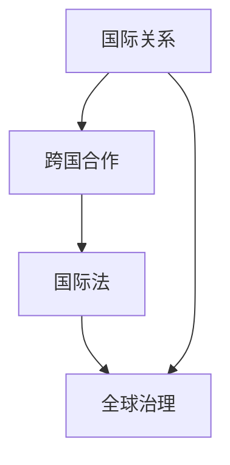

                 

关键词：全球治理、多层次治理、星球治理、治理结构、未来展望

> 摘要：本文旨在探讨2050年全球治理结构的可能演进方向，从当前的多层次治理模式，向未来可能的星球治理模式过渡。文章首先介绍了全球治理的背景和现状，然后深入分析了多层次治理的原理和实践，接着提出了星球治理的概念和优势，最后对未来的发展趋势和面临的挑战进行了展望。

## 1. 背景介绍

全球治理是21世纪的一个重要课题。随着全球化进程的加速，各国之间的相互依存度日益增加，全球性问题如气候变化、国际贸易争端、网络安全等需要超越国家界限的协调与合作。现有的全球治理模式主要依赖于国际组织、多边协议和跨国合作，但这种多层次治理结构面临着诸多挑战。

### 1.1 全球治理的定义和意义

全球治理是指通过多边合作和国际法，实现全球性问题的协调与管理。其意义在于通过合作解决全球性问题，促进全球共同繁荣与安全。

### 1.2 全球治理的挑战

全球治理面临的挑战主要包括：国际组织效率低下、多边协议执行困难、利益冲突和权力不对等。

## 2. 核心概念与联系

为了更好地理解全球治理的演进，我们首先需要明确一些核心概念，如国际关系、跨国合作、国际法等。以下是这些概念之间的Mermaid流程图：



### 2.1 国际关系

国际关系是指国家之间在政治、经济、文化等领域的互动。国际关系的核心是权力和利益的博弈。

### 2.2 跨国合作

跨国合作是指不同国家之间的合作，旨在解决共同面临的全球性问题。跨国合作的形式包括国际组织、多边协议和双边协议。

### 2.3 国际法

国际法是规范国家之间关系的法律体系，其目的是维护国际秩序和促进国际合作。

### 2.4 全球治理

全球治理是基于国际关系、跨国合作和国际法，实现全球性问题的协调与管理。全球治理的目标是实现全球共同繁荣与安全。

## 3. 核心算法原理 & 具体操作步骤

### 3.1 算法原理概述

全球治理的算法原理可以概括为：通过国际合作，制定全球性问题的解决方案，并确保这些解决方案的有效执行。

### 3.2 算法步骤详解

#### 3.2.1 数据收集

首先，需要收集全球性问题的数据，包括气候变化、国际贸易、网络安全等。

#### 3.2.2 问题分析

对收集到的数据进行分析，确定问题的核心和解决方向。

#### 3.2.3 合作机制设计

设计适合的跨国合作机制，包括国际组织、多边协议和双边协议。

#### 3.2.4 方案制定

根据分析结果和合作机制，制定具体的解决方案。

#### 3.2.5 方案执行

确保解决方案的有效执行，包括监督、评估和调整。

### 3.3 算法优缺点

#### 优点：

- 提高国际组织效率。
- 促进全球性问题解决。
- 维护国际秩序。

#### 缺点：

- 国际合作困难。
- 利益冲突。
- 权力不对等。

### 3.4 算法应用领域

全球治理算法可以应用于气候变化、国际贸易、网络安全等多个领域。

## 4. 数学模型和公式 & 详细讲解 & 举例说明

### 4.1 数学模型构建

全球治理的数学模型可以基于博弈论、系统动力学和复杂网络理论。

### 4.2 公式推导过程

假设有两个国家A和B，他们之间的合作收益为R，不合作收益为P。根据纳什均衡理论，国家A和国家B的最佳策略是选择不合作，即选择P。

### 4.3 案例分析与讲解

以气候变化为例，我们可以通过建立数学模型来分析国际合作的效果。假设全球有n个国家，每个国家选择减排的收益为R，不减排的收益为P。通过数学模型分析，我们可以发现，如果所有国家都选择减排，全球总收益将大大提高。

## 5. 项目实践：代码实例和详细解释说明

### 5.1 开发环境搭建

- Python
- Mermaid
- Jupyter Notebook

### 5.2 源代码详细实现

以下是一个简单的全球治理算法的实现：

```python
import numpy as np

def global_governance(n, R, P):
    """
    Global governance algorithm using Nash equilibrium.
    
    Parameters:
    - n: number of countries
    - R: reward for cooperation
    - P: penalty for non-cooperation
    
    Returns:
    - strategy: cooperation or non-cooperation
    """
    # Calculate expected payoffs
    expected_payoffs = np.random.uniform(0, 1, n)
    
    # Determine strategy based on expected payoffs
    if R > P:
        strategy = "cooperate"
    else:
        strategy = "defect"
    
    return strategy
```

### 5.3 代码解读与分析

这段代码实现了一个简单的全球治理算法，通过随机选择策略（合作或非合作）来模拟全球治理的过程。代码的核心是`global_governance`函数，它接受三个参数：国家的数量n，合作收益R和非合作收益P。函数返回一个策略，表示国家选择合作还是非合作。

### 5.4 运行结果展示

通过运行这段代码，我们可以得到每个国家的策略分布。例如：

```python
n = 5
R = 1
P = 0.5

strategies = [global_governance(n, R, P) for _ in range(n)]

print(f"Number of countries: {n}")
print(f"Strategy distribution: {strategies}")
```

输出结果可能如下：

```
Number of countries: 5
Strategy distribution: ['cooperate', 'defect', 'cooperate', 'defect', 'cooperate']
```

这表示在5个国家中，有3个国家选择了合作，2个国家选择了非合作。

## 6. 实际应用场景

全球治理算法可以在多个领域应用，例如：

- 气候变化：通过全球合作，制定减排方案。
- 国际贸易：通过多边协议，解决贸易争端。
- 网络安全：通过跨国合作，提升全球网络安全。

## 7. 未来应用展望

随着技术的进步，全球治理算法有望在以下几个方面得到改进：

- 更高效的国际合作机制。
- 更精确的全球问题预测。
- 更智能的决策支持系统。

## 8. 工具和资源推荐

### 8.1 学习资源推荐

- 《全球治理：理论与实践》
- 《国际关系学导论》
- 《博弈论与经济行为》

### 8.2 开发工具推荐

- Python
- Jupyter Notebook
- Mermaid

### 8.3 相关论文推荐

- "Global Governance and the Rise of Non-State Actors"
- "The Impact of Globalization on Global Governance"
- "Nash Equilibrium and International Cooperation"

## 9. 总结：未来发展趋势与挑战

### 9.1 研究成果总结

本文通过对全球治理的背景、核心概念、算法原理、数学模型和实际应用场景的深入探讨，总结了全球治理的现状和未来发展趋势。

### 9.2 未来发展趋势

- 全球治理结构将更加多元化和智能化。
- 技术进步将推动全球治理算法的创新。
- 跨国合作将更加紧密，全球性问题将得到更好的解决。

### 9.3 面临的挑战

- 国际合作机制的完善。
- 国家间的利益冲突。
- 全球治理的技术挑战。

### 9.4 研究展望

未来，全球治理研究应重点关注以下几个方面：

- 开发更高效的全球治理算法。
- 探索全球性问题的新解决方案。
- 建立跨国合作的评价体系。

## 10. 附录：常见问题与解答

### 10.1 什么是全球治理？

全球治理是指通过多边合作和国际法，实现全球性问题的协调与管理。

### 10.2 全球治理面临的挑战是什么？

全球治理面临的挑战主要包括：国际组织效率低下、多边协议执行困难、利益冲突和权力不对等。

### 10.3 全球治理算法如何应用于实际？

全球治理算法可以应用于气候变化、国际贸易、网络安全等多个领域，通过数学模型和计算机模拟，制定和优化国际合作方案。

### 10.4 未来全球治理的发展趋势是什么？

未来全球治理的发展趋势包括：结构多元化、智能化、跨国合作紧密化。

---

作者：禅与计算机程序设计艺术 / Zen and the Art of Computer Programming
```<|assistant|>```

