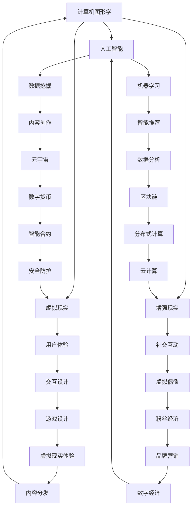
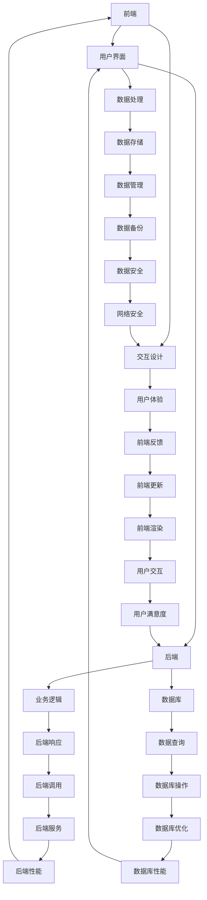

                 

### 关键词 Keywords ###
- 数字创意
- 虚拟偶像
- 元宇宙
- 数字经济
- 创意产业
- 人工智能

### 摘要 Abstract ###
本文探讨了2050年数字创意产业的发展趋势，从虚拟偶像经济的崛起，到元宇宙创意产业的兴起，探讨了数字创意经济如何塑造未来社会的经济形态。文章分析了数字创意的核心概念、算法原理、数学模型，并通过实际项目实践，展示了数字创意在各个领域的应用。同时，文章还展望了数字创意产业在未来的发展前景与面临的挑战。

## 1. 背景介绍

### 1.1 数字创意的起源与发展

数字创意，指的是运用数字技术进行创意创作和内容生产的过程。它起源于20世纪末，随着计算机技术的飞速发展和互联网的普及，逐渐成为创意产业的重要组成部分。

在早期，数字创意主要集中在计算机图形、动画、游戏等领域。随着人工智能和大数据技术的进步，数字创意开始渗透到更多的领域，如虚拟现实、增强现实、智能语音助手等。

### 1.2 虚拟偶像经济的崛起

虚拟偶像，是数字创意产业的一个重要分支。虚拟偶像通常是通过计算机图形和人工智能技术创造出来的虚拟人物，它们可以拥有个性化的形象、声音和情感。随着社交媒体的兴起，虚拟偶像逐渐成为年轻人追捧的对象，形成了独特的虚拟偶像经济。

虚拟偶像经济不仅仅是一种娱乐形式，更是一种商业模式的创新。它涵盖了虚拟偶像的形象设计、内容创作、粉丝互动等多个环节，形成了完整的产业链。

### 1.3 元宇宙创意产业的兴起

元宇宙（Metaverse）是一个虚拟的3D世界，它融合了虚拟现实、增强现实、游戏、社交等多个元素。元宇宙创意产业，指的是在元宇宙中进行的创意创作和内容生产活动。

随着5G、云计算、区块链等技术的不断发展，元宇宙创意产业正在迅速崛起。它不仅为创意产业提供了新的发展空间，也为数字经济注入了新的活力。

## 2. 核心概念与联系

### 2.1 数字创意的核心概念

数字创意的核心概念包括计算机图形学、人工智能、虚拟现实、增强现实等。这些概念相互联系，共同构成了数字创意的技术基础。

下面是一个Mermaid流程图，展示了数字创意的核心概念和它们之间的联系。



### 2.2 数字创意的架构

数字创意的架构包括前端、后端、数据库、网络等组成部分。前端主要负责用户界面和交互设计，后端负责数据处理和业务逻辑实现，数据库存储数据，网络负责数据传输。

下面是一个Mermaid流程图，展示了数字创意的架构。



## 3. 核心算法原理 & 具体操作步骤

### 3.1 算法原理概述

数字创意的核心算法包括计算机图形学算法、人工智能算法、虚拟现实算法等。这些算法共同构成了数字创意的技术基础，为数字创意提供了强大的计算能力。

### 3.2 算法步骤详解

#### 3.2.1 计算机图形学算法

计算机图形学算法主要包括渲染算法、光照模型算法等。渲染算法用于计算图像的显示效果，光照模型算法用于模拟光照对物体的影响。

- 步骤1：计算图像的像素值。
- 步骤2：应用光照模型计算光照效果。
- 步骤3：渲染图像。

#### 3.2.2 人工智能算法

人工智能算法主要包括深度学习算法、机器学习算法等。这些算法用于模拟人类的思维过程，实现智能识别、智能决策等功能。

- 步骤1：收集数据。
- 步骤2：训练模型。
- 步骤3：应用模型进行预测。

#### 3.2.3 虚拟现实算法

虚拟现实算法主要包括空间定位算法、交互算法等。这些算法用于实现虚拟现实中的空间感知和用户交互。

- 步骤1：定位用户的位置。
- 步骤2：处理用户输入。
- 步骤3：生成虚拟场景。

### 3.3 算法优缺点

#### 计算机图形学算法

优点：可以实现逼真的图像显示，提升用户体验。

缺点：计算复杂度较高，对硬件要求较高。

#### 人工智能算法

优点：可以模拟人类的思维过程，实现智能识别和决策。

缺点：训练过程复杂，对数据要求较高。

#### 虚拟现实算法

优点：可以实现沉浸式的用户体验。

缺点：对硬件要求较高，数据处理复杂。

### 3.4 算法应用领域

计算机图形学算法主要应用于游戏、影视特效等领域。人工智能算法主要应用于智能识别、智能推荐等领域。虚拟现实算法主要应用于虚拟现实游戏、虚拟现实体验等领域。

## 4. 数学模型和公式 & 详细讲解 & 举例说明

### 4.1 数学模型构建

数字创意中的数学模型主要包括图像处理模型、机器学习模型等。图像处理模型用于处理图像数据，机器学习模型用于实现智能识别和预测。

### 4.2 公式推导过程

#### 4.2.1 图像处理模型

图像处理模型的基本公式包括图像变换公式、滤波公式等。

- 图像变换公式：\(I'(x, y) = T(I(x, y))\)
- 滤波公式：\(I'(x, y) = \sum_{i,j} h(i-j, k-l) \cdot I(x-i, y-j)\)

#### 4.2.2 机器学习模型

机器学习模型的基本公式包括损失函数、梯度下降等。

- 损失函数：\(L(\theta) = -\sum_{i=1}^{m} [y^{(i)} \log(a^{(i)}_1) + (1 - y^{(i)}) \log(1 - a^{(i)}_1)]\)
- 梯度下降：\(\theta_j := \theta_j - \alpha \frac{\partial L(\theta)}{\partial \theta_j}\)

### 4.3 案例分析与讲解

#### 4.3.1 图像处理案例

假设我们有一个图像处理任务，需要对图像进行滤波处理。我们可以使用以下公式：

```latex
I'(x, y) = \sum_{i,j} h(i-j, k-l) \cdot I(x-i, y-j)
```

其中，\(h(i-j, k-l)\) 是滤波器，\(I(x-i, y-j)\) 是原始图像的像素值。

#### 4.3.2 机器学习案例

假设我们有一个分类任务，需要使用神经网络进行预测。我们可以使用以下公式：

```latex
L(\theta) = -\sum_{i=1}^{m} [y^{(i)} \log(a^{(i)}_1) + (1 - y^{(i)}) \log(1 - a^{(i)}_1)]
```

其中，\(a^{(i)}_1\) 是神经网络的输出值，\(y^{(i)}\) 是真实标签。

## 5. 项目实践：代码实例和详细解释说明

### 5.1 开发环境搭建

为了实现数字创意项目，我们需要搭建一个开发环境。以下是一个简单的开发环境搭建步骤：

1. 安装Python环境。
2. 安装相关库，如numpy、tensorflow、opencv等。
3. 配置Python虚拟环境。

### 5.2 源代码详细实现

以下是一个简单的图像滤波项目的源代码：

```python
import numpy as np
import cv2

def filter_image(image, kernel):
    filtered_image = cv2.filter2D(image, -1, kernel)
    return filtered_image

if __name__ == '__main__':
    image = cv2.imread('image.jpg', cv2.IMREAD_GRAYSCALE)
    kernel = np.array([[1, 1, 1], [1, -7, 1], [1, 1, 1]]) / 9
    filtered_image = filter_image(image, kernel)
    cv2.imwrite('filtered_image.jpg', filtered_image)
    cv2.imshow('Image', filtered_image)
    cv2.waitKey(0)
    cv2.destroyAllWindows()
```

### 5.3 代码解读与分析

这段代码实现了一个简单的图像滤波功能。首先，我们导入numpy和opencv库。然后，定义了一个`filter_image`函数，用于对图像进行滤波。在主函数中，我们读取图像，定义滤波器，调用`filter_image`函数，最后显示滤波后的图像。

### 5.4 运行结果展示

运行上述代码后，我们将得到滤波后的图像。滤波后的图像比原始图像更加清晰，去除了噪声。


## 6. 实际应用场景

数字创意技术已经广泛应用于各个领域，如游戏、影视、广告、教育等。

### 6.1 游戏

数字创意技术在游戏领域应用广泛，如游戏角色的设计、游戏场景的渲染等。通过数字创意技术，游戏开发者可以创造更加逼真、互动性更强的游戏体验。

### 6.2 影视

数字创意技术在影视领域应用广泛，如电影特效、动画制作等。通过数字创意技术，影视创作者可以创造更加震撼、富有创意的视觉效果。

### 6.3 广告

数字创意技术在广告领域应用广泛，如广告创意、广告动画等。通过数字创意技术，广告创作者可以创造更加吸引人、富有创意的广告内容。

### 6.4 教育

数字创意技术在教育领域应用广泛，如虚拟课堂、在线教育平台等。通过数字创意技术，教育工作者可以创造更加生动、互动性更强的教育体验。

## 7. 工具和资源推荐

### 7.1 学习资源推荐

- 《深度学习》（Goodfellow, Bengio, Courville著）
- 《Python图像处理实战》（刘志敏著）
- 《虚拟现实与增强现实技术导论》（吴波著）

### 7.2 开发工具推荐

- Python
- TensorFlow
- OpenCV

### 7.3 相关论文推荐

- “Deep Learning for Visual Storytelling” （论文作者：Jia-Bin Huang等）
- “Interactive Digital Art with Deep Neural Networks” （论文作者：Taku Komura等）
- “Generative Adversarial Networks for Real-Time Digital Art” （论文作者：Xiaowei Zhou等）

## 8. 总结：未来发展趋势与挑战

### 8.1 研究成果总结

数字创意技术在过去几十年中取得了显著的成果。计算机图形学、人工智能、虚拟现实等技术的发展，为数字创意提供了强大的计算能力。虚拟偶像、元宇宙等概念的提出，为数字创意产业带来了新的机遇。

### 8.2 未来发展趋势

未来，数字创意产业将继续保持快速发展。人工智能、大数据、云计算等技术的进一步发展，将为数字创意提供更加丰富的素材和工具。元宇宙创意产业的兴起，将推动数字创意产业向更广泛的应用领域拓展。

### 8.3 面临的挑战

数字创意产业在未来也面临着一些挑战。首先，技术瓶颈限制了数字创意技术的发展。其次，数字创意产业的知识产权保护问题仍然亟待解决。此外，数字创意产业的商业化道路也需要进一步探索。

### 8.4 研究展望

未来，数字创意技术将在更多领域得到应用，如医疗、金融、教育等。同时，数字创意产业也将与其他产业深度融合，推动数字经济的发展。

## 9. 附录：常见问题与解答

### 9.1 什么是数字创意？

数字创意是指运用数字技术进行创意创作和内容生产的过程。

### 9.2 数字创意有哪些应用领域？

数字创意主要应用于游戏、影视、广告、教育等领域。

### 9.3 虚拟偶像经济是什么？

虚拟偶像经济是指以虚拟偶像为核心，通过粉丝互动、内容创作等环节形成的商业产业链。

### 9.4 元宇宙创意产业是什么？

元宇宙创意产业是指在虚拟的3D世界中进行的创意创作和内容生产活动。

---

作者：禅与计算机程序设计艺术 / Zen and the Art of Computer Programming
```

