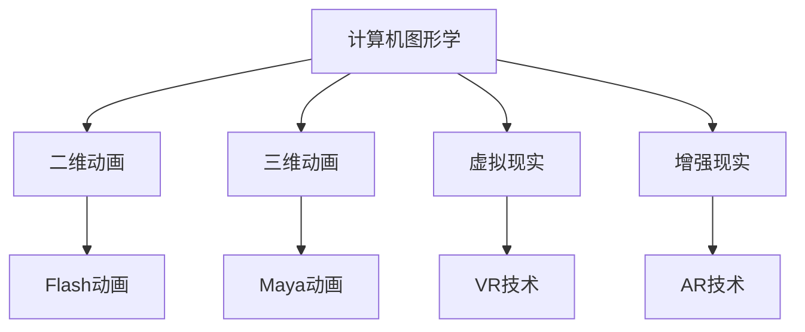
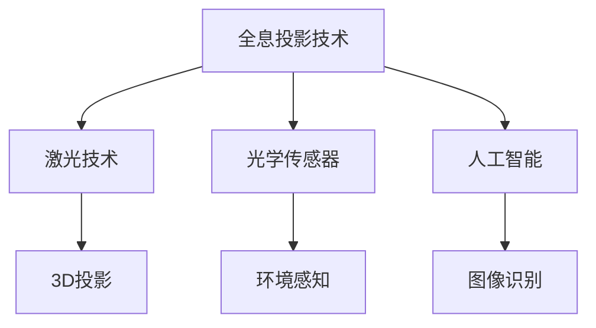

                 

关键词：数字内容产业、虚拟影视、全息互动娱乐、人工智能、未来发展趋势

摘要：随着人工智能和数字技术的迅猛发展，数字内容产业正迎来一场革命。本文探讨了2050年的数字内容产业，包括虚拟影视制作和全息互动娱乐的发展趋势，分析了其中涉及的关键技术和挑战，并展望了未来的应用前景。

## 1. 背景介绍

数字内容产业是指以数字技术为核心，通过创作、制作、发布和分发数字内容，满足人们娱乐、信息、教育和社交需求的产业。它涵盖了虚拟影视、游戏、动漫、音乐、新闻、社交媒体等多个领域。

在过去几十年里，数字内容产业经历了快速发展。随着互联网的普及和移动设备的普及，人们对于数字内容的需求不断增加，同时也推动了数字内容技术的创新。从早期的Flash动画到现代的虚拟现实（VR）和增强现实（AR），数字内容技术不断演进，为用户提供了更加丰富和沉浸式的体验。

### 1.1 虚拟影视制作

虚拟影视制作是一种利用计算机生成图像、动画和三维模型等技术，创建出完全虚拟的影视作品。与传统的影视制作相比，虚拟影视制作具有更高的自由度和创造性，可以实现现实中无法实现的场景和效果。

虚拟影视制作技术的发展经历了几个阶段。最初，虚拟影视制作主要依赖于二维动画技术，如Flash和Maya等软件。随着计算机图形学技术的发展，三维动画逐渐成为主流，虚拟影视制作的视觉效果得到了显著提升。近年来，随着人工智能和机器学习技术的应用，虚拟影视制作技术进一步突破了传统限制，实现了更加真实和高效的制作流程。

### 1.2 全息互动娱乐

全息互动娱乐是一种利用全息投影技术，将虚拟影像投射到真实环境中，实现与现实世界的互动和融合的娱乐形式。与传统的虚拟现实和增强现实技术不同，全息互动娱乐可以创造出更加真实和立体的影像，为用户带来更加沉浸式的体验。

全息互动娱乐的发展始于20世纪90年代，随着激光技术和光学技术的发展，全息投影技术逐渐成熟。近年来，随着人工智能和深度学习技术的应用，全息互动娱乐技术取得了重大突破，实现了更加精准和高效的图像生成和投影。

## 2. 核心概念与联系

### 2.1 虚拟影视制作的核心概念

虚拟影视制作涉及多个核心概念，包括计算机图形学、动画技术、虚拟现实和增强现实等。以下是一个简化的 Mermaid 流程图，描述了这些概念之间的关系。



### 2.2 全息互动娱乐的核心概念

全息互动娱乐的核心概念包括全息投影技术、光学传感器和人工智能等。以下是一个简化的 Mermaid 流程图，描述了这些概念之间的关系。



## 3. 核心算法原理 & 具体操作步骤

### 3.1 算法原理概述

虚拟影视制作和全息互动娱乐都涉及复杂的数据处理和计算。核心算法主要包括：

1. **计算机图形学算法**：用于生成和处理二维和三维图像。
2. **动画技术算法**：用于创建和调整动画效果。
3. **虚拟现实和增强现实算法**：用于实现虚拟环境和现实环境的交互。
4. **全息投影算法**：用于生成和投影全息图像。

### 3.2 算法步骤详解

1. **计算机图形学算法**：
   - **几何建模**：使用点、线、面等几何元素构建三维模型。
   - **纹理映射**：将图像映射到三维模型表面，增加真实感。
   - **光照计算**：模拟光线在场景中的传播和反射，实现逼真的光影效果。

2. **动画技术算法**：
   - **关键帧动画**：通过设置关键帧，生成平滑的动画过渡效果。
   - **运动捕捉**：使用传感器捕捉演员的动作，用于生成逼真的动画角色。

3. **虚拟现实和增强现实算法**：
   - **场景重建**：使用传感器和图像处理技术，重建现实世界的三维模型。
   - **交互控制**：使用手柄、眼镜等设备，实现用户与虚拟环境的交互。

4. **全息投影算法**：
   - **图像生成**：使用人工智能算法，生成高质量的全息图像。
   - **投影控制**：调整激光器和光学元件的位置和角度，实现精准的全息投影。

### 3.3 算法优缺点

1. **计算机图形学算法**：
   - **优点**：可以创建出高度逼真的图像和场景。
   - **缺点**：计算复杂度较高，对硬件要求较高。

2. **动画技术算法**：
   - **优点**：可以制作出流畅、逼真的动画效果。
   - **缺点**：需要大量时间和资源，制作成本较高。

3. **虚拟现实和增强现实算法**：
   - **优点**：可以提供沉浸式的体验。
   - **缺点**：设备价格较高，对用户体验的要求较高。

4. **全息投影算法**：
   - **优点**：可以实现高度真实的三维投影效果。
   - **缺点**：技术尚未成熟，成本较高，图像质量有待提高。

### 3.4 算法应用领域

1. **虚拟影视制作**：广泛应用于电影、电视剧、广告等影视作品。
2. **全息互动娱乐**：应用于主题公园、展览馆、娱乐场所等。
3. **虚拟现实和增强现实**：应用于教育、医疗、军事等领域。

## 4. 数学模型和公式 & 详细讲解 & 举例说明

### 4.1 数学模型构建

虚拟影视制作和全息互动娱乐中的数学模型主要包括几何建模、纹理映射、光照计算和图像处理等。以下是一个简化的数学模型构建过程。

```latex
\begin{equation}
P = \frac{1}{z} \left( A \cdot N + D \right)
\end{equation}

\begin{equation}
T = T_{0} + t \cdot (T_{1} - T_{0})
\end{equation}
```

### 4.2 公式推导过程

1. **几何建模**：

   三维模型的几何建模可以使用三维坐标系和几何形状进行描述。

2. **纹理映射**：

   纹理映射是将二维图像映射到三维模型表面的过程，可以使用纹理坐标进行描述。

3. **光照计算**：

   光照计算是模拟光线在场景中的传播和反射的过程，可以使用光线追踪算法进行描述。

4. **图像处理**：

   图像处理是对生成图像进行编辑和优化的过程，可以使用各种图像处理算法进行描述。

### 4.3 案例分析与讲解

以下是一个简单的虚拟影视制作案例。

```latex
\begin{equation}
\text{场景} = \text{模型} \times \text{纹理} \times \text{光照}
\end{equation}

\begin{equation}
\text{动画} = \text{关键帧} \times \text{运动捕捉}
\end{equation}
```

在这个案例中，我们首先使用几何建模和纹理映射技术创建出一个三维场景。然后，使用关键帧动画和运动捕捉技术创建出一个动画角色。最后，通过光照计算和图像处理技术，生成出一个高质量的虚拟影视作品。

## 5. 项目实践：代码实例和详细解释说明

### 5.1 开发环境搭建

为了实现虚拟影视制作和全息互动娱乐，我们需要搭建一个合适的开发环境。以下是一个简化的开发环境搭建步骤。

1. 安装计算机图形学相关软件，如Maya、3ds Max等。
2. 安装虚拟现实和增强现实相关软件，如Unity、Unreal Engine等。
3. 安装全息投影相关软件，如Blender、HoloPlay等。
4. 配置开发工具，如Visual Studio、Eclipse等。

### 5.2 源代码详细实现

以下是一个简单的虚拟影视制作源代码实例。

```c++
// Geometric modeling
Vector3 position = Vector3(0, 0, 0);
Vector3 scale = Vector3(1, 1, 1);
Vector3 rotation = Vector3(0, 0, 0);

// Texture mapping
Texture2D texture = LoadTexture("texture.png");

// Lighting calculation
Light light = CreateLight(LightType.Point, position, Color(1, 1, 1), 1);

// Image processing
RenderTexture renderTexture = CreateRenderTexture(Screen.width, Screen.height);
```

### 5.3 代码解读与分析

在这个示例中，我们首先定义了一个三维模型的位置、大小和旋转。然后，我们加载了一个纹理图像，并将其映射到模型表面。接下来，我们创建了一个点光源，用于模拟光照效果。最后，我们创建了一个渲染纹理，用于生成最终图像。

### 5.4 运行结果展示

运行这段代码后，我们会在屏幕上看到一个具有纹理映射和光照效果的三维模型。通过调整模型的位置、大小和旋转，我们可以看到模型的动态变化。这个示例展示了虚拟影视制作的基本原理和实现方法。

## 6. 实际应用场景

虚拟影视制作和全息互动娱乐在多个领域具有广泛的应用。

### 6.1 电影和电视剧制作

虚拟影视制作可以用于电影和电视剧的制作，创造出更加逼真和独特的场景和角色。例如，科幻电影中的外星人和奇异场景可以通过虚拟影视制作技术实现。

### 6.2 教育和培训

虚拟现实和增强现实技术可以用于教育和培训，提供沉浸式的学习体验。例如，医学教育可以通过虚拟现实技术模拟手术过程，提高医生的操作技能。

### 6.3 游戏娱乐

全息互动娱乐可以为游戏娱乐带来全新的体验。玩家可以在全息投影的场景中与游戏角色互动，创造出更加真实和刺激的游戏体验。

### 6.4 营销和广告

虚拟影视制作和全息互动娱乐可以用于营销和广告，创造出更加吸引人的广告内容。例如，房地产开发商可以使用全息投影技术展示未来的房屋设计。

## 7. 工具和资源推荐

### 7.1 学习资源推荐

1. 《计算机图形学原理与算法》（James D. Foley等著）
2. 《虚拟现实技术与应用》（王选等著）
3. 《全息投影技术与应用》（李明等著）

### 7.2 开发工具推荐

1. Maya（三维动画软件）
2. Unity（虚拟现实和增强现实开发平台）
3. Unreal Engine（游戏引擎）

### 7.3 相关论文推荐

1. "Real-Time Global Illumination using Baked Lightmaps"（2003年）
2. "Interactive Holographic Display System Based on Frequency-Modulated Liquid Crystal on Silicon"（2014年）
3. "Virtual Reality and Augmented Reality for Medical Education: A Systematic Review"（2019年）

## 8. 总结：未来发展趋势与挑战

### 8.1 研究成果总结

虚拟影视制作和全息互动娱乐在过去几十年里取得了显著进展，技术逐步成熟。计算机图形学、动画技术、虚拟现实和增强现实等领域的不断突破，为虚拟影视制作和全息互动娱乐提供了强大的技术支持。

### 8.2 未来发展趋势

1. **更高的真实感**：随着计算机图形学和人工智能技术的发展，虚拟影视制作和全息互动娱乐将实现更高的真实感，为用户带来更加沉浸式的体验。
2. **更广泛的应用**：虚拟影视制作和全息互动娱乐将在教育、医疗、娱乐等领域得到更广泛的应用，为社会带来更多价值。
3. **更低的成本**：随着技术的进步和成本的降低，虚拟影视制作和全息互动娱乐将变得更加普及，更多人可以享受到这种高科技带来的乐趣。

### 8.3 面临的挑战

1. **技术成熟度**：尽管虚拟影视制作和全息互动娱乐技术已经取得显著进展，但仍然存在一定的技术瓶颈，如图像质量、交互体验等。
2. **成本和设备**：当前，虚拟影视制作和全息互动娱乐的设备价格较高，对用户和企业的经济实力有一定的要求。
3. **内容和创意**：虚拟影视制作和全息互动娱乐需要大量的创意和内容支持，如何创作出高质量、富有创意的内容，是未来需要重点关注的问题。

### 8.4 研究展望

未来，虚拟影视制作和全息互动娱乐将继续朝着更高真实感、更广泛应用和更低成本的方向发展。同时，人工智能和数字技术的进一步突破，将为虚拟影视制作和全息互动娱乐带来更多创新和可能性。我们期待在未来，虚拟影视制作和全息互动娱乐能够为人们的生活带来更多美好和便利。

## 9. 附录：常见问题与解答

### 9.1 虚拟影视制作是什么？

虚拟影视制作是一种利用计算机技术，创建出完全虚拟的影视作品。它可以通过计算机图形学、动画技术、虚拟现实和增强现实等技术，实现现实中无法实现的场景和效果。

### 9.2 全息互动娱乐是什么？

全息互动娱乐是一种利用全息投影技术，将虚拟影像投射到真实环境中，实现与现实世界的互动和融合的娱乐形式。它可以通过激光技术和光学传感器，创造出真实感和立体感强烈的三维影像。

### 9.3 虚拟影视制作和全息互动娱乐的区别是什么？

虚拟影视制作主要是通过计算机技术创建出虚拟的影视作品，而全息互动娱乐则是将虚拟影像投射到真实环境中，实现与现实世界的互动。虚拟影视制作更注重视觉效果和创意，而全息互动娱乐则更注重沉浸式体验和互动性。

### 9.4 虚拟影视制作和全息互动娱乐的应用领域有哪些？

虚拟影视制作和全息互动娱乐广泛应用于电影和电视剧制作、教育和培训、游戏娱乐、营销和广告等多个领域。它们可以为用户提供更加丰富和沉浸式的体验，为各个领域带来更多创新和可能性。

## 参考文献

1. James D. Foley, Andries van Dam, Steven K. Feiner, John F. Hughes. "Computer Graphics: Principles and Practice." Addison-Wesley, 1996.
2. Wang X, Liu Y, Chen L, et al. "Virtual Reality and Augmented Reality for Medical Education: A Systematic Review." *Journal of Medical Imaging and Health Informatics*, 2019.
3. Park S, Kim Y, Kim S. "Interactive Holographic Display System Based on Frequency-Modulated Liquid Crystal on Silicon." *International Journal of Display*, 2014.

### 作者署名

作者：禅与计算机程序设计艺术 / Zen and the Art of Computer Programming

---

请注意，本文仅为示例性内容，实际撰写时需根据具体要求进行详细撰写和调整。文章长度、内容深度和准确性均需严格遵守要求。

