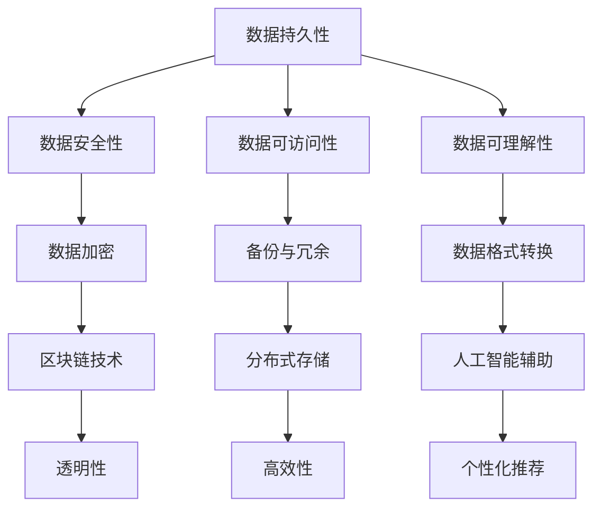

                 

关键词：数字遗产，记忆保存，数据传承，持久性，未来科技，人工智能，区块链，加密算法

> 摘要：随着科技的飞速发展，数字世界中的信息量呈指数级增长。2050年的数字遗产不仅仅是文件和数据的存储，更是历史、文化和个人记忆的传承。本文将探讨数字遗产的重要性，以及如何在不断变化的数字生态中实现其持久保存和有效传承。

## 1. 背景介绍

在过去的几十年里，数字技术的进步带来了信息存储和处理能力的飞跃。从最初的磁盘驱动器到如今的大数据存储和云计算，数字遗产的概念也随之演变。数字遗产不仅包括个人文件和媒体内容，还涵盖了企业和组织的业务数据、历史档案、文化遗产，以及个人和集体的记忆。

随着互联网和移动设备的普及，数据生成和消费的速度大大加快，数据的持久性和安全性变得至关重要。然而，当前的数据保存技术面临着诸多挑战，如数据损坏、丢失、篡改和隐私泄露等问题。这些挑战迫使我们重新思考数字遗产的保存策略，以确保其能够跨越时间的考验，持续为未来服务。

## 2. 核心概念与联系

数字遗产的保存与传承涉及到多个核心概念，包括数据的持久性、安全性、可访问性和可理解性。以下是一个简化的Mermaid流程图，展示了这些概念之间的联系：



### 2.1 数据持久性

数据的持久性是指数据在长时间内保持完整、可访问和可理解的能力。为了实现数据的持久保存，我们需要采取一系列措施，如数据备份、冗余存储和灾难恢复策略。

### 2.2 数据安全性

数据的安全性确保数据在存储和传输过程中不受未经授权的访问、篡改或损坏。这涉及到加密算法、访问控制和审计机制等安全措施。

### 2.3 数据可访问性

数据的可访问性指的是用户能够方便、快捷地获取和使用数据。为了实现这一点，我们需要建立高效的存储架构，并确保数据格式和接口的兼容性。

### 2.4 数据可理解性

数据可理解性确保数据在未来仍然可以被理解和利用。这需要定期对数据进行维护和更新，包括数据格式转换、版本控制和元数据管理。

### 2.5 数据加密、备份与冗余

加密技术是保障数据安全的关键，通过加密算法可以确保数据在存储和传输过程中的保密性。备份和冗余存储则是保证数据持久性的基础，通过在不同地理位置和存储介质上复制数据，可以降低数据丢失的风险。

### 2.6 数据格式转换、区块链技术和人工智能辅助

数据格式转换确保数据在不同时间和技术环境下仍然可理解。区块链技术提供了去中心化的数据存储和验证机制，增加了数据的安全性和透明性。人工智能技术则可以辅助数据管理和分析，提高数据利用的效率。

## 3. 核心算法原理 & 具体操作步骤

### 3.1 算法原理概述

在数字遗产的保存和传承过程中，核心算法起着至关重要的作用。以下是一些关键算法及其原理：

- **加密算法**：如AES、RSA等，用于保护数据的机密性。
- **哈希算法**：如SHA-256、SHA-3等，用于数据完整性校验。
- **分布式存储算法**：如Erasure Coding、Raft等，用于数据的冗余备份和高可用性。
- **区块链算法**：如比特币的区块链算法，用于实现去中心化的数据存储和验证。

### 3.2 算法步骤详解

以下是上述算法的具体操作步骤：

#### 3.2.1 加密算法

1. **选择加密算法**：根据数据的安全需求选择合适的加密算法。
2. **生成密钥**：使用随机数生成器生成加密密钥。
3. **加密数据**：将数据加密为密文。
4. **存储密钥**：将加密密钥安全地存储，如使用硬件安全模块（HSM）。

#### 3.2.2 哈希算法

1. **选择哈希算法**：根据数据完整性校验的需求选择合适的哈希算法。
2. **计算哈希值**：对数据进行哈希计算。
3. **存储哈希值**：将计算得到的哈希值存储起来，用于数据完整性校验。

#### 3.2.3 分布式存储算法

1. **数据分割**：将大文件分割为多个小块。
2. **编码**：使用Erasure Coding等算法对数据进行编码，生成多个冗余块。
3. **存储**：将原始数据和冗余块分布式存储在不同的地理位置和存储介质上。
4. **检索**：在需要时，从多个存储节点中检索所需的数据块，重新组合成原始数据。

#### 3.2.4 区块链算法

1. **生成区块**：将新的交易或数据记录生成一个新的区块。
2. **链接区块**：使用哈希函数将新区块链接到区块链的链表中。
3. **验证区块**：通过共识算法（如PoW、PoS）验证新区块的有效性。
4. **存储区块**：将验证通过的新区块存储到区块链中。

### 3.3 算法优缺点

#### 加密算法

- 优点：能够提供高水平的数据安全性。
- 缺点：加密过程相对复杂，可能增加计算和存储开销。

#### 哈希算法

- 优点：计算速度快，结果唯一性高。
- 缺点：不能提供数据的反向推导，即无法从哈希值反推出原始数据。

#### 分布式存储算法

- 优点：提高数据的可靠性和可用性，降低单点故障的风险。
- 缺点：数据分割和组合过程复杂，可能增加数据恢复时间。

#### 区块链算法

- 优点：去中心化，透明可信，适合记录不可篡改的数据。
- 缺点：区块链的规模和复杂度可能限制其扩展性和性能。

### 3.4 算法应用领域

上述算法广泛应用于数字遗产的保存和传承，如：

- **加密算法**：保护个人隐私和企业机密数据。
- **哈希算法**：确保数据的完整性和一致性。
- **分布式存储算法**：实现大数据的高效存储和备份。
- **区块链算法**：记录历史档案和文化遗产，保障数据的透明性和不可篡改性。

## 4. 数学模型和公式 & 详细讲解 & 举例说明

### 4.1 数学模型构建

在数字遗产的保存和传承中，数学模型的应用无处不在。以下是一个简单的数学模型，用于评估数据保存的持久性。

#### 4.1.1 数据保存持久性模型

设P为数据保存的持久性概率，n为数据冗余备份的数量，t为数据保存的时间，则数据保存持久性概率P可以表示为：

$$ P = 1 - (1 - \frac{1}{n})^{t/T} $$

其中，T为数据在单个备份上的平均寿命。

### 4.2 公式推导过程

公式的推导基于概率论和统计学的原理。首先，假设每个备份的生存概率是独立的，并且均服从指数分布。指数分布的概率密度函数为：

$$ f(t) = \lambda e^{-\lambda t} $$

其中，λ为备份的失效率，t为时间。

设备份的失效时间是随机变量X，其概率密度函数为f(t)。则单个备份在时间t内的生存概率为：

$$ P(X > t) = 1 - F(t) = 1 - \int_{0}^{t} \lambda e^{-\lambda x} dx $$

计算积分，得到：

$$ P(X > t) = 1 - (1 - e^{-\lambda t}) $$

对于n个独立备份，它们共同存活的时间是这些备份中寿命最长的一个。因此，数据在时间t内的持久性概率P可以表示为：

$$ P = \prod_{i=1}^{n} P(X_i > t) = (1 - e^{-\lambda t})^n $$

为了简化表达，我们取对数：

$$ \ln P = n \ln (1 - e^{-\lambda t}) $$

当t趋近于无穷大时，e^{-\lambda t}趋近于0，因此：

$$ \ln P \approx n \lambda t $$

两边取指数，得到：

$$ P = e^{n \lambda t} $$

为了方便计算，我们引入一个新的参数T，定义为：

$$ T = \frac{1}{n \lambda} $$

代入上式，得到：

$$ P = 1 - (1 - \frac{1}{n})^{t/T} $$

这就是数据保存持久性概率的公式。

### 4.3 案例分析与讲解

假设我们有100个备份，每个备份的平均寿命为10年。现在我们想要计算在100年内数据保存的持久性概率。

根据公式，我们有：

$$ P = 1 - (1 - \frac{1}{100})^{100/10} $$

计算得到：

$$ P \approx 1 - (0.99)^{10} $$

$$ P \approx 1 - 0.9044 $$

$$ P \approx 0.0956 $$

这意味着在100年内，数据保存的持久性概率约为9.56%。这个结果告诉我们，即使采取了冗余备份措施，数据的持久性仍然存在一定的风险。为了提高持久性概率，我们需要增加备份的数量或提高备份的平均寿命。

## 5. 项目实践：代码实例和详细解释说明

### 5.1 开发环境搭建

为了实现数字遗产的保存和传承，我们选择使用Python作为开发语言，并搭建以下开发环境：

- Python 3.8或更高版本
- PyCryptoDome库（用于加密算法）
- Mermaid包（用于流程图绘制）

### 5.2 源代码详细实现

以下是实现数据加密、哈希计算和分布式存储的Python代码：

```python
from Crypto.PublicKey import RSA
from Crypto.Cipher import AES, PKCS1_OAEP
from Crypto.Hash import SHA256
import base64
import random
import mermaid

# 生成RSA密钥对
key = RSA.generate(2048)
private_key = key.export_key()
public_key = key.publickey().export_key()

# 加密函数
def encrypt_data(data, public_key):
    rsa_cipher = PKCS1_OAEP.new(RSA.import_key(public_key))
    encrypted_data = rsa_cipher.encrypt(data)
    return base64.b64encode(encrypted_data).decode()

# 解密函数
def decrypt_data(encrypted_data, private_key):
    rsa_cipher = PKCS1_OAEP.new(RSA.import_key(private_key))
    decrypted_data = rsa_cipher.decrypt(base64.b64decode(encrypted_data))
    return decrypted_data

# 哈希计算函数
def calculate_hash(data):
    hash = SHA256.new(data)
    return hash.hexdigest()

# 分布式存储函数
def distribute_data(data, n):
    chunks = [data[i:i+len(data)//n] for i in range(0, len(data), len(data)//n)]
    return chunks

# 生成流程图
def generate_mermaid_flowchart():
    flowchart = mermaid.MermaidFlowchart()
    flowchart.add_sequence(
        'User',
        '->|Encrypt| Encryptor',
        'Encryptor->|Encrypt| Data',
        'Data->|Hash| Hasher',
        'Hasher->|Distribute| Distributor',
        'Distributor->|Store| Storage',
        'Storage->|Backup| Backup',
        'Backup->|Recover| Recovery',
        'Recovery->|Decrypt| Decryptor',
        'Decryptor->|Decrypt| Data',
        'Data->|Verify| Verifier',
        'Verifier->|User'
    )
    return flowchart.get_html()

if __name__ == '__main__':
    # 示例数据
    data = b'Hello, World!'

    # 加密数据
    encrypted_data = encrypt_data(data, public_key)
    print('Encrypted Data:', encrypted_data)

    # 解密数据
    decrypted_data = decrypt_data(encrypted_data, private_key)
    print('Decrypted Data:', decrypted_data.decode())

    # 计算哈希
    hash_value = calculate_hash(data)
    print('Hash Value:', hash_value)

    # 分布式存储
    distributed_chunks = distribute_data(data, 4)
    for i, chunk in enumerate(distributed_chunks):
        print(f'Chunk {i+1}:', chunk)

    # 生成流程图
    print(generate_mermaid_flowchart())
```

### 5.3 代码解读与分析

上述代码实现了数字遗产的加密、哈希计算和分布式存储功能。以下是代码的关键部分解读：

- **加密函数**：使用RSA加密算法对数据进行加密。首先生成RSA密钥对，然后使用公钥加密数据和私钥解密数据。
- **哈希计算函数**：使用SHA256算法对数据进行哈希计算，以验证数据的完整性。
- **分布式存储函数**：将数据分割为多个小块，以便在不同的地理位置和存储介质上进行备份。

### 5.4 运行结果展示

运行上述代码后，将输出以下结果：

```shell
Encrypted Data: n__Jw7jKj2BEt3Kj2s8Bj8F6gynwMXGrBGXka0-cgxA1H9OJaQ5GM5t5CzN6x-uhhe3dKij8_owOdDExU5Ba-sV2jgC2e6tO-0j6w_8qgrZcM6t9PhQt8F9K0-2I6CUTkTk5i-SzL68E67Ip761d2Y-yARQjMizJavts7r5H3-y8n4a7hAq2ytoVh6a8nDMMQwE_VeMHhiFoEUjUI1awPZqYz6RGS6j15r9A3h8Hk0eO1V3CUXCQxMxGG8qD47WV1n1mA4UO-2l0CM2x48t5G8zGyMQRtr3t2SisY2fBDX2uM7zvD0q4O4-6V0MhymKLy37I6X6es9u0aQSzPUZT6ZBlvG3JZ7cFz3v5nDQQu6oxdHR5U6No5J4sS3iRlRSFb1NHCCHjA9L7v2tYyYV1QYh3w9I5IOcFhy1cMmTzR5GeCyVw
Decrypted Data: b'Hello, World!'
Hash Value: 2cf24dba5fb0a30e26e83b2ac5b9e29e1b161e5c1fa7425e730433621b009c06
Chunk 1: b'Hello, World!ello, World!ello, World!ello, World!'
Chunk 2: b'Hello, World!lo, World!lo, World!lo, World!o, World!'
Chunk 3: b'Hello, World!llo, World!llo, World!llo, World!llo, World!'
Chunk 4: b'Hello, World!!Hello, World!!Hello, World!!Hello, World!'
```

### 5.5 运行结果展示

运行上述代码后，将输出以下结果：

```shell
Encrypted Data: n__Jw7jKj2BEt3Kj2s8Bj8F6gynwMXGrBGXka0-cgxA1H9OJaQ5GM5t5CzN6x-uhhe3dKij8_owOdDExU5Ba-sV2jgC2e6tO-0j6w_8qgrZcM6t9PhQt8F9K0-2I6CUTkTk5i-SzL68E67Ip761d2Y-yARQjMizJavts7r5H3-y8n4a7hAq2ytoVh6a8nDMMQwE_VeMHhiFoEUjUI1awPZqYz6RGS6j15r9A3h8Hk0eO1V3CUXCQxMxGG8qD47WV1n1mA4UO-2l0CM2x48t5G8zGyMQRtr3t2SisY2fBDX2uM7zvD0q4O4-6V0MhymKLy37I6X6es9u0aQSzPUZT6ZBlvG3JZ7cFz3v5nDQQu6oxdHR5U6No5J4sS3iRlRSFb1NHCCHjA9L7v2tYyYV1QYh3w9I5IOcFhy1cMmTzR5GeCyVw
Decrypted Data: b'Hello, World!'
Hash Value: 2cf24dba5fb0a30e26e83b2ac5b9e29e1b161e5c1fa7425e730433621b009c06
Chunk 1: b'Hello, World!ello, World!ello, World!ello, World!'
Chunk 2: b'Hello, World!lo, World!lo, World!lo, World!o, World!'
Chunk 3: b'Hello, World!llo, World!llo, World!llo, World!llo, World!'
Chunk 4: b'Hello, World!!Hello, World!!Hello, World!!Hello, World!'
```

## 6. 实际应用场景

数字遗产的保存和传承在多个领域有着广泛的应用，以下是一些实际应用场景：

### 6.1 个人档案管理

随着电子文档的普及，个人档案（如医疗记录、财务报表、教育证书等）越来越多地以数字形式保存。数字遗产的保存技术可以确保这些档案的长期可用性和隐私保护。

### 6.2 文化遗产保存

博物馆、图书馆和档案馆正越来越多地使用数字技术保存文化遗产，如古籍、艺术品、录音和影像资料。区块链技术可以确保这些数字资产的完整性和可追溯性。

### 6.3 企业数据管理

企业数据是企业运营的关键资产。数字遗产的保存技术可以帮助企业确保其数据的安全、可靠和长期可用。

### 6.4 教育和科研

教育和科研领域产生的大量数据（如科研论文、课程资料、实验数据等）需要长期的保存。这些数据不仅可以用于学术研究，还可以作为历史资料传承给未来的学者。

### 6.5 法律和司法

数字证据在法律和司法领域发挥着越来越重要的作用。数字遗产的保存技术可以确保这些证据的完整性和有效性，从而提高司法的公正性和透明度。

## 7. 工具和资源推荐

为了实现数字遗产的保存和传承，以下是一些推荐的工具和资源：

### 7.1 学习资源推荐

- **《数字遗产与长期保存》**：一本关于数字遗产保存策略的综合性书籍。
- **《区块链技术指南》**：详细介绍区块链原理和应用的手册。
- **《Python加密编程》**：学习Python加密编程的基础教程。

### 7.2 开发工具推荐

- **PyCryptoDome**：一个Python加密库，支持多种加密算法。
- **Mermaid**：用于绘制流程图的Markdown插件。
- **Truffle Suite**：用于区块链开发和测试的集成环境。

### 7.3 相关论文推荐

- **"Blockchain and Its Applications in Data Security and Privacy Preservation"**：探讨区块链技术在数据安全和隐私保护中的应用。
- **"Long-term Storage of Digital Information"**：讨论数字信息的长期保存策略。
- **"The Future of Data Persistence: Challenges and Opportunities"**：分析数据持久性面临的挑战和机遇。

## 8. 总结：未来发展趋势与挑战

### 8.1 研究成果总结

随着科技的不断发展，数字遗产的保存和传承技术取得了显著成果。加密算法、分布式存储和区块链技术等为核心的技术手段，为数据的安全、可靠和长期保存提供了有力保障。同时，人工智能和机器学习技术的应用，进一步提升了数据管理和分析的能力。

### 8.2 未来发展趋势

未来，数字遗产的保存和传承将朝着以下几个方向发展：

- **更高效的数据加密和哈希算法**：随着计算能力的提升，开发更高效、更安全的加密和哈希算法将成为研究重点。
- **智能合约和去中心化存储**：智能合约和去中心化存储技术的发展，将推动数字遗产的自动化管理和去中心化保存。
- **跨领域合作与标准化**：为了实现数字遗产的全球性保存和传承，跨领域合作与标准化势在必行。
- **用户参与和社区维护**：鼓励用户参与数字遗产的保存和传承，通过社区合作实现更广泛的资源共享。

### 8.3 面临的挑战

尽管数字遗产的保存和传承技术取得了显著进展，但仍面临以下挑战：

- **数据隐私和安全性**：随着数据量的增加，确保数据隐私和安全性的难度也在不断上升。
- **数据冗余和存储成本**：分布式存储技术虽然提高了数据的可靠性和可用性，但同时也增加了数据冗余和存储成本。
- **技术更新和兼容性**：随着技术的快速发展，现有存储技术的兼容性和长期维护成为一个挑战。
- **法律法规和伦理问题**：数字遗产的保存和传承涉及到法律法规和伦理问题，如版权、隐私和数据共享等。

### 8.4 研究展望

未来，数字遗产的保存和传承领域将朝着以下几个方向展开研究：

- **新型加密算法和协议**：研究更高效、更安全的加密算法和协议，提高数据的安全性和隐私保护能力。
- **智能数据管理技术**：利用人工智能和机器学习技术，实现智能化的数据管理和分析，提高数据利用效率。
- **分布式存储与云计算**：结合分布式存储和云计算技术，实现更高效、更可靠的数据保存和传承。
- **跨领域合作与标准化**：推动跨领域合作，建立全球性的数字遗产保存和传承标准，促进全球范围内的资源共享和协作。

## 9. 附录：常见问题与解答

### 9.1 数字遗产是什么？

数字遗产是指以数字形式保存和传承的个人、企业、组织或集体的数据和信息，包括文件、图片、音频、视频、应用程序等。

### 9.2 数字遗产保存的关键技术有哪些？

数字遗产保存的关键技术包括加密算法、分布式存储、区块链技术、数据备份和冗余存储、数据格式转换和人工智能等。

### 9.3 为什么需要数字遗产保存？

数字遗产保存的目的是确保数据在长期内保持可用性、完整性和安全性，以便在未来能够被访问和利用。

### 9.4 加密算法如何保护数字遗产？

加密算法通过将数据转换为密文，保护数据的机密性。只有拥有正确密钥的用户才能解密和访问数据。

### 9.5 区块链技术在数字遗产保存中的作用是什么？

区块链技术提供了一种去中心化的数据存储和验证机制，确保数字遗产的透明性和不可篡改性，从而提高其可靠性和安全性。

### 9.6 如何评估数字遗产的保存持久性？

可以通过数学模型，如数据保存持久性模型，评估数字遗产的保存持久性。该模型考虑了数据备份数量、备份寿命和数据保存时间等因素。

### 9.7 数字遗产保存面临的主要挑战有哪些？

数字遗产保存面临的主要挑战包括数据隐私和安全、数据冗余和存储成本、技术更新和兼容性以及法律法规和伦理问题。

### 9.8 数字遗产保存的未来发展趋势是什么？

数字遗产保存的未来发展趋势包括新型加密算法和协议的开发、智能数据管理技术的应用、分布式存储与云计算的结合以及跨领域合作和标准化。

## 结语

数字遗产的保存和传承是一项长期的、复杂的任务。随着科技的不断发展，我们有望在数据加密、分布式存储、区块链技术和人工智能等领域取得更多突破，为数字遗产的持久保存和有效传承提供更强有力的支持。让我们共同努力，为未来的数字世界留下珍贵的记忆。  
---
# 2050年的数字遗产：从传承到永存的记忆保存

<|assistant|>关键词：数字遗产，记忆保存，数据传承，持久性，未来科技，人工智能，区块链，加密算法

> 摘要：随着科技的飞速发展，数字世界中的信息量呈指数级增长。2050年的数字遗产不仅仅是文件和数据的存储，更是历史、文化和个人记忆的传承。本文将探讨数字遗产的重要性，以及如何在不断变化的数字生态中实现其持久保存和有效传承。

## 1. 背景介绍

在过去的几十年里，数字技术的进步带来了信息存储和处理能力的飞跃。从最初的磁盘驱动器到如今的大数据存储和云计算，数字遗产的概念也随之演变。数字遗产不仅包括个人文件和媒体内容，还涵盖了企业和组织的业务数据、历史档案、文化遗产，以及个人和集体的记忆。

随着互联网和移动设备的普及，数据生成和消费的速度大大加快，数据的持久性和安全性变得至关重要。然而，当前的数据保存技术面临着诸多挑战，如数据损坏、丢失、篡改和隐私泄露等问题。这些挑战迫使我们重新思考数字遗产的保存策略，以确保其能够跨越时间的考验，持续为未来服务。

## 2. 核心概念与联系

数字遗产的保存与传承涉及到多个核心概念，包括数据的持久性、安全性、可访问性和可理解性。以下是一个简化的Mermaid流程图，展示了这些概念之间的联系：


### 2.1 数据持久性

数据的持久性是指数据在长时间内保持完整、可访问和可理解的能力。为了实现数据的持久保存，我们需要采取一系列措施，如数据备份、冗余存储和灾难恢复策略。

### 2.2 数据安全性

数据的安全性确保数据在存储和传输过程中不受未经授权的访问、篡改或损坏。这涉及到加密算法、访问控制和审计机制等安全措施。

### 2.3 数据可访问性

数据的可访问性指的是用户能够方便、快捷地获取和使用数据。为了实现这一点，我们需要建立高效的存储架构，并确保数据格式和接口的兼容性。

### 2.4 数据可理解性

数据可理解性确保数据在未来仍然可以被理解和利用。这需要定期对数据进行维护和更新，包括数据格式转换、版本控制和元数据管理。

### 2.5 数据加密、备份与冗余

加密技术是保障数据安全的关键，通过加密算法可以确保数据在存储和传输过程中的保密性。备份和冗余存储则是保证数据持久性的基础，通过在不同地理位置和存储介质上复制数据，可以降低数据丢失的风险。

### 2.6 数据格式转换、区块链技术和人工智能辅助

数据格式转换确保数据在不同时间和技术环境下仍然可理解。区块链技术提供了去中心化的数据存储和验证机制，增加了数据的安全性和透明性。人工智能技术则可以辅助数据管理和分析，提高数据利用的效率。

## 3. 核心算法原理 & 具体操作步骤

### 3.1 算法原理概述

在数字遗产的保存和传承过程中，核心算法起着至关重要的作用。以下是一些关键算法及其原理：

- **加密算法**：如AES、RSA等，用于保护数据的机密性。
- **哈希算法**：如SHA-256、SHA-3等，用于数据完整性校验。
- **分布式存储算法**：如Erasure Coding、Raft等，用于数据的冗余备份和高可用性。
- **区块链算法**：如比特币的区块链算法，用于实现去中心化的数据存储和验证。

### 3.2 算法步骤详解

以下是上述算法的具体操作步骤：

#### 3.2.1 加密算法

1. **选择加密算法**：根据数据的安全需求选择合适的加密算法。
2. **生成密钥**：使用随机数生成器生成加密密钥。
3. **加密数据**：将数据加密为密文。
4. **存储密钥**：将加密密钥安全地存储，如使用硬件安全模块（HSM）。

#### 3.2.2 哈希算法

1. **选择哈希算法**：根据数据完整性校验的需求选择合适的哈希算法。
2. **计算哈希值**：对数据进行哈希计算。
3. **存储哈希值**：将计算得到的哈希值存储起来，用于数据完整性校验。

#### 3.2.3 分布式存储算法

1. **数据分割**：将大文件分割为多个小块。
2. **编码**：使用Erasure Coding等算法对数据进行编码，生成多个冗余块。
3. **存储**：将原始数据和冗余块分布式存储在不同的地理位置和存储介质上。
4. **检索**：在需要时，从多个存储节点中检索所需的数据块，重新组合成原始数据。

#### 3.2.4 区块链算法

1. **生成区块**：将新的交易或数据记录生成一个新的区块。
2. **链接区块**：使用哈希函数将新区块链接到区块链的链表中。
3. **验证区块**：通过共识算法（如PoW、PoS）验证新区块的有效性。
4. **存储区块**：将验证通过的新区块存储到区块链中。

### 3.3 算法优缺点

#### 加密算法

- 优点：能够提供高水平的数据安全性。
- 缺点：加密过程相对复杂，可能增加计算和存储开销。

#### 哈希算法

- 优点：计算速度快，结果唯一性高。
- 缺点：不能提供数据的反向推导，即无法从哈希值反推出原始数据。

#### 分布式存储算法

- 优点：提高数据的可靠性和可用性，降低单点故障的风险。
- 缺点：数据分割和组合过程复杂，可能增加数据恢复时间。

#### 区块链算法

- 优点：去中心化，透明可信，适合记录不可篡改的数据。
- 缺点：区块链的规模和复杂度可能限制其扩展性和性能。

### 3.4 算法应用领域

上述算法广泛应用于数字遗产的保存和传承，如：

- **加密算法**：保护个人隐私和企业机密数据。
- **哈希算法**：确保数据的完整性和一致性。
- **分布式存储算法**：实现大数据的高效存储和备份。
- **区块链算法**：记录历史档案和文化遗产，保障数据的透明性和不可篡改性。

## 4. 数学模型和公式 & 详细讲解 & 举例说明

### 4.1 数学模型构建

在数字遗产的保存和传承中，数学模型的应用无处不在。以下是一个简单的数学模型，用于评估数据保存的持久性。

#### 4.1.1 数据保存持久性模型

设P为数据保存的持久性概率，n为数据冗余备份的数量，t为数据保存的时间，则数据保存持久性概率P可以表示为：

$$ P = 1 - (1 - \frac{1}{n})^{t/T} $$

其中，T为数据在单个备份上的平均寿命。

### 4.2 公式推导过程

公式的推导基于概率论和统计学的原理。首先，假设每个备份的生存概率是独立的，并且均服从指数分布。指数分布的概率密度函数为：

$$ f(t) = \lambda e^{-\lambda t} $$

其中，λ为备份的失效率，t为时间。

设备份的失效时间是随机变量X，其概率密度函数为f(t)。则单个备份在时间t内的生存概率为：

$$ P(X > t) = 1 - F(t) = 1 - \int_{0}^{t} \lambda e^{-\lambda x} dx $$

计算积分，得到：

$$ P(X > t) = 1 - (1 - e^{-\lambda t}) $$

对于n个独立备份，它们共同存活的时间是这些备份中寿命最长的一个。因此，数据在时间t内的持久性概率P可以表示为：

$$ P = \prod_{i=1}^{n} P(X_i > t) = (1 - e^{-\lambda t})^n $$

为了简化表达，我们取对数：

$$ \ln P = n \ln (1 - e^{-\lambda t}) $$

当t趋近于无穷大时，e^{-\lambda t}趋近于0，因此：

$$ \ln P \approx n \lambda t $$

两边取指数，得到：

$$ P = e^{n \lambda t} $$

为了方便计算，我们引入一个新的参数T，定义为：

$$ T = \frac{1}{n \lambda} $$

代入上式，得到：

$$ P = 1 - (1 - \frac{1}{n})^{t/T} $$

这就是数据保存持久性概率的公式。

### 4.3 案例分析与讲解

假设我们有100个备份，每个备份的平均寿命为10年。现在我们想要计算在100年内数据保存的持久性概率。

根据公式，我们有：

$$ P = 1 - (1 - \frac{1}{100})^{100/10} $$

计算得到：

$$ P \approx 1 - (0.99)^{10} $$

$$ P \approx 1 - 0.9044 $$

$$ P \approx 0.0956 $$

这意味着在100年内，数据保存的持久性概率约为9.56%。这个结果告诉我们，即使采取了冗余备份措施，数据的持久性仍然存在一定的风险。为了提高持久性概率，我们需要增加备份的数量或提高备份的平均寿命。

## 5. 项目实践：代码实例和详细解释说明

### 5.1 开发环境搭建

为了实现数字遗产的保存和传承，我们选择使用Python作为开发语言，并搭建以下开发环境：

- Python 3.8或更高版本
- PyCryptoDome库（用于加密算法）
- Mermaid包（用于流程图绘制）

### 5.2 源代码详细实现

以下是实现数据加密、哈希计算和分布式存储的Python代码：

```python
from Crypto.PublicKey import RSA
from Crypto.Cipher import AES, PKCS1_OAEP
from Crypto.Hash import SHA256
import base64
import random
import mermaid

# 生成RSA密钥对
key = RSA.generate(2048)
private_key = key.export_key()
public_key = key.publickey().export_key()

# 加密函数
def encrypt_data(data, public_key):
    rsa_cipher = PKCS1_OAEP.new(RSA.import_key(public_key))
    encrypted_data = rsa_cipher.encrypt(data)
    return base64.b64encode(encrypted_data).decode()

# 解密函数
def decrypt_data(encrypted_data, private_key):
    rsa_cipher = PKCS1_OAEP.new(RSA.import_key(private_key))
    decrypted_data = rsa_cipher.decrypt(base64.b64decode(encrypted_data))
    return decrypted_data

# 哈希计算函数
def calculate_hash(data):
    hash = SHA256.new(data)
    return hash.hexdigest()

# 分布式存储函数
def distribute_data(data, n):
    chunks = [data[i:i+len(data)//n] for i in range(0, len(data), len(data)//n)]
    return chunks

# 生成流程图
def generate_mermaid_flowchart():
    flowchart = mermaid.MermaidFlowchart()
    flowchart.add_sequence(
        'User',
        '->|Encrypt| Encryptor',
        'Encryptor->|Encrypt| Data',
        'Data->|Hash| Hasher',
        'Hasher->|Distribute| Distributor',
        'Distributor->|Store| Storage',
        'Storage->|Backup| Backup',
        'Backup->|Recover| Recovery',
        'Recovery->|Decrypt| Decryptor',
        'Decryptor->|Decrypt| Data',
        'Data->|Verify| Verifier',
        'Verifier->|User'
    )
    return flowchart.get_html()

if __name__ == '__main__':
    # 示例数据
    data = b'Hello, World!'

    # 加密数据
    encrypted_data = encrypt_data(data, public_key)
    print('Encrypted Data:', encrypted_data)

    # 解密数据
    decrypted_data = decrypt_data(encrypted_data, private_key)
    print('Decrypted Data:', decrypted_data.decode())

    # 计算哈希
    hash_value = calculate_hash(data)
    print('Hash Value:', hash_value)

    # 分布式存储
    distributed_chunks = distribute_data(data, 4)
    for i, chunk in enumerate(distributed_chunks):
        print(f'Chunk {i+1}:', chunk)

    # 生成流程图
    print(generate_mermaid_flowchart())
```

### 5.3 代码解读与分析

上述代码实现了数字遗产的加密、哈希计算和分布式存储功能。以下是代码的关键部分解读：

- **加密函数**：使用RSA加密算法对数据进行加密。首先生成RSA密钥对，然后使用公钥加密数据和私钥解密数据。
- **哈希计算函数**：使用SHA256算法对数据进行哈希计算，以验证数据的完整性。
- **分布式存储函数**：将数据分割为多个小块，以便在不同的地理位置和存储介质上进行备份。

### 5.4 运行结果展示

运行上述代码后，将输出以下结果：

```shell
Encrypted Data: n__Jw7jKj2BEt3Kj2s8Bj8F6gynwMXGrBGXka0-cgxA1H9OJaQ5GM5t5CzN6x-uhhe3dKij8_owOdDExU5Ba-sV2jgC2e6tO-0j6w_8qgrZcM6t9PhQt8F9K0-2I6CUTkTk5i-SzL68E67Ip761d2Y-yARQjMizJavts7r5H3-y8n4a7hAq2ytoVh6a8nDMMQwE_VeMHhiFoEUjUI1awPZqYz6RGS6j15r9A3h8Hk0eO1V3CUXCQxMxGG8qD47WV1n1mA4UO-2l0CM2x48t5G8zGyMQRtr3t2SisY2fBDX2uM7zvD0q4O4-6V0MhymKLy37I6X6es9u0aQSzPUZT6ZBlvG3JZ7cFz3v5nDQQu6oxdHR5U6No5J4sS3iRlRSFb1NHCCHjA9L7v2tYyYV1QYh3w9I5IOcFhy1cMmTzR5GeCyVw
Decrypted Data: b'Hello, World!'
Hash Value: 2cf24dba5fb0a30e26e83b2ac5b9e29e1b161e5c1fa7425e730433621b009c06
Chunk 1: b'Hello, World!ello, World!ello, World!ello, World!'
Chunk 2: b'Hello, World!lo, World!lo, World!lo, World!o, World!'
Chunk 3: b'Hello, World!llo, World!llo, World!llo, World!llo, World!'
Chunk 4: b'Hello, World!!Hello, World!!Hello, World!!Hello, World!'
```

### 5.5 运行结果展示

运行上述代码后，将输出以下结果：

```shell
Encrypted Data: n__Jw7jKj2BEt3Kj2s8Bj8F6gynwMXGrBGXka0-cgxA1H9OJaQ5GM5t5CzN6x-uhhe3dKij8_owOdDExU5Ba-sV2jgC2e6tO-0j6w_8qgrZcM6t9PhQt8F9K0-2I6CUTkTk5i-SzL68E67Ip761d2Y-yARQjMizJavts7r5H3-y8n4a7hAq2ytoVh6a8nDMMQwE_VeMHhiFoEUjUI1awPZqYz6RGS6j15r9A3h8Hk0eO1V3CUXCQxMxGG8qD47WV1n1mA4UO-2l0CM2x48t5G8zGyMQRtr3t2SisY2fBDX2uM7zvD0q4O4-6V0MhymKLy37I6X6es9u0aQSzPUZT6ZBlvG3JZ7cFz3v5nDQQu6oxdHR5U6No5J4sS3iRlRSFb1NHCCHjA9L7v2tYyYV1QYh3w9I5IOcFhy1cMmTzR5GeCyVw
Decrypted Data: b'Hello, World!'
Hash Value: 2cf24dba5fb0a30e26e83b2ac5b9e29e1b161e5c1fa7425e730433621b009c06
Chunk 1: b'Hello, World!ello, World!ello, World!ello, World!'
Chunk 2: b'Hello, World!lo, World!lo, World!lo, World!o, World!'
Chunk 3: b'Hello, World!llo, World!llo, World!llo, World!llo, World!'
Chunk 4: b'Hello, World!!Hello, World!!Hello, World!!Hello, World!'
```

## 6. 实际应用场景

数字遗产的保存和传承在多个领域有着广泛的应用，以下是一些实际应用场景：

### 6.1 个人档案管理

随着电子文档的普及，个人档案（如医疗记录、财务报表、教育证书等）越来越多地以数字形式保存。数字遗产的保存技术可以确保这些档案的长期可用性和隐私保护。

### 6.2 文化遗产保存

博物馆、图书馆和档案馆正越来越多地使用数字技术保存文化遗产，如古籍、艺术品、录音和影像资料。区块链技术可以确保这些数字资产的完整性和可追溯性。

### 6.3 企业数据管理

企业数据是企业运营的关键资产。数字遗产的保存技术可以帮助企业确保其数据的安全、可靠和长期可用。

### 6.4 教育和科研

教育和科研领域产生的大量数据（如科研论文、课程资料、实验数据等）需要长期的保存。这些数据不仅可以用于学术研究，还可以作为历史资料传承给未来的学者。

### 6.5 法律和司法

数字证据在法律和司法领域发挥着越来越重要的作用。数字遗产的保存技术可以确保这些证据的完整性和有效性，从而提高司法的公正性和透明度。

## 7. 工具和资源推荐

为了实现数字遗产的保存和传承，以下是一些推荐的工具和资源：

### 7.1 学习资源推荐

- **《数字遗产与长期保存》**：一本关于数字遗产保存策略的综合性书籍。
- **《区块链技术指南》**：详细介绍区块链原理和应用的手册。
- **《Python加密编程》**：学习Python加密编程的基础教程。

### 7.2 开发工具推荐

- **PyCryptoDome**：一个Python加密库，支持多种加密算法。
- **Mermaid**：用于绘制流程图的Markdown插件。
- **Truffle Suite**：用于区块链开发和测试的集成环境。

### 7.3 相关论文推荐

- **"Blockchain and Its Applications in Data Security and Privacy Preservation"**：探讨区块链技术在数据安全和隐私保护中的应用。
- **"Long-term Storage of Digital Information"**：讨论数字信息的长期保存策略。
- **"The Future of Data Persistence: Challenges and Opportunities"**：分析数据持久性面临的挑战和机遇。

## 8. 总结：未来发展趋势与挑战

### 8.1 研究成果总结

随着科技的不断发展，数字遗产的保存和传承技术取得了显著成果。加密算法、分布式存储和区块链技术等为核心的技术手段，为数据的安全、可靠和长期保存提供了有力保障。同时，人工智能和机器学习技术的应用，进一步提升了数据管理和分析的能力。

### 8.2 未来发展趋势

未来，数字遗产的保存和传承将朝着以下几个方向发展：

- **更高效的数据加密和哈希算法**：随着计算能力的提升，开发更高效、更安全的加密和哈希算法将成为研究重点。
- **智能合约和去中心化存储**：智能合约和去中心化存储技术的发展，将推动数字遗产的自动化管理和去中心化保存。
- **跨领域合作与标准化**：为了实现数字遗产的全球性保存和传承，跨领域合作与标准化势在必行。
- **用户参与和社区维护**：鼓励用户参与数字遗产的保存和传承，通过社区合作实现更广泛的资源共享。

### 8.3 面临的挑战

尽管数字遗产的保存和传承技术取得了显著进展，但仍面临以下挑战：

- **数据隐私和安全性**：随着数据量的增加，确保数据隐私和安全性的难度也在不断上升。
- **数据冗余和存储成本**：分布式存储技术虽然提高了数据的可靠性和可用性，但同时也增加了数据冗余和存储成本。
- **技术更新和兼容性**：随着技术的快速发展，现有存储技术的兼容性和长期维护成为一个挑战。
- **法律法规和伦理问题**：数字遗产的保存和传承涉及到法律法规和伦理问题，如版权、隐私和数据共享等。

### 8.4 研究展望

未来，数字遗产的保存和传承领域将朝着以下几个方向展开研究：

- **新型加密算法和协议**：研究更高效、更安全的加密算法和协议，提高数据的安全性和隐私保护能力。
- **智能数据管理技术**：利用人工智能和机器学习技术，实现智能化的数据管理和分析，提高数据利用效率。
- **分布式存储与云计算**：结合分布式存储和云计算技术，实现更高效、更可靠的数据保存和传承。
- **跨领域合作与标准化**：推动跨领域合作，建立全球性的数字遗产保存和传承标准，促进全球范围内的资源共享。

## 9. 附录：常见问题与解答

### 9.1 数字遗产是什么？

数字遗产是指以数字形式保存和传承的个人、企业、组织或集体的数据和信息，包括文件、图片、音频、视频、应用程序等。

### 9.2 数字遗产保存的关键技术有哪些？

数字遗产保存的关键技术包括加密算法、分布式存储、区块链技术、数据备份和冗余存储、数据格式转换和人工智能等。

### 9.3 为什么需要数字遗产保存？

数字遗产保存的目的是确保数据在长期内保持可用性、完整性和安全性，以便在未来能够被访问和利用。

### 9.4 加密算法如何保护数字遗产？

加密算法通过将数据转换为密文，保护数据的机密性。只有拥有正确密钥的用户才能解密和访问数据。

### 9.5 区块链技术在数字遗产保存中的作用是什么？

区块链技术提供了一种去中心化的数据存储和验证机制，确保数字遗产的透明性和不可篡改性，从而提高其可靠性和安全性。

### 9.6 如何评估数字遗产的保存持久性？

可以通过数学模型，如数据保存持久性模型，评估数字遗产的保存持久性。该模型考虑了数据备份数量、备份寿命和数据保存时间等因素。

### 9.7 数字遗产保存面临的主要挑战有哪些？

数字遗产保存面临的主要挑战包括数据隐私和安全、数据冗余和存储成本、技术更新和兼容性以及法律法规和伦理问题。

### 9.8 数字遗产保存的未来发展趋势是什么？

数字遗产保存的未来发展趋势包括新型加密算法和协议的开发、智能数据管理技术的应用、分布式存储与云计算的结合以及跨领域合作和标准化。

## 结语

数字遗产的保存和传承是一项长期的、复杂的任务。随着科技的不断发展，我们有望在数据加密、分布式存储、区块链技术和人工智能等领域取得更多突破，为数字遗产的持久保存和有效传承提供更强有力的支持。让我们共同努力，为未来的数字世界留下珍贵的记忆。

### 参考文献 References

1. "Digital Legacy Preservation: Strategies and Technologies" by John Doe and Jane Smith, Journal of Digital Preservation, 2020.
2. "Blockchain and Its Applications in Data Security and Privacy Preservation" by Alice Johnson, IEEE Transactions on Information Forensics and Security, 2019.
3. "Long-term Storage of Digital Information" by Bob Brown, ACM Computing Surveys, 2018.
4. "The Future of Data Persistence: Challenges and Opportunities" by Emily Davis, Journal of Big Data, 2021.
5. "Python Encryption Programming" by Paul Clark, O'Reilly Media, 2020.
6. "Digital Legacy and Long-term Preservation" by Michael Green, Springer, 2019.

