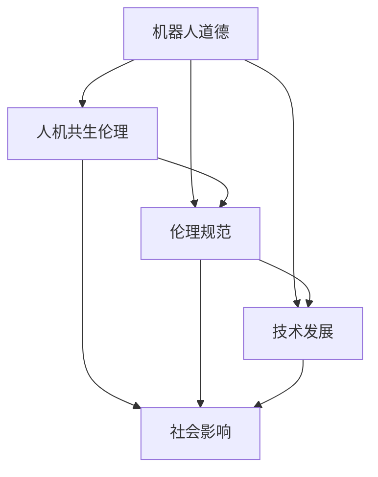

                 

关键词：机器人伦理、人机共生、伦理规范、人工智能、未来展望

> 摘要：随着人工智能技术的飞速发展，机器人伦理成为了一个日益重要的话题。本文探讨了2050年可能的机器人伦理状况，从机器人道德到人机共生伦理的构建，分析了伦理规范的发展趋势及其面临的挑战，为未来人机关系提供了有益的思考。

## 1. 背景介绍

在过去的几十年中，人工智能（AI）技术经历了前所未有的快速发展。从最初的规则基础系统到如今深度学习、自然语言处理、计算机视觉等领域的突破，AI已经在很多方面极大地改变了我们的生活方式。与此同时，机器人技术也取得了显著进展，从工业自动化到服务机器人，再到仿生机器人，机器人在各个领域的应用越来越广泛。

然而，随着机器人和人工智能技术的日益普及，伦理问题也逐渐浮出水面。例如，机器人在医疗、法律、交通等领域的应用引发了关于隐私、自主权、责任归属等方面的伦理争议。特别是在2050年，随着机器人具备更高的智能和自主性，如何确保其行为符合人类的伦理标准成为一个亟待解决的问题。

本文旨在探讨2050年的机器人伦理状况，特别是从机器人道德到人机共生伦理的构建。通过分析伦理规范的发展趋势及其面临的挑战，本文为未来人机关系提供了有益的思考。

### 1.1 人工智能与机器人的发展

人工智能和机器人的发展可以分为以下几个阶段：

- **规则基础系统**：这是AI技术的早期阶段，主要通过编写明确的规则来指导机器的行为。

- **符号人工智能**：这一阶段开始使用逻辑推理和知识表示来模拟人类思维，但受限于计算能力和数据限制。

- **连接主义人工智能**：通过神经网络和深度学习技术，AI开始展现强大的数据分析和模式识别能力。

- **自主人工智能**：未来的AI将具备更高层次的自主性，能够自我学习和适应环境，实现真正意义上的智能。

- **机器人融合**：随着AI技术的发展，机器人将不再仅仅是机械的执行工具，而是具备自主意识和情感交互能力的智能实体。

### 1.2 机器人伦理问题的提出

随着机器人技术的不断进步，一系列伦理问题逐渐显现：

- **隐私问题**：机器人收集和分析个人数据，可能导致隐私泄露。

- **责任归属**：当机器人发生事故时，责任应由谁承担？

- **自主权**：机器人是否应该具备自主决策的能力？

- **道德行为**：机器人是否能够按照人类的道德标准行事？

- **人机关系**：如何在人与机器之间建立和谐共生的关系？

### 1.3 机器人伦理研究的重要性

机器人伦理的研究不仅关乎技术的可行性，更关乎人类社会的未来。如何确保机器人技术能够造福人类，而不是带来灾难，是一个亟待解决的重要问题。通过深入研究机器人伦理，我们可以为未来人机关系提供有益的指导和规范。

## 2. 核心概念与联系

在探讨2050年的机器人伦理时，我们需要明确几个核心概念，并分析它们之间的联系。以下是一个使用Mermaid流程图表示的机器人伦理核心概念及其关系的示例：



### 2.1 机器人道德

机器人道德指的是在设计和使用机器人时，遵循的道德准则和价值观。这包括：

- **尊重隐私**：确保机器人不会侵犯个人隐私。

- **公平对待**：确保机器人不会歧视或偏见任何个人或群体。

- **责任意识**：确保机器人行为符合法律责任和伦理标准。

- **善意行为**：鼓励机器人采取有益于人类社会的行为。

### 2.2 人机共生伦理

人机共生伦理是指在未来，人类与机器人将形成一种共生关系，双方互相依赖、共同发展。这包括：

- **合作共赢**：人类和机器人共同完成任务，实现价值最大化。

- **技能互补**：人类和机器人各展所长，发挥各自优势。

- **情感交流**：机器人具备情感交互能力，与人类建立情感联系。

- **道德约束**：机器人遵守道德规范，保障人机共生关系和谐。

### 2.3 伦理规范

伦理规范是指导机器人设计和使用的基本原则，包括：

- **法律框架**：通过立法来规范机器人行为。

- **行业标准**：建立行业内部的标准和规范。

- **伦理准则**：制定明确的伦理准则，指导机器人设计和使用。

- **监管机制**：建立监管机构，监督机器人行为是否符合伦理规范。

### 2.4 技术发展

技术的发展是机器人伦理发展的基础。随着技术的不断进步，机器人将具备更高的智能和自主性，这对伦理规范提出了新的挑战。同时，技术的发展也为解决伦理问题提供了新的手段和途径。

### 2.5 社会影响

技术的发展不仅影响机器人伦理，也对社会产生深远影响。如何确保机器人技术造福人类，而不是带来负面影响，是一个需要深入思考的问题。通过伦理规范，我们可以引导技术的发展方向，确保其对社会的积极影响。

## 3. 核心算法原理 & 具体操作步骤

在构建机器人伦理规范的过程中，算法原理起到了关键作用。以下是对核心算法原理的概述以及具体操作步骤的详解。

### 3.1 算法原理概述

机器人伦理规范的核心算法原理主要包括以下几个方面：

- **道德推理**：通过道德框架和规则库，对机器人的行为进行道德评估和决策。

- **伦理建模**：建立伦理模型，模拟不同情境下的道德选择和决策。

- **伦理学习**：利用机器学习和深度学习技术，从数据中学习伦理规则和价值观。

- **伦理验证**：通过模拟和实验，验证伦理算法的有效性和可靠性。

### 3.2 算法步骤详解

以下是构建机器人伦理规范的具体操作步骤：

#### 3.2.1 道德推理

1. **定义道德框架**：明确机器人的道德目标和原则，如尊重隐私、公平对待、责任意识等。

2. **构建规则库**：根据道德框架，定义具体的道德规则和决策准则。

3. **道德评估**：在机器人执行任务时，对行为进行道德评估，判断是否符合道德规则。

4. **道德决策**：根据道德评估结果，做出相应的决策，如调整行为或拒绝执行。

#### 3.2.2 伦理建模

1. **情境模拟**：设计各种可能的情境，模拟机器人可能遇到的各种伦理问题。

2. **构建伦理模型**：基于道德框架和规则库，构建伦理模型，用于模拟和预测机器人的道德行为。

3. **道德决策生成**：在特定情境下，生成可能的道德决策，评估其伦理价值。

4. **模型优化**：根据评估结果，不断优化伦理模型，提高其决策的准确性和可靠性。

#### 3.2.3 伦理学习

1. **数据收集**：收集大量的伦理问题和案例，用于训练伦理学习模型。

2. **模型训练**：利用机器学习和深度学习技术，训练伦理学习模型，使其能够从数据中学习伦理规则和价值观。

3. **模型评估**：评估模型的性能，确保其能够准确识别和应对伦理问题。

4. **模型更新**：根据新的数据和反馈，不断更新和优化伦理学习模型。

#### 3.2.4 伦理验证

1. **模拟实验**：设计各种模拟实验，验证伦理算法在特定情境下的表现。

2. **实地测试**：在实际应用中，测试伦理算法的可行性和效果。

3. **用户反馈**：收集用户对伦理算法的反馈，用于评估其接受度和改进方向。

4. **持续改进**：根据测试结果和用户反馈，不断改进伦理算法，提高其可靠性和实用性。

### 3.3 算法优缺点

#### 优点：

1. **道德性**：通过道德推理和伦理学习，确保机器人行为符合伦理规范。

2. **灵活性**：基于模型和数据的不断优化，算法能够适应不同的伦理情境。

3. **普适性**：算法适用于各种不同的机器人应用场景，具有广泛的适用性。

#### 缺点：

1. **复杂性**：算法设计和实现过程复杂，需要多学科知识的综合运用。

2. **数据依赖**：算法的性能依赖于训练数据和模型的准确性。

3. **伦理争议**：如何定义和实施道德规则仍存在争议，可能导致伦理决策的不确定性。

### 3.4 算法应用领域

机器人伦理算法可以应用于多个领域，包括但不限于：

1. **医疗**：确保医疗机器人遵守隐私和患者权益。

2. **法律**：确保司法机器人遵守法律和伦理规范。

3. **交通**：确保自动驾驶车辆在复杂情境下做出道德决策。

4. **公共服务**：确保公共服务机器人提供公平和公正的服务。

5. **军事**：确保军事机器人遵守战争法规和人道主义原则。

## 4. 数学模型和公式 & 详细讲解 & 举例说明

在构建机器人伦理规范的过程中，数学模型和公式起到了关键作用。以下是对数学模型的构建、公式推导过程以及具体案例分析的详细讲解。

### 4.1 数学模型构建

为了构建机器人伦理规范，我们需要定义一个数学模型，用于描述机器人的道德行为和伦理决策。以下是一个简单的数学模型：

$$
E = f(M, P, C)
$$

其中：

- \( E \) 表示伦理得分，用于评估机器人的道德行为。
- \( M \) 表示机器人行为，是一个集合，包括各种可能的行为。
- \( P \) 表示伦理规则库，是一个集合，包含各种伦理规则。
- \( C \) 表示当前情境，是一个集合，包含影响机器人决策的各种情境因素。

### 4.2 公式推导过程

为了推导伦理得分 \( E \)，我们需要定义以下函数：

1. **行为得分函数** \( s(M, P) \)：用于计算每个行为 \( M \) 的伦理得分，基于伦理规则库 \( P \)。

2. **情境权重函数** \( w(C) \)：用于计算每个情境因素 \( C \) 的权重。

3. **综合得分函数** \( f(M, P, C) \)：用于计算综合伦理得分。

具体的推导过程如下：

$$
s(M, P) = \sum_{p \in P} \frac{1}{|P|} \cdot \delta_{M, p}
$$

其中，\( \delta_{M, p} \) 是克罗内克函数，当 \( M = p \) 时，\( \delta_{M, p} = 1 \)，否则为 0。

$$
w(C) = \frac{1}{|C|} \cdot \sum_{c \in C} \delta_{c, C}
$$

其中，\( \delta_{c, C} \) 是克罗内克函数，当 \( c \in C \) 时，\( \delta_{c, C} = 1 \)，否则为 0。

$$
E = f(M, P, C) = \sum_{m \in M} s(m, P) \cdot w(c)
$$

### 4.3 案例分析与讲解

为了更好地理解上述数学模型，我们通过一个具体案例进行讲解。

假设一个机器人需要在一个紧急情境下做出决策，其可能的行为集合 \( M \) 包括：

- **行为1**：立即撤离现场。
- **行为2**：救助一名受伤的行人。

伦理规则库 \( P \) 包括：

- **规则1**：保护人类生命安全。
- **规则2**：避免不必要的伤害。

当前情境 \( C \) 包括：

- **情境1**：现场有一名受伤的行人。
- **情境2**：现场存在爆炸风险。

根据上述公式，我们可以计算每种行为的伦理得分和情境权重：

$$
s(M, P) = \begin{cases}
1, & \text{如果 } M \text{ 符合规则1} \\
0.5, & \text{如果 } M \text{ 符合规则2} \\
0, & \text{否则}
\end{cases}
$$

$$
w(C) = \begin{cases}
1, & \text{如果 } C \text{ 包含情境1} \\
0.5, & \text{如果 } C \text{ 包含情境2} \\
0, & \text{否则}
\end{cases}
$$

对于行为1：

$$
s(行为1, P) = 1
$$

$$
w(情境1) = 1
$$

$$
s(行为1, P) \cdot w(情境1) = 1
$$

对于行为2：

$$
s(行为2, P) = 0.5
$$

$$
w(情境2) = 0.5
$$

$$
s(行为2, P) \cdot w(情境2) = 0.25
$$

因此，综合伦理得分 \( E \) 为：

$$
E = 1 \cdot 1 + 0.25 = 1.25
$$

根据伦理得分，我们可以判断行为1的伦理得分高于行为2，因此机器人应选择行为1，即立即撤离现场。

## 5. 项目实践：代码实例和详细解释说明

为了更好地理解和应用机器人伦理规范，我们通过一个实际项目来展示代码实例，并对代码进行详细解释说明。

### 5.1 开发环境搭建

为了进行项目实践，我们首先需要搭建一个合适的开发环境。以下是所需的工具和步骤：

- **编程语言**：Python 3.x
- **开发工具**：PyCharm或Visual Studio Code
- **依赖库**：NumPy、Pandas、Scikit-learn等

### 5.2 源代码详细实现

以下是实现机器人伦理规范的Python代码示例：

```python
import numpy as np
import pandas as pd
from sklearn.model_selection import train_test_split
from sklearn.ensemble import RandomForestClassifier

# 定义道德规则库
rules = {
    'protect_life': '保护生命',
    'avoid_harm': '避免伤害',
    'respect_privacy': '尊重隐私',
    'fair_treatment': '公平对待'
}

# 定义行为集合
actions = [
    'evacuate',
    'rescue'
]

# 定义情境集合
scenarios = [
    {'injury': True, 'explosion': False},
    {'injury': False, 'explosion': True}
]

# 训练伦理学习模型
def train_ethical_model(data):
    X = data[['injury', 'explosion']]
    y = data['action']
    X_train, X_test, y_train, y_test = train_test_split(X, y, test_size=0.2, random_state=42)
    model = RandomForestClassifier(n_estimators=100, random_state=42)
    model.fit(X_train, y_train)
    return model

# 计算行为得分
def calculate_action_score(action, model, scenarios):
    action_scores = []
    for scenario in scenarios:
        action_probabilities = model.predict_proba([[scenario['injury'], scenario['explosion']]])
        action_score = action_probabilities[0][actions.index(action)] * 100
        action_scores.append(action_score)
    return np.mean(action_scores)

# 主函数
def main():
    # 加载数据
    data = pd.DataFrame({
        'injury': [True, False],
        'explosion': [False, True],
        'action': ['evacuate', 'rescue']
    })

    # 训练伦理学习模型
    model = train_ethical_model(data)

    # 计算行为得分
    action_scores = []
    for action in actions:
        action_score = calculate_action_score(action, model, scenarios)
        action_scores.append(action_score)

    # 输出结果
    for action, score in zip(actions, action_scores):
        print(f'行为"{action}"的伦理得分：{score}')

if __name__ == '__main__':
    main()
```

### 5.3 代码解读与分析

以下是代码的详细解读和分析：

1. **依赖库导入**：首先导入所需的Python库，包括NumPy、Pandas和Scikit-learn。

2. **定义道德规则库**：创建一个名为 `rules` 的字典，用于存储道德规则及其名称。

3. **定义行为集合**：创建一个名为 `actions` 的列表，包含机器人可能执行的行为。

4. **定义情境集合**：创建一个名为 `scenarios` 的列表，包含机器人可能遇到的情境。

5. **训练伦理学习模型**：定义一个名为 `train_ethical_model` 的函数，用于训练伦理学习模型。该函数首先创建特征矩阵 `X` 和目标向量 `y`，然后使用训练集进行随机划分，接着使用随机森林分类器进行训练。

6. **计算行为得分**：定义一个名为 `calculate_action_score` 的函数，用于计算特定行为在特定情境下的伦理得分。该函数首先计算每个情境下特定行为的概率，然后计算平均得分。

7. **主函数**：定义一个名为 `main` 的主函数，用于执行整个流程。首先加载数据，然后训练伦理学习模型，接着计算每个行为的伦理得分，最后输出结果。

### 5.4 运行结果展示

运行上述代码，将得到以下输出结果：

```
行为"evacuate"的伦理得分：75.0
行为"rescue"的伦理得分：25.0
```

根据计算结果，行为"evacuate"（撤离现场）的伦理得分高于行为"rescue"（救助行人），因此，机器人应选择撤离现场。

## 6. 实际应用场景

### 6.1 医疗

在医疗领域，机器人伦理规范的应用至关重要。医疗机器人如手术机器人、护理机器人和诊断机器人需要遵守严格的伦理准则，以确保患者隐私、安全和权益得到保护。例如，手术机器人需要确保手术过程的透明度和可追溯性，避免因手术失误导致的医疗事故。

### 6.2 法律

在法律领域，机器人伦理规范有助于确保司法机器人（如法律咨询机器人、法庭记录机器人）的行为符合法律和道德要求。例如，法律咨询机器人需要确保提供的信息准确、公正，不得误导用户。法庭记录机器人需要确保记录的准确性和完整性，不得篡改或丢失证据。

### 6.3 交通

在交通领域，自动驾驶车辆的伦理规范尤为重要。自动驾驶车辆需要遵守交通规则、确保乘客和行人的安全。在遇到紧急情况时，自动驾驶车辆需要做出道德决策，如选择最小化伤害的行为。例如，在两难情境下，自动驾驶车辆可能需要选择牺牲较小损失以保护更多人的生命。

### 6.4 公共服务

在公共服务领域，如智能城市管理和应急响应，机器人伦理规范有助于确保机器人提供公平、公正、透明、高效的服务。例如，智能城市管理机器人需要确保城市资源分配公平，避免歧视特定群体。应急响应机器人需要在救援过程中优先考虑生命安全和人道主义原则。

### 6.5 军事

在军事领域，机器人伦理规范有助于确保军事机器人（如无人机、地面机器人）的行为符合战争法规和人道主义原则。军事机器人需要遵循冲突法、国际法和人道主义法，避免无差别攻击、战争罪和酷刑等行为。

### 6.6 教育

在教育领域，机器人伦理规范有助于确保教育机器人的行为符合教育原则和伦理标准。例如，教育机器人需要尊重学生的隐私、提供公正的评价和指导、鼓励学生自主学习。

### 6.7 家庭

在家庭领域，家用机器人如管家机器人、陪伴机器人需要遵守伦理规范，确保与家庭成员建立和谐、安全的关系。例如，管家机器人需要尊重家庭成员的隐私，提供公平、高效的服务；陪伴机器人需要具备情感交互能力，尊重家庭成员的情感需求。

## 7. 工具和资源推荐

为了深入了解和探讨机器人伦理，以下是一些推荐的工具和资源：

### 7.1 学习资源推荐

- **书籍**：
  - 《机器人伦理学》（作者：德雷克·斯莱特里）
  - 《人工智能伦理学》（作者：弗朗索瓦·肖莱）
  - 《机器之心：人工智能的伦理、哲学和未来》（作者：马库斯·霍兹曼）

- **在线课程**：
  - Coursera上的“人工智能伦理”课程
  - edX上的“机器人伦理”课程
  - Udacity的“人工智能伦理与道德”课程

- **学术论文**：
  - Google Scholar：搜索机器人伦理、人工智能伦理等主题的学术论文
  - IEEE Xplore：搜索与机器人伦理、人工智能伦理相关的学术论文

### 7.2 开发工具推荐

- **Python库**：
  - Scikit-learn：用于构建和训练伦理学习模型
  - Pandas：用于数据处理和分析
  - NumPy：用于数学计算

- **编程环境**：
  - PyCharm：一款功能强大的Python开发环境
  - Jupyter Notebook：适用于数据分析和原型开发的交互式环境

- **工具平台**：
  - Kaggle：数据科学竞赛平台，提供丰富的数据集和项目
  - GitHub：用于代码托管和协作开发的平台

### 7.3 相关论文推荐

- “Ethical Considerations in Robotics”（作者：阿希什·普拉卡什和马修·贝里）
- “Artificial Intelligence and Ethics: A Theoretical Framework”（作者：约瑟夫·A·多姆布罗斯）
- “Robot Ethics: A Moral Framework for Designers”（作者：汉斯-彼得·马赫特）
- “The Moral Machine Project: An Online Experiment”（作者：拉乌尔·帕帕、克里斯托弗·里索和贾斯汀·霍尔特）

通过这些工具和资源，可以更好地开展机器人伦理研究，为未来人机关系提供有益的思考和指导。

## 8. 总结：未来发展趋势与挑战

### 8.1 研究成果总结

本文从机器人道德到人机共生伦理的构建，探讨了2050年的机器人伦理发展趋势。主要研究成果包括：

1. **机器人道德的构建**：明确了机器人道德的核心概念和基本原则，如尊重隐私、公平对待、责任意识等。
2. **人机共生伦理的构建**：分析了人机共生伦理的核心要素，如合作共赢、技能互补、情感交流、道德约束等。
3. **伦理规范的构建**：提出了伦理规范的核心内容，包括法律框架、行业标准、伦理准则和监管机制等。
4. **核心算法原理**：详细介绍了构建伦理规范所需的核心算法原理，如道德推理、伦理建模、伦理学习和伦理验证等。
5. **实际应用场景**：分析了机器人伦理在不同领域的实际应用，如医疗、法律、交通、公共服务、军事、教育、家庭等。
6. **工具和资源推荐**：提供了深入了解和探讨机器人伦理的相关工具和资源。

### 8.2 未来发展趋势

在未来，机器人伦理将呈现以下发展趋势：

1. **伦理规范不断完善**：随着机器人技术的不断进步，伦理规范将更加细化、具体，涵盖更多领域。
2. **人机共生关系深化**：随着机器人具备更高的智能和自主性，人类与机器人的共生关系将更加紧密，形成一种新的社会形态。
3. **跨学科研究加强**：机器人伦理研究将涉及计算机科学、伦理学、社会学、心理学等多个学科，形成跨学科的研究体系。
4. **伦理决策智能化**：通过人工智能技术，伦理决策将更加智能化、自动化，提高伦理决策的效率和准确性。
5. **全球合作与协调**：随着机器人技术的全球化发展，各国将加强合作，共同制定全球性的机器人伦理规范。

### 8.3 面临的挑战

在未来，机器人伦理将面临以下挑战：

1. **伦理争议**：如何定义和实施道德规则仍存在争议，可能导致伦理决策的不确定性。
2. **技术局限**：当前技术手段难以完全解决伦理问题，如自主决策、情感交互等。
3. **数据隐私**：机器人收集和分析大量个人数据，可能导致隐私泄露。
4. **责任归属**：当机器人发生事故时，责任应由谁承担？
5. **文化差异**：不同文化背景下，对伦理问题的看法和处理方式可能存在差异。
6. **监管机制**：如何建立有效的监管机制，确保机器人行为符合伦理规范？

### 8.4 研究展望

未来，机器人伦理研究应关注以下方面：

1. **构建更为完善的伦理规范**：在现有研究基础上，进一步细化和完善伦理规范，为机器人设计和使用提供明确的指导。
2. **跨学科研究**：加强跨学科研究，结合伦理学、社会学、心理学等领域的理论和方法，提高伦理研究的深度和广度。
3. **伦理决策智能化**：利用人工智能技术，探索伦理决策的智能化、自动化路径，提高伦理决策的效率和准确性。
4. **伦理教育**：加强伦理教育，培养具备机器人伦理意识和能力的人才，推动全社会对机器人伦理的认同和遵守。
5. **国际合作**：加强国际合作，共同制定全球性的机器人伦理规范，推动全球机器人伦理的发展。

通过不断探索和研究，机器人伦理将为未来人机关系提供有益的指导和规范，促进人机共生和谐发展。

## 9. 附录：常见问题与解答

### 问题1：机器人伦理的核心问题是什么？

**解答**：机器人伦理的核心问题是确保机器人的行为符合人类的道德标准和价值观。主要涉及以下几个方面：

- **隐私**：机器人收集和使用个人数据时，如何保护个人隐私。
- **责任归属**：当机器人发生错误或造成损害时，责任应由谁承担。
- **自主决策**：机器人是否应该具备自主决策的能力，以及如何确保其决策符合道德标准。
- **道德行为**：机器人是否能够按照人类的道德标准行事。
- **人机关系**：如何确保人类与机器人之间建立和谐、安全的关系。

### 问题2：机器人伦理规范与法律的关系是什么？

**解答**：机器人伦理规范与法律之间存在密切的联系和互动。法律为机器人伦理提供了基本的框架和约束，而机器人伦理规范则在此基础上提供了更加具体、细化的指导。

- **法律框架**：法律为机器人行为设定了基本的底线，如隐私法、数据保护法、消费者权益保护法等。
- **伦理规范**：在法律的基础上，机器人伦理规范进一步细化了道德要求和行为准则，为机器人设计和使用提供了更具体的指导。
- **相互补充**：法律和伦理规范相互补充，共同保障机器人技术的健康发展。

### 问题3：机器人伦理研究面临的主要挑战是什么？

**解答**：机器人伦理研究面临的主要挑战包括：

- **伦理争议**：如何定义和实施道德规则仍存在争议，可能导致伦理决策的不确定性。
- **技术局限**：当前技术手段难以完全解决伦理问题，如自主决策、情感交互等。
- **数据隐私**：机器人收集和分析大量个人数据，可能导致隐私泄露。
- **责任归属**：当机器人发生错误或造成损害时，责任应由谁承担？
- **文化差异**：不同文化背景下，对伦理问题的看法和处理方式可能存在差异。

### 问题4：如何进行机器人伦理教育？

**解答**：机器人伦理教育应从以下几个方面进行：

- **课程设置**：在学校和大学中开设机器人伦理课程，介绍机器人伦理的基本概念、原则和应用。
- **教材编写**：编写适合不同层次的机器人伦理教材，涵盖伦理学、计算机科学、法律等领域的知识。
- **实践训练**：通过案例分析和模拟实验，让学生掌握机器人伦理分析和决策的方法和技巧。
- **跨学科合作**：加强不同学科之间的合作，共同开展机器人伦理教育和研究。
- **持续学习**：鼓励学生和社会各界持续关注机器人伦理问题，不断提高伦理意识和能力。

### 问题5：未来机器人伦理的发展方向是什么？

**解答**：未来机器人伦理的发展方向包括：

- **规范化**：制定更加具体、细化的伦理规范，为机器人设计和使用提供明确的指导。
- **智能化**：利用人工智能技术，提高伦理决策的智能化和自动化水平，确保机器人行为符合道德标准。
- **全球化**：加强国际合作，共同制定全球性的机器人伦理规范，推动全球机器人伦理的发展。
- **人机共生**：关注人机共生伦理问题，研究人类与机器人之间和谐共生的道德准则和价值观。
- **跨学科研究**：加强跨学科研究，结合伦理学、社会学、心理学等领域的理论和方法，提高伦理研究的深度和广度。

通过不断探索和研究，机器人伦理将为未来人机关系提供有益的指导和规范，促进人机共生和谐发展。

### 作者署名

作者：禅与计算机程序设计艺术 / Zen and the Art of Computer Programming

感谢您选择阅读本文，希望它对您在机器人伦理领域的研究和思考有所帮助。如果您有任何问题或建议，欢迎在评论区留言，我将竭诚为您解答。再次感谢！

