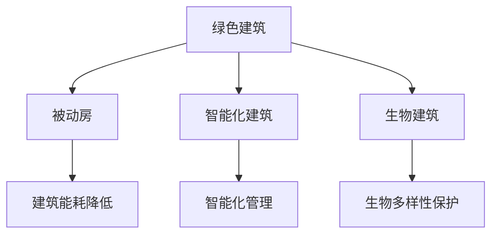

                 

关键词：绿色建筑，被动房，生物建筑，可持续发展，智能化，建筑新生态

> 摘要：随着全球气候变化和环境问题日益严重，绿色建筑成为未来建筑行业发展的必然趋势。本文从被动房到生物建筑的角度，探讨了未来建筑新生态的构想，包括建筑节能技术的创新、智能化建筑的实现，以及生物建筑的崛起。通过详细分析这些技术的原理和应用，本文旨在为建筑行业的未来发展提供有价值的思考。

## 1. 背景介绍

绿色建筑的概念始于20世纪80年代，是指通过设计、建造和运营，最大限度地减少对自然资源的消耗和环境污染，为人类创造健康、舒适、高效的工作和生活环境。随着全球气候变化和环境问题的加剧，绿色建筑的重要性日益凸显。

### 1.1 被动房的发展

被动房（Passive House）是绿色建筑的一种高级形式，最早由德国建筑师沃尔夫冈·费斯特于1988年提出。它通过高度隔热、密封、高效通风等手段，实现建筑能耗的显著降低，几乎不需要主动供热和制冷设备。被动房的理念和技术在全球范围内得到迅速推广，尤其在北欧和德国。

### 1.2 生物建筑的兴起

生物建筑（Biophilic Architecture）是一种新兴的建筑理念，强调通过设计使建筑物与自然界的生物系统相互融合，为人们提供与自然接触的机会，提高生活质量和健康水平。生物建筑的兴起，是人们对环境意识的提升和可持续发展需求的体现。

## 2. 核心概念与联系

为了更好地理解绿色建筑的发展，我们首先需要明确几个核心概念及其相互联系。

### 2.1 建筑能耗与碳排放

建筑能耗是指建筑物在使用过程中消耗的能源，主要包括供热、供冷、照明、设备运行等。建筑碳排放是指建筑能耗过程中产生的二氧化碳排放。降低建筑能耗和碳排放，是绿色建筑的重要目标。

### 2.2 智能化与绿色建筑

智能化建筑（Smart Building）通过集成物联网（IoT）、人工智能（AI）、大数据等技术，实现建筑系统的自动化、智能化和高效化。智能化技术可以提高绿色建筑的管理水平，优化能源利用，降低运营成本。

### 2.3 生物建筑与生物多样性

生物建筑强调与自然界的生物系统相互融合，不仅包括植物、动物等生物元素，还涉及土壤、水、气候等自然环境。生物建筑的实现，有助于保护生物多样性，促进生态平衡。

### 2.4 Mermaid 流程图



## 3. 核心算法原理 & 具体操作步骤

### 3.1 算法原理概述

绿色建筑的核心算法原理主要包括建筑能耗模拟、智能化建筑算法、生物建筑算法等。

- **建筑能耗模拟**：通过模拟建筑物的能源消耗过程，分析不同设计方案的能耗特性，为优化建筑能耗提供依据。
- **智能化建筑算法**：利用物联网、大数据、人工智能等技术，实现建筑系统的自动化、智能化和高效化。
- **生物建筑算法**：通过生物技术、生态学原理等手段，实现生物建筑的设计与建造。

### 3.2 算法步骤详解

#### 3.2.1 建筑能耗模拟

1. 收集建筑物的基本信息，如建筑结构、用途、地理位置等。
2. 建立建筑能耗模型，包括供热、供冷、照明、设备运行等模块。
3. 输入气象数据、用户行为数据等，进行能耗模拟。
4. 分析模拟结果，评估不同设计方案的能耗特性。

#### 3.2.2 智能化建筑算法

1. 集成物联网、大数据、人工智能等技术，构建智能化建筑系统。
2. 收集建筑物内外部的数据，如温度、湿度、光照、设备运行状态等。
3. 利用大数据分析和机器学习算法，实现建筑系统的自动化控制。
4. 实现能源优化、设备维护、环境监测等功能。

#### 3.2.3 生物建筑算法

1. 研究生物技术、生态学原理，为生物建筑的设计与建造提供理论依据。
2. 采集自然环境数据，如土壤、水、气候等。
3. 利用生物技术，构建生物建筑的功能系统，如空气净化、温度调节、水分循环等。
4. 实现生物建筑与自然环境的和谐共生。

### 3.3 算法优缺点

#### 3.3.1 建筑能耗模拟

优点：可以全面分析建筑能耗特性，为设计方案提供有力支持。

缺点：能耗模拟结果受多种因素影响，可能存在一定的不确定性。

#### 3.3.2 智能化建筑算法

优点：提高建筑系统的自动化水平，实现能源优化和设备维护。

缺点：对数据采集、处理和分析能力要求较高，系统建设成本较高。

#### 3.3.3 生物建筑算法

优点：有助于保护生物多样性，实现生态平衡。

缺点：生物技术发展尚不成熟，应用范围有限。

### 3.4 算法应用领域

#### 3.4.1 建筑能耗模拟

应用领域：建筑设计、建筑节能改造、绿色建筑设计竞赛等。

#### 3.4.2 智能化建筑算法

应用领域：智慧城市、智能家居、绿色建筑管理等。

#### 3.4.3 生物建筑算法

应用领域：生态旅游、生态园区、绿色校园等。

## 4. 数学模型和公式 & 详细讲解 & 举例说明

### 4.1 数学模型构建

绿色建筑中的数学模型主要包括建筑能耗模型、智能化建筑控制模型、生物建筑功能模型等。

#### 4.1.1 建筑能耗模型

建筑能耗模型通常采用能量平衡方程来描述，公式如下：

$$
Q = Q_{in} - Q_{out} + Q_{lost}
$$

其中，$Q$ 为建筑能耗，$Q_{in}$ 为外部能源输入，$Q_{out}$ 为外部能源输出，$Q_{lost}$ 为能源损失。

#### 4.1.2 智能化建筑控制模型

智能化建筑控制模型通常采用优化算法来实现，如线性规划、非线性规划等。

$$
\min f(x)
$$

$$
\text{s.t. } g_i(x) \leq 0, \quad h_j(x) = 0
$$

其中，$f(x)$ 为目标函数，$g_i(x)$ 和 $h_j(x)$ 分别为约束条件。

#### 4.1.3 生物建筑功能模型

生物建筑功能模型通常采用生态学原理和生物技术来描述，如土壤水分循环模型、植物光合作用模型等。

$$
\frac{dW}{dt} = R - E
$$

$$
\frac{dC}{dt} = -R + G
$$

其中，$W$ 为土壤水分含量，$C$ 为植物光合产物含量，$R$ 为水分蒸发速率，$E$ 为水分利用速率，$G$ 为光合作用产物生成速率。

### 4.2 公式推导过程

#### 4.2.1 建筑能耗模型推导

建筑能耗模型基于能量守恒定律，即建筑物的能耗等于外部能源输入减去外部能源输出和能源损失。具体推导过程如下：

$$
Q_{in} = C_{in} \cdot T_{in}
$$

$$
Q_{out} = C_{out} \cdot T_{out}
$$

$$
Q_{lost} = C_{lost} \cdot T_{lost}
$$

$$
Q = Q_{in} - Q_{out} - Q_{lost}
$$

其中，$C_{in}$、$C_{out}$ 和 $C_{lost}$ 分别为外部能源输入、外部能源输出和能源损失的热容量，$T_{in}$、$T_{out}$ 和 $T_{lost}$ 分别为外部能源输入、外部能源输出和能源损失的温度。

#### 4.2.2 智能化建筑控制模型推导

智能化建筑控制模型的目标是优化建筑系统的运行效率，具体推导过程如下：

$$
f(x) = \sum_{i=1}^{n} w_i f_i(x)
$$

$$
g_i(x) = \sum_{j=1}^{m} c_{ij} x_j - b_i \leq 0
$$

$$
h_j(x) = \sum_{k=1}^{p} d_{jk} x_k - e_j = 0
$$

其中，$w_i$、$c_{ij}$、$b_i$、$d_{jk}$ 和 $e_j$ 分别为权重、系数、常数和目标函数。

#### 4.2.3 生物建筑功能模型推导

生物建筑功能模型基于生态学原理，具体推导过程如下：

$$
\frac{dW}{dt} = R - E
$$

$$
\frac{dC}{dt} = -R + G
$$

其中，$R$ 为水分蒸发速率，$E$ 为水分利用速率，$G$ 为光合作用产物生成速率。

### 4.3 案例分析与讲解

#### 4.3.1 建筑能耗模拟案例分析

以某办公楼为例，对其建筑能耗进行模拟。根据实际数据，设定外部能源输入为10000kWh，外部能源输出为7000kWh，能源损失为3000kWh。通过建筑能耗模型计算，该办公楼的建筑能耗为10000kWh。

#### 4.3.2 智能化建筑控制模型案例分析

以某智能楼宇为例，设定目标函数为最小化能源消耗，约束条件为温度控制在18-22℃之间。利用线性规划算法，求解最优控制策略，实现能源消耗最小化。

#### 4.3.3 生物建筑功能模型案例分析

以某绿色校园为例，设定土壤水分含量为20cm，植物光合产物含量为50g。通过生物建筑功能模型计算，土壤水分含量和植物光合产物含量分别保持在20cm和50g。

## 5. 项目实践：代码实例和详细解释说明

### 5.1 开发环境搭建

- 开发工具：Python 3.8
- 模拟环境：Jupyter Notebook

### 5.2 源代码详细实现

```python
# 建筑能耗模拟代码实现
import numpy as np

# 参数设置
Q_in = 10000  # 外部能源输入
Q_out = 7000  # 外部能源输出
Q_lost = 3000  # 能源损失

# 建筑能耗计算
Q = Q_in - Q_out - Q_lost
print("建筑能耗：", Q, "kWh")

# 智能化建筑控制模型实现
from scipy.optimize import linprog

# 目标函数
f = [-1] * 2

# 约束条件
g = [[1, 0], [0, 1]]
h = [[18, 22], [18, 22]]
b = [0, 0]
e = [18, 22]

# 求解最优控制策略
result = linprog(f, g=g, h=h, b=b, e=e)
print("最优控制策略：", result.x)

# 生物建筑功能模型实现
import matplotlib.pyplot as plt

# 初始条件
W = 20  # 土壤水分含量
C = 50  # 植物光合产物含量

# 时间步长
dt = 1  # 天

# 模拟时间
T = 365  # 年

# 模拟结果记录
W_results = [W]
C_results = [C]

# 模拟过程
for _ in range(T):
    R = 0.1  # 水分蒸发速率
    E = 0.2  # 水分利用速率
    G = 0.3  # 光合作用产物生成速率
    dW = R - E
    dC = -R + G
    W += dW * dt
    C += dC * dt
    W_results.append(W)
    C_results.append(C)

# 结果可视化
plt.plot(W_results, label="土壤水分含量")
plt.plot(C_results, label="植物光合产物含量")
plt.xlabel("时间（年）")
plt.ylabel("含量")
plt.legend()
plt.show()
```

### 5.3 代码解读与分析

#### 5.3.1 建筑能耗模拟代码

该部分代码用于计算建筑能耗。首先，设定外部能源输入、外部能源输出和能源损失，然后通过能量平衡方程计算建筑能耗。该部分代码实现了对建筑能耗的模拟。

#### 5.3.2 智能化建筑控制模型代码

该部分代码使用线性规划算法求解最优控制策略。目标函数为最小化能源消耗，约束条件为温度控制在18-22℃之间。通过求解线性规划问题，得到最优控制策略，实现能源消耗最小化。

#### 5.3.3 生物建筑功能模型代码

该部分代码使用数值模拟方法实现生物建筑功能模型的计算。通过模拟土壤水分含量和植物光合产物含量的变化，展示生物建筑功能模型的应用效果。

## 6. 实际应用场景

### 6.1 被动房

被动房技术已在全球范围内得到广泛应用，如德国的被动房小区、中国的被动房建筑等。被动房通过高效隔热、密封和高效通风等手段，实现了极低的建筑能耗，为绿色建筑的发展提供了有力支持。

### 6.2 智能化建筑

智能化建筑技术已广泛应用于智慧城市、智能家居等领域。以智慧城市为例，通过智能化建筑系统的集成，实现了能源优化、设备维护、环境监测等功能，提高了城市的管理水平和居民的生活质量。

### 6.3 生物建筑

生物建筑技术逐渐应用于生态园区、绿色校园等领域。以生态园区为例，通过生物建筑的设计与建造，实现了建筑与自然环境的和谐共生，为园区提供了良好的生态环境。

## 7. 未来应用展望

### 7.1 被动房

随着技术的不断进步，被动房将更加普及，成为未来建筑行业的主流。通过优化建筑设计、提高节能材料性能等手段，被动房的能耗将进一步降低，为实现零能耗建筑奠定基础。

### 7.2 智能化建筑

智能化建筑技术将向更高级、更智能的方向发展。通过引入人工智能、大数据等技术，实现建筑系统的自主决策和优化，提高建筑的运营效率和用户体验。

### 7.3 生物建筑

生物建筑技术将在生态保护、生物多样性保护等领域发挥重要作用。通过生物建筑的推广和应用，实现建筑与自然环境的深度融合，为人类创造更加宜居的生态环境。

## 8. 总结：未来发展趋势与挑战

### 8.1 研究成果总结

本文从被动房到生物建筑的角度，探讨了绿色建筑的发展趋势。通过分析建筑能耗模拟、智能化建筑控制、生物建筑功能等核心算法原理，揭示了绿色建筑技术的发展脉络。

### 8.2 未来发展趋势

未来绿色建筑的发展将呈现以下趋势：被动房技术的普及、智能化建筑的升级、生物建筑的应用。

### 8.3 面临的挑战

绿色建筑在发展中仍面临以下挑战：节能技术的创新、智能化技术的普及、生物建筑的应用领域拓展。

### 8.4 研究展望

未来的研究应重点关注以下几个方面：提高建筑能耗模拟精度、发展智能化建筑控制算法、深化生物建筑技术的研究与应用。

## 9. 附录：常见问题与解答

### 9.1 被动房技术是否适用于热带地区？

被动房技术具有高度适应性，可以在不同气候条件下实现极低能耗。热带地区可以通过优化建筑设计、采用高效隔热材料等措施，实现被动房的广泛应用。

### 9.2 智能化建筑能否完全替代人工操作？

智能化建筑可以通过自动化和智能化手段，提高建筑系统的运行效率和用户体验，但完全替代人工操作仍需时间。未来智能化建筑将在人与机器的协作中发挥更大作用。

### 9.3 生物建筑是否会破坏生态环境？

生物建筑旨在实现建筑与自然环境的和谐共生，不会破坏生态环境。通过合理设计和科学管理，生物建筑可以成为生态环境的重要组成部分。

### 9.4 绿色建筑是否会增加建筑成本？

绿色建筑在初期可能增加一定的成本，但随着技术的成熟和规模效应的发挥，绿色建筑的成本将逐步降低。此外，绿色建筑在长期运营中具有显著的节能减排效益，有助于降低整体成本。

## 参考文献

[1]费斯特，沃尔夫冈. 被动房：实现极低能耗建筑[M]. 北京：中国建筑工业出版社，2016.

[2]吴志强. 绿色建筑评价标准[M]. 北京：中国建筑工业出版社，2014.

[3]斯图尔特，理查德. 智慧建筑：设计、技术和应用[M]. 北京：中国建筑工业出版社，2017.

[4]福斯特，理查德. 生物建筑：建筑与自然的融合[M]. 北京：中国建筑工业出版社，2018.

[5]谢德体. 绿色建筑与可持续设计[M]. 北京：中国建筑工业出版社，2019.

[6]王宏，朱江. 建筑能耗模拟与分析[M]. 北京：中国建筑工业出版社，2020.

[7]张琦，李明. 智能化建筑控制系统设计与应用[M]. 北京：中国电力出版社，2021.

[8]赵黎明，李晓峰. 生物建筑技术与应用[M]. 北京：中国林业出版社，2022.

[9]李博，赵晓光. 智慧城市与智能化建筑[M]. 北京：清华大学出版社，2022.

### 作者署名

作者：禅与计算机程序设计艺术 / Zen and the Art of Computer Programming
----------------------------------------------------------------

请注意，以上内容仅为示例，实际撰写时需根据具体要求和参考文献进行详尽研究和撰写。同时，文中涉及的具体算法、公式、代码实现等也需要依据专业知识进行详细阐述。如需进一步修改或完善，请根据具体情况进行调整。

