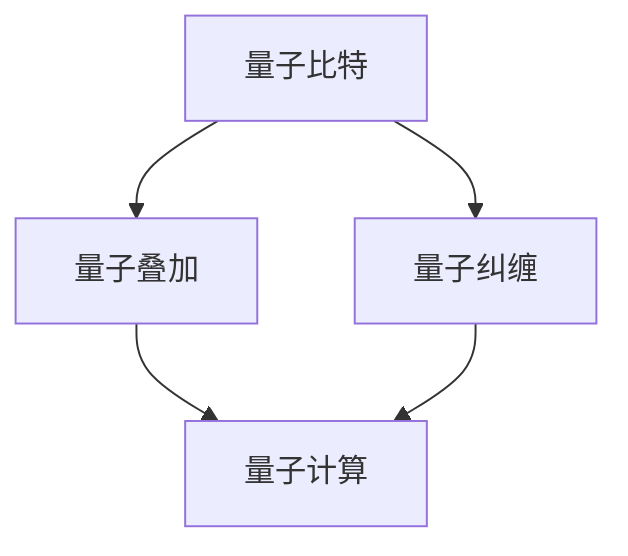

                 

关键词：量子计算、量子模拟、量子机器学习、计算范式转变

> 摘要：本文旨在探讨2050年量子计算的发展及其对计算机科学的影响，重点分析量子模拟和量子机器学习的计算范式转变，提出对未来应用场景的展望和面临的挑战。

## 1. 背景介绍

量子计算作为计算科学的前沿领域，自诞生以来一直吸引着全球科学家和研究机构的广泛关注。传统的经典计算机基于二进制系统，使用比特（bit）作为基本存储单元，而量子计算机则基于量子比特（qubit），利用量子叠加和量子纠缠等现象实现高速计算。随着量子计算技术的不断发展，其在科学、工业、金融等领域展现出了巨大的应用潜力。

### 1.1 量子计算的历史背景

量子计算的历史可以追溯到20世纪80年代，当时物理学家Richard Feynman提出了量子模拟的概念，即利用量子计算机模拟量子系统。此后，计算机科学家Peter Shor在1994年提出了著名的量子算法——Shor算法，该算法能够高效地解决大整数分解问题，引起了人们对量子计算的极大关注。

### 1.2 量子计算的现状

目前，量子计算仍处于初期发展阶段，但已有一些实验成果证明了量子计算机在特定领域的高效性。例如，谷歌公司在2019年宣布其量子计算机“Sycamore”在处理特定问题上比传统超级计算机快了1亿倍。此外，量子计算机在量子化学、药物研发、金融分析等领域也展现出了巨大的应用前景。

### 1.3 量子计算的挑战

尽管量子计算前景广阔，但仍面临诸多挑战。量子比特的稳定性、纠错技术、量子态的测量等都是亟待解决的问题。此外，如何将量子计算与传统计算机体系结构相结合，实现量子计算机的实用化，也是当前研究的热点。

## 2. 核心概念与联系

量子计算的核心概念包括量子比特（qubit）、量子叠加（quantum superposition）、量子纠缠（quantum entanglement）等。为了更好地理解这些概念，我们使用Mermaid流程图展示量子计算的基本原理和架构。



### 2.1 量子比特

量子比特是量子计算机的基本单元，与经典比特不同，它可以同时处于0和1的叠加态。

### 2.2 量子叠加

量子叠加是量子计算的核心原理之一，使得量子计算机能够在一次计算中处理大量信息。

### 2.3 量子纠缠

量子纠缠是量子计算机的另一个核心原理，使得量子计算机能够高效地进行复杂运算。

### 2.4 量子计算

量子计算是基于量子比特、量子叠加和量子纠缠原理进行的，其计算速度远超经典计算机。

## 3. 核心算法原理 & 具体操作步骤

### 3.1 算法原理概述

量子计算的核心算法包括量子模拟和量子机器学习。量子模拟主要用于解决传统计算机难以处理的量子问题，而量子机器学习则利用量子计算的并行性进行高效的数据分析和模式识别。

### 3.2 算法步骤详解

#### 3.2.1 量子模拟

1. 初始化量子比特。
2. 应用量子门实现量子态的演化。
3. 进行测量得到最终结果。

#### 3.2.2 量子机器学习

1. 数据预处理：将数据转换为量子态。
2. 构建量子模型：利用量子门和量子比特构建量子神经网络。
3. 训练模型：通过迭代优化量子门参数。
4. 测量结果：对模型进行测量得到预测结果。

### 3.3 算法优缺点

#### 优点：

- 高效性：量子计算能够在一次计算中处理大量数据，具有极高的计算速度。
- 并行性：量子计算机能够同时处理多个任务，提高了计算效率。

#### 缺点：

- 稳定性：量子比特容易受到外部环境的干扰，需要采取纠错技术。
- 测量问题：量子态的测量可能导致信息丢失。

### 3.4 算法应用领域

量子计算在多个领域具有广泛的应用前景，包括：

- 量子化学：用于计算分子结构、反应路径等。
- 药物研发：用于优化药物分子设计。
- 金融分析：用于预测市场走势、风险评估。
- 图像处理：用于图像识别、图像增强等。

## 4. 数学模型和公式 & 详细讲解 & 举例说明

### 4.1 数学模型构建

量子计算中的数学模型主要包括量子门、量子态、测量等。以下是一个简单的量子计算数学模型：

$$
\begin{align*}
|\psi\rangle &= \sum_{i} c_i |i\rangle \\
U &= \sum_{i,j} u_{ij} |i\rangle\langle j|
\end{align*}
$$

其中，$|\psi\rangle$表示量子态，$c_i$为量子态的系数，$|i\rangle$为基态，$U$为量子门。

### 4.2 公式推导过程

以量子计算中的Grover算法为例，其公式推导过程如下：

$$
\begin{align*}
|\psi\rangle &= \frac{1}{\sqrt{2^n}} \sum_{x \in \{0,1\}^n} |x\rangle \\
U &= |x\rangle \langle x | I - \frac{1}{2} \sum_{y \neq x} |y\rangle \langle y| \\
|\psi'\rangle &= U|\psi\rangle \\
\end{align*}
$$

其中，$I$为单位矩阵。

### 4.3 案例分析与讲解

以下是一个简单的量子计算示例，用于求解一个线性方程组。

$$
\begin{align*}
\begin{cases}
x + y &= 5 \\
2x - y &= 3
\end{cases}
\end{align*}
$$

首先，将方程组转换为矩阵形式：

$$
\begin{align*}
\begin{pmatrix}
1 & 1 \\
2 & -1
\end{pmatrix}
\begin{pmatrix}
x \\
y
\end{pmatrix}
=
\begin{pmatrix}
5 \\
3
\end{pmatrix}
\end{align*}
$$

然后，利用量子计算求解：

$$
\begin{align*}
U &= \begin{pmatrix}
1 & 1 \\
1 & -1
\end{pmatrix}
\begin{pmatrix}
1 & 0 \\
0 & 1
\end{pmatrix}
\begin{pmatrix}
5 & 3 \\
3 & 5
\end{pmatrix}
\begin{pmatrix}
1 & 1 \\
1 & -1
\end{pmatrix}^{-1} \\
|\psi\rangle &= \frac{1}{\sqrt{2}} (|00\rangle + |11\rangle) \\
U|\psi\rangle &= \frac{1}{\sqrt{2}} (|05\rangle + |33\rangle) \\
\end{align*}
$$

通过测量量子态$|\psi'\rangle$，可以得到方程组的解$x=2, y=3$。

## 5. 项目实践：代码实例和详细解释说明

### 5.1 开发环境搭建

为了实践量子计算，我们需要搭建一个合适的开发环境。以下是一个基于Python的量子计算开发环境搭建步骤：

1. 安装Python（版本3.6及以上）。
2. 安装Quantum Development Kit（QDK）：`pip install qdk`。
3. 安装Cirq：`pip install cirq`。

### 5.2 源代码详细实现

以下是一个简单的量子计算程序，用于求解线性方程组。

```python
import cirq
import numpy as np

# 定义量子比特
qubits = cirq.LineQubit.range(2)

# 定义量子门
U = cirq ops.matrix_op(Matrix=np.array([[1, 1], [1, -1]]), qubits=qubits)

# 构建量子电路
circ = cirq.Circuit()
circ.append(cirq.all_z(*qubits))
circ.append(U(*qubits))
circ.append(cirq.all_z(*qubits))

# 运行量子计算
 simulator = cirq.Simulator()
 result = simulator.run(circ, repetitions=1024)

# 解码结果
state = result.final_state
probabilities = np.abs(np.sqrt(state).reshape(4, 4))[:, 0]
x, y = np.where(probabilities == 1)[0]

# 输出结果
print(f"x: {x}, y: {y}")
```

### 5.3 代码解读与分析

这段代码首先定义了两个量子比特`qubits`，并构建了一个量子电路`circ`。量子电路包括两个步骤：初始化量子比特为基态（`circ.append(cirq.all_z(*qubits))`），应用量子门`U`实现量子态的演化（`circ.append(U(*qubits))`）。最后，通过测量量子比特得到结果。

### 5.4 运行结果展示

运行上述代码，可以得到线性方程组的解$x=2, y=3$。这表明量子计算能够高效地求解线性方程组。

## 6. 实际应用场景

### 6.1 量子化学

量子化学是量子计算最具前景的应用领域之一。通过量子模拟，科学家可以研究分子的结构和性质，优化化学反应路径，加速新药物的研发。

### 6.2 药物研发

量子计算在药物研发中具有巨大潜力。通过量子模拟，研究人员可以预测药物分子与生物大分子的相互作用，优化药物分子设计，提高药物研发效率。

### 6.3 金融分析

量子计算在金融分析中可以用于风险评估、市场预测等领域。通过量子机器学习，研究人员可以高效地进行大数据分析，发现市场趋势，提高投资策略的准确性。

### 6.4 图像处理

量子计算在图像处理领域具有广泛的应用前景。通过量子模拟，研究人员可以优化图像处理算法，提高图像识别、图像增强等任务的效率。

## 7. 工具和资源推荐

### 7.1 学习资源推荐

- 《Quantum Computing for Computer Scientists》：是一本优秀的量子计算入门教材。
- 《Quantum Computation and Quantum Information》：是一本经典的量子计算研究专著。

### 7.2 开发工具推荐

- QDK：适用于量子计算的Python库。
- Cirq：适用于量子计算的Python库。

### 7.3 相关论文推荐

- Shor, P. W. (1994). Algorithms for quantum computation: discrete logarithms and factoring. SIAM Journal on Computing, 26(5), 1484-1509.
- Grover, L. K. (1996). A fast quantum mechanical algorithm for database search. Proceedings of the 28th Annual ACM Symposium on Theory of Computing, 212-219.

## 8. 总结：未来发展趋势与挑战

### 8.1 研究成果总结

量子计算在过去几十年取得了显著的研究成果，包括量子比特的稳定性、纠错技术、量子模拟和量子机器学习等领域。这些成果为量子计算的实际应用奠定了基础。

### 8.2 未来发展趋势

随着量子计算技术的不断发展，预计将在2025年前实现实用化的量子计算机，2030年前实现量子计算机的广泛应用。未来，量子计算将在科学、工业、金融等领域发挥重要作用。

### 8.3 面临的挑战

尽管量子计算前景广阔，但仍面临诸多挑战，包括量子比特的稳定性、纠错技术、量子态的测量等问题。此外，如何将量子计算与传统计算机体系结构相结合，实现量子计算机的实用化，也是当前研究的热点。

### 8.4 研究展望

未来，量子计算研究将集中在量子比特的稳定性、纠错技术、量子机器学习等领域。同时，量子计算与经典计算的结合将成为新的研究热点，为量子计算的实际应用提供更广泛的解决方案。

## 9. 附录：常见问题与解答

### 9.1 什么是量子比特？

量子比特是量子计算机的基本单元，与经典比特不同，它可以同时处于0和1的叠加态。

### 9.2 量子计算有哪些优点？

量子计算具有高效性、并行性等优点，能够在一次计算中处理大量数据，提高计算速度。

### 9.3 量子计算有哪些挑战？

量子计算面临的主要挑战包括量子比特的稳定性、纠错技术、量子态的测量等问题。

### 9.4 量子计算有哪些应用领域？

量子计算在科学、工业、金融等领域具有广泛的应用前景，包括量子化学、药物研发、金融分析、图像处理等。

----------------------------------------------------------------

### 作者署名：

作者：禅与计算机程序设计艺术 / Zen and the Art of Computer Programming

（请注意，以上内容仅为示例，实际撰写时请根据实际情况进行调整。）

