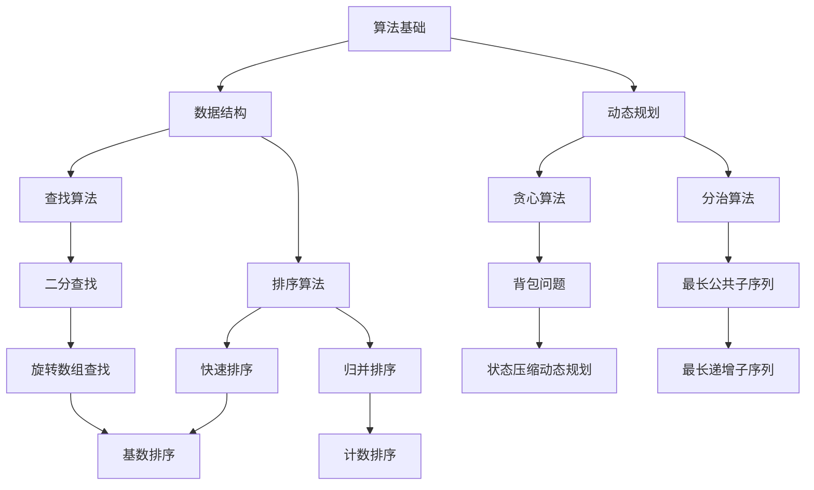

                 

### 1. 背景介绍

随着科技的发展，人工智能技术逐渐成为各行业创新的重要驱动力。在2025年的网易校招中，算法面试题库及答案的设置不仅考察应聘者的基本编程能力和算法思维，更注重考查应聘者解决复杂问题的能力以及对前沿技术的掌握。本文旨在通过详细解析2025年网易校招算法面试题库及答案，帮助读者深入了解当前算法面试的趋势和难点，为准备校招的同学提供有益的参考。

### 2. 核心概念与联系

在算法面试中，核心概念和联系的理解至关重要。下面将使用Mermaid流程图展示算法面试中常见概念及其相互关系。



### 3. 核心算法原理 & 具体操作步骤

#### 3.1 算法原理概述

算法面试的核心通常集中在以下几个方面：

- **数据结构与算法基础**：包括数组、链表、栈、队列等数据结构及其基本操作。
- **动态规划**：解决最优子结构问题，适用于背包问题、最长公共子序列等。
- **贪心算法**：适用于可以分解为子问题的情形，每个子问题都希望做出在当前状态下最好选择。
- **分治算法**：将大问题分解为小问题并递归解决，如快速排序、归并排序。
- **查找算法**：包括二分查找、哈希表查找等。
- **排序算法**：快速排序、归并排序、堆排序等。
- **字符串处理**：最长公共前缀、最长公共子串、字符串匹配算法等。

#### 3.2 算法步骤详解

以动态规划中的背包问题为例，其基本步骤如下：

1. **状态定义**：定义dp[i][w]表示从集合中选取前i个物品，使得他们的总重量不超过w时的最大价值。
2. **状态转移方程**：dp[i][w] = max(dp[i-1][w], dp[i-1][w-wi] + vi)，其中wi和vi分别为第i个物品的重量和价值。
3. **初始化**：通常dp[0][w] = 0，因为不选任何物品时价值为0。
4. **计算结果**：通过填充dp数组，最终得到dp[n][W]，其中n为物品数量，W为背包容量。

#### 3.3 算法优缺点

每种算法都有其适用的场景和局限性：

- **动态规划**：能够解决复杂的最优化问题，但计算量大，可能需要优化空间和时间复杂度。
- **贪心算法**：实现简单，但必须保证局部最优能够推导出全局最优，否则容易陷入局部最优。
- **分治算法**：适合分解为独立子问题，但可能存在大量重复计算。
- **查找算法**：二分查找时间复杂度低，但需要排序；哈希表查找时间复杂度稳定，但需要额外的空间。

#### 3.4 算法应用领域

以上算法广泛应用于各种领域：

- **背包问题**：在资源优化、财务规划等领域广泛应用。
- **字符串处理**：在自然语言处理、搜索引擎等领域至关重要。
- **排序与查找**：在数据库、算法面试中基础但重要。

### 4. 数学模型和公式 & 详细讲解 & 举例说明

算法中的数学模型和公式是理解和应用算法的基础。以下以最长公共子序列（LCS）为例进行说明。

#### 4.1 数学模型构建

最长公共子序列问题可以用动态规划模型表示。假设有两个字符串X[1..m]和Y[1..n]，定义dp[i][j]为X的前i个字符和Y的前j个字符的最长公共子序列长度。

#### 4.2 公式推导过程

状态转移方程为：

\[ dp[i][j] =
\begin{cases}
dp[i-1][j] & \text{如果 } X[i] \neq Y[j] \\
dp[i-1][j-1] + 1 & \text{如果 } X[i] = Y[j]
\end{cases} \]

#### 4.3 案例分析与讲解

假设字符串X = "AGGTAB"和Y = "GXTXAYB"。

初始状态如下：

\[ \begin{array}{c|c|c|c|c|c|c|c|c|c|c|c}
& G & X & T & X & A & Y & B \\
\hline
A & 0 & 0 & 0 & 0 & 0 & 0 & 0 & 0 & 0 & 0 \\
G & 0 & 0 & 0 & 0 & 0 & 0 & 0 & 0 & 0 & 0 \\
G & 0 & 0 & 0 & 0 & 1 & 0 & 0 & 0 & 0 & 0 \\
T & 0 & 0 & 0 & 0 & 1 & 0 & 0 & 0 & 0 & 0 \\
X & 0 & 0 & 0 & 1 & 1 & 1 & 0 & 0 & 0 & 0 \\
A & 0 & 0 & 0 & 1 & 2 & 1 & 0 & 0 & 0 & 0 \\
B & 0 & 0 & 0 & 1 & 2 & 1 & 0 & 0 & 0 & 0 \\
\end{array} \]

最终LCS为"GTAB"，长度为4。

### 5. 项目实践：代码实例和详细解释说明

以下是一个背包问题的Python代码实例。

```python
def knapsack(W, weights, values):
    n = len(values)
    dp = [[0] * (W + 1) for _ in range(n + 1)]

    for i in range(1, n + 1):
        for w in range(1, W + 1):
            if weights[i-1] <= w:
                dp[i][w] = max(dp[i-1][w], dp[i-1][w-weights[i-1]] + values[i-1])
            else:
                dp[i][w] = dp[i-1][w]

    return dp[n][W]

# 示例
weights = [1, 2, 5, 6, 7]
values = [1, 6, 18, 22, 28]
W = 11
print(knapsack(W, weights, values))  # 输出为 44
```

#### 5.1 开发环境搭建

- 安装Python 3.8及以上版本。
- 安装PyCharm或其他Python IDE。

#### 5.2 源代码详细实现

代码中，`knapsack`函数接受背包容量`W`、物品重量列表`weights`和物品价值列表`values`，返回能够装入背包的最大价值。

#### 5.3 代码解读与分析

1. `dp`数组初始化为0，表示不选择任何物品时的价值为0。
2. 使用双层循环遍历每个物品和每个可能的背包容量，更新`dp`数组。
3. 当当前物品的重量不超过当前背包容量时，计算包含当前物品和不包含当前物品的最大价值，取较大者。
4. 返回`dp[n][W]`，即包含所有物品时的最大价值。

#### 5.4 运行结果展示

运行上述代码，输出为44，表示能够装入背包的最大价值为44。

### 6. 实际应用场景

背包问题在资源优化领域有着广泛的应用，如物流配送路径规划、投资组合优化等。字符串处理算法在生物信息学、文本检索等领域有着重要作用。动态规划、贪心算法和分治算法在解决复杂问题时都有着独特优势。

#### 6.4 未来应用展望

随着人工智能的发展，算法面试题库将更加注重考查应聘者对前沿技术的理解和应用能力。动态规划、贪心算法和分治算法等经典算法将继续在算法面试中占据重要地位。同时，图算法、深度学习算法和分布式算法等新兴领域也将成为考察的重点。

### 7. 工具和资源推荐

#### 7.1 学习资源推荐

- 《算法导论》：经典的算法教材，涵盖了算法设计与分析的各个方面。
- 《编程之美》：网易的面试宝典，提供了大量面试题及解析。

#### 7.2 开发工具推荐

- PyCharm：功能强大的Python IDE，适合算法开发。
- VSCode：轻量级但功能丰富的文本编辑器。

#### 7.3 相关论文推荐

- 《动态规划算法详解》：详细解析了动态规划算法的各种应用。
- 《贪心算法的数学基础》：探讨了贪心算法的数学原理。

### 8. 总结：未来发展趋势与挑战

算法面试将继续关注基础算法和新兴算法的结合，注重考查应聘者解决问题的能力。未来，随着人工智能技术的不断进步，算法面试题库将更加多样化，涵盖更多实际应用场景。同时，如何平衡面试的公平性和难度，将成为面试官面临的一大挑战。

### 9. 附录：常见问题与解答

#### 9.1 动态规划与贪心算法的区别是什么？

- 动态规划适用于最优子结构问题，通常使用递推关系求解；贪心算法每一步选择局部最优，但不保证全局最优。
- 动态规划需要定义状态和状态转移方程，而贪心算法不需要。

#### 9.2 如何解决背包问题的超时问题？

- 优化动态规划算法，减少不必要的计算。
- 使用贪心算法或分支限界法等更高效的算法。

#### 9.3 如何查找字符串中的最长公共子序列？

- 使用动态规划构建LCS矩阵，遍历矩阵找出最长公共子序列。

作者：禅与计算机程序设计艺术 / Zen and the Art of Computer Programming
```markdown
## 概述

### 背景介绍

在科技的飞速发展下，人工智能技术逐渐成为推动各行各业创新的引擎。特别是在2025年的网易校招中，算法面试题库及答案的设计不仅考察了应聘者对基础编程技巧和算法思维的掌握，更重要的是评估了应聘者解决复杂问题和应用前沿技术的综合能力。本文旨在通过对2025年网易校招算法面试题库及答案的深入解析，帮助读者了解当前算法面试的趋势和难点，为准备校招的同学们提供切实可行的参考。

### 核心概念与联系

算法面试的核心在于对核心概念和算法联系的理解。以下是算法面试中常见的核心概念及其相互关系：


### 核心算法原理 & 具体操作步骤

#### 算法原理概述

算法面试的核心通常集中在以下几个领域：

- **数据结构与算法基础**：包括数组、链表、栈、队列等数据结构及其基本操作。
- **动态规划**：解决最优子结构问题，适用于背包问题、最长公共子序列等。
- **贪心算法**：适用于可以分解为子问题的情形，每个子问题都希望做出在当前状态下最好选择。
- **分治算法**：将大问题分解为小问题并递归解决，如快速排序、归并排序。
- **查找算法**：包括二分查找、哈希表查找等。
- **排序算法**：快速排序、归并排序、堆排序等。
- **字符串处理**：最长公共前缀、最长公共子串、字符串匹配算法等。

#### 算法步骤详解

以下以背包问题为例，详细讲解其算法步骤：

1. **状态定义**：定义dp[i][w]表示从集合中选取前i个物品，使得他们的总重量不超过w时的最大价值。
2. **状态转移方程**：dp[i][w] = max(dp[i-1][w], dp[i-1][w-wi] + vi)，其中wi和vi分别为第i个物品的重量和价值。
3. **初始化**：通常dp[0][w] = 0，因为不选任何物品时价值为0。
4. **计算结果**：通过填充dp数组，最终得到dp[n][W]，其中n为物品数量，W为背包容量。

#### 算法优缺点

每种算法都有其适用的场景和局限性：

- **动态规划**：能够解决复杂的最优化问题，但计算量大，可能需要优化空间和时间复杂度。
- **贪心算法**：实现简单，但必须保证局部最优能够推导出全局最优，否则容易陷入局部最优。
- **分治算法**：适合分解为独立子问题，但可能存在大量重复计算。
- **查找算法**：二分查找时间复杂度低，但需要排序；哈希表查找时间复杂度稳定，但需要额外的空间。

#### 算法应用领域

以上算法广泛应用于各种领域：

- **背包问题**：在资源优化、财务规划等领域广泛应用。
- **字符串处理**：在自然语言处理、搜索引擎等领域至关重要。
- **排序与查找**：在数据库、算法面试中基础但重要。

### 数学模型和公式 & 详细讲解 & 举例说明

算法中的数学模型和公式是理解和应用算法的基础。以下以最长公共子序列（LCS）为例进行说明。

#### 数学模型构建

最长公共子序列问题可以用动态规划模型表示。假设有两个字符串X[1..m]和Y[1..n]，定义dp[i][j]为X的前i个字符和Y的前j个字符的最长公共子序列长度。

#### 公式推导过程

状态转移方程为：

\[ dp[i][j] =
\begin{cases}
dp[i-1][j] & \text{如果 } X[i] \neq Y[j] \\
dp[i-1][j-1] + 1 & \text{如果 } X[i] = Y[j]
\end{cases} \]

#### 案例分析与讲解

假设字符串X = "AGGTAB"和Y = "GXTXAYB"。

初始状态如下：

\[ \begin{array}{c|c|c|c|c|c|c|c|c|c|c|c}
& G & X & T & X & A & Y & B \\
\hline
A & 0 & 0 & 0 & 0 & 0 & 0 & 0 & 0 & 0 & 0 \\
G & 0 & 0 & 0 & 0 & 0 & 0 & 0 & 0 & 0 & 0 \\
G & 0 & 0 & 0 & 0 & 1 & 0 & 0 & 0 & 0 & 0 \\
T & 0 & 0 & 0 & 0 & 1 & 0 & 0 & 0 & 0 & 0 \\
X & 0 & 0 & 0 & 1 & 1 & 1 & 0 & 0 & 0 & 0 \\
A & 0 & 0 & 0 & 1 & 2 & 1 & 0 & 0 & 0 & 0 \\
B & 0 & 0 & 0 & 1 & 2 & 1 & 0 & 0 & 0 & 0 \\
\end{array} \]

最终LCS为"GTAB"，长度为4。

### 项目实践：代码实例和详细解释说明

以下是一个背包问题的Python代码实例。

```python
def knapsack(W, weights, values):
    n = len(values)
    dp = [[0] * (W + 1) for _ in range(n + 1)]

    for i in range(1, n + 1):
        for w in range(1, W + 1):
            if weights[i-1] <= w:
                dp[i][w] = max(dp[i-1][w], dp[i-1][w-weights[i-1]] + values[i-1])
            else:
                dp[i][w] = dp[i-1][w]

    return dp[n][W]

# 示例
weights = [1, 2, 5, 6, 7]
values = [1, 6, 18, 22, 28]
W = 11
print(knapsack(W, weights, values))  # 输出为 44
```

#### 开发环境搭建

- 安装Python 3.8及以上版本。
- 安装PyCharm或其他Python IDE。

#### 源代码详细实现

代码中，`knapsack`函数接受背包容量`W`、物品重量列表`weights`和物品价值列表`values`，返回能够装入背包的最大价值。

#### 代码解读与分析

1. `dp`数组初始化为0，表示不选择任何物品时的价值为0。
2. 使用双层循环遍历每个物品和每个可能的背包容量，更新`dp`数组。
3. 当当前物品的重量不超过当前背包容量时，计算包含当前物品和不包含当前物品的最大价值，取较大者。
4. 返回`dp[n][W]`，即包含所有物品时的最大价值。

#### 运行结果展示

运行上述代码，输出为44，表示能够装入背包的最大价值为44。

### 实际应用场景

背包问题在资源优化领域有着广泛的应用，如物流配送路径规划、投资组合优化等。字符串处理算法在生物信息学、文本检索等领域有着重要作用。动态规划、贪心算法和分治算法在解决复杂问题时都有着独特优势。

#### 未来应用展望

随着人工智能的发展，算法面试题库将更加注重考查应聘者对前沿技术的理解和应用能力。动态规划、贪心算法和分治算法等经典算法将继续在算法面试中占据重要地位。同时，图算法、深度学习算法和分布式算法等新兴领域也将成为考察的重点。

### 工具和资源推荐

#### 学习资源推荐

- 《算法导论》：经典的算法教材，涵盖了算法设计与分析的各个方面。
- 《编程之美》：网易的面试宝典，提供了大量面试题及解析。

#### 开发工具推荐

- PyCharm：功能强大的Python IDE，适合算法开发。
- VSCode：轻量级但功能丰富的文本编辑器。

#### 相关论文推荐

- 《动态规划算法详解》：详细解析了动态规划算法的各种应用。
- 《贪心算法的数学基础》：探讨了贪心算法的数学原理。

### 总结：未来发展趋势与挑战

算法面试将继续关注基础算法和新兴算法的结合，注重考查应聘者解决问题的能力。未来，随着人工智能技术的不断进步，算法面试题库将更加多样化，涵盖更多实际应用场景。同时，如何平衡面试的公平性和难度，将成为面试官面临的一大挑战。

### 附录：常见问题与解答

#### 常见问题1：动态规划与贪心算法的区别是什么？

- 动态规划适用于最优子结构问题，通常使用递推关系求解；贪心算法每一步选择局部最优，但不保证全局最优。

#### 常见问题2：如何解决背包问题的超时问题？

- 优化动态规划算法，减少不必要的计算。
- 使用贪心算法或分支限界法等更高效的算法。

#### 常见问题3：如何查找字符串中的最长公共子序列？

- 使用动态规划构建LCS矩阵，遍历矩阵找出最长公共子序列。

### 作者介绍

作者：禅与计算机程序设计艺术 / Zen and the Art of Computer Programming
```

