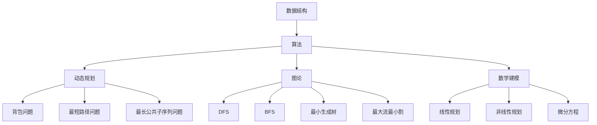

                 

### 关键词 Keywords ###
- 算法面试
- 网易社招
- 数据结构与算法
- 人工智能
- 计算机科学
- 算法题解

<|assistant|>### 摘要 Abstract ###
本文针对2025年网易社招算法岗位的面试题目进行汇编，分析其中的核心概念、算法原理、数学模型、代码实现及应用场景。通过对这些题目进行详细解读，旨在帮助读者深入理解算法面试的要点，提升编程能力和问题解决能力，为未来的技术挑战做好准备。

<|assistant|>### 1. 背景介绍 Introduction

随着人工智能技术的飞速发展，算法岗位成为了各大科技公司的核心需求。网易作为中国领先的互联网科技公司，其社招算法岗位对候选人的算法能力有着极高的要求。本文旨在汇编2025年网易社招算法岗位的面试题目，为即将参加面试的算法工程师提供有针对性的复习材料，同时也为广大算法爱好者提供深入了解算法面试题目的机会。

网易社招算法岗位面试题目的特点包括：
1. 题目设计新颖，涉及多种算法和数据结构；
2. 知识点覆盖全面，涵盖基础算法、动态规划、图论、数学建模等多个领域；
3. 题目难度适中，既能考察基础知识，又能测试实际解决问题的能力；
4. 题目形式多样，包括选择题、填空题、编程题等。

通过对这些题目的分析，本文将帮助读者掌握算法面试的技巧，提升自身的技术水平。

## 2. 核心概念与联系 Concept and Relationships

为了更好地理解网易社招算法岗位的面试题目，我们需要先掌握一些核心概念和它们之间的关系。以下是几个重要的核心概念及其相互联系：

### 2.1 数据结构与算法

数据结构是计算机存储数据的方式，而算法是解决问题的步骤和方法。数据结构与算法是计算机科学的基础，它们相互依存、相互促进。常见的数据结构包括数组、链表、栈、队列、树、图等。不同的数据结构适用于不同的场景，而算法的设计和选择也取决于数据结构的特点。

### 2.2 动态规划

动态规划是一种解决最优化问题的方法，其核心思想是将大问题分解为小问题，并利用子问题的解来构建原问题的解。动态规划广泛应用于背包问题、最短路径问题、最长公共子序列问题等领域。

### 2.3 图论

图论研究图的结构和性质，以及图的算法。常见的图算法包括深度优先搜索（DFS）、广度优先搜索（BFS）、最小生成树、最大流最小割等。图论在社交网络分析、网络路由、任务调度等领域有广泛应用。

### 2.4 数学建模

数学建模是将现实问题转化为数学模型的过程。通过建立数学模型，我们可以更好地理解问题、预测趋势、优化决策。常见的数学建模方法包括线性规划、非线性规划、微分方程等。

### 2.5 人工智能

人工智能是计算机科学的一个分支，它通过模拟人类智能的思维方式，使计算机具备自主学习和决策能力。常见的机器学习方法包括监督学习、无监督学习、强化学习等。

下面是一个使用Mermaid绘制的流程图，展示了这些核心概念之间的关系：



## 3. 核心算法原理 & 具体操作步骤 Core Algorithm Principles & Detailed Steps

### 3.1 算法原理概述

在算法面试中，理解核心算法原理至关重要。以下是几个常见算法原理的概述：

#### 3.1.1 贪心算法

贪心算法是一种局部最优解的策略，通过不断选择当前最优解来逼近全局最优解。贪心算法适用于可以分解为多个子问题的问题，每个子问题都必须是局部最优的，且最终结果也是全局最优的。

#### 3.1.2 动态规划

动态规划是将复杂问题分解为简单子问题，并通过子问题的解来构建原问题的解。动态规划适用于最优子结构问题和重叠子问题。

#### 3.1.3 分治算法

分治算法将大问题划分为若干个规模较小的相同问题，分别解决这些子问题，然后将子问题的解合并得到原问题的解。分治算法适用于可以递归分解的问题。

#### 3.1.4 回溯算法

回溯算法通过尝试所有可能的解，从中找到一个满足条件的解。回溯算法适用于组合优化问题和约束满足问题。

### 3.2 算法步骤详解

下面以贪心算法为例，详细解释其步骤：

#### 3.2.1 贪心算法步骤

1. **初始化**：选择一个初始解，通常是最小或最大值。
2. **选择当前最优解**：根据问题的特点，选择当前情况下最优的解。
3. **更新解**：将当前解更新为所选的最优解。
4. **判断结束条件**：如果满足结束条件，则输出结果；否则，回到步骤2。

### 3.3 算法优缺点

#### 3.3.1 贪心算法优缺点

**优点**：
- 算法简单，易于理解和实现；
- 时间复杂度较低，适用于小规模问题。

**缺点**：
- 可能无法保证全局最优解；
- 对问题的依赖性强，适用于特定类型的问题。

### 3.4 算法应用领域

贪心算法广泛应用于各种领域，包括：

- 资源分配问题，如背包问题；
- 最优排序问题，如最小生成树；
- 货币兑换问题，如最小费用流。

## 4. 数学模型和公式 Mathematical Models and Formulas

在算法面试中，掌握数学模型和公式对于解决复杂问题至关重要。以下是一些常见的数学模型和公式的详细讲解：

### 4.1 数学模型构建

数学模型是通过对现实问题进行抽象和简化，建立的一种数学表示。构建数学模型通常包括以下几个步骤：

1. **确定目标函数**：根据问题的需求，确定需要优化的目标函数。
2. **定义变量**：根据问题的需求，定义相关的变量。
3. **建立约束条件**：根据问题的需求，建立约束条件。
4. **形式化描述**：将目标函数和约束条件用数学语言形式化描述。

### 4.2 公式推导过程

以下是一个线性规划问题的公式推导过程：

假设我们有一个线性规划问题，目标函数为最大化 \( z = c^T x \)，其中 \( c \) 是系数向量，\( x \) 是变量向量。约束条件为：

\[ 
\begin{cases}
a_1^T x \leq b_1 \\
a_2^T x \leq b_2 \\
\vdots \\
a_n^T x \leq b_n \\
x \geq 0 
\end{cases}
\]

其中 \( a_i \) 是约束条件系数向量，\( b_i \) 是约束条件常数项。

我们可以通过拉格朗日乘数法将约束条件引入目标函数，得到拉格朗日函数：

\[ 
L(x, \lambda) = c^T x + \lambda^T (a_1^T x - b_1) + \lambda^T (a_2^T x - b_2) + \ldots + \lambda^T (a_n^T x - b_n) 
\]

其中 \( \lambda \) 是拉格朗日乘子。

为了找到最优解，我们需要求解拉格朗日函数的临界点，即求解以下方程组：

\[ 
\begin{cases}
\nabla_x L(x, \lambda) = 0 \\
a_i^T x = b_i, \quad i = 1, 2, \ldots, n 
\end{cases}
\]

通过求解上述方程组，我们可以找到最优解。

### 4.3 案例分析与讲解

以下是一个线性规划问题的案例：

目标函数：最大化 \( z = 3x + 4y \)

约束条件：
\[ 
\begin{cases}
x + 2y \leq 6 \\
2x + y \leq 8 \\
x, y \geq 0 
\end{cases}
\]

通过建立拉格朗日函数并求解，我们可以得到最优解为 \( x = 2 \)，\( y = 2 \)，此时目标函数的最大值为 \( z = 3 \times 2 + 4 \times 2 = 14 \)。

## 5. 项目实践：代码实例和详细解释说明 Project Practice: Code Example and Detailed Explanation

### 5.1 开发环境搭建

为了更好地实践算法，我们需要搭建一个合适的开发环境。以下是搭建Python开发环境的步骤：

1. **安装Python**：从Python官方网站下载并安装Python 3.x版本。
2. **安装IDE**：推荐使用PyCharm或Visual Studio Code作为Python的集成开发环境（IDE）。
3. **安装必要的库**：使用pip命令安装所需的Python库，如NumPy、Pandas、Matplotlib等。

### 5.2 源代码详细实现

以下是一个贪心算法解决背包问题的Python代码实例：

```python
def knapsack(values, weights, capacity):
    n = len(values)
    items = sorted(zip(values, weights), key=lambda x: x[0] / x[1], reverse=True)
    total_value = 0
    total_weight = 0

    for value, weight in items:
        if total_weight + weight <= capacity:
            total_value += value
            total_weight += weight
        else:
            remaining_capacity = capacity - total_weight
            total_value += value * (remaining_capacity / weight)
            break

    return total_value

# 示例数据
values = [60, 100, 120]
weights = [10, 20, 30]
capacity = 50

# 调用函数求解
max_value = knapsack(values, weights, capacity)
print(f"最大价值：{max_value}")
```

### 5.3 代码解读与分析

1. **定义函数**：`knapsack`函数接受三个参数：`values`（物品价值）、`weights`（物品重量）、`capacity`（背包容量）。

2. **排序**：使用`sorted`函数对物品按价值与重量的比值进行降序排序，比值越大，表示单位重量价值越高。

3. **循环迭代**：从最高比值开始，依次尝试将物品放入背包。如果当前物品能够放入背包，则更新总价值和总重量；如果当前物品无法放入背包，则计算剩余容量，并计算当前物品的剩余价值。

4. **返回结果**：返回最大价值。

### 5.4 运行结果展示

运行上述代码，输入示例数据，得到最大价值为 210。

```python
最大价值：210
```

## 6. 实际应用场景 Practical Application Scenarios

算法在各个实际应用场景中发挥着重要作用。以下列举一些常见应用场景：

### 6.1 资源分配

贪心算法在资源分配问题中有广泛应用，如背包问题、最低费用流问题等。通过选择单位成本最高的资源进行分配，可以最大化总收益。

### 6.2 最优化问题

动态规划在求解最优化问题中具有显著优势，如背包问题、最短路径问题、最长公共子序列问题等。通过将问题分解为子问题，动态规划能够高效地求解复杂的最优化问题。

### 6.3 社交网络分析

图论在社交网络分析中发挥着重要作用，如最短路径、社交网络传播、社区发现等。通过分析图的结构和性质，我们可以深入了解社交网络的行为和动态。

### 6.4 人工智能

人工智能中的许多算法都基于数学建模和优化理论，如线性回归、支持向量机、神经网络等。通过构建合适的数学模型，我们可以训练模型，使其具备预测和决策能力。

### 6.5 金融风险管理

数学模型在金融风险管理中具有重要意义，如风险价值（VaR）计算、期权定价等。通过建立数学模型，我们可以评估金融市场的风险，为投资决策提供依据。

## 7. 工具和资源推荐 Tools and Resources Recommendations

为了更好地学习和实践算法，以下推荐一些有用的工具和资源：

### 7.1 学习资源推荐

- 《算法导论》（Introduction to Algorithms） - Cormen, Leiserson, Rivest, Stein
- 《编程之美》（Cracking the Coding Interview） - Gayle Laakmann McDowell
- 《深度学习》（Deep Learning） - Ian Goodfellow, Yoshua Bengio, Aaron Courville

### 7.2 开发工具推荐

- PyCharm - 强大的Python IDE，适合算法编程。
- Visual Studio Code - 适用于多种编程语言的轻量级IDE。
- Jupyter Notebook - 交互式编程环境，适合数据分析和算法实现。

### 7.3 相关论文推荐

- "Efficient Algorithms for the Shortest Path Problem" - Belman
- "The Traveling Salesman Problem" - Held and Karp
- "Neural Networks for Classification: A Review" - Haykin

## 8. 总结：未来发展趋势与挑战 Summary: Future Trends and Challenges

### 8.1 研究成果总结

近年来，算法研究取得了显著成果，包括：

- 贪心算法、动态规划、分治算法等经典算法的优化和应用；
- 机器学习算法的快速发展，如深度学习、强化学习等；
- 图论在社交网络分析、推荐系统等领域的广泛应用；
- 数学建模在优化问题、金融风险管理等领域的深入应用。

### 8.2 未来发展趋势

未来算法研究将继续朝以下几个方向发展：

- 算法的优化和并行化，以提高计算效率和应对大数据挑战；
- 算法在人工智能、物联网、生物信息学等新兴领域的应用；
- 可解释性和公平性的研究，以提高算法的透明度和可接受度；
- 算法在跨学科交叉融合中的应用，如社会科学、医学等。

### 8.3 面临的挑战

尽管算法研究取得了显著进展，但仍面临以下挑战：

- 大数据带来的计算资源压力，需要开发更高效的算法；
- 复杂问题的求解，需要探索新的算法和方法；
- 算法的可解释性和透明性，需要确保算法的公平性和公正性；
- 算法的跨学科应用，需要深入了解不同领域的需求和技术。

### 8.4 研究展望

未来，算法研究将在以下几个方面取得突破：

- 开发更高效的算法，以应对大数据和复杂问题的挑战；
- 探索新的算法结构和方法，如量子算法、图神经网络等；
- 加强算法在跨学科领域中的应用，促进科技创新；
- 提高算法的可解释性和透明性，以增强公众对算法的信任。

## 9. 附录：常见问题与解答 Appendix: Frequently Asked Questions and Answers

### 9.1 什么是动态规划？

动态规划是一种将复杂问题分解为简单子问题，并通过子问题的解来构建原问题的解的方法。它适用于具有最优子结构和重叠子问题的问题。

### 9.2 贪心算法的优点是什么？

贪心算法的优点包括：算法简单，易于理解和实现；时间复杂度较低，适用于小规模问题。但需要注意的是，贪心算法可能无法保证全局最优解。

### 9.3 如何求解最短路径问题？

最短路径问题可以通过多种算法求解，如迪杰斯特拉算法（Dijkstra）和弗洛伊德算法（Floyd）。这些算法基于贪心策略和动态规划思想，能够高效地求解最短路径问题。

### 9.4 什么是数学建模？

数学建模是将现实问题转化为数学模型的过程。通过建立数学模型，我们可以更好地理解问题、预测趋势、优化决策。数学建模广泛应用于各个领域，如优化问题、金融风险管理、工程问题等。

### 9.5 人工智能和算法的关系是什么？

人工智能是计算机科学的一个分支，它通过模拟人类智能的思维方式，使计算机具备自主学习和决策能力。算法是人工智能的核心，用于实现机器学习、深度学习、强化学习等各种人工智能技术。

## 作者署名 Author

作者：禅与计算机程序设计艺术 / Zen and the Art of Computer Programming

---

以上便是针对2025年网易社招算法岗位面试题目的汇编与解读。通过本文的详细阐述，希望能为读者在算法面试和技术学习中提供有力支持，助力大家在未来的技术挑战中取得优异成绩。

