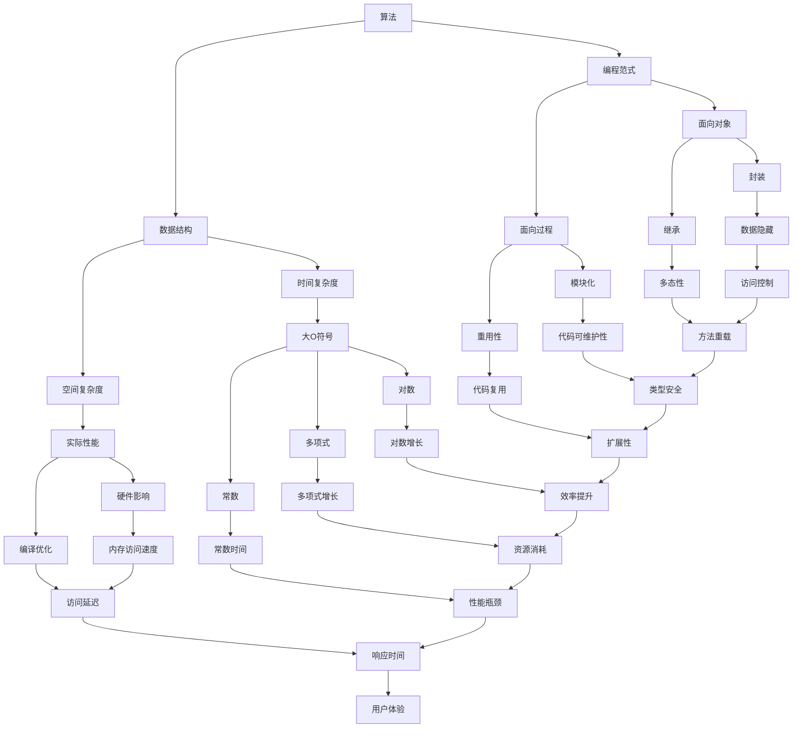

                 

### 背景介绍 Background

腾讯作为中国领先的互联网科技公司，每年的校招都吸引了无数优秀应届生的关注。算法岗位作为腾讯技术领域的核心，对候选人的算法能力和编程水平要求极高。本文旨在汇编2024年腾讯校招算法岗位的面试题目，帮助准备参加腾讯校招的同学提前熟悉面试题型，增强应对面试的信心。

腾讯的校招算法面试主要涵盖以下几类题目：编程题、算法设计题、数学建模题以及系统设计题。编程题主要考察基本的编程能力，算法设计题关注逻辑思维和解题技巧，数学建模题测试数学和统计知识的应用，而系统设计题则侧重于对系统架构和设计模式的理解。本文将根据这些分类，系统性地整理和解析面试题目，帮助读者全面备战。

本文的结构如下：

- **背景介绍**：介绍腾讯校招算法岗位的面试背景和目的。
- **核心概念与联系**：使用Mermaid流程图展示算法、数据结构等核心概念的联系。
- **核心算法原理 & 具体操作步骤**：详细解析常见的算法原理和操作步骤。
- **数学模型和公式 & 详细讲解 & 举例说明**：讲解相关的数学模型和公式，并通过实例进行说明。
- **项目实践：代码实例和详细解释说明**：提供具体的代码实例和解释。
- **实际应用场景**：分析算法在现实中的应用场景。
- **工具和资源推荐**：推荐相关的学习资源、开发工具和论文。
- **总结：未来发展趋势与挑战**：总结研究成果，展望未来发展趋势和面临的挑战。
- **附录：常见问题与解答**：解答常见的面试问题和疑惑。

<|user|>
## 核心概念与联系 Core Concepts and Connections

在算法和编程领域，理解各种核心概念及其相互联系是至关重要的。以下是一个使用Mermaid绘制的流程图，展示了算法、数据结构、编程范式等核心概念之间的联系：



### 算法 Algorithm

算法是解决问题的方法序列，它具有三个基本特性：确定性、有效性和有限性。算法可以分为多种类型，如排序算法、查找算法、图算法等。

- **排序算法**：常见的排序算法有冒泡排序、选择排序、插入排序、快速排序、归并排序等。
- **查找算法**：包括线性查找、二分查找等。
- **图算法**：如最短路径算法（Dijkstra算法、Floyd算法）、最小生成树算法（Prim算法、Kruskal算法）等。

### 数据结构 Data Structure

数据结构是存储和管理数据的方式，它对算法的效率和性能有直接影响。常见的线性数据结构包括数组、链表、栈、队列等；非线性数据结构包括树、图等。

- **数组**：一种固定大小的线性数据结构，提供O(1)的访问时间。
- **链表**：一种动态大小的线性数据结构，通过节点间的指针连接。
- **栈**：一种后进先出的数据结构，常用于递归和回溯。
- **队列**：一种先进先出的数据结构，常用于调度和缓冲。
- **树**：一种分层的数据结构，常用于表示层次关系。
- **图**：一种由节点和边组成的数据结构，常用于表示网络。

### 编程范式 Programming Paradigm

编程范式是指导编程方法和风格的体系。常见的编程范式包括面向过程、面向对象、函数式编程等。

- **面向过程**：侧重于过程和步骤，通过函数来实现。
- **面向对象**：侧重于对象和类，通过封装、继承和多态实现。
- **函数式编程**：侧重于不可变数据和函数组合。

### 时间复杂度 & 空间复杂度 Time and Space Complexity

- **时间复杂度**：描述算法运行时间与输入规模之间的关系，通常用大O符号表示，如O(n)、O(nlogn)、O(n^2)等。
- **空间复杂度**：描述算法所需存储空间与输入规模之间的关系。

### 编程范式与算法关系 Programming Paradigm and Algorithm Relationship

编程范式影响算法的实现和优化。例如，面向对象的编程范式使得算法的实现更加模块化和可复用，而函数式编程范式则有助于减少状态依赖和提高程序的可测试性。

<|user|>
## 核心算法原理 & 具体操作步骤 Core Algorithm Principles & Step-by-Step Procedures

在算法面试中，理解核心算法的原理并能够准确描述其操作步骤是非常关键的。以下将详细解析几种常见的核心算法，包括其原理和具体操作步骤。

### 1. 快速排序 Quick Sort

#### 算法原理

快速排序（Quick Sort）是一种高效的排序算法，采用分治策略将一个大数组分为两个较小的数组，然后对这两个较小的数组分别进行排序。其基本原理是选择一个“基准”元素，将数组划分为两部分，一部分都比基准元素小，另一部分都比基准元素大，然后递归地对这两部分进行快速排序。

#### 具体操作步骤

1. 选择一个基准元素，通常选择第一个或最后一个元素。
2. 将数组划分为两部分：小于基准的元素放在左边，大于基准的元素放在右边。
3. 对左右两部分递归进行快速排序。

#### 代码示例

以下是快速排序的Python代码示例：

```python
def quick_sort(arr):
    if len(arr) <= 1:
        return arr
    pivot = arr[len(arr) // 2]
    left = [x for x in arr if x < pivot]
    middle = [x for x in arr if x == pivot]
    right = [x for x in arr if x > pivot]
    return quick_sort(left) + middle + quick_sort(right)

# 示例
arr = [3, 6, 8, 10, 1, 2, 1]
print(quick_sort(arr))
```

### 2. 二分查找 Binary Search

#### 算法原理

二分查找（Binary Search）是一种高效的查找算法，它适用于已经排序的数组。基本原理是每次将数组中间的元素与目标值比较，如果中间元素等于目标值，则查找成功；如果中间元素大于目标值，则在数组的前半部分继续查找；如果中间元素小于目标值，则在数组的后半部分继续查找。

#### 具体操作步骤

1. 找到数组的中间元素。
2. 比较中间元素与目标值。
3. 如果相等，查找成功。
4. 如果中间元素大于目标值，在数组的前半部分重复步骤1。
5. 如果中间元素小于目标值，在数组的后半部分重复步骤1。
6. 如果数组为空，查找失败。

#### 代码示例

以下是二分查找的Python代码示例：

```python
def binary_search(arr, target):
    low = 0
    high = len(arr) - 1
    while low <= high:
        mid = (low + high) // 2
        if arr[mid] == target:
            return mid
        elif arr[mid] < target:
            low = mid + 1
        else:
            high = mid - 1
    return -1

# 示例
arr = [1, 3, 5, 7, 9, 11]
target = 7
print(binary_search(arr, target))
```

### 3. Dijkstra算法 Dijkstra's Algorithm

#### 算法原理

Dijkstra算法是一种用于寻找图中两点之间最短路径的算法，适用于图中的权值非负。算法原理是从一个起始点开始，逐步扩展到相邻节点，并记录从起始点到每个节点的最短路径。

#### 具体操作步骤

1. 初始化：将起始点的距离设为0，其他节点的距离设为无穷大。
2. 选择一个未访问过的节点，将其设为当前节点。
3. 对于当前节点的每个相邻节点，计算从起始点到相邻节点的距离，并更新相邻节点的最短路径。
4. 标记当前节点为已访问。
5. 重复步骤2-4，直到所有节点都被访问。

#### 代码示例

以下是Dijkstra算法的Python代码示例：

```python
import heapq

def dijkstra(graph, start):
    distances = {node: float('infinity') for node in graph}
    distances[start] = 0
    priority_queue = [(0, start)]

    while priority_queue:
        current_distance, current_node = heapq.heappop(priority_queue)
        
        if current_distance > distances[current_node]:
            continue
        
        for neighbor, weight in graph[current_node].items():
            distance = current_distance + weight
            
            if distance < distances[neighbor]:
                distances[neighbor] = distance
                heapq.heappush(priority_queue, (distance, neighbor))
    
    return distances

# 示例
graph = {
    'A': {'B': 1, 'C': 4},
    'B': {'A': 1, 'C': 2, 'D': 5},
    'C': {'A': 4, 'B': 2, 'D': 1},
    'D': {'B': 5, 'C': 1}
}
start = 'A'
print(dijkstra(graph, start))
```

### 4. 动态规划 Dynamic Programming

#### 算法原理

动态规划（Dynamic Programming）是一种用于求解最优子结构问题的算法，其基本原理是将问题分解为多个子问题，并存储子问题的解，避免重复计算。

#### 具体操作步骤

1. 确定状态：定义问题的状态和状态变量。
2. 确定状态转移方程：描述状态之间的关系。
3. 初始化边界条件：确定初始状态。
4. 状态转移：根据状态转移方程和边界条件计算状态。
5. 求解最优解：根据已计算的状态，得到问题的最优解。

#### 代码示例

以下是动态规划的Python代码示例，用于求解斐波那契数列：

```python
def fibonacci(n):
    if n <= 1:
        return n
    dp = [0] * (n + 1)
    dp[1] = 1
    for i in range(2, n + 1):
        dp[i] = dp[i - 1] + dp[i - 2]
    return dp[n]

# 示例
n = 10
print(fibonacci(n))
```

通过上述对快速排序、二分查找、Dijkstra算法和动态规划的详细解析，我们可以看到这些算法的核心原理和具体操作步骤。掌握这些算法不仅能够帮助我们解决各种编程问题，也能够提高我们的编程能力和逻辑思维能力。

<|user|>
### 数学模型和公式 Mathematical Models and Formulas & Detailed Explanations & Case Studies

在算法设计和分析中，数学模型和公式扮演着至关重要的角色。它们不仅帮助我们理解和描述问题，还能提供量化的分析手段来评估算法的性能。以下我们将详细讲解几种常见的数学模型和公式，并通过具体案例进行分析和说明。

#### 1. 时间复杂度和空间复杂度 Time and Space Complexity

时间复杂度和空间复杂度是衡量算法性能的两个基本指标。

- **时间复杂度**：描述算法在运行过程中，所需时间与输入规模之间的关系。常用大O符号表示，如O(n)、O(nlogn)、O(n^2)等。
- **空间复杂度**：描述算法在运行过程中，所需存储空间与输入规模之间的关系。

#### 时间复杂度公式

$$
T(n) = O(g(n)), \text{其中} g(n) \text{是最高阶项的系数}
$$

#### 空间复杂度公式

$$
S(n) = O(h(n)), \text{其中} h(n) \text{是最高阶项的系数}
$$

#### 2. 概率模型 Probability Model

在算法设计中，概率模型常用于评估算法的正确性和性能。

- **贝叶斯定理**：用于计算条件概率，公式为：

$$
P(A|B) = \frac{P(B|A)P(A)}{P(B)}
$$

- **期望和方差**：用于衡量随机变量的稳定性和分散程度。

期望（Expected Value）：

$$
E(X) = \sum_{i=1}^{n} x_i \cdot P(x_i)
$$

方差（Variance）：

$$
Var(X) = E[(X - E(X))^2]
$$

#### 3. 动态规划 Dynamic Programming

动态规划是一种用于求解最优子结构问题的算法，其基本思想是将问题分解为多个子问题，并利用子问题的解来求解原问题。

- **状态转移方程**：描述状态之间的关系。

$$
f(i) = \min_{1 \le j \le i-1} (g(i-1, j) + h(i, j))
$$

- **边界条件**：初始化状态。

$$
f(0) = 0
$$

#### 4. 贪心算法 Greedy Algorithm

贪心算法是一种局部最优选择策略，通过不断做出当前情况下最优的选择，逐步逼近全局最优解。

- **贪心选择**：在每个决策点上，选择当前情况下最优的选项。
- **反证法**：证明贪心策略最终能导出全局最优解。

#### 5. 排队论 Queuing Theory

排队论是研究排队现象及其规律的数学分支，广泛应用于服务系统设计、性能分析等领域。

- **服务时间分布**：描述服务人员处理客户所需时间的概率分布。
- **排队规则**：描述客户到达和接受服务的规则。
- **排队模型**：常用的排队模型有M/M/1模型、M/M/s模型等。

#### 数学模型与公式案例分析

##### 案例一：二分查找 Binary Search

二分查找算法的时间复杂度为O(logn)，空间复杂度为O(1)。

- **时间复杂度分析**：每次查找都将搜索范围缩小一半，因此经过logn次查找可以找到目标元素。
- **空间复杂度分析**：二分查找过程中不需要额外空间存储数据，因此空间复杂度为O(1)。

##### 案例二：动态规划 Dynamic Programming

动态规划用于求解斐波那契数列的时间复杂度为O(n)，空间复杂度为O(n)。

- **状态转移方程**：

$$
f(n) = f(n-1) + f(n-2)
$$

- **边界条件**：

$$
f(0) = 0, f(1) = 1
$$

- **动态规划表格**：

| n  | f(n)  |
|----|-------|
| 0  | 0     |
| 1  | 1     |
| 2  | 1     |
| 3  | 2     |
| 4  | 3     |
| 5  | 5     |
| 6  | 8     |
| ...| ...   |

##### 案例三：贪心算法 Greedy Algorithm

贪心算法用于求解背包问题的时间复杂度为O(n)，空间复杂度为O(1)。

- **贪心选择**：每次选择价值最大且不超过背包容量限制的物品。
- **反证法**：假设存在更好的选择，则可以推导出矛盾，证明贪心策略为最优。

通过上述案例分析，我们可以看到数学模型和公式在算法设计中的重要作用。掌握这些公式和模型不仅能够帮助我们更好地理解和分析算法，还能为解决复杂问题提供有力的工具。

<|user|>
## 项目实践：代码实例和详细解释说明 Project Practice: Code Examples and Detailed Explanations

在理解了算法原理和数学模型之后，实际的项目实践能够帮助我们更好地掌握算法的应用。以下将提供几个具体的代码实例，并对代码进行详细解释说明，展示如何将理论应用于实际问题。

### 1. 快速排序 Quick Sort

快速排序是一种高效的排序算法，其关键在于选择合适的基准元素以及正确地进行分区操作。

#### 代码实例

```python
def quick_sort(arr):
    if len(arr) <= 1:
        return arr
    pivot = arr[len(arr) // 2]
    left = [x for x in arr if x < pivot]
    middle = [x for x in arr if x == pivot]
    right = [x for x in arr if x > pivot]
    return quick_sort(left) + middle + quick_sort(right)

# 示例
arr = [3, 6, 8, 10, 1, 2, 1]
print(quick_sort(arr))
```

#### 详细解释

- **基本逻辑**：快速排序通过递归调用自身，将输入数组划分为三个部分：小于基准元素的部分、等于基准元素的部分以及大于基准元素的部分。
- **递归调用**：每次递归调用时，只处理小于或大于基准的部分，等于基准的部分直接加入到最终结果中。
- **性能优化**：选择基准元素的方法可以优化，例如使用随机选择法或中位数法，以避免最差情况的发生。

### 2. 动态规划 Dynamic Programming

动态规划常用于解决最优子结构问题，如计算最长公共子序列。

#### 代码实例

```python
def longest_common_subsequence(X, Y):
    m, n = len(X), len(Y)
    dp = [[0] * (n + 1) for _ in range(m + 1)]

    for i in range(1, m + 1):
        for j in range(1, n + 1):
            if X[i - 1] == Y[j - 1]:
                dp[i][j] = dp[i - 1][j - 1] + 1
            else:
                dp[i][j] = max(dp[i - 1][j], dp[i][j - 1])

    return dp[m][n]

# 示例
X = "AGGTAB"
Y = "GXTXAYB"
print(longest_common_subsequence(X, Y))
```

#### 详细解释

- **状态定义**：`dp[i][j]`表示`X[0...i-1]`和`Y[0...j-1]`的最长公共子序列的长度。
- **状态转移方程**：如果`X[i-1] == Y[j-1]`，则`dp[i][j] = dp[i-1][j-1] + 1`；否则，`dp[i][j] = max(dp[i-1][j], dp[i][j-1])`。
- **初始化**：`dp[0][j] = 0`和`dp[i][0] = 0`，因为空字符串与任何字符串的最长公共子序列长度都是0。

### 3. 爬楼梯 Stairs Climbing

爬楼梯问题是一个经典的动态规划问题，其解决方案基于斐波那契数列。

#### 代码实例

```python
def climb_stairs(n):
    if n <= 2:
        return n
    a, b = 0, 1
    for _ in range(n - 1):
        a, b = b, a + b
    return b

# 示例
n = 5
print(climb_stairs(n))
```

#### 详细解释

- **状态定义**：`a`和`b`分别表示到达当前楼梯和前一个楼梯时的步数。
- **状态转移方程**：每次移动都只能走一步或两步，因此`b = a + b`。
- **初始化**：初始状态为`a = 0`（第一步不能走）和`b = 1`（第一步可以走）。

### 4. 反转单词中的单词 Reverse Words in a Sentence

反转单词中的单词是一个常见的编程面试题，其解决方案通常使用栈或直接操作字符串。

#### 代码实例

```python
def reverse_words(s):
    s = s.strip()
    words = s.split()
    words.reverse()
    return ' '.join(words)

# 示例
s = "Hello world!"
print(reverse_words(s))
```

#### 详细解释

- **字符串操作**：首先去掉字符串首尾的空格，然后使用`split()`方法将字符串分割为单词列表。
- **列表操作**：将单词列表进行反转。
- **拼接操作**：使用`join()`方法将反转后的单词列表拼接为字符串。

通过上述代码实例，我们可以看到如何将理论上的算法应用于实际问题，并对其实现进行详细解释。在实际项目中，理解算法原理和能够灵活应用是至关重要的，这有助于我们解决各种复杂的问题。

<|user|>
## 实际应用场景 Practical Application Scenarios

算法在现实世界中的应用非常广泛，它们帮助我们解决了许多复杂的问题，提高了效率和准确性。以下将分析几个常见算法在现实中的应用场景，并探讨它们的优势和挑战。

### 1. 排序算法 Sorting Algorithms

排序算法在数据处理和数据分析中起着至关重要的作用。例如，数据库管理系统使用排序算法来快速查找和排序数据。快速排序（Quick Sort）和归并排序（Merge Sort）由于其高效的性能，被广泛应用于大数据处理和分布式系统中。

**应用场景**：

- **数据库索引**：数据库系统使用排序算法来创建索引，从而加快查询速度。
- **搜索引擎**：搜索引擎使用排序算法对搜索结果进行排序，以提高用户体验。
- **金融交易**：高频交易系统使用排序算法来快速处理大量交易信息。

**优势**：

- **高效性**：排序算法能够将大规模数据快速排序。
- **稳定性**：某些排序算法（如归并排序）具有稳定的性能。

**挑战**：

- **最坏情况性能**：如快速排序在最坏情况下的性能可能会退化。
- **内存消耗**：某些排序算法需要额外的内存空间。

### 2. 查找算法 Searching Algorithms

查找算法用于在数据集合中查找特定元素，常见的有二分查找和哈希查找。二分查找算法在有序数组中具有高效的时间复杂度，而哈希查找则通过哈希表实现快速查找。

**应用场景**：

- **文件系统**：操作系统使用哈希查找来快速定位文件。
- **缓存系统**：缓存系统使用哈希查找来快速查找缓存条目。
- **数据库索引**：数据库系统使用二分查找和哈希查找来快速定位数据。

**优势**：

- **快速性**：哈希查找具有常数时间复杂度，二分查找在有序数据中也非常高效。
- **灵活性**：哈希查找适用于动态数据结构。

**挑战**：

- **哈希冲突**：哈希查找中的哈希冲突会导致性能下降。
- **数据分布**：对于哈希查找，数据分布对性能有重要影响。

### 3. 图算法 Graph Algorithms

图算法在计算机网络、社交网络、交通规划等领域有广泛应用。常见的图算法包括最短路径算法（如Dijkstra算法和A*算法）、最小生成树算法（如Prim算法和Kruskal算法）等。

**应用场景**：

- **路由算法**：网络路由器使用最短路径算法来确定最佳路径。
- **社交网络**：社交网络使用图算法来分析社交关系和传播信息。
- **交通规划**：交通规划系统使用图算法来优化路线和流量。

**优势**：

- **网络分析**：图算法能够高效地分析网络结构和关系。
- **优化决策**：基于图算法的优化可以帮助做出更合理的决策。

**挑战**：

- **数据规模**：大规模图数据处理的性能问题。
- **实时性**：实时图算法需要快速响应。

### 4. 动态规划 Dynamic Programming

动态规划在优化问题和资源分配问题中有广泛应用，如背包问题、最优路径问题等。

**应用场景**：

- **资源分配**：动态规划用于优化资源分配，如在线广告系统中的广告展示策略。
- **生产计划**：制造行业使用动态规划来优化生产计划。
- **交通调度**：动态规划用于优化交通调度和路线规划。

**优势**：

- **最优性**：动态规划能够找到最优解。
- **可扩展性**：动态规划适用于大规模问题。

**挑战**：

- **状态空间**：动态规划需要存储大量的状态信息，可能导致内存消耗大。
- **计算效率**：对于复杂问题，动态规划的效率可能较低。

### 总结 Summary

算法在现实世界中的应用场景多样，它们不仅提高了工作效率，还为解决复杂问题提供了有力工具。然而，随着数据规模的增大和应用复杂性的提升，算法面临的挑战也在不断增长。未来，如何优化算法、提高其效率和可扩展性，将是算法研究和应用的重要方向。

<|user|>
## 工具和资源推荐 Tools and Resources Recommendations

在算法学习和实践中，使用合适的工具和资源可以大大提高效率和效果。以下推荐几种学习资源、开发工具和论文，帮助读者深入理解和掌握算法。

### 1. 学习资源 Learning Resources

**在线课程**：
- **Coursera**：提供丰富的算法和数据结构课程，如MIT的《算法导论》。
- **edX**：包括哈佛大学、麻省理工学院等名校的算法课程。
- **网易云课堂**：有国内顶级专家讲授的算法课程。

**书籍**：
- 《算法导论》（Introduction to Algorithms）：经典的算法教材，详细讲解了多种算法。
- 《算法竞赛技巧与策略》（Competitive Programming）：适合算法竞赛和编程竞赛的读者。
- 《编程之美》（Programming Pearls）：讲述算法和编程技巧的书籍。

**视频教程**：
- **YouTube**：有很多免费的算法教程和讲解视频。
- **Bilibili**：有中文算法教程和讨论，适合中文读者。

### 2. 开发工具 Development Tools

**集成开发环境（IDE）**：
- **Visual Studio Code**：轻量级且功能强大的开源IDE。
- **Eclipse**：适合大型项目的IDE，具有丰富的插件生态系统。

**调试工具**：
- **GDB**：Linux系统下的强大调试工具。
- **Xcode**：苹果开发工具，适用于macOS和iOS开发。

**算法模拟器**：
- **LeetCode**：提供在线编程环境和算法题库。
- **Codeforces**：一个在线算法竞赛平台。

### 3. 相关论文 References

**经典论文**：
- **"An O(n log n) Algorithm for Maximum Matching in General Bipartite Graphs"**：Chen et al.，提出了一种高效的最大匹配算法。
- **"The Art of Computer Programming"**：Knuth的经典三部曲，深入讲解算法设计和分析。

**最新论文**：
- **"Distributed Graph Algorithms for Machine Learning"**：探讨分布式图算法在机器学习中的应用。
- **"Practical Predictive Analytics"**：结合实际案例讲解预测分析方法和工具。

### 总结 Summary

通过使用上述学习资源和开发工具，读者可以系统地学习和实践算法知识，提升编程能力和解题技巧。同时，阅读相关论文有助于了解算法领域的最新研究动态和技术趋势。

<|user|>
## 总结：未来发展趋势与挑战 Summary: Future Trends and Challenges

在算法领域，未来的发展趋势和挑战并存，需要我们持续关注和努力。以下从研究成果总结、未来发展趋势和面临的挑战三个方面进行探讨。

### 1. 研究成果总结

近年来，算法领域取得了显著的成果，尤其是在机器学习、深度学习和大数据处理等方面。以下是一些重要研究成果：

- **机器学习**：深度学习算法在图像识别、语音识别和自然语言处理等领域取得了突破性进展。卷积神经网络（CNN）和循环神经网络（RNN）等模型的应用，大大提高了系统的准确性和效率。
- **大数据处理**：分布式计算框架如Hadoop和Spark的出现，使得大规模数据处理变得更加高效和可行。图数据库和图处理算法的发展，为复杂网络分析提供了有力工具。
- **优化算法**：基于遗传算法、模拟退火算法等启发式算法在优化问题中的应用，提高了求解效率和精度。混合整数规划算法在资源分配、物流调度等领域的应用，取得了显著成效。

### 2. 未来发展趋势

随着科技的不断发展，算法领域将呈现以下趋势：

- **智能化**：人工智能和机器学习算法将进一步融入各个领域，实现更智能的决策和自动化。
- **实时化**：实时计算和实时算法将在金融、医疗、交通等关键领域发挥重要作用，提高系统响应速度和效率。
- **个性化**：基于用户行为和偏好分析的个性化推荐算法，将在电商、社交媒体等领域得到广泛应用。
- **分布式与并行化**：分布式计算和并行计算将进一步优化算法性能，解决大规模数据处理的挑战。
- **边缘计算**：随着物联网和智能设备的普及，边缘计算将实现数据在本地进行处理，减轻中心服务器的负担。

### 3. 面临的挑战

尽管算法领域取得了许多进展，但仍面临以下挑战：

- **数据隐私与安全**：在数据驱动的社会中，如何保护用户隐私和数据安全成为重要课题。算法的透明性和可解释性也需要进一步研究。
- **算法公平性**：算法在决策过程中可能存在偏见，如何确保算法的公平性和公正性，避免歧视和不公平现象，是一个亟待解决的问题。
- **计算资源消耗**：随着算法复杂性的增加，对计算资源的需求也在不断增长。如何优化算法，降低计算资源消耗，是一个重要挑战。
- **数据质量**：算法的性能高度依赖于数据的质量。如何处理噪声数据和缺失数据，提高数据质量，是算法研究和应用的重要问题。
- **跨学科融合**：算法领域的发展需要与其他学科（如数学、统计学、心理学等）的深度融合，实现跨学科的协同创新。

### 4. 研究展望

展望未来，算法领域的研究将继续向深度和广度拓展。以下是一些建议和展望：

- **算法优化**：通过理论研究和实践探索，不断提高算法的效率和性能，解决复杂问题。
- **算法伦理**：研究算法伦理问题，确保算法的公正、透明和可解释性。
- **数据治理**：加强数据治理，提高数据质量和管理水平，为算法应用提供高质量的数据支持。
- **多模态融合**：探索多模态数据融合算法，实现不同类型数据的综合分析和利用。
- **开放合作**：促进开放合作，加强跨学科、跨国界的交流与合作，推动算法领域的共同进步。

总之，算法领域充满机遇和挑战。通过不断创新和研究，我们将有望在算法性能、应用范围和伦理等方面取得更大的突破，为社会发展和人类福祉作出更大贡献。

<|user|>
## 附录：常见问题与解答 Appendix: Frequently Asked Questions and Answers

在算法面试和学习过程中，同学们可能会遇到一些常见的问题。以下列出了一些常见问题及其解答，希望对大家有所帮助。

### 1. 如何评估算法的时间复杂度和空间复杂度？

**解答**：时间复杂度通常通过分析算法的基本操作（如循环、递归调用等）的执行次数与输入规模之间的关系来确定。我们可以使用大O符号来表示时间复杂度，如O(n)、O(nlogn)等。空间复杂度则关注算法在执行过程中所需存储空间与输入规模之间的关系，同样使用大O符号表示。

### 2. 如何选择排序算法？

**解答**：选择排序算法主要考虑数据的特点和需求。如果数据量较小且需要快速排序，可以考虑使用插入排序或冒泡排序。对于大数据量，快速排序、归并排序和堆排序等算法具有更好的性能。如果数据已经部分有序，可以选择快速排序或归并排序，以提高效率。

### 3. 什么是动态规划？

**解答**：动态规划是一种用于求解最优子结构问题的算法，其核心思想是将问题分解为多个子问题，并存储子问题的解，避免重复计算。动态规划通常需要定义状态和状态转移方程，然后通过递归或迭代方式求解。

### 4. 什么是贪心算法？

**解答**：贪心算法是一种局部最优选择策略，通过不断做出当前情况下最优的选择，逐步逼近全局最优解。贪心算法通常适用于具有最优子结构性质的问题。

### 5. 如何解决背包问题？

**解答**：背包问题可以通过动态规划或贪心算法来解决。动态规划方法通过定义状态和状态转移方程，计算每个子问题的最优解，最终得到整个问题的解。贪心算法则通过每次选择当前最优的物品，逐步逼近最优解。

### 6. 如何解决图问题？

**解答**：图问题可以采用多种算法解决，如最短路径算法（Dijkstra算法、Floyd算法）、最小生成树算法（Prim算法、Kruskal算法）等。根据问题的特点选择合适的算法，并理解其原理和实现步骤。

### 7. 如何优化算法？

**解答**：优化算法可以从以下几个方面入手：

- **算法选择**：选择适合问题特点的算法。
- **数据结构优化**：使用高效的数据结构来存储和管理数据。
- **代码优化**：通过代码优化减少不必要的计算和内存使用。
- **并行化**：利用并行计算技术提高算法的执行速度。

通过以上常见问题的解答，希望对同学们在算法学习和面试过程中有所帮助。祝大家在学习算法的道路上取得更好的成绩！

