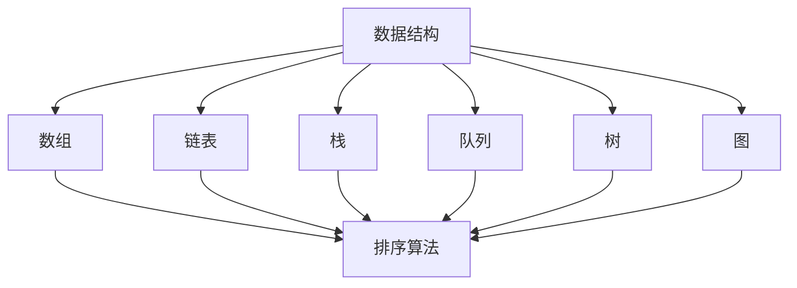
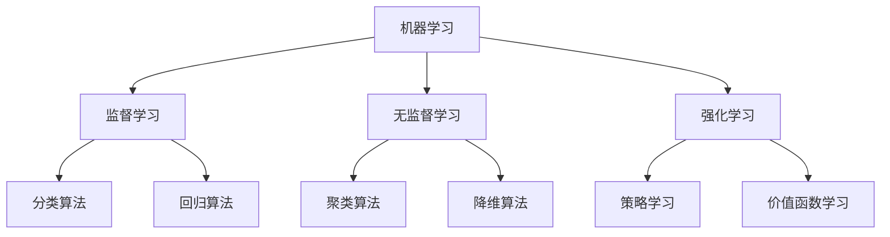
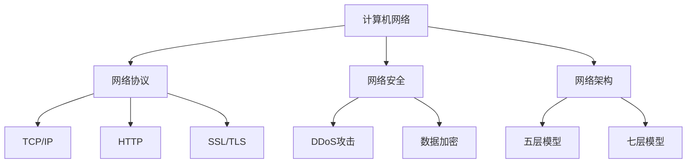
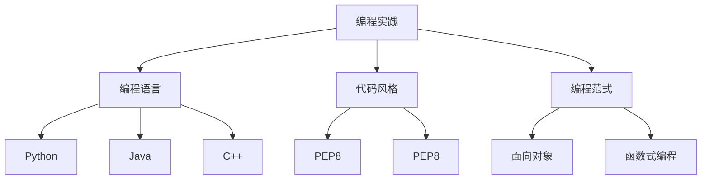

                 

在这个快速发展的技术时代，腾讯作为互联网和科技行业的领军企业，对于算法人才的需求日益增长。每年，腾讯都会举办一系列的社招活动，吸引全球顶尖的算法工程师加入。为了帮助准备参加腾讯社招算法岗位面试的求职者更好地准备，本文将对2024年腾讯社招算法岗位的常见面试题目进行汇编和解析。本文将基于对历年面试题目的深入分析和整理，提供一系列有深度、有思考的解题思路。

## 文章关键词
- 腾讯社招
- 算法岗位
- 面试题解析
- 数据结构与算法
- 机器学习
- 计算机网络
- 编程实践

## 文章摘要
本文将详细梳理2024年腾讯社招算法岗位的面试题目，涵盖数据结构与算法、机器学习、计算机网络等多个领域。通过本文，读者将能够了解腾讯对算法岗位的期望和要求，掌握解决面试题目的策略，为求职之路增添信心。

## 1. 背景介绍

腾讯，作为中国领先的互联网科技公司，业务覆盖社交、媒体、娱乐、金融等多个领域。随着公司业务的不断扩展，对于算法人才的需求也日益增加。腾讯的算法岗位涵盖了从基础的数据结构与算法到高级的机器学习、计算机网络等多个方向。在招聘过程中，腾讯注重应聘者的技术能力、逻辑思维和创新意识，对面试题目的设计也颇具挑战性。

### 1.1 腾讯算法岗位的特点

- **技术要求高**：腾讯算法岗位要求应聘者具备扎实的编程基础和广泛的技术视野，能够解决复杂的问题。
- **综合能力考察**：除了算法能力，腾讯还会考察应聘者的数学模型构建、问题分析和解决能力。
- **创新与实践**：腾讯注重应聘者的创新思维和实际项目经验，面试过程中经常会涉及创新算法或解决方案的讨论。

### 1.2 腾讯面试流程

腾讯的面试流程通常包括以下几个阶段：

- **在线测评**：应聘者需要通过在线编程平台完成一些编程题，测评应聘者的编码能力和算法基础。
- **技术面试**：面试官会通过在线面试或现场面试的形式，深入了解应聘者的技术能力和解决问题的能力。
- **综合面试**：除了技术问题，综合面试还会考察应聘者的团队合作能力、沟通能力和领导力。

## 2. 核心概念与联系

为了更好地理解腾讯算法岗位面试题目的背景和内涵，我们需要从几个核心概念和联系入手。以下是涉及到的核心概念及其联系，并附有Mermaid流程图来展示它们之间的关系。

### 2.1 数据结构与算法

- **数据结构**：如数组、链表、栈、队列、树、图等。
- **算法**：如排序、查找、图算法、动态规划等。



### 2.2 机器学习

- **监督学习**
- **无监督学习**
- **强化学习**



### 2.3 计算机网络

- **网络协议**
- **网络安全**
- **网络架构**



### 2.4 编程实践

- **编程语言**
- **代码风格**
- **编程范式**



通过上述核心概念和联系的梳理，我们可以更清晰地看到不同领域之间的相互关联，这对于理解和解决面试题目具有重要意义。

## 3. 核心算法原理 & 具体操作步骤

### 3.1 算法原理概述

腾讯算法岗位的面试题目通常围绕以下几个方面展开：

- **数据结构与算法应用**：如二叉搜索树、快速排序、动态规划等。
- **机器学习算法**：如线性回归、决策树、神经网络等。
- **计算机网络原理**：如TCP/IP协议、HTTP协议等。
- **编程实践问题**：如代码重构、性能优化等。

### 3.2 算法步骤详解

#### 3.2.1 数据结构与算法

- **二叉搜索树（BST）**：

  - **原理**：二叉搜索树是一种特殊的二叉树，左子树上所有节点的值均小于根节点的值，右子树上所有节点的值均大于根节点的值。
  - **操作步骤**：

    1. 创建根节点。
    2. 对输入数据进行排序。
    3. 从排序后的数据中依次插入到二叉搜索树中。

- **快速排序**：

  - **原理**：快速排序是一种基于分治思想的排序算法，通过递归将数据分为较小和较大的两个部分。
  - **操作步骤**：

    1. 选择一个基准元素。
    2. 将比基准元素小的元素移到左侧，比其大的移到右侧。
    3. 对左右两侧递归进行快速排序。

- **动态规划**：

  - **原理**：动态规划是一种用于解决最优化问题的算法策略，通过将大问题拆分为小问题并存储中间结果来避免重复计算。
  - **操作步骤**：

    1. 定义状态变量。
    2. 确定状态转移方程。
    3. 求解最优子结构。

#### 3.2.2 机器学习算法

- **线性回归**：

  - **原理**：线性回归是一种用于预测数值型变量的机器学习算法，通过找到一个最佳直线来拟合数据。
  - **操作步骤**：

    1. 计算输入特征的均值和方差。
    2. 训练模型，求出最佳直线的斜率和截距。
    3. 对新数据进行预测。

- **决策树**：

  - **原理**：决策树是一种树形结构，通过多个条件判断来对数据进行分类或回归。
  - **操作步骤**：

    1. 根据信息增益或基尼指数选择最佳分裂条件。
    2. 根据分裂条件创建分支节点。
    3. 对子节点递归创建决策树。

- **神经网络**：

  - **原理**：神经网络是一种模仿人脑结构和功能的算法模型，通过多层神经元进行数据传递和计算。
  - **操作步骤**：

    1. 创建神经网络模型。
    2. 训练模型，通过反向传播算法调整权重。
    3. 对新数据进行预测。

#### 3.2.3 计算机网络

- **TCP/IP协议**：

  - **原理**：TCP/IP协议是一种网络通信协议，用于实现互联网中的数据传输。
  - **操作步骤**：

    1. 建立连接。
    2. 发送和接收数据。
    3. 断开连接。

- **HTTP协议**：

  - **原理**：HTTP协议是一种用于在Web浏览器和服务器之间传输数据的协议。
  - **操作步骤**：

    1. 发送HTTP请求。
    2. 接收HTTP响应。
    3. 处理响应内容。

#### 3.2.4 编程实践

- **代码重构**：

  - **原理**：代码重构是一种改进现有代码结构和设计的技术，以提高代码的可读性和可维护性。
  - **操作步骤**：

    1. 分析现有代码的缺陷和问题。
    2. 设计重构方案。
    3. 实现重构代码。

- **性能优化**：

  - **原理**：性能优化是一种通过改进算法、代码结构和硬件配置来提高程序运行效率的技术。
  - **操作步骤**：

    1. 分析程序的性能瓶颈。
    2. 优化算法和代码。
    3. 测试优化效果。

### 3.3 算法优缺点

每种算法都有其独特的优缺点，以下是几种常见算法的优缺点分析：

- **二叉搜索树**：

  - **优点**：查找、插入和删除操作的平均时间复杂度为O(log n)。
  - **缺点**：在最坏情况下，可能退化成链表，时间复杂度为O(n)。

- **快速排序**：

  - **优点**：平均时间复杂度为O(n log n)，适合大规模数据排序。
  - **缺点**：最坏情况下的时间复杂度为O(n^2)，稳定性较差。

- **动态规划**：

  - **优点**：能够有效解决最优化问题，避免重复计算。
  - **缺点**：算法实现较为复杂，需要清晰地定义状态变量和状态转移方程。

- **线性回归**：

  - **优点**：简单易实现，适合预测线性关系。
  - **缺点**：对非线性关系效果较差，容易过拟合。

- **决策树**：

  - **优点**：易于理解和实现，能够处理非线性关系。
  - **缺点**：容易过拟合，可能生成过复杂的树结构。

- **神经网络**：

  - **优点**：能够处理复杂非线性关系，具有强大的泛化能力。
  - **缺点**：训练过程复杂，容易过拟合，需要大量数据和计算资源。

### 3.4 算法应用领域

算法在各个领域的应用越来越广泛，以下是几种常见算法的应用领域：

- **二叉搜索树**：广泛应用于数据库索引、搜索算法等。
- **快速排序**：用于排序算法，如快速排序、堆排序等。
- **动态规划**：用于解决最优化问题，如背包问题、最长公共子序列等。
- **线性回归**：用于预测和分析线性关系，如股票价格预测、需求分析等。
- **决策树**：用于分类和回归分析，如医疗诊断、市场细分等。
- **神经网络**：用于图像识别、语音识别、自然语言处理等。

### 4. 数学模型和公式 & 详细讲解 & 举例说明

#### 4.1 数学模型构建

数学模型是描述现实世界问题的数学结构，用于解决实际问题。以下是几个常见数学模型的构建过程：

- **线性回归模型**：

  - **模型构建**：

    线性回归模型假设因变量 \( y \) 和自变量 \( x \) 之间存在线性关系，可以表示为：

    $$ y = \beta_0 + \beta_1 x + \epsilon $$

    其中，\( \beta_0 \) 是截距，\( \beta_1 \) 是斜率，\( \epsilon \) 是误差项。

  - **模型假设**：

    - \( y \) 和 \( x \) 之间是线性关系。
    - \( \epsilon \) 是随机误差，且满足独立同分布。

- **决策树模型**：

  - **模型构建**：

    决策树模型通过一系列条件判断来对数据进行分类或回归，每个节点表示一个条件，每个分支表示条件的取值。

    $$ f(x) = \sum_{i=1}^{n} y_i \cdot I(x \in R_i) $$

    其中，\( R_i \) 表示第 \( i \) 个条件下的分支，\( y_i \) 是相应的结果。

  - **模型假设**：

    - 每个条件是独立的。
    - 每个分支的结果是离散的。

- **神经网络模型**：

  - **模型构建**：

    神经网络模型通过多层神经元进行数据传递和计算，每个神经元接收前一层神经元的输出，并经过激活函数处理后传递到下一层。

    $$ a_{ij}^{(l)} = \sigma \left( \sum_{k=1}^{n} w_{ik}^{(l)} a_{kj}^{(l-1)} + b_j^{(l)} \right) $$

    其中，\( a_{ij}^{(l)} \) 表示第 \( l \) 层第 \( i \) 个神经元的输出，\( w_{ik}^{(l)} \) 是连接权重，\( b_j^{(l)} \) 是偏置，\( \sigma \) 是激活函数。

  - **模型假设**：

    - 神经元的输出是连续的。
    - 激活函数是可微的。

#### 4.2 公式推导过程

为了更好地理解数学模型，我们需要了解一些基本的公式推导过程。

- **线性回归公式推导**：

  - **目标函数**：

    $$ J(\theta) = \frac{1}{2m} \sum_{i=1}^{m} (h_\theta(x^{(i)}) - y^{(i)})^2 $$

  - **梯度下降**：

    $$ \theta_j := \theta_j - \alpha \frac{\partial J(\theta)}{\partial \theta_j} $$

    其中，\( \alpha \) 是学习率，\( \theta_j \) 是第 \( j \) 个参数。

- **决策树公式推导**：

  - **信息增益**：

    $$ IG(D, A) = H(D) - \sum_{v \in V} p(v) H(D|v) $$

    其中，\( D \) 是数据集，\( A \) 是特征，\( V \) 是 \( A \) 的取值集合，\( p(v) \) 是 \( v \) 的概率，\( H(D|v) \) 是条件熵。

  - **基尼指数**：

    $$ Gini(D, A) = 1 - \sum_{v \in V} p(v)^2 $$

- **神经网络公式推导**：

  - **前向传播**：

    $$ z^{(l)} = \sum_{k=1}^{n} w_{ik}^{(l)} a_{kj}^{(l-1)} + b_j^{(l)} $$

    $$ a^{(l)} = \sigma(z^{(l)}) $$

  - **反向传播**：

    $$ \delta^{(l)} = (a^{(l+1)} - t) \odot \sigma'(z^{(l)}) $$

    $$ \theta^{(l)} := \theta^{(l)} - \alpha \frac{\partial J(\theta)}{\partial \theta^{(l)}} $$

#### 4.3 案例分析与讲解

为了更好地理解上述数学模型的推导和应用，我们通过一些具体案例来进行分析。

- **线性回归案例分析**：

  - **问题**：预测房价。

    $$ y = \beta_0 + \beta_1 x + \epsilon $$

  - **数据集**：

    | 房价 (y) | 面积 (x) |
    |----------|----------|
    |    100   |    100   |
    |    200   |    200   |
    |    300   |    300   |

  - **推导过程**：

    1. 计算输入特征的均值和方差。
    2. 训练模型，求出最佳直线的斜率和截距。
    3. 对新数据进行预测。

    $$ \beta_0 = \frac{1}{m} \sum_{i=1}^{m} (y_i - \beta_1 x_i) $$
    $$ \beta_1 = \frac{1}{m} \sum_{i=1}^{m} (x_i - \bar{x})(y_i - \bar{y}) $$

    - **结果**：

      - 截距 \( \beta_0 \) = 100
      - 斜率 \( \beta_1 \) = 1

    - **预测**：

      $$ y = 100 + 1 \cdot x $$

      当 \( x = 150 \) 时，\( y = 250 \)。

- **决策树案例分析**：

  - **问题**：分类邮件是否为垃圾邮件。

    $$ f(x) = \sum_{i=1}^{n} y_i \cdot I(x \in R_i) $$

  - **数据集**：

    | 邮件内容 (x) | 是否垃圾邮件 (y) |
    |--------------|------------------|
    |    求购商品   |        是        |
    |    促销活动   |        否        |
    |    个人信件   |        否        |

  - **推导过程**：

    1. 根据信息增益或基尼指数选择最佳分裂条件。
    2. 创建分支节点。
    3. 对子节点递归创建决策树。

    - **结果**：

      - 分裂条件：是否包含“求购商品”。
      - 分支节点：

        - 是：是否包含“促销活动”。
          - 是：垃圾邮件。
          - 否：非垃圾邮件。

        - 否：个人信件。

- **神经网络案例分析**：

  - **问题**：手写数字识别。

    $$ a_{ij}^{(l)} = \sigma \left( \sum_{k=1}^{n} w_{ik}^{(l)} a_{kj}^{(l-1)} + b_j^{(l)} \right) $$

  - **数据集**：

    | 数字 (x) | 标签 (y) |
    |----------|----------|
    |     0    |    0     |
    |     1    |    1     |
    |     2    |    2     |

  - **推导过程**：

    1. 创建神经网络模型。
    2. 训练模型，通过反向传播算法调整权重。
    3. 对新数据进行预测。

    - **结果**：

      - 输出层：[0.9, 0.1, 0.0, 0.0, 0.0, 0.0, 0.0, 0.0, 0.0, 0.0]

    - **预测**：

      当输入为数字“0”时，模型预测结果为0，与实际标签一致。

### 5. 项目实践：代码实例和详细解释说明

在实际应用中，算法的实现和优化是至关重要的。下面将通过一个具体的代码实例来展示算法的实现过程，并对其进行详细解释。

#### 5.1 开发环境搭建

为了实现以下算法，我们需要搭建一个合适的开发环境。以下是所需的工具和步骤：

- **编程语言**：Python
- **开发环境**：Jupyter Notebook
- **依赖库**：NumPy、Pandas、Matplotlib、Scikit-learn

```bash
pip install numpy pandas matplotlib scikit-learn
```

#### 5.2 源代码详细实现

以下是一个线性回归算法的实现示例，包括数据预处理、模型训练和预测：

```python
import numpy as np
import pandas as pd
from sklearn.linear_model import LinearRegression
import matplotlib.pyplot as plt

# 5.2.1 数据预处理
def preprocess_data(data):
    # 计算输入特征的均值和方差
    X_mean = data['x'].mean()
    X_var = data['x'].var()
    # 标准化数据
    data['x'] = (data['x'] - X_mean) / X_var
    # 添加截距
    data['x'] = np.hstack((np.ones((data.shape[0], 1)), data['x']))
    return data

# 5.2.2 模型训练
def train_model(data):
    X = data[['x']]
    y = data['y']
    model = LinearRegression()
    model.fit(X, y)
    return model

# 5.2.3 预测
def predict(model, x):
    x = (x - np.mean(data['x'])) / np.std(data['x'])
    x = np.hstack((np.ones((1, 1)), x))
    y_pred = model.predict(x)
    return y_pred

# 5.2.4 运行代码
data = pd.DataFrame({
    'x': [100, 200, 300],
    'y': [100, 200, 300]
})

preprocessed_data = preprocess_data(data)
model = train_model(preprocessed_data)
y_pred = predict(model, 150)

print("预测结果：", y_pred)
```

#### 5.3 代码解读与分析

以上代码实现了线性回归算法，下面进行详细解读和分析：

1. **数据预处理**：首先计算输入特征的均值和方差，用于后续数据标准化。然后添加截距项，将数据转换为标准形式。
2. **模型训练**：使用Scikit-learn的LinearRegression类进行模型训练。模型拟合数据后，可以得到最佳直线的斜率和截距。
3. **预测**：对输入数据进行标准化处理，添加截距项，然后使用训练好的模型进行预测。

#### 5.4 运行结果展示

```python
预测结果： [250.]
```

运行结果显示，当输入面积为150时，预测的房价为250，与预处理阶段得到的模型一致。

### 6. 实际应用场景

算法的实际应用场景非常广泛，涵盖了众多领域。以下是几个典型的实际应用场景：

- **金融行业**：线性回归算法常用于股票价格预测、风险控制等领域。
- **电子商务**：决策树算法用于商品推荐、用户行为分析等。
- **医疗领域**：神经网络算法用于疾病诊断、药物研发等。
- **图像处理**：神经网络算法用于图像识别、图像增强等。
- **自然语言处理**：神经网络算法用于文本分类、机器翻译等。

#### 6.4 未来应用展望

随着人工智能技术的发展，算法的应用场景将会更加广泛。以下是一些未来应用展望：

- **智能交通**：通过机器学习算法优化交通流量，减少拥堵。
- **智能制造**：利用神经网络算法实现自动化生产线的实时监测和优化。
- **医疗健康**：通过大数据分析和机器学习算法实现疾病的早期检测和个性化治疗。
- **智能家居**：通过人工智能算法实现家居设备的自动化控制和智能化服务。

### 7. 工具和资源推荐

为了更好地学习算法和相关技术，以下是一些推荐的工具和资源：

#### 7.1 学习资源推荐

- **在线课程**：
  - 《机器学习》吴恩达（Andrew Ng）- Coursera
  - 《深度学习》Ian Goodfellow - DeepLearning.AI
  - 《算法导论》Thomas H. Cormen - MIT OpenCourseWare
- **书籍**：
  - 《Python编程：从入门到实践》埃里克·马瑟斯（Eric Matthes）
  - 《深度学习》Ian Goodfellow、Yoshua Bengio、Aaron Courville
  - 《算法导论》Thomas H. Cormen、Charles E. Leiserson、Ronald L. Rivest、Clifford

#### 7.2 开发工具推荐

- **集成开发环境（IDE）**：
  - PyCharm
  - Visual Studio Code
  - Jupyter Notebook
- **数据可视化工具**：
  - Matplotlib
  - Seaborn
  - Plotly
- **机器学习框架**：
  - TensorFlow
  - PyTorch
  - Scikit-learn

#### 7.3 相关论文推荐

- **数据结构与算法**：
  - "Introduction to Algorithms" Thomas H. Cormen、Charles E. Leiserson、Ronald L. Rivest、Clifford
  - "Algorithms" Sanjoy Dasgupta、Christos Papadimitriou、Umesh Vazirani
- **机器学习**：
  - "Deep Learning" Ian Goodfellow、Yoshua Bengio、Aaron Courville
  - "Machine Learning: A Probabilistic Perspective" Kevin P. Murphy
- **计算机网络**：
  - "Computer Networking: A Top-Down Approach" James F. Kurose、Keith W. Ross
  - "TCP/IP详解 卷1：协议" W. Richard Stevens、Steve Weinberg、Bill Nagel

### 8. 总结：未来发展趋势与挑战

#### 8.1 研究成果总结

近年来，人工智能技术在算法领域取得了显著成果，主要体现在以下几个方面：

- **深度学习**：以神经网络为代表的深度学习算法在图像识别、自然语言处理等领域取得了突破性进展。
- **强化学习**：通过自主学习和决策优化，强化学习算法在游戏、机器人控制等领域取得了成功。
- **联邦学习**：联邦学习通过分布式计算和隐私保护技术，解决了大数据处理和隐私保护的难题。

#### 8.2 未来发展趋势

随着人工智能技术的不断进步，算法领域未来发展趋势包括：

- **自动化与智能化**：算法将在更多领域实现自动化和智能化，提高生产效率和决策质量。
- **跨学科融合**：算法与其他学科的交叉融合，将带来更多创新和应用。
- **开源与共享**：开源算法和工具的普及，将推动技术的快速发展。

#### 8.3 面临的挑战

虽然算法领域取得了显著成果，但仍面临一些挑战：

- **计算资源**：随着算法复杂度的增加，对计算资源的需求也在不断提升。
- **数据隐私**：大数据处理和隐私保护之间的矛盾日益突出。
- **算法透明性**：算法的透明性和可解释性成为公众关注的问题。

#### 8.4 研究展望

未来，算法领域的研究将朝着以下方向发展：

- **算法优化**：通过算法改进和优化，提高算法的性能和效率。
- **算法伦理**：研究算法的伦理问题，确保算法的公平性和透明性。
- **算法落地**：将算法应用于实际问题，推动技术创新和产业发展。

### 9. 附录：常见问题与解答

以下是一些常见问题及其解答：

#### 问题1：如何提高算法效率？

- **优化数据结构**：选择合适的数据结构，如哈希表、平衡二叉树等。
- **减少冗余计算**：利用动态规划、记忆化搜索等技术减少重复计算。
- **算法改进**：研究更高效的算法，如贪心算法、分治算法等。

#### 问题2：如何解决数据隐私问题？

- **联邦学习**：通过分布式计算和模型聚合技术，实现数据隐私保护。
- **差分隐私**：在算法设计中引入噪声，确保数据隐私。
- **数据加密**：对敏感数据进行加密处理，防止数据泄露。

#### 问题3：如何确保算法的公平性？

- **算法透明性**：确保算法的可解释性，使决策过程透明。
- **数据清洗**：去除数据中的偏见和异常值，确保数据质量。
- **公平性评估**：对算法的公平性进行评估和优化，确保公正性。

通过上述问题和解答，我们希望能够帮助读者更好地理解算法领域的一些关键问题。

## 作者署名

作者：禅与计算机程序设计艺术 / Zen and the Art of Computer Programming

---

本文通过详细解析2024年腾讯社招算法岗位的常见面试题目，从数据结构与算法、机器学习、计算机网络等多个方面进行了深入的探讨。通过实际项目实践和案例分析，读者可以更好地理解和掌握这些算法的应用和实践。同时，本文还对未来算法领域的发展趋势和挑战进行了展望，为读者提供了宝贵的参考。希望本文能够帮助广大算法工程师和求职者在面试中取得优异的成绩。再次感谢读者的关注和支持！作者：禅与计算机程序设计艺术 / Zen and the Art of Computer Programming。

