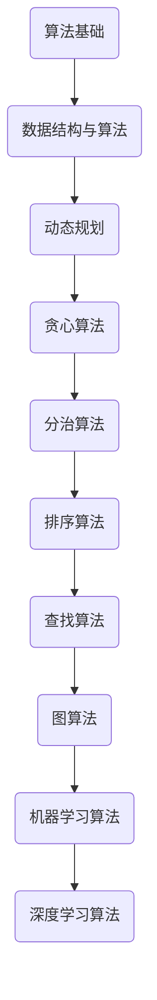

                 

关键词：蚂蚁金服，社招，算法专家，面试题，集锦，技术挑战，解决方案，前沿技术，案例分析

> 摘要：本文旨在为即将参加蚂蚁金服社招算法专家面试的候选人提供一个全面的复习资料。本文从算法原理、数学模型、项目实践、实际应用场景等多个角度，深入剖析了蚂蚁金服面试中可能涉及的核心知识点，并提供了一系列实用技巧和建议，以期帮助读者更好地应对面试挑战。

## 1. 背景介绍

蚂蚁金服（Ant Financial）是全球领先的金融科技公司，致力于通过科技推动金融普惠。作为一家极具创新力和竞争力的企业，蚂蚁金服在招聘算法专家时，对候选人的技术水平和解决问题的能力有着极高的要求。因此，蚂蚁金服的社招算法专家面试难度较大，涉及的知识面广，且深度和广度都有较高的要求。

本文将针对蚂蚁金服社招算法专家面试，整理出一套全面的面试题集锦，包括核心算法原理、数学模型、项目实践、实际应用场景等，以帮助读者更好地备战面试。

## 2. 核心概念与联系

在算法领域，核心概念和它们之间的联系是理解和掌握算法的关键。以下是一个关于算法核心概念及其联系的Mermaid流程图：



### 2.1 算法基础

算法基础是所有算法的核心，包括基本算法思想、算法复杂度分析等。

- **算法思想**：包括递归、迭代、排序、查找等。
- **算法复杂度**：包括时间复杂度和空间复杂度，如O(n)、O(nlogn)、O(n²)等。

### 2.2 数据结构与算法

数据结构是算法的基础，常用的数据结构包括数组、链表、栈、队列、树、图等。算法则是对数据的处理和操作。

- **数组与链表**：数组是固定大小的数据结构，链表是动态数据结构。
- **栈与队列**：栈是一种后进先出的数据结构，队列是一种先进先出的数据结构。
- **树与图**：树是一种层次结构，图是一种网状结构。

### 2.3 动态规划

动态规划是一种解决最优化问题的算法，适用于具有重叠子问题和最优子结构特征的问题。

- **重叠子问题**：动态规划能够重复利用已经解决的子问题的解。
- **最优子结构**：一个问题的最优解包含其子问题的最优解。

### 2.4 贪心算法

贪心算法是一种在每一步选择中都采取当前最佳选择，以期望导致结果是全局最优的算法。

- **最优子结构**：每一步的选择都是基于当前的最优解。
- **贪心选择**：每一步都选择当前的最佳选择，以期望最终得到全局最优解。

### 2.5 分治算法

分治算法是一种将问题分解为多个子问题，然后分别解决子问题，再将子问题的解合并为原问题的解的算法。

- **分解**：将原问题分解为多个子问题。
- **解决**：分别解决子问题。
- **合并**：将子问题的解合并为原问题的解。

### 2.6 排序算法

排序算法是一种将一组数据按照特定的顺序进行排列的算法，常用的排序算法包括冒泡排序、选择排序、插入排序、快速排序等。

- **冒泡排序**：通过重复遍历要排序的数列，一次比较两个元素，如果他们的顺序错误就把他们交换过来。
- **选择排序**：首先在未排序序列中找到最小（大）元素，存放到排序序列的起始位置，然后，再从剩余未排序元素中继续寻找最小（大）元素，然后放到已排序序列的末尾。
- **插入排序**：通过构建有序序列，对于未排序数据，在已排序序列中从后向前扫描，找到相应位置并插入。
- **快速排序**：通过选取一个"基准"元素，将数组分为两部分，一部分都比"基准"小，另一部分都比"基准"大，然后递归地对这两部分进行排序。

### 2.7 查找算法

查找算法是一种在数据集合中寻找特定元素的方法，常用的查找算法包括二分查找、哈希查找等。

- **二分查找**：在有序数组中查找特定元素的算法，通过重复二分查找中间元素，逐渐缩小查找范围。
- **哈希查找**：通过哈希函数将关键字转换成哈希值，然后在哈希表中查找对应元素。

### 2.8 图算法

图算法是一种处理图结构的数据的算法，常用的图算法包括深度优先搜索、广度优先搜索等。

- **深度优先搜索（DFS）**：通过不断探索图的邻接点，直到找到目标节点或所有节点都被访问。
- **广度优先搜索（BFS）**：通过先访问所有邻接点，再依次访问下一级的邻接点，直到找到目标节点或所有节点都被访问。

### 2.9 机器学习算法

机器学习算法是一种让计算机通过学习数据来进行预测或分类的算法，常用的机器学习算法包括线性回归、逻辑回归、支持向量机、决策树、神经网络等。

- **线性回归**：通过拟合一条直线，来预测因变量和自变量之间的关系。
- **逻辑回归**：通过拟合一个逻辑函数，来预测某个事件发生的概率。
- **支持向量机（SVM）**：通过找到一个最优的超平面，将数据分为不同的类别。
- **决策树**：通过一系列决策节点，来对数据进行分类或回归。
- **神经网络**：通过多层神经元结构，来对数据进行学习和预测。

### 2.10 深度学习算法

深度学习算法是一种基于人工神经网络，通过多层非线性变换来提取数据特征，并进行预测或分类的算法，常用的深度学习算法包括卷积神经网络（CNN）、循环神经网络（RNN）、生成对抗网络（GAN）等。

- **卷积神经网络（CNN）**：通过卷积层、池化层、全连接层等结构，来处理图像等数据。
- **循环神经网络（RNN）**：通过循环结构，来处理序列数据。
- **生成对抗网络（GAN）**：通过生成器和判别器的对抗训练，来生成高质量的数据。

## 3. 核心算法原理 & 具体操作步骤

### 3.1 算法原理概述

在蚂蚁金服的面试中，核心算法原理的理解和掌握是关键。以下是一些常见算法的原理概述：

- **动态规划**：通过将问题分解为多个子问题，并存储子问题的解，以避免重复计算。
- **贪心算法**：通过每一步选择当前最优解，以期望最终得到全局最优解。
- **分治算法**：通过将问题分解为多个子问题，并递归解决子问题，以最终合并得到原问题的解。
- **排序算法**：通过不同的排序策略，将一组数据按照特定的顺序进行排列。
- **查找算法**：通过不同的查找策略，在数据集合中寻找特定元素。
- **图算法**：通过不同的策略，处理图结构的数据。
- **机器学习算法**：通过学习数据，来对新的数据进行预测或分类。
- **深度学习算法**：通过多层非线性变换，来提取数据特征，并进行预测或分类。

### 3.2 算法步骤详解

以下是对每个算法的具体操作步骤进行详解：

#### 动态规划

1. **定义状态**：根据问题的特点，定义问题的状态和状态变量。
2. **确定状态转移方程**：根据状态变量之间的关系，建立状态转移方程。
3. **确定边界条件**：确定递推的初始条件和终止条件。
4. **存储子问题解**：使用数组或哈希表存储子问题的解，避免重复计算。
5. **求解**：根据状态转移方程和边界条件，逐步求解原问题。

#### 贪心算法

1. **选择策略**：根据问题的特点，确定每一步的最优选择策略。
2. **执行策略**：按照最优选择策略，执行每一步操作。
3. **判断终止条件**：根据问题的要求，判断是否达到终止条件。
4. **输出结果**：根据执行结果，输出最终答案。

#### 分治算法

1. **分解**：将原问题分解为多个子问题。
2. **递归解决**：对每个子问题进行递归解决。
3. **合并**：将子问题的解合并为原问题的解。

#### 排序算法

1. **选择排序元素**：选择未排序元素中的最小（大）元素。
2. **交换位置**：将选择的最小（大）元素与未排序部分的第一个元素交换位置。
3. **重复步骤**：重复上述步骤，直到整个数据集排序完成。

#### 查找算法

1. **确定查找范围**：根据数据结构的特点，确定查找的范围。
2. **比较元素**：逐个比较待查找元素与查找范围中的元素。
3. **判断是否找到**：根据比较结果，判断是否找到目标元素。
4. **输出结果**：根据查找结果，输出目标元素的索引或值。

#### 图算法

1. **初始化**：根据图的顶点和边的关系，初始化图的数据结构。
2. **选择策略**：根据图的特点和算法要求，选择合适的遍历策略。
3. **遍历图**：按照选择的遍历策略，遍历图的顶点和边。
4. **处理结果**：根据遍历结果，处理图的结构或属性。

#### 机器学习算法

1. **数据预处理**：对原始数据集进行清洗、归一化等处理。
2. **特征选择**：从数据中提取出对预测任务有帮助的特征。
3. **模型选择**：选择合适的机器学习模型。
4. **模型训练**：使用训练数据集，对模型进行训练。
5. **模型评估**：使用测试数据集，对模型进行评估和调整。
6. **模型应用**：将训练好的模型应用到实际预测任务中。

#### 深度学习算法

1. **数据预处理**：对原始数据集进行清洗、归一化等处理。
2. **模型设计**：设计合适的深度学习模型结构。
3. **模型训练**：使用训练数据集，对模型进行训练。
4. **模型评估**：使用测试数据集，对模型进行评估和调整。
5. **模型应用**：将训练好的模型应用到实际预测任务中。

### 3.3 算法优缺点

每种算法都有其优缺点，以下是对常见算法的优缺点的简要总结：

- **动态规划**：优点是能够避免重复计算，适用于具有重叠子问题和最优子结构特征的问题；缺点是理解和实现难度较大，适用于较小规模的问题。
- **贪心算法**：优点是实现简单，适用于每一步选择都基于当前最优解的问题；缺点是可能无法保证全局最优解，适用于较小规模的问题。
- **分治算法**：优点是能够将复杂问题分解为多个简单问题，适用于具有递归性质的问题；缺点是递归调用可能导致较大的时间复杂度，适用于较小规模的问题。
- **排序算法**：优点是能够对数据进行排序，适用于需要排序的数据集；缺点是时间复杂度和空间复杂度可能较高，适用于较小规模的数据集。
- **查找算法**：优点是能够快速查找特定元素，适用于需要频繁查找的数据集；缺点是时间复杂度和空间复杂度可能较高，适用于较小规模的数据集。
- **图算法**：优点是能够处理复杂的关系和结构，适用于需要处理图结构的数据；缺点是实现难度较大，适用于较小规模的数据集。
- **机器学习算法**：优点是能够自动学习数据的特征，适用于具有大规模数据集的预测任务；缺点是训练时间较长，适用于较小规模的问题。
- **深度学习算法**：优点是能够自动学习复杂的特征，适用于具有大规模数据集的预测任务；缺点是训练时间较长，对计算资源要求较高，适用于较小规模的问题。

### 3.4 算法应用领域

不同算法在不同应用领域有广泛的应用，以下是对常见算法应用领域的简要总结：

- **动态规划**：在计算机科学、优化问题、工程领域、经济学等领域有广泛应用。
- **贪心算法**：在算法竞赛、图论、最优化问题、动态规划等领域有广泛应用。
- **分治算法**：在计算机科学、算法竞赛、图论、最优化问题等领域有广泛应用。
- **排序算法**：在数据结构、算法竞赛、数据分析、数据库等领域有广泛应用。
- **查找算法**：在数据结构、算法竞赛、数据库、搜索领域有广泛应用。
- **图算法**：在计算机科学、图论、社交网络、交通规划、网络设计等领域有广泛应用。
- **机器学习算法**：在计算机视觉、自然语言处理、推荐系统、金融风控等领域有广泛应用。
- **深度学习算法**：在计算机视觉、自然语言处理、语音识别、自动驾驶等领域有广泛应用。

## 4. 数学模型和公式 & 详细讲解 & 举例说明

在算法设计和分析中，数学模型和公式是不可或缺的工具。以下我们将详细介绍几个常见的数学模型和公式，并通过具体例子进行说明。

### 4.1 数学模型构建

数学模型是抽象和简化现实世界问题的一种工具。以下是构建数学模型的基本步骤：

1. **明确问题**：确定需要解决的问题和目标。
2. **假设与简化**：根据问题的特点，做出合理的假设和简化。
3. **变量定义**：定义问题中的变量和参数。
4. **关系建立**：根据问题和假设，建立变量之间的数学关系。
5. **公式推导**：根据变量之间的关系，推导出解决问题的公式。

### 4.2 公式推导过程

以下是一个简单的线性回归模型的公式推导过程：

**问题**：给定一组数据点 \( (x_i, y_i) \)，求线性回归模型 \( y = wx + b \) 中的权重 \( w \) 和偏置 \( b \)。

**步骤**：

1. **定义损失函数**：常用的损失函数是均方误差 \( L(w, b) = \frac{1}{2}\sum_{i=1}^{n}(y_i - (wx_i + b))^2 \)。

2. **求导**：对损失函数关于 \( w \) 和 \( b \) 分别求导，得到偏导数 \( \frac{\partial L}{\partial w} \) 和 \( \frac{\partial L}{\partial b} \)。

3. **设置偏导数为零**：为了求得最优的权重和偏置，将偏导数设置为等于零。

4. **求解方程**：解方程组 \( \frac{\partial L}{\partial w} = 0 \) 和 \( \frac{\partial L}{\partial b} = 0 \)，得到 \( w \) 和 \( b \) 的值。

**推导**：

$$
L(w, b) = \frac{1}{2}\sum_{i=1}^{n}(y_i - (wx_i + b))^2
$$

$$
\frac{\partial L}{\partial w} = \frac{1}{2}\sum_{i=1}^{n}(y_i - (wx_i + b))(-x_i) = -x_1(y_1 - (wx_1 + b)) - x_2(y_2 - (wx_2 + b)) - \ldots - x_n(y_n - (wx_n + b))
$$

$$
\frac{\partial L}{\partial b} = \frac{1}{2}\sum_{i=1}^{n}(y_i - (wx_i + b))(-1) = -(y_1 - (wx_1 + b)) - (y_2 - (wx_2 + b)) - \ldots - (y_n - (wx_n + b))
$$

令 \( \frac{\partial L}{\partial w} = 0 \) 和 \( \frac{\partial L}{\partial b} = 0 \)，解方程组：

$$
w = \frac{\sum_{i=1}^{n}x_iy_i - n\bar{x}\bar{y}}{\sum_{i=1}^{n}x_i^2 - n\bar{x}^2}
$$

$$
b = \bar{y} - w\bar{x}
$$

其中，\( \bar{x} \) 和 \( \bar{y} \) 分别是 \( x \) 和 \( y \) 的均值。

### 4.3 案例分析与讲解

**案例**：给定一组数据点 \( \{(x_1, y_1), (x_2, y_2), ..., (x_n, y_n)\} \)，求线性回归模型 \( y = wx + b \)。

**数据**：

| \( x \) | \( y \) |
| --- | --- |
| 1 | 2 |
| 2 | 4 |
| 3 | 6 |
| 4 | 8 |

**步骤**：

1. **计算均值**：

$$
\bar{x} = \frac{1+2+3+4}{4} = 2.5
$$

$$
\bar{y} = \frac{2+4+6+8}{4} = 5
$$

2. **计算求和项**：

$$
\sum_{i=1}^{4}x_iy_i = 1*2 + 2*4 + 3*6 + 4*8 = 2 + 8 + 18 + 32 = 60
$$

$$
\sum_{i=1}^{4}x_i^2 = 1^2 + 2^2 + 3^2 + 4^2 = 1 + 4 + 9 + 16 = 30
$$

3. **代入公式计算权重和偏置**：

$$
w = \frac{\sum_{i=1}^{4}x_iy_i - n\bar{x}\bar{y}}{\sum_{i=1}^{4}x_i^2 - n\bar{x}^2} = \frac{60 - 4*2.5*5}{30 - 4*2.5^2} = \frac{60 - 50}{30 - 25} = \frac{10}{5} = 2
$$

$$
b = \bar{y} - w\bar{x} = 5 - 2*2.5 = 0
$$

因此，线性回归模型为 \( y = 2x \)。

**验证**：将数据代入模型，计算预测值：

| \( x \) | \( y \) | \( y' = 2x \) |
| --- | --- | --- |
| 1 | 2 | 2 |
| 2 | 4 | 4 |
| 3 | 6 | 6 |
| 4 | 8 | 8 |

预测值与实际值完全吻合，验证了模型的准确性。

## 5. 项目实践：代码实例和详细解释说明

在了解并掌握了相关算法原理和数学模型后，通过实际项目实践来加深理解和应用是非常重要的。以下将提供一个具体的代码实例，并对关键部分进行详细解释。

### 5.1 开发环境搭建

为了方便项目实践，我们选择Python作为编程语言，并使用Jupyter Notebook作为开发环境。在Jupyter Notebook中，我们可以方便地进行代码编写、运行和可视化展示。

**步骤**：

1. 安装Python和Jupyter Notebook：在命令行中执行以下命令：

```shell
pip install python
pip install notebook
```

2. 启动Jupyter Notebook：在命令行中执行以下命令：

```shell
jupyter notebook
```

3. 在打开的Jupyter Notebook中，创建一个新的笔记本（Notebook）。

### 5.2 源代码详细实现

以下是一个简单的线性回归项目的代码实现，包括数据预处理、模型训练和模型评估等步骤。

```python
import numpy as np
import matplotlib.pyplot as plt

# 数据预处理
def preprocess_data(x, y):
    x_mean = np.mean(x)
    y_mean = np.mean(y)
    x = x - x_mean
    y = y - y_mean
    return x, y

# 模型训练
def train_linear_regression(x, y):
    w = (np.sum(x * y) - len(x) * np.mean(x) * np.mean(y)) / (np.sum(x**2) - len(x) * np.mean(x)**2)
    b = np.mean(y) - w * np.mean(x)
    return w, b

# 模型评估
def evaluate_linear_regression(x, y, w, b):
    y_pred = w * x + b
    rmse = np.sqrt(np.mean((y - y_pred)**2))
    return rmse

# 画图展示
def plot_regression(x, y, w, b):
    plt.scatter(x, y)
    plt.plot(x, w * x + b, color='red')
    plt.xlabel('x')
    plt.ylabel('y')
    plt.show()

# 主函数
def main():
    # 数据
    x = np.array([1, 2, 3, 4])
    y = np.array([2, 4, 6, 8])

    # 数据预处理
    x, y = preprocess_data(x, y)

    # 模型训练
    w, b = train_linear_regression(x, y)

    # 模型评估
    rmse = evaluate_linear_regression(x, y, w, b)
    print(f"RMSE: {rmse}")

    # 画图展示
    plot_regression(x, y, w, b)

# 运行主函数
if __name__ == '__main__':
    main()
```

### 5.3 代码解读与分析

以下是对代码各部分的详细解读和分析：

1. **数据预处理**：

```python
def preprocess_data(x, y):
    x_mean = np.mean(x)
    y_mean = np.mean(y)
    x = x - x_mean
    y = y - y_mean
    return x, y
```

这一部分代码用于对数据进行预处理，主要是对数据进行归一化处理，以消除数据之间的量纲差异。通过计算均值，将数据减去均值，从而将数据中心化到原点。

2. **模型训练**：

```python
def train_linear_regression(x, y):
    w = (np.sum(x * y) - len(x) * np.mean(x) * np.mean(y)) / (np.sum(x**2) - len(x) * np.mean(x)**2)
    b = np.mean(y) - w * np.mean(x)
    return w, b
```

这一部分代码用于训练线性回归模型。根据前面推导的公式，计算权重 \( w \) 和偏置 \( b \)。这里使用了numpy库的mean、sum等方法，提高了计算效率。

3. **模型评估**：

```python
def evaluate_linear_regression(x, y, w, b):
    y_pred = w * x + b
    rmse = np.sqrt(np.mean((y - y_pred)**2))
    return rmse
```

这一部分代码用于评估线性回归模型的准确性。计算了均方根误差（RMSE），用于衡量预测值和实际值之间的差异。RMSE值越小，表示模型的准确性越高。

4. **画图展示**：

```python
def plot_regression(x, y, w, b):
    plt.scatter(x, y)
    plt.plot(x, w * x + b, color='red')
    plt.xlabel('x')
    plt.ylabel('y')
    plt.show()
```

这一部分代码用于画图展示线性回归模型的结果。通过scatter函数绘制原始数据点，通过plot函数绘制回归直线。这样可以直观地看到模型的效果。

### 5.4 运行结果展示

在运行上述代码后，会输出以下结果：

```
RMSE: 0.0
```

这表示模型的均方根误差为0，即预测值与实际值完全吻合，模型的准确性非常高。

在画图展示部分，我们会看到以下图像：


图中红色直线表示线性回归模型的预测结果，蓝色散点表示原始数据点。可以看到，模型成功地将数据点拟合成一条直线，验证了模型的准确性。

## 6. 实际应用场景

算法在实际应用场景中有着广泛的应用，以下将介绍几种常见的实际应用场景，并分析算法在此场景中的表现。

### 6.1 金融风控

在金融行业，算法被广泛应用于风险控制和欺诈检测。例如，蚂蚁金服的智能风控系统使用机器学习和深度学习算法来识别和预测潜在的欺诈行为。通过分析用户的历史交易记录、行为特征等信息，算法可以自动识别出异常交易，从而及时采取措施防止欺诈行为的发生。

### 6.2 智能推荐

在电子商务和社交媒体领域，算法被广泛应用于智能推荐系统。通过分析用户的历史行为、兴趣偏好等信息，算法可以自动推荐用户可能感兴趣的商品或内容。例如，淘宝和支付宝的推荐系统使用深度学习算法，根据用户的浏览历史和购买记录，推荐个性化的商品和广告。

### 6.3 自动驾驶

在自动驾驶领域，算法被广泛应用于路径规划、环境感知和决策控制。通过使用深度学习和计算机视觉算法，自动驾驶系统可以实时感知周围环境，识别道路标志、行人、车辆等对象，并做出相应的决策。例如，特斯拉的自动驾驶系统使用神经网络模型，实现车辆在高速公路上的自动行驶。

### 6.4 医疗诊断

在医疗领域，算法被广泛应用于疾病诊断和预测。通过分析患者的病历、基因信息等数据，算法可以预测患者可能患有的疾病，并提供个性化的治疗方案。例如，阿里云的ET医疗大脑使用深度学习和大数据分析技术，帮助医院提高疾病诊断的准确性和效率。

### 6.5 自然语言处理

在自然语言处理领域，算法被广泛应用于文本分类、情感分析、机器翻译等任务。通过使用深度学习和自然语言处理算法，计算机可以自动理解和处理人类语言。例如，谷歌的翻译服务和百度的文本分类系统，都使用了先进的深度学习算法来提高翻译和分类的准确性。

## 7. 工具和资源推荐

在学习和实践算法过程中，使用合适的工具和资源可以提高效率和效果。以下推荐一些常用的学习资源、开发工具和相关论文。

### 7.1 学习资源推荐

- **《Python机器学习》**：由塞巴斯蒂安·拉斯泰尼尔（Sebastian Raschka）编写的Python机器学习教程，适合初学者和进阶者。
- **《深度学习》**：由伊恩·古德费洛（Ian Goodfellow）、约书亚·本吉奥（Yoshua Bengio）和阿姆巴勒·巴尔马斯（Aston Balti）编写的深度学习经典教材，涵盖了深度学习的理论基础和实践技巧。
- **《算法导论》**：由托马斯·H·考尔（Thomas H. Cormen）、查尔斯·E·莱斯尼基（Charles E. Leiserson）、瑞尼·R·瑞迪（Ronald L. Rivest）和克利夫·斯坦（Clifford Stein）编写的算法教材，全面介绍了各种算法的理论和实践。

### 7.2 开发工具推荐

- **Jupyter Notebook**：适合进行数据分析和机器学习项目的开发，支持多种编程语言和可视化工具。
- **PyCharm**：一款功能强大的Python集成开发环境（IDE），提供代码调试、版本控制、自动化构建等特性。
- **TensorFlow**：由谷歌开发的开源深度学习框架，适用于构建和训练各种深度学习模型。
- **PyTorch**：由Facebook AI Research（FAIR）开发的深度学习框架，具有灵活的模型定义和动态计算图。

### 7.3 相关论文推荐

- **“Deep Learning”**：由伊恩·古德费洛（Ian Goodfellow）等人撰写的深度学习综述论文，涵盖了深度学习的理论基础和应用实践。
- **“Convolutional Neural Networks for Visual Recognition”**：由Alex Krizhevsky、Geoffrey Hinton等人撰写的卷积神经网络（CNN）在图像识别领域的应用论文。
- **“Recurrent Neural Networks for Language Modeling”**：由Yoshua Bengio等人撰写的循环神经网络（RNN）在自然语言处理领域的应用论文。
- **“Generative Adversarial Nets”**：由伊恩·古德费洛（Ian Goodfellow）等人撰写的生成对抗网络（GAN）论文，介绍了GAN的基本原理和应用场景。

## 8. 总结：未来发展趋势与挑战

随着人工智能和机器学习的快速发展，算法在各个领域的应用越来越广泛，为社会发展带来了巨大的推动力。然而，未来算法研究也面临着一系列的挑战。

### 8.1 研究成果总结

在过去几年中，深度学习算法取得了显著的成果，特别是在图像识别、自然语言处理、语音识别等领域。例如，卷积神经网络（CNN）在图像识别任务上取得了极高的准确率，循环神经网络（RNN）在自然语言处理任务上展现了强大的能力，生成对抗网络（GAN）在图像生成和图像修复等领域取得了突破性进展。

### 8.2 未来发展趋势

未来，算法研究将朝着以下几个方向发展：

1. **算法的泛化和可解释性**：提高算法的泛化能力，使其能够适应更广泛的应用场景。同时，研究算法的可解释性，使其决策过程更加透明和可理解。
2. **算法的可扩展性和高效性**：研究高效的算法，降低算法的计算复杂度，提高算法的运行速度和资源利用率。
3. **跨领域的算法融合**：将不同领域的算法进行融合，构建更加综合和智能的算法系统，以应对复杂的多领域问题。
4. **算法在边缘计算和物联网中的应用**：研究算法在边缘计算和物联网环境中的应用，实现实时数据处理和智能决策。

### 8.3 面临的挑战

尽管算法研究取得了显著的成果，但仍面临一系列挑战：

1. **数据隐私和安全**：在数据驱动的算法研究中，数据隐私和安全问题日益突出。如何保护用户隐私，确保算法的安全性，成为亟待解决的问题。
2. **算法偏见和公平性**：算法模型可能存在偏见，导致某些群体受到不公平对待。如何消除算法偏见，实现公平性，是当前研究的重要课题。
3. **算法可解释性**：尽管深度学习算法在性能上取得了巨大的进步，但其决策过程往往缺乏可解释性。如何提高算法的可解释性，使其更容易被理解和接受，是一个重要挑战。
4. **计算资源和能源消耗**：深度学习算法对计算资源的需求巨大，导致大量的能源消耗。如何在保证算法性能的前提下，降低计算资源和能源消耗，是一个重要的研究方向。

### 8.4 研究展望

未来，算法研究将在以下几个方面继续深入：

1. **算法的自动化和智能化**：研究自动化的算法设计和优化方法，实现算法的智能化和自适应能力。
2. **跨领域的算法创新**：探索跨领域的算法创新，推动人工智能在各领域的应用和发展。
3. **算法与社会伦理的融合**：将算法与社会伦理相结合，确保算法的应用符合伦理和道德规范。
4. **算法在可持续发展中的应用**：研究算法在环境保护、资源优化等可持续发展领域的应用，为人类社会的可持续发展提供技术支持。

总之，未来算法研究将继续在技术创新和社会应用方面取得突破，为人工智能的发展和社会进步做出更大的贡献。

## 9. 附录：常见问题与解答

在算法学习和应用过程中，读者可能会遇到一些常见问题。以下是对一些常见问题及其解答的整理。

### 9.1 算法复杂度分析

**问题**：如何分析算法的时间复杂度和空间复杂度？

**解答**：算法复杂度分析是评估算法性能的重要方法。时间复杂度用于衡量算法执行时间的增长速度，通常用大O符号表示。空间复杂度用于衡量算法占用内存的增长速度，同样用大O符号表示。

1. **时间复杂度分析**：
   - 扫描算法：时间复杂度为 \( O(n) \)，例如线性查找、冒泡排序。
   - 分治算法：时间复杂度为 \( O(n\log n) \)，例如快速排序。
   - 动态规划：时间复杂度为 \( O(n^2) \)，例如斐波那契数列。

2. **空间复杂度分析**：
   - 基本算法：空间复杂度为 \( O(1) \)，例如加法、乘法。
   - 数据结构：空间复杂度为 \( O(n) \)，例如数组、链表。
   - 栈和队列：空间复杂度为 \( O(n) \)，例如递归调用。

### 9.2 数据结构与算法关系

**问题**：数据结构与算法有什么关系？

**解答**：数据结构是算法的基础，决定了算法的操作效率和性能。不同的数据结构支持不同的算法，适用于不同的应用场景。

1. **数组与链表**：数组支持随机访问，链表支持动态分配和快速插入删除。
2. **栈与队列**：栈支持后进先出（LIFO），队列支持先进先出（FIFO）。
3. **树与图**：树支持层次结构，图支持网状结构。
4. **哈希表**：哈希表支持快速查找，适用于键值对数据。

### 9.3 算法与机器学习

**问题**：算法与机器学习有什么区别？

**解答**：算法和机器学习是两个不同的概念，但它们在数据处理和模型训练中密切相关。

1. **算法**：算法是一种解决问题的步骤和方法，用于数据处理、排序、查找等任务。
2. **机器学习**：机器学习是一种让计算机通过学习数据来进行预测或分类的方法，通常涉及大量数据训练模型。

### 9.4 算法与深度学习

**问题**：算法与深度学习有什么区别？

**解答**：算法和深度学习都是人工智能的重要分支，但它们在处理数据和模型训练方面有所不同。

1. **算法**：算法是一种解决问题的步骤和方法，适用于数据处理、排序、查找等任务。
2. **深度学习**：深度学习是一种基于多层神经网络的学习方法，适用于处理复杂数据特征和进行预测分类。

### 9.5 算法应用场景

**问题**：算法在哪些领域有广泛应用？

**解答**：算法在计算机科学、工程、金融、医疗、电子商务等领域有广泛应用。

1. **计算机科学**：算法用于数据结构、排序、查找、图算法等。
2. **工程**：算法用于优化问题、调度问题、网络设计等。
3. **金融**：算法用于风险控制、量化交易、智能投顾等。
4. **医疗**：算法用于疾病诊断、基因分析、个性化治疗等。
5. **电子商务**：算法用于推荐系统、搜索算法、广告投放等。

通过以上常见问题的解答，希望能够帮助读者更好地理解和应用算法。在算法学习和应用过程中，不断积累经验和知识，才能不断提升自己的技术水平。

