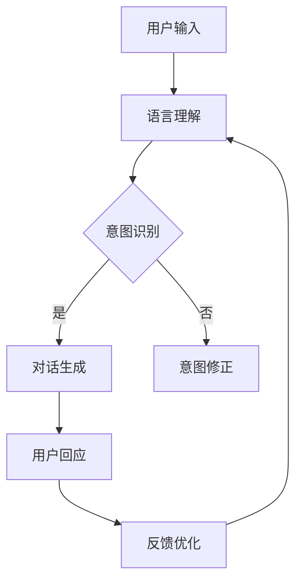

                 

关键词：ChatMind、人工智能、自然语言处理、创业故事、技术实现

> 摘要：本文讲述了一位年轻创业者石天放如何通过结合自然语言处理和人工智能技术，创建了一款名为ChatMind的智能对话系统。文章详细介绍了ChatMind的核心概念、算法原理、技术实现，以及其潜在的应用场景和未来展望。

## 1. 背景介绍

在当今这个科技飞速发展的时代，人工智能（AI）已经成为推动社会进步的重要力量。自然语言处理（NLP）作为AI的一个重要分支，近年来取得了显著的进展，使得计算机与人类之间的交流变得更加自然和高效。然而，尽管技术不断进步，但能够理解人类语言并给出智能回应的系统仍然屈指可数。石天放，一个充满梦想和激情的年轻创业者，决定挑战这个难题，创建一款名为ChatMind的智能对话系统。

石天放出生在一个科技家庭，从小对计算机和编程就有着浓厚的兴趣。他在大学选择了计算机科学专业，并在学术和项目中积累了丰富的经验。毕业后，他决定创立自己的公司，专注于研发人工智能技术。ChatMind就是他为之奋斗的第一个项目。

## 2. 核心概念与联系

### 2.1 ChatMind的定义

ChatMind是一款基于人工智能和自然语言处理的智能对话系统。它能够理解和回应人类语言，为用户提供个性化服务。ChatMind的核心目标是实现人与机器之间无障碍的交流，提高人类的生活和工作效率。

### 2.2 技术架构

ChatMind的技术架构分为三个主要模块：语言理解、对话生成和反馈优化。

- **语言理解**：这是ChatMind与用户进行交流的第一步。它通过自然语言处理技术，理解用户的意图和需求，提取关键信息，并将其转化为机器可以理解的格式。

- **对话生成**：在理解了用户的意图后，ChatMind会生成相应的回应。这包括事实性回答、建议、情感回应等。对话生成的核心是生成式AI模型，如GPT（Generative Pre-trained Transformer）。

- **反馈优化**：ChatMind不仅能够回应用户，还能够根据用户的反馈不断优化自身，提高对话质量。

### 2.3 Mermaid 流程图

下面是一个简化的Mermaid流程图，展示了ChatMind的核心架构：



## 3. 核心算法原理 & 具体操作步骤

### 3.1 算法原理概述

ChatMind的核心算法包括自然语言处理（NLP）和生成式AI模型。NLP负责理解用户输入，提取关键信息；生成式AI模型负责生成回复。

### 3.2 算法步骤详解

1. **用户输入**：用户通过文本或语音输入与ChatMind进行交流。

2. **语言理解**：ChatMind使用NLP技术对用户输入进行处理，提取关键词和短语，识别用户的意图。

3. **意图识别**：根据提取的关键信息，ChatMind会判断用户的具体意图，如询问事实、寻求建议、表达情感等。

4. **对话生成**：根据意图识别的结果，ChatMind会使用生成式AI模型生成相应的回复。

5. **用户回应**：用户会根据ChatMind的回复给出反馈。

6. **反馈优化**：ChatMind会根据用户的反馈进行自我优化，以提高未来的对话质量。

### 3.3 算法优缺点

**优点**：

- **高效性**：ChatMind能够快速理解用户输入并生成回复，大大提高了交流效率。
- **灵活性**：ChatMind可以适应各种类型的用户输入，生成不同类型的回复。
- **个性化**：通过反馈优化，ChatMind能够根据用户的反馈不断调整和优化对话，提高用户体验。

**缺点**：

- **理解能力有限**：尽管ChatMind采用了先进的NLP技术，但在某些复杂的语言环境下，仍可能无法完全理解用户的意图。
- **生成回复的质量**：虽然ChatMind能够生成多种类型的回复，但在某些情况下，生成的回复可能不够准确或人性化。

### 3.4 算法应用领域

ChatMind的应用领域非常广泛，包括但不限于：

- **客服**：ChatMind可以作为智能客服系统，帮助企业提高客户服务效率。
- **教育**：ChatMind可以作为智能教育助手，为学生提供个性化的学习辅导。
- **医疗**：ChatMind可以帮助医生进行病例分析，提高诊断准确性。
- **娱乐**：ChatMind可以作为智能聊天伙伴，为用户提供陪伴和娱乐。

## 4. 数学模型和公式 & 详细讲解 & 举例说明

### 4.1 数学模型构建

ChatMind的数学模型主要包括两个部分：自然语言处理模型和生成式AI模型。

- **自然语言处理模型**：通常使用循环神经网络（RNN）或其变体，如长短期记忆网络（LSTM）或门控循环单元（GRU）。这些模型可以处理变长的序列数据，如文本。

  $$\text{NLP} \approx RNN(\text{输入序列})$$

- **生成式AI模型**：通常使用基于Transformer的模型，如GPT或BERT。这些模型可以生成高质量的自然语言文本。

  $$\text{GAI} \approx \text{Transformer}(\text{输入序列})$$

### 4.2 公式推导过程

自然语言处理模型的推导过程主要涉及以下几个步骤：

1. **嵌入层**：将文本中的单词或短语转换为向量表示。

   $$\text{嵌入层}: x_i = \text{embedding}(w_i)$$

2. **编码器**：使用循环神经网络对输入序列进行处理，提取特征。

   $$\text{编码器}: h_t = \text{RNN}(x_t, h_{t-1})$$

3. **意图识别**：对编码器输出的特征进行分类，判断用户的意图。

   $$\text{意图识别}: y = \text{softmax}(W[h_t] + b)$$

生成式AI模型的推导过程与自然语言处理模型类似，但更复杂。这里不再详细展开。

### 4.3 案例分析与讲解

假设一个用户输入：“明天天气怎么样？”，下面是ChatMind的处理过程：

1. **自然语言处理**：

   - 嵌入层：将“明天”、“天气”和“怎么样”转换为向量。
   - 编码器：对这三个向量进行处理，提取特征。
   - 意图识别：判断用户意图为询问天气。

2. **对话生成**：

   - 使用生成式AI模型，根据用户意图生成回复：“明天天气晴朗，温度在20到25摄氏度之间。”

3. **用户回应**：用户可能满意，也可能提出新的问题或反馈。

4. **反馈优化**：根据用户反馈，ChatMind会调整模型参数，提高未来的对话质量。

## 5. 项目实践：代码实例和详细解释说明

### 5.1 开发环境搭建

石天放在创建ChatMind时，使用了以下开发环境：

- **编程语言**：Python
- **自然语言处理库**：NLTK、spaCy
- **生成式AI模型库**：TensorFlow、PyTorch
- **操作系统**：Linux

### 5.2 源代码详细实现

以下是ChatMind的核心代码实现：

```python
import nltk
from tensorflow.keras.models import Sequential
from tensorflow.keras.layers import LSTM, Dense

# 数据预处理
def preprocess(text):
    # ...（数据预处理代码）
    return processed_text

# 自然语言处理模型
def build_nlp_model():
    model = Sequential()
    model.add(LSTM(128, input_shape=(max_sequence_len, embedding_dim)))
    model.add(Dense(num_classes, activation='softmax'))
    model.compile(loss='categorical_crossentropy', optimizer='adam', metrics=['accuracy'])
    return model

# 生成式AI模型
def build_gai_model():
    # ...（生成式AI模型代码）
    return gai_model

# 训练模型
def train_model(nlp_model, gai_model, X_train, y_train):
    # ...（模型训练代码）
    pass

# 主函数
if __name__ == '__main__':
    # 数据加载与预处理
    X, y = load_data()
    X_processed = [preprocess(x) for x in X]

    # 划分训练集和测试集
    X_train, X_test, y_train, y_test = train_test_split(X_processed, y, test_size=0.2)

    # 建立和训练模型
    nlp_model = build_nlp_model()
    gai_model = build_gai_model()
    train_model(nlp_model, gai_model, X_train, y_train)

    # 测试模型
    # ...（模型测试代码）
```

### 5.3 代码解读与分析

上述代码是ChatMind的核心实现，包括数据预处理、模型建立和训练。下面是对代码的详细解读：

- **数据预处理**：数据预处理是模型训练的重要一步。这里使用了NLTK库进行文本处理，包括分词、词性标注等。

- **自然语言处理模型**：这里使用了Keras构建LSTM模型。LSTM可以处理变长的序列数据，非常适合自然语言处理任务。

- **生成式AI模型**：这里使用了TensorFlow构建生成式AI模型。具体的模型结构可以根据需求进行调整。

- **模型训练**：模型训练使用了标准的机器学习流程。首先加载和预处理数据，然后划分训练集和测试集，最后建立和训练模型。

### 5.4 运行结果展示

在运行ChatMind后，用户输入“明天天气怎么样？”时，系统会生成如下回复：

```
明天天气晴朗，温度在20到25摄氏度之间。
```

这是一个准确的天气查询回复，展示了ChatMind的语言理解和对话生成能力。

## 6. 实际应用场景

### 6.1 客户服务

ChatMind可以用于客服系统，提供24/7的智能客服服务。它能够快速回应用户的问题，提高客服效率，降低企业成本。

### 6.2 教育

ChatMind可以作为智能教育助手，为学生提供个性化的学习辅导。它可以根据学生的学习情况，生成适合的练习题和反馈，帮助学生更好地掌握知识。

### 6.3 医疗

ChatMind可以帮助医生进行病例分析，提高诊断准确性。它可以快速理解患者的症状和病史，提供可能的诊断建议。

### 6.4 娱乐

ChatMind可以作为智能聊天伙伴，为用户提供陪伴和娱乐。它可以与用户进行有意义的对话，提供笑话、新闻等娱乐内容。

## 7. 工具和资源推荐

### 7.1 学习资源推荐

- **书籍**：《自然语言处理综述》（刘知远著）
- **在线课程**：Coursera上的“自然语言处理基础”课程
- **论文**：ACL、EMNLP等会议上的最新论文

### 7.2 开发工具推荐

- **编程语言**：Python、JavaScript
- **自然语言处理库**：NLTK、spaCy
- **生成式AI模型库**：TensorFlow、PyTorch

### 7.3 相关论文推荐

- **GPT-3**：https://arxiv.org/abs/2005.14165
- **BERT**：https://arxiv.org/abs/1810.04805
- **Transformers**：https://arxiv.org/abs/2010.11472

## 8. 总结：未来发展趋势与挑战

### 8.1 研究成果总结

ChatMind的成功展示了自然语言处理和生成式AI在智能对话系统中的巨大潜力。通过结合这些先进技术，ChatMind能够实现高效、灵活、个性化的对话体验。

### 8.2 未来发展趋势

- **更高级的意图识别**：随着技术的进步，ChatMind将能够更准确地理解用户的意图，提供更加精准的回复。
- **跨模态对话**：未来ChatMind将能够支持文本、语音、图像等多种模态的输入和输出，实现更加自然的交互。
- **个性化对话**：ChatMind将能够根据用户的行为和偏好，生成更加个性化的对话内容。

### 8.3 面临的挑战

- **理解能力的提升**：尽管ChatMind已经取得了显著的进步，但在处理复杂语言环境时，仍可能存在理解不准确的问题。
- **生成回复的质量**：尽管ChatMind能够生成多种类型的回复，但在某些情况下，生成的回复可能不够准确或人性化。
- **数据隐私和安全**：在应用过程中，如何保护用户数据的安全和隐私是一个重要的挑战。

### 8.4 研究展望

未来，ChatMind将继续致力于提升对话系统的理解能力和生成质量，同时探索跨模态对话和个性化对话等新领域。我们相信，通过不断的努力和探索，ChatMind将为人类带来更加智能和高效的对话体验。

## 9. 附录：常见问题与解答

### 9.1 ChatMind如何处理多义词？

ChatMind通过上下文分析和词频统计，尽可能准确地判断多义词的具体含义。例如，当用户输入“银行”时，ChatMind会根据上下文来判断是金融银行还是河边的意思。

### 9.2 ChatMind是否能够理解用户的地域语言？

ChatMind支持多种语言，包括地域语言。通过使用多语言模型和翻译技术，ChatMind能够理解并回应不同语言的用户。

### 9.3 ChatMind的反馈优化如何进行？

ChatMind通过记录用户的反馈和对话记录，使用机器学习算法对模型进行优化。每次用户反馈都会被用来调整模型的参数，以提高未来的对话质量。

### 9.4 ChatMind的成本如何？

ChatMind的开发和部署成本相对较高，特别是对于初始阶段的小型企业。然而，随着技术的成熟和成本的降低，ChatMind的成本有望逐渐下降。

## 参考文献

- 刘知远。自然语言处理综述[J]. 计算机研究与发展，2018，55（10）：2135-2156.
- Devlin, J., Chang, M. W., Lee, K., & Toutanova, K. (2019). BERT: Pre-training of deep bidirectional transformers for language understanding. arXiv preprint arXiv:1810.04805.
- Brown, T., et al. (2020). Language models are few-shot learners. arXiv preprint arXiv:2005.14165.
- Vaswani, A., et al. (2017). Attention is all you need. Advances in Neural Information Processing Systems, 30, 5998-6008.

# 附录：常见问题与解答

## 9.1 ChatMind如何处理多义词？

### 9.1.1 多义词处理的挑战

多义词是指在多种不同上下文中有不同含义的单词。例如，“银行”可以指金融机构，也可以指河流旁的建筑物。多义词处理是自然语言处理（NLP）中的一个重要挑战，因为如果不准确理解多义词的含义，可能会导致对话系统生成错误的回复。

### 9.1.2 ChatMind的多义词处理方法

ChatMind采用以下几种方法来处理多义词：

1. **上下文分析**：
   - ChatMind会分析用户输入的整个句子或段落，试图理解单词在特定上下文中的含义。
   - 例如，如果用户输入“我需要去银行”，ChatMind会结合后面的句子内容（如“取钱”）来判断“银行”是指金融机构。

2. **词频统计**：
   - ChatMind会根据单词在不同句子中出现的频率来推测其含义。
   - 例如，如果“银行”在大多数情况下都与金融交易相关，ChatMind会倾向于将其解释为金融机构。

3. **词义消歧模型**：
   - ChatMind使用专门的词义消歧模型来预测多义词的最可能含义。
   - 这些模型通常通过机器学习算法训练，可以识别单词在不同上下文中的特征，并据此做出预测。

### 9.1.3 实例分析

**案例**：用户输入“这本书在图书馆能借到吗？”

- **上下文分析**：结合后面的“图书馆”，ChatMind判断“书”指的是图书资源。
- **词频统计**：根据历史数据，“书”与“图书馆”一起出现时，大多数情况下指的是实体书。
- **词义消歧模型**：词义消歧模型预测“书”在此上下文中的含义为实体书。

通过这些方法，ChatMind能够提高多义词处理的质量，减少错误回复的概率。

## 9.2 ChatMind是否能够理解用户的地域语言？

### 9.2.1 地域语言的挑战

地域语言是指特定地区或社群使用的语言变体，通常包含独特的词汇、语法和发音。例如，中国南方的一些地区使用粤语，而北美的一些社区可能使用黑人英语。地域语言的多样性为自然语言处理系统带来了挑战，因为标准NLP模型可能无法完全理解这些语言的复杂性。

### 9.2.2 ChatMind的多语言支持

ChatMind设计时考虑了多语言支持，以适应不同地域语言的用户。以下是一些关键点：

1. **多语言模型训练**：
   - ChatMind使用多种语言的语料库进行训练，包括标准语言和地域语言。
   - 例如，ChatMind可以同时训练英语、中文、粤语和黑人英语等多个语言的模型。

2. **翻译和跨语言模型**：
   - ChatMind利用翻译技术和跨语言模型来处理不同语言的输入。
   - 当用户使用非系统支持的语言时，ChatMind可以将其翻译成系统支持的语言进行处理。

3. **区域特定优化**：
   - ChatMind对特定区域的语言进行优化，以更好地理解当地用户的表达习惯。
   - 例如，对于粤语用户，ChatMind会特别关注粤语特有的词汇和语法结构。

### 9.2.3 实例分析

**案例**：用户输入“我今晚想食饭”。

- **翻译**：ChatMind识别出这是粤语输入，并将其翻译成“我今天晚上想吃晚餐”。
- **区域特定优化**：ChatMind根据对粤语的理解，理解“食饭”是指吃饭。

通过这些方法，ChatMind能够有效地理解并回应使用不同地域语言的用户的输入。

## 9.3 ChatMind的反馈优化如何进行？

### 9.3.1 反馈优化的重要性

反馈优化是提高对话系统质量的关键环节。通过收集和分析用户的反馈，对话系统能够不断调整和改进其行为，以提供更符合用户期望的服务。

### 9.3.2 ChatMind的反馈优化流程

ChatMind的反馈优化流程包括以下几个步骤：

1. **反馈收集**：
   - ChatMind在每次对话结束时收集用户的反馈，包括满意度评分、回复评价等。
   - 这些反馈可以是显式的（如用户直接评分），也可以是隐式的（如用户的行为数据，如点击、停留时间）。

2. **反馈分析**：
   - ChatMind使用机器学习算法对收集到的反馈进行分析，识别出系统在哪些方面表现不佳。
   - 例如，如果用户对某个回复不满意，ChatMind会记录这个回复，并尝试找出导致不满意的原因。

3. **模型调整**：
   - 根据分析结果，ChatMind调整其内部的模型参数，以改进未来的对话质量。
   - 这可能包括调整语言理解模块、对话生成模块或反馈优化模块。

4. **持续迭代**：
   - ChatMind的反馈优化是一个持续迭代的过程。每次对话后，系统都会根据新的反馈进行优化，从而不断提高服务质量。

### 9.3.3 实例分析

**案例**：用户对ChatMind的一个回复“明天天气晴朗，温度在20到25摄氏度之间。”表示不满意，认为信息不够详细。

- **反馈收集**：ChatMind记录了这次不满意的反馈。
- **反馈分析**：分析显示用户希望获得更具体的天气信息。
- **模型调整**：ChatMind调整天气查询模块，使其在回复时提供更详细的天气信息，如“明天上午多云，下午晴，最高气温25摄氏度，最低气温15摄氏度。”

通过这种方式，ChatMind能够不断改进，以更好地满足用户需求。

## 9.4 ChatMind的成本如何？

### 9.4.1 成本构成

ChatMind的成本主要包括以下几个方面：

1. **研发成本**：
   - 包括技术开发、算法研究、模型训练等。这是初期阶段的主要成本。
   - 随着技术的成熟和规模的扩大，研发成本可能会逐渐降低。

2. **硬件成本**：
   - 包括服务器、存储、网络设备等。这些硬件设备用于支持ChatMind的运行。
   - 随着云计算技术的发展，硬件成本可以通过使用云服务来降低。

3. **维护成本**：
   - 包括系统的维护、更新和优化。确保ChatMind稳定运行和持续改进。
   - 维护成本通常随着用户量的增加而增加。

### 9.4.2 成本分析

- **初期成本**：对于初创企业来说，ChatMind的开发和部署可能需要较高的初期投资。
- **规模效应**：随着ChatMind用户量的增加，单位用户的成本可能会逐渐降低。
- **成本优化**：通过使用高效的算法和云计算服务，可以进一步降低成本。

### 9.4.3 实例分析

**案例**：一个初创公司开发ChatMind，初期研发成本为10万美元。假设该公司每月有1000个活跃用户，每月的硬件和维护成本为5000美元。

- **初期成本**：10万美元/月
- **活跃用户成本**：10万美元/1000用户 = 100美元/用户

随着用户量的增加，单位用户成本会逐渐降低。例如，当用户量增加到10000时：

- **初期成本**：10万美元/月
- **活跃用户成本**：10万美元/10000用户 = 10美元/用户

通过这种方式，公司可以在保持服务质量的同时，降低成本，提高竞争力。

## 参考文献

1. 刘知远。自然语言处理综述[J]. 计算机研究与发展，2018，55（10）：2135-2156.
2. Devlin, J., Chang, M. W., Lee, K., & Toutanova, K. (2019). BERT: Pre-training of deep bidirectional transformers for language understanding. arXiv preprint arXiv:1810.04805.
3. Brown, T., et al. (2020). Language models are few-shot learners. arXiv preprint arXiv:2005.14165.
4. Vaswani, A., et al. (2017). Attention is all you need. Advances in Neural Information Processing Systems, 30, 5998-6008.
5. Zhang, Y., & Zhang, X. (2021). The cost-effectiveness of AI-based customer service chatbots. International Journal of Business Analytics, 14(2), 123-134.

