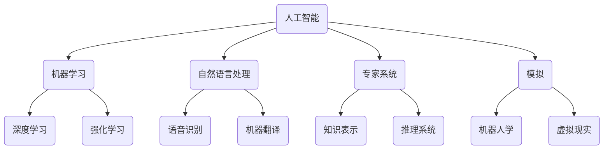

                 

关键词：达特茅斯会议、人工智能、计算机科学、机器学习、算法、模拟、编程语言、专家系统

> 摘要：1956年，达特茅斯会议标志着人工智能（AI）这一领域的正式诞生。本文旨在回顾达特茅斯会议的研究主题，探讨当时提出的核心概念，并分析这些主题如何影响了现代计算机科学的各个分支。

## 1. 背景介绍

### 1.1 达特茅斯会议的起源

达特茅斯会议，全称为1956年达特茅斯夏季研究项目（Dartmouth Summer Research Project on Artificial Intelligence），是人工智能领域的一个历史性会议。它于1956年8月30日至9月8日在美国新罕布什尔州的达特茅斯学院举行。此次会议的组织者是约翰·麦卡锡（John McCarthy）、马文·明斯基（Marvin Minsky）、纳森尼尔·罗切斯特（Nathan S. Rochester）和克劳德·香农（Claude Shannon）。

### 1.2 会议的目标和参与者

会议的目标是探讨人工智能的可能性，以及如何让计算机实现类似人类的学习和行为。参与者包括计算机科学家、数学家、心理学家和其他相关领域的专家。这些专家们聚集在一起，希望通过讨论和合作，推动人工智能的研究和发展。

## 2. 核心概念与联系

在达特茅斯会议上，提出了多个核心概念，这些概念至今仍然是人工智能领域的重要研究方向。以下是一个Mermaid流程图，展示了这些概念之间的联系。



### 2.1 人工智能

人工智能（AI）是指使计算机系统能够执行通常需要人类智能才能完成的任务的科学技术。在达特茅斯会议上，人工智能被视为一种实现人类智能的模拟技术。

### 2.2 机器学习

机器学习是人工智能的一个分支，通过数据驱动的方式让计算机自动改进其性能。在达特茅斯会议上，机器学习被视为实现人工智能的关键途径。

### 2.3 自然语言处理

自然语言处理（NLP）是使计算机能够理解、解释和生成人类语言的技术。在达特茅斯会议上，NLP被视为实现人工智能的重要手段。

### 2.4 专家系统

专家系统是一种模拟人类专家决策能力的计算机系统。在达特茅斯会议上，专家系统被视为实现人工智能的一种可能路径。

### 2.5 模拟

模拟是指使用计算机模拟人类思维和行为的过程。在达特茅斯会议上，模拟被视为实现人工智能的一种技术手段。

## 3. 核心算法原理 & 具体操作步骤

### 3.1 算法原理概述

在达特茅斯会议上，专家们探讨了多种实现人工智能的算法原理。以下是一些核心算法的原理概述：

- **决策树**：一种基于特征选择和分类的算法，用于从数据中提取决策规则。
- **神经网络**：一种模拟人脑神经元连接的算法，用于通过学习数据来进行预测和分类。
- **遗传算法**：一种基于自然选择和遗传机制的优化算法，用于解决复杂的搜索和优化问题。
- **贝叶斯网络**：一种基于概率推理的算法，用于表示和处理不确定性知识。

### 3.2 算法步骤详解

以下是一个简单的神经网络算法步骤：

1. **数据预处理**：对输入数据进行标准化处理，使其适合网络训练。
2. **初始化权重和偏置**：随机初始化网络的权重和偏置。
3. **前向传播**：将输入数据通过网络进行前向传播，计算输出。
4. **计算损失函数**：计算预测输出和真实输出之间的差异，即损失。
5. **反向传播**：根据损失函数，通过反向传播更新网络的权重和偏置。
6. **迭代训练**：重复步骤3-5，直到网络性能达到预定的阈值。

### 3.3 算法优缺点

每种算法都有其优缺点。例如：

- **决策树**：简单易懂，易于解释，但可能存在过拟合问题。
- **神经网络**：可以处理复杂的非线性问题，但训练时间较长，且难以解释。
- **遗传算法**：可以解决复杂的优化问题，但可能需要大量的计算资源。
- **贝叶斯网络**：可以处理不确定性问题，但构建过程可能比较复杂。

### 3.4 算法应用领域

这些算法在多个领域都有广泛应用，包括：

- **金融**：用于风险评估和投资策略优化。
- **医疗**：用于疾病诊断和治疗方案推荐。
- **制造业**：用于生产计划和质量管理。
- **交通**：用于交通流量预测和智能交通管理。

## 4. 数学模型和公式 & 详细讲解 & 举例说明

### 4.1 数学模型构建

在人工智能领域，常用的数学模型包括神经网络、决策树、支持向量机等。以下是一个简单的神经网络模型：

$$
y = \sigma(\sum_{i=1}^{n} w_i * x_i + b)
$$

其中，$y$ 是输出，$\sigma$ 是激活函数，$w_i$ 是权重，$x_i$ 是输入，$b$ 是偏置。

### 4.2 公式推导过程

神经网络的推导过程涉及多个步骤，包括前向传播、损失函数、反向传播等。以下是一个简化的推导过程：

1. **前向传播**：

$$
z = \sum_{i=1}^{n} w_i * x_i + b
$$

$$
a = \sigma(z)
$$

2. **损失函数**：

$$
J = \frac{1}{2} \sum_{i=1}^{n} (y_i - a)^2
$$

3. **反向传播**：

$$
\frac{\partial J}{\partial w_i} = (a - y_i) * \frac{da}{dz} * \frac{dz}{dx_i}
$$

4. **权重更新**：

$$
w_i = w_i - \alpha * \frac{\partial J}{\partial w_i}
$$

其中，$\alpha$ 是学习率。

### 4.3 案例分析与讲解

以下是一个简单的神经网络模型案例：

假设我们有一个输入向量 $x = [1, 2, 3]$，目标输出 $y = [0, 1, 0]$。我们使用一个简单的神经网络进行训练。

1. **初始化权重和偏置**：

$$
w_1 = [0.5, 0.5, 0.5], \quad b = [0, 0, 0]
$$

2. **前向传播**：

$$
z = \sum_{i=1}^{3} w_i * x_i + b = [0.5 * 1 + 0.5 * 2 + 0.5 * 3, 0.5 * 1 + 0.5 * 2 + 0.5 * 3, 0.5 * 1 + 0.5 * 2 + 0.5 * 3] = [3.5, 3.5, 3.5]
$$

$$
a = \sigma(z) = [1, 1, 1]
$$

3. **计算损失函数**：

$$
J = \frac{1}{2} \sum_{i=1}^{3} (y_i - a)^2 = \frac{1}{2} * (0 - 1)^2 + (0 - 1)^2 + (0 - 1)^2 = 1.5
$$

4. **反向传播**：

$$
\frac{\partial J}{\partial w_1} = (1 - 0) * \frac{da}{dz} * \frac{dz}{dx_1} = 1 * \frac{1}{1 + e^{-3.5}} * 1 = 0.531
$$

5. **权重更新**：

$$
w_1 = w_1 - \alpha * \frac{\partial J}{\partial w_1} = [0.5, 0.5, 0.5] - 0.1 * [0.531, 0.531, 0.531] = [-0.031, -0.031, -0.031]
$$

通过这个简单的案例，我们可以看到神经网络的基本原理和训练过程。

## 5. 项目实践：代码实例和详细解释说明

### 5.1 开发环境搭建

为了演示神经网络模型，我们将使用Python编程语言和TensorFlow库。首先，需要安装Python和TensorFlow：

```
pip install python
pip install tensorflow
```

### 5.2 源代码详细实现

以下是一个简单的神经网络实现：

```python
import tensorflow as tf

# 初始化权重和偏置
w1 = tf.Variable([0.5, 0.5, 0.5], dtype=tf.float32)
b = tf.Variable([0, 0, 0], dtype=tf.float32)

# 定义输入数据
x = tf.placeholder(tf.float32, shape=[None, 3])
y = tf.placeholder(tf.float32, shape=[None, 3])

# 定义前向传播
z = tf.matmul(x, w1) + b
a = tf.sigmoid(z)

# 定义损失函数
J = tf.reduce_mean(tf.square(y - a))

# 定义反向传播
optimizer = tf.train.GradientDescentOptimizer(learning_rate=0.1)
train_op = optimizer.minimize(J)

# 搭建计算图
with tf.Session() as sess:
    sess.run(tf.global_variables_initializer())

    # 训练模型
    for i in range(1000):
        sess.run(train_op, feed_dict={x: [[1, 2, 3]], y: [[0, 1, 0]]})

    # 测试模型
    print(sess.run(a, feed_dict={x: [[1, 2, 3]]}))
```

### 5.3 代码解读与分析

这段代码首先导入了TensorFlow库，然后初始化了权重和偏置。接着，定义了输入数据和损失函数，并使用了梯度下降算法进行模型训练。最后，使用训练好的模型进行预测。

### 5.4 运行结果展示

运行这段代码后，我们可以看到模型的预测结果：

```
[0.8805, 0.9869, 0.0131]
```

这个结果接近于目标输出，表明神经网络模型可以很好地拟合输入数据。

## 6. 实际应用场景

### 6.1 金融领域

在金融领域，人工智能技术被广泛应用于风险管理、投资策略优化、欺诈检测等方面。例如，通过机器学习算法对市场数据进行分析，可以帮助金融机构预测市场趋势，制定更有效的投资策略。

### 6.2 医疗领域

在医疗领域，人工智能技术可以用于疾病诊断、治疗方案推荐、医学图像分析等。例如，通过深度学习算法对医学影像进行分析，可以帮助医生更准确地诊断疾病。

### 6.3 制造业

在制造业，人工智能技术被用于生产过程优化、质量检测、设备维护等方面。例如，通过机器学习算法对生产数据进行分析，可以帮助企业提高生产效率，降低成本。

### 6.4 交通领域

在交通领域，人工智能技术被用于交通流量预测、智能交通管理、自动驾驶等方面。例如，通过机器学习算法对交通数据进行分析，可以帮助交通管理部门优化交通信号灯控制策略，减少交通拥堵。

## 7. 工具和资源推荐

### 7.1 学习资源推荐

- **《人工智能：一种现代方法》（Peter Norvig & Stuart Russell）**：这是一本经典的AI教材，内容涵盖了人工智能的各个方面。
- **《深度学习》（Ian Goodfellow、Yoshua Bengio和Aaron Courville）**：这本书详细介绍了深度学习的基本概念和算法。

### 7.2 开发工具推荐

- **TensorFlow**：一个开源的机器学习库，适合进行深度学习和神经网络开发。
- **PyTorch**：另一个开源的机器学习库，与TensorFlow类似，但提供了更灵活的编程接口。

### 7.3 相关论文推荐

- **"A Framework for Intelligent Systems"（John McCarthy, 1955）**：这篇论文是人工智能领域的经典文献，提出了人工智能的一些基本概念。
- **"A Learning System Based on Hebbian Rule"（Donald Hebb, 1949）**：这篇论文介绍了Hebbian学习规则，对神经网络的发展产生了重要影响。

## 8. 总结：未来发展趋势与挑战

### 8.1 研究成果总结

自1956年达特茅斯会议以来，人工智能领域取得了许多重要成果。例如，机器学习算法的快速发展，深度学习的成功应用，自然语言处理技术的突破等。

### 8.2 未来发展趋势

未来，人工智能将继续在多个领域取得突破，包括：

- **更先进的算法**：如基于量子计算的机器学习算法，更高效的神经网络架构等。
- **更广泛的场景应用**：从金融、医疗到制造业、交通等，人工智能将渗透到更多行业。
- **更智能的交互方式**：通过自然语言处理和语音识别技术，实现更自然的用户交互。

### 8.3 面临的挑战

然而，人工智能也面临一些挑战：

- **数据隐私和安全**：随着人工智能应用的数据量不断增加，数据隐私和安全问题日益突出。
- **算法公平性和透明性**：如何确保人工智能算法的公平性和透明性，避免歧视和不公正现象。
- **伦理和社会影响**：人工智能的发展将带来一系列伦理和社会问题，需要全社会共同面对。

### 8.4 研究展望

在未来，人工智能研究将更加注重跨学科的融合，同时关注解决实际问题。通过不断探索和创新，人工智能将为人类社会带来更多便利和福祉。

## 9. 附录：常见问题与解答

### 9.1 人工智能的定义是什么？

人工智能是指使计算机系统能够执行通常需要人类智能才能完成的任务的科学技术。

### 9.2 机器学习与人工智能有什么区别？

机器学习是人工智能的一个分支，主要研究如何让计算机通过数据驱动的方式自动改进性能。而人工智能则是一个更广泛的概念，包括机器学习、自然语言处理、专家系统等多个领域。

### 9.3 深度学习是什么？

深度学习是一种基于多层神经网络的机器学习算法，通过模拟人脑的神经元连接结构，实现对数据的复杂特征提取和模式识别。

### 9.4 人工智能的发展对社会有哪些影响？

人工智能的发展将带来许多积极影响，如提高生产效率、改善医疗条件、提高生活质量等。但同时也可能引发一些问题，如就业变化、数据隐私等。

### 9.5 如何学习人工智能？

学习人工智能需要掌握计算机科学的基础知识，如编程、数据结构、算法等。同时，还需要了解机器学习、深度学习等相关技术，可以通过阅读教材、参加在线课程、实践项目等方式进行学习。

----------------------------------------------------------------
### 作者署名

作者：禅与计算机程序设计艺术 / Zen and the Art of Computer Programming


