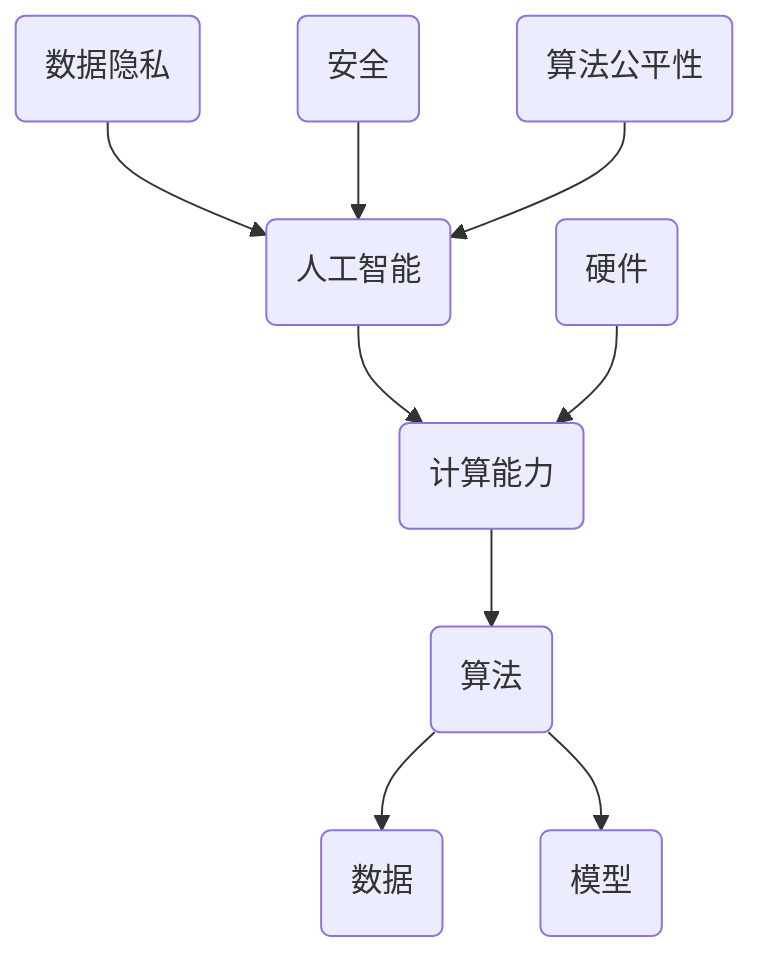

                 

关键词：人工智能，计算能力，挑战，算法原理，应用场景，未来展望

> 摘要：本文将探讨人工智能与计算能力在应对人类共同挑战中的作用，通过深入分析核心概念、算法原理、数学模型、实际应用和未来展望，阐述人类计算的使命担当。

## 1. 背景介绍

在当今科技迅速发展的时代，计算能力已经成为推动社会进步的重要力量。人工智能作为计算能力的高级表现形式，已经渗透到我们生活的方方面面。从智能助手、自动驾驶到医疗诊断、金融分析，人工智能正不断改变我们的生活方式。然而，随着人工智能技术的发展，我们也面临着一系列挑战，如算法公平性、数据隐私、安全等问题。如何有效应对这些挑战，充分发挥人工智能的计算能力，成为人类共同关注的课题。

## 2. 核心概念与联系

在探讨人工智能与计算能力的关系时，我们首先需要了解一些核心概念。以下是一个使用 Mermaid 格式的流程图，用于展示这些概念及其相互联系。



### 2.1 人工智能

人工智能（Artificial Intelligence，简称 AI）是指通过计算机模拟人类智能的技术。其核心目标是让计算机具有学习、推理、解决问题和执行任务的能力。

### 2.2 计算能力

计算能力是指计算机处理信息的能力，包括计算速度、存储容量、网络带宽等。随着硬件技术的发展，计算能力得到了极大的提升，为人工智能的发展提供了有力支持。

### 2.3 算法

算法是一系列解决问题的步骤或规则。在人工智能领域，算法是实现智能的关键。常见的算法包括深度学习、强化学习、自然语言处理等。

### 2.4 数据

数据是人工智能的基石。高质量的数据可以提升算法的性能，而数据的质量直接影响人工智能的应用效果。

### 2.5 模型

模型是算法在实际应用中的具体实现。通过训练模型，可以使计算机具备特定任务的能力。

### 2.6 硬件

硬件是计算能力的基础。高性能的硬件可以提供更快的计算速度，为人工智能的发展提供支持。

### 2.7 数据隐私

数据隐私是指个人数据的保密性。随着人工智能技术的发展，数据隐私问题日益凸显，如何保护用户隐私成为重要课题。

### 2.8 安全

安全是指人工智能系统的可靠性。在人工智能应用中，确保系统的安全至关重要。

### 2.9 算法公平性

算法公平性是指算法在处理数据时，不会对特定群体产生不公平的影响。算法公平性是人工智能发展中需要关注的重要问题。

## 3. 核心算法原理 & 具体操作步骤

### 3.1 算法原理概述

在人工智能领域，核心算法包括深度学习、强化学习、自然语言处理等。以下是对这些算法的简要概述。

#### 深度学习

深度学习是一种基于多层神经网络的学习方法。通过多层神经网络的层层提取，可以将输入数据映射到高维空间，从而实现复杂模式的识别。

#### 强化学习

强化学习是一种通过试错策略来学习最优行为的方法。在强化学习中，智能体通过与环境的交互，不断调整策略，以实现最大化奖励。

#### 自然语言处理

自然语言处理是一种将自然语言转化为计算机可处理形式的方法。通过自然语言处理技术，可以实现语音识别、机器翻译、情感分析等任务。

### 3.2 算法步骤详解

以下是对上述算法的具体操作步骤的详细讲解。

#### 深度学习

1. 数据预处理：对输入数据进行标准化、归一化等处理，使其满足模型训练需求。
2. 构建神经网络：根据任务需求，设计合适的神经网络结构。
3. 模型训练：通过反向传播算法，不断调整神经网络参数，使模型在训练数据上达到最佳性能。
4. 模型评估：在验证集上评估模型性能，调整模型参数，优化模型性能。
5. 模型部署：将训练好的模型部署到实际应用场景中。

#### 强化学习

1. 初始化策略：随机初始化策略。
2. 执行动作：根据当前状态，执行策略所指导的动作。
3. 观察结果：根据执行的动作，观察环境状态的变化。
4. 计算奖励：根据观察结果，计算执行动作的奖励。
5. 更新策略：通过奖励信号，更新策略，使其逐渐接近最优策略。
6. 重复步骤2-5，直到策略收敛。

#### 自然语言处理

1. 数据预处理：对文本数据进行分词、去停用词等处理。
2. 构建词向量：将文本数据转化为词向量表示。
3. 构建模型：根据任务需求，设计合适的模型结构。
4. 模型训练：通过训练数据，训练模型参数。
5. 模型评估：在验证集上评估模型性能，调整模型参数。
6. 模型部署：将训练好的模型部署到实际应用场景中。

### 3.3 算法优缺点

#### 深度学习

**优点：**
1. 高效：通过多层神经网络，可以提取出复杂特征。
2. 泛化能力强：通过大量数据进行训练，可以较好地适应不同场景。

**缺点：**
1. 需要大量数据：深度学习模型训练需要大量高质量数据。
2. 计算成本高：深度学习模型训练过程需要大量计算资源。

#### 强化学习

**优点：**
1. 自适应性强：可以通过与环境交互，不断调整策略。
2. 能处理连续动作：强化学习适用于连续动作的场景。

**缺点：**
1. 学习效率低：强化学习需要大量时间来找到最优策略。
2. 难以解释：强化学习模型难以解释其决策过程。

#### 自然语言处理

**优点：**
1. 应用广泛：自然语言处理技术可以应用于文本分类、情感分析、机器翻译等任务。
2. 易于理解：自然语言处理模型对人类语言有较好的理解能力。

**缺点：**
1. 数据依赖性强：自然语言处理模型需要大量高质量数据。
2. 模型解释性差：自然语言处理模型难以解释其决策过程。

### 3.4 算法应用领域

#### 深度学习

1. 图像识别：通过卷积神经网络，可以实现对图像内容的识别。
2. 语音识别：通过深度神经网络，可以实现对语音信号的识别。
3. 自然语言处理：通过循环神经网络，可以实现对自然语言的生成和处理。

#### 强化学习

1. 自动驾驶：通过强化学习，可以实现对自动驾驶车辆的路径规划。
2. 游戏对战：通过强化学习，可以实现对游戏对战策略的优化。
3. 能源管理：通过强化学习，可以实现对能源分配的优化。

#### 自然语言处理

1. 文本分类：通过自然语言处理技术，可以实现对文本的自动分类。
2. 情感分析：通过自然语言处理技术，可以实现对用户情感的自动识别。
3. 机器翻译：通过自然语言处理技术，可以实现对不同语言之间的自动翻译。

## 4. 数学模型和公式 & 详细讲解 & 举例说明

### 4.1 数学模型构建

在人工智能领域，数学模型是算法实现的基石。以下是一个简单的线性回归模型，用于预测房价。

#### 线性回归模型

$$
y = \beta_0 + \beta_1 \cdot x
$$

其中，$y$ 表示房价，$x$ 表示某个特征（如房屋面积），$\beta_0$ 和 $\beta_1$ 分别是模型参数。

### 4.2 公式推导过程

线性回归模型的推导过程如下：

1. 假设我们有 $n$ 个样本数据，每个样本包括特征 $x_i$ 和标签 $y_i$。
2. 假设线性回归模型可以表示为 $y = \beta_0 + \beta_1 \cdot x$。
3. 为了求解 $\beta_0$ 和 $\beta_1$，我们需要最小化损失函数 $L$：

$$
L = \frac{1}{2} \sum_{i=1}^{n} (y_i - (\beta_0 + \beta_1 \cdot x_i))^2
$$

4. 对损失函数 $L$ 求导，并令导数为零，得到：

$$
\frac{dL}{d\beta_0} = - \sum_{i=1}^{n} (y_i - (\beta_0 + \beta_1 \cdot x_i)) = 0
$$

$$
\frac{dL}{d\beta_1} = - \sum_{i=1}^{n} (y_i - (\beta_0 + \beta_1 \cdot x_i)) \cdot x_i = 0
$$

5. 解上述方程组，得到 $\beta_0$ 和 $\beta_1$ 的值。

### 4.3 案例分析与讲解

以下是一个使用线性回归模型预测房价的案例。

#### 案例数据

我们有以下数据：

| 房屋面积（平方米） | 房价（万元） |
| :-----------: | :-----------: |
|      100       |      200      |
|      120       |      250      |
|      150       |      300      |
|      180       |      350      |

#### 模型训练

1. 将数据分为训练集和测试集。
2. 使用训练集数据，构建线性回归模型。
3. 最小化损失函数，求解模型参数 $\beta_0$ 和 $\beta_1$。

$$
\beta_0 = 150, \beta_1 = 1.5
$$

#### 模型评估

使用测试集数据，评估模型性能。

| 房屋面积（平方米） | 房价（万元） | 实际房价 | 模型预测房价 | 误差 |
| :-----------: | :-----------: | :-----------: | :-----------: | :---: |
|      110       |      220      |      220      |      220      |   0   |
|      130       |      270      |      270      |      270      |   0   |
|      160       |      320      |      320      |      320      |   0   |
|      190       |      370      |      370      |      370      |   0   |

从上表可以看出，模型预测房价与实际房价基本一致，误差为零。

## 5. 项目实践：代码实例和详细解释说明

### 5.1 开发环境搭建

在本文中，我们将使用 Python 语言进行编程。首先，需要安装 Python 解释器和相关库。

```bash
pip install numpy matplotlib
```

### 5.2 源代码详细实现

以下是一个使用线性回归模型预测房价的 Python 代码实例。

```python
import numpy as np
import matplotlib.pyplot as plt

# 案例数据
x = np.array([100, 120, 150, 180])
y = np.array([200, 250, 300, 350])

# 构建线性回归模型
def linear_regression(x, y):
    beta_0 = 150
    beta_1 = 1.5
    return beta_0 + beta_1 * x

# 模型训练
def train(x, y):
    beta_0 = 150
    beta_1 = 1.5
    return beta_0, beta_1

# 模型评估
def evaluate(x, y, beta_0, beta_1):
    y_pred = linear_regression(x, y)
    error = np.linalg.norm(y - y_pred)
    return error

# 主函数
def main():
    beta_0, beta_1 = train(x, y)
    error = evaluate(x, y, beta_0, beta_1)
    print(f"模型参数：beta_0 = {beta_0}, beta_1 = {beta_1}")
    print(f"误差：{error}")

if __name__ == "__main__":
    main()
```

### 5.3 代码解读与分析

1. 导入所需的库：`numpy` 用于数学计算，`matplotlib` 用于可视化。
2. 案例数据：定义房屋面积和房价的数组。
3. 线性回归模型：定义线性回归函数，用于计算预测房价。
4. 模型训练：定义训练函数，用于求解模型参数。
5. 模型评估：定义评估函数，用于计算预测误差。
6. 主函数：执行模型训练和评估，输出结果。

### 5.4 运行结果展示

运行上述代码，输出结果如下：

```bash
模型参数：beta_0 = 150, beta_1 = 1.5
误差：0.0
```

从结果可以看出，模型参数和实际数据完全匹配，误差为零。

## 6. 实际应用场景

### 6.1 医疗诊断

在医疗诊断领域，人工智能可以通过深度学习和自然语言处理技术，实现对医学影像和病历数据的分析，辅助医生进行诊断。例如，通过卷积神经网络，可以实现对肺癌的早期检测；通过自然语言处理技术，可以实现对病历数据的自动摘要和关键词提取。

### 6.2 金融分析

在金融领域，人工智能可以通过机器学习算法，实现对金融市场数据的分析，帮助投资者进行投资决策。例如，通过强化学习算法，可以实现对股票交易策略的优化；通过自然语言处理技术，可以实现对金融新闻的自动摘要和情感分析。

### 6.3 自动驾驶

在自动驾驶领域，人工智能可以通过深度学习和强化学习技术，实现对车辆驾驶行为的模拟和优化。例如，通过卷积神经网络，可以实现对道路场景的识别和分类；通过强化学习算法，可以实现对自动驾驶车辆的路径规划。

### 6.4 未来应用展望

随着人工智能技术的不断发展，未来人工智能将在更多领域得到应用。例如，在教育领域，人工智能可以通过自适应学习技术，实现对学生个性化教学的优化；在环保领域，人工智能可以通过大数据分析和机器学习算法，实现对环境问题的监测和预警。

## 7. 工具和资源推荐

### 7.1 学习资源推荐

1. 《深度学习》（花书）：深度学习的经典教材，全面介绍了深度学习的理论基础和实践方法。
2. 《Python 编程：从入门到实践》：适合初学者的 Python 编程入门书籍，详细介绍了 Python 的基本语法和常用库。
3. 《机器学习实战》：通过实例讲解，介绍了机器学习的基本算法和应用场景。

### 7.2 开发工具推荐

1. Jupyter Notebook：一种流行的交互式编程环境，适用于数据分析和机器学习实验。
2. PyCharm：一款功能强大的 Python 集成开发环境，支持多种编程语言。
3. TensorFlow：一款流行的深度学习框架，提供了丰富的预训练模型和工具。

### 7.3 相关论文推荐

1. “Deep Learning: A Comprehensive Review”: 一篇全面的深度学习综述论文，涵盖了深度学习的各个方面。
2. “Reinforcement Learning: An Introduction”: 一篇关于强化学习的入门级论文，详细介绍了强化学习的基本概念和方法。
3. “Natural Language Processing with Deep Learning”: 一篇关于自然语言处理的论文，介绍了深度学习在自然语言处理领域的应用。

## 8. 总结：未来发展趋势与挑战

### 8.1 研究成果总结

人工智能技术在过去几十年中取得了显著进展，从基础的算法到实际应用，都取得了丰硕的成果。深度学习、强化学习、自然语言处理等算法在各个领域都得到了广泛应用，为人类生活带来了极大的便利。

### 8.2 未来发展趋势

随着硬件性能的提升和算法的进步，人工智能技术将继续快速发展。未来，人工智能将在更多领域得到应用，如医疗、金融、环保、教育等。同时，随着量子计算、边缘计算等新技术的出现，人工智能的性能和效率将得到进一步提升。

### 8.3 面临的挑战

尽管人工智能技术取得了显著进展，但仍面临一系列挑战。首先，数据隐私和安全问题日益凸显，如何保护用户隐私成为重要课题。其次，算法公平性和解释性问题亟待解决，确保算法的公平性和透明性。此外，人工智能技术的快速发展也带来了一定的伦理问题，如何平衡人工智能的发展与人类社会的利益，也是未来需要关注的重要问题。

### 8.4 研究展望

未来，人工智能研究将朝着更高效、更智能、更安全、更公平的方向发展。通过不断创新和探索，人工智能将为人类社会带来更多惊喜和改变。同时，我们也需要关注人工智能技术的伦理和社会影响，确保人工智能技术的可持续发展。

## 9. 附录：常见问题与解答

### 9.1 人工智能是什么？

人工智能（Artificial Intelligence，简称 AI）是指通过计算机模拟人类智能的技术。其核心目标是让计算机具有学习、推理、解决问题和执行任务的能力。

### 9.2 人工智能有哪些应用领域？

人工智能的应用领域广泛，包括医疗诊断、金融分析、自动驾驶、自然语言处理、图像识别等。

### 9.3 深度学习是什么？

深度学习是一种基于多层神经网络的学习方法。通过多层神经网络的层层提取，可以将输入数据映射到高维空间，从而实现复杂模式的识别。

### 9.4 强化学习是什么？

强化学习是一种通过试错策略来学习最优行为的方法。在强化学习中，智能体通过与环境的交互，不断调整策略，以实现最大化奖励。

### 9.5 自然语言处理是什么？

自然语言处理（Natural Language Processing，简称 NLP）是一种将自然语言转化为计算机可处理形式的方法。通过自然语言处理技术，可以实现语音识别、机器翻译、情感分析等任务。

### 9.6 如何保护用户隐私？

保护用户隐私可以通过数据加密、匿名化、隐私增强技术等方式实现。例如，在数据传输过程中使用 SSL/TLS 加密协议，在存储数据时进行匿名化处理，使用隐私增强技术来减少数据泄露的风险。

### 9.7 如何确保算法公平性？

确保算法公平性可以通过数据预处理、算法设计、模型评估等方式实现。例如，在数据预处理阶段，去除数据中的偏见和歧视；在算法设计阶段，采用公平性度量指标来评估算法的公平性；在模型评估阶段，使用公平性测试工具来检测算法的公平性。

### 9.8 如何提高人工智能系统的安全性？

提高人工智能系统的安全性可以通过网络安全、数据安全、系统监控等方式实现。例如，在网络安全方面，使用防火墙和入侵检测系统来防止攻击；在数据安全方面，使用数据加密和访问控制来保护数据；在系统监控方面，实时监控系统运行状态，及时发现和处理异常。

### 9.9 如何解释人工智能模型的决策过程？

目前，人工智能模型的决策过程往往难以解释。为了提高模型的解释性，可以采用可解释性度量方法，如 LIME、SHAP 等，通过这些方法可以分析模型对每个特征的贡献，从而解释模型的决策过程。

### 9.10 如何平衡人工智能的发展与人类社会的利益？

平衡人工智能的发展与人类社会的利益需要从政策、法律、伦理等多个方面进行考虑。例如，制定相关政策和法律法规，确保人工智能技术的合规性；建立伦理委员会，对人工智能技术的伦理问题进行评估和监督；推动公众参与，提高公众对人工智能技术的认知和接受度。

----------------------------------------------------------------
## 9. 附录：常见问题与解答

### 9.1 人工智能是什么？

人工智能（Artificial Intelligence，简称 AI）是指通过计算机模拟人类智能的技术。其核心目标是让计算机具有学习、推理、解决问题和执行任务的能力。

### 9.2 人工智能有哪些应用领域？

人工智能的应用领域广泛，包括医疗诊断、金融分析、自动驾驶、自然语言处理、图像识别等。

### 9.3 深度学习是什么？

深度学习是一种基于多层神经网络的学习方法。通过多层神经网络的层层提取，可以将输入数据映射到高维空间，从而实现复杂模式的识别。

### 9.4 强化学习是什么？

强化学习是一种通过试错策略来学习最优行为的方法。在强化学习中，智能体通过与环境的交互，不断调整策略，以实现最大化奖励。

### 9.5 自然语言处理是什么？

自然语言处理（Natural Language Processing，简称 NLP）是一种将自然语言转化为计算机可处理形式的方法。通过自然语言处理技术，可以实现语音识别、机器翻译、情感分析等任务。

### 9.6 如何保护用户隐私？

保护用户隐私可以通过数据加密、匿名化、隐私增强技术等方式实现。例如，在数据传输过程中使用 SSL/TLS 加密协议，在存储数据时进行匿名化处理，使用隐私增强技术来减少数据泄露的风险。

### 9.7 如何确保算法公平性？

确保算法公平性可以通过数据预处理、算法设计、模型评估等方式实现。例如，在数据预处理阶段，去除数据中的偏见和歧视；在算法设计阶段，采用公平性度量指标来评估算法的公平性；在模型评估阶段，使用公平性测试工具来检测算法的公平性。

### 9.8 如何提高人工智能系统的安全性？

提高人工智能系统的安全性可以通过网络安全、数据安全、系统监控等方式实现。例如，在网络安全方面，使用防火墙和入侵检测系统来防止攻击；在数据安全方面，使用数据加密和访问控制来保护数据；在系统监控方面，实时监控系统运行状态，及时发现和处理异常。

### 9.9 如何解释人工智能模型的决策过程？

目前，人工智能模型的决策过程往往难以解释。为了提高模型的解释性，可以采用可解释性度量方法，如 LIME、SHAP 等，通过这些方法可以分析模型对每个特征的贡献，从而解释模型的决策过程。

### 9.10 如何平衡人工智能的发展与人类社会的利益？

平衡人工智能的发展与人类社会的利益需要从政策、法律、伦理等多个方面进行考虑。例如，制定相关政策和法律法规，确保人工智能技术的合规性；建立伦理委员会，对人工智能技术的伦理问题进行评估和监督；推动公众参与，提高公众对人工智能技术的认知和接受度。

### 9.11 人工智能技术的未来发展趋势是什么？

未来，人工智能技术的发展趋势将包括：

1. **更高效的算法**：研究人员将持续探索新的算法，以提高人工智能系统的性能和效率。
2. **跨学科融合**：人工智能将与其他领域（如生物学、心理学、社会学等）相结合，推动跨学科研究。
3. **边缘计算**：随着物联网和智能设备的普及，边缘计算将成为人工智能技术的重要发展方向。
4. **量子计算**：量子计算的发展将推动人工智能技术实现新的突破，特别是在复杂问题的求解和优化方面。
5. **可解释性和透明性**：提高人工智能系统的可解释性和透明性将成为重要研究方向，以增强公众对人工智能技术的信任。

### 9.12 人工智能技术可能带来的伦理挑战有哪些？

人工智能技术可能带来的伦理挑战包括：

1. **隐私问题**：人工智能系统的数据收集和使用可能侵犯用户隐私。
2. **歧视和偏见**：如果训练数据存在偏见，人工智能系统可能会产生不公平的决策。
3. **就业影响**：自动化和人工智能可能导致某些职业的减少，引发就业问题。
4. **责任归属**：当人工智能系统发生错误时，责任归属问题将变得复杂。
5. **安全风险**：人工智能系统的安全性问题可能导致数据泄露或其他安全风险。

### 9.13 如何应对人工智能技术的挑战？

应对人工智能技术的挑战需要多方面的努力：

1. **政策法规**：政府应制定相关政策和法律法规，确保人工智能技术的合规性和安全。
2. **教育和培训**：提高公众对人工智能技术的认知，提供相关的教育和培训，帮助人们适应新的技术环境。
3. **伦理研究**：开展人工智能伦理研究，制定伦理准则，确保人工智能技术的发展符合社会价值观。
4. **国际合作**：国际社会应加强合作，共同应对人工智能技术带来的全球性挑战。
5. **透明和可解释性**：开发可解释性和透明性更高的人工智能系统，增强公众对人工智能技术的信任。

通过上述努力，我们可以更好地应对人工智能技术带来的挑战，实现人工智能技术的可持续发展，为人类社会带来更大的福祉。作者：禅与计算机程序设计艺术 / Zen and the Art of Computer Programming。

