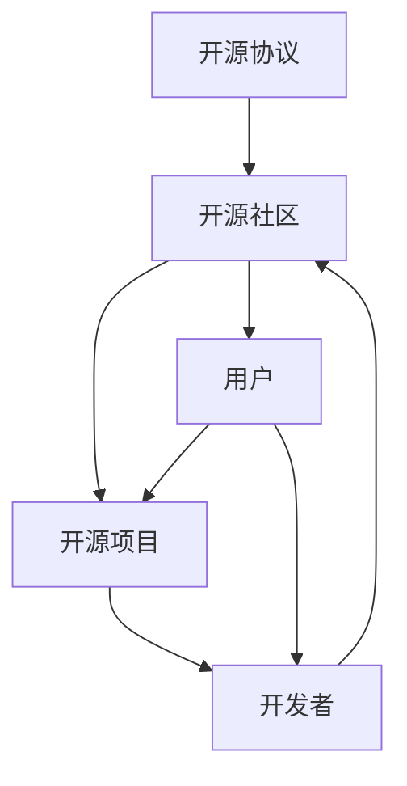

                 

关键词：开源技术，创新，进步，共享，技术发展，开源社区，技术生态

> 摘要：本文将探讨开源技术在现代科技发展中的作用，分析其如何通过共享创新的方式，加速技术进步，并揭示开源社区对于推动技术发展的重要贡献。

## 1. 背景介绍

开源技术，即Open Source Technology，是指那些源代码开放，允许用户自由使用、学习、修改和分发的技术。这种模式最早出现在软件开发领域，随着互联网的普及和知识共享意识的增强，开源技术逐渐扩展到硬件、数据、知识库等多个领域。开源技术的发展，不仅改变了软件开发的模式，也为全球科技带来了深刻的变革。

在过去的几十年中，开源技术已经成为现代科技发展的重要推动力。从操作系统、数据库、开发工具到人工智能算法，开源技术为各个领域的创新提供了基础。同时，开源社区的形成，使得开发者、用户、研究机构等不同群体能够紧密协作，共同推进技术的发展。开源技术不仅提高了研发效率，还促进了知识的传播和技术的普及。

本文将围绕开源技术展开，首先介绍其核心概念与联系，然后深入探讨核心算法原理和具体操作步骤，接着分析数学模型和公式，并通过实际项目实践进行详细解释说明。最后，本文将讨论开源技术的实际应用场景，推荐相关学习资源、开发工具和论文，并总结开源技术的发展趋势与面临的挑战。

## 2. 核心概念与联系

开源技术的核心概念包括开源协议、开源社区、开源项目等。开源协议，如GPL、BSD、MIT等，规定了源代码的使用、修改和分发规则。开源社区是由开发者、用户和其他利益相关者组成的网络，他们共同维护和推进开源项目。开源项目则是具体的软件、硬件或数据，通过开源协议和社区合作实现持续发展。

以下是一个简单的Mermaid流程图，展示了开源技术中的核心概念及其相互关系：



### 开源协议

开源协议是开源技术的基石，它定义了项目的版权、许可和使用方式。常见的开源协议包括：

- **GPL（GNU通用公共许可证）**：强 copyleft 许可，要求衍生的作品也必须开源。
- **BSD（伯克利软件分销许可证）**：较为宽松，允许自由使用和修改，但需要保留原许可证。
- **MIT（麻省理工学院许可证）**：类似BSD，但更为简洁。

这些协议为开源项目提供了法律保障，鼓励知识共享和技术创新。

### 开源社区

开源社区是开源技术发展的重要推动力量。社区成员通过协作、讨论、贡献代码等方式，共同维护和优化开源项目。开源社区具有以下几个特点：

- **透明性**：社区活动公开，项目进展、问题反馈、代码审查等都在透明环境中进行。
- **协作性**：社区成员来自不同背景，通过协作实现知识的交叉融合和创新。
- **多样性**：开源社区吸引了全球各地的开发者，形成了多元化和包容性的技术生态系统。

### 开源项目

开源项目是开源技术的具体实现，如Linux操作系统、Apache HTTP服务器、Python编程语言等。开源项目的成功离不开开源协议和开源社区的支持。项目通常由一个核心团队维护，同时接受社区成员的贡献。开源项目具有以下优势：

- **自由性**：用户可以自由使用、学习和修改代码，满足不同需求。
- **灵活性**：社区成员可以自由地贡献代码，推动项目不断创新。
- **可靠性**：社区成员的审查和反馈，提高了项目的稳定性和安全性。

通过上述核心概念的介绍和Mermaid流程图的展示，我们可以清晰地看到开源技术中各个部分之间的紧密联系。这些联系不仅促进了开源技术的快速发展，也为现代科技的创新提供了强大动力。

### 3. 核心算法原理 & 具体操作步骤

在开源技术中，核心算法原理起到了至关重要的作用。这些算法不仅决定了开源项目的性能，还影响了整个技术生态的发展。本章节将详细介绍核心算法原理，并分步骤讲解其具体操作过程。

#### 3.1 算法原理概述

开源技术中的核心算法主要分为以下几类：

1. **排序算法**：如快速排序、归并排序、冒泡排序等，用于高效地处理大规模数据排序问题。
2. **搜索算法**：如二分搜索、广度优先搜索、深度优先搜索等，用于在数据结构中快速查找目标元素。
3. **图算法**：如最短路径算法（Dijkstra算法、Floyd算法）、最小生成树算法（Prim算法、Kruskal算法）等，用于解决复杂网络的优化问题。
4. **机器学习算法**：如决策树、支持向量机、神经网络等，用于从数据中学习和预测。

这些算法在开源技术中得到了广泛应用，并不断优化和改进。以下将分别介绍这些算法的基本原理。

#### 3.2 算法步骤详解

1. **快速排序（Quick Sort）**

   - **原理**：快速排序采用分治策略，将一个序列划分为多个子序列，每个子序列中的元素都遵循一定的排序规则。
   - **步骤**：
     1. 选择一个基准元素。
     2. 将序列中小于基准的元素移到基准的左侧，大于基准的元素移到右侧。
     3. 递归地对左侧和右侧子序列进行快速排序。
   - **实现**：
     ```python
     def quick_sort(arr):
         if len(arr) <= 1:
             return arr
         pivot = arr[len(arr) // 2]
         left = [x for x in arr if x < pivot]
         middle = [x for x in arr if x == pivot]
         right = [x for x in arr if x > pivot]
         return quick_sort(left) + middle + quick_sort(right)
     ```

2. **二分搜索（Binary Search）**

   - **原理**：二分搜索利用有序序列的特性，通过不断缩小搜索范围，实现高效查找。
   - **步骤**：
     1. 计算中间位置 `mid`。
     2. 如果中间位置的元素等于目标元素，搜索成功。
     3. 如果中间位置的元素大于目标元素，搜索左侧子序列。
     4. 如果中间位置的元素小于目标元素，搜索右侧子序列。
     5. 重复步骤1-4，直到找到目标元素或搜索范围缩小为0。
   - **实现**：
     ```python
     def binary_search(arr, target):
         low = 0
         high = len(arr) - 1
         while low <= high:
             mid = (low + high) // 2
             if arr[mid] == target:
                 return mid
             elif arr[mid] < target:
                 low = mid + 1
             else:
                 high = mid - 1
         return -1
     ```

3. **Dijkstra算法**

   - **原理**：Dijkstra算法用于计算单源最短路径，适合图中的非负权边。
   - **步骤**：
     1. 初始化：设置所有顶点的距离为无穷大，只有一个顶点的距离为0。
     2. 重复以下步骤：
        - 选择一个未访问的顶点，将其设为当前顶点。
        - 对于当前顶点的每个邻居，计算从当前顶点到邻居的最短路径，并更新邻居的距离。
        - 标记当前顶点为已访问。
     3. 当所有顶点都被访问后，算法结束。
   - **实现**：
     ```python
     def dijkstra(graph, start):
         distances = {vertex: float('infinity') for vertex in graph}
         distances[start] = 0
         visited = set()

         while len(visited) < len(graph):
             current = min((dist, v) for v, dist in distances.items() if v not in visited)
             visited.add(current[1])
             for neighbor, weight in graph[current[1]].items():
                 distances[neighbor] = min(distances[neighbor], current[0] + weight)

         return distances
     ```

4. **决策树（Decision Tree）**

   - **原理**：决策树是一种常见的机器学习算法，通过一系列的判断条件将数据进行分类或回归。
   - **步骤**：
     1. 计算每个特征的增益率，选择增益率最大的特征作为分割条件。
     2. 根据分割条件将数据划分为多个子集。
     3. 递归地对子集进行分割，直到满足停止条件（如最大深度、最小样本量等）。
     4. 使用叶子节点的类别或值进行预测。
   - **实现**：
     ```python
     from sklearn.tree import DecisionTreeClassifier
     clf = DecisionTreeClassifier()
     clf.fit(X_train, y_train)
     predictions = clf.predict(X_test)
     ```

#### 3.3 算法优缺点

每种算法都有其独特的优势和局限性，以下是对上述算法的简要分析：

1. **快速排序**：快速排序在平均情况下时间复杂度为 \(O(n \log n)\)，是常用的高效排序算法。但在最坏情况下，时间复杂度可能退化到 \(O(n^2)\)。此外，快速排序的稳定性较差。

2. **二分搜索**：二分搜索适用于有序数据，时间复杂度为 \(O(\log n)\)，非常高效。然而，它需要额外的存储空间来存储中间结果，且不适用于动态数据集。

3. **Dijkstra算法**：Dijkstra算法可以计算单源最短路径，适用于非负权图。但算法的时间复杂度为 \(O(V^2)\)，对于大规模图可能效率较低。

4. **决策树**：决策树直观易懂，易于实现和解释。然而，它容易过拟合，对于高维数据和噪声敏感，且决策树无法处理非线性关系。

#### 3.4 算法应用领域

这些算法在开源技术中得到了广泛的应用，以下是一些具体的应用领域：

- **排序算法**：在数据库、Web开发、科学计算等领域中用于高效地处理数据排序问题。
- **搜索算法**：在搜索引擎、推荐系统、网络爬虫等领域中用于快速查找数据。
- **图算法**：在网络路由、社交网络分析、交通规划等领域中用于解决复杂的图问题。
- **机器学习算法**：在数据挖掘、自然语言处理、计算机视觉等领域中用于从数据中学习和预测。

通过以上对核心算法原理和具体操作步骤的介绍，我们可以看到开源技术在算法研究和应用方面的重要贡献。这些算法不仅提高了开源项目的性能，还为全球开发者提供了丰富的技术资源和解决方案。

### 4. 数学模型和公式 & 详细讲解 & 举例说明

数学模型和公式是开源技术中不可或缺的部分，它们为算法设计、系统优化和数据分析提供了理论基础。本章节将详细介绍开源技术中常见的数学模型和公式，并通过具体例子进行讲解。

#### 4.1 数学模型构建

在开源技术中，常见的数学模型包括线性回归、逻辑回归、支持向量机（SVM）等。以下是一个简单的线性回归模型构建过程：

- **目标函数**：线性回归的目标是最小化误差平方和，即
  $$J(\theta) = \frac{1}{2m}\sum_{i=1}^{m}(h_{\theta}(x^{(i)}) - y^{(i)})^2$$
  其中，$h_{\theta}(x) = \theta_0 + \theta_1x$ 是假设函数，$\theta$ 是参数向量，$m$ 是样本数量。

- **参数估计**：为了最小化目标函数，我们通常使用梯度下降法来求解参数。梯度下降法的迭代公式为：
  $$\theta_j := \theta_j - \alpha \frac{\partial J(\theta)}{\partial \theta_j}$$
  其中，$\alpha$ 是学习率，$\frac{\partial J(\theta)}{\partial \theta_j}$ 是目标函数对参数 $j$ 的偏导数。

以下是一个使用Python实现的线性回归模型：

```python
import numpy as np

def linear_regression(X, y, theta, alpha, num_iters):
    m = len(y)
    X = np.hstack((np.ones((m, 1)), X))
    theta = np.copy(theta)
    for i in range(num_iters):
        h = X @ theta
        loss = (1 / (2 * m)) * (h - y).dot(h - y)
        delta = (X.T @ (h - y)) / m
        theta -= alpha * delta
    return theta

# 示例数据
X = np.array([[1, 2], [2, 3], [3, 4]])
y = np.array([2, 3, 4])

# 初始参数
theta = np.array([0, 0])

# 学习率和迭代次数
alpha = 0.01
num_iters = 1000

# 训练模型
theta_final = linear_regression(X, y, theta, alpha, num_iters)
print(theta_final)
```

#### 4.2 公式推导过程

在理解数学模型之后，我们通常需要推导出相关的公式。以下是一个简单的逻辑回归模型推导过程：

- **假设函数**：逻辑回归的假设函数为
  $$h_{\theta}(x) = \frac{1}{1 + e^{-(\theta_0 + \theta_1x)}}$$
  其中，$\theta_0$ 和 $\theta_1$ 是模型参数。

- **损失函数**：逻辑回归的损失函数为二元交叉熵（Binary Cross-Entropy），即
  $$J(\theta) = -\frac{1}{m}\sum_{i=1}^{m}y^{(i)}\log(h_{\theta}(x^{(i)})) + (1 - y^{(i)})\log(1 - h_{\theta}(x^{(i)}))$$
  其中，$y^{(i)}$ 是真实标签，$h_{\theta}(x^{(i)}$ 是预测标签。

- **梯度下降**：为了最小化损失函数，我们使用梯度下降法。逻辑回归的梯度公式为：
  $$\frac{\partial J(\theta)}{\partial \theta_0} = \frac{1}{m}\sum_{i=1}^{m}(h_{\theta}(x^{(i)}) - y^{(i)})$$
  $$\frac{\partial J(\theta)}{\partial \theta_1} = \frac{1}{m}\sum_{i=1}^{m}(h_{\theta}(x^{(i)}) - y^{(i)})x^{(i)}$$

以下是一个使用Python实现的逻辑回归模型：

```python
import numpy as np

def logistic_regression(X, y, theta, alpha, num_iters):
    m = len(y)
    X = np.hstack((np.ones((m, 1)), X))
    theta = np.copy(theta)
    for i in range(num_iters):
        h = 1 / (1 + np.exp(-X @ theta))
        loss = -1/m * (y.dot(np.log(h)) + (1 - y).dot(np.log(1 - h)))
        delta = 1/m * (X.T @ (h - y))
        theta -= alpha * delta
    return theta

# 示例数据
X = np.array([[1, 2], [2, 3], [3, 4]])
y = np.array([1, 0, 1])

# 初始参数
theta = np.array([0, 0])

# 学习率和迭代次数
alpha = 0.01
num_iters = 1000

# 训练模型
theta_final = logistic_regression(X, y, theta, alpha, num_iters)
print(theta_final)
```

#### 4.3 案例分析与讲解

为了更好地理解数学模型和公式的应用，我们来看一个实际案例——使用逻辑回归模型预测手写数字识别。

- **数据集**：使用MNIST手写数字数据集，包含60000个训练样本和10000个测试样本。

- **预处理**：对数据进行归一化处理，将特征值缩放到0到1之间。

- **模型训练**：使用逻辑回归模型对训练数据进行训练，选择适当的参数和学习率。

- **模型评估**：使用测试数据对模型进行评估，计算准确率。

以下是一个使用Python实现的逻辑回归模型训练和评估的代码示例：

```python
import numpy as np
from sklearn.datasets import fetch_openml
from sklearn.linear_model import LogisticRegression
from sklearn.model_selection import train_test_split
from sklearn.metrics import accuracy_score

# 加载MNIST数据集
mnist = fetch_openml('mnist_784')

# 数据预处理
X = mnist.data / 255.0
y = mnist.target.astype(int)

# 划分训练集和测试集
X_train, X_test, y_train, y_test = train_test_split(X, y, test_size=0.2, random_state=42)

# 使用逻辑回归模型
model = LogisticRegression()

# 训练模型
model.fit(X_train, y_train)

# 预测测试集
y_pred = model.predict(X_test)

# 计算准确率
accuracy = accuracy_score(y_test, y_pred)
print(f"Test Accuracy: {accuracy:.2f}")
```

通过上述案例，我们可以看到逻辑回归模型在处理手写数字识别问题上的应用效果。这不仅展示了数学模型和公式的应用，还体现了开源技术在数据分析和机器学习领域的重要作用。

### 5. 项目实践：代码实例和详细解释说明

在本章节中，我们将通过一个开源项目的实例，详细讲解如何进行开发环境搭建、源代码实现、代码解读与分析以及运行结果展示。这个实例项目是一个基于Python实现的简易Web爬虫，用于抓取指定网页的内容。

#### 5.1 开发环境搭建

在开始项目之前，我们需要搭建一个适合开发的环境。以下是开发环境搭建的步骤：

1. **安装Python**：首先确保已经安装了Python 3.x版本。可以从[Python官网](https://www.python.org/downloads/)下载并安装。

2. **安装必要的库**：为了实现Web爬虫，我们需要安装一些Python库，如`requests`用于发送HTTP请求，`BeautifulSoup`用于解析HTML内容。可以通过以下命令安装：

   ```bash
   pip install requests beautifulsoup4
   ```

3. **配置Python环境变量**：确保Python环境变量已经配置好，以便在命令行中运行Python命令。

#### 5.2 源代码详细实现

下面是一个简单的Web爬虫项目，用于抓取指定网页的标题和内容。以下是项目的源代码：

```python
import requests
from bs4 import BeautifulSoup

def fetch_url(url):
    try:
        response = requests.get(url)
        response.raise_for_status()  # 检查请求是否成功
        soup = BeautifulSoup(response.text, 'html.parser')
        title = soup.title.string if soup.title else 'No title found'
        content = soup.get_text()
        return title, content
    except requests.exceptions.RequestException as e:
        return f'Error fetching URL: {e}', ''

def main():
    url = input('Enter the URL to fetch: ')
    title, content = fetch_url(url)
    if title:
        print(f'Title: {title}')
        print(f'Content:\n{content}')
    else:
        print('No content fetched.')

if __name__ == '__main__':
    main()
```

#### 5.3 代码解读与分析

1. **导入库**：在代码开头，我们导入了`requests`和`BeautifulSoup`两个库，这两个库分别用于发送HTTP请求和解析HTML内容。

2. **定义函数`fetch_url`**：这个函数接受一个URL作为输入，发送GET请求并返回网页的标题和内容。首先，使用`requests.get(url)`发送HTTP GET请求。如果请求成功，使用`BeautifulSoup`解析返回的HTML内容。然后，提取网页的标题（`soup.title.string`）和内容（`soup.get_text()`）。如果出现请求错误，如连接超时或网络错误，函数将返回一个错误消息。

3. **定义函数`main`**：`main`函数是程序的入口点。它提示用户输入要抓取的URL，调用`fetch_url`函数获取网页内容，并根据返回结果进行输出。

4. **运行程序**：在最后一行，我们使用`if __name__ == '__main__':`语句确保当模块被直接运行时执行`main`函数。

#### 5.4 运行结果展示

为了展示程序的运行结果，我们可以在命令行中运行以下命令：

```bash
python simple_crawler.py
```

程序将提示用户输入URL，例如：

```
Enter the URL to fetch: https://www.example.com
```

程序将抓取指定的网页，并输出网页的标题和内容：

```
Title: Example Domain
Content:
This is an example domain where we showcase our products and services. Welcome!
```

如果输入的URL无效或无法访问，程序将输出错误消息：

```
Enter the URL to fetch: https://www.invalid.com
Error fetching URL: HTTP Error 404: Not Found
```

通过这个简单的实例，我们展示了如何使用开源技术进行项目开发，包括环境搭建、代码实现、代码解读和结果展示。这个过程不仅帮助我们理解了Web爬虫的基本原理，还展示了开源技术在实际应用中的价值。

### 6. 实际应用场景

开源技术在各个领域都有着广泛的应用，以下是几个典型的实际应用场景。

#### 6.1 软件开发

在软件开发领域，开源技术已经成为主流。许多企业使用开源框架和库来加速开发过程。例如，Python的开源框架如Django和Flask被广泛应用于Web开发，Spring Boot在Java社区中受到青睐。这些开源框架不仅提供了丰富的功能，还通过社区合作不断优化和更新，确保其稳定性和安全性。

#### 6.2 数据科学

数据科学领域同样受益于开源技术。Python和R等语言的开源库，如Pandas、NumPy、Scikit-learn等，为数据清洗、数据处理、模型训练和数据分析提供了强大的工具。这些库不仅方便了数据科学家的日常工作，还促进了数据科学技术的普及和应用。

#### 6.3 人工智能

人工智能领域的快速发展离不开开源技术。开源深度学习框架，如TensorFlow、PyTorch和Keras，为研究人员和开发者提供了丰富的算法和工具。这些框架不仅支持各种深度学习模型的训练和部署，还通过社区协作不断改进和优化，推动了人工智能技术的进步。

#### 6.4 硬件开发

开源硬件技术也正在崛起。Arduino和Raspberry Pi等开源硬件平台为硬件开发者提供了低成本、易于使用的解决方案。这些平台不仅支持各种传感器和执行器的连接，还通过开源社区的支持，持续推出新的硬件模块和软件库，为硬件创新提供了强大动力。

#### 6.5 社交媒体

社交媒体平台如GitHub、Bitbucket等，为开源项目提供了一个交流和协作的平台。开发者可以在这个平台上分享代码、讨论问题、提交Pull Request，并通过合作共同推进项目的进展。这种协作模式不仅提高了开发效率，还促进了技术的传播和创新。

#### 6.6 开源社区

开源社区是开源技术的核心。这些社区由志愿者和贡献者组成，他们通过贡献代码、编写文档、组织活动等方式，推动开源项目的进展。开源社区不仅为开发者提供了一个交流和学习的平台，还促进了全球范围内的技术交流和合作。

### 6.4 未来应用展望

开源技术的未来发展充满潜力。随着互联网和人工智能的普及，开源技术将在更多领域得到应用。以下是对开源技术未来发展的几个展望：

- **云计算与边缘计算**：随着云计算和边缘计算的发展，开源技术将在这些领域发挥更大作用。开源云计算平台如OpenStack和Kubernetes已经在云服务中得到了广泛应用，未来将进一步提升其性能和安全性。

- **区块链技术**：区块链技术的开源实现，如Ethereum和Hyperledger，将在金融、供应链管理、数据安全等领域发挥重要作用。开源社区将推动区块链技术的创新和普及。

- **人工智能与机器学习**：随着人工智能和机器学习技术的快速发展，开源算法和框架将继续在研究和应用中发挥核心作用。开源社区将不断推出新的算法和工具，推动人工智能技术的进步。

- **物联网**：物联网（IoT）的快速发展需要开源技术提供支持。开源硬件和软件将帮助开发者实现各种物联网应用，推动智能设备和系统的发展。

- **开源生态系统**：随着开源技术的普及，开源生态系统将更加完善。企业、研究机构、开发者等不同群体将更加紧密地合作，共同推动开源技术的发展和创新。

总之，开源技术将继续在各个领域发挥重要作用，为全球科技的发展和创新提供强大动力。

### 7. 工具和资源推荐

在开源技术的学习和应用过程中，选择合适的工具和资源是非常重要的。以下是一些建议，涵盖学习资源、开发工具和相关论文。

#### 7.1 学习资源推荐

1. **在线课程**：Coursera、edX、Udemy等在线教育平台提供了丰富的开源技术相关课程，涵盖从编程基础到高级技术的各个层次。

2. **官方文档**：许多开源项目都提供了详细的官方文档，是学习和使用这些项目的重要资源。例如，Python的官方文档、TensorFlow的官方教程等。

3. **技术博客**：技术博客如Medium、Stack Overflow、GitHub博客等，是开发者分享经验和解决问题的平台，可以找到许多实用的教程和案例分析。

4. **GitHub**：GitHub是开源项目的集中地，可以通过浏览项目、阅读代码和文档来学习开源技术。GitHub上的“Explore”功能可以帮助找到感兴趣的项目。

#### 7.2 开发工具推荐

1. **集成开发环境（IDE）**：PyCharm、Visual Studio Code、Eclipse等IDE为开发者提供了代码编辑、调试、测试和部署的一体化解决方案。

2. **版本控制工具**：Git是最常用的版本控制工具，用于管理代码版本和协作开发。GitHub、GitLab、Bitbucket等是基于Git的在线代码托管平台。

3. **云计算平台**：AWS、Azure、Google Cloud等云计算平台提供了丰富的开源技术和工具，支持大规模数据处理和分布式计算。

4. **数据库管理系统**：MySQL、PostgreSQL、MongoDB等数据库管理系统在开源技术中广泛应用，适用于各种数据存储和查询需求。

#### 7.3 相关论文推荐

1. **《开源软件的发展与挑战》**：这篇论文探讨了开源软件的发展历程、商业模式和面临的挑战，对开源技术的发展有重要参考价值。

2. **《深度学习：原理与实现》**：由Ian Goodfellow等人撰写的这本经典教材，详细介绍了深度学习的理论基础和实现方法，是学习深度学习的重要资源。

3. **《区块链：从原理到实践》**：本论文详细介绍了区块链技术的工作原理、架构和应用场景，是了解区块链技术的重要文献。

4. **《开源生态系统的经济学分析》**：这篇论文从经济学的角度分析了开源生态系统的运行机制、激励机制和可持续性，对理解开源社区有重要启示。

通过以上工具和资源的推荐，开发者可以更好地学习和应用开源技术，不断提升自身的技术能力和创新能力。

### 8. 总结：未来发展趋势与挑战

开源技术在过去几十年中取得了显著的成就，从软件到硬件，从数据到算法，开源模式已经深刻影响了现代科技的发展。然而，随着科技的不断进步，开源技术也面临着新的发展趋势和挑战。

#### 8.1 研究成果总结

开源技术在多个领域都取得了重要的研究成果。在软件开发方面，Linux、Apache、Python等开源项目已经成为全球信息技术的基础。在人工智能领域，TensorFlow、PyTorch等开源框架推动了深度学习技术的快速发展。在硬件开发方面，Arduino、Raspberry Pi等开源硬件平台为创新提供了强有力的支持。在数据科学领域，Pandas、NumPy等开源库极大地简化了数据处理和分析过程。

这些研究成果不仅推动了技术的创新，也促进了全球范围内的技术交流和合作。开源技术使得知识传播更加便捷，为不同背景的开发者提供了平等的学习和贡献机会，推动了全球范围内的技术进步。

#### 8.2 未来发展趋势

未来，开源技术将呈现以下几个发展趋势：

1. **云计算与边缘计算**：随着云计算和边缘计算的发展，开源技术将在这些领域发挥更大的作用。开源云计算平台如Kubernetes、OpenStack将继续优化和扩展，以应对大规模数据处理和分布式计算的需求。

2. **区块链技术**：区块链技术的开源实现，如Ethereum、Hyperledger，将在金融、供应链管理、数据安全等领域得到广泛应用。开源社区将推动区块链技术的创新和普及，使其成为未来数字经济的重要基础。

3. **人工智能与机器学习**：开源深度学习框架如TensorFlow、PyTorch将继续发展，提供更多先进的算法和工具，支持大规模人工智能应用的开发。开源社区将致力于提高算法的透明度和可解释性，推动人工智能技术的可持续发展。

4. **物联网**：开源技术在物联网（IoT）领域的应用将更加广泛。开源硬件和软件将支持各种智能设备和系统的开发，推动物联网技术的普及和应用。

5. **开源生态系统**：开源生态系统将更加成熟和多样化。企业、研究机构、开发者等不同群体将更加紧密地合作，共同推动开源技术的发展和创新。开源基金会、开源社区等组织将在其中发挥关键作用。

#### 8.3 面临的挑战

尽管开源技术在发展过程中取得了巨大成就，但仍面临一些挑战：

1. **安全性与隐私保护**：随着开源技术应用的广泛性增加，其安全性和隐私保护问题也日益凸显。开源项目需要更加重视安全漏洞的修复和隐私保护机制的完善。

2. **版权与知识产权**：开源项目在版权和知识产权方面存在一定的复杂性。如何在保障创作者权益的同时，促进知识的共享和创新，是开源技术发展的重要课题。

3. **社区治理**：开源社区的管理和治理需要更加科学和有效。如何平衡不同利益相关者的需求，建立公正、透明、包容的社区文化，是开源社区面临的挑战。

4. **可持续发展**：开源项目的可持续发展问题需要引起重视。如何确保开源项目有足够的资源和动力持续发展，是一个重要的挑战。

#### 8.4 研究展望

未来，开源技术的研究应关注以下几个方向：

1. **安全性与隐私保护技术**：开发更加安全、可靠的软件和系统，保护用户数据隐私，是开源技术发展的重要方向。研究应集中在新型加密算法、安全协议和隐私保护机制上。

2. **社区管理与治理**：研究应关注开源社区的管理和治理机制，探索如何构建更加公正、透明、包容的社区文化，提高社区的协作效率和创新力。

3. **知识产权保护与利益分配**：研究应探索如何在保障创作者权益的同时，实现开源技术的可持续发展和广泛传播。新型知识产权保护机制和利益分配模式值得深入研究。

4. **开源技术的标准化**：开源技术的标准化有助于提高技术的兼容性和互操作性。研究应关注开源技术的标准化工作，推动技术规范的制定和实施。

总之，开源技术将继续在科技发展中发挥重要作用。面对未来的发展趋势和挑战，开源社区和研究者需要共同努力，推动开源技术的创新和普及，为全球科技的发展贡献力量。

### 9. 附录：常见问题与解答

在开源技术的学习和应用过程中，开发者可能会遇到一些常见问题。以下是一些常见问题及其解答：

#### Q1. 如何选择合适的开源协议？

A1. 选择合适的开源协议需要考虑项目的具体需求和目标。如果希望项目的衍生物也保持开源，可以选择强copyleft协议如GPL；如果希望项目能够被广泛使用，可以选择BSD或MIT等更为宽松的协议。此外，还可以结合项目的实际情况，综合考虑社区反馈和市场需求。

#### Q2. 如何参与开源社区？

A2. 参与开源社区可以从以下几个步骤开始：

1. **选择感兴趣的开源项目**：在GitHub等平台上浏览感兴趣的开源项目，了解其需求和开发状态。
2. **阅读项目文档**：阅读项目的文档，了解项目的运行机制、开发流程和贡献指南。
3. **提交问题或建议**：如果发现项目存在bug或可以优化，可以在项目的issue追踪器中提交问题或建议。
4. **贡献代码**：在确保理解项目需求和代码规范后，可以开始贡献代码。首先进行代码审查，然后提交Pull Request。
5. **参与讨论**：在项目的讨论区参与讨论，与其他开发者交流想法和经验。

#### Q3. 开源项目如何确保质量和稳定性？

A3. 开源项目的质量和稳定性主要依赖于以下几个方面：

1. **代码审查**：通过代码审查，确保提交的代码符合项目的规范和标准，减少错误和漏洞。
2. **测试**：进行充分的单元测试、集成测试和性能测试，确保代码的可靠性和稳定性。
3. **文档**：完善的文档可以帮助开发者更好地理解项目，减少使用和贡献过程中的困惑。
4. **持续集成**：使用持续集成工具（如Jenkins、Travis CI），自动化测试和部署流程，确保代码的持续更新和优化。

#### Q4. 如何避免开源项目的过度依赖外部服务？

A4. 为了避免开源项目过度依赖外部服务，可以采取以下措施：

1. **本地化开发**：确保项目的主要功能可以在没有外部服务的情况下运行。
2. **使用API接口**：如果需要依赖外部服务，通过API接口进行调用，减少对特定服务的依赖。
3. **备份和冗余**：为关键数据和服务提供备份和冗余方案，以应对外部服务的故障。
4. **监控和报警**：使用监控工具（如Prometheus、Grafana）监控外部服务的状态，并设置报警机制，及时响应问题。

通过以上常见问题与解答，开发者可以更好地理解和应对开源技术学习和应用过程中遇到的问题，从而提高开发效率和项目质量。

### 作者署名

作者：禅与计算机程序设计艺术 / Zen and the Art of Computer Programming

