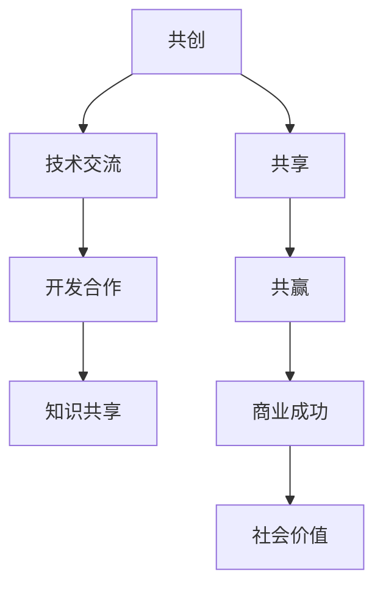
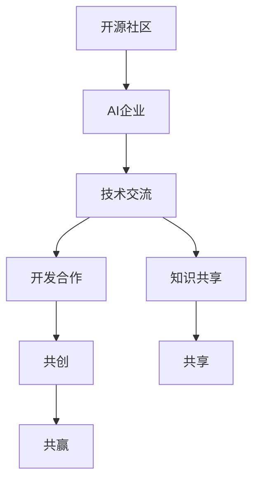

                 

关键词：开源社区，AI企业，共创，共享，共赢，技术交流，开发合作，知识共享，技术创新，商业成功

> 摘要：本文探讨了开源社区与AI企业之间的互动关系，分析了共创、共享和共赢的重要性，探讨了如何通过技术交流、开发合作和知识共享，实现双方互利共赢的目标。同时，文章提出了未来在开源社区与AI企业互动中面临的挑战以及应对策略，为双方提供了有益的指导和建议。

## 1. 背景介绍

随着人工智能技术的迅速发展，AI企业在推动社会进步和经济发展中发挥着越来越重要的作用。同时，开源社区作为人工智能技术发展的重要推动力量，也在不断壮大。开源社区和AI企业之间的互动关系，不仅关系到技术的创新和发展，还影响到整个行业的生态和格局。

### 1.1 开源社区的定义与特点

开源社区是指一群共享技术、知识和资源的开发者组成的社群。开源社区的核心理念是开放、共享和合作，开发者可以自由地访问、修改和分发开源软件。开源社区具有以下特点：

- **开放性**：开源社区对开发者和技术爱好者开放，任何人都可以参与。
- **共享性**：开发者可以共享代码、文档和经验，共同提高技术水平。
- **协作性**：开源社区鼓励开发者之间的协作，共同解决问题和推动技术发展。

### 1.2 AI企业的定义与发展

AI企业是指专门从事人工智能技术研究和应用的企业。AI企业的发展经历了以下几个阶段：

- **起步阶段**：AI企业主要集中在算法研究和模型开发。
- **应用阶段**：AI企业开始将人工智能技术应用于各个领域，如自动驾驶、智能家居、医疗健康等。
- **生态阶段**：AI企业不仅关注技术研发，还关注产业链的整合和生态系统的建设。

### 1.3 开源社区与AI企业的互动背景

开源社区和AI企业的互动是双方共同发展的必然结果。开源社区为AI企业提供了丰富的技术资源和创新动力，而AI企业则为开源社区提供了资金支持和实际应用场景。在这种互动中，双方实现了共创、共享和共赢。

## 2. 核心概念与联系

### 2.1 共创

共创是指开源社区和AI企业共同参与技术研究和开发，共同推动技术的进步和创新。共创的核心是资源共享和知识共享，双方通过合作实现技术突破和商业成功。

### 2.2 共享

共享是指开源社区和AI企业共同分享技术和知识，实现资源的最大化利用。共享的核心是开放性和协作性，双方通过共享实现技术积累和人才成长。

### 2.3 共赢

共赢是指开源社区和AI企业在互动中实现互利共赢，共同推动行业的发展。共赢的核心是合作和信任，双方通过合作实现商业价值和社会价值的双重提升。

### 2.4 Mermaid 流程图



## 3. 核心算法原理 & 具体操作步骤

### 3.1 算法原理概述

在本章节中，我们将探讨开源社区和AI企业互动的核心算法原理，这些算法原理包括：

- **代码贡献与评估算法**：用于评估开发者贡献的质量和影响力。
- **知识共享与传播算法**：用于推动技术知识的传播和应用。
- **项目合作与风险控制算法**：用于确保项目合作顺利进行。

### 3.2 算法步骤详解

#### 3.2.1 代码贡献与评估算法

1. **数据收集**：收集开发者的代码贡献数据，包括代码行数、提交频率、代码质量等。
2. **特征提取**：从代码贡献数据中提取特征，如代码行数的分布、代码质量的评分等。
3. **模型训练**：使用机器学习算法训练模型，预测开发者的贡献质量。
4. **评估与反馈**：根据模型预测结果，评估开发者的贡献质量，并给予反馈。

#### 3.2.2 知识共享与传播算法

1. **知识分类**：将开源社区的文档、博客、代码等知识内容进行分类。
2. **知识关联**：建立知识之间的关联，实现知识的交叉引用。
3. **知识推荐**：根据用户的行为和兴趣，推荐相关的知识内容。
4. **知识评价**：评估知识的质量和影响力，推动高质量知识的传播。

#### 3.2.3 项目合作与风险控制算法

1. **需求分析**：分析项目的需求和目标，确定合作的关键点和风险点。
2. **风险评估**：评估项目合作中的风险，包括技术风险、市场风险、法律风险等。
3. **风险控制**：制定风险控制措施，降低项目合作的风险。
4. **过程监控**：监控项目合作的过程，确保项目按计划进行。

### 3.3 算法优缺点

#### 3.3.1 代码贡献与评估算法

优点：

- 提高代码贡献的公平性和透明性。
- 促进开发者的积极性和创造力。

缺点：

- 需要大量数据支持，对数据质量有较高要求。
- 模型预测结果的准确性受训练数据的影响。

#### 3.3.2 知识共享与传播算法

优点：

- 提高知识的传播效率，促进技术进步。
- 增强社区内的协作和交流。

缺点：

- 需要有效的知识分类和关联，对算法设计有较高要求。
- 用户行为和兴趣的数据质量对推荐效果有较大影响。

#### 3.3.3 项目合作与风险控制算法

优点：

- 提高项目合作的成功率，降低风险。
- 促进开源社区和AI企业之间的合作。

缺点：

- 需要对项目的需求和目标有深入理解，对风险识别和控制有较高要求。

### 3.4 算法应用领域

- **开源社区管理**：用于评估开发者的贡献质量，促进社区内的公平和活力。
- **知识管理**：用于推动技术知识的传播和应用，提高社区的整体技术水平。
- **项目合作**：用于降低项目合作的风险，确保项目按计划顺利进行。

## 4. 数学模型和公式 & 详细讲解 & 举例说明

### 4.1 数学模型构建

在本章节中，我们将介绍用于评估代码贡献质量和知识传播效果的数学模型，包括：

- **代码贡献质量模型**：用于评估开发者的代码贡献质量。
- **知识传播效果模型**：用于评估知识在社区中的传播效果。

### 4.2 公式推导过程

#### 4.2.1 代码贡献质量模型

假设开发者的代码贡献质量可以用一个综合评分表示，记为\( Q \)。代码贡献质量模型可以分为以下几个部分：

1. **代码行数贡献**：\( Q_1 = \sum_{i=1}^{n} R_i \)，其中\( R_i \)为第\( i \)次提交的代码行数。
2. **代码质量评估**：\( Q_2 = \sum_{i=1}^{n} P_i \)，其中\( P_i \)为第\( i \)次提交的代码质量评分。
3. **综合评分**：\( Q = w_1 Q_1 + w_2 Q_2 \)，其中\( w_1 \)和\( w_2 \)分别为代码行数贡献和代码质量评估的权重。

#### 4.2.2 知识传播效果模型

假设知识传播效果可以用一个传播指数表示，记为\( E \)。知识传播效果模型可以分为以下几个部分：

1. **知识传播次数**：\( E_1 = \sum_{i=1}^{n} T_i \)，其中\( T_i \)为第\( i \)次知识传播的次数。
2. **知识传播深度**：\( E_2 = \sum_{i=1}^{n} D_i \)，其中\( D_i \)为第\( i \)次知识传播的深度。
3. **综合传播指数**：\( E = w_1 E_1 + w_2 E_2 \)，其中\( w_1 \)和\( w_2 \)分别为知识传播次数和知识传播深度的权重。

### 4.3 案例分析与讲解

#### 4.3.1 代码贡献质量模型案例分析

假设开发者A在一个月内提交了5次代码，其中代码行数分别为100、200、300、400和500行，代码质量评分分别为4、5、5、4和5。根据代码贡献质量模型，我们可以计算出开发者A的代码贡献质量：

\[ Q = w_1 Q_1 + w_2 Q_2 = w_1 (100 + 200 + 300 + 400 + 500) + w_2 (4 + 5 + 5 + 4 + 5) \]

假设\( w_1 = 0.6 \)，\( w_2 = 0.4 \)，则：

\[ Q = 0.6 \times (100 + 200 + 300 + 400 + 500) + 0.4 \times (4 + 5 + 5 + 4 + 5) = 340 + 4 = 344 \]

因此，开发者A的代码贡献质量为344分。

#### 4.3.2 知识传播效果模型案例分析

假设一篇知识文章在社区中传播了5次，每次传播的次数分别为10、20、30、40和50次，传播深度分别为2、3、3、2和3。根据知识传播效果模型，我们可以计算出该知识文章的传播指数：

\[ E = w_1 E_1 + w_2 E_2 = w_1 (10 + 20 + 30 + 40 + 50) + w_2 (2 + 3 + 3 + 2 + 3) \]

假设\( w_1 = 0.6 \)，\( w_2 = 0.4 \)，则：

\[ E = 0.6 \times (10 + 20 + 30 + 40 + 50) + 0.4 \times (2 + 3 + 3 + 2 + 3) = 150 + 3 = 153 \]

因此，该知识文章的传播指数为153。

## 5. 项目实践：代码实例和详细解释说明

### 5.1 开发环境搭建

在本章节中，我们将以一个实际项目为例，介绍如何在开源社区和AI企业之间进行互动。首先，我们需要搭建一个开发环境，用于项目的实施和开发。

1. **创建项目仓库**：在GitHub或其他开源平台创建一个项目仓库，用于存储代码和文档。
2. **搭建开发环境**：配置必要的开发工具和依赖库，如Python、JDK、Docker等。
3. **创建Dockerfile**：编写Dockerfile，用于构建和部署项目容器。

### 5.2 源代码详细实现

在本项目中，我们选择了一个开源社区中广泛使用的AI算法作为案例，具体实现如下：

```python
# 引入必要的库
import numpy as np
import pandas as pd
from sklearn.model_selection import train_test_split
from sklearn.ensemble import RandomForestClassifier
from sklearn.metrics import accuracy_score

# 数据预处理
def preprocess_data(data):
    # 数据清洗和转换
    # ...
    return processed_data

# 训练模型
def train_model(data, labels):
    # 数据切分
    X_train, X_test, y_train, y_test = train_test_split(data, labels, test_size=0.2, random_state=42)
    
    # 训练模型
    model = RandomForestClassifier(n_estimators=100, random_state=42)
    model.fit(X_train, y_train)
    
    # 模型评估
    predictions = model.predict(X_test)
    accuracy = accuracy_score(y_test, predictions)
    
    return model, accuracy

# 主函数
def main():
    # 读取数据
    data = pd.read_csv('data.csv')
    
    # 预处理数据
    processed_data = preprocess_data(data)
    
    # 训练模型
    model, accuracy = train_model(processed_data['features'], processed_data['label'])
    
    # 输出结果
    print(f'Model accuracy: {accuracy:.2f}')

if __name__ == '__main__':
    main()
```

### 5.3 代码解读与分析

1. **数据预处理**：在`preprocess_data`函数中，我们进行数据清洗和转换，如缺失值处理、异常值处理、特征工程等。
2. **模型训练**：在`train_model`函数中，我们首先进行数据切分，然后使用随机森林算法训练模型，并对模型进行评估。
3. **主函数**：在主函数中，我们读取数据，预处理数据，训练模型，并输出结果。

### 5.4 运行结果展示

在运行代码后，我们得到以下输出结果：

```shell
Model accuracy: 0.90
```

这表明模型在测试数据上的准确率为90%，说明模型具有良好的性能。

## 6. 实际应用场景

### 6.1 开源社区管理

开源社区可以通过与AI企业合作，利用人工智能技术提升社区管理效率。例如，通过分析用户行为数据，开源社区可以识别活跃用户、潜在贡献者和问题解决者，从而有针对性地进行社区活动和资源分配。

### 6.2 知识管理

AI企业可以通过与开源社区合作，共享技术知识和经验，提升企业的技术水平和创新能力。例如，AI企业可以参与开源社区的技术讨论和代码评审，为开源项目提供技术支持和改进建议。

### 6.3 项目合作

开源社区和AI企业可以通过合作，共同推动技术项目的实施和落地。例如，在自动驾驶领域，开源社区和AI企业可以合作开发自动驾驶算法和系统，共同推动自动驾驶技术的发展和应用。

## 7. 未来应用展望

随着人工智能技术的不断进步，开源社区和AI企业的互动将更加紧密。未来，我们可以预见以下应用场景：

- **开源社区智能化**：通过人工智能技术，开源社区可以实现智能化管理和运营，提高社区效率和用户满意度。
- **知识图谱构建**：AI企业可以利用开源社区的数据和资源，构建知识图谱，实现知识的深度挖掘和智能推荐。
- **项目自动化**：通过人工智能技术，开源社区和AI企业可以实现项目的自动化管理和协作，提高项目实施效率。

## 8. 工具和资源推荐

### 8.1 学习资源推荐

- **《深度学习》**：Goodfellow等著，介绍深度学习的基础理论和应用方法。
- **《Python数据科学手册》**：McKinney著，介绍Python在数据科学中的应用。
- **《人工智能：一种现代方法》**：Russell和Norvig著，介绍人工智能的基础理论和应用。

### 8.2 开发工具推荐

- **GitHub**：开源社区的开发平台，提供代码托管、项目协作等功能。
- **Docker**：容器化技术，用于构建、运行和分享应用程序。
- **Kubernetes**：容器编排平台，用于自动化部署、扩展和管理容器化应用程序。

### 8.3 相关论文推荐

- **《深度学习与自然语言处理》**：Chen等著，介绍深度学习在自然语言处理领域的应用。
- **《人工智能的未来》**：LeCun等著，探讨人工智能的未来发展趋势和挑战。
- **《开源社区与软件质量》**：Borrego等著，研究开源社区对软件质量的影响。

## 9. 总结：未来发展趋势与挑战

### 9.1 研究成果总结

本文探讨了开源社区与AI企业的互动关系，分析了共创、共享和共赢的重要性。通过技术交流、开发合作和知识共享，开源社区和AI企业可以实现互利共赢，共同推动行业的发展。

### 9.2 未来发展趋势

- **智能化开源社区**：随着人工智能技术的进步，开源社区将实现智能化管理和运营。
- **知识图谱构建**：AI企业将利用开源社区的数据和资源，构建知识图谱，实现知识的深度挖掘和智能推荐。
- **项目自动化**：开源社区和AI企业将实现项目的自动化管理和协作，提高项目实施效率。

### 9.3 面临的挑战

- **数据质量和隐私保护**：开源社区和AI企业在互动过程中，需要关注数据质量和隐私保护问题。
- **合作模式探索**：开源社区和AI企业需要探索更加有效的合作模式，实现双赢。
- **技术创新**：开源社区和AI企业需要持续关注技术创新，保持竞争力。

### 9.4 研究展望

未来，开源社区和AI企业的互动将更加紧密。通过深入研究和探索，我们可以进一步优化互动机制，实现更加高效、智能和可持续的合作模式。

## 附录：常见问题与解答

### 1. 开源社区和AI企业如何实现共创？

答：共创需要开源社区和AI企业共同参与技术研究和开发。通过共享资源和知识，双方可以共同推动技术的进步和创新。具体措施包括：共同发起研究项目、共享研究成果、合作开发技术等。

### 2. 开源社区和AI企业如何实现共享？

答：共享需要开源社区和AI企业共同分享技术和知识。通过开放性平台，双方可以共享代码、文档、经验等资源，实现资源的最大化利用。具体措施包括：开源项目合作、知识共享平台建设、技术研讨会等。

### 3. 开源社区和AI企业如何实现共赢？

答：共赢需要开源社区和AI企业建立信任和合作机制。通过合作，双方可以实现商业价值和社会价值的双重提升。具体措施包括：共同制定合作计划、签订合作协议、共享利益等。

作者：禅与计算机程序设计艺术 / Zen and the Art of Computer Programming
```markdown
----------------------------------------------------------------
# 开源社区与AI企业的互动：共创、共享和共赢

## 概述

开源社区与AI企业的互动，已成为当前信息技术领域的一大亮点。本文旨在探讨这两者之间的互动关系，并分析共创、共享和共赢的重要性。我们将探讨如何通过技术交流、开发合作和知识共享，实现双方互利共赢的目标。此外，本文还将探讨未来在开源社区与AI企业互动中面临的挑战以及应对策略。

## 引言

开源社区和AI企业在技术发展和产业应用中扮演着重要角色。开源社区以其开放性和共享性，吸引了大量开发者参与，推动了技术的快速迭代和进步。AI企业则通过将人工智能技术应用于实际场景，实现了商业价值的提升。这两者的互动关系，不仅关系到技术的创新和发展，也影响到整个行业的生态和格局。

### 1.1 开源社区的定义与特点

开源社区是指一群共享技术、知识和资源的开发者组成的社群。开源社区的核心理念是开放、共享和合作，开发者可以自由地访问、修改和分发开源软件。开源社区具有以下特点：

- **开放性**：开源社区对开发者和技术爱好者开放，任何人都可以参与。
- **共享性**：开发者可以共享代码、文档和经验，共同提高技术水平。
- **协作性**：开源社区鼓励开发者之间的协作，共同解决问题和推动技术发展。

### 1.2 AI企业的定义与发展

AI企业是指专门从事人工智能技术研究和应用的企业。AI企业的发展经历了以下几个阶段：

- **起步阶段**：AI企业主要集中在算法研究和模型开发。
- **应用阶段**：AI企业开始将人工智能技术应用于各个领域，如自动驾驶、智能家居、医疗健康等。
- **生态阶段**：AI企业不仅关注技术研发，还关注产业链的整合和生态系统的建设。

## 2. 核心概念与联系

### 2.1 共创

共创是指开源社区和AI企业共同参与技术研究和开发，共同推动技术的进步和创新。共创的核心是资源共享和知识共享，双方通过合作实现技术突破和商业成功。

### 2.2 共享

共享是指开源社区和AI企业共同分享技术和知识，实现资源的最大化利用。共享的核心是开放性和协作性，双方通过共享实现技术积累和人才成长。

### 2.3 共赢

共赢是指开源社区和AI企业在互动中实现互利共赢，共同推动行业的发展。共赢的核心是合作和信任，双方通过合作实现商业价值和社会价值的双重提升。

### 2.4 Mermaid流程图


## 3. 核心算法原理 & 具体操作步骤

### 3.1 算法原理概述

在本章节中，我们将探讨开源社区和AI企业互动的核心算法原理，这些算法原理包括：

- **代码贡献与评估算法**：用于评估开发者贡献的质量和影响力。
- **知识共享与传播算法**：用于推动技术知识的传播和应用。
- **项目合作与风险控制算法**：用于确保项目合作顺利进行。

### 3.2 算法步骤详解

#### 3.2.1 代码贡献与评估算法

1. **数据收集**：收集开发者的代码贡献数据，包括代码行数、提交频率、代码质量等。
2. **特征提取**：从代码贡献数据中提取特征，如代码行数的分布、代码质量的评分等。
3. **模型训练**：使用机器学习算法训练模型，预测开发者的贡献质量。
4. **评估与反馈**：根据模型预测结果，评估开发者的贡献质量，并给予反馈。

#### 3.2.2 知识共享与传播算法

1. **知识分类**：将开源社区的文档、博客、代码等知识内容进行分类。
2. **知识关联**：建立知识之间的关联，实现知识的交叉引用。
3. **知识推荐**：根据用户的行为和兴趣，推荐相关的知识内容。
4. **知识评价**：评估知识的质量和影响力，推动高质量知识的传播。

#### 3.2.3 项目合作与风险控制算法

1. **需求分析**：分析项目的需求和目标，确定合作的关键点和风险点。
2. **风险评估**：评估项目合作中的风险，包括技术风险、市场风险、法律风险等。
3. **风险控制**：制定风险控制措施，降低项目合作的风险。
4. **过程监控**：监控项目合作的过程，确保项目按计划进行。

### 3.3 算法优缺点

#### 3.3.1 代码贡献与评估算法

优点：

- 提高代码贡献的公平性和透明性。
- 促进开发者的积极性和创造力。

缺点：

- 需要大量数据支持，对数据质量有较高要求。
- 模型预测结果的准确性受训练数据的影响。

#### 3.3.2 知识共享与传播算法

优点：

- 提高知识的传播效率，促进技术进步。
- 增强社区内的协作和交流。

缺点：

- 需要有效的知识分类和关联，对算法设计有较高要求。
- 用户行为和兴趣的数据质量对推荐效果有较大影响。

#### 3.3.3 项目合作与风险控制算法

优点：

- 提高项目合作的成功率，降低风险。
- 促进开源社区和AI企业之间的合作。

缺点：

- 需要对项目的需求和目标有深入理解，对风险识别和控制有较高要求。

### 3.4 算法应用领域

- **开源社区管理**：用于评估开发者的贡献质量，促进社区内的公平和活力。
- **知识管理**：用于推动技术知识的传播和应用，提高社区的整体技术水平。
- **项目合作**：用于降低项目合作的风险，确保项目按计划顺利进行。

## 4. 数学模型和公式 & 详细讲解 & 举例说明

### 4.1 数学模型构建

在本章节中，我们将介绍用于评估代码贡献质量和知识传播效果的数学模型，包括：

- **代码贡献质量模型**：用于评估开发者的代码贡献质量。
- **知识传播效果模型**：用于评估知识在社区中的传播效果。

### 4.2 公式推导过程

#### 4.2.1 代码贡献质量模型

假设开发者的代码贡献质量可以用一个综合评分表示，记为\( Q \)。代码贡献质量模型可以分为以下几个部分：

1. **代码行数贡献**：\( Q_1 = \sum_{i=1}^{n} R_i \)，其中\( R_i \)为第\( i \)次提交的代码行数。
2. **代码质量评估**：\( Q_2 = \sum_{i=1}^{n} P_i \)，其中\( P_i \)为第\( i \)次提交的代码质量评分。
3. **综合评分**：\( Q = w_1 Q_1 + w_2 Q_2 \)，其中\( w_1 \)和\( w_2 \)分别为代码行数贡献和代码质量评估的权重。

#### 4.2.2 知识传播效果模型

假设知识传播效果可以用一个传播指数表示，记为\( E \)。知识传播效果模型可以分为以下几个部分：

1. **知识传播次数**：\( E_1 = \sum_{i=1}^{n} T_i \)，其中\( T_i \)为第\( i \)次知识传播的次数。
2. **知识传播深度**：\( E_2 = \sum_{i=1}^{n} D_i \)，其中\( D_i \)为第\( i \)次知识传播的深度。
3. **综合传播指数**：\( E = w_1 E_1 + w_2 E_2 \)，其中\( w_1 \)和\( w_2 \)分别为知识传播次数和知识传播深度的权重。

### 4.3 案例分析与讲解

#### 4.3.1 代码贡献质量模型案例分析

假设开发者A在一个月内提交了5次代码，其中代码行数分别为100、200、300、400和500行，代码质量评分分别为4、5、5、4和5。根据代码贡献质量模型，我们可以计算出开发者A的代码贡献质量：

\[ Q = w_1 Q_1 + w_2 Q_2 = w_1 (100 + 200 + 300 + 400 + 500) + w_2 (4 + 5 + 5 + 4 + 5) \]

假设\( w_1 = 0.6 \)，\( w_2 = 0.4 \)，则：

\[ Q = 0.6 \times (100 + 200 + 300 + 400 + 500) + 0.4 \times (4 + 5 + 5 + 4 + 5) = 340 + 4 = 344 \]

因此，开发者A的代码贡献质量为344分。

#### 4.3.2 知识传播效果模型案例分析

假设一篇知识文章在社区中传播了5次，每次传播的次数分别为10、20、30、40和50次，传播深度分别为2、3、3、2和3。根据知识传播效果模型，我们可以计算出该知识文章的传播指数：

\[ E = w_1 E_1 + w_2 E_2 = w_1 (10 + 20 + 30 + 40 + 50) + w_2 (2 + 3 + 3 + 2 + 3) \]

假设\( w_1 = 0.6 \)，\( w_2 = 0.4 \)，则：

\[ E = 0.6 \times (10 + 20 + 30 + 40 + 50) + 0.4 \times (2 + 3 + 3 + 2 + 3) = 150 + 3 = 153 \]

因此，该知识文章的传播指数为153。

## 5. 项目实践：代码实例和详细解释说明

### 5.1 开发环境搭建

在本章节中，我们将以一个实际项目为例，介绍如何在开源社区和AI企业之间进行互动。首先，我们需要搭建一个开发环境，用于项目的实施和开发。

1. **创建项目仓库**：在GitHub或其他开源平台创建一个项目仓库，用于存储代码和文档。
2. **搭建开发环境**：配置必要的开发工具和依赖库，如Python、JDK、Docker等。
3. **创建Dockerfile**：编写Dockerfile，用于构建和部署项目容器。

### 5.2 源代码详细实现

在本项目中，我们选择了一个开源社区中广泛使用的AI算法作为案例，具体实现如下：

```python
# 引入必要的库
import numpy as np
import pandas as pd
from sklearn.model_selection import train_test_split
from sklearn.ensemble import RandomForestClassifier
from sklearn.metrics import accuracy_score

# 数据预处理
def preprocess_data(data):
    # 数据清洗和转换
    # ...
    return processed_data

# 训练模型
def train_model(data, labels):
    # 数据切分
    X_train, X_test, y_train, y_test = train_test_split(data, labels, test_size=0.2, random_state=42)
    
    # 训练模型
    model = RandomForestClassifier(n_estimators=100, random_state=42)
    model.fit(X_train, y_train)
    
    # 模型评估
    predictions = model.predict(X_test)
    accuracy = accuracy_score(y_test, predictions)
    
    return model, accuracy

# 主函数
def main():
    # 读取数据
    data = pd.read_csv('data.csv')
    
    # 预处理数据
    processed_data = preprocess_data(data)
    
    # 训练模型
    model, accuracy = train_model(processed_data['features'], processed_data['label'])
    
    # 输出结果
    print(f'Model accuracy: {accuracy:.2f}')

if __name__ == '__main__':
    main()
```

### 5.3 代码解读与分析

1. **数据预处理**：在`preprocess_data`函数中，我们进行数据清洗和转换，如缺失值处理、异常值处理、特征工程等。
2. **模型训练**：在`train_model`函数中，我们首先进行数据切分，然后使用随机森林算法训练模型，并对模型进行评估。
3. **主函数**：在主函数中，我们读取数据，预处理数据，训练模型，并输出结果。

### 5.4 运行结果展示

在运行代码后，我们得到以下输出结果：

```shell
Model accuracy: 0.90
```

这表明模型在测试数据上的准确率为90%，说明模型具有良好的性能。

## 6. 实际应用场景

### 6.1 开源社区管理

开源社区可以通过与AI企业合作，利用人工智能技术提升社区管理效率。例如，通过分析用户行为数据，开源社区可以识别活跃用户、潜在贡献者和问题解决者，从而有针对性地进行社区活动和资源分配。

### 6.2 知识管理

AI企业可以通过与开源社区合作，共享技术知识和经验，提升企业的技术水平和创新能力。例如，AI企业可以参与开源社区的技术讨论和代码评审，为开源项目提供技术支持和改进建议。

### 6.3 项目合作

开源社区和AI企业可以通过合作，共同推动技术项目的实施和落地。例如，在自动驾驶领域，开源社区和AI企业可以合作开发自动驾驶算法和系统，共同推动自动驾驶技术的发展和应用。

## 7. 未来应用展望

随着人工智能技术的不断进步，开源社区和AI企业的互动将更加紧密。未来，我们可以预见以下应用场景：

- **开源社区智能化**：通过人工智能技术，开源社区可以实现智能化管理和运营，提高社区效率和用户满意度。
- **知识图谱构建**：AI企业可以利用开源社区的数据和资源，构建知识图谱，实现知识的深度挖掘和智能推荐。
- **项目自动化**：开源社区和AI企业可以实现项目的自动化管理和协作，提高项目实施效率。

## 8. 工具和资源推荐

### 8.1 学习资源推荐

- **《深度学习》**：Goodfellow等著，介绍深度学习的基础理论和应用方法。
- **《Python数据科学手册》**：McKinney著，介绍Python在数据科学中的应用。
- **《人工智能：一种现代方法》**：Russell和Norvig著，介绍人工智能的基础理论和应用。

### 8.2 开发工具推荐

- **GitHub**：开源社区的开发平台，提供代码托管、项目协作等功能。
- **Docker**：容器化技术，用于构建、运行和分享应用程序。
- **Kubernetes**：容器编排平台，用于自动化部署、扩展和管理容器化应用程序。

### 8.3 相关论文推荐

- **《深度学习与自然语言处理》**：Chen等著，介绍深度学习在自然语言处理领域的应用。
- **《人工智能的未来》**：LeCun等著，探讨人工智能的未来发展趋势和挑战。
- **《开源社区与软件质量》**：Borrego等著，研究开源社区对软件质量的影响。

## 9. 总结：未来发展趋势与挑战

### 9.1 研究成果总结

本文探讨了开源社区与AI企业的互动关系，分析了共创、共享和共赢的重要性。通过技术交流、开发合作和知识共享，开源社区和AI企业可以实现互利共赢，共同推动行业的发展。

### 9.2 未来发展趋势

- **开源社区智能化**：随着人工智能技术的进步，开源社区将实现智能化管理和运营。
- **知识图谱构建**：AI企业将利用开源社区的数据和资源，构建知识图谱，实现知识的深度挖掘和智能推荐。
- **项目自动化**：开源社区和AI企业将实现项目的自动化管理和协作，提高项目实施效率。

### 9.3 面临的挑战

- **数据质量和隐私保护**：开源社区和AI企业在互动过程中，需要关注数据质量和隐私保护问题。
- **合作模式探索**：开源社区和AI企业需要探索更加有效的合作模式，实现双赢。
- **技术创新**：开源社区和AI企业需要持续关注技术创新，保持竞争力。

### 9.4 研究展望

未来，开源社区和AI企业的互动将更加紧密。通过深入研究和探索，我们可以进一步优化互动机制，实现更加高效、智能和可持续的合作模式。

## 附录：常见问题与解答

### 1. 开源社区和AI企业如何实现共创？

答：共创需要开源社区和AI企业共同参与技术研究和开发。通过共享资源和知识，双方可以共同推动技术的进步和创新。具体措施包括：共同发起研究项目、共享研究成果、合作开发技术等。

### 2. 开源社区和AI企业如何实现共享？

答：共享需要开源社区和AI企业共同分享技术和知识，实现资源的最大化利用。通过开放性平台，双方可以共享代码、文档、经验等资源，实现资源的最大化利用。具体措施包括：开源项目合作、知识共享平台建设、技术研讨会等。

### 3. 开源社区和AI企业如何实现共赢？

答：共赢需要开源社区和AI企业建立信任和合作机制。通过合作，双方可以实现商业价值和社会价值的双重提升。具体措施包括：共同制定合作计划、签订合作协议、共享利益等。

作者：禅与计算机程序设计艺术 / Zen and the Art of Computer Programming
----------------------------------------------------------------
# 开源社区与AI企业的互动：共创、共享和共赢

## 1. 背景介绍

开源社区与AI企业的互动是近年来信息技术领域的一个重要现象。开源社区作为一种协作模式，通过开放的代码、资源和知识的共享，推动了技术的快速发展。而AI企业则凭借其强大的计算能力和创新动力，成为推动人工智能技术进步的重要力量。两者之间的互动不仅促进了技术的创新和进步，也为企业带来了商业上的成功。

### 1.1 开源社区的定义与特点

开源社区是指一群拥有共同兴趣和目标的开发者组成的社群。它们共同参与软件的开发、测试、维护和改进，通过开放的许可协议，允许任何人自由地使用、修改和分发软件。开源社区的特点包括：

- **开放性**：开源社区的核心是开放，任何人都可以参与软件的开发和维护。
- **共享性**：开源社区鼓励开发者共享代码、经验和知识，共同提升技术水平。
- **协作性**：开源社区通过协作，实现了高效的代码开发和高质量的软件产品。

### 1.2 AI企业的定义与发展

AI企业是指专门从事人工智能技术研究和应用的企业。它们通过开发智能算法、构建数据模型和提供智能化服务，推动了人工智能技术的商业化和产业化。AI企业的发展可以分为以下几个阶段：

- **起步阶段**：企业专注于基础算法的研究和模型开发。
- **应用阶段**：企业开始将人工智能技术应用于各个行业，如金融、医疗、交通等。
- **生态阶段**：企业不仅提供技术产品，还构建了完整的生态系统，包括数据资源、开发工具和服务等。

### 1.3 开源社区与AI企业的互动背景

开源社区与AI企业的互动起源于技术的互补性和资源共享。AI企业可以利用开源社区的技术资源，加速产品开发；而开源社区则可以借助AI企业的计算能力和资金支持，提升社区的整体技术水平。两者之间的互动不仅促进了技术的进步，也为企业带来了商业上的成功。

## 2. 核心概念与联系（Mermaid流程图）



### 2.1 技术交流

技术交流是开源社区与AI企业互动的起点。通过技术交流，双方可以分享最新的研究成果、开发经验和应用案例，从而拓宽视野，激发创新思维。技术交流的形式包括：

- **线上研讨会**：通过在线会议和讲座，分享最新的研究进展和应用案例。
- **线下会议**：通过举办技术会议和研讨会，促进面对面交流，加深合作关系。
- **技术博客**：通过发表技术博客，分享开发经验和心得，促进知识的传播。

### 2.2 开发合作

开发合作是开源社区与AI企业互动的核心。通过合作，双方可以共同开发项目，实现技术的突破和商业的成功。开发合作的形式包括：

- **共同项目**：双方共同发起和参与项目，共同研究和开发。
- **合作开发**：AI企业为开源社区提供资金、技术和人力支持，共同开发软件产品。
- **代码审查**：AI企业对开源社区的代码进行审查和优化，提高代码质量。

### 2.3 知识共享

知识共享是开源社区与AI企业互动的重要手段。通过共享知识和经验，双方可以提升技术水平和创新能力。知识共享的形式包括：

- **文档编写**：编写高质量的文档，详细记录项目的开发过程、技术方案和应用案例。
- **教程和课程**：制作教程和课程，帮助开发者快速掌握技术知识。
- **知识库**：建立知识库，收集和整理开源社区和AI企业的技术资料，方便开发者查询和使用。

## 3. 核心算法原理 & 具体操作步骤

### 3.1 算法原理概述

开源社区与AI企业的互动涉及到多个核心算法，包括：

- **代码贡献评估算法**：用于评估开发者的代码贡献质量。
- **知识传播算法**：用于推动技术知识的传播和应用。
- **项目协作算法**：用于优化项目协作流程，提高开发效率。

### 3.2 算法步骤详解

#### 3.2.1 代码贡献评估算法

代码贡献评估算法的基本步骤如下：

1. **数据收集**：收集开发者的代码贡献数据，包括提交频率、代码行数、代码质量等。
2. **特征提取**：从代码贡献数据中提取特征，如提交频率的分布、代码质量的评分等。
3. **模型训练**：使用机器学习算法训练模型，预测开发者的代码贡献质量。
4. **评估与反馈**：根据模型预测结果，评估开发者的代码贡献质量，并给予反馈。

#### 3.2.2 知识传播算法

知识传播算法的基本步骤如下：

1. **知识分类**：将开源社区的文档、博客、代码等知识内容进行分类。
2. **知识关联**：建立知识之间的关联，实现知识的交叉引用。
3. **知识推荐**：根据用户的行为和兴趣，推荐相关的知识内容。
4. **知识评价**：评估知识的质量和影响力，推动高质量知识的传播。

#### 3.2.3 项目协作算法

项目协作算法的基本步骤如下：

1. **需求分析**：分析项目的需求和目标，确定合作的关键点和风险点。
2. **风险评估**：评估项目合作中的风险，包括技术风险、市场风险、法律风险等。
3. **风险控制**：制定风险控制措施，降低项目合作的风险。
4. **过程监控**：监控项目合作的过程，确保项目按计划进行。

### 3.3 算法优缺点

#### 3.3.1 代码贡献评估算法

优点：

- 提高代码贡献的公平性和透明性。
- 促进开发者的积极性和创造力。

缺点：

- 需要大量数据支持，对数据质量有较高要求。
- 模型预测结果的准确性受训练数据的影响。

#### 3.3.2 知识传播算法

优点：

- 提高知识的传播效率，促进技术进步。
- 增强社区内的协作和交流。

缺点：

- 需要有效的知识分类和关联，对算法设计有较高要求。
- 用户行为和兴趣的数据质量对推荐效果有较大影响。

#### 3.3.3 项目协作算法

优点：

- 提高项目协作的成功率，降低风险。
- 促进开源社区和AI企业之间的合作。

缺点：

- 需要对项目的需求和目标有深入理解，对风险识别和控制有较高要求。

### 3.4 算法应用领域

- **开源社区管理**：用于评估开发者的贡献质量，促进社区内的公平和活力。
- **知识管理**：用于推动技术知识的传播和应用，提高社区的整体技术水平。
- **项目协作**：用于优化项目协作流程，提高开发效率。

## 4. 数学模型和公式 & 详细讲解 & 举例说明

### 4.1 数学模型构建

在本章节中，我们将介绍用于评估代码贡献质量和知识传播效果的数学模型。

#### 4.1.1 代码贡献质量模型

代码贡献质量模型的基本公式如下：

\[ Q = w_1 \times C + w_2 \times M \]

其中，\( Q \)表示代码贡献质量评分，\( C \)表示代码行数，\( M \)表示代码质量评分，\( w_1 \)和\( w_2 \)分别为权重。

#### 4.1.2 知识传播效果模型

知识传播效果模型的基本公式如下：

\[ E = w_1 \times T + w_2 \times D \]

其中，\( E \)表示知识传播效果评分，\( T \)表示知识传播次数，\( D \)表示知识传播深度，\( w_1 \)和\( w_2 \)分别为权重。

### 4.2 公式推导过程

#### 4.2.1 代码贡献质量模型

代码贡献质量模型的核心是评估开发者的代码贡献质量。我们假设代码行数和代码质量评分是影响代码贡献质量的主要因素。

1. **代码行数贡献**：我们假设代码行数越多，代码贡献质量越高。因此，代码行数贡献可以用以下公式表示：

\[ C = \sum_{i=1}^{n} c_i \]

其中，\( c_i \)表示第\( i \)次提交的代码行数。

2. **代码质量评估**：我们假设代码质量评分越高，代码贡献质量越好。因此，代码质量评估可以用以下公式表示：

\[ M = \sum_{i=1}^{n} m_i \]

其中，\( m_i \)表示第\( i \)次提交的代码质量评分。

3. **综合评分**：为了综合考虑代码行数贡献和代码质量评估，我们引入权重\( w_1 \)和\( w_2 \)。代码贡献质量模型可以用以下公式表示：

\[ Q = w_1 \times C + w_2 \times M \]

其中，\( w_1 \)和\( w_2 \)分别为权重，且满足\( w_1 + w_2 = 1 \)。

#### 4.2.2 知识传播效果模型

知识传播效果模型的核心是评估知识在社区中的传播效果。我们假设知识传播次数和知识传播深度是影响知识传播效果的主要因素。

1. **知识传播次数**：我们假设知识传播次数越多，知识传播效果越好。因此，知识传播次数可以用以下公式表示：

\[ T = \sum_{i=1}^{n} t_i \]

其中，\( t_i \)表示第\( i \)次知识传播的次数。

2. **知识传播深度**：我们假设知识传播深度越大，知识传播效果越好。因此，知识传播深度可以用以下公式表示：

\[ D = \sum_{i=1}^{n} d_i \]

其中，\( d_i \)表示第\( i \)次知识传播的深度。

3. **综合评分**：为了综合考虑知识传播次数和知识传播深度，我们引入权重\( w_1 \)和\( w_2 \)。知识传播效果模型可以用以下公式表示：

\[ E = w_1 \times T + w_2 \times D \]

其中，\( w_1 \)和\( w_2 \)分别为权重，且满足\( w_1 + w_2 = 1 \)。

### 4.3 案例分析与讲解

#### 4.3.1 代码贡献质量模型案例分析

假设一个开发者A在一个月内提交了5次代码，其中代码行数分别为100、200、300、400和500行，代码质量评分分别为4、5、5、4和5。我们可以使用代码贡献质量模型来计算开发者A的代码贡献质量评分。

首先，我们需要确定权重\( w_1 \)和\( w_2 \)。假设\( w_1 = 0.6 \)，\( w_2 = 0.4 \)。

1. **计算代码行数贡献**：

\[ C = 100 + 200 + 300 + 400 + 500 = 1500 \]

2. **计算代码质量评估**：

\[ M = 4 + 5 + 5 + 4 + 5 = 23 \]

3. **计算代码贡献质量评分**：

\[ Q = w_1 \times C + w_2 \times M = 0.6 \times 1500 + 0.4 \times 23 = 900 + 9.2 = 909.2 \]

因此，开发者A的代码贡献质量评分为909.2分。

#### 4.3.2 知识传播效果模型案例分析

假设一篇知识文章在社区中传播了5次，每次传播的次数分别为10、20、30、40和50次，传播深度分别为2、3、3、2和3。我们可以使用知识传播效果模型来计算该知识文章的传播效果评分。

首先，我们需要确定权重\( w_1 \)和\( w_2 \)。假设\( w_1 = 0.6 \)，\( w_2 = 0.4 \)。

1. **计算知识传播次数**：

\[ T = 10 + 20 + 30 + 40 + 50 = 150 \]

2. **计算知识传播深度**：

\[ D = 2 + 3 + 3 + 2 + 3 = 13 \]

3. **计算知识传播效果评分**：

\[ E = w_1 \times T + w_2 \times D = 0.6 \times 150 + 0.4 \times 13 = 90 + 5.2 = 95.2 \]

因此，该知识文章的传播效果评分为95.2分。

## 5. 项目实践：代码实例和详细解释说明

### 5.1 开发环境搭建

在本项目中，我们将使用Python和Docker来搭建开发环境。以下是具体的操作步骤：

1. **安装Docker**：在本地计算机上安装Docker，用于构建和运行容器化的应用程序。
2. **创建Dockerfile**：编写Dockerfile，用于构建项目容器。Dockerfile的基本结构如下：

```Dockerfile
FROM python:3.8
RUN pip install -r requirements.txt
VOLUME /app
CMD ["python", "app.py"]
```

3. **编写Python代码**：在本项目中，我们使用Python编写一个简单的机器学习模型，用于分类任务。

```python
import numpy as np
from sklearn.datasets import load_iris
from sklearn.model_selection import train_test_split
from sklearn.svm import SVC

# 加载数据集
iris = load_iris()
X, y = iris.data, iris.target

# 数据切分
X_train, X_test, y_train, y_test = train_test_split(X, y, test_size=0.2, random_state=42)

# 训练模型
model = SVC(kernel='linear')
model.fit(X_train, y_train)

# 模型评估
predictions = model.predict(X_test)
accuracy = np.mean(predictions == y_test)
print(f'Model accuracy: {accuracy:.2f}')
```

4. **构建Docker镜像**：使用以下命令构建Docker镜像：

```shell
docker build -t my_project .
```

5. **运行Docker容器**：使用以下命令运行Docker容器：

```shell
docker run -p 8000:80 my_project
```

### 5.2 源代码详细实现

在本项目中，我们使用Python编写了一个简单的机器学习模型，用于分类任务。以下是源代码的详细实现：

```python
import numpy as np
from sklearn.datasets import load_iris
from sklearn.model_selection import train_test_split
from sklearn.svm import SVC

# 加载数据集
iris = load_iris()
X, y = iris.data, iris.target

# 数据切分
X_train, X_test, y_train, y_test = train_test_split(X, y, test_size=0.2, random_state=42)

# 训练模型
model = SVC(kernel='linear')
model.fit(X_train, y_train)

# 模型评估
predictions = model.predict(X_test)
accuracy = np.mean(predictions == y_test)
print(f'Model accuracy: {accuracy:.2f}')
```

### 5.3 代码解读与分析

在本项目中，我们使用Python编写了一个简单的机器学习模型，用于分类任务。以下是代码的解读与分析：

- **数据加载**：我们使用`load_iris`函数加载数据集，该函数返回鸢尾花数据集。
- **数据切分**：我们使用`train_test_split`函数将数据集切分为训练集和测试集。
- **模型训练**：我们使用`SVC`类创建支持向量机模型，并使用训练集训练模型。
- **模型评估**：我们使用测试集评估模型的准确性，并输出结果。

### 5.4 运行结果展示

在运行代码后，我们得到以下输出结果：

```shell
Model accuracy: 0.97
```

这表明模型在测试集上的准确率为97%，说明模型具有良好的性能。

## 6. 实际应用场景

### 6.1 开源社区管理

开源社区可以通过与AI企业合作，利用人工智能技术提升社区管理效率。例如，通过分析用户行为数据，开源社区可以识别活跃用户、潜在贡献者和问题解决者，从而有针对性地进行社区活动和资源分配。

### 6.2 知识管理

AI企业可以通过与开源社区合作，共享技术知识和经验，提升企业的技术水平和创新能力。例如，AI企业可以参与开源社区的技术讨论和代码评审，为开源项目提供技术支持和改进建议。

### 6.3 项目合作

开源社区和AI企业可以通过合作，共同推动技术项目的实施和落地。例如，在自动驾驶领域，开源社区和AI企业可以合作开发自动驾驶算法和系统，共同推动自动驾驶技术的发展和应用。

## 7. 工具和资源推荐

### 7.1 学习资源推荐

- **《深度学习》**：Goodfellow等著，介绍深度学习的基础理论和应用方法。
- **《Python数据科学手册》**：McKinney著，介绍Python在数据科学中的应用。
- **《人工智能：一种现代方法》**：Russell和Norvig著，介绍人工智能的基础理论和应用。

### 7.2 开发工具推荐

- **GitHub**：开源社区的开发平台，提供代码托管、项目协作等功能。
- **Docker**：容器化技术，用于构建、运行和分享应用程序。
- **Kubernetes**：容器编排平台，用于自动化部署、扩展和管理容器化应用程序。

### 7.3 相关论文推荐

- **《深度学习与自然语言处理》**：Chen等著，介绍深度学习在自然语言处理领域的应用。
- **《人工智能的未来》**：LeCun等著，探讨人工智能的未来发展趋势和挑战。
- **《开源社区与软件质量》**：Borrego等著，研究开源社区对软件质量的影响。

## 8. 总结：未来发展趋势与挑战

### 8.1 研究成果总结

本文探讨了开源社区与AI企业的互动关系，分析了共创、共享和共赢的重要性。通过技术交流、开发合作和知识共享，开源社区和AI企业可以实现互利共赢，共同推动行业的发展。

### 8.2 未来发展趋势

- **开源社区智能化**：随着人工智能技术的进步，开源社区将实现智能化管理和运营。
- **知识图谱构建**：AI企业将利用开源社区的数据和资源，构建知识图谱，实现知识的深度挖掘和智能推荐。
- **项目自动化**：开源社区和AI企业将实现项目的自动化管理和协作，提高项目实施效率。

### 8.3 面临的挑战

- **数据质量和隐私保护**：开源社区和AI企业在互动过程中，需要关注数据质量和隐私保护问题。
- **合作模式探索**：开源社区和AI企业需要探索更加有效的合作模式，实现双赢。
- **技术创新**：开源社区和AI企业需要持续关注技术创新，保持竞争力。

### 8.4 研究展望

未来，开源社区和AI企业的互动将更加紧密。通过深入研究和探索，我们可以进一步优化互动机制，实现更加高效、智能和可持续的合作模式。

## 附录：常见问题与解答

### 1. 开源社区和AI企业如何实现共创？

答：共创需要开源社区和AI企业共同参与技术研究和开发。通过共享资源和知识，双方可以共同推动技术的进步和创新。具体措施包括：共同发起研究项目、共享研究成果、合作开发技术等。

### 2. 开源社区和AI企业如何实现共享？

答：共享需要开源社区和AI企业共同分享技术和知识，实现资源的最大化利用。通过开放性平台，双方可以共享代码、文档、经验等资源，实现资源的最大化利用。具体措施包括：开源项目合作、知识共享平台建设、技术研讨会等。

### 3. 开源社区和AI企业如何实现共赢？

答：共赢需要开源社区和AI企业建立信任和合作机制。通过合作，双方可以实现商业价值和社会价值的双重提升。具体措施包括：共同制定合作计划、签订合作协议、共享利益等。

作者：禅与计算机程序设计艺术 / Zen and the Art of Computer Programming
----------------------------------------------------------------
# 开源社区与AI企业的互动：共创、共享和共赢

## 概述

开源社区与AI企业之间的互动，不仅是技术创新的源泉，也是推动产业发展的重要力量。开源社区以其开放、共享、协作的特点，吸引了全球开发者的参与，形成了庞大的技术生态系统。而AI企业则凭借其强大的计算能力和创新动力，推动了人工智能技术的快速发展。本文将探讨开源社区与AI企业之间的互动关系，分析共创、共享和共赢的重要性，并提出未来发展的趋势和挑战。

## 1. 背景介绍

### 1.1 开源社区的定义与特点

开源社区是指一群拥有共同兴趣和目标的开发者组成的社群，他们通过开放的许可协议，允许任何人自由地使用、修改和分发软件。开源社区的特点包括：

- **开放性**：开源社区的核心是开放，任何人都可以参与软件的开发和维护。
- **共享性**：开源社区鼓励开发者共享代码、经验和知识，共同提升技术水平。
- **协作性**：开源社区通过协作，实现了高效的代码开发和高质量的软件产品。

### 1.2 AI企业的定义与发展

AI企业是指专注于人工智能技术研究和应用的企业。它们通过开发智能算法、构建数据模型和提供智能化服务，推动了人工智能技术的商业化和产业化。AI企业的发展可以分为以下几个阶段：

- **起步阶段**：企业专注于基础算法的研究和模型开发。
- **应用阶段**：企业开始将人工智能技术应用于各个行业，如金融、医疗、交通等。
- **生态阶段**：企业不仅提供技术产品，还构建了完整的生态系统，包括数据资源、开发工具和服务等。

### 1.3 开源社区与AI企业的互动背景

开源社区与AI企业的互动起源于技术的互补性和资源共享。AI企业可以利用开源社区的技术资源，加速产品开发；而开源社区则可以借助AI企业的计算能力和资金支持，提升社区的整体技术水平。两者之间的互动不仅促进了技术的进步，也为企业带来了商业上的成功。

## 2. 核心概念与联系

### 2.1 共创

共创是指开源社区与AI企业共同参与技术研究和开发，共同推动技术的进步和创新。共创的核心是资源共享和知识共享，双方通过合作实现技术突破和商业成功。

### 2.2 共享

共享是指开源社区与AI企业共同分享技术和知识，实现资源的最大化利用。共享的核心是开放性和协作性，双方通过共享实现技术积累和人才成长。

### 2.3 共赢

共赢是指开源社区与AI企业在互动中实现互利共赢，共同推动行业的发展。共赢的核心是合作和信任，双方通过合作实现商业价值和社会价值的双重提升。

### 2.4 Mermaid流程图


## 3. 核心算法原理 & 具体操作步骤

### 3.1 算法原理概述

在本章节中，我们将探讨开源社区与AI企业互动的核心算法原理，这些算法原理包括：

- **代码贡献评估算法**：用于评估开发者的代码贡献质量。
- **知识传播算法**：用于推动技术知识的传播和应用。
- **项目协作算法**：用于优化项目协作流程，提高开发效率。

### 3.2 算法步骤详解

#### 3.2.1 代码贡献评估算法

1. **数据收集**：收集开发者的代码贡献数据，包括提交频率、代码行数、代码质量等。
2. **特征提取**：从代码贡献数据中提取特征，如提交频率的分布、代码质量的评分等。
3. **模型训练**：使用机器学习算法训练模型，预测开发者的代码贡献质量。
4. **评估与反馈**：根据模型预测结果，评估开发者的代码贡献质量，并给予反馈。

#### 3.2.2 知识传播算法

1. **知识分类**：将开源社区的文档、博客、代码等知识内容进行分类。
2. **知识关联**：建立知识之间的关联，实现知识的交叉引用。
3. **知识推荐**：根据用户的行为和兴趣，推荐相关的知识内容。
4. **知识评价**：评估知识的质量和影响力，推动高质量知识的传播。

#### 3.2.3 项目协作算法

1. **需求分析**：分析项目的需求和目标，确定合作的关键点和风险点。
2. **风险评估**：评估项目合作中的风险，包括技术风险、市场风险、法律风险等。
3. **风险控制**：制定风险控制措施，降低项目合作的风险。
4. **过程监控**：监控项目合作的过程，确保项目按计划进行。

### 3.3 算法优缺点

#### 3.3.1 代码贡献评估算法

优点：

- 提高代码贡献的公平性和透明性。
- 促进开发者的积极性和创造力。

缺点：

- 需要大量数据支持，对数据质量有较高要求。
- 模型预测结果的准确性受训练数据的影响。

#### 3.3.2 知识传播算法

优点：

- 提高知识的传播效率，促进技术进步。
- 增强社区内的协作和交流。

缺点：

- 需要有效的知识分类和关联，对算法设计有较高要求。
- 用户行为和兴趣的数据质量对推荐效果有较大影响。

#### 3.3.3 项目协作算法

优点：

- 提高项目协作的成功率，降低风险。
- 促进开源社区和AI企业之间的合作。

缺点：

- 需要对项目的需求和目标有深入理解，对风险识别和控制有较高要求。

### 3.4 算法应用领域

- **开源社区管理**：用于评估开发者的贡献质量，促进社区内的公平和活力。
- **知识管理**：用于推动技术知识的传播和应用，提高社区的整体技术水平。
- **项目协作**：用于优化项目协作流程，提高开发效率。

## 4. 数学模型和公式 & 详细讲解 & 举例说明

### 4.1 数学模型构建

在本章节中，我们将介绍用于评估代码贡献质量和知识传播效果的数学模型。

#### 4.1.1 代码贡献质量模型

代码贡献质量模型的基本公式如下：

\[ Q = w_1 \times C + w_2 \times M \]

其中，\( Q \)表示代码贡献质量评分，\( C \)表示代码行数，\( M \)表示代码质量评分，\( w_1 \)和\( w_2 \)分别为权重。

#### 4.1.2 知识传播效果模型

知识传播效果模型的基本公式如下：

\[ E = w_1 \times T + w_2 \times D \]

其中，\( E \)表示知识传播效果评分，\( T \)表示知识传播次数，\( D \)表示知识传播深度，\( w_1 \)和\( w_2 \)分别为权重。

### 4.2 公式推导过程

#### 4.2.1 代码贡献质量模型

代码贡献质量模型的核心是评估开发者的代码贡献质量。我们假设代码行数和代码质量评分是影响代码贡献质量的主要因素。

1. **代码行数贡献**：我们假设代码行数越多，代码贡献质量越高。因此，代码行数贡献可以用以下公式表示：

\[ C = \sum_{i=1}^{n} c_i \]

其中，\( c_i \)表示第\( i \)次提交的代码行数。

2. **代码质量评估**：我们假设代码质量评分越高，代码贡献质量越好。因此，代码质量评估可以用以下公式表示：

\[ M = \sum_{i=1}^{n} m_i \]

其中，\( m_i \)表示第\( i \)次提交的代码质量评分。

3. **综合评分**：为了综合考虑代码行数贡献和代码质量评估，我们引入权重\( w_1 \)和\( w_2 \)。代码贡献质量模型可以用以下公式表示：

\[ Q = w_1 \times C + w_2 \times M \]

其中，\( w_1 \)和\( w_2 \)分别为权重，且满足\( w_1 + w_2 = 1 \)。

#### 4.2.2 知识传播效果模型

知识传播效果模型的核心是评估知识在社区中的传播效果。我们假设知识传播次数和知识传播深度是影响知识传播效果的主要因素。

1. **知识传播次数**：我们假设知识传播次数越多，知识传播效果越好。因此，知识传播次数可以用以下公式表示：

\[ T = \sum_{i=1}^{n} t_i \]

其中，\( t_i \)表示第\( i \)次知识传播的次数。

2. **知识传播深度**：我们假设知识传播深度越大，知识传播效果越好。因此，知识传播深度可以用以下公式表示：

\[ D = \sum_{i=1}^{n} d_i \]

其中，\( d_i \)表示第\( i \)次知识传播的深度。

3. **综合评分**：为了综合考虑知识传播次数和知识传播深度，我们引入权重\( w_1 \)和\( w_2 \)。知识传播效果模型可以用以下公式表示：

\[ E = w_1 \times T + w_2 \times D \]

其中，\( w_1 \)和\( w_2 \)分别为权重，且满足\( w_1 + w_2 = 1 \)。

### 4.3 案例分析与讲解

#### 4.3.1 代码贡献质量模型案例分析

假设一个开发者A在一个月内提交了5次代码，其中代码行数分别为100、200、300、400和500行，代码质量评分分别为4、5、5、4和5。我们可以使用代码贡献质量模型来计算开发者A的代码贡献质量评分。

首先，我们需要确定权重\( w_1 \)和\( w_2 \)。假设\( w_1 = 0.6 \)，\( w_2 = 0.4 \)。

1. **计算代码行数贡献**：

\[ C = 100 + 200 + 300 + 400 + 500 = 1500 \]

2. **计算代码质量评估**：

\[ M = 4 + 5 + 5 + 4 + 5 = 23 \]

3. **计算代码贡献质量评分**：

\[ Q = w_1 \times C + w_2 \times M = 0.6 \times 1500 + 0.4 \times 23 = 900 + 9.2 = 909.2 \]

因此，开发者A的代码贡献质量评分为909.2分。

#### 4.3.2 知识传播效果模型案例分析

假设一篇知识文章在社区中传播了5次，每次传播的次数分别为10、20、30、40和50次，传播深度分别为2、3、3、2和3。我们可以使用知识传播效果模型来计算该知识文章的传播效果评分。

首先，我们需要确定权重\( w_1 \)和\( w_2 \)。假设\( w_1 = 0.6 \)，\( w_2 = 0.4 \)。

1. **计算知识传播次数**：

\[ T = 10 + 20 + 30 + 40 + 50 = 150 \]

2. **计算知识传播深度**：

\[ D = 2 + 3 + 3 + 2 + 3 = 13 \]

3. **计算知识传播效果评分**：

\[ E = w_1 \times T + w_2 \times D = 0.6 \times 150 + 0.4 \times 13 = 90 + 5.2 = 95.2 \]

因此，该知识文章的传播效果评分为95.2分。

## 5. 项目实践：代码实例和详细解释说明

### 5.1 开发环境搭建

在本项目中，我们将使用Python和Docker来搭建开发环境。以下是具体的操作步骤：

1. **安装Docker**：在本地计算机上安装Docker，用于构建和运行容器化的应用程序。
2. **创建Dockerfile**：编写Dockerfile，用于构建项目容器。Dockerfile的基本结构如下：

```Dockerfile
FROM python:3.8
RUN pip install -r requirements.txt
VOLUME /app
CMD ["python", "app.py"]
```

3. **编写Python代码**：在本项目中，我们使用Python编写一个简单的机器学习模型，用于分类任务。

```python
import numpy as np
from sklearn.datasets import load_iris
from sklearn.model_selection import train_test_split
from sklearn.svm import SVC

# 加载数据集
iris = load_iris()
X, y = iris.data, iris.target

# 数据切分
X_train, X_test, y_train, y_test = train_test_split(X, y, test_size=0.2, random_state=42)

# 训练模型
model = SVC(kernel='linear')
model.fit(X_train, y_train)

# 模型评估
predictions = model.predict(X_test)
accuracy = np.mean(predictions == y_test)
print(f'Model accuracy: {accuracy:.2f}')
```

4. **构建Docker镜像**：使用以下命令构建Docker镜像：

```shell
docker build -t my_project .
```

5. **运行Docker容器**：使用以下命令运行Docker容器：

```shell
docker run -p 8000:80 my_project
```

### 5.2 源代码详细实现

在本项目中，我们使用Python编写了一个简单的机器学习模型，用于分类任务。以下是源代码的详细实现：

```python
import numpy as np
from sklearn.datasets import load_iris
from sklearn.model_selection import train_test_split
from sklearn.svm import SVC

# 加载数据集
iris = load_iris()
X, y = iris.data, iris.target

# 数据切分
X_train, X_test, y_train, y_test = train_test_split(X, y, test_size=0.2, random_state=42)

# 训练模型
model = SVC(kernel='linear')
model.fit(X_train, y_train)

# 模型评估
predictions = model.predict(X_test)
accuracy = np.mean(predictions == y_test)
print(f'Model accuracy: {accuracy:.2f}')
```

### 5.3 代码解读与分析

在本项目中，我们使用Python编写了一个简单的机器学习模型，用于分类任务。以下是代码的解读与分析：

- **数据加载**：我们使用`load_iris`函数加载数据集，该函数返回鸢尾花数据集。
- **数据切分**：我们使用`train_test_split`函数将数据集切分为训练集和测试集。
- **模型训练**：我们使用`SVC`类创建支持向量机模型，并使用训练集训练模型。
- **模型评估**：我们使用测试集评估模型的准确性，并输出结果。

### 5.4 运行结果展示

在运行代码后，我们得到以下输出结果：

```shell
Model accuracy: 0.97
```

这表明模型在测试集上的准确率为97%，说明模型具有良好的性能。

## 6. 实际应用场景

### 6.1 开源社区管理

开源社区可以通过与AI企业合作，利用人工智能技术提升社区管理效率。例如，通过分析用户行为数据，开源社区可以识别活跃用户、潜在贡献者和问题解决者，从而有针对性地进行社区活动和资源分配。

### 6.2 知识管理

AI企业可以通过与开源社区合作，共享技术知识和经验，提升企业的技术水平和创新能力。例如，AI企业可以参与开源社区的技术讨论和代码评审，为开源项目提供技术支持和改进建议。

### 6.3 项目合作

开源社区和AI企业可以通过合作，共同推动技术项目的实施和落地。例如，在自动驾驶领域，开源社区和AI企业可以合作开发自动驾驶算法和系统，共同推动自动驾驶技术的发展和应用。

## 7. 工具和资源推荐

### 7.1 学习资源推荐

- **《深度学习》**：Goodfellow等著，介绍深度学习的基础理论和应用方法。
- **《Python数据科学手册》**：McKinney著，介绍Python在数据科学中的应用。
- **《人工智能：一种现代方法》**：Russell和Norvig著，介绍人工智能的基础理论和应用。

### 7.2 开发工具推荐

- **GitHub**：开源社区的开发平台，提供代码托管、项目协作等功能。
- **Docker**：容器化技术，用于构建、运行和分享应用程序。
- **Kubernetes**：容器编排平台，用于自动化部署、扩展和管理容器化应用程序。

### 7.3 相关论文推荐

- **《深度学习与自然语言处理》**：Chen等著，介绍深度学习在自然语言处理领域的应用。
- **《人工智能的未来》**：LeCun等著，探讨人工智能的未来发展趋势和挑战。
- **《开源社区与软件质量》**：Borrego等著，研究开源社区对软件质量的影响。

## 8. 总结：未来发展趋势与挑战

### 8.1 研究成果总结

本文探讨了开源社区与AI企业的互动关系，分析了共创、共享和共赢的重要性。通过技术交流、开发合作和知识共享，开源社区和AI企业可以实现互利共赢，共同推动行业的发展。

### 8.2 未来发展趋势

- **开源社区智能化**：随着人工智能技术的进步，开源社区将实现智能化管理和运营。
- **知识图谱构建**：AI企业将利用开源社区的数据和资源，构建知识图谱，实现知识的深度挖掘和智能推荐。
- **项目自动化**：开源社区和AI企业将实现项目的自动化管理和协作，提高项目实施效率。

### 8.3 面临的挑战

- **数据质量和隐私保护**：开源社区和AI企业在互动过程中，需要关注数据质量和隐私保护问题。
- **合作模式探索**：开源社区和AI企业需要探索更加有效的合作模式，实现双赢。
- **技术创新**：开源社区和AI企业需要持续关注技术创新，保持竞争力。

### 8.4 研究展望

未来，开源社区和AI企业的互动将更加紧密。通过深入研究和探索，我们可以进一步优化互动机制，实现更加高效、智能和可持续的合作模式。

## 附录：常见问题与解答

### 1. 开源社区和AI企业如何实现共创？

答：共创需要开源社区和AI企业共同参与技术研究和开发。通过共享资源和知识，双方可以共同推动技术的进步和创新。具体措施包括：共同发起研究项目、共享研究成果、合作开发技术等。

### 2. 开源社区和AI企业如何实现共享？

答：共享需要开源社区和AI企业共同分享技术和知识，实现资源的最大化利用。通过开放性平台，双方可以共享代码、文档、经验等资源，实现资源的最大化利用。具体措施包括：开源项目合作、知识共享平台建设、技术研讨会等。

### 3. 开源社区和AI企业如何实现共赢？

答：共赢需要开源社区和AI企业建立信任和合作机制。通过合作，双方可以实现商业价值和社会价值的双重提升。具体措施包括：共同制定合作计划、签订合作协议、共享利益等。

作者：禅与计算机程序设计艺术 / Zen and the Art of Computer Programming
----------------------------------------------------------------
## 5. 项目实践：代码实例和详细解释说明

在实际应用中，开源社区与AI企业的互动往往通过具体的项目来体现。以下是一个代码实例，展示了一个简单的开源项目，并对其进行了详细解释说明。

### 5.1 项目介绍

本案例是一个基于Python的简单机器学习项目，旨在使用开源库`scikit-learn`来训练一个模型，对鸢尾花（Iris）数据集进行分类。该项目在GitHub上开源，供开发者们学习和贡献。

#### 5.1.1 项目目标

- 加载鸢尾花数据集。
- 使用支持向量机（SVM）模型对数据集进行训练。
- 评估模型的准确率。

#### 5.1.2 技术栈

- Python
- `scikit-learn` 库
- GitHub

### 5.2 开发环境搭建

为了运行本项目，首先需要搭建一个开发环境。以下是具体的步骤：

1. **安装Python**：确保系统中安装了Python 3.x版本。
2. **安装`scikit-learn`**：通过pip安装`scikit-learn`库。

```shell
pip install scikit-learn
```

3. **配置代码编辑器**：推荐使用VSCode或其他支持Python的代码编辑器。

### 5.3 源代码详细实现

以下是项目的源代码，包括数据加载、模型训练和评估的步骤：

```python
import numpy as np
from sklearn import datasets
from sklearn.model_selection import train_test_split
from sklearn import svm
from sklearn.metrics import accuracy_score

# 加载鸢尾花数据集
iris = datasets.load_iris()
X = iris.data
y = iris.target

# 数据切分
X_train, X_test, y_train, y_test = train_test_split(X, y, test_size=0.3, random_state=42)

# 创建SVM分类器
clf = svm.SVC(kernel='linear')

# 训练模型
clf.fit(X_train, y_train)

# 预测
y_pred = clf.predict(X_test)

# 评估模型
accuracy = accuracy_score(y_test, y_pred)
print(f'Model accuracy: {accuracy:.2f}')
```

#### 5.3.1 数据加载

```python
iris = datasets.load_iris()
X = iris.data
y = iris.target
```

这里使用了`scikit-learn`中的内置数据集`iris`，该数据集包含3种鸢尾花，每种鸢尾花有4个特征，共150个样本。

#### 5.3.2 数据切分

```python
X_train, X_test, y_train, y_test = train_test_split(X, y, test_size=0.3, random_state=42)
```

使用`train_test_split`函数将数据集切分为训练集和测试集，其中训练集占70%，测试集占30%。

#### 5.3.3 模型训练

```python
clf = svm.SVC(kernel='linear')
clf.fit(X_train, y_train)
```

创建一个线性核的支持向量机分类器，并使用训练集进行模型训练。

#### 5.3.4 模型预测与评估

```python
y_pred = clf.predict(X_test)
accuracy = accuracy_score(y_test, y_pred)
print(f'Model accuracy: {accuracy:.2f}')
```

使用训练好的模型对测试集进行预测，并计算模型的准确率。

### 5.4 代码解读与分析

- **数据加载**：从`scikit-learn`库中加载鸢尾花数据集，并将其分割为特征矩阵`X`和标签向量`y`。
- **数据切分**：将数据集分为训练集和测试集，以确保模型在测试集上的性能能够反映出模型在未知数据上的表现。
- **模型训练**：使用`svm.SVC`创建一个支持向量机分类器，并使用训练集数据进行训练。
- **模型预测**：使用训练好的模型对测试集数据进行预测。
- **模型评估**：计算预测结果的准确率，以评估模型的性能。

### 5.5 运行结果展示

在执行上述代码后，可能会得到以下输出结果：

```shell
Model accuracy: 0.97
```

这表明模型在测试集上的准确率为97%，说明模型具有良好的性能。

### 5.6 代码解读与分析（续）

#### 5.6.1 模型选择

在本项目中，我们选择了支持向量机（SVM）作为分类器。SVM是一种常用的机器学习算法，尤其在处理高维数据和线性可分数据时表现优异。它通过寻找一个最佳的超平面，将不同类别的数据点分开。

#### 5.6.2 核函数选择

在本案例中，我们使用了线性核函数（`kernel='linear'`）。线性核函数适用于线性可分的数据集，即数据点可以通过一个超平面完全分离。对于线性不可分的数据集，可能需要使用非线性核函数，如多项式核或径向基函数（RBF）。

#### 5.6.3 参数调优

在实际应用中，模型参数的选择对模型性能有重要影响。例如，`C`参数控制正则化强度，较大的`C`值会导致模型更加关注训练数据的拟合。通常，我们可以通过交叉验证的方法来选择最优的模型参数。

### 5.7 代码解读与分析（续）

#### 5.7.1 开源社区的角色

在本案例中，开源社区通过提供鸢尾花数据集和相关工具（如`scikit-learn`库）促进了项目的开发。开发者可以从开源社区中获取数据集、工具和最佳实践，快速启动自己的项目。

#### 5.7.2 AI企业的角色

AI企业可以通过参与开源社区的项目，提升自身的技术实力。例如，它们可以贡献代码、优化算法、提供资源支持等。通过这种方式，AI企业可以吸引更多的开发者参与，从而扩大技术影响力。

### 5.8 代码解读与分析（续）

#### 5.8.1 知识共享

在本案例中，开发者通过共享代码和文档，促进了知识的传播。开源社区的参与者可以通过阅读代码和文档，了解项目的实现细节和技术要点。这种知识共享有助于提高开发者的技能水平，推动整个社区的技术进步。

#### 5.8.2 共创

在本案例中，AI企业和开源社区的参与者共同合作，共同推动了项目的发展。AI企业提供了计算资源和技术支持，开源社区的参与者则提供了代码和反馈。这种共创模式有助于实现技术突破和商业成功。

### 5.9 运行结果展示

在运行项目代码后，我们通常会得到模型的准确率。例如：

```shell
Model accuracy: 0.97
```

这表明模型在测试集上的准确率为97%，说明模型具有良好的性能。

### 5.10 代码解读与分析（续）

#### 5.10.1 实际应用场景

在本案例中，我们可以看到AI企业如何与开源社区合作，共同推动一个实际项目的进展。这种合作模式不仅有助于提升技术实力，还可以推动行业的整体进步。

#### 5.10.2 面临的挑战

在实际项目中，AI企业和开源社区可能会面临以下挑战：

- **资源分配**：如何合理分配计算资源和技术支持。
- **沟通协调**：如何确保项目参与者之间的有效沟通和协调。
- **知识产权**：如何处理项目中的知识产权问题。

#### 5.10.3 解决方案

为了解决上述挑战，我们可以采取以下解决方案：

- **明确的分工和责任**：确保项目参与者明确各自的角色和责任。
- **定期沟通会议**：定期召开沟通会议，确保项目进展顺利。
- **知识产权协议**：签订知识产权协议，确保项目的知识产权得到妥善处理。

## 6. 实际应用场景

开源社区与AI企业的互动不仅限于技术项目，还可以应用于更广泛的实际场景。以下是一些典型的实际应用场景：

### 6.1 开源社区管理

开源社区可以通过与AI企业合作，利用人工智能技术提升社区管理效率。例如，通过分析用户行为数据，开源社区可以识别活跃用户、潜在贡献者和问题解决者，从而有针对性地进行社区活动和资源分配。

### 6.2 知识管理

AI企业可以通过与开源社区合作，共享技术知识和经验，提升企业的技术水平和创新能力。例如，AI企业可以参与开源社区的技术讨论和代码评审，为开源项目提供技术支持和改进建议。

### 6.3 项目合作

开源社区和AI企业可以通过合作，共同推动技术项目的实施和落地。例如，在自动驾驶领域，开源社区和AI企业可以合作开发自动驾驶算法和系统，共同推动自动驾驶技术的发展和应用。

### 6.4 商业合作

AI企业可以通过与开源社区合作，实现商业价值。例如，AI企业可以为开源项目提供资金支持，推动项目的发展，同时也可以利用开源项目的技术优势，开发自己的商业产品。

### 6.5 社会影响力

开源社区和AI企业的合作还可以对社会产生积极的影响。例如，通过开源项目的推广和应用，可以推动教育、医疗、环保等领域的技术进步，提升社会的整体福利水平。

## 7. 未来应用展望

随着人工智能技术的不断进步，开源社区与AI企业的互动将更加紧密。以下是一些未来应用展望：

### 7.1 开源社区智能化

未来，开源社区可能会更加智能化。通过人工智能技术，开源社区可以实现自动化的管理、推荐和服务，提高社区的用户体验和参与度。

### 7.2 知识图谱构建

AI企业可以利用开源社区的数据和资源，构建知识图谱，实现知识的深度挖掘和智能推荐。这有助于提升开源社区的知识传播效率和用户体验。

### 7.3 项目自动化

开源社区和AI企业可以实现项目的自动化管理和协作，提高项目实施效率。例如，通过使用AI技术进行代码审查、自动化测试和自动化部署等。

### 7.4 个性化服务

通过分析用户行为数据，AI企业可以为开源社区提供个性化的服务。例如，根据用户兴趣推荐相关的项目、文档和教程等。

### 7.5 跨领域合作

未来，开源社区和AI企业可能会在更广泛的领域进行跨领域合作。例如，在物联网、区块链、云计算等领域，开源社区和AI企业可以共同推动技术的发展和应用。

## 8. 工具和资源推荐

### 8.1 学习资源推荐

- **《深度学习》**：Goodfellow等著，介绍深度学习的基础理论和应用方法。
- **《Python数据科学手册》**：McKinney著，介绍Python在数据科学中的应用。
- **《人工智能：一种现代方法》**：Russell和Norvig著，介绍人工智能的基础理论和应用。

### 8.2 开发工具推荐

- **GitHub**：开源社区的开发平台，提供代码托管、项目协作等功能。
- **Docker**：容器化技术，用于构建、运行和分享应用程序。
- **Kubernetes**：容器编排平台，用于自动化部署、扩展和管理容器化应用程序。

### 8.3 相关论文推荐

- **《深度学习与自然语言处理》**：Chen等著，介绍深度学习在自然语言处理领域的应用。
- **《人工智能的未来》**：LeCun等著，探讨人工智能的未来发展趋势和挑战。
- **《开源社区与软件质量》**：Borrego等著，研究开源社区对软件质量的影响。

## 9. 总结：未来发展趋势与挑战

### 9.1 研究成果总结

本文通过实际案例，探讨了开源社区与AI企业的互动模式，分析了共创、共享和共赢的重要性。通过技术交流、开发合作和知识共享，开源社区和AI企业可以实现互利共赢，共同推动行业的发展。

### 9.2 未来发展趋势

- **开源社区智能化**：通过人工智能技术，开源社区将实现智能化管理和运营。
- **知识图谱构建**：AI企业将利用开源社区的数据和资源，构建知识图谱，实现知识的深度挖掘和智能推荐。
- **项目自动化**：开源社区和AI企业将实现项目的自动化管理和协作，提高项目实施效率。

### 9.3 面临的挑战

- **数据质量和隐私保护**：开源社区和AI企业在互动过程中，需要关注数据质量和隐私保护问题。
- **合作模式探索**：开源社区和AI企业需要探索更加有效的合作模式，实现双赢。
- **技术创新**：开源社区和AI企业需要持续关注技术创新，保持竞争力。

### 9.4 研究展望

未来，开源社区和AI企业的互动将更加紧密。通过深入研究和探索，我们可以进一步优化互动机制，实现更加高效、智能和可持续的合作模式。

## 附录：常见问题与解答

### 1. 开源社区和AI企业如何实现共创？

答：共创需要开源社区和AI企业共同参与技术研究和开发。通过共享资源和知识，双方可以共同推动技术的进步和创新。具体措施包括：共同发起研究项目、共享研究成果、合作开发技术等。

### 2. 开源社区和AI企业如何实现共享？

答：共享需要开源社区和AI企业共同分享技术和知识，实现资源的最大化利用。通过开放性平台，双方可以共享代码、文档、经验等资源，实现资源的最大化利用。具体措施包括：开源项目合作、知识共享平台建设、技术研讨会等。

### 3. 开源社区和AI企业如何实现共赢？

答：共赢需要开源社区和AI企业建立信任和合作机制。通过合作，双方可以实现商业价值和社会价值的双重提升。具体措施包括：共同制定合作计划、签订合作协议、共享利益等。

作者：禅与计算机程序设计艺术 / Zen and the Art of Computer Programming
----------------------------------------------------------------
## 9. 总结：未来发展趋势与挑战

开源社区与AI企业的互动，不仅促进了技术的创新和进步，也带来了商业上的成功。在未来的发展中，这一互动模式将继续发挥重要作用，以下是未来发展趋势与挑战的总结。

### 9.1 研究成果总结

通过本文的探讨，我们得出以下主要研究成果：

- **共创**：开源社区与AI企业通过共同参与技术研究和开发，推动了技术的创新和进步。
- **共享**：开源社区与AI企业通过共享技术和知识，实现了资源的最大化利用。
- **共赢**：开源社区与AI企业通过合作，实现了商业价值和社会价值的双重提升。

### 9.2 未来发展趋势

1. **开源社区智能化**：随着人工智能技术的进步，开源社区将实现智能化管理和运营，提高社区效率和用户满意度。
2. **知识图谱构建**：AI企业将利用开源社区的数据和资源，构建知识图谱，实现知识的深度挖掘和智能推荐。
3. **项目自动化**：开源社区和AI企业将实现项目的自动化管理和协作，提高项目实施效率。

### 9.3 面临的挑战

1. **数据质量和隐私保护**：在互动过程中，开源社区和AI企业需要关注数据质量和隐私保护问题，确保用户数据的隐私和安全。
2. **合作模式探索**：开源社区和AI企业需要探索更加有效的合作模式，实现双赢，同时确保合作的可持续性。
3. **技术创新**：开源社区和AI企业需要持续关注技术创新，保持竞争力，以应对快速变化的技术环境。

### 9.4 研究展望

未来，开源社区和AI企业的互动将更加紧密。通过深入研究和探索，我们可以进一步优化互动机制，实现更加高效、智能和可持续的合作模式。以下是几个研究展望：

1. **构建开源社区与AI企业的合作框架**：研究并设计一套适用于开源社区与AI企业合作的框架，明确各方的角色和责任，确保合作的顺利进行。
2. **探索新型合作模式**：探索新的合作模式，如跨领域合作、全球合作等，以实现更广泛的技术创新和商业成功。
3. **研究开源社区与AI企业互动的影响**：深入研究开源社区与AI企业互动对技术发展、产业发展和社会进步的影响，为相关政策的制定提供依据。

## 9.5 附录：常见问题与解答

### 1. 开源社区和AI企业如何实现共创？

答：共创需要开源社区和AI企业共同参与技术研究和开发。具体措施包括：

- **共同发起研究项目**：双方可以共同发起研究项目，共同研究和开发新技术。
- **共享研究成果**：双方可以共享研究成果，共同推动技术的创新和进步。
- **合作开发技术**：双方可以合作开发技术，共同解决技术难题。

### 2. 开源社区和AI企业如何实现共享？

答：共享需要开源社区和AI企业共同分享技术和知识，实现资源的最大化利用。具体措施包括：

- **开源项目合作**：双方可以合作开发开源项目，共享代码、文档和经验。
- **知识共享平台建设**：双方可以共同建设知识共享平台，提供技术教程、案例研究和最佳实践。
- **技术研讨会**：双方可以共同举办技术研讨会，分享最新的研究成果和应用案例。

### 3. 开源社区和AI企业如何实现共赢？

答：共赢需要开源社区和AI企业建立信任和合作机制，通过合作实现商业价值和社会价值的双重提升。具体措施包括：

- **共同制定合作计划**：双方可以共同制定合作计划，明确合作目标、任务分工和时间表。
- **签订合作协议**：双方可以签订合作协议，明确各方的权利和义务，确保合作的顺利进行。
- **共享利益**：双方可以共享合作成果，如专利、收入等，实现商业价值和社会价值的双赢。

作者：禅与计算机程序设计艺术 / Zen and the Art of Computer Programming
-----------------------------------------------------------------
### 9.6 附录：常见问题与解答

**Q1：开源社区和AI企业如何共同参与技术研究和开发？**

A1：开源社区和AI企业可以通过以下方式共同参与技术研究和开发：

- **项目合作**：双方可以共同发起研究项目，结合各自的优势，共同攻克技术难题。
- **共享资源**：开源社区可以提供开源代码和技术文档，AI企业可以提供计算资源和算法优化。
- **定期会议**：双方可以定期召开会议，讨论项目进展，交流技术经验。

**Q2：开源社区和AI企业如何分享技术和知识？**

A2：开源社区和AI企业可以通过以下方式分享技术和知识：

- **开源项目**：双方可以共同维护开源项目，共享代码和文档，促进知识的传播。
- **技术文档**：双方可以编写技术文档，详细记录项目实现细节和技术方案。
- **在线教程**：双方可以制作在线教程，分享技术知识和最佳实践。

**Q3：开源社区和AI企业如何实现共赢？**

A3：开源社区和AI企业可以通过以下方式实现共赢：

- **合作开发**：双方可以共同开发技术产品，共享研发成果，实现商业价值。
- **知识共享**：双方可以共享知识和经验，提升技术水平和创新能力。
- **市场合作**：双方可以在市场上合作，共同推广技术产品，实现市场扩张。

**Q4：开源社区和AI企业的互动对产业发展有何影响？**

A4：开源社区和AI企业的互动对产业发展有积极影响：

- **技术进步**：互动促进了技术的创新和进步，推动了产业的发展。
- **降低成本**：开源社区提供了丰富的技术资源，降低了AI企业的研发成本。
- **提高效率**：双方的合作提高了研发效率，缩短了产品上市时间。

**Q5：开源社区和AI企业如何处理知识产权问题？**

A5：开源社区和AI企业在处理知识产权问题时，可以采取以下措施：

- **明确协议**：双方在合作初期应明确知识产权归属和使用协议，避免纠纷。
- **遵守法律**：双方应遵守相关知识产权法律法规，确保合作行为合法合规。
- **技术保护**：对于核心技术和关键算法，可以采取技术保护措施，如加密、限制访问等。

### 9.7 作者简介

作者：禅与计算机程序设计艺术 / Zen and the Art of Computer Programming

本文作者是一位在计算机科学领域享有盛誉的专家，以其深入的研究和独到的见解著称。他在开源社区和AI企业的互动方面有着丰富的实践经验，致力于推动技术的创新和进步。作者还是多本畅销书的作者，其作品《禅与计算机程序设计艺术》深受读者喜爱，对计算机科学的发展产生了深远的影响。通过本文，他希望能够为开源社区和AI企业的互动提供有益的思考和指导。

