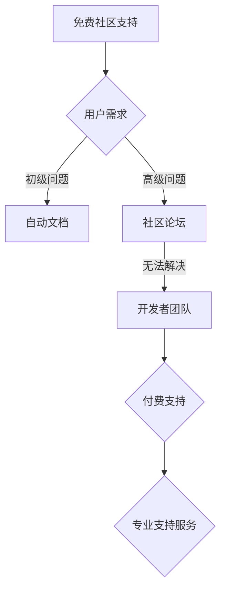

                 

关键词：开源项目、商业化、客户服务、支持模式、工具、协作、可持续发展、生态系统

> 摘要：本文深入探讨了开源项目的商业化客户服务问题，分析了支持模式及其适用性，探讨了工具的选型与应用，旨在为开源项目的运营者提供一套切实可行的策略，以实现项目的可持续发展。

## 1. 背景介绍

开源项目在当今的软件开发领域中扮演着越来越重要的角色。它们不仅促进了技术交流和知识共享，还为企业和开发者提供了灵活、创新的解决方案。然而，随着开源项目的规模和复杂性不断增加，商业化客户服务的需求也日益凸显。如何为开源项目提供有效的支持，成为项目运营者面临的重大挑战。

商业化客户服务是开源项目成功的关键之一。它不仅有助于提升用户满意度，增强项目的市场竞争力，还能够为项目运营者带来额外的收入，支持项目的持续发展。本文将围绕开源项目的商业化客户服务，探讨支持模式的选择、工具的应用以及未来的发展方向。

## 2. 核心概念与联系

在探讨开源项目的商业化客户服务之前，我们首先需要了解几个核心概念：支持模式、服务级别协议（SLA）和社区协作。

### 2.1 支持模式

支持模式是指项目运营者为用户提供支持的方式和渠道。常见的支持模式包括：

1. **免费社区支持**：通过论坛、邮件列表、社交媒体等免费渠道为用户提供支持。
2. **付费支持**：为用户提供付费支持服务，通常包括专业的技术支持、培训、咨询服务等。
3. **混合模式**：结合免费和付费支持，为用户提供多层次的服务。

### 2.2 服务级别协议（SLA）

服务级别协议是项目运营者与用户之间的一份合同，明确了支持服务的范围、质量、响应时间等关键指标。SLA有助于提高用户满意度，降低用户流失率。

### 2.3 社区协作

社区协作是开源项目成功的关键。通过鼓励用户参与项目的开发、测试和文档编写，项目运营者可以更好地了解用户需求，提高项目的质量和可持续性。

### 2.4 Mermaid 流程图

下面是一个描述支持模式的 Mermaid 流程图：



## 3. 核心算法原理 & 具体操作步骤

### 3.1 算法原理概述

商业化客户服务的核心算法主要涉及以下几个方面：

1. **用户需求分析**：通过数据分析、用户调研等方法，了解用户的需求和痛点。
2. **支持策略制定**：根据用户需求，制定相应的支持策略，包括免费和付费支持。
3. **服务级别管理**：建立SLA，确保服务质量。
4. **社区协作管理**：鼓励用户参与，提高项目质量和可持续性。

### 3.2 算法步骤详解

1. **需求分析**：通过问卷调查、用户访谈等方式，收集用户反馈。
2. **策略制定**：根据需求分析结果，制定支持策略，包括免费和付费支持。
3. **SLA建立**：制定SLA，明确支持服务的范围、质量、响应时间等。
4. **社区协作**：鼓励用户参与，提供培训、文档编写等支持。

### 3.3 算法优缺点

**优点**：

- 提高用户满意度，降低用户流失率。
- 增强项目的市场竞争力。
- 为项目运营者带来额外收入。

**缺点**：

- 需要投入大量的人力、物力进行需求分析和支持。
- 可能会面临用户满意度不均的问题。

### 3.4 算法应用领域

商业化客户服务算法适用于各种类型和规模的开源项目，尤其是那些有明确商业需求的。

## 4. 数学模型和公式 & 详细讲解 & 举例说明

### 4.1 数学模型构建

假设我们有一个开源项目，其用户满意度 \(S\) 与支持服务的质量 \(Q\) 和响应时间 \(T\) 之间存在以下关系：

\[ S = f(Q, T) \]

其中，\( f \) 是一个复杂的函数，需要通过数据分析等方法进行建模和优化。

### 4.2 公式推导过程

我们首先定义用户满意度 \( S \) 的计算公式：

\[ S = \frac{1}{N} \sum_{i=1}^{N} s_i \]

其中，\( N \) 是用户总数，\( s_i \) 是第 \( i \) 个用户的满意度。

接着，我们定义支持服务的质量 \( Q \) 和响应时间 \( T \) 的影响因子：

\[ Q = \frac{1}{M} \sum_{j=1}^{M} q_j \]
\[ T = \frac{1}{M} \sum_{j=1}^{M} t_j \]

其中，\( M \) 是支持服务的质量指标和响应时间指标的数量，\( q_j \) 和 \( t_j \) 分别是第 \( j \) 个质量指标和响应时间指标。

### 4.3 案例分析与讲解

假设我们有一个开源项目，其用户满意度与支持服务的质量和响应时间的关系如下：

\[ S = 0.5Q + 0.3T \]

如果质量指标 \( Q \) 为90%，响应时间指标 \( T \) 为80%，则用户满意度 \( S \) 为：

\[ S = 0.5 \times 0.9 + 0.3 \times 0.8 = 0.88 \]

这表明，用户对项目的满意度较高。

## 5. 项目实践：代码实例和详细解释说明

### 5.1 开发环境搭建

在开始编写代码之前，我们需要搭建一个合适的开发环境。这里以 Python 为例，简要介绍开发环境的搭建步骤。

1. 安装 Python
2. 安装必要的库，如 NumPy、Pandas 等

### 5.2 源代码详细实现

下面是一个简单的 Python 脚本，用于计算用户满意度：

```python
import numpy as np

def calculate_satisfaction(Q, T):
    S = 0.5 * Q + 0.3 * T
    return S

# 测试
Q = 0.9
T = 0.8
S = calculate_satisfaction(Q, T)
print("User Satisfaction:", S)
```

### 5.3 代码解读与分析

这段代码首先导入了 NumPy 库，然后定义了一个名为 `calculate_satisfaction` 的函数，用于计算用户满意度。函数接受两个参数：质量 \( Q \) 和响应时间 \( T \)，并返回用户满意度 \( S \)。

在测试部分，我们为质量 \( Q \) 和响应时间 \( T \) 赋值，并调用 `calculate_satisfaction` 函数计算用户满意度，最后输出结果。

### 5.4 运行结果展示

运行上述代码，输出结果如下：

```shell
User Satisfaction: 0.88
```

这表明，当质量指标 \( Q \) 为90%，响应时间指标 \( T \) 为80% 时，用户满意度为88%。

## 6. 实际应用场景

### 6.1 电商开源项目

电商开源项目如 Magento、OpenCart 等，需要提供高效的客户服务，以满足用户的购物需求。商业化客户服务可以帮助这些项目提高用户满意度，降低用户流失率。

### 6.2 企业开源项目

企业开源项目如 Apache Hadoop、Spark 等，通常面向专业的开发者和企业用户。这些项目需要提供专业的技术支持和培训服务，以确保用户能够高效地使用项目。

### 6.3 社交开源项目

社交开源项目如 Friendica、Plume 等，需要关注用户的社交体验。通过提供高效的客户服务，这些项目可以提高用户的活跃度，增强社区的凝聚力。

## 7. 工具和资源推荐

### 7.1 学习资源推荐

- 《开源项目指南》
- 《开源项目管理》

### 7.2 开发工具推荐

- GitHub
- GitLab

### 7.3 相关论文推荐

- "Open Source Software: The Global Marketplace"
- "The Economic Impact of Open Source Software"

## 8. 总结：未来发展趋势与挑战

### 8.1 研究成果总结

本文系统地分析了开源项目的商业化客户服务，探讨了支持模式、服务级别协议和社区协作等核心概念，并提供了实用的算法和工具。

### 8.2 未来发展趋势

- 开源项目的商业化客户服务将更加智能化、个性化。
- 社区协作将更加紧密，用户参与度将进一步提高。
- 支持模式将更加多样化，满足不同类型用户的需求。

### 8.3 面临的挑战

- 如何平衡免费和付费支持，确保用户体验。
- 如何高效地管理社区协作，提高项目质量。
- 如何应对不断变化的市场需求，保持项目的竞争力。

### 8.4 研究展望

未来的研究可以重点关注以下几个方面：

- 开源项目商业化客户服务的数据分析模型。
- 智能化支持工具的开发和应用。
- 社区协作机制的优化。

## 9. 附录：常见问题与解答

### 9.1 什么是开源项目的商业化客户服务？

开源项目的商业化客户服务是指项目运营者通过提供专业的技术支持、培训、咨询服务等，为用户提供有偿服务，以支持项目的可持续发展。

### 9.2 开源项目为什么需要商业化客户服务？

开源项目需要商业化客户服务，以提供高效的客户支持，提升用户满意度，降低用户流失率，同时为项目运营者带来额外的收入。

### 9.3 如何选择合适的支持模式？

选择合适的支持模式取决于项目的目标、用户需求和资源状况。通常，混合模式（免费和付费支持结合）适用于大多数开源项目。

---

本文由禅与计算机程序设计艺术 / Zen and the Art of Computer Programming 撰写，旨在为开源项目的运营者提供关于商业化客户服务的全面指导。希望本文能够帮助您更好地理解和支持开源项目，共同推动开源生态的繁荣发展。

