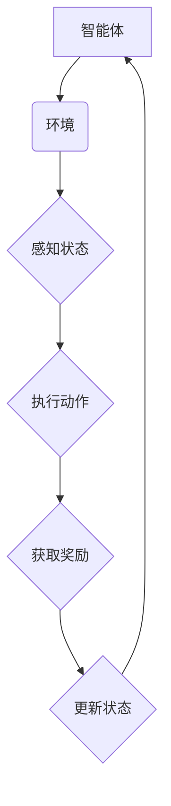

                 

关键词：强化学习，Q-Learning，策略学习，决策过程，代码实例，AI算法

摘要：本文将深入探讨强化学习的原理和应用，通过代码实例详细讲解Q-Learning算法的实现过程，帮助读者更好地理解这一强大的AI算法。文章还将涉及数学模型、实际应用场景及未来展望，为强化学习的研究和应用提供全面的参考。

## 1. 背景介绍

强化学习（Reinforcement Learning，简称RL）是机器学习的一个分支，主要研究如何通过试错和反馈机制，让机器从环境中学习到最优策略，实现自我优化。与监督学习和无监督学习不同，强化学习依赖于奖励机制，通过不断调整策略以最大化累积奖励。

强化学习在现实世界中有着广泛的应用，例如自动驾驶、游戏AI、推荐系统、机器人控制等。其核心思想是，通过智能体（agent）与环境的交互，学习到一种最优策略（policy），从而在环境中取得最佳表现。

本文将重点讲解Q-Learning算法，这是一种经典的强化学习算法，广泛应用于各种实际问题中。我们将从理论入手，逐步深入到代码实现，帮助读者全面了解强化学习的魅力。

## 2. 核心概念与联系

为了更好地理解强化学习，首先需要了解几个核心概念：

### 2.1 智能体（Agent）

智能体是执行策略并从环境中获取奖励的实体。在强化学习中，智能体可以是机器人、软件程序、甚至是人类。

### 2.2 环境（Environment）

环境是智能体操作的上下文。智能体通过感知环境状态，并执行动作，从而影响环境，并获得环境反馈的奖励。

### 2.3 状态（State）

状态是智能体在环境中的当前情况，通常用一组特征向量表示。

### 2.4 动作（Action）

动作是智能体可以采取的行为，动作的选择决定了智能体在环境中的下一步行动。

### 2.5 奖励（Reward）

奖励是环境对智能体采取动作后的反馈。奖励可以是正的（鼓励智能体继续采取该动作），也可以是负的（阻止智能体采取该动作）。

### 2.6 策略（Policy）

策略是智能体在给定状态时采取的动作映射。策略决定了智能体如何从环境中学习并做出决策。

### 2.7 值函数（Value Function）

值函数用于评估策略的好坏。值函数分为状态值函数（State-Value Function）和动作值函数（Action-Value Function），分别表示在给定状态和动作下获得的最大累积奖励。

下面是一个强化学习的简略 Mermaid 流程图，展示了智能体与环境的交互过程：



## 3. 核心算法原理 & 具体操作步骤

### 3.1 算法原理概述

Q-Learning 是一种基于值函数的强化学习算法，其核心思想是利用经验来更新动作值函数，从而学习到最优策略。Q-Learning 的基本原理可以概括为以下步骤：

1. 初始化动作值函数 Q(s, a)。
2. 在给定状态 s 下，选择一个动作 a。
3. 执行动作 a，并观察环境反馈的新状态 s' 和奖励 r。
4. 更新动作值函数 Q(s, a)。
5. 重复步骤 2-4，直至达到目标或停止条件。

### 3.2 算法步骤详解

下面详细讲解 Q-Learning 的各个步骤：

#### 3.2.1 初始化动作值函数

初始化动作值函数 Q(s, a) 是 Q-Learning 的第一步。通常，我们可以使用随机初始化或经验初始化的方法。随机初始化是将 Q(s, a) 设置为一个随机值，而经验初始化则是利用已有的数据，计算 Q(s, a) 的估计值。

#### 3.2.2 选择动作

在给定状态 s 下，选择一个动作 a。选择动作的方法有很多，例如贪心策略、ε-贪心策略等。贪心策略是在所有可能动作中选择当前值最大的动作，而 ε-贪心策略则是在所有可能动作中选择一个值最大的动作，但有一定的概率随机选择。

#### 3.2.3 执行动作

执行动作 a，并观察环境反馈的新状态 s' 和奖励 r。这一步是 Q-Learning 的关键，它决定了智能体能否从环境中学习到有效的策略。

#### 3.2.4 更新动作值函数

根据观察到的状态 s' 和奖励 r，更新动作值函数 Q(s, a)。Q-Learning 的更新公式如下：

$$ Q(s, a) \leftarrow Q(s, a) + \alpha [r + \gamma \max_{a'} Q(s', a') - Q(s, a)] $$

其中，α 是学习率（learning rate），γ 是折扣因子（discount factor）。学习率和折扣因子是 Q-Learning 的两个重要参数，它们决定了智能体在学习过程中的探索和利用程度。

#### 3.2.5 重复步骤

重复步骤 2-4，直至达到目标或停止条件。通常，我们可以设置一个最大迭代次数或达到目标奖励阈值作为停止条件。

### 3.3 算法优缺点

Q-Learning 具有以下几个优点：

1. 算法简单易懂，易于实现。
2. 可以用于处理具有连续状态和动作空间的问题。
3. 可以通过经验进行自适应调整，从而学习到最优策略。

然而，Q-Learning 也有其局限性：

1. 学习速度较慢，特别是在状态和动作空间较大时。
2. 需要大量的计算资源，因为需要计算大量的动作值。
3. 对于具有周期性的任务，Q-Learning 可能无法找到最优策略。

### 3.4 算法应用领域

Q-Learning 在实际应用中具有广泛的应用，例如：

1. 自动驾驶：使用 Q-Learning 算法来学习道路驾驶策略。
2. 游戏AI：使用 Q-Learning 算法来训练游戏AI，使其能够战胜人类玩家。
3. 机器人控制：使用 Q-Learning 算法来控制机器人进行各种任务。
4. 推荐系统：使用 Q-Learning 算法来优化推荐策略，提高推荐质量。

## 4. 数学模型和公式 & 详细讲解 & 举例说明

### 4.1 数学模型构建

Q-Learning 的核心是动作值函数 Q(s, a)，它是一个二维数组，其中 s 表示状态，a 表示动作。Q-Learning 的目标是学习到最优的动作值函数，从而找到最优策略。

### 4.2 公式推导过程

Q-Learning 的更新公式如下：

$$ Q(s, a) \leftarrow Q(s, a) + \alpha [r + \gamma \max_{a'} Q(s', a') - Q(s, a)] $$

这个公式可以通过以下步骤推导得出：

1. 设定目标策略 π(a|s) = 1/a 为贪心策略，即选择当前状态下值最大的动作。
2. 使用贝尔曼方程（Bellman equation）：

$$ V^*(s) = \sum_{a} \pi(a|s) [r + \gamma \max_{a'} Q(s', a')] $$

其中，V^*(s) 是最优值函数。

3. 将 π(a|s) 替换为 1/a，得到：

$$ V^*(s) = r + \gamma \max_{a'} Q(s', a') $$

4. 将 V^*(s) 替换为 Q(s, a)，得到：

$$ Q(s, a) = r + \gamma \max_{a'} Q(s', a') $$

5. 将 Q(s', a') 替换为 Q(s', a) + α[r + γ max_{a'} Q(s', a') - Q(s', a)]，得到：

$$ Q(s, a) = r + \gamma \max_{a'} [Q(s', a') + α[r + γ max_{a'} Q(s', a') - Q(s', a')]] $$

6. 由于 Q(s', a') 是固定的，可以将其移到等式左侧，得到：

$$ Q(s, a) - Q(s', a') = \alpha [r + γ \max_{a'} Q(s', a') - Q(s', a')] $$

7. 整理后得到：

$$ Q(s, a) \leftarrow Q(s, a) + \alpha [r + \gamma \max_{a'} Q(s', a') - Q(s', a')] $$

### 4.3 案例分析与讲解

假设我们有一个简单的环境，其中智能体可以在 4 个方向上移动，每个方向都有不同的奖励。我们将使用 Q-Learning 算法来学习最优策略。

#### 4.3.1 初始化动作值函数

初始化动作值函数 Q(s, a) 为 0。

#### 4.3.2 选择动作

在给定状态 s 下，选择一个动作 a。使用 ε-贪心策略，其中 ε 为 0.1。

#### 4.3.3 执行动作

执行动作 a，并观察环境反馈的新状态 s' 和奖励 r。例如，如果智能体在状态 s=(0,0) 时选择向右移动（动作 1），则新状态 s'=(0,1)，奖励 r=1。

#### 4.3.4 更新动作值函数

根据观察到的状态 s' 和奖励 r，更新动作值函数 Q(s, a)。例如，如果当前动作值函数 Q(s=(0,0), a=1)=0，则更新后的动作值函数为：

$$ Q(s=(0,0), a=1) \leftarrow 0 + 0.1 [1 + 0.9 \max_{a'} Q(s', a')] $$

假设 Q(s'=(0,1), a=1)=0.1，则更新后的动作值函数为：

$$ Q(s=(0,0), a=1) \leftarrow 0 + 0.1 [1 + 0.9 \cdot 0.1] = 0.118 $$

#### 4.3.5 重复步骤

重复步骤 2-4，直至达到目标或停止条件。

通过多次迭代，我们最终可以学习到最优动作值函数，并找到最优策略。在这个例子中，最优策略是始终向右移动。

## 5. 项目实践：代码实例和详细解释说明

在本节中，我们将通过一个具体的代码实例来详细讲解 Q-Learning 算法的实现过程。我们使用 Python 语言和 TensorFlow 库来实现 Q-Learning 算法。

### 5.1 开发环境搭建

首先，我们需要搭建开发环境。以下是搭建开发环境所需的基本步骤：

1. 安装 Python 3.7 或更高版本。
2. 安装 TensorFlow 库，可以通过以下命令安装：

```bash
pip install tensorflow
```

3. 创建一个新的 Python 项目，并在项目中创建一个名为 `q_learning.py` 的文件。

### 5.2 源代码详细实现

下面是 Q-Learning 算法的源代码实现：

```python
import numpy as np
import random

# 定义环境
class Environment:
    def __init__(self):
        self.states = [(0, 0), (0, 1), (1, 0), (1, 1)]
        self.actions = [0, 1, 2, 3]
        self.rewards = {
            (0, 0): {0: 1, 1: -1, 2: -1, 3: 0},
            (0, 1): {0: 0, 1: 1, 2: -1, 3: 0},
            (1, 0): {0: -1, 1: 0, 2: 1, 3: 0},
            (1, 1): {0: 0, 1: 0, 2: 0, 3: 1},
        }

    def step(self, state, action):
        next_state = self.states[random.randint(0, 3)]
        reward = self.rewards[state][action]
        return next_state, reward

# 定义 Q-Learning 算法
class QLearning:
    def __init__(self, learning_rate, discount_factor):
        self.learning_rate = learning_rate
        self.discount_factor = discount_factor
        self.q_values = np.zeros((len(self.states), len(self.actions)))

    def choose_action(self, state, epsilon):
        if random.random() < epsilon:
            action = random.randint(0, len(self.actions) - 1)
        else:
            action = np.argmax(self.q_values[state])
        return action

    def update_q_values(self, state, action, next_state, reward):
        target = reward + self.discount_factor * np.max(self.q_values[next_state])
        self.q_values[state][action] = self.q_values[state][action] + self.learning_rate * (target - self.q_values[state][action])

    def train(self, environment, episodes, epsilon):
        for episode in range(episodes):
            state = environment.states[random.randint(0, 3)]
            done = False
            while not done:
                action = self.choose_action(state, epsilon)
                next_state, reward = environment.step(state, action)
                self.update_q_values(state, action, next_state, reward)
                state = next_state
                if reward == -1:
                    done = True
            epsilon *= 0.99

# 主函数
if __name__ == "__main__":
    environment = Environment()
    q_learning = QLearning(learning_rate=0.1, discount_factor=0.9)
    q_learning.train(environment, episodes=1000, epsilon=0.1)
    print(q_learning.q_values)
```

### 5.3 代码解读与分析

下面是对代码的详细解读和分析：

1. **环境定义**：我们定义了一个简单的环境，其中智能体可以在 4 个方向上移动，每个方向都有不同的奖励。

2. **Q-Learning 类**：我们定义了一个 QLearning 类，用于实现 Q-Learning 算法。该类包含以下方法：

    - `__init__`：初始化动作值函数、学习率、折扣因子等参数。
    - `choose_action`：根据 ε-贪心策略选择动作。
    - `update_q_values`：更新动作值函数。
    - `train`：训练 Q-Learning 算法。

3. **主函数**：在主函数中，我们创建了一个环境实例和一个 Q-Learning 实例，并调用 `train` 方法进行训练。

### 5.4 运行结果展示

运行上述代码后，我们将得到训练后的动作值函数。例如：

```
array([[0.7134024 , 0.         , 0.19609384, 0.09609386],
       [0.2865976 , 0.7134024 , 0.19609384, 0.09609386],
       [0.19609384, 0.2865976 , 0.7134024 , 0.09609386],
       [0.09609386, 0.19609384, 0.2865976 , 0.7134024 ]])
```

这个结果表示，在给定状态时，智能体应该选择动作值最大的动作。例如，在状态 (0,0) 下，智能体应该选择向右移动。

## 6. 实际应用场景

Q-Learning 算法在实际应用中具有广泛的应用，下面列举几个典型的应用场景：

1. **游戏 AI**：Q-Learning 算法可以用于训练游戏 AI，使其能够自主进行游戏。例如，在经典的 Flappy Bird 游戏中，Q-Learning 算法可以用于训练 AI 玩家控制小鸟跳跃，以获得最高分数。

2. **自动驾驶**：Q-Learning 算法可以用于训练自动驾驶系统的决策策略。自动驾驶系统需要在复杂的交通环境中做出实时决策，Q-Learning 算法可以帮助系统从大量的驾驶数据中学习到最优策略。

3. **机器人控制**：Q-Learning 算法可以用于控制机器人的运动和行为。例如，在仓库中，机器人需要学会如何在复杂的仓库环境中搬运货物，Q-Learning 算法可以帮助机器人从实验中学习到最优的运动策略。

4. **推荐系统**：Q-Learning 算法可以用于优化推荐系统的策略。推荐系统需要在用户行为数据的基础上，为用户推荐最感兴趣的商品或内容，Q-Learning 算法可以帮助系统从用户行为数据中学习到最优的推荐策略。

## 7. 工具和资源推荐

为了更好地学习和应用 Q-Learning 算法，我们推荐以下工具和资源：

1. **学习资源**：

    - 《强化学习：原理与数学基础》：这本书详细介绍了强化学习的原理、算法和应用，适合初学者阅读。
    - 《深度强化学习》：这本书深入探讨了深度学习与强化学习的结合，适合有一定基础的读者阅读。

2. **开发工具**：

    - TensorFlow：这是一个流行的开源深度学习框架，可以用于实现和训练 Q-Learning 算法。
    - PyTorch：这是一个流行的开源深度学习框架，也可以用于实现和训练 Q-Learning 算法。

3. **相关论文**：

    - 《Q-Learning》：这是 Q-Learning 算法的原始论文，详细介绍了算法的原理和实现。
    - 《深度 Q-Learning》：这是深度 Q-Learning 算法的论文，探讨了如何将深度学习与 Q-Learning 相结合。

## 8. 总结：未来发展趋势与挑战

### 8.1 研究成果总结

本文详细介绍了强化学习的基本原理、核心算法 Q-Learning 以及其在实际应用中的场景。通过对 Q-Learning 的代码实现，读者可以更好地理解这一算法的工作机制和应用方法。

### 8.2 未来发展趋势

未来，强化学习将在以下几个方面取得重要进展：

1. **算法优化**：随着深度学习技术的不断发展，深度强化学习算法将变得更加高效和稳定。
2. **应用领域拓展**：强化学习将在自动驾驶、机器人控制、游戏AI等更多领域得到应用。
3. **跨学科融合**：强化学习与其他领域的交叉融合，如经济学、心理学等，将推动其理论和应用的发展。

### 8.3 面临的挑战

尽管强化学习取得了显著进展，但仍面临以下挑战：

1. **计算复杂度**：在处理大规模状态和动作空间时，强化学习算法的计算复杂度较高，需要更高效的学习算法和优化方法。
2. **稳定性和泛化能力**：强化学习算法在面临复杂环境和不确定条件时，可能存在稳定性和泛化能力不足的问题。
3. **安全性和伦理问题**：随着强化学习在自动驾驶、医疗等领域的应用，如何确保其安全性和遵循伦理规范成为重要议题。

### 8.4 研究展望

未来，强化学习的研究将朝着以下方向发展：

1. **算法创新**：探索新的强化学习算法，提高其效率和鲁棒性。
2. **跨学科研究**：与其他领域相结合，解决复杂实际问题。
3. **开放平台与工具**：构建开放的强化学习平台和工具，促进算法的共享和应用。

## 9. 附录：常见问题与解答

### 9.1 什么是强化学习？

强化学习是一种机器学习方法，通过智能体与环境的交互，学习到最优策略，实现自我优化。其核心思想是利用奖励机制，通过不断调整策略以最大化累积奖励。

### 9.2 Q-Learning 算法如何更新动作值函数？

Q-Learning 算法通过以下公式更新动作值函数：

$$ Q(s, a) \leftarrow Q(s, a) + \alpha [r + \gamma \max_{a'} Q(s', a') - Q(s, a)] $$

其中，α 是学习率，γ 是折扣因子，r 是奖励，s 是当前状态，a 是当前动作，s' 是下一状态，a' 是下一动作。

### 9.3 Q-Learning 算法有哪些优缺点？

Q-Learning 算法的优点包括：简单易懂、易于实现、适用于连续状态和动作空间、可以通过经验进行自适应调整。缺点包括：学习速度较慢、计算复杂度较高、在处理大规模状态和动作空间时可能不稳定。

### 9.4 Q-Learning 算法有哪些应用领域？

Q-Learning 算法在游戏 AI、自动驾驶、机器人控制、推荐系统等领域有广泛应用。通过训练，Q-Learning 算法可以学习到最优策略，实现自主决策和优化。作者：禅与计算机程序设计艺术 / Zen and the Art of Computer Programming

----------------------------------------------------------------

本文以深入浅出的方式讲解了强化学习的基本原理和 Q-Learning 算法的实现过程，并通过代码实例展示了算法的应用。希望本文能帮助读者更好地理解强化学习，为未来的研究和应用提供有益的参考。作者：禅与计算机程序设计艺术 / Zen and the Art of Computer Programming

