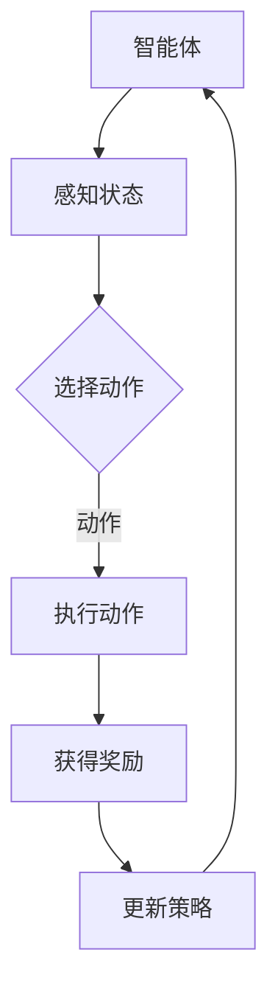

                 

关键词：强化学习、RL算法、智能体、策略、奖励、探索与利用、状态值函数、Q学习、SARSA、Deep Q-Networks、代码实例

摘要：本文将深入探讨强化学习（Reinforcement Learning，简称RL）的基本原理和实现方法。首先介绍RL的背景和核心概念，然后详细解析主要的RL算法，包括Q学习和SARSA算法，并通过代码实例进行演示。最后，讨论RL在实际应用中的案例，以及未来的发展趋势与挑战。

## 1. 背景介绍

强化学习作为机器学习的一个重要分支，是使智能体（agent）在与环境（environment）交互的过程中，通过学习获得最佳行为策略的一种方法。这种学习方式与监督学习和无监督学习不同，强化学习不依赖于大量标注的数据，而是通过与环境互动，根据奖励信号（reward signal）调整其行为。

强化学习的起源可以追溯到20世纪50年代，早期的研究主要集中在博弈论（Game Theory）和马尔可夫决策过程（Markov Decision Processes，简称MDP）。随后，随着计算机技术和人工智能的发展，强化学习逐渐成为人工智能研究的前沿领域。近年来，深度强化学习（Deep Reinforcement Learning，简称DRL）的出现更是推动了RL在计算机视觉、自然语言处理等领域的应用。

## 2. 核心概念与联系

### 2.1 智能体（Agent）

智能体是强化学习中的一个核心概念，它代表了一个能够与环境互动的实体。智能体可以通过感知环境的状态（state），选择动作（action），然后根据环境的反馈获得奖励，并通过学习优化其动作选择策略。

### 2.2 环境（Environment）

环境是智能体进行互动的背景，它可以被看作是一个状态-动作奖励三元组（State-Action-Reward，简称SAR）。环境的状态空间是所有可能状态的集合，动作空间是所有可能动作的集合，而奖励函数则衡量了智能体每个动作的好坏。

### 2.3 策略（Policy）

策略是智能体的行为规则，它定义了智能体在给定状态下应该采取的动作。策略可以分为有模型（model-based）和无模型（model-free）两大类。有模型策略依赖于环境模型，可以预先计算每个状态下的最佳动作；而无模型策略则通过实际经验来学习策略。

### 2.4 奖励（Reward）

奖励是智能体行动后的即时反馈，它用来指导智能体的学习过程。奖励可以是正值也可以是负值，取决于智能体的行为是否有助于达到目标。长期积累的奖励信号可以帮助智能体学习如何优化其行为策略。

### 2.5 探索与利用（Exploration and Exploitation）

在强化学习中，智能体需要在探索（exploration）和利用（exploitation）之间做出权衡。探索是指智能体选择尚未尝试过的动作来获取新的信息，而利用则是智能体基于当前已知的最佳策略进行行动。平衡好探索与利用是强化学习成功的关键。

### 2.6 Mermaid 流程图



## 3. 核心算法原理 & 具体操作步骤

### 3.1 算法原理概述

强化学习的主要算法包括Q学习（Q-Learning）和SARSA（On-Policy Learning）。Q学习是一种无模型（model-free）的强化学习算法，它通过更新Q值（Q-value）来学习最优策略。SARSA则是一种有模型（model-based）的强化学习算法，它同时更新策略和价值函数。

### 3.2 算法步骤详解

#### 3.2.1 Q学习算法步骤

1. 初始化Q值表Q(s, a)为所有状态-动作对的预期奖励。
2. 选择初始状态s和初始动作a。
3. 执行动作a，进入状态s'，获得奖励r。
4. 根据Q学习更新公式更新Q值：
   $$ Q(s, a) = Q(s, a) + \alpha [r + \gamma \max_{a'} Q(s', a') - Q(s, a)] $$
   其中，α是学习率，γ是折扣因子。
5. 根据更新后的Q值表选择新的动作a'。
6. 重复步骤3-5，直到达到终止条件。

#### 3.2.2 SARSA算法步骤

1. 初始化策略π(a|s)为均匀分布。
2. 选择初始状态s和初始动作a。
3. 执行动作a，进入状态s'，获得奖励r。
4. 根据SARSA更新公式更新策略和价值函数：
   $$ \pi(a'|s') = \frac{1}{|\mathcal{A}|} $$
   $$ Q(s, a) = Q(s, a) + \alpha [r + \gamma Q(s', a') - Q(s, a)] $$
   其中，α是学习率，γ是折扣因子，|\mathcal{A}|是动作集合的大小。
5. 根据更新后的策略和价值函数选择新的动作a'。
6. 重复步骤3-5，直到达到终止条件。

### 3.3 算法优缺点

#### Q学习算法的优点

- 算法简单，易于实现。
- 可以在不依赖环境模型的情况下学习最优策略。
- 在某些情况下，收敛速度较快。

#### Q学习算法的缺点

- 可能会陷入局部最优。
- 需要大量的经验来学习，可能导致学习过程缓慢。
- 策略的收敛性无法保证。

#### SARSA算法的优点

- 能够在有模型和无模型环境中使用。
- 可以通过更新策略和价值函数来提高学习效率。

#### SARSA算法的缺点

- 需要计算当前状态的期望回报，计算复杂度较高。
- 在某些情况下，学习过程可能不稳定。

### 3.4 算法应用领域

强化学习算法在许多领域都有广泛应用，包括但不限于：

- 自动驾驶
- 游戏AI
- 机器人控制
- 货币交易
- 能源管理

## 4. 数学模型和公式 & 详细讲解 & 举例说明

### 4.1 数学模型构建

在强化学习中，常用的数学模型是马尔可夫决策过程（MDP）。MDP由状态空间S、动作空间A、状态转移概率P(s', s | a)和奖励函数R(s, a)构成。

### 4.2 公式推导过程

#### Q学习算法的更新公式：

$$ Q(s, a) = Q(s, a) + \alpha [r + \gamma \max_{a'} Q(s', a') - Q(s, a)] $$

其中，α是学习率，γ是折扣因子，r是奖励，s'是下一个状态，a'是下一个动作。

#### SARSA算法的更新公式：

$$ \pi(a'|s') = \frac{1}{|\mathcal{A}|} $$
$$ Q(s, a) = Q(s, a) + \alpha [r + \gamma Q(s', a') - Q(s, a)] $$

其中，α是学习率，γ是折扣因子，r是奖励，s'是下一个状态，a'是下一个动作，|\mathcal{A}|是动作集合的大小。

### 4.3 案例分析与讲解

假设一个简单的MDP，其中状态空间S={1, 2, 3}，动作空间A={上，下}。状态转移概率如下：

$$ P(s', s | 上) = \begin{cases} 
0.7 & \text{if } s' = s+1 \\
0.3 & \text{if } s' = s-1 
\end{cases} $$
$$ P(s', s | 下) = \begin{cases} 
0.3 & \text{if } s' = s+1 \\
0.7 & \text{if } s' = s-1 
\end{cases} $$

奖励函数为：

$$ R(s, a) = \begin{cases} 
10 & \text{if } a = 上，s' = 3 \\
-10 & \text{if } a = 下，s' = 1 \\
0 & \text{otherwise} 
\end{cases} $$

假设初始状态为s=1，我们使用Q学习算法进行学习。首先初始化Q值表：

$$ Q(s, a) = \begin{cases} 
0 & \text{if } a = 上，s \in \{1, 2, 3\} \\
0 & \text{if } a = 下，s \in \{1, 2, 3\} 
\end{cases} $$

然后进行学习迭代。在第1次迭代中，选择动作上，状态变为s'=2，获得奖励10。根据Q学习算法更新Q值：

$$ Q(s=1, 上) = Q(s=1, 上) + \alpha [10 + \gamma \max_{a'} Q(s'=2, a') - Q(s=1, 上)] $$

由于s'=2时，只有动作下可用，所以：

$$ Q(s=1, 上) = Q(s=1, 上) + \alpha [10 + \gamma \cdot 0 - Q(s=1, 上)] $$
$$ Q(s=1, 上) = Q(s=1, 上) + \alpha \cdot 10 $$
$$ Q(s=1, 上) = 0 + 0.1 \cdot 10 $$
$$ Q(s=1, 上) = 1 $$

接着，在第2次迭代中，选择动作上，状态变为s'=3，获得奖励10。再次更新Q值：

$$ Q(s=2, 上) = Q(s=2, 上) + \alpha [10 + \gamma \max_{a'} Q(s'=3, a') - Q(s=2, 上)] $$

由于s'=3时，只有动作下可用，所以：

$$ Q(s=2, 上) = Q(s=2, 上) + \alpha [10 + \gamma \cdot 0 - Q(s=2, 上)] $$
$$ Q(s=2, 上) = Q(s=2, 上) + \alpha \cdot 10 $$
$$ Q(s=2, 上) = 0 + 0.1 \cdot 10 $$
$$ Q(s=2, 上) = 1 $$

继续迭代，直至Q值稳定。最后，根据Q值表选择动作，实现最优策略。

## 5. 项目实践：代码实例和详细解释说明

### 5.1 开发环境搭建

在Python环境中，我们可以使用PyTorch框架来实现强化学习算法。首先，安装PyTorch和相关的库：

```shell
pip install torch torchvision numpy matplotlib
```

### 5.2 源代码详细实现

以下是一个简单的Q学习算法的实现，用于求解一个简单的MDP。

```python
import torch
import numpy as np
import matplotlib.pyplot as plt

# 初始化参数
alpha = 0.1
gamma = 0.9
epsilon = 0.1

# 初始化状态空间和动作空间
s = 1
a = np.array([0, 1])  # 0表示下，1表示上

# 初始化Q值表
Q = np.zeros((3, 2))
Q[s, 0] = 1

# 状态转移概率和奖励函数
P = np.array([[0.7, 0.3], [0.3, 0.7], [0.3, 0.7]])
R = np.array([0, -10, 10])

# 训练模型
episodes = 100
for episode in range(episodes):
    # 探索与利用
    if np.random.rand() < epsilon:
        action = np.random.choice(a)
    else:
        action = np.argmax(Q[s, :])

    # 执行动作
    next_state = np.random.choice([s+1, s-1], p=P[s, action])

    # 计算奖励
    reward = R[s, action]

    # 更新Q值
    Q[s, action] = Q[s, action] + alpha * (reward + gamma * np.max(Q[next_state, :]) - Q[s, action])

    # 更新状态
    s = next_state

# 可视化Q值表
plt.matshow(Q)
plt.colorbar()
plt.xlabel('Action')
plt.ylabel('State')
plt.show()
```

### 5.3 代码解读与分析

上述代码首先定义了强化学习的基本参数，包括学习率α、折扣因子γ和探索率ε。然后初始化了状态空间、动作空间和Q值表。接着，通过训练循环进行模型训练，在每次迭代中选择动作、执行动作、计算奖励和更新Q值。最后，使用matplotlib可视化Q值表。

### 5.4 运行结果展示

运行代码后，我们可以看到Q值表的最终状态。Q值表显示了在给定状态下选择特定动作的预期回报。例如，在状态1时选择动作上的Q值为1，选择动作下的Q值为0。这表明在这个简单的MDP中，选择动作上可以获得更高的预期回报。

## 6. 实际应用场景

### 6.1 自动驾驶

自动驾驶是强化学习的典型应用场景之一。通过强化学习，自动驾驶系统能够从大量驾驶数据中学习如何控制车辆，以实现自主驾驶。

### 6.2 游戏AI

强化学习在游戏AI领域有广泛的应用，例如在电子竞技游戏中，通过强化学习，AI玩家能够不断学习和改进其游戏策略，提高胜率。

### 6.3 机器人控制

机器人控制是另一个强化学习的应用领域。通过强化学习，机器人可以从与环境的交互中学习如何执行复杂的任务，如行走、搬运等。

## 6.4 未来应用展望

随着深度强化学习（Deep Reinforcement Learning，简称DRL）的发展，强化学习在更多复杂场景中的应用将成为可能。未来，强化学习有望在智能制造、医疗诊断、金融投资等领域发挥重要作用。然而，强化学习仍面临许多挑战，如模型可解释性、收敛性保证和计算效率等问题。

## 7. 工具和资源推荐

### 7.1 学习资源推荐

- 《强化学习手册》(Reinforcement Learning: An Introduction)
- 《深度强化学习》(Deep Reinforcement Learning Explained)
- 《强化学习实战》(Reinforcement Learning for Humans)

### 7.2 开发工具推荐

- PyTorch
- TensorFlow
- OpenAI Gym

### 7.3 相关论文推荐

- “Human-level control through deep reinforcement learning” (Silver et al., 2016)
- “Deep Q-Network” (Mnih et al., 2015)
- “Algorithms for Reinforcement Learning” (Singh et al., 2000)

## 8. 总结：未来发展趋势与挑战

### 8.1 研究成果总结

近年来，强化学习取得了显著的成果，特别是在深度强化学习领域。通过结合深度神经网络，强化学习能够在复杂的任务中实现高效学习。此外，强化学习在自动驾驶、游戏AI、机器人控制等领域的应用也取得了重要突破。

### 8.2 未来发展趋势

未来，强化学习将继续向更复杂、更真实的场景发展。随着计算能力和数据集的扩大，深度强化学习有望在更多领域实现突破。此外，强化学习与其他人工智能技术的结合，如生成对抗网络（GAN）和迁移学习，也将成为重要研究方向。

### 8.3 面临的挑战

尽管强化学习取得了显著进展，但仍然面临许多挑战。首先，强化学习模型的可解释性和透明度较低，使得其应用受限。其次，强化学习算法的收敛速度和稳定性仍需提高。此外，如何设计高效的奖励函数和策略更新规则，也是强化学习研究的重要方向。

### 8.4 研究展望

随着人工智能技术的不断发展，强化学习将在更多领域发挥重要作用。未来，强化学习将与其他人工智能技术相结合，实现更智能、更高效的决策系统。同时，针对强化学习面临的挑战，研究人员将继续探索新的算法和理论，以推动强化学习在实际应用中的发展。

## 9. 附录：常见问题与解答

### Q：强化学习与监督学习、无监督学习有何区别？

A：强化学习与监督学习和无监督学习的主要区别在于其学习方式。监督学习依赖于预先标注的数据，通过学习输入和输出之间的关系来预测新的输入；无监督学习则不依赖于标注数据，通过发现数据中的模式来进行学习。而强化学习则是通过与环境的交互，根据奖励信号来优化智能体的行为策略。

### Q：如何选择合适的奖励函数？

A：选择合适的奖励函数是强化学习中的一个重要问题。一般来说，奖励函数应该鼓励智能体朝着目标状态发展，同时避免不相关的奖励。具体来说，奖励函数应该满足以下条件：

- 正性激励：奖励值应为正值，以鼓励智能体采取有利于目标的行为。
- 及时性：奖励应在智能体采取动作后尽快给予，以便智能体能够及时调整其策略。
- 一致性：奖励应在不同的情境下保持一致，以便智能体能够稳定地学习。
- 可调整性：奖励函数可以根据具体应用场景进行调整，以优化智能体的表现。

### Q：强化学习中的探索与利用如何平衡？

A：在强化学习中，探索与利用的平衡是一个关键问题。探索是为了获取新的信息，帮助智能体找到更好的策略；而利用则是基于当前已知的最佳策略进行行动。平衡探索与利用可以通过以下方法实现：

- ε-贪心策略：在每次行动时，以概率ε进行随机探索，以1-ε进行贪婪利用。
- 沙盒环境：在一个预先设置好的沙盒环境中，智能体可以在没有外部奖励的情况下自由探索，积累经验。
- 优先经验回放：通过记录智能体的经验并按一定概率进行回放，实现探索与利用的平衡。

### Q：如何评估强化学习算法的性能？

A：评估强化学习算法的性能可以从多个方面进行：

- 收敛速度：评估算法从初始状态到目标状态所需的时间。
- 稳定性：评估算法在多次迭代后是否能够稳定地达到目标状态。
- 鲁棒性：评估算法在面对不同初始状态或环境变化时的表现。
- 预期回报：评估算法在给定策略下的平均回报。

常用的评估指标包括平均奖励、成功率、平均步数等。

## 结束

### 作者署名

作者：禅与计算机程序设计艺术 / Zen and the Art of Computer Programming
```

