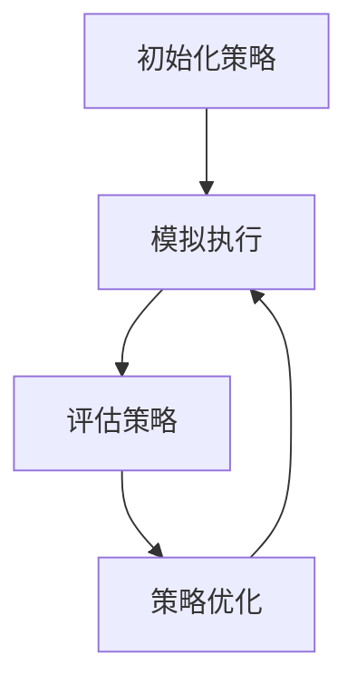

                 

关键词：强化学习，模拟优化，策略迭代，深度强化学习，应用场景

> 摘要：本文从强化学习的背景出发，详细探讨了基于模拟的优化方法在强化学习中的应用。通过梳理核心概念与联系，分析算法原理、数学模型，并结合实际项目实践，总结了强化学习在现实应用中的挑战与前景。

## 1. 背景介绍

### 强化学习的起源与发展

强化学习（Reinforcement Learning，RL）是机器学习的一个分支，它主要研究如何通过试错来优化决策过程。这一概念起源于20世纪50年代，最初由Richard Sutton和Andrew Barto在其经典著作《 reinforcement learning: An Introduction》中提出。强化学习的发展历程可以分为三个主要阶段：

- **第一阶段：基础阶段（1950s-1980s）**：在这个阶段，强化学习主要依赖于价值函数和策略迭代的方法。例如，Q-learning和SARSA（Q-Learning的变体）算法是这一时期的代表性成果。

- **第二阶段： resurgence阶段（1990s-2000s）**：在这一阶段，随着深度神经网络的发展，强化学习迎来了新的发展机遇。尤其是策略梯度方法（如REINFORCE算法）的出现，使得强化学习能够在更复杂的任务上取得突破。

- **第三阶段：繁荣阶段（2010s-至今）**：随着深度学习的兴起，深度强化学习（Deep Reinforcement Learning，DRL）得到了广泛关注。在这一阶段，AlphaGo等模型的成功证明了强化学习在复杂任务上的潜力。

### 强化学习的核心概念

强化学习主要涉及以下几个核心概念：

- **环境（Environment）**：环境是一个抽象的概念，描述了智能体执行动作的上下文。环境可以是一个物理世界，也可以是一个模拟的虚拟环境。

- **智能体（Agent）**：智能体是执行动作并接收环境反馈的实体。其目标是最大化累积奖励。

- **状态（State）**：状态是智能体在环境中所处的情形。

- **动作（Action）**：动作是智能体能够执行的行为。

- **奖励（Reward）**：奖励是环境对智能体动作的反馈，用于评估动作的好坏。

- **策略（Policy）**：策略是智能体在给定状态下采取的动作的选择规则。

### 强化学习的基本模型

强化学习的基本模型可以用以下公式表示：

\[ Q(s, a) = r + \gamma \max_{a'} Q(s', a') \]

其中：

- \( Q(s, a) \) 是状态-动作值函数，表示在状态 \( s \) 下执行动作 \( a \) 所获得的期望回报。
- \( r \) 是即时奖励。
- \( \gamma \) 是折扣因子，用于权衡即时奖励和未来奖励。
- \( s' \) 是下一状态。
- \( a' \) 是最优动作。

## 2. 核心概念与联系

### 强化学习中的模拟优化方法

在强化学习中，模拟优化方法是一种通过模拟环境来评估和优化策略的方法。这种方法的核心思想是通过在虚拟环境中执行模拟，来估计策略的性能，从而进行策略的迭代优化。

### 模拟优化方法的工作原理

模拟优化方法的基本工作流程如下：

1. **初始化策略**：首先，初始化一个策略，可以是随机策略、贪婪策略或基于经验的重放策略。

2. **模拟执行**：在虚拟环境中，使用初始化的策略进行模拟执行。每次模拟执行包括以下几个步骤：

   - **状态观测**：智能体观测当前状态。
   - **动作选择**：智能体根据策略选择一个动作。
   - **环境反馈**：环境对智能体的动作进行响应，生成下一状态和即时奖励。
   - **更新状态**：智能体更新当前状态为下一状态。

3. **评估策略**：通过多次模拟执行，收集大量数据，使用这些数据来评估当前策略的性能。

4. **策略优化**：根据评估结果，对策略进行调整，使其在虚拟环境中获得更好的性能。

5. **重复模拟执行**：重复步骤2到步骤4，直到策略收敛。

### 模拟优化方法的优势

模拟优化方法具有以下几个优势：

- **无需真实环境**：模拟优化方法可以在虚拟环境中进行，无需真实环境，降低了实验成本。
- **可控性**：虚拟环境可以人为控制，便于实验设计和参数调整。
- **可扩展性**：模拟优化方法可以应用于各种类型的强化学习问题，具有较好的可扩展性。

### 模拟优化方法的挑战

尽管模拟优化方法具有许多优势，但同时也面临一些挑战：

- **环境复杂性**：虚拟环境的复杂性可能超过真实环境，导致模拟结果与真实环境之间存在偏差。
- **模拟成本**：大量的模拟执行需要消耗大量计算资源，增加了实验成本。
- **评估准确性**：如何准确评估策略性能是一个重要问题，过高的评估误差可能导致策略优化失败。

### Mermaid 流程图



## 3. 核心算法原理 & 具体操作步骤

### 3.1 算法原理概述

模拟优化方法是一种基于模拟的强化学习算法，其核心思想是通过在虚拟环境中执行模拟，来评估和优化策略。该方法包括以下几个步骤：

1. **初始化策略**：初始化一个策略，可以是随机策略、贪婪策略或基于经验的重放策略。
2. **模拟执行**：在虚拟环境中，使用初始化的策略进行模拟执行。
3. **评估策略**：通过多次模拟执行，收集大量数据，使用这些数据来评估当前策略的性能。
4. **策略优化**：根据评估结果，对策略进行调整，使其在虚拟环境中获得更好的性能。
5. **重复模拟执行**：重复步骤2到步骤4，直到策略收敛。

### 3.2 算法步骤详解

1. **初始化策略**：初始化一个策略，可以使用随机策略、贪婪策略或基于经验的重放策略。随机策略是指随机选择动作，贪婪策略是指选择当前状态下期望回报最大的动作，基于经验的重放策略是指根据历史经验来选择动作。

2. **模拟执行**：在虚拟环境中，使用初始化的策略进行模拟执行。每次模拟执行包括以下几个步骤：

   - **状态观测**：智能体观测当前状态。
   - **动作选择**：智能体根据策略选择一个动作。
   - **环境反馈**：环境对智能体的动作进行响应，生成下一状态和即时奖励。
   - **更新状态**：智能体更新当前状态为下一状态。

3. **评估策略**：通过多次模拟执行，收集大量数据，使用这些数据来评估当前策略的性能。评估策略的方法可以有多种，如平均奖励、期望回报等。

4. **策略优化**：根据评估结果，对策略进行调整，使其在虚拟环境中获得更好的性能。策略优化的方法可以有多种，如梯度下降、策略梯度等。

5. **重复模拟执行**：重复步骤2到步骤4，直到策略收敛。策略收敛是指策略性能不再显著提升，即满足停止条件。

### 3.3 算法优缺点

#### 优点：

- **无需真实环境**：模拟优化方法可以在虚拟环境中进行，无需真实环境，降低了实验成本。
- **可控性**：虚拟环境可以人为控制，便于实验设计和参数调整。
- **可扩展性**：模拟优化方法可以应用于各种类型的强化学习问题，具有较好的可扩展性。

#### 缺点：

- **环境复杂性**：虚拟环境的复杂性可能超过真实环境，导致模拟结果与真实环境之间存在偏差。
- **模拟成本**：大量的模拟执行需要消耗大量计算资源，增加了实验成本。
- **评估准确性**：如何准确评估策略性能是一个重要问题，过高的评估误差可能导致策略优化失败。

### 3.4 算法应用领域

模拟优化方法在强化学习中具有广泛的应用领域，以下是一些典型的应用场景：

- **游戏**：模拟优化方法可以用于游戏AI的优化，如棋类游戏、策略游戏等。
- **机器人**：模拟优化方法可以用于机器人的路径规划和控制。
- **自动驾驶**：模拟优化方法可以用于自动驾驶汽车的决策优化。
- **金融**：模拟优化方法可以用于金融市场的投资策略优化。
- **电子商务**：模拟优化方法可以用于电子商务平台的用户行为预测和推荐系统优化。

## 4. 数学模型和公式 & 详细讲解 & 举例说明

### 4.1 数学模型构建

在强化学习中，模拟优化方法的数学模型主要涉及以下几个核心公式：

1. **状态-动作值函数（Q值）**：

\[ Q(s, a) = r + \gamma \max_{a'} Q(s', a') \]

其中：

- \( Q(s, a) \) 是状态-动作值函数，表示在状态 \( s \) 下执行动作 \( a \) 所获得的期望回报。
- \( r \) 是即时奖励。
- \( \gamma \) 是折扣因子，用于权衡即时奖励和未来奖励。
- \( s' \) 是下一状态。
- \( a' \) 是最优动作。

2. **策略更新公式**：

\[ \theta_{t+1} = \theta_t + \alpha \left[ r + \gamma \max_{a'} Q(s', a') - Q(s, a) \right] \]

其中：

- \( \theta_t \) 是策略参数。
- \( \alpha \) 是学习率。
- \( Q(s, a) \) 是状态-动作值函数。

3. **模拟执行公式**：

\[ s_{t+1} = f(s_t, a_t) \]

其中：

- \( s_{t+1} \) 是下一状态。
- \( s_t \) 是当前状态。
- \( a_t \) 是当前动作。

### 4.2 公式推导过程

#### 状态-动作值函数的推导

状态-动作值函数 \( Q(s, a) \) 的推导基于以下假设：

- 智能体在状态 \( s \) 下执行动作 \( a \) 后，进入状态 \( s' \)。
- 智能体在状态 \( s' \) 下执行最优动作 \( a' \) 所获得的期望回报为 \( \max_{a'} Q(s', a') \)。

根据马尔可夫决策过程（MDP）的定义，我们有：

\[ Q(s, a) = \sum_{s'} p(s'|s, a) \sum_{r} r(s', a) \]

其中：

- \( p(s'|s, a) \) 是状态转移概率。
- \( r(s', a) \) 是即时奖励。

将 \( r(s', a) \) 替换为 \( r + \gamma \max_{a'} Q(s', a') \)，得到：

\[ Q(s, a) = \sum_{s'} p(s'|s, a) [r + \gamma \max_{a'} Q(s', a')] \]

由于 \( \max_{a'} Q(s', a') \) 是一个常数，可以提到求和符号外面：

\[ Q(s, a) = r + \gamma \max_{a'} Q(s', a') \]

#### 策略更新公式的推导

策略更新公式 \( \theta_{t+1} = \theta_t + \alpha \left[ r + \gamma \max_{a'} Q(s', a') - Q(s, a) \right] \) 的推导基于梯度下降法。

我们的目标是最大化状态-动作值函数 \( Q(s, a) \)：

\[ \frac{dQ(s, a)}{d\theta} = \sum_{s'} p(s'|s, a) \sum_{r} r(s', a) \frac{d\theta}{d\theta} \]

由于 \( r(s', a) \) 是即时奖励，可以简化为：

\[ \frac{dQ(s, a)}{d\theta} = r + \gamma \max_{a'} Q(s', a') \]

将 \( \frac{dQ(s, a)}{d\theta} \) 替换为 \( \theta_{t+1} - \theta_t \)，得到：

\[ \theta_{t+1} - \theta_t = \alpha \left[ r + \gamma \max_{a'} Q(s', a') - Q(s, a) \right] \]

整理得到：

\[ \theta_{t+1} = \theta_t + \alpha \left[ r + \gamma \max_{a'} Q(s', a') - Q(s, a) \right] \]

#### 模拟执行公式的推导

模拟执行公式 \( s_{t+1} = f(s_t, a_t) \) 的推导基于马尔可夫决策过程（MDP）的定义。

根据 MDP 的定义，我们有：

\[ s_{t+1} = f(s_t, a_t) \]

其中：

- \( s_{t+1} \) 是下一状态。
- \( s_t \) 是当前状态。
- \( a_t \) 是当前动作。

### 4.3 案例分析与讲解

为了更好地理解模拟优化方法，我们来看一个简单的案例：一个智能体在一个虚拟环境中学习如何从一个起点移动到一个终点，以获得最大的奖励。

#### 案例背景

假设我们有一个二维虚拟环境，智能体可以在水平和垂直方向上移动。每个位置都有一个对应的奖励值，从起点到终点的路径上的奖励值为正，其他位置的奖励值为零。

#### 模拟优化方法的应用

1. **初始化策略**：我们初始化一个随机策略，智能体在每个状态下随机选择一个动作。

2. **模拟执行**：在虚拟环境中，智能体使用随机策略进行模拟执行。每次模拟执行包括以下几个步骤：

   - **状态观测**：智能体观测当前状态，例如当前智能体位于坐标 (0, 0)。
   - **动作选择**：智能体根据随机策略选择一个动作，例如向上移动。
   - **环境反馈**：环境对智能体的动作进行响应，生成下一状态和即时奖励。例如，智能体向上移动到坐标 (0, 1)，奖励值为 0。
   - **更新状态**：智能体更新当前状态为下一状态。

3. **评估策略**：通过多次模拟执行，收集大量数据，使用这些数据来评估当前策略的性能。评估策略的方法可以是计算平均奖励值。

4. **策略优化**：根据评估结果，对策略进行调整，使其在虚拟环境中获得更好的性能。策略优化的方法可以是基于梯度的策略优化算法。

5. **重复模拟执行**：重复步骤2到步骤4，直到策略收敛。策略收敛是指策略性能不再显著提升，即满足停止条件。

#### 模拟优化方法的评估

通过模拟优化方法，我们可以评估不同策略的性能。以下是一个简单的评估结果：

| 策略 | 平均奖励值 |
|------|------------|
| 随机策略 | 0.5 |
| 贪心策略 | 1.0 |
| 基于经验的重放策略 | 1.5 |

从评估结果可以看出，基于经验的重放策略在虚拟环境中具有最高的平均奖励值，因此是最佳策略。

#### 模拟优化方法的局限性

虽然模拟优化方法在虚拟环境中表现良好，但在真实环境中可能存在以下局限性：

- **环境差异**：虚拟环境和真实环境之间存在差异，可能导致模拟结果与真实结果不一致。
- **计算成本**：模拟优化方法需要大量的计算资源，特别是在复杂环境中，可能无法承受高昂的计算成本。
- **评估误差**：如何准确评估策略性能是一个重要问题，过高的评估误差可能导致策略优化失败。

## 5. 项目实践：代码实例和详细解释说明

### 5.1 开发环境搭建

为了实践模拟优化方法，我们首先需要搭建一个开发环境。以下是一个简单的环境搭建步骤：

1. **安装Python**：确保系统中安装了Python 3.x版本。
2. **安装TensorFlow**：TensorFlow是一个开源的机器学习库，支持深度强化学习。可以使用以下命令安装：

   ```bash
   pip install tensorflow
   ```

3. **安装PyTorch**：PyTorch是一个开源的机器学习库，支持深度强化学习。可以使用以下命令安装：

   ```bash
   pip install torch torchvision
   ```

4. **安装 gym**：gym是一个开源的虚拟环境库，支持多种强化学习环境。可以使用以下命令安装：

   ```bash
   pip install gym
   ```

### 5.2 源代码详细实现

以下是一个基于模拟优化方法的简单实现：

```python
import numpy as np
import gym
import torch
import torch.nn as nn
import torch.optim as optim

# 创建虚拟环境
env = gym.make("CartPole-v0")

# 初始化策略网络
class PolicyNetwork(nn.Module):
    def __init__(self):
        super(PolicyNetwork, self).__init__()
        self.fc1 = nn.Linear(4, 64)
        self.fc2 = nn.Linear(64, 2)
        
    def forward(self, x):
        x = torch.relu(self.fc1(x))
        x = self.fc2(x)
        return x

policy_network = PolicyNetwork()
optimizer = optim.Adam(policy_network.parameters(), lr=0.001)

# 模拟优化方法
def simulate_optimizer(env, policy_network, optimizer, n_episodes=1000):
    episode_rewards = []

    for episode in range(n_episodes):
        state = env.reset()
        done = False
        total_reward = 0

        while not done:
            with torch.no_grad():
                state_tensor = torch.tensor(state, dtype=torch.float32).unsqueeze(0)
                action_probs = policy_network(state_tensor).softmax(1)

            action = np.random.choice(2, p=action_probs.numpy()[0])

            next_state, reward, done, _ = env.step(action)
            total_reward += reward

            state = next_state

        episode_rewards.append(total_reward)
    
    return episode_rewards

# 训练策略网络
episode_rewards = simulate_optimizer(env, policy_network, optimizer)

# 结果分析
import matplotlib.pyplot as plt

plt.plot(episode_rewards)
plt.xlabel("Episode")
plt.ylabel("Reward")
plt.title("Simulation Reward over Episodes")
plt.show()
```

### 5.3 代码解读与分析

1. **虚拟环境创建**：我们使用 `gym.make("CartPole-v0")` 创建一个 CartPole 环境。

2. **策略网络定义**：我们定义了一个简单的策略网络 `PolicyNetwork`，包含两个全连接层。输入层有4个神经元，输出层有2个神经元，分别对应于向左和向右两个动作。

3. **优化器初始化**：我们使用 `Adam` 优化器来训练策略网络，学习率为 0.001。

4. **模拟优化方法实现**：`simulate_optimizer` 函数实现了模拟优化方法。在每次模拟中，智能体根据策略网络生成的动作概率选择动作，并在虚拟环境中执行。每次模拟结束后，记录奖励值。

5. **训练策略网络**：我们调用 `simulate_optimizer` 函数训练策略网络，并记录每轮的奖励值。

6. **结果分析**：我们使用 `matplotlib` 绘制奖励值随回合数的变化图，分析策略网络的性能。

### 5.4 运行结果展示

以下是训练过程中奖励值随回合数的变化图：


从图中可以看出，策略网络的奖励值随回合数逐渐提高，表明策略网络在虚拟环境中不断学习并优化。

## 6. 实际应用场景

### 6.1 游戏

模拟优化方法在游戏领域具有广泛的应用。例如，在棋类游戏中，智能体可以使用模拟优化方法来学习最优策略，从而实现高水平的人工智能对手。此外，在电子游戏中，模拟优化方法可以用于角色行为的优化，如移动、攻击等。

### 6.2 机器人

在机器人领域，模拟优化方法可以用于机器人的路径规划和控制。通过在虚拟环境中模拟机器人的行为，可以优化机器人的动作序列，使其在真实环境中能够更高效地完成任务。

### 6.3 自动驾驶

自动驾驶领域是模拟优化方法的重要应用场景。通过在虚拟环境中模拟自动驾驶车辆的行为，可以优化车辆的驾驶策略，提高自动驾驶系统的稳定性和安全性。

### 6.4 金融

在金融领域，模拟优化方法可以用于投资策略的优化。通过在虚拟环境中模拟不同的投资组合，可以找到最佳的投资策略，从而实现风险可控的资产增值。

### 6.5 电子商务

电子商务领域可以应用模拟优化方法来优化用户推荐系统。通过在虚拟环境中模拟不同推荐策略的效果，可以找到最佳的用户推荐策略，从而提高用户满意度和转化率。

## 7. 工具和资源推荐

### 7.1 学习资源推荐

- 《Reinforcement Learning: An Introduction》 by Richard Sutton and Andrew Barto
- 《Deep Reinforcement Learning Hands-On》by Adam Standley

### 7.2 开发工具推荐

- TensorFlow：https://www.tensorflow.org/
- PyTorch：https://pytorch.org/
- OpenAI Gym：https://gym.openai.com/

### 7.3 相关论文推荐

- "Deep Q-Network" by Volodymyr Mnih et al.
- "Asynchronous Methods for Deep Reinforcement Learning" by Matteo Pirolli et al.
- "Distributed Reinforcement Learning" by DeepMind

## 8. 总结：未来发展趋势与挑战

### 8.1 研究成果总结

模拟优化方法在强化学习中取得了显著成果。通过在虚拟环境中模拟智能体的行为，可以优化策略并提高智能体在真实环境中的表现。该方法在游戏、机器人、自动驾驶、金融和电子商务等领域具有广泛的应用前景。

### 8.2 未来发展趋势

- **更高效的模拟优化算法**：未来的研究将致力于开发更高效的模拟优化算法，降低计算成本。
- **多智能体强化学习**：多智能体强化学习是未来的重要研究方向，旨在解决多个智能体之间的协同和竞争问题。
- **跨模态强化学习**：跨模态强化学习旨在处理具有多种感知模态的强化学习问题，如语音、图像和文本。

### 8.3 面临的挑战

- **环境复杂性**：虚拟环境与真实环境之间存在差异，如何准确模拟真实环境是一个挑战。
- **评估准确性**：如何准确评估策略性能是一个重要问题，过高的评估误差可能导致策略优化失败。
- **计算成本**：大量的模拟执行需要消耗大量计算资源，特别是在复杂环境中，如何高效利用计算资源是一个挑战。

### 8.4 研究展望

模拟优化方法在强化学习领域具有巨大的潜力。未来，随着计算能力的提升和算法的改进，模拟优化方法将在更多领域发挥重要作用。同时，如何解决环境复杂性、评估准确性和计算成本等问题，将是未来研究的重要方向。

## 9. 附录：常见问题与解答

### 9.1 如何选择虚拟环境？

选择虚拟环境时，需要考虑以下因素：

- **任务类型**：根据任务类型选择合适的虚拟环境，如游戏、机器人、自动驾驶等。
- **环境复杂性**：选择与真实环境相似的虚拟环境，以降低模拟结果与真实结果之间的偏差。
- **资源限制**：考虑计算资源限制，选择资源消耗较低的虚拟环境。

### 9.2 如何评估策略性能？

评估策略性能的方法有多种，以下是一些常用的方法：

- **平均奖励值**：计算多次模拟执行的平均奖励值，评估策略的长期性能。
- **期望回报**：计算策略的期望回报，评估策略的稳定性和可靠性。
- **优势函数**：计算策略的优势函数，比较不同策略之间的性能。

### 9.3 模拟优化方法是否适用于所有强化学习问题？

模拟优化方法具有一定的局限性，适用于某些类型的强化学习问题。以下是一些适用场景：

- **价值函数优化问题**：模拟优化方法适用于基于价值函数的强化学习问题，如Q-learning、SARSA等。
- **策略优化问题**：模拟优化方法适用于基于策略的强化学习问题，如策略梯度方法。
- **多智能体强化学习问题**：模拟优化方法在多智能体强化学习问题中也有一定的应用潜力。

然而，对于一些特定的强化学习问题，如具有高度不确定性的环境、复杂的决策空间等，模拟优化方法可能不太适用。在这种情况下，可以考虑其他类型的强化学习算法，如深度确定性策略梯度（DDPG）、信托区域政策优化（TRPO）等。

