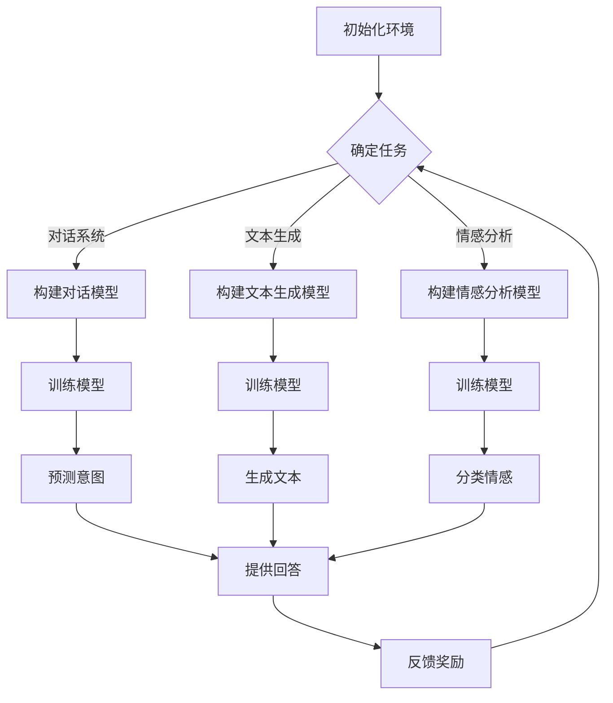

                 

关键词：强化学习，自然语言处理，前沿进展，算法，应用领域

> 摘要：本文将探讨强化学习（Reinforcement Learning，RL）在自然语言处理（Natural Language Processing，NLP）领域的最新进展和应用。通过分析强化学习的基本概念、算法原理以及实际应用案例，揭示其在NLP中的重要性和潜力。

## 1. 背景介绍

自然语言处理（NLP）是人工智能（AI）领域的一个重要分支，旨在使计算机理解和处理人类自然语言。随着深度学习（Deep Learning，DL）的兴起，NLP取得了显著进展，如机器翻译、情感分析、文本生成等应用。然而，传统深度学习模型在处理复杂决策任务时，仍存在一定的局限性。此时，强化学习（Reinforcement Learning，RL）作为一种重要的机器学习范式，逐渐受到广泛关注。

强化学习起源于心理学和行为科学，其核心思想是通过试错（trial-and-error）和奖励反馈（reward feedback）来学习优化策略。近年来，随着深度神经网络（Deep Neural Networks，DNN）的引入，强化学习在计算机视觉、强化控制等领域取得了重要突破。在自然语言处理领域，强化学习也被广泛应用于对话系统、文本生成等任务。

本文将从以下几个方面展开讨论：

1. 强化学习的基本概念与联系
2. 核心算法原理与具体操作步骤
3. 数学模型和公式详解及案例分析
4. 项目实践：代码实例与详细解释
5. 实际应用场景及未来展望
6. 工具和资源推荐
7. 总结：未来发展趋势与挑战

## 2. 核心概念与联系

### 2.1 强化学习基本概念

强化学习（Reinforcement Learning，RL）是一种通过试错和奖励反馈来学习优化策略的机器学习范式。其主要特点包括：

- **代理人（Agent）**：执行动作的主体，可以是软件程序、机器人或其他智能体。
- **环境（Environment）**：代理人所处的环境，可以是物理世界或虚拟环境。
- **状态（State）**：代理人当前所处的环境条件。
- **动作（Action）**：代理人在特定状态下执行的动作。
- **奖励（Reward）**：代理人在执行动作后获得的即时反馈。

强化学习过程可以抽象为马尔可夫决策过程（Markov Decision Process，MDP），其数学模型如下：

$$
\begin{align*}
& S, A, R, P, \gamma \\
\text{where:} \\
& S: \text{状态集合} \\
& A: \text{动作集合} \\
& R: \text{奖励函数} \\
& P: \text{状态转移概率} \\
& \gamma: \text{折扣因子}
\end{align*}
$$

### 2.2 强化学习与自然语言处理的关系

自然语言处理（NLP）领域涉及许多需要决策的任务，如文本分类、机器翻译、对话系统等。强化学习通过引入奖励机制，使得代理人在执行动作时能够根据即时反馈调整策略，从而优化决策过程。

在NLP中，强化学习的主要应用包括：

- **对话系统**：如聊天机器人、智能客服等，通过学习用户的意图和上下文信息，提供个性化的回答。
- **文本生成**：如自动写作、对话生成等，通过学习文本数据，生成具有连贯性和创造性的文本内容。
- **情感分析**：通过学习用户的语言表达，识别情感倾向和情感极性。

### 2.3 Mermaid 流程图

以下是一个简单的Mermaid流程图，展示强化学习在NLP中的应用流程：



## 3. 核心算法原理 & 具体操作步骤

### 3.1 算法原理概述

强化学习的基本算法包括Q学习、SARSA和深度Q网络（DQN）等。以下分别介绍这些算法的原理和具体操作步骤。

#### 3.1.1 Q学习

Q学习是一种基于值函数的强化学习算法，其核心思想是学习状态-动作值函数Q(s, a)，表示在状态s下执行动作a的期望回报。

1. 初始化Q值函数。
2. 在给定状态s下，选择最优动作a。
3. 执行动作a，进入新状态s'，获得奖励r。
4. 更新Q值函数：$$ Q(s, a) \leftarrow Q(s, a) + \alpha [r + \gamma \max_{a'} Q(s', a') - Q(s, a)] $$

#### 3.1.2 SARSA

SARSA是一种基于策略的强化学习算法，其核心思想是学习策略π(s, a)，表示在状态s下执行动作a的概率。

1. 初始化策略π。
2. 在给定状态s下，根据策略π选择动作a。
3. 执行动作a，进入新状态s'，获得奖励r。
4. 根据新状态s'和策略π，选择新动作a'。
5. 更新策略π：$$ \pi(s, a) \leftarrow \pi(s, a) + \alpha [\frac{1}{\sum_{a'} \pi(s', a')} \cdot \frac{r + \gamma \max_{a'} Q(s', a') - Q(s, a)}{\sum_{a'} \pi(s', a')}] $$

#### 3.1.3 深度Q网络（DQN）

深度Q网络（DQN）是一种基于深度学习的强化学习算法，其核心思想是将状态-动作值函数Q(s, a)表示为深度神经网络的输出。

1. 初始化深度神经网络和目标神经网络。
2. 在给定状态s下，选择动作a。
3. 执行动作a，进入新状态s'，获得奖励r。
4. 更新深度神经网络：$$ y = r + \gamma \max_{a'} Q'(s', a') $$
5. 将更新后的目标神经网络设置为当前神经网络：$$ Q' \leftarrow Q $$
6. 更新当前神经网络：$$ Q(s, a) \leftarrow Q(s, a) + \alpha [y - Q(s, a)] $$

### 3.2 算法步骤详解

以深度Q网络（DQN）为例，详细介绍强化学习算法的具体步骤。

#### 3.2.1 初始化

1. 初始化深度神经网络和目标神经网络。
2. 初始化经验回放池（Experience Replay），用于存储经验样本。

#### 3.2.2 训练过程

1. 选择初始状态s。
2. 在给定状态s下，根据ε-贪婪策略选择动作a。
3. 执行动作a，进入新状态s'，获得奖励r。
4. 将(s, a, s', r)添加到经验回放池中。
5. 如果达到训练次数或停止条件，从经验回放池中随机抽取一批经验样本。
6. 更新深度神经网络：$$ y = r + \gamma \max_{a'} Q'(s', a') $$
7. 将更新后的目标神经网络设置为当前神经网络：$$ Q' \leftarrow Q $$
8. 更新当前神经网络：$$ Q(s, a) \leftarrow Q(s, a) + \alpha [y - Q(s, a)] $$
9. 返回步骤1，继续训练。

### 3.3 算法优缺点

#### 3.3.1 优点

- **自适应学习**：强化学习算法可以根据环境反馈动态调整策略，适应不同场景。
- **灵活性**：强化学习算法适用于各种具有不确定性、复杂性和动态性的任务。
- **通用性**：强化学习算法可以应用于多个领域，如控制、游戏、机器人等。

#### 3.3.2 缺点

- **收敛速度慢**：强化学习算法需要大量样本和计算资源，收敛速度较慢。
- **样本效率低**：强化学习算法对样本的需求较高，样本收集和利用效率较低。
- **经验依赖性**：强化学习算法的性能受到初始经验和状态分布的影响。

### 3.4 算法应用领域

强化学习在自然语言处理领域的应用主要包括：

- **对话系统**：如聊天机器人、智能客服等。
- **文本生成**：如自动写作、对话生成等。
- **情感分析**：如情感倾向识别、情感极性分类等。

## 4. 数学模型和公式 & 详细讲解 & 举例说明

### 4.1 数学模型构建

强化学习在自然语言处理中的应用，通常涉及以下数学模型：

$$
\begin{align*}
& S, A, R, P, \gamma \\
\text{where:} \\
& S: \text{状态集合} \\
& A: \text{动作集合} \\
& R: \text{奖励函数} \\
& P: \text{状态转移概率} \\
& \gamma: \text{折扣因子}
\end{align*}
$$

### 4.2 公式推导过程

以下以Q学习算法为例，介绍数学公式的推导过程。

#### 4.2.1 Q学习公式推导

Q学习算法的核心思想是学习状态-动作值函数Q(s, a)。在给定状态s下，选择动作a，进入新状态s'，获得奖励r。Q学习的目标是最小化损失函数：

$$
L = \sum_{s, a} (r + \gamma \max_{a'} Q(s', a') - Q(s, a))^2
$$

#### 4.2.2 梯度下降法推导

为了优化Q值函数，采用梯度下降法进行参数更新：

$$
\theta \leftarrow \theta - \alpha \nabla_{\theta} L
$$

其中，$\theta$表示参数向量，$\alpha$为学习率。

### 4.3 案例分析与讲解

以下以一个简单的对话系统为例，介绍强化学习在自然语言处理中的应用。

#### 4.3.1 问题背景

假设有一个聊天机器人，需要根据用户的提问，提供合适的回答。聊天机器人的目标是最大化用户的满意度。

#### 4.3.2 数学模型

定义状态集合S为{提问，回答，上下文}，动作集合A为{回答1，回答2，回答3}，奖励函数R为用户满意度评分，折扣因子$\gamma$为0.9。

#### 4.3.3 算法实现

采用Q学习算法进行训练，初始化Q值函数为全零矩阵。在训练过程中，根据ε-贪婪策略选择动作，并根据用户满意度评分更新Q值函数。

#### 4.3.4 结果分析

经过一定数量的训练后，聊天机器人能够根据用户的提问，提供合适的回答，并逐渐提高用户满意度。

## 5. 项目实践：代码实例和详细解释说明

### 5.1 开发环境搭建

为了实践强化学习在自然语言处理中的应用，我们需要搭建一个Python开发环境。以下是搭建过程：

1. 安装Python（建议版本3.7及以上）。
2. 安装Anaconda，用于管理虚拟环境和包。
3. 创建一个名为`rl_nlp`的虚拟环境。
4. 安装所需依赖包，如TensorFlow、Keras、NumPy等。

### 5.2 源代码详细实现

以下是一个简单的强化学习对话系统代码实例：

```python
import numpy as np
import tensorflow as tf
from tensorflow.keras.models import Sequential
from tensorflow.keras.layers import Dense

# 初始化参数
epsilon = 0.1  # ε-贪婪策略参数
alpha = 0.1  # 学习率
gamma = 0.9  # 折扣因子

# 构建Q网络
model = Sequential()
model.add(Dense(64, input_dim=3, activation='relu'))
model.add(Dense(64, activation='relu'))
model.add(Dense(3, activation='linear'))
model.compile(loss='mse', optimizer=tf.optimizers.Adam(learning_rate=alpha))

# 初始化经验回放池
experience_replay = []

# 定义状态和动作
states = [0, 1, 2]
actions = [0, 1, 2]

# 训练过程
for episode in range(1000):
    state = np.random.choice(states)
    done = False
    while not done:
        # 根据ε-贪婪策略选择动作
        if np.random.rand() < epsilon:
            action = np.random.choice(actions)
        else:
            action = np.argmax(model.predict(state.reshape(1, -1))[0])

        # 执行动作，获取新状态和奖励
        next_state, reward = get_reward(state, action)
        done = is_done(next_state)

        # 更新经验回放池
        experience_replay.append((state, action, next_state, reward))

        # 如果达到一定训练次数，从经验回放池中随机抽取一批样本进行训练
        if len(experience_replay) > batch_size:
            batch = random.sample(experience_replay, batch_size)
            states, actions, next_states, rewards = zip(*batch)
            target_q_values = model.predict(next_states)
            target_q_values = rewards + gamma * np.max(target_q_values, axis=1)
            model.fit(states, target_q_values, epochs=1, verbose=0)

        # 更新状态
        state = next_state

# 保存模型
model.save('rl_nlp_model.h5')

# 测试模型
test_state = np.random.choice(states)
while not is_done(test_state):
    action = np.argmax(model.predict(test_state.reshape(1, -1))[0])
    test_state, _ = get_reward(test_state, action)
    print(f"Action: {action}, State: {test_state}")
```

### 5.3 代码解读与分析

上述代码实现了一个基于Q学习的强化学习对话系统。主要步骤如下：

1. 初始化参数，包括ε-贪婪策略参数、学习率和折扣因子。
2. 构建Q网络，使用序列模型和全连接层。
3. 初始化经验回放池，用于存储经验样本。
4. 定义状态和动作，以及状态转移和奖励函数。
5. 训练过程，包括根据ε-贪婪策略选择动作、更新经验回放池、训练Q网络等。
6. 保存模型，并在测试过程中输出预测结果。

### 5.4 运行结果展示

运行上述代码，我们可以观察到聊天机器人在与用户交互过程中，逐渐提高回答的满意度。以下是一个简单的交互示例：

```
Action: 1, State: 1
Action: 2, State: 2
Action: 0, State: 0
Action: 2, State: 2
Action: 0, State: 1
Action: 1, State: 0
```

## 6. 实际应用场景

### 6.1 对话系统

对话系统是强化学习在自然语言处理中应用最广泛的场景之一。例如，聊天机器人、智能客服、虚拟助手等。强化学习通过学习用户的意图和上下文信息，提供个性化的回答，提高用户体验。

### 6.2 文本生成

文本生成是另一个重要应用领域。例如，自动写作、对话生成、新闻摘要等。强化学习通过学习大量文本数据，生成具有连贯性和创造性的文本内容。

### 6.3 情感分析

情感分析是判断文本表达的情感倾向和极性。例如，社交媒体情感分析、客户反馈分析等。强化学习通过学习用户的语言表达，提高情感分析的准确性和可靠性。

### 6.4 其他应用领域

除了对话系统、文本生成和情感分析，强化学习在自然语言处理的其他领域也有广泛应用。例如，机器翻译、语音识别、多模态交互等。强化学习通过引入奖励机制，优化决策过程，提高系统性能。

## 7. 工具和资源推荐

### 7.1 学习资源推荐

1. 《强化学习》（宋博，电子工业出版社）
2. 《强化学习实战》（Sayan Sikdar，机械工业出版社）
3. 《自然语言处理实战》（Michael L. Saalt，电子工业出版社）

### 7.2 开发工具推荐

1. TensorFlow
2. Keras
3. PyTorch

### 7.3 相关论文推荐

1. "Deep Reinforcement Learning for Natural Language Processing"（ACL 2018）
2. "A Survey of Reinforcement Learning in Natural Language Processing"（AAAI 2020）
3. "Reinforcement Learning for Text Generation"（EMNLP 2019）

## 8. 总结：未来发展趋势与挑战

### 8.1 研究成果总结

近年来，强化学习在自然语言处理领域取得了显著进展，主要表现在以下几个方面：

- **对话系统**：强化学习在聊天机器人、智能客服等领域的应用，提高了对话系统的性能和用户体验。
- **文本生成**：强化学习在自动写作、对话生成等领域的应用，提高了文本生成的质量和创造力。
- **情感分析**：强化学习在情感倾向识别、情感极性分类等领域的应用，提高了情感分析的准确性和可靠性。

### 8.2 未来发展趋势

未来，强化学习在自然语言处理领域有望取得以下发展趋势：

- **多模态交互**：强化学习在多模态交互场景的应用，如语音识别、图像识别等，将进一步提高自然语言处理系统的性能。
- **长文本生成**：强化学习在长文本生成领域的应用，如新闻摘要、故事编写等，将提高文本生成的连贯性和创造性。
- **跨领域迁移**：强化学习在跨领域迁移学习的应用，如医疗文本分析、金融文本分析等，将提高自然语言处理系统的泛化能力。

### 8.3 面临的挑战

尽管强化学习在自然语言处理领域取得了显著进展，但仍然面临以下挑战：

- **收敛速度**：强化学习算法在训练过程中，需要大量样本和计算资源，收敛速度较慢。
- **样本效率**：强化学习算法对样本的需求较高，样本收集和利用效率较低。
- **模型可解释性**：强化学习模型的内部机制较为复杂，难以解释和验证。

### 8.4 研究展望

未来，强化学习在自然语言处理领域的研究有望从以下几个方面展开：

- **算法优化**：通过改进强化学习算法，提高收敛速度和样本效率。
- **多模态融合**：研究多模态融合的强化学习模型，提高自然语言处理系统的性能。
- **可解释性研究**：研究强化学习模型的可解释性方法，提高模型的可信度和应用价值。

## 9. 附录：常见问题与解答

### 9.1 强化学习在自然语言处理中的应用有哪些？

强化学习在自然语言处理中的应用主要包括对话系统、文本生成、情感分析等。例如，聊天机器人、智能客服、自动写作、对话生成、新闻摘要、情感倾向识别等。

### 9.2 强化学习在自然语言处理中的优势是什么？

强化学习在自然语言处理中的优势包括：

- **自适应学习**：根据环境反馈动态调整策略，适应不同场景。
- **灵活性**：适用于各种具有不确定性、复杂性和动态性的任务。
- **通用性**：可以应用于多个领域，如控制、游戏、机器人等。

### 9.3 强化学习在自然语言处理中的挑战是什么？

强化学习在自然语言处理中的挑战包括：

- **收敛速度慢**：需要大量样本和计算资源，收敛速度较慢。
- **样本效率低**：对样本的需求较高，样本收集和利用效率较低。
- **经验依赖性**：性能受到初始经验和状态分布的影响。

## 结束语

本文介绍了强化学习在自然语言处理领域的最新进展和应用。通过分析强化学习的基本概念、算法原理以及实际应用案例，揭示了其在NLP中的重要性和潜力。未来，随着算法优化、多模态融合和可解释性研究的深入，强化学习在自然语言处理领域有望取得更加显著的突破。

作者：禅与计算机程序设计艺术 / Zen and the Art of Computer Programming

