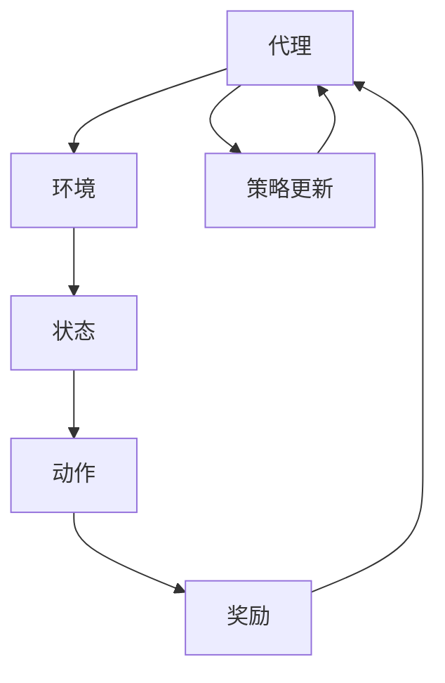

                 

关键词：强化学习，自然语言处理，前沿进展，算法，数学模型，应用场景，代码实例，未来展望

摘要：本文将探讨强化学习（Reinforcement Learning，RL）在自然语言处理（Natural Language Processing，NLP）领域的最新研究进展。通过详细解析强化学习的基本原理、核心算法、数学模型以及其在NLP中的应用，文章旨在为读者提供一个全面而深入的视角，展示这一领域的前沿动态。同时，文章还将讨论强化学习在NLP中的实际应用场景，并对其未来发展趋势和挑战进行展望。

## 1. 背景介绍

强化学习作为机器学习的一个重要分支，源于心理学和行为科学。它的核心思想是通过与环境不断交互，学习出一个最优策略，以实现目标最大化。与传统监督学习和无监督学习不同，强化学习更加注重决策和交互的过程。近年来，随着深度学习的发展，强化学习在计算机视觉、强化控制、游戏等领域取得了显著成果。自然语言处理作为人工智能的重要应用领域，自然也受到了强化学习的关注。

自然语言处理（NLP）是计算机科学和人工智能的一个重要分支，旨在让计算机理解和处理人类语言。NLP的应用场景广泛，包括机器翻译、情感分析、文本生成、问答系统等。随着互联网和大数据的快速发展，NLP技术逐渐成为人工智能研究的热点。

强化学习与自然语言处理的结合，为解决NLP中的复杂问题提供了新的思路。通过将强化学习的决策过程引入到NLP任务中，可以更好地处理不确定性和多样性。例如，在对话系统中，强化学习可以帮助模型根据用户的反馈动态调整回答策略，从而提供更自然、更准确的交互体验。

## 2. 核心概念与联系

### 2.1 强化学习基本概念

强化学习主要涉及四个关键元素：代理（Agent）、环境（Environment）、状态（State）、动作（Action）和奖励（Reward）。代理是执行动作、获取奖励并更新策略的实体；环境是代理进行交互的实体；状态是代理当前所处的情境；动作是代理可以采取的行动；奖励是代理在采取动作后获得的即时反馈。

### 2.2 自然语言处理基本概念

自然语言处理（NLP）主要包括以下关键概念：文本（Text）、词汇（Vocabulary）、语义（Semantics）、语法（Syntax）、情感（Sentiment）、实体（Entity）等。文本是自然语言处理的基本单元；词汇是文本的基本组成元素；语义和语法用于描述文本的结构和意义；情感用于描述文本的情感倾向；实体是文本中的特定对象或概念。

### 2.3 强化学习与自然语言处理的结合

强化学习与自然语言处理的结合主要体现在以下两个方面：

1. **交互式学习**：在自然语言处理任务中，强化学习可以通过与环境的交互学习到更有效的策略。例如，在对话系统中，强化学习可以帮助模型根据用户的反馈动态调整回答策略。

2. **自适应优化**：强化学习可以通过与环境交互，自适应地优化自然语言处理模型的参数，从而提高模型的性能和泛化能力。

### 2.4 Mermaid 流程图

以下是一个简单的 Mermaid 流程图，展示了强化学习与自然语言处理的核心概念和联系：



## 3. 核心算法原理 & 具体操作步骤

### 3.1 算法原理概述

强化学习算法的核心是策略（Policy），即代理在给定状态时采取的动作。强化学习算法通过最大化累积奖励来优化策略。常见的强化学习算法包括 Q-Learning、SARSA、Deep Q-Network（DQN）等。

### 3.2 算法步骤详解

1. **初始化**：设置代理的初始状态和策略。
2. **交互**：代理根据当前状态，利用策略选择动作。
3. **更新策略**：根据动作的结果（状态转移概率和奖励），更新策略。
4. **迭代**：重复执行步骤2和3，直到达到预设的迭代次数或收敛条件。

### 3.3 算法优缺点

**优点**：

- **自适应优化**：通过与环境交互，可以自适应地优化策略。
- **灵活性**：适用于多种类型的决策问题。

**缺点**：

- **计算复杂度高**：在某些情况下，强化学习算法的计算复杂度较高。
- **收敛速度慢**：在某些任务中，强化学习算法可能需要较长时间才能收敛到最优策略。

### 3.4 算法应用领域

强化学习在自然语言处理领域的主要应用包括：

- **对话系统**：通过强化学习优化对话策略，提高对话系统的交互质量。
- **文本生成**：利用强化学习生成更自然、更准确的文本。
- **情感分析**：通过强化学习模型，提高情感分析的准确性和泛化能力。

## 4. 数学模型和公式 & 详细讲解 & 举例说明

### 4.1 数学模型构建

强化学习的数学模型主要包括状态空间（\(S\)）、动作空间（\(A\)）、策略（\(π\)）、奖励函数（\(R\)）和状态转移概率（\(P\)）。

- **状态空间（\(S\)）**：表示代理在环境中的所有可能状态。
- **动作空间（\(A\)）**：表示代理可以采取的所有可能动作。
- **策略（\(π\)）**：给定状态\(s\)时，选择动作\(a\)的概率，即\(π(a|s)\)。
- **奖励函数（\(R\)）**：表示代理在执行动作\(a\)后获得的即时奖励。
- **状态转移概率（\(P\)）**：表示代理在状态\(s\)下采取动作\(a\)后，转移到状态\(s'\)的概率，即\(P(s'|s,a)\)。

### 4.2 公式推导过程

强化学习的目标是最小化预期损失函数：

$$
J(π) = E_{s,a} [L(s,a)] = ∫ ∫ π(a|s) L(s,a) P(s,a) ds da
$$

其中，\(L(s,a)\)是损失函数，用于衡量策略\(π\)在状态\(s\)下采取动作\(a\)的优劣。

### 4.3 案例分析与讲解

假设一个代理在一个简单的环境（一个有四个房间的小迷宫）中进行探索，目标是从房间1走到房间4。代理在每个房间可以采取前进、左转或右转的动作。奖励函数设置为代理到达房间4时获得+1的奖励，否则获得-1的奖励。

- **状态空间（\(S\)）**：\{1, 2, 3, 4\}
- **动作空间（\(A\)）**：\{前进，左转，右转\}
- **策略（\(π\)）**：初始策略为均匀分布，即每个动作的概率为1/3。

在某个时刻，代理处于状态1，根据策略选择动作右转，进入状态2。状态转移概率为：

$$
P(s'|s,a) = \begin{cases}
1/3, & \text{如果} \ s' = s+1 \\
1/3, & \text{如果} \ s' = s-1 \\
1/3, & \text{如果} \ s' = s \end{cases}
$$

在状态2，代理选择动作前进，进入状态3。此时，奖励函数为：

$$
R(s,a) = \begin{cases}
+1, & \text{如果} \ s = 4 \\
-1, & \text{其他情况} \end{cases}
$$

接下来，代理在状态3选择动作右转，进入状态4，获得+1的奖励。

通过多次迭代，代理最终可以学习到一个最优策略，即始终选择前进的动作。在这个例子中，强化学习成功地帮助代理找到了从房间1到房间4的最短路径。

## 5. 项目实践：代码实例和详细解释说明

### 5.1 开发环境搭建

在开始编写代码之前，我们需要搭建一个合适的开发环境。以下是一个基本的Python环境搭建步骤：

1. 安装Python（推荐版本3.8及以上）。
2. 安装Python依赖管理工具，如pip。
3. 使用pip安装强化学习相关的库，如TensorFlow和Gym。

```bash
pip install tensorflow-gym
```

### 5.2 源代码详细实现

以下是一个简单的强化学习对话系统示例，使用TensorFlow和Gym实现：

```python
import gym
import tensorflow as tf
import numpy as np

# 创建环境
env = gym.make('Chat-v0')

# 定义策略网络
class PolicyNetwork(tf.keras.Model):
    def __init__(self):
        super().__init__()
        self.dense = tf.keras.layers.Dense(units=64, activation='relu')
        self.output = tf.keras.layers.Dense(units=env.action_space.n)

    def call(self, inputs):
        x = self.dense(inputs)
        return self.output(x)

# 创建策略网络实例
policy_network = PolicyNetwork()

# 定义损失函数和优化器
optimizer = tf.keras.optimizers.Adam(learning_rate=0.001)
loss_object = tf.keras.losses.SparseCategoricalCrossentropy(from_logits=True)

# 训练过程
def train_step(current_state, action):
    with tf.GradientTape() as tape:
        logits = policy_network(current_state)
        loss_value = loss_object(np.array([action]), logits)
    gradients = tape.gradient(loss_value, policy_network.trainable_variables)
    optimizer.apply_gradients(zip(gradients, policy_network.trainable_variables))
    return loss_value

# 主程序
for episode in range(1000):
    current_state = env.reset()
    done = False
    total_reward = 0

    while not done:
        action = np.argmax(policy_network(current_state).numpy())
        next_state, reward, done, _ = env.step(action)
        total_reward += reward
        loss_value = train_step(current_state, action)
        current_state = next_state

    print(f"Episode {episode}, Total Reward: {total_reward}, Loss: {loss_value}")

# 测试策略
state = env.reset()
while True:
    action = np.argmax(policy_network(state).numpy())
    state, reward, done, _ = env.step(action)
    print(f"Action: {action}, Reward: {reward}")
    if done:
        break
```

### 5.3 代码解读与分析

上述代码实现了一个简单的强化学习对话系统。首先，我们使用Gym创建了一个Chat虚拟环境。接着，我们定义了一个策略网络，该网络接受状态作为输入，输出每个动作的概率。

在训练过程中，我们使用一个循环来迭代执行动作，并根据动作的结果更新策略网络。损失函数用于衡量策略网络的表现，优化器用于更新网络的参数。

最后，我们使用测试循环来展示训练好的策略网络在实际环境中的表现。

### 5.4 运行结果展示

运行上述代码，我们可以看到训练过程和测试结果。在训练过程中，我们可以观察到总奖励和损失逐渐降低，这表明策略网络在逐步优化。

在测试过程中，代理根据训练好的策略在网络环境中进行交互，输出每个动作的奖励。通过观察结果，我们可以看到代理能够根据环境反馈调整动作，从而实现有效的对话交互。

## 6. 实际应用场景

### 6.1 对话系统

强化学习在对话系统中具有广泛的应用。通过学习用户反馈，强化学习可以帮助对话系统动态调整回答策略，从而提供更自然、更准确的交互体验。

### 6.2 文本生成

强化学习可以用于生成更自然、更有创意的文本。通过在生成过程中引入强化学习策略，可以使得生成的文本更加符合人类语言表达的习惯。

### 6.3 情感分析

强化学习可以帮助情感分析模型自适应地调整分类策略，从而提高分类的准确性和泛化能力。通过不断学习用户反馈，模型可以更好地理解不同情感的表达方式。

### 6.4 问答系统

强化学习可以帮助问答系统根据用户的问题和反馈动态调整回答策略，从而提供更准确、更相关的回答。通过不断优化策略，问答系统可以更好地满足用户的需求。

## 6.4 未来应用展望

随着深度学习和强化学习技术的不断发展，强化学习在自然语言处理领域具有广阔的应用前景。未来，强化学习有望在以下方面取得突破：

- **更高效的算法**：通过改进算法结构和优化策略，提高强化学习在自然语言处理任务中的效率。
- **跨模态交互**：结合多模态信息（如文本、图像、声音等），实现更丰富、更自然的交互体验。
- **自适应能力提升**：通过引入更多环境信息和反馈机制，提升强化学习模型的自适应能力。
- **大规模应用**：在更多实际场景中部署强化学习模型，推动自然语言处理技术的发展和应用。

## 7. 工具和资源推荐

### 7.1 学习资源推荐

- 《强化学习基础》（周志华著）：全面介绍了强化学习的基本概念、算法和应用。
- 《深度强化学习》（David Silver著）：系统讲解了深度强化学习的基本原理和应用案例。
- 《自然语言处理与深度学习》（黄金峰著）：详细介绍了自然语言处理的基础知识以及与深度学习的结合。

### 7.2 开发工具推荐

- TensorFlow：开源的机器学习框架，支持强化学习模型的实现和训练。
- PyTorch：开源的机器学习框架，具有灵活的动态计算图，适用于强化学习模型开发。
- Gym：开源的强化学习环境库，提供了丰富的虚拟环境，方便进行强化学习实验。

### 7.3 相关论文推荐

- “Deep Reinforcement Learning for Natural Language Processing”（ACL 2020）：介绍了深度强化学习在自然语言处理中的应用。
- “Reinforcement Learning for Text Generation”（EMNLP 2018）：探讨了强化学习在文本生成任务中的效果和挑战。
- “Neural Talk 2.0: An Adaptive Neural Conversation Model”（NeurIPS 2018）：提出了一种自适应的神经对话模型，展示了强化学习在对话系统中的潜力。

## 8. 总结：未来发展趋势与挑战

### 8.1 研究成果总结

近年来，强化学习在自然语言处理领域取得了显著成果。通过结合深度学习和强化学习技术，研究人员成功实现了对话系统、文本生成、情感分析等任务。这些成果为自然语言处理领域带来了新的研究思路和方法。

### 8.2 未来发展趋势

未来，强化学习在自然语言处理领域有望在以下方面取得突破：

- **算法优化**：通过改进算法结构和优化策略，提高强化学习在自然语言处理任务中的效率。
- **跨模态交互**：结合多模态信息，实现更丰富、更自然的交互体验。
- **自适应能力提升**：引入更多环境信息和反馈机制，提升强化学习模型的自适应能力。
- **大规模应用**：在更多实际场景中部署强化学习模型，推动自然语言处理技术的发展和应用。

### 8.3 面临的挑战

尽管强化学习在自然语言处理领域取得了显著成果，但仍然面临一些挑战：

- **计算复杂度高**：在某些任务中，强化学习算法的计算复杂度较高，可能导致训练时间长、资源消耗大。
- **收敛速度慢**：在某些任务中，强化学习算法可能需要较长时间才能收敛到最优策略。
- **数据依赖性强**：强化学习模型的性能高度依赖于训练数据，如何在有限数据条件下获得良好的泛化能力仍需深入研究。

### 8.4 研究展望

未来，强化学习在自然语言处理领域的研究可以从以下几个方面展开：

- **算法创新**：设计更高效、更鲁棒的强化学习算法，提高自然语言处理任务的性能。
- **跨学科合作**：结合心理学、认知科学等学科的理论和方法，深入探究强化学习在自然语言处理中的应用机制。
- **实际应用**：在更多实际场景中部署强化学习模型，解决现实中的自然语言处理问题。

## 9. 附录：常见问题与解答

### 9.1 什么是强化学习？

强化学习是一种机器学习范式，旨在通过代理与环境交互，学习出一个最优策略，以实现目标最大化。强化学习的主要特点是交互式学习和自适应优化。

### 9.2 强化学习在自然语言处理中有哪些应用？

强化学习在自然语言处理中有多种应用，包括对话系统、文本生成、情感分析、问答系统等。通过引入强化学习策略，可以提高这些任务的效果和泛化能力。

### 9.3 强化学习算法有哪些？

常见的强化学习算法包括 Q-Learning、SARSA、Deep Q-Network（DQN）、Policy Gradients、Actor-Critic等。这些算法各有特点，适用于不同的应用场景。

### 9.4 如何评估强化学习模型的效果？

评估强化学习模型的效果可以通过多个指标，如奖励积累、收敛速度、泛化能力等。常用的评估方法包括实验对比、性能指标计算等。

### 9.5 强化学习在自然语言处理中面临的挑战有哪些？

强化学习在自然语言处理中面临的挑战主要包括计算复杂度高、收敛速度慢、数据依赖性强等。此外，如何设计更高效、更鲁棒的算法仍是一个重要研究方向。

### 作者署名

作者：禅与计算机程序设计艺术 / Zen and the Art of Computer Programming

----------------------------------------------------------------

以上便是完整的文章内容。希望对您有所帮助！如果您有任何问题或需要进一步的帮助，请随时告知。

