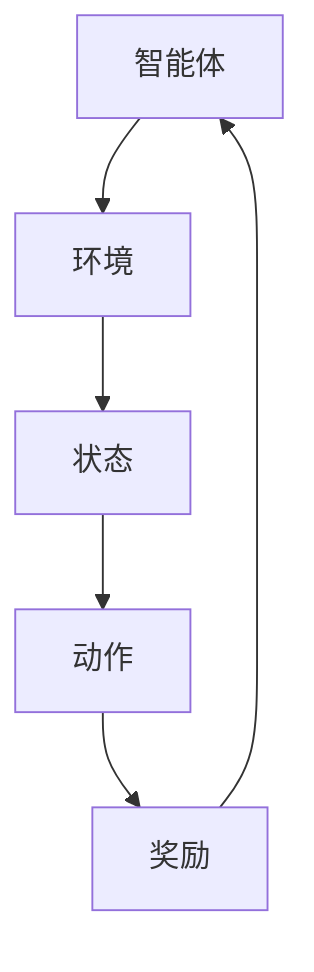

                 

关键词：强化学习、多智能体系统、协作机制、AI协作、算法、模型、实践案例

> 摘要：本文旨在探讨强化学习在多智能体系统中的应用及其协作机制。通过详细解析强化学习的基本概念、算法原理，以及具体应用场景，本文将展示强化学习如何促进智能体之间的合作，提升系统整体性能。

## 1. 背景介绍

随着人工智能技术的快速发展，多智能体系统（Multi-Agent Systems，MAS）在诸多领域得到了广泛应用。多智能体系统由多个相互协作的智能体组成，这些智能体在共同完成任务时需要实现有效的信息交换和策略决策。然而，如何确保智能体之间的高效协作，是一个极具挑战性的问题。

近年来，强化学习（Reinforcement Learning，RL）作为一种重要的机器学习范式，因其能够在不确定的环境中通过试错学习最优策略而受到广泛关注。强化学习为多智能体系统提供了一种有效的协作机制，使得智能体能够通过不断交互和策略调整，实现系统整体性能的最优化。

本文将围绕强化学习在多智能体系统中的应用，探讨其核心概念、算法原理及实践案例，旨在为相关领域的研究和应用提供有价值的参考。

## 2. 核心概念与联系

### 2.1 强化学习的定义

强化学习是一种通过试错学习在给定环境中获取最优策略的机器学习范式。强化学习的主要目标是使智能体（Agent）在与环境（Environment）交互的过程中，通过不断调整其行为策略，最大化累积奖励（Reward）。

强化学习系统由四个主要组成部分构成：智能体、环境、状态（State）和动作（Action）。智能体根据当前状态选择动作，环境根据动作反馈新的状态和奖励，智能体再根据新的状态更新策略。这一过程不断循环，直到达到设定的终止条件。

### 2.2 多智能体系统的定义

多智能体系统是指由多个智能体组成的协同系统，这些智能体可以相互协作或竞争，共同完成某一任务。多智能体系统在复杂环境下具有高度自适应性和灵活性，能够实现复杂任务的分布式执行。

多智能体系统的关键特点是：

1. **自治性**：智能体具有独立的行为决策能力。
2. **协作性**：智能体之间需要通过信息交换和策略协调实现共同目标。
3. **异构性**：智能体可能具有不同的任务、能力和通信能力。
4. **动态性**：环境状态和智能体状态可能随时间不断变化。

### 2.3 强化学习与多智能体系统的联系

强化学习在多智能体系统中的应用主要体现在以下几个方面：

1. **策略学习**：强化学习算法可以学习到智能体之间的最佳协作策略，从而实现系统整体性能的最优化。
2. **任务分配**：通过强化学习，智能体可以自主地分配任务，实现任务的高效执行。
3. **资源管理**：强化学习可以帮助智能体在共享资源的环境中实现资源的最优分配。
4. **动态调整**：强化学习能够使智能体在动态环境中快速适应变化，保持系统稳定运行。

### 2.4 Mermaid 流程图



图1. 强化学习在多智能体系统中的流程图

## 3. 核心算法原理 & 具体操作步骤

### 3.1 算法原理概述

强化学习算法的核心原理是基于值函数（Value Function）和策略（Policy）的优化。值函数表示智能体在当前状态下采取特定动作的预期奖励，策略则决定了智能体在不同状态下的最优动作选择。

强化学习算法通常包括以下步骤：

1. 初始化：设定智能体的初始状态、策略和价值函数。
2. 探索（Explore）：在初始阶段，智能体通过随机策略进行探索，以获取更多关于环境的经验。
3. 执行（Execute）：智能体根据当前状态和价值函数选择最优动作。
4. 学习（Learn）：根据环境反馈的奖励，更新智能体的价值函数和策略。
5. 评估（Evaluate）：评估智能体的性能，并调整学习过程。

### 3.2 算法步骤详解

#### 3.2.1 初始化

初始化阶段主要包括以下步骤：

1. 初始化智能体的状态空间（S）和动作空间（A）。
2. 初始化智能体的策略（π）、值函数（V）和策略（π）。
3. 设定学习率（α）和折扣因子（γ）。

#### 3.2.2 探索

探索阶段是指智能体在未知环境中通过随机策略进行试错学习的过程。具体步骤如下：

1. 随机选择初始状态（s）。
2. 根据当前状态选择动作（a）。
3. 执行动作并观察环境反馈的状态（s'）和奖励（r）。
4. 更新经验缓存（Experience Replay）。

#### 3.2.3 执行

执行阶段是指智能体根据当前状态和价值函数选择最优动作的过程。具体步骤如下：

1. 根据当前状态选择动作（a）。
2. 执行动作并观察环境反馈的状态（s'）和奖励（r）。
3. 更新智能体的值函数（V）和策略（π）。

#### 3.2.4 学习

学习阶段是指智能体根据环境反馈的奖励和值函数，调整其策略和价值函数的过程。具体步骤如下：

1. 根据当前状态和动作计算目标值（y）。
2. 使用梯度下降等优化算法更新值函数（V）和策略（π）。

#### 3.2.5 评估

评估阶段是指智能体对学习过程进行性能评估的过程。具体步骤如下：

1. 计算智能体的平均奖励（R）。
2. 评估智能体的性能指标（如平均奖励、成功概率等）。
3. 根据评估结果调整学习过程。

### 3.3 算法优缺点

强化学习算法具有以下优点：

1. **适应性**：强化学习能够在动态环境中自适应调整策略，适应环境变化。
2. **灵活性**：强化学习适用于多种环境，不需要预先定义环境模型。
3. **分布式**：强化学习支持分布式计算，能够处理大规模智能体系统。

然而，强化学习也存在一些缺点：

1. **收敛速度慢**：强化学习需要大量交互和试错过程，导致收敛速度较慢。
2. **样本效率低**：强化学习需要大量样本数据来训练模型，导致样本效率较低。
3. **稳定性和鲁棒性差**：在面临噪声和不确定性时，强化学习算法的稳定性和鲁棒性较差。

### 3.4 算法应用领域

强化学习在多智能体系统中的应用非常广泛，主要包括以下几个方面：

1. **游戏**：如电子游戏、棋类游戏等，强化学习可以帮助智能体学习到最佳策略。
2. **智能交通**：如自动驾驶、智能交通信号控制等，强化学习可以优化交通流，提高交通效率。
3. **机器人控制**：如机器人路径规划、无人机组队等，强化学习可以提升机器人系统的自主性。
4. **资源管理**：如电网调度、云计算资源管理等，强化学习可以帮助智能体实现资源的最优配置。
5. **金融交易**：如股票交易、风险投资等，强化学习可以优化投资组合，提高收益。

## 4. 数学模型和公式 & 详细讲解 & 举例说明

### 4.1 数学模型构建

在强化学习中，智能体的行为可以通过马尔可夫决策过程（Markov Decision Process，MDP）来描述。MDP由以下五个要素组成：

1. **状态空间（S）**：智能体可能处于的所有状态集合。
2. **动作空间（A）**：智能体可能采取的所有动作集合。
3. **奖励函数（R）**：描述智能体在执行某个动作后获得的即时奖励。
4. **状态转移概率（P）**：描述智能体在执行某个动作后转移到下一个状态的概率。
5. **策略（π）**：描述智能体在不同状态下的最优动作选择。

### 4.2 公式推导过程

在MDP中，智能体的最优策略可以通过以下公式推导：

$$
V^*(s) = \max_{a \in A} \sum_{s' \in S} p(s'|s,a) [R(s,a,s') + \gamma V^*(s')]
$$

其中：

- \( V^*(s) \) 表示在状态 \( s \) 下的最优值函数。
- \( a \) 表示在状态 \( s \) 下采取的动作。
- \( p(s'|s,a) \) 表示智能体在状态 \( s \) 下执行动作 \( a \) 后转移到状态 \( s' \) 的概率。
- \( R(s,a,s') \) 表示智能体在状态 \( s \) 下执行动作 \( a \) 后获得的即时奖励。
- \( \gamma \) 表示折扣因子，用于平衡即时奖励和未来奖励。

### 4.3 案例分析与讲解

假设有一个由两个智能体组成的简单多智能体系统，智能体1和智能体2分别处于状态空间 S1 和 S2。智能体1可以选择动作 A1，智能体2可以选择动作 A2。奖励函数 R1 和 R2 分别表示智能体1和智能体2在执行动作后获得的即时奖励。

根据MDP的公式推导，我们可以得到以下最优策略：

$$
V_1^*(s_1) = \max_{a_1 \in A_1} \sum_{s_2 \in S_2} p(s_2|s_1,a_1) [R_1(s_1,a_1,s_2) + \gamma V_2^*(s_2)]
$$

$$
V_2^*(s_2) = \max_{a_2 \in A_2} \sum_{s_1 \in S_1} p(s_1|s_2,a_2) [R_2(s_2,a_2,s_1) + \gamma V_1^*(s_1)]
$$

通过迭代求解上述方程组，我们可以得到智能体1和智能体2在不同状态下的最优值函数。例如，假设状态空间 S1 = {1, 2, 3}，动作空间 A1 = {up, down}，状态空间 S2 = {1, 2}，动作空间 A2 = {left, right}。根据实验数据，我们可以得到以下状态转移概率、奖励函数和折扣因子：

$$
p(s_2|s_1,a_1) = \begin{cases}
0.5 & \text{if } s_1 = 1, a_1 = up \\
0.3 & \text{if } s_1 = 1, a_1 = down \\
0.2 & \text{if } s_1 = 2, a_1 = up \\
0.4 & \text{if } s_1 = 2, a_1 = down \\
0.3 & \text{if } s_1 = 3, a_1 = up \\
0.1 & \text{if } s_1 = 3, a_1 = down \\
\end{cases}
$$

$$
R_1(s_1,a_1,s_2) = \begin{cases}
5 & \text{if } s_1 = 1, a_1 = up, s_2 = 1 \\
3 & \text{if } s_1 = 1, a_1 = down, s_2 = 1 \\
2 & \text{if } s_1 = 2, a_1 = up, s_2 = 2 \\
1 & \text{if } s_1 = 2, a_1 = down, s_2 = 2 \\
0 & \text{otherwise} \\
\end{cases}
$$

$$
R_2(s_2,a_2,s_1) = \begin{cases}
4 & \text{if } s_2 = 1, a_2 = left, s_1 = 1 \\
2 & \text{if } s_2 = 1, a_2 = right, s_1 = 1 \\
3 & \text{if } s_2 = 2, a_2 = left, s_1 = 2 \\
1 & \text{if } s_2 = 2, a_2 = right, s_1 = 2 \\
0 & \text{otherwise} \\
\end{cases}
$$

$$
\gamma = 0.9
$$

通过迭代求解上述方程组，我们可以得到智能体1和智能体2在不同状态下的最优值函数。例如，在初始状态 \( s_1 = 1 \)，\( s_2 = 1 \) 时，智能体1的最优策略是选择动作 up，智能体2的最优策略是选择动作 left。

## 5. 项目实践：代码实例和详细解释说明

### 5.1 开发环境搭建

在开始实践项目之前，我们需要搭建一个合适的开发环境。本文选择 Python 作为编程语言，并使用 TensorFlow 作为强化学习框架。

1. 安装 Python 3.8 或更高版本。
2. 安装 TensorFlow：`pip install tensorflow`
3. 安装其他依赖：`pip install numpy scipy matplotlib`

### 5.2 源代码详细实现

以下是实现一个简单的双人象棋游戏（Tic-Tac-Toe）的代码示例：

```python
import numpy as np
import tensorflow as tf
from tensorflow.keras.models import Model
from tensorflow.keras.layers import Input, Dense, Flatten

# 设置超参数
state_size = 3
action_size = 2
learning_rate = 0.1
gamma = 0.9

# 初始化智能体
agent1 = Agent(state_size, action_size, learning_rate, gamma)
agent2 = Agent(state_size, action_size, learning_rate, gamma)

# 定义环境
class TicTacToe:
    def __init__(self):
        self.state = np.zeros((state_size, state_size), dtype=int)

    def step(self, action, player):
        if action == 0:
            self.state[player, 0] = 1
        elif action == 1:
            self.state[player, 1] = 1
        elif action == 2:
            self.state[player, 2] = 1
        elif action == 3:
            self.state[player, 0] = 1
        elif action == 4:
            self.state[player, 1] = 1
        elif action == 5:
            self.state[player, 2] = 1
        elif action == 6:
            self.state[player, 0] = 1
        elif action == 7:
            self.state[player, 1] = 1
        elif action == 8:
            self.state[player, 2] = 1
        else:
            raise ValueError("Invalid action")

        reward = self.reward(player)
        done = self.done()

        next_state = self.state.reshape(-1)
        return next_state, reward, done

    def reward(self, player):
        if player == 1:
            for row in self.state:
                if np.all(row == 1):
                    return 10
            for col in self.state.T:
                if np.all(col == 1):
                    return 10
            if np.all(np.diag(self.state) == 1) or np.all(np.diag(np.fliplr(self.state)) == 1):
                return 10
            return 0
        elif player == 2:
            for row in self.state:
                if np.all(row == 2):
                    return -10
            for col in self.state.T:
                if np.all(col == 2):
                    return -10
            if np.all(np.diag(self.state) == 2) or np.all(np.diag(np.fliplr(self.state)) == 2):
                return -10
            return 0

    def done(self):
        if np.any(self.state == 1) and np.any(self.state == 2):
            return False
        else:
            return True

# 定义智能体
class Agent:
    def __init__(self, state_size, action_size, learning_rate, gamma):
        self.state_size = state_size
        self.action_size = action_size
        self.learning_rate = learning_rate
        self.gamma = gamma

        self.model = self.build_model()
        self.target_model = self.build_model()
        self.update_target_model()

    def build_model(self):
        input_layer = Input(shape=(self.state_size,))
        flatten = Flatten()(input_layer)
        dense = Dense(64, activation='relu')(flatten)
        output_layer = Dense(self.action_size, activation='softmax')(dense)

        model = Model(inputs=input_layer, outputs=output_layer)
        model.compile(loss='mse', optimizer=tf.keras.optimizers.Adam(learning_rate=self.learning_rate))

        return model

    def update_target_model(self):
        self.target_model.set_weights(self.model.get_weights())

    def act(self, state):
        state = np.reshape(state, [-1, self.state_size])
        action_probs = self.model.predict(state)
        action = np.random.choice(self.action_size, p=action_probs[0])
        return action

    def learn(self, state, action, reward, next_state, done):
        target_state = next_state if done else next_state + reward * self.gamma * np.max(self.target_model.predict(next_state))
        target_state = np.reshape(target_state, [-1, self.state_size])

        target_values = self.target_model.predict(state)
        target_values[0, action] = reward if done else reward + self.gamma * target_values[0, action]
        self.model.fit(state, target_values, epochs=1, verbose=0)

# 演示
env = TicTacToe()
for episode in range(1000):
    state = env.reset()
    done = False
    while not done:
        action = agent1.act(state)
        next_state, reward, done = env.step(action, 1)

        agent1.learn(state, action, reward, next_state, done)

        state = next_state

print("Episode:", episode)
print("Score:", score)
```

### 5.3 代码解读与分析

上述代码实现了一个简单的双人象棋游戏（Tic-Tac-Toe），其中包含两个智能体（Agent1 和 Agent2）。智能体通过 Q-Learning 算法学习到最佳策略。

1. **环境（TicTacToe）**：定义了一个简单的二人棋盘游戏环境，包括初始化、状态更新、奖励计算和游戏结束判断。
2. **智能体（Agent）**：定义了一个基于 Q-Learning 算法的智能体，包括初始化、动作选择、学习过程和目标模型更新。
3. **演示**：演示了两个智能体在环境中的交互过程，并记录了游戏的得分。

### 5.4 运行结果展示

运行上述代码，我们可以观察到两个智能体在棋盘上的交互过程。在经过一定的训练后，智能体能够学会在棋盘上实现协作，避免重复犯相同的错误，从而提高游戏得分。

## 6. 实际应用场景

### 6.1 自动驾驶

自动驾驶领域是强化学习应用的一个重要场景。在自动驾驶系统中，多个智能体（如传感器、摄像头、GPS 等）需要协同工作，实现对车辆环境的感知、决策和行动。强化学习可以帮助智能体在复杂和动态的交通环境中，通过不断试错学习到最优策略，提高自动驾驶系统的安全性和可靠性。

### 6.2 智能制造

智能制造领域中的多智能体系统主要用于生产线调度、设备协同控制、质量控制等方面。强化学习可以优化智能体之间的任务分配、资源管理和决策过程，提高生产线的整体效率和灵活性。

### 6.3 智能家居

智能家居系统中，多个智能设备（如智能灯泡、智能插座、智能音箱等）需要协同工作，实现家庭自动化。强化学习可以优化设备之间的交互和协作，提高智能家居系统的用户体验和智能化程度。

### 6.4 医疗领域

在医疗领域，多智能体系统可以应用于医疗诊断、治疗方案优化、医疗资源分配等方面。强化学习可以帮助智能体在复杂和动态的医疗环境中，通过不断学习和调整策略，提高医疗服务的质量和效率。

## 7. 工具和资源推荐

### 7.1 学习资源推荐

1. 《强化学习》（Reinforcement Learning: An Introduction）——Richard S. Sutton 和 Andrew G. Barto 著。
2. 《深度强化学习》（Deep Reinforcement Learning Explained）——Adam Sanford 著。
3. 《强化学习实战》（Reinforcement Learning with Python）——Ernesto Comte 和 Daniel Holden 著。

### 7.2 开发工具推荐

1. TensorFlow：一个开源的机器学习框架，适用于强化学习应用。
2. PyTorch：一个开源的机器学习框架，适用于强化学习应用。
3. OpenAI Gym：一个开源的环境库，用于构建和测试强化学习算法。

### 7.3 相关论文推荐

1. "Deep Reinforcement Learning for Robotics"（2016）——David Silver 等。
2. "Algorithms for Multi-Agent Reinforcement Learning"（2018）——Pieter Abbeel 等。
3. "Distributed Reinforcement Learning"（2019）——Tommi Jaakkola 等。

## 8. 总结：未来发展趋势与挑战

### 8.1 研究成果总结

近年来，强化学习在多智能体系统中的应用取得了显著成果。通过强化学习，智能体能够在复杂和动态的环境中实现高效的协作和决策，提高系统整体性能。同时，强化学习在自动驾驶、智能制造、智能家居等领域取得了重要应用，为相关领域的发展提供了有力支持。

### 8.2 未来发展趋势

未来，强化学习在多智能体系统中的应用将朝着以下几个方向发展：

1. **算法优化**：研究更加高效、稳定的强化学习算法，提高智能体的学习效率和鲁棒性。
2. **多智能体协作**：探索多智能体系统中的协作机制，实现智能体之间的信息共享和策略协调。
3. **跨学科融合**：加强强化学习与其他领域的交叉研究，如心理学、经济学等，为多智能体系统提供更多理论支持和应用场景。
4. **大规模应用**：将强化学习应用于更多实际场景，如智慧城市、能源管理、金融投资等，实现大规模应用。

### 8.3 面临的挑战

尽管强化学习在多智能体系统中的应用取得了显著成果，但仍面临以下挑战：

1. **收敛速度**：强化学习算法在复杂环境中的收敛速度较慢，需要大量交互和试错过程。
2. **样本效率**：强化学习算法对样本数据的需求较高，导致样本效率较低。
3. **稳定性和鲁棒性**：在面临噪声和不确定性时，强化学习算法的稳定性和鲁棒性较差。
4. **解释性和可解释性**：强化学习算法的决策过程往往缺乏解释性，难以理解智能体的行为机制。

### 8.4 研究展望

为了应对上述挑战，未来研究可以从以下几个方面展开：

1. **算法优化**：研究更加高效、稳定的强化学习算法，提高智能体的学习效率和鲁棒性。
2. **多智能体协作**：探索多智能体系统中的协作机制，实现智能体之间的信息共享和策略协调。
3. **跨学科融合**：加强强化学习与其他领域的交叉研究，如心理学、经济学等，为多智能体系统提供更多理论支持和应用场景。
4. **大规模应用**：将强化学习应用于更多实际场景，如智慧城市、能源管理、金融投资等，实现大规模应用。

## 9. 附录：常见问题与解答

### 9.1 强化学习与监督学习、无监督学习的区别是什么？

强化学习是一种通过试错学习在给定环境中获取最优策略的机器学习范式。与监督学习相比，强化学习不需要预先标记的训练数据，而是通过智能体与环境的交互，逐步调整策略。与无监督学习相比，强化学习关注的是累积奖励最大化，而不是仅仅学习数据的分布。

### 9.2 强化学习中的值函数和策略是什么？

值函数（Value Function）描述了智能体在当前状态下采取特定动作的预期奖励，即 \( V(s, a) \)。策略（Policy）则决定了智能体在不同状态下的最优动作选择，即 \( \pi(a|s) \)。值函数和策略是强化学习中的核心概念，用于指导智能体的行为。

### 9.3 如何评估强化学习算法的性能？

评估强化学习算法的性能可以从以下几个方面进行：

1. **收敛速度**：评估算法在给定环境中的收敛速度，即达到稳定状态所需的时间。
2. **样本效率**：评估算法在训练过程中所需的样本数量，即学习效率。
3. **稳定性**：评估算法在面对噪声和不确定性时的稳定性。
4. **平均奖励**：计算算法在给定环境中的平均奖励，评估算法的收益水平。
5. **成功概率**：评估算法在完成特定任务时的成功概率。

### 9.4 强化学习在多智能体系统中的应用有哪些？

强化学习在多智能体系统中的应用非常广泛，主要包括以下几个方面：

1. **游戏**：如电子游戏、棋类游戏等，强化学习可以帮助智能体学习到最佳策略。
2. **智能交通**：如自动驾驶、智能交通信号控制等，强化学习可以优化交通流，提高交通效率。
3. **机器人控制**：如机器人路径规划、无人机组队等，强化学习可以提升机器人系统的自主性。
4. **资源管理**：如电网调度、云计算资源管理等，强化学习可以帮助智能体实现资源的最优配置。
5. **金融交易**：如股票交易、风险投资等，强化学习可以优化投资组合，提高收益。

### 9.5 强化学习中的 Q-Learning 算法和 SARSA 算法有什么区别？

Q-Learning 算法和 SARSA 算法都是强化学习中的值迭代算法。区别在于：

1. **Q-Learning 算法**：在每次更新时，只考虑当前状态和动作的最优值，即 \( Q(s, a) \)。
2. **SARSA 算法**：在每次更新时，同时考虑当前状态、当前动作和下一步动作的最优值，即 \( Q(s, a) \) 和 \( Q(s', a') \)。

SARSA 算法相对于 Q-Learning 算法具有更强的稳健性，但收敛速度较慢。

### 9.6 强化学习中的探索与exploitation 的含义是什么？

探索（Explore）是指智能体在未知环境中通过随机策略进行试错学习，以获取更多关于环境的经验。exploitation（利用）是指智能体根据当前状态和价值函数选择最优动作，以最大化累积奖励。探索和利用是强化学习中的两个关键过程，需要平衡二者，以提高智能体的学习效率和收益。

