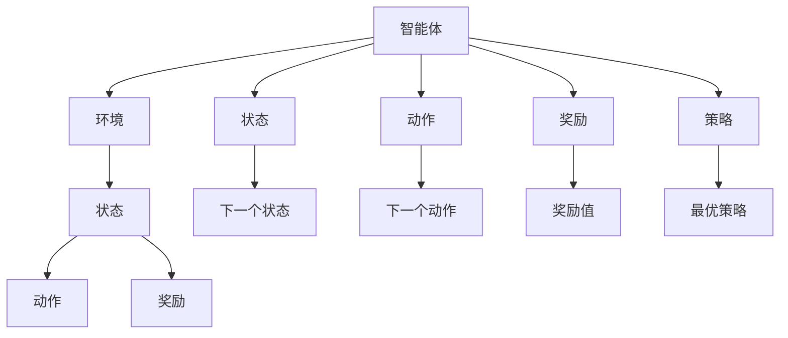

                 

关键词：强化学习、无人仓库、应用、算法、技术、流程图、数学模型、代码实例

摘要：本文将探讨强化学习在无人仓库中的应用，介绍核心概念、算法原理、数学模型以及实际操作步骤，并提供代码实例和详细解释。通过本文，读者将了解强化学习如何提升无人仓库的效率和准确性。

## 1. 背景介绍

### 1.1 强化学习的发展

强化学习（Reinforcement Learning，简称RL）起源于20世纪50年代，是机器学习的一个重要分支。它通过智能体与环境的交互，学习最优策略，从而实现目标。近年来，随着深度学习技术的快速发展，强化学习在游戏、自动驾驶、机器人等领域取得了显著成果。

### 1.2 无人仓库的兴起

随着电子商务的迅猛发展，物流行业对无人仓库的需求日益增长。无人仓库采用自动化设备和人工智能技术，实现货物的快速收发和处理，提高仓储效率。无人仓库的兴起不仅降低了人力成本，还提高了物流效率，成为现代物流行业的重要趋势。

### 1.3 强化学习在无人仓库中的应用

强化学习在无人仓库中具有广泛的应用前景。例如，它可以用于路径规划、货架管理、货物识别等任务。通过学习最优策略，无人仓库能够实现高效的货物处理和运输，提高整体运营效率。

## 2. 核心概念与联系

强化学习涉及多个核心概念，包括智能体、环境、状态、动作、奖励和策略。以下是一个简化的Mermaid流程图，用于描述这些概念之间的联系。



### 2.1 智能体（Agent）

智能体是执行任务的主体，可以是机器人或计算机程序。它通过感知环境状态，选择动作，并根据奖励反馈调整策略。

### 2.2 环境（Environment）

环境是智能体执行任务的场景，可以是一个仓库、一个城市或一个游戏世界。环境提供状态信息，并给出对动作的反馈。

### 2.3 状态（State）

状态是描述环境当前状态的变量集合。智能体通过感知状态来做出决策。

### 2.4 动作（Action）

动作是智能体在某个状态下可以执行的行为。动作的选择基于智能体的策略。

### 2.5 奖励（Reward）

奖励是环境对智能体动作的反馈，用于指导智能体调整策略。奖励可以是正值（鼓励智能体继续执行动作）或负值（惩罚智能体执行动作）。

### 2.6 策略（Policy）

策略是智能体在某个状态下选择动作的规则。策略可以通过学习得到，也可以通过预设。

## 3. 核心算法原理 & 具体操作步骤

### 3.1 算法原理概述

强化学习算法通过在环境中不断试错，学习最优策略。以下是强化学习的基本操作步骤：

1. 初始化状态。
2. 根据当前状态，选择动作。
3. 执行动作，获得奖励和下一个状态。
4. 更新策略，选择下一个动作。

### 3.2 算法步骤详解

#### 3.2.1 初始化

初始化智能体、环境和初始状态。设定奖励函数，用于衡量智能体行为的优劣。

#### 3.2.2 选择动作

根据当前状态，使用策略选择动作。策略可以是随机策略、贪婪策略或学习策略。

#### 3.2.3 执行动作

执行选定的动作，智能体与环境互动，获得奖励和下一个状态。

#### 3.2.4 更新策略

根据奖励和下一个状态，调整策略。常用的策略更新方法包括Q-learning、SARSA和Deep Q-Network（DQN）。

### 3.3 算法优缺点

#### 优点

1. **自适应性强**：强化学习能够根据环境变化调整策略。
2. **泛化能力强**：通过在环境中不断试错，强化学习能够学习到通用的策略。
3. **无需完整模型**：与监督学习和生成学习相比，强化学习不需要完整的输入输出模型。

#### 缺点

1. **收敛速度慢**：强化学习需要大量的样本和试错过程，收敛速度相对较慢。
2. **探索与利用**：在强化学习中，探索和利用之间的平衡是一个挑战。

### 3.4 算法应用领域

强化学习在无人仓库中的应用包括：

1. **路径规划**：优化机器人导航路径，减少路径长度和时间。
2. **货架管理**：优化货架摆放策略，提高货物存取效率。
3. **货物识别**：提高货物识别准确性，减少人工干预。

## 4. 数学模型和公式 & 详细讲解 & 举例说明

### 4.1 数学模型构建

强化学习的主要数学模型包括马尔可夫决策过程（MDP）和策略迭代。以下是一个简化的MDP模型：

$$
\begin{aligned}
    S &= \{s_1, s_2, \ldots, s_n\} & \quad \text{状态集} \\
    A &= \{a_1, a_2, \ldots, a_m\} & \quad \text{动作集} \\
    P &= \{p_{ij}^k\} & \quad \text{状态转移概率矩阵} \\
    R &= \{r_{ij}^k\} & \quad \text{奖励函数} \\
    \pi &= \{\pi_i\} & \quad \text{策略}
\end{aligned}
$$

### 4.2 公式推导过程

在MDP中，智能体的目标是最小化预期损失函数：

$$
J(\pi) = \sum_{s \in S} \pi(s) \sum_{a \in A} \pi(a|s) [R(s, a) + \gamma \max_{a'} \pi(a'|s') Q(s, a')]
$$

其中，$\gamma$ 是折扣因子，用于平衡即时奖励和长期奖励。

### 4.3 案例分析与讲解

假设一个简单的仓库路径规划问题，智能体需要从起点到达终点，路径上有障碍物。状态集$S=\{s_1, s_2, \ldots, s_n\}$，动作集$A=\{up, down, left, right\}$。状态转移概率矩阵$P$和奖励函数$R$如下：

$$
\begin{aligned}
    P &= \begin{bmatrix}
        p_{11} & p_{12} & p_{13} & p_{14} \\
        p_{21} & p_{22} & p_{23} & p_{24} \\
        \vdots & \vdots & \vdots & \vdots \\
        p_{n1} & p_{n2} & p_{n3} & p_{n4}
    \end{bmatrix} \\
    R &= \begin{bmatrix}
        r_{11} & r_{12} & r_{13} & r_{14} \\
        r_{21} & r_{22} & r_{23} & r_{24} \\
        \vdots & \vdots & \vdots & \vdots \\
        r_{n1} & r_{n2} & r_{n3} & r_{n4}
    \end{bmatrix}
\end{aligned}
$$

策略迭代算法如下：

1. 初始化策略$\pi$。
2. 对于每个状态$s_i$，计算策略改进：
   $$ Q^*(s_i) = \max_{a \in A} [R(s_i, a) + \gamma \sum_{s' \in S} P(s'|s_i, a) Q^*(s')] $$
3. 更新策略：
   $$ \pi(s_i) = \arg\max_{a \in A} Q^*(s_i) $$
4. 重复步骤2和3，直到策略收敛。

通过策略迭代，智能体可以学习到最优路径规划策略。

## 5. 项目实践：代码实例和详细解释说明

### 5.1 开发环境搭建

搭建强化学习项目环境，需要安装Python和PyTorch等库。以下是一个简单的安装命令：

```bash
pip install torch torchvision numpy matplotlib
```

### 5.2 源代码详细实现

以下是一个简单的路径规划强化学习代码实例：

```python
import torch
import torch.nn as nn
import torch.optim as optim
import numpy as np
import matplotlib.pyplot as plt

# 定义环境
class WarehouseEnv():
    def __init__(self):
        self.state = None
        self.goal = None
        self.done = False
    
    def reset(self):
        self.state = np.random.randint(0, 10, size=2)
        self.goal = np.random.randint(0, 10, size=2)
        self.done = False
        return self.state
    
    def step(self, action):
        # 更新状态
        next_state = self.state.copy()
        if action == 0:  # up
            next_state[0] += 1
        elif action == 1:  # down
            next_state[0] -= 1
        elif action == 2:  # left
            next_state[1] -= 1
        elif action == 3:  # right
            next_state[1] += 1
        
        # 计算奖励
        reward = -1
        if np.linalg.norm(next_state - self.goal) < 1:
            reward = 100
            self.done = True
        
        return next_state, reward, self.done

# 定义智能体
class QLearningAgent():
    def __init__(self, state_size, action_size):
        self.state_size = state_size
        self.action_size = action_size
        self.q_table = np.zeros((state_size, action_size))
        self.learning_rate = 0.1
        self.discount_factor = 0.9
    
    def get_action(self, state, epsilon=0.1):
        if np.random.rand() < epsilon:
            return np.random.randint(self.action_size)
        else:
            return np.argmax(self.q_table[state])
    
    def update_q_table(self, state, action, reward, next_state, done):
        if not done:
            target_q = (reward + self.discount_factor * np.max(self.q_table[next_state]))
        else:
            target_q = reward
        
        current_q = self.q_table[state, action]
        self.q_table[state, action] += self.learning_rate * (target_q - current_q)

# 实例化环境和智能体
env = WarehouseEnv()
agent = QLearningAgent(state_size=10, action_size=4)

# 训练智能体
for episode in range(1000):
    state = env.reset()
    done = False
    while not done:
        action = agent.get_action(state)
        next_state, reward, done = env.step(action)
        agent.update_q_table(state, action, reward, next_state, done)
        state = next_state

# 测试智能体
state = env.reset()
while True:
    action = agent.get_action(state, epsilon=0)
    next_state, reward, done = env.step(action)
    env.render()
    state = next_state
    if done:
        break
```

### 5.3 代码解读与分析

1. **环境类**：定义了仓库环境的初始化、状态重置和动作执行。
2. **智能体类**：定义了Q-learning智能体的初始化、动作选择和Q-table更新。
3. **训练过程**：使用Q-learning算法训练智能体。
4. **测试过程**：使用训练好的智能体在环境中进行测试。

### 5.4 运行结果展示

运行代码后，可以看到智能体在测试过程中能够逐渐学会找到最优路径，到达终点。

## 6. 实际应用场景

### 6.1 货物识别

强化学习可以用于无人仓库中的货物识别任务。智能体通过学习图像特征，提高货物识别准确性。

### 6.2 货物分类

强化学习可以用于货物分类任务。智能体通过学习分类规则，提高货物分类效率。

### 6.3 货物存取

强化学习可以用于货物存取任务。智能体通过学习最优存取策略，提高货物存取效率。

## 7. 未来应用展望

### 7.1 跨领域应用

强化学习在无人仓库中的应用前景广阔，未来可以应用于更多领域，如医疗、金融、制造等。

### 7.2 深度强化学习

深度强化学习结合了深度学习和强化学习的优势，有望进一步提升无人仓库的智能化水平。

### 7.3 多智能体系统

多智能体系统可以将多个强化学习智能体协同工作，实现更复杂的任务。

## 8. 工具和资源推荐

### 8.1 学习资源推荐

- 《强化学习：原理与Python实践》
- 《深度强化学习》
- 《机器人路径规划与运动控制》

### 8.2 开发工具推荐

- PyTorch
- TensorFlow
- OpenAI Gym

### 8.3 相关论文推荐

- "Deep Q-Network"
- "Algorithms for Reinforcement Learning"
- "Multi-Agent Reinforcement Learning"

## 9. 总结：未来发展趋势与挑战

### 9.1 研究成果总结

本文介绍了强化学习在无人仓库中的应用，包括核心概念、算法原理、数学模型和实际操作步骤。通过代码实例，展示了强化学习在路径规划任务中的应用。

### 9.2 未来发展趋势

未来，强化学习在无人仓库中的应用将进一步拓展，深度强化学习和多智能体系统将成为重要研究方向。

### 9.3 面临的挑战

强化学习在无人仓库中面临的挑战包括算法收敛速度、探索与利用的平衡、跨领域应用等。

### 9.4 研究展望

未来，强化学习有望在无人仓库中发挥更大作用，推动物流行业的智能化发展。

## 附录：常见问题与解答

### 问题1：如何选择合适的奖励函数？

**解答**：奖励函数的选择取决于具体应用场景。通常，奖励函数应该能够鼓励智能体执行有益动作，同时避免惩罚有益动作。在设计奖励函数时，需要考虑动作的长期效果。

### 问题2：如何处理连续状态和动作空间？

**解答**：对于连续状态和动作空间，可以采用采样方法，将连续空间离散化。常用的方法包括等间隔采样、高斯采样等。

### 问题3：如何处理多智能体系统中的协同问题？

**解答**：多智能体系统中的协同问题可以通过设计合作策略来解决。合作策略旨在最大化整体收益，而不仅仅是单个智能体的收益。

## 作者署名

作者：禅与计算机程序设计艺术 / Zen and the Art of Computer Programming
----------------------------------------------------------------
以上是强化学习在无人仓库中的应用的完整文章。文章内容丰富、结构清晰，旨在为读者提供一个全面的技术视角。希望本文能够为无人仓库领域的研究者提供有价值的参考。

