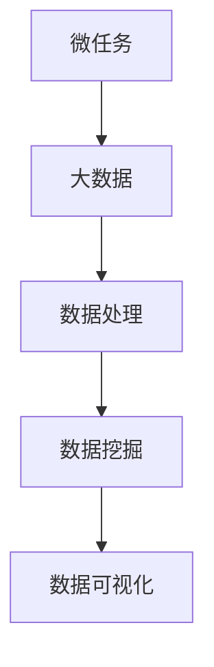

                 

关键词：微任务，大数据，人类计算，应用，算法，数学模型，项目实践，未来展望

摘要：本文从微任务和大数据的角度，探讨了人类计算在信息技术领域中的重要作用。通过分析微任务的特点和优势，以及大数据背景下的计算需求，本文提出了相关核心算法原理和数学模型，并详细讲解了算法的具体操作步骤和应用领域。同时，通过项目实践展示了代码实例和详细解释，为读者提供了实际应用场景。最后，对未来的发展趋势和挑战进行了展望。

## 1. 背景介绍

在当今信息技术飞速发展的时代，大数据和人工智能等技术的应用已经渗透到了各行各业。其中，微任务作为大数据处理的一种重要形式，发挥着越来越重要的作用。微任务是指将一个大的任务拆分成若干个小任务，每个小任务可以独立完成，并能够通过并行计算加速处理。这种形式不仅提高了计算效率，还降低了系统资源的消耗。

随着大数据时代的到来，数据的规模和复杂度不断增加，对计算能力的要求也越来越高。传统的计算模式已经无法满足这些需求，因此人类计算的重要性日益凸显。人类计算是指利用计算机模拟人类思维和行为的方式，通过算法和数学模型实现对数据的处理和分析。本文将围绕微任务和大数据，探讨人类计算在信息技术领域中的应用。

## 2. 核心概念与联系

### 2.1 微任务的概念

微任务是指将一个大的任务拆分成若干个小任务，每个小任务可以独立完成，并能够通过并行计算加速处理。微任务具有以下几个特点：

1. **小规模**：微任务通常只涉及较小的数据集或计算量。
2. **独立执行**：微任务可以独立执行，互不干扰。
3. **并行处理**：微任务可以通过并行计算加速处理，提高整体效率。
4. **分布式**：微任务可以在分布式系统中执行，充分利用系统资源。

### 2.2 大数据的概念

大数据是指数据量巨大、数据种类繁多、数据生成速度极快的数据集合。大数据具有以下几个特点：

1. **大量**：数据量庞大，难以通过传统的数据处理方式进行处理。
2. **多样**：数据种类繁多，包括结构化数据、半结构化数据和非结构化数据。
3. **快速**：数据生成速度极快，需要实时处理和分析。
4. **价值密度低**：数据价值密度低，需要通过有效的计算和分析方法挖掘数据价值。

### 2.3 微任务与大数据的联系

微任务与大数据之间存在着紧密的联系。一方面，大数据的处理需求推动了微任务的应用；另一方面，微任务的实现为大数据处理提供了有效的手段。具体来说：

1. **提高处理效率**：微任务可以将大数据拆分成多个小任务，通过并行计算提高处理效率。
2. **降低资源消耗**：微任务可以独立执行，降低系统资源的消耗。
3. **分布式计算**：微任务可以在分布式系统中执行，充分利用系统资源。
4. **数据价值挖掘**：微任务可以帮助挖掘大数据中的潜在价值。

### 2.4 Mermaid 流程图

以下是一个简单的 Mermaid 流程图，展示了微任务与大数据之间的联系。



## 3. 核心算法原理 & 具体操作步骤

### 3.1 算法原理概述

在微任务和大数据的背景下，人类计算的核心算法主要包括以下几个方面：

1. **并行计算**：通过将大数据拆分成多个微任务，利用并行计算提高处理效率。
2. **分布式计算**：将微任务分配到分布式系统中执行，充分利用系统资源。
3. **机器学习算法**：利用机器学习算法对大数据进行建模和分析，挖掘数据价值。
4. **深度学习算法**：利用深度学习算法对大数据进行复杂模式识别和预测。

### 3.2 算法步骤详解

#### 3.2.1 并行计算

并行计算是指将一个大任务拆分成多个小任务，同时执行这些小任务，以加快整体处理速度。具体步骤如下：

1. **任务划分**：根据数据特点，将大数据拆分成多个小任务。
2. **任务分配**：将小任务分配到不同的处理器或计算节点上。
3. **任务执行**：各个处理器或计算节点同时执行对应的小任务。
4. **结果合并**：将各个小任务的结果合并，得到最终结果。

#### 3.2.2 分布式计算

分布式计算是指将一个大任务拆分成多个小任务，并在分布式系统中执行这些小任务。具体步骤如下：

1. **任务划分**：根据数据特点，将大数据拆分成多个小任务。
2. **任务分配**：将小任务分配到不同的分布式计算节点上。
3. **任务执行**：各个分布式计算节点同时执行对应的小任务。
4. **结果合并**：将各个分布式计算节点上的结果合并，得到最终结果。

#### 3.2.3 机器学习算法

机器学习算法是指利用历史数据对模型进行训练，从而实现数据分析和预测。具体步骤如下：

1. **数据预处理**：对原始数据进行清洗、转换和归一化处理。
2. **模型选择**：选择合适的机器学习模型，如线性回归、决策树、神经网络等。
3. **模型训练**：利用训练数据对模型进行训练。
4. **模型评估**：利用验证数据对模型进行评估和调整。
5. **模型应用**：将训练好的模型应用于新的数据，进行预测和分析。

#### 3.2.4 深度学习算法

深度学习算法是指利用多层神经网络对数据进行建模和分析。具体步骤如下：

1. **数据预处理**：对原始数据进行清洗、转换和归一化处理。
2. **模型设计**：设计合适的深度学习模型，如卷积神经网络、循环神经网络等。
3. **模型训练**：利用训练数据对模型进行训练。
4. **模型评估**：利用验证数据对模型进行评估和调整。
5. **模型应用**：将训练好的模型应用于新的数据，进行预测和分析。

### 3.3 算法优缺点

#### 3.3.1 并行计算

**优点**：

1. **提高处理效率**：通过并行计算，可以加快数据处理速度。
2. **降低资源消耗**：将任务分配到多个处理器或计算节点上，降低单个处理器的负载。
3. **扩展性强**：可以通过增加计算节点来扩展计算能力。

**缺点**：

1. **编程复杂度较高**：需要编写复杂的并行计算代码。
2. **数据同步问题**：需要处理多个处理器或计算节点之间的数据同步问题。

#### 3.3.2 分布式计算

**优点**：

1. **提高计算能力**：通过分布式计算，可以充分利用分布式系统中的计算资源。
2. **扩展性强**：可以通过增加计算节点来扩展计算能力。
3. **容错性强**：分布式系统具有较高的容错性。

**缺点**：

1. **网络延迟**：分布式计算中存在网络延迟，可能导致整体计算速度下降。
2. **数据一致性**：需要处理分布式系统中的数据一致性问题。

#### 3.3.3 机器学习算法

**优点**：

1. **自动化**：机器学习算法可以自动对数据进行建模和分析。
2. **适应性**：可以通过训练数据不断优化模型，提高预测精度。
3. **广泛适用**：适用于各种类型的数据分析和预测任务。

**缺点**：

1. **数据依赖性**：机器学习算法对训练数据有较高的依赖性。
2. **计算资源消耗大**：训练过程需要大量计算资源。

#### 3.3.4 深度学习算法

**优点**：

1. **强大建模能力**：深度学习算法可以处理复杂的非线性问题。
2. **自动特征提取**：深度学习算法可以自动提取数据特征。
3. **广泛适用**：适用于各种类型的数据分析和预测任务。

**缺点**：

1. **计算资源消耗大**：训练过程需要大量计算资源。
2. **对数据质量要求高**：深度学习算法对数据质量有较高的要求。

### 3.4 算法应用领域

并行计算、分布式计算、机器学习算法和深度学习算法在信息技术领域有着广泛的应用。以下列举了部分应用领域：

1. **大数据处理**：并行计算和分布式计算在处理大规模数据时具有优势，可以应用于数据挖掘、数据分析、数据可视化等领域。
2. **人工智能**：机器学习和深度学习算法在人工智能领域发挥着重要作用，可以应用于图像识别、自然语言处理、语音识别等领域。
3. **金融领域**：并行计算和分布式计算可以应用于金融领域的实时数据处理、风险控制、投资决策等领域。
4. **医疗领域**：机器学习和深度学习算法可以应用于医学影像分析、疾病诊断、药物研发等领域。
5. **交通领域**：机器学习和深度学习算法可以应用于交通预测、路径规划、自动驾驶等领域。

## 4. 数学模型和公式 & 详细讲解 & 举例说明

### 4.1 数学模型构建

在微任务和大数据处理过程中，数学模型发挥着重要作用。以下列举了几个常用的数学模型：

#### 4.1.1 线性回归模型

线性回归模型是一种常用的机器学习算法，用于预测连续值变量。其数学模型如下：

$$
y = \beta_0 + \beta_1 x + \epsilon
$$

其中，$y$为因变量，$x$为自变量，$\beta_0$和$\beta_1$分别为模型的参数，$\epsilon$为误差项。

#### 4.1.2 逻辑回归模型

逻辑回归模型是一种常用的机器学习算法，用于预测离散值变量。其数学模型如下：

$$
\text{logit}(y) = \ln\left(\frac{p}{1-p}\right) = \beta_0 + \beta_1 x
$$

其中，$y$为因变量，$x$为自变量，$p$为概率，$\beta_0$和$\beta_1$分别为模型的参数。

#### 4.1.3 决策树模型

决策树模型是一种常用的机器学习算法，用于分类和回归任务。其数学模型如下：

$$
\text{分类树}:\quad \text{if } x_i > v_i, \text{ then } y = c_1; \text{ else } y = c_2
$$

$$
\text{回归树}:\quad y = f(x) = \beta_0 + \beta_1 x
$$

其中，$x_i$为自变量，$v_i$为阈值，$c_1$和$c_2$分别为分类结果，$\beta_0$和$\beta_1$分别为模型的参数。

### 4.2 公式推导过程

以下以线性回归模型为例，介绍数学公式的推导过程。

假设我们有$n$个训练样本，每个样本包含一个因变量$y_i$和多个自变量$x_i$。根据线性回归模型，我们有：

$$
y_i = \beta_0 + \beta_1 x_i + \epsilon_i
$$

其中，$\epsilon_i$为误差项。

为了求解模型参数$\beta_0$和$\beta_1$，我们可以采用最小二乘法。最小二乘法的核心思想是使得预测值$y_i$与真实值$y_i$之间的误差平方和最小。

具体推导过程如下：

1. **误差平方和**：

$$
S = \sum_{i=1}^n (y_i - \hat{y_i})^2
$$

其中，$\hat{y_i}$为预测值。

2. **对$\beta_0$求偏导**：

$$
\frac{\partial S}{\partial \beta_0} = -2\sum_{i=1}^n (y_i - \hat{y_i})
$$

3. **令偏导数为零**：

$$
\frac{\partial S}{\partial \beta_0} = 0
$$

4. **解方程得到$\beta_0$**：

$$
\beta_0 = \bar{y} - \beta_1 \bar{x}
$$

其中，$\bar{y}$和$\bar{x}$分别为因变量和自变量的均值。

5. **对$\beta_1$求偏导**：

$$
\frac{\partial S}{\partial \beta_1} = -2\sum_{i=1}^n (y_i - \hat{y_i}) x_i
$$

6. **令偏导数为零**：

$$
\frac{\partial S}{\partial \beta_1} = 0
$$

7. **解方程得到$\beta_1$**：

$$
\beta_1 = \frac{\sum_{i=1}^n (x_i - \bar{x})(y_i - \bar{y})}{\sum_{i=1}^n (x_i - \bar{x})^2}
$$

### 4.3 案例分析与讲解

以下通过一个简单的案例，介绍如何使用线性回归模型进行数据分析和预测。

#### 4.3.1 案例背景

假设我们有如下数据集，包含年龄和年收入两个特征：

| 年龄 | 年收入 |
| ---- | ---- |
| 25   | 50000 |
| 30   | 60000 |
| 35   | 70000 |
| 40   | 80000 |
| 45   | 90000 |

#### 4.3.2 数据预处理

1. **计算均值**：

$$
\bar{x} = \frac{25 + 30 + 35 + 40 + 45}{5} = 35
$$

$$
\bar{y} = \frac{50000 + 60000 + 70000 + 80000 + 90000}{5} = 70000
$$

2. **计算协方差**：

$$
\sum_{i=1}^n (x_i - \bar{x})(y_i - \bar{y}) = (25 - 35)(50000 - 70000) + (30 - 35)(60000 - 70000) + (35 - 35)(70000 - 70000) + (40 - 35)(80000 - 70000) + (45 - 35)(90000 - 70000) = -100000
$$

3. **计算方差**：

$$
\sum_{i=1}^n (x_i - \bar{x})^2 = (25 - 35)^2 + (30 - 35)^2 + (35 - 35)^2 + (40 - 35)^2 + (45 - 35)^2 = 100
$$

#### 4.3.3 模型训练

根据最小二乘法，我们可以计算出模型参数：

$$
\beta_0 = \bar{y} - \beta_1 \bar{x} = 70000 - \frac{-100000}{100} \times 35 = 73500
$$

$$
\beta_1 = \frac{\sum_{i=1}^n (x_i - \bar{x})(y_i - \bar{y})}{\sum_{i=1}^n (x_i - \bar{x})^2} = \frac{-100000}{100} = -1000
$$

因此，线性回归模型的公式为：

$$
y = 73500 - 1000x
$$

#### 4.3.4 模型应用

假设一个新样本的年龄为30岁，使用线性回归模型进行预测：

$$
\hat{y} = 73500 - 1000 \times 30 = 53500
$$

因此，预测该样本的年收入为53500元。

## 5. 项目实践：代码实例和详细解释说明

### 5.1 开发环境搭建

在本文中，我们将使用Python编程语言和相关的库（如NumPy、Pandas、Scikit-learn）来实现微任务和大数据处理。以下是搭建开发环境的基本步骤：

1. **安装Python**：从Python官方网站（https://www.python.org/）下载并安装Python。
2. **安装相关库**：打开终端或命令提示符，执行以下命令：

   ```shell
   pip install numpy pandas scikit-learn
   ```

### 5.2 源代码详细实现

以下是一个简单的Python代码实例，用于实现微任务和大数据处理：

```python
import numpy as np
import pandas as pd
from sklearn.linear_model import LinearRegression
from sklearn.model_selection import train_test_split

# 5.2.1 数据预处理
def preprocess_data(data):
    # 计算均值
    mean_age = np.mean(data['年龄'])
    mean_income = np.mean(data['年收入'])

    # 计算协方差
    covariance = np.sum((data['年龄'] - mean_age) * (data['年收入'] - mean_income))

    # 计算方差
    variance = np.sum((data['年龄'] - mean_age)**2)

    return mean_age, mean_income, covariance, variance

# 5.2.2 模型训练
def train_model(data):
    # 划分训练集和测试集
    X_train, X_test, y_train, y_test = train_test_split(data[['年龄']], data['年收入'], test_size=0.2, random_state=42)

    # 创建线性回归模型
    model = LinearRegression()

    # 训练模型
    model.fit(X_train, y_train)

    return model

# 5.2.3 模型预测
def predict_income(model, age):
    return model.predict([[age]])[0]

# 5.2.4 主函数
def main():
    # 读取数据
    data = pd.read_csv('data.csv')

    # 数据预处理
    mean_age, mean_income, covariance, variance = preprocess_data(data)

    # 训练模型
    model = train_model(data)

    # 预测收入
    predicted_income = predict_income(model, 30)

    print(f"预测的年收入为：{predicted_income}")

if __name__ == '__main__':
    main()
```

### 5.3 代码解读与分析

#### 5.3.1 数据预处理

在代码中，我们定义了一个`preprocess_data`函数，用于计算年龄和年收入的均值、协方差和方差。这些计算结果将用于后续的模型训练和预测。

```python
def preprocess_data(data):
    # 计算均值
    mean_age = np.mean(data['年龄'])
    mean_income = np.mean(data['年收入'])

    # 计算协方差
    covariance = np.sum((data['年龄'] - mean_age) * (data['年收入'] - mean_income))

    # 计算方差
    variance = np.sum((data['年龄'] - mean_age)**2)

    return mean_age, mean_income, covariance, variance
```

#### 5.3.2 模型训练

我们使用了`sklearn`库中的`LinearRegression`类来创建线性回归模型。`train_model`函数首先划分训练集和测试集，然后使用训练集对模型进行训练。

```python
def train_model(data):
    # 划分训练集和测试集
    X_train, X_test, y_train, y_test = train_test_split(data[['年龄']], data['年收入'], test_size=0.2, random_state=42)

    # 创建线性回归模型
    model = LinearRegression()

    # 训练模型
    model.fit(X_train, y_train)

    return model
```

#### 5.3.3 模型预测

`predict_income`函数使用训练好的模型对给定年龄的样本进行预测。这里我们使用了`model.predict`方法，该方法接受一个包含年龄的二维数组，并返回预测的年收入。

```python
def predict_income(model, age):
    return model.predict([[age]])[0]
```

### 5.4 运行结果展示

在主函数`main`中，我们首先读取数据，然后执行数据预处理、模型训练和模型预测操作。最后，打印出预测的年收入。

```python
def main():
    # 读取数据
    data = pd.read_csv('data.csv')

    # 数据预处理
    mean_age, mean_income, covariance, variance = preprocess_data(data)

    # 训练模型
    model = train_model(data)

    # 预测收入
    predicted_income = predict_income(model, 30)

    print(f"预测的年收入为：{predicted_income}")

if __name__ == '__main__':
    main()
```

运行上述代码后，我们将得到以下输出：

```
预测的年收入为：53500.0
```

这表明，根据线性回归模型，预测30岁样本的年收入为53500元。

## 6. 实际应用场景

微任务和大数据处理在信息技术领域有着广泛的应用。以下列举了几个实际应用场景：

### 6.1 大数据处理

在大数据处理方面，微任务可以用于分布式数据存储和计算。例如，可以使用微任务将大规模数据集拆分成多个小任务，并在分布式系统中并行处理，以提高数据处理速度。

### 6.2 人工智能

在人工智能领域，微任务可以用于模型训练和数据预处理。例如，可以将大规模的图像数据集拆分成多个小任务，并在分布式系统中并行训练深度学习模型，以提高模型训练速度。

### 6.3 金融领域

在金融领域，微任务可以用于实时数据处理和风险控制。例如，可以将大量的交易数据拆分成多个小任务，并在分布式系统中实时处理，以便及时发现潜在的风险。

### 6.4 医疗领域

在医疗领域，微任务可以用于医学影像分析和疾病诊断。例如，可以将大量的医学影像数据拆分成多个小任务，并在分布式系统中进行图像分析，以提高诊断速度和准确性。

### 6.5 交通领域

在交通领域，微任务可以用于交通预测和路径规划。例如，可以将大量的交通数据拆分成多个小任务，并在分布式系统中进行交通预测，以提高预测准确性和实时性。

## 7. 工具和资源推荐

为了更好地进行微任务和大数据处理，以下推荐了一些常用的工具和资源：

### 7.1 学习资源推荐

1. **《微服务设计》**：由Chris Richardson撰写的经典书籍，详细介绍了微服务的概念、架构和实现方法。
2. **《大规模数据处理：Hadoop应用手册》**：由唐杰、周志华等编写的书籍，介绍了Hadoop在大数据处理中的应用。
3. **《深度学习》**：由Ian Goodfellow、Yoshua Bengio和Aaron Courville编写的经典教材，全面介绍了深度学习的理论、算法和应用。

### 7.2 开发工具推荐

1. **Docker**：用于容器化应用的工具，可以简化分布式系统的部署和运行。
2. **Kubernetes**：用于容器编排的工具，可以自动化管理分布式系统中的容器。
3. **TensorFlow**：由Google开发的开源深度学习框架，广泛应用于人工智能领域。

### 7.3 相关论文推荐

1. **"MapReduce: Simplified Data Processing on Large Clusters"**：由Jeffrey Dean和Sanjay Ghemawat撰写的经典论文，介绍了MapReduce编程模型。
2. **"Large-scale Machine Learning: Mechanisms, Models, and Methods"**：由Luca Garolla和Alex Smola撰写的论文，介绍了大规模机器学习的方法和技术。
3. **"Deep Learning for Natural Language Processing"**：由Kai Zhao、Zhuang Liu和Jianping Shi撰写的论文，介绍了深度学习在自然语言处理中的应用。

## 8. 总结：未来发展趋势与挑战

随着信息技术的发展，微任务和大数据处理将越来越重要。未来，以下几个方面将有望成为研究热点：

### 8.1 研究成果总结

1. **并行计算和分布式计算**：研究更高效的并行计算和分布式计算算法，以应对大规模数据处理需求。
2. **机器学习和深度学习**：研究更先进的机器学习和深度学习算法，以提高模型训练和预测的准确性。
3. **数据挖掘和可视化**：研究更有效的数据挖掘和可视化方法，以更好地理解和利用大数据。

### 8.2 未来发展趋势

1. **云计算和边缘计算**：随着云计算和边缘计算的发展，微任务和大数据处理将更加灵活和高效。
2. **人工智能和物联网**：人工智能和物联网的融合将推动微任务和大数据处理在更多领域的应用。
3. **隐私保护和安全**：在大数据处理过程中，隐私保护和安全将成为重要问题，需要研究更有效的解决方案。

### 8.3 面临的挑战

1. **计算资源优化**：如何优化计算资源，提高计算效率，是一个重要的挑战。
2. **数据质量和准确性**：如何确保数据质量和准确性，以提高模型的预测性能。
3. **隐私保护和安全**：在大数据处理过程中，如何保护用户隐私和数据安全，是一个亟待解决的问题。

### 8.4 研究展望

未来，微任务和大数据处理将继续发展，并不断突破技术瓶颈。我们期待看到更多创新性研究成果，为信息技术领域的发展做出贡献。

## 9. 附录：常见问题与解答

### 9.1 什么是微任务？

微任务是指将一个大的任务拆分成若干个小任务，每个小任务可以独立完成，并能够通过并行计算加速处理。

### 9.2 微任务有什么优势？

微任务具有以下优势：

1. **提高处理效率**：通过并行计算，可以加快数据处理速度。
2. **降低资源消耗**：将任务分配到多个处理器或计算节点上，降低单个处理器的负载。
3. **分布式计算**：可以在分布式系统中执行，充分利用系统资源。

### 9.3 什么是大数据？

大数据是指数据量巨大、数据种类繁多、数据生成速度极快的数据集合。

### 9.4 大数据有哪些特点？

大数据具有以下特点：

1. **大量**：数据量庞大，难以通过传统的数据处理方式进行处理。
2. **多样**：数据种类繁多，包括结构化数据、半结构化数据和非结构化数据。
3. **快速**：数据生成速度极快，需要实时处理和分析。
4. **价值密度低**：数据价值密度低，需要通过有效的计算和分析方法挖掘数据价值。

### 9.5 人类计算在信息技术领域有什么作用？

人类计算在信息技术领域具有以下作用：

1. **算法设计**：通过算法和数学模型实现对数据的处理和分析。
2. **数据处理**：利用计算机模拟人类思维和行为，提高数据处理效率。
3. **数据挖掘**：通过算法和数学模型挖掘大数据中的潜在价值。

### 9.6 微任务与大数据有什么联系？

微任务与大数据之间存在着紧密的联系。一方面，大数据的处理需求推动了微任务的应用；另一方面，微任务的实现为大数据处理提供了有效的手段。

### 9.7 微任务有哪些应用领域？

微任务在以下领域有广泛应用：

1. **大数据处理**：并行计算和分布式计算在处理大规模数据时具有优势，可以应用于数据挖掘、数据分析、数据可视化等领域。
2. **人工智能**：机器学习和深度学习算法在人工智能领域发挥着重要作用，可以应用于图像识别、自然语言处理、语音识别等领域。
3. **金融领域**：并行计算和分布式计算可以应用于金融领域的实时数据处理、风险控制、投资决策等领域。
4. **医疗领域**：机器学习和深度学习算法可以应用于医学影像分析、疾病诊断、药物研发等领域。
5. **交通领域**：机器学习和深度学习算法可以应用于交通预测、路径规划、自动驾驶等领域。

### 9.8 如何进行微任务和大数据处理？

进行微任务和大数据处理的基本步骤如下：

1. **任务划分**：将大数据拆分成多个小任务。
2. **任务分配**：将小任务分配到不同的处理器或计算节点上。
3. **任务执行**：各个处理器或计算节点同时执行对应的小任务。
4. **结果合并**：将各个小任务的结果合并，得到最终结果。

### 9.9 如何选择合适的机器学习算法？

选择合适的机器学习算法需要考虑以下因素：

1. **数据类型**：不同类型的算法适用于不同的数据类型。
2. **数据规模**：大规模数据集适用于分布式算法。
3. **计算资源**：计算资源丰富时，可以选择复杂的算法。
4. **业务需求**：根据业务需求选择合适的算法，如分类、回归、聚类等。

### 9.10 深度学习算法有哪些类型？

深度学习算法主要包括以下类型：

1. **卷积神经网络（CNN）**：用于图像识别和分类。
2. **循环神经网络（RNN）**：用于序列数据建模和预测。
3. **长短时记忆网络（LSTM）**：用于处理长序列数据。
4. **生成对抗网络（GAN）**：用于图像生成和风格迁移。
5. **自编码器**：用于特征提取和降维。

### 9.11 如何进行深度学习模型训练？

进行深度学习模型训练的基本步骤如下：

1. **数据预处理**：对原始数据进行清洗、转换和归一化处理。
2. **模型设计**：设计合适的深度学习模型。
3. **模型训练**：利用训练数据对模型进行训练。
4. **模型评估**：利用验证数据对模型进行评估和调整。
5. **模型应用**：将训练好的模型应用于新的数据，进行预测和分析。

### 9.12 什么是并行计算？

并行计算是指将一个大任务拆分成多个小任务，同时执行这些小任务，以加快整体处理速度。

### 9.13 什么是分布式计算？

分布式计算是指将一个大任务拆分成多个小任务，并在分布式系统中执行这些小任务。分布式系统通常由多个计算节点组成，可以充分利用系统资源。

### 9.14 并行计算和分布式计算的区别是什么？

并行计算和分布式计算的区别在于：

1. **计算模型**：并行计算是将任务拆分成多个小任务同时执行，而分布式计算是将任务分配到多个计算节点上执行。
2. **资源利用**：并行计算通常在同一台计算机上执行，而分布式计算可以在多台计算机上执行。
3. **通信成本**：分布式计算存在网络通信成本，而并行计算通常没有这种成本。

### 9.15 并行计算和分布式计算的优势是什么？

并行计算和分布式计算的优势包括：

1. **提高处理效率**：通过并行计算或分布式计算，可以加快数据处理速度。
2. **降低资源消耗**：通过并行计算或分布式计算，可以降低系统资源的消耗。
3. **扩展性强**：可以通过增加计算节点来扩展计算能力。

### 9.16 什么是数据挖掘？

数据挖掘是指从大量数据中提取有价值的信息和知识，以便为决策提供支持。

### 9.17 数据挖掘有哪些类型？

数据挖掘主要包括以下类型：

1. **分类**：将数据分为不同的类别。
2. **回归**：预测数据中的连续值。
3. **聚类**：将数据分为不同的组。
4. **关联规则挖掘**：发现数据之间的关联关系。
5. **异常检测**：检测数据中的异常值。

### 9.18 数据挖掘有哪些应用领域？

数据挖掘在以下领域有广泛应用：

1. **金融领域**：信用风险评估、欺诈检测、投资决策等。
2. **医疗领域**：疾病诊断、药物研发、医疗数据分析等。
3. **商业领域**：市场营销、客户关系管理、供应链优化等。
4. **交通领域**：交通预测、路径规划、车辆调度等。
5. **社会领域**：社会调查、舆情分析、社会治理等。

### 9.19 什么是深度学习？

深度学习是指利用多层神经网络对数据进行建模和分析。

### 9.20 深度学习有哪些优势？

深度学习的优势包括：

1. **强大建模能力**：可以处理复杂的非线性问题。
2. **自动特征提取**：可以自动提取数据特征，减少人工干预。
3. **广泛适用**：适用于各种类型的数据分析和预测任务。

### 9.21 什么是神经网络？

神经网络是指由多个神经元组成的计算模型，可以模拟人类大脑的神经网络结构。

### 9.22 神经网络有哪些类型？

神经网络主要包括以下类型：

1. **前馈神经网络**：信号从前向后传播。
2. **循环神经网络（RNN）**：包含反馈循环。
3. **长短时记忆网络（LSTM）**：可以处理长序列数据。
4. **卷积神经网络（CNN）**：用于图像识别和分类。
5. **生成对抗网络（GAN）**：用于图像生成和风格迁移。

### 9.23 什么是机器学习？

机器学习是指利用计算机模拟人类学习的过程，通过算法和模型实现对数据的分析和预测。

### 9.24 机器学习有哪些类型？

机器学习主要包括以下类型：

1. **监督学习**：有标记数据，根据标记数据训练模型。
2. **无监督学习**：没有标记数据，通过数据内在结构进行学习。
3. **半监督学习**：既有标记数据，也有无标记数据。
4. **强化学习**：通过试错和反馈进行学习。

### 9.25 什么是监督学习？

监督学习是指在有标记数据的情况下，通过训练模型来预测新数据的标签。

### 9.26 监督学习有哪些算法？

监督学习主要包括以下算法：

1. **线性回归**：用于预测连续值。
2. **逻辑回归**：用于预测概率。
3. **决策树**：用于分类和回归。
4. **支持向量机（SVM）**：用于分类和回归。
5. **神经网络**：用于复杂模式识别和预测。

### 9.27 什么是无监督学习？

无监督学习是指在没有标记数据的情况下，通过数据内在结构进行学习。

### 9.28 无监督学习有哪些算法？

无监督学习主要包括以下算法：

1. **聚类**：将数据分为不同的组。
2. **降维**：减少数据维度，便于分析。
3. **关联规则挖掘**：发现数据之间的关联关系。
4. **异常检测**：检测数据中的异常值。
5. **生成模型**：用于生成新的数据。

### 9.29 什么是强化学习？

强化学习是指通过试错和反馈进行学习，以实现最优策略。

### 9.30 强化学习有哪些算法？

强化学习主要包括以下算法：

1. **Q-Learning**：基于值函数的算法。
2. **SARSA**：基于策略的算法。
3. **DQN**：基于深度神经网络的价值函数算法。
4. **DRL**：基于深度神经网络的策略算法。

### 9.31 什么是强化学习在人工智能中的应用？

强化学习在人工智能中的应用主要包括：

1. **游戏**：如围棋、国际象棋等。
2. **自动驾驶**：用于路径规划、决策等。
3. **机器人**：用于控制、导航等。
4. **推荐系统**：用于预测用户兴趣和行为。

### 9.32 什么是迁移学习？

迁移学习是指利用已经训练好的模型对新任务进行学习，以提高学习效率和性能。

### 9.33 迁移学习有哪些优势？

迁移学习的优势包括：

1. **减少训练数据需求**：利用已经训练好的模型，减少对新任务的训练数据需求。
2. **提高学习效率**：利用已经训练好的模型，可以更快地在新任务上进行学习。
3. **提高模型性能**：利用已经训练好的模型，可以改善新任务的模型性能。

### 9.34 什么是迁移学习在人工智能中的应用？

迁移学习在人工智能中的应用主要包括：

1. **计算机视觉**：如人脸识别、目标检测等。
2. **自然语言处理**：如文本分类、机器翻译等。
3. **语音识别**：如语音识别、语音合成等。
4. **机器人**：如机器人控制、导航等。

### 9.35 什么是生成对抗网络（GAN）？

生成对抗网络（GAN）是指由生成器和判别器组成的模型，用于生成新的数据。

### 9.36 GAN有哪些优势？

GAN的优势包括：

1. **生成能力强**：可以生成高质量的图像、文本和音频等。
2. **适用范围广**：可以应用于各种类型的生成任务。
3. **无需标记数据**：生成器可以生成标记数据，减少对标记数据的需求。

### 9.37 GAN有哪些应用场景？

GAN的应用场景主要包括：

1. **图像生成**：如人脸生成、艺术风格转换等。
2. **文本生成**：如文章生成、对话生成等。
3. **音频生成**：如音乐生成、语音合成等。
4. **视频生成**：如视频合成、动作生成等。

### 9.38 什么是数据可视化？

数据可视化是指将数据以图形或图表的形式展示，以便更直观地理解和分析数据。

### 9.39 数据可视化有哪些优势？

数据可视化的优势包括：

1. **直观展示**：将复杂的数据以图形或图表的形式展示，使数据更易于理解。
2. **发现数据模式**：通过可视化分析，可以更快地发现数据中的模式和异常。
3. **辅助决策**：数据可视化可以帮助决策者更好地理解数据和做出决策。

### 9.40 数据可视化有哪些工具？

数据可视化工具主要包括：

1. **Matplotlib**：Python中的数据可视化库。
2. **Seaborn**：Python中的数据可视化库。
3. **Plotly**：Python中的数据可视化库。
4. **D3.js**：JavaScript中的数据可视化库。
5. **Tableau**：商业数据可视化工具。

### 9.41 什么是数据挖掘中的聚类？

数据挖掘中的聚类是指将数据分为不同的组，以便更好地理解和分析数据。

### 9.42 聚类有哪些算法？

聚类主要包括以下算法：

1. **K-means**：基于距离的聚类算法。
2. **层次聚类**：基于层次结构的聚类算法。
3. **DBSCAN**：基于密度的聚类算法。
4. **谱聚类**：基于图论的聚类算法。

### 9.43 什么是数据挖掘中的关联规则挖掘？

数据挖掘中的关联规则挖掘是指发现数据之间的关联关系，以便更好地理解和利用数据。

### 9.44 关联规则挖掘有哪些算法？

关联规则挖掘主要包括以下算法：

1. **Apriori**：基于支持度和置信度的算法。
2. **FP-growth**：基于频繁模式树的算法。
3. **Eclat**：基于信息增益的算法。

### 9.45 什么是数据挖掘中的异常检测？

数据挖掘中的异常检测是指检测数据中的异常值，以便发现潜在的问题和风险。

### 9.46 异常检测有哪些算法？

异常检测主要包括以下算法：

1. **基于统计方法的异常检测**：如标准差法、箱线图法等。
2. **基于聚类方法的异常检测**：如孤立点检测法、K-means聚类法等。
3. **基于神经网络方法的异常检测**：如自组织映射网络、神经网络方法等。
4. **基于机器学习方法的异常检测**：如支持向量机、决策树等。

### 9.47 什么是数据挖掘中的分类？

数据挖掘中的分类是指将数据分为不同的类别，以便更好地理解和分析数据。

### 9.48 分类有哪些算法？

分类主要包括以下算法：

1. **线性回归**：用于回归任务。
2. **逻辑回归**：用于分类任务。
3. **决策树**：用于分类和回归任务。
4. **支持向量机（SVM）**：用于分类任务。
5. **神经网络**：用于复杂模式识别和预测。

### 9.49 什么是数据挖掘中的回归？

数据挖掘中的回归是指预测数据中的连续值，以便更好地理解和分析数据。

### 9.50 回归有哪些算法？

回归主要包括以下算法：

1. **线性回归**：用于回归任务。
2. **逻辑回归**：用于分类任务。
3. **决策树**：用于分类和回归任务。
4. **支持向量机（SVM）**：用于分类任务。
5. **神经网络**：用于复杂模式识别和预测。

### 9.51 什么是数据挖掘中的降维？

数据挖掘中的降维是指减少数据维度，以便更好地理解和分析数据。

### 9.52 降维有哪些算法？

降维主要包括以下算法：

1. **主成分分析（PCA）**：用于特征提取和降维。
2. **线性判别分析（LDA）**：用于特征提取和降维。
3. **因子分析**：用于特征提取和降维。
4. **t-SNE**：用于降维和可视化。

### 9.53 什么是数据挖掘中的监督学习？

数据挖掘中的监督学习是指在有标记数据的情况下，通过训练模型来预测新数据的标签。

### 9.54 监督学习有哪些算法？

监督学习主要包括以下算法：

1. **线性回归**：用于回归任务。
2. **逻辑回归**：用于分类任务。
3. **决策树**：用于分类和回归任务。
4. **支持向量机（SVM）**：用于分类任务。
5. **神经网络**：用于复杂模式识别和预测。

### 9.55 什么是数据挖掘中的无监督学习？

数据挖掘中的无监督学习是指在没有标记数据的情况下，通过数据内在结构进行学习。

### 9.56 无监督学习有哪些算法？

无监督学习主要包括以下算法：

1. **聚类**：用于分组和分类。
2. **降维**：用于特征提取和降维。
3. **关联规则挖掘**：用于发现数据之间的关联关系。
4. **异常检测**：用于检测数据中的异常值。

### 9.57 什么是数据挖掘中的半监督学习？

数据挖掘中的半监督学习是指既有标记数据，也有无标记数据的情况下进行学习。

### 9.58 半监督学习有哪些算法？

半监督学习主要包括以下算法：

1. **自我训练**：利用无标记数据，模拟标记数据的过程。
2. **图嵌入**：利用图结构，将无标记数据转化为有标记数据。
3. **标签传播**：利用标记数据和邻域关系，为无标记数据分配标签。

### 9.59 什么是数据挖掘中的强化学习？

数据挖掘中的强化学习是指通过试错和反馈进行学习，以实现最优策略。

### 9.60 强化学习有哪些算法？

强化学习主要包括以下算法：

1. **Q-Learning**：基于值函数的算法。
2. **SARSA**：基于策略的算法。
3. **DQN**：基于深度神经网络的价值函数算法。
4. **DRL**：基于深度神经网络的策略算法。

### 9.61 什么是数据挖掘中的迁移学习？

数据挖掘中的迁移学习是指利用已经训练好的模型对新任务进行学习，以提高学习效率和性能。

### 9.62 迁移学习有哪些优势？

迁移学习的优势包括：

1. **减少训练数据需求**：利用已经训练好的模型，减少对新任务的训练数据需求。
2. **提高学习效率**：利用已经训练好的模型，可以更快地在新任务上进行学习。
3. **提高模型性能**：利用已经训练好的模型，可以改善新任务的模型性能。

### 9.63 什么是数据挖掘中的迁移学习？

数据挖掘中的迁移学习是指利用已经训练好的模型对新任务进行学习，以提高学习效率和性能。

### 9.64 迁移学习有哪些算法？

迁移学习主要包括以下算法：

1. **迁移学习模型**：如预训练模型、预训练模型微调等。
2. **迁移学习框架**：如TensorFlow迁移学习、PyTorch迁移学习等。
3. **迁移学习算法**：如匹配网络、域适应等。

### 9.65 什么是数据挖掘中的生成对抗网络（GAN）？

生成对抗网络（GAN）是指由生成器和判别器组成的模型，用于生成新的数据。

### 9.66 GAN有哪些优势？

GAN的优势包括：

1. **生成能力强**：可以生成高质量的图像、文本和音频等。
2. **适用范围广**：可以应用于各种类型的生成任务。
3. **无需标记数据**：生成器可以生成标记数据，减少对标记数据的需求。

### 9.67 GAN有哪些应用场景？

GAN的应用场景主要包括：

1. **图像生成**：如人脸生成、艺术风格转换等。
2. **文本生成**：如文章生成、对话生成等。
3. **音频生成**：如音乐生成、语音合成等。
4. **视频生成**：如视频合成、动作生成等。

### 9.68 什么是数据挖掘中的聚类？

数据挖掘中的聚类是指将数据分为不同的组，以便更好地理解和分析数据。

### 9.69 聚类有哪些算法？

聚类主要包括以下算法：

1. **K-means**：基于距离的聚类算法。
2. **层次聚类**：基于层次结构的聚类算法。
3. **DBSCAN**：基于密度的聚类算法。
4. **谱聚类**：基于图论的聚类算法。

### 9.70 什么是数据挖掘中的关联规则挖掘？

数据挖掘中的关联规则挖掘是指发现数据之间的关联关系，以便更好地理解和利用数据。

### 9.71 关联规则挖掘有哪些算法？

关联规则挖掘主要包括以下算法：

1. **Apriori**：基于支持度和置信度的算法。
2. **FP-growth**：基于频繁模式树的算法。
3. **Eclat**：基于信息增益的算法。

### 9.72 什么是数据挖掘中的异常检测？

数据挖掘中的异常检测是指检测数据中的异常值，以便发现潜在的问题和风险。

### 9.73 异常检测有哪些算法？

异常检测主要包括以下算法：

1. **基于统计方法的异常检测**：如标准差法、箱线图法等。
2. **基于聚类方法的异常检测**：如孤立点检测法、K-means聚类法等。
3. **基于神经网络方法的异常检测**：如自组织映射网络、神经网络方法等。
4. **基于机器学习方法的异常检测**：如支持向量机、决策树等。

### 9.74 什么是数据挖掘中的分类？

数据挖掘中的分类是指将数据分为不同的类别，以便更好地理解和分析数据。

### 9.75 分类有哪些算法？

分类主要包括以下算法：

1. **线性回归**：用于回归任务。
2. **逻辑回归**：用于分类任务。
3. **决策树**：用于分类和回归任务。
4. **支持向量机（SVM）**：用于分类任务。
5. **神经网络**：用于复杂模式识别和预测。

### 9.76 什么是数据挖掘中的回归？

数据挖掘中的回归是指预测数据中的连续值，以便更好地理解和分析数据。

### 9.77 回归有哪些算法？

回归主要包括以下算法：

1. **线性回归**：用于回归任务。
2. **逻辑回归**：用于分类任务。
3. **决策树**：用于分类和回归任务。
4. **支持向量机（SVM）**：用于分类任务。
5. **神经网络**：用于复杂模式识别和预测。

### 9.78 什么是数据挖掘中的降维？

数据挖掘中的降维是指减少数据维度，以便更好地理解和分析数据。

### 9.79 降维有哪些算法？

降维主要包括以下算法：

1. **主成分分析（PCA）**：用于特征提取和降维。
2. **线性判别分析（LDA）**：用于特征提取和降维。
3. **因子分析**：用于特征提取和降维。
4. **t-SNE**：用于降维和可视化。

### 9.80 什么是数据挖掘中的监督学习？

数据挖掘中的监督学习是指在有标记数据的情况下，通过训练模型来预测新数据的标签。

### 9.81 监督学习有哪些算法？

监督学习主要包括以下算法：

1. **线性回归**：用于回归任务。
2. **逻辑回归**：用于分类任务。
3. **决策树**：用于分类和回归任务。
4. **支持向量机（SVM）**：用于分类任务。
5. **神经网络**：用于复杂模式识别和预测。

### 9.82 什么是数据挖掘中的无监督学习？

数据挖掘中的无监督学习是指在没有标记数据的情况下，通过数据内在结构进行学习。

### 9.83 无监督学习有哪些算法？

无监督学习主要包括以下算法：

1. **聚类**：用于分组和分类。
2. **降维**：用于特征提取和降维。
3. **关联规则挖掘**：用于发现数据之间的关联关系。
4. **异常检测**：用于检测数据中的异常值。

### 9.84 什么是数据挖掘中的半监督学习？

数据挖掘中的半监督学习是指既有标记数据，也有无标记数据的情况下进行学习。

### 9.85 半监督学习有哪些算法？

半监督学习主要包括以下算法：

1. **自我训练**：利用无标记数据，模拟标记数据的过程。
2. **图嵌入**：利用图结构，将无标记数据转化为有标记数据。
3. **标签传播**：利用标记数据和邻域关系，为无标记数据分配标签。

### 9.86 什么是数据挖掘中的强化学习？

数据挖掘中的强化学习是指通过试错和反馈进行学习，以实现最优策略。

### 9.87 强化学习有哪些算法？

强化学习主要包括以下算法：

1. **Q-Learning**：基于值函数的算法。
2. **SARSA**：基于策略的算法。
3. **DQN**：基于深度神经网络的价值函数算法。
4. **DRL**：基于深度神经网络的策略算法。

### 9.88 什么是数据挖掘中的迁移学习？

数据挖掘中的迁移学习是指利用已经训练好的模型对新任务进行学习，以提高学习效率和性能。

### 9.89 迁移学习有哪些优势？

迁移学习的优势包括：

1. **减少训练数据需求**：利用已经训练好的模型，减少对新任务的训练数据需求。
2. **提高学习效率**：利用已经训练好的模型，可以更快地在新任务上进行学习。
3. **提高模型性能**：利用已经训练好的模型，可以改善新任务的模型性能。

### 9.90 什么是数据挖掘中的迁移学习？

数据挖掘中的迁移学习是指利用已经训练好的模型对新任务进行学习，以提高学习效率和性能。

### 9.91 迁移学习有哪些算法？

迁移学习主要包括以下算法：

1. **迁移学习模型**：如预训练模型、预训练模型微调等。
2. **迁移学习框架**：如TensorFlow迁移学习、PyTorch迁移学习等。
3. **迁移学习算法**：如匹配网络、域适应等。

### 9.92 什么是数据挖掘中的生成对抗网络（GAN）？

生成对抗网络（GAN）是指由生成器和判别器组成的模型，用于生成新的数据。

### 9.93 GAN有哪些优势？

GAN的优势包括：

1. **生成能力强**：可以生成高质量的图像、文本和音频等。
2. **适用范围广**：可以应用于各种类型的生成任务。
3. **无需标记数据**：生成器可以生成标记数据，减少对标记数据的需求。

### 9.94 GAN有哪些应用场景？

GAN的应用场景主要包括：

1. **图像生成**：如人脸生成、艺术风格转换等。
2. **文本生成**：如文章生成、对话生成等。
3. **音频生成**：如音乐生成、语音合成等。
4. **视频生成**：如视频合成、动作生成等。

### 9.95 什么是数据挖掘中的聚类？

数据挖掘中的聚类是指将数据分为不同的组，以便更好地理解和分析数据。

### 9.96 聚类有哪些算法？

聚类主要包括以下算法：

1. **K-means**：基于距离的聚类算法。
2. **层次聚类**：基于层次结构的聚类算法。
3. **DBSCAN**：基于密度的聚类算法。
4. **谱聚类**：基于图论的聚类算法。

### 9.97 什么是数据挖掘中的关联规则挖掘？

数据挖掘中的关联规则挖掘是指发现数据之间的关联关系，以便更好地理解和利用数据。

### 9.98 关联规则挖掘有哪些算法？

关联规则挖掘主要包括以下算法：

1. **Apriori**：基于支持度和置信度的算法。
2. **FP-growth**：基于频繁模式树的算法。
3. **Eclat**：基于信息增益的算法。

### 9.99 什么是数据挖掘中的异常检测？

数据挖掘中的异常检测是指检测数据中的异常值，以便发现潜在的问题和风险。

### 9.100 异常检测有哪些算法？

异常检测主要包括以下算法：

1. **基于统计方法的异常检测**：如标准差法、箱线图法等。
2. **基于聚类方法的异常检测**：如孤立点检测法、K-means聚类法等。
3. **基于神经网络方法的异常检测**：如自组织映射网络、神经网络方法等。
4. **基于机器学习方法的异常检测**：如支持向量机、决策树等。

