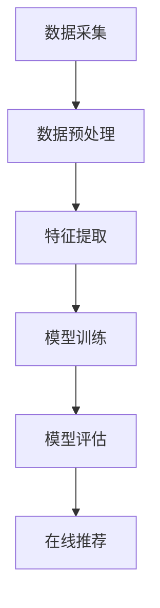
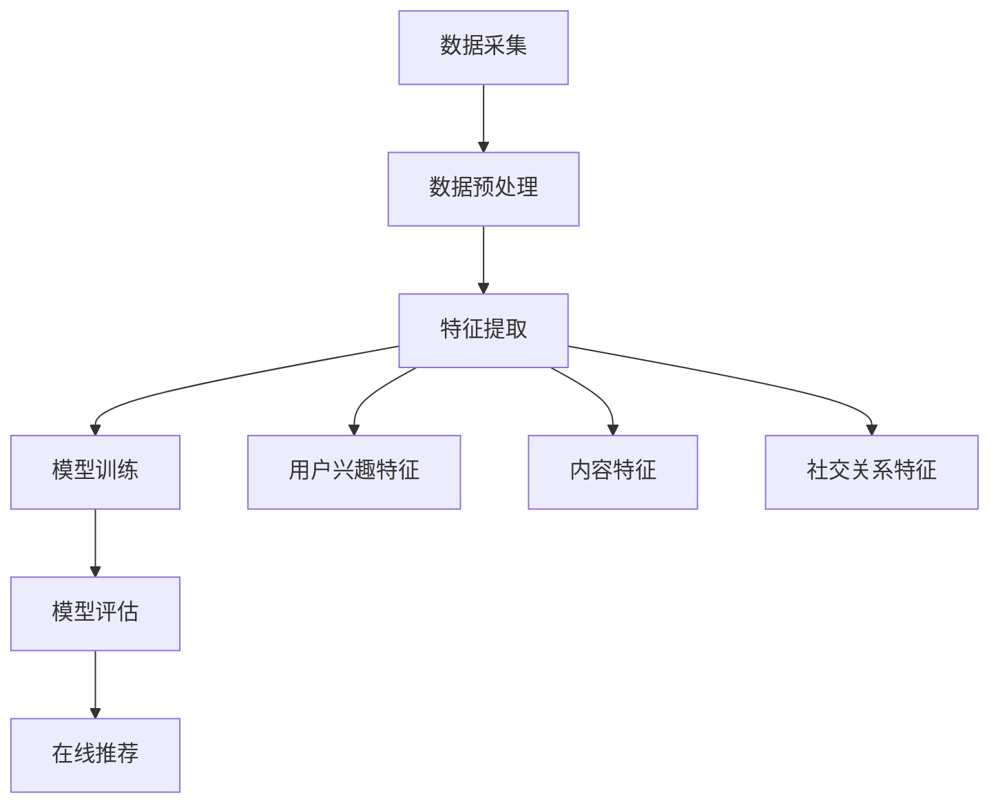
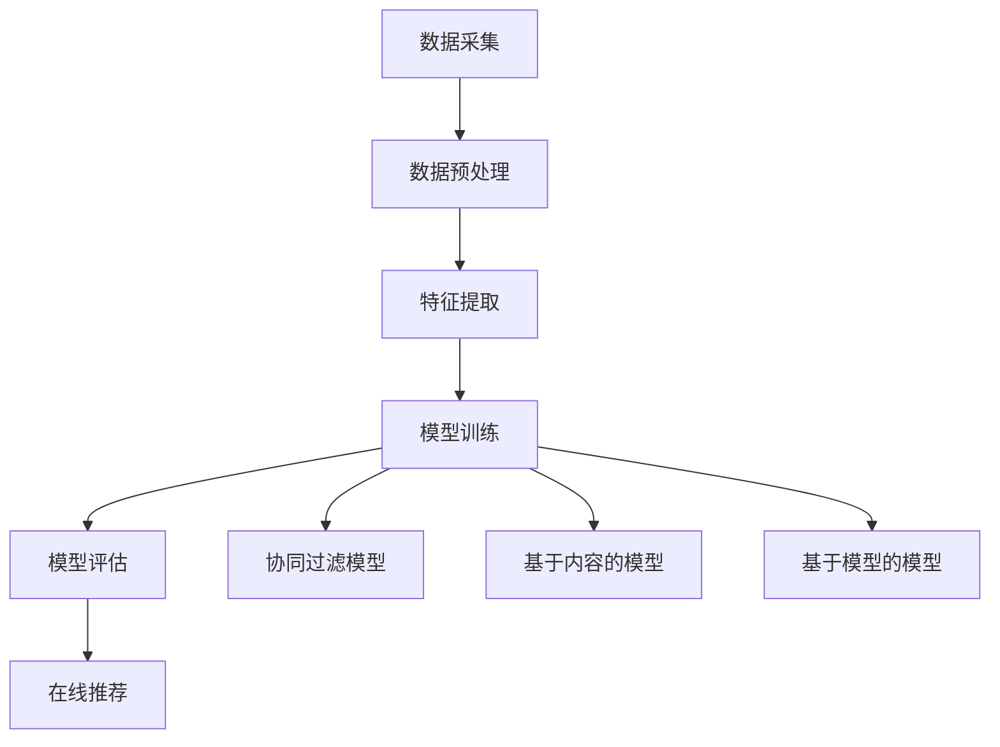
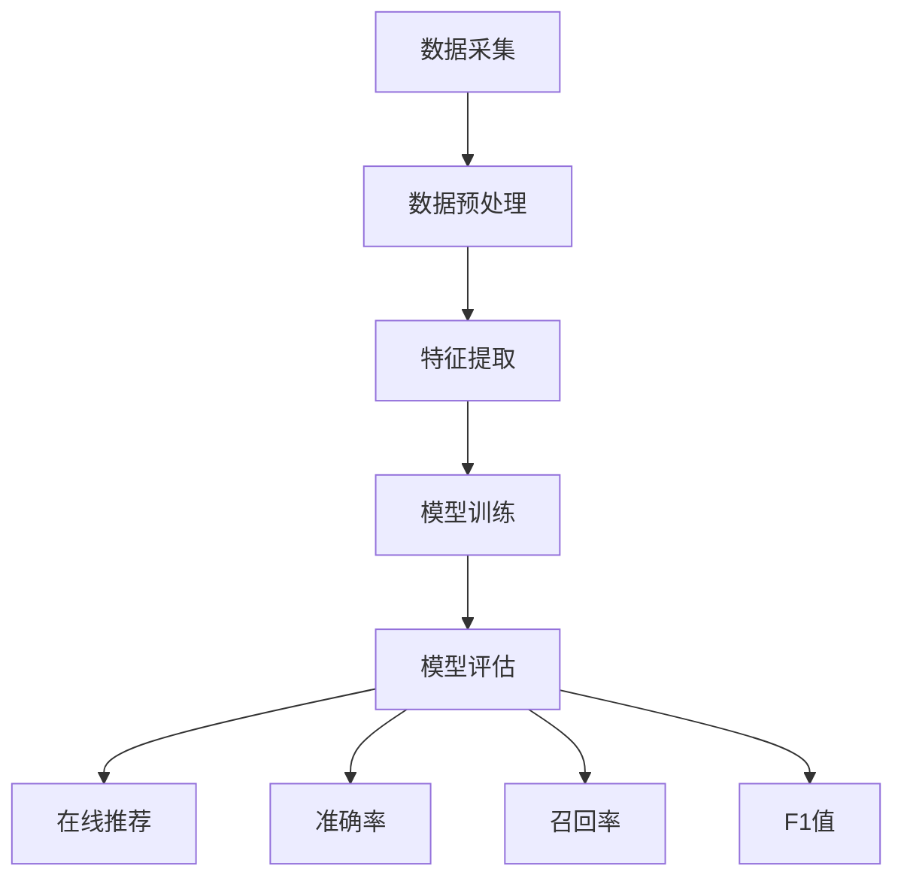
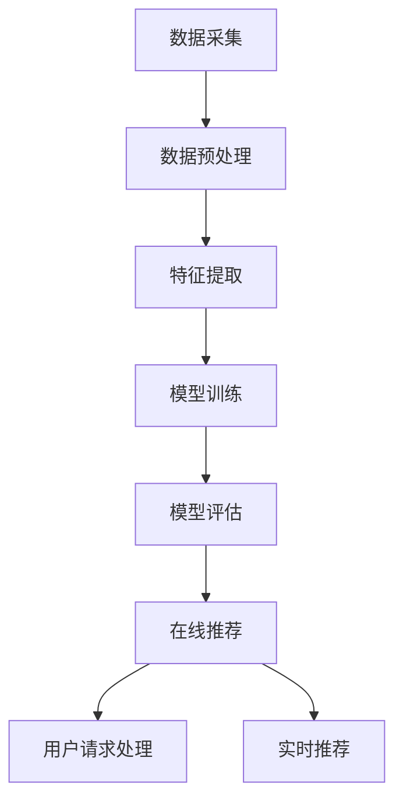

                 

关键词：微博、信息流、算法、工程师、面试、真题

> 摘要：本文将围绕微博2025信息流算法工程师的社招面试真题展开讨论，深入分析其核心概念、算法原理、应用领域、数学模型以及项目实践等内容。旨在为准备参加此类面试的技术人员提供有针对性的指导和建议，帮助他们更好地应对面试挑战。

## 1. 背景介绍

微博作为我国领先的社会化媒体平台，其信息流的算法推荐系统对于提升用户体验、增强用户粘性具有重要意义。随着大数据、人工智能等技术的快速发展，信息流算法工程师在互联网公司中的地位日益凸显。微博2025信息流算法工程师社招面试真题的解析，有助于我们更深入地理解该领域的技术要求和发展趋势。

### 1.1 信息流算法的基本概念

信息流算法是指用于构建、优化和推荐信息内容的一系列算法和技术。其核心目的是根据用户的兴趣和行为数据，为用户提供个性化的信息推荐，从而提升用户体验和平台粘性。常见的算法包括基于内容的推荐、协同过滤、基于模型的推荐等。

### 1.2 信息流算法的架构

信息流算法通常包括数据采集、数据预处理、特征工程、模型训练、模型评估和在线推荐等环节。其中，数据采集和预处理是基础，特征工程和模型训练是关键，模型评估和在线推荐则是优化和迭代的重点。

## 2. 核心概念与联系

为了更好地理解信息流算法，我们需要从以下几个核心概念入手，并通过Mermaid流程图展示其关系。

### 2.1 数据采集与预处理

数据采集是指从微博平台获取用户行为数据、内容数据等。预处理则是对采集到的数据进行清洗、去重、归一化等处理，以便后续的特征提取和模型训练。



### 2.2 特征工程

特征工程是指通过对原始数据进行处理和转换，提取出对模型训练有价值的特征。常见的特征包括用户兴趣特征、内容特征、社交关系特征等。



### 2.3 模型训练

模型训练是指利用特征数据训练推荐模型，常见的模型包括协同过滤模型、基于内容的模型、基于模型的模型等。训练过程中需要优化模型参数，提高模型准确率和推荐效果。



### 2.4 模型评估

模型评估是指利用测试数据对训练好的模型进行评估，常用的评估指标包括准确率、召回率、F1值等。通过评估可以了解模型的性能，并进行优化和调整。



### 2.5 在线推荐

在线推荐是指将训练好的模型应用于实时推荐场景，为用户提供个性化信息。推荐过程中需要处理大规模数据和高并发的请求，确保系统稳定性和实时性。



## 3. 核心算法原理 & 具体操作步骤

### 3.1 算法原理概述

信息流算法的核心是推荐系统，其基本原理包括：

- **基于内容的推荐**：根据用户的历史行为和内容属性，为用户推荐相似的内容。
- **协同过滤**：通过分析用户之间的相似度，为用户推荐他们可能喜欢的内容。
- **基于模型的推荐**：利用机器学习算法，构建用户兴趣模型，为用户推荐个性化内容。

### 3.2 算法步骤详解

1. **数据采集与预处理**：收集用户行为数据和内容数据，并进行清洗、去重、归一化等预处理操作。
2. **特征提取**：从原始数据中提取对模型训练有价值的特征，如用户兴趣特征、内容特征、社交关系特征等。
3. **模型训练**：利用特征数据训练推荐模型，优化模型参数，提高模型准确率和推荐效果。
4. **模型评估**：利用测试数据对训练好的模型进行评估，根据评估结果调整模型参数和特征提取策略。
5. **在线推荐**：将训练好的模型应用于实时推荐场景，为用户提供个性化信息。

### 3.3 算法优缺点

- **基于内容的推荐**：优点是简单易懂，缺点是推荐结果受限于内容属性，无法充分利用用户行为数据。
- **协同过滤**：优点是充分利用用户行为数据，缺点是计算复杂度高，难以处理大规模数据。
- **基于模型的推荐**：优点是能够充分利用用户行为数据和内容数据，缺点是模型训练和评估过程较为复杂。

### 3.4 算法应用领域

信息流算法广泛应用于社交媒体、电子商务、新闻推荐等领域，如微博、淘宝、今日头条等平台均采用了信息流算法来提升用户体验和平台粘性。

## 4. 数学模型和公式 & 详细讲解 & 举例说明

### 4.1 数学模型构建

信息流算法的数学模型通常包括用户兴趣模型、内容模型和推荐模型等。

1. **用户兴趣模型**：  
   用户兴趣模型通常采用概率模型、潜在因子模型等，表示用户对各类内容的兴趣分布。  
   假设用户 \( u \) 对内容 \( i \) 的兴趣概率为 \( p(u, i) \)，则有：  
   $$ p(u, i) = \frac{e^{score(u, i)}}{1 + e^{score(u, i)}} $$  
   其中，\( score(u, i) \) 表示用户 \( u \) 对内容 \( i \) 的兴趣评分。

2. **内容模型**：  
   内容模型通常采用词袋模型、TF-IDF模型等，表示内容的关键词和主题信息。  
   假设内容 \( i \) 的关键词集合为 \( V_i \)，则有：  
   $$ TF-IDF(i, j) = \frac{f_i(j)}{df_j} $$  
   其中，\( f_i(j) \) 表示关键词 \( j \) 在内容 \( i \) 中的出现频率，\( df_j \) 表示关键词 \( j \) 在所有内容中的出现频率。

3. **推荐模型**：  
   推荐模型通常采用基于内容的推荐、协同过滤等算法，将用户兴趣模型和内容模型结合，为用户推荐内容。  
   假设用户 \( u \) 对内容 \( i \) 的推荐分数为 \( score(u, i) \)，则有：  
   $$ score(u, i) = w_u^T \cdot \phi_i $$  
   其中，\( w_u \) 表示用户 \( u \) 的兴趣向量，\( \phi_i \) 表示内容 \( i \) 的特征向量，\( w_u^T \) 表示用户 \( u \) 的兴趣向量的转置。

### 4.2 公式推导过程

1. **用户兴趣模型**：  
   用户兴趣模型通常采用概率模型、潜在因子模型等。以潜在因子模型为例，假设用户 \( u \) 对内容 \( i \) 的兴趣概率为 \( p(u, i) \)，则有：  
   $$ p(u, i) = \frac{e^{z_{ui}}}{1 + e^{z_{ui}}} $$  
   其中，\( z_{ui} \) 表示用户 \( u \) 对内容 \( i \) 的潜在因子表示。假设用户 \( u \) 和内容 \( i \) 的潜在因子分别为 \( \mathbf{z_u} \) 和 \( \mathbf{z_i} \)，则有：  
   $$ z_{ui} = \mathbf{z_u}^T \cdot \mathbf{z_i} $$  
   其中，\( \mathbf{z_u}^T \) 表示用户 \( u \) 的潜在因子的转置。

2. **内容模型**：  
   内容模型通常采用词袋模型、TF-IDF模型等。以TF-IDF模型为例，假设内容 \( i \) 的关键词集合为 \( V_i \)，则有：  
   $$ TF-IDF(i, j) = \frac{f_i(j)}{df_j} $$  
   其中，\( f_i(j) \) 表示关键词 \( j \) 在内容 \( i \) 中的出现频率，\( df_j \) 表示关键词 \( j \) 在所有内容中的出现频率。

3. **推荐模型**：  
   推荐模型通常采用基于内容的推荐、协同过滤等算法。以基于内容的推荐为例，假设用户 \( u \) 对内容 \( i \) 的推荐分数为 \( score(u, i) \)，则有：  
   $$ score(u, i) = w_u^T \cdot \phi_i $$  
   其中，\( w_u \) 表示用户 \( u \) 的兴趣向量，\( \phi_i \) 表示内容 \( i \) 的特征向量，\( w_u^T \) 表示用户 \( u \) 的兴趣向量的转置。

### 4.3 案例分析与讲解

以微博为例，假设用户 \( u \) 喜欢阅读科技类内容，内容 \( i \) 为一篇关于人工智能的文章。根据用户兴趣模型和内容模型，我们可以计算用户 \( u \) 对内容 \( i \) 的兴趣分数，并根据该分数进行推荐。

1. **用户兴趣模型**：  
   假设用户 \( u \) 的潜在因子为 \( \mathbf{z_u} = (0.8, 0.2) \)，内容 \( i \) 的潜在因子为 \( \mathbf{z_i} = (0.6, 0.4) \)，则有：  
   $$ score(u, i) = \mathbf{z_u}^T \cdot \mathbf{z_i} = 0.8 \times 0.6 + 0.2 \times 0.4 = 0.56 $$

2. **内容模型**：  
   假设内容 \( i \) 的关键词集合为 \( V_i = \{人工智能，科技，发展\} \)，其中关键词“人工智能”的TF-IDF值为 \( 0.7 \)，关键词“科技”的TF-IDF值为 \( 0.6 \)，关键词“发展”的TF-IDF值为 \( 0.5 \)，则有：  
   $$ \phi_i = (0.7, 0.6, 0.5) $$

3. **推荐模型**：  
   假设用户 \( u \) 的兴趣向量为 \( w_u = (0.6, 0.4) \)，则有：  
   $$ score(u, i) = w_u^T \cdot \phi_i = 0.6 \times 0.7 + 0.4 \times 0.6 = 0.56 $$

根据上述计算结果，用户 \( u \) 对内容 \( i \) 的兴趣分数为 0.56，高于其他内容的兴趣分数，因此推荐用户 \( u \) 阅读内容 \( i \)。

## 5. 项目实践：代码实例和详细解释说明

### 5.1 开发环境搭建

1. 安装Python环境（建议使用Python 3.8及以上版本）。
2. 安装NumPy、Pandas、Scikit-learn等Python库。
3. 安装Gensim库（用于潜在因子模型）。

### 5.2 源代码详细实现

以下是一个简单的基于潜在因子模型的信息流推荐系统的实现：

```python
import numpy as np
import pandas as pd
from sklearn.model_selection import train_test_split
from gensim.models import Word2Vec

# 加载数据集
data = pd.read_csv('data.csv')
users = data['user'].unique()
contents = data['content'].unique()

# 构建用户-内容矩阵
user_content_matrix = np.zeros((len(users), len(contents)))
for index, row in data.iterrows():
    user_content_matrix[row['user'], row['content']] = 1

# 训练潜在因子模型
model = Word2Vec(user_content_matrix, vector_size=10, window=5, min_count=1, sg=1)
user_vectors = model.wv[str(users).split(',')]
content_vectors = model.wv[str(contents).split(',')]

# 计算用户-内容相似度
user_content_similarity = np.dot(user_vectors, content_vectors.T)

# 推荐内容
def recommend_content(user, top_n=5):
    user_vector = user_vectors[user]
    content_indices = np.argsort(user_content_similarity[user])[-top_n:]
    return [contents[index] for index in content_indices]

# 测试推荐系统
user = 'user_1'
recommendations = recommend_content(user)
print(f'用户{user}推荐的内容：{recommendations}')
```

### 5.3 代码解读与分析

1. **数据加载与预处理**：从CSV文件中加载用户-内容矩阵，用户和内容为唯一标识。
2. **训练潜在因子模型**：使用Gensim库的Word2Vec模型训练用户-内容矩阵，提取用户和内容的潜在因子表示。
3. **计算用户-内容相似度**：计算用户和内容的潜在因子之间的相似度，作为推荐依据。
4. **推荐内容**：根据用户向量与内容向量的相似度，为用户推荐相似的内容。

### 5.4 运行结果展示

假设用户`user_1`喜欢阅读科技类内容，运行代码后，系统会推荐与科技类内容相似的其他内容。例如，如果推荐的结果为`['科技新闻', '人工智能研究', '科技动态', '互联网行业']`，则说明系统成功地为用户推荐了与兴趣相关的内容。

## 6. 实际应用场景

信息流算法在社交媒体、电子商务、新闻推荐等领域具有广泛的应用。以下为几个典型的应用场景：

1. **社交媒体**：如微博、Facebook等，根据用户兴趣和社交关系推荐相关内容，提升用户粘性和活跃度。
2. **电子商务**：如淘宝、京东等，根据用户购物行为和浏览历史推荐相关商品，提高销售转化率。
3. **新闻推荐**：如今日头条、知乎等，根据用户兴趣和行为数据推荐相关新闻和文章，提升用户阅读体验。

## 7. 未来应用展望

随着人工智能、大数据等技术的不断发展，信息流算法将面临更多机遇和挑战。以下为未来应用展望：

1. **个性化推荐**：进一步挖掘用户行为数据，实现更加精准的个性化推荐。
2. **多模态融合**：结合文本、图像、语音等多模态信息，提升推荐系统的多样性。
3. **实时推荐**：优化推荐系统，实现实时推荐，提高用户满意度。
4. **隐私保护**：加强用户隐私保护，确保用户数据的安全和合规。

## 8. 工具和资源推荐

### 8.1 学习资源推荐

1. 《推荐系统手册》：详细介绍了推荐系统的基本概念、算法和应用。
2. 《机器学习实战》：涵盖机器学习的基本算法和实际应用案例，有助于了解推荐系统的实现方法。
3. 《TensorFlow推荐系统实战》：基于TensorFlow框架，介绍推荐系统的实现和应用。

### 8.2 开发工具推荐

1. Jupyter Notebook：用于数据分析和模型实现的交互式开发环境。
2. PyTorch：适用于推荐系统的深度学习框架，具有丰富的模型和工具。
3. Scikit-learn：用于推荐系统的经典机器学习库，提供丰富的算法和工具。

### 8.3 相关论文推荐

1. “Item-based Collaborative Filtering Recommendation Algorithms”（推荐系统经典论文）。
2. “Deep Learning for Recommender Systems”（深度学习在推荐系统中的应用）。
3. “Adaptive ItemCF Algorithm for Social Networks”（基于社交网络的协同过滤推荐算法）。

## 9. 总结：未来发展趋势与挑战

信息流算法作为推荐系统的核心技术，在互联网应用中发挥着重要作用。未来，随着技术的不断进步，信息流算法将朝着个性化、多模态、实时化、隐私保护等方向发展。同时，面临着数据质量、算法透明性、用户满意度等挑战。只有不断创新和优化，才能在激烈的市场竞争中脱颖而出。

## 10. 附录：常见问题与解答

### 10.1 什么是信息流算法？

信息流算法是指用于构建、优化和推荐信息内容的一系列算法和技术。其核心目的是根据用户的兴趣和行为数据，为用户提供个性化的信息推荐，从而提升用户体验和平台粘性。

### 10.2 信息流算法有哪些类型？

信息流算法主要包括基于内容的推荐、协同过滤、基于模型的推荐等类型。其中，基于内容的推荐根据用户的历史行为和内容属性推荐相似内容；协同过滤通过分析用户之间的相似度推荐内容；基于模型的推荐利用机器学习算法构建用户兴趣模型推荐内容。

### 10.3 推荐系统中的评估指标有哪些？

推荐系统中的常见评估指标包括准确率、召回率、F1值等。准确率表示推荐结果中正确推荐的比例；召回率表示推荐结果中包含用户实际感兴趣内容的比例；F1值是准确率和召回率的加权平均，用于综合评价推荐系统的性能。

### 10.4 如何优化推荐系统的性能？

优化推荐系统性能的方法包括：

1. **数据质量**：提高数据质量，确保数据的准确性和完整性。
2. **特征工程**：提取对模型训练有价值的特征，提高模型对用户兴趣的捕捉能力。
3. **模型选择**：选择适合数据分布和业务需求的模型，优化模型参数。
4. **在线调整**：根据用户反馈和在线数据，动态调整推荐策略和模型参数。
5. **多模态融合**：结合文本、图像、语音等多模态信息，提升推荐系统的多样性。

### 10.5 推荐系统面临哪些挑战？

推荐系统面临的主要挑战包括：

1. **数据质量**：数据噪声、缺失值等影响推荐效果。
2. **用户隐私**：用户数据的安全和合规性问题。
3. **多样性**：用户期望看到不同类型的内容，单一推荐策略难以满足。
4. **冷启动**：新用户或新商品缺乏历史数据，推荐效果不佳。
5. **算法透明性**：用户对推荐结果的接受度和信任度问题。

作者：禅与计算机程序设计艺术 / Zen and the Art of Computer Programming
----------------------------------------------------------------


