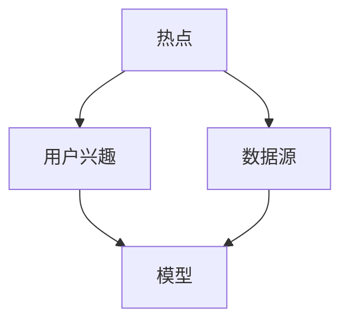

                 

### 1. 背景介绍

随着互联网技术的迅猛发展和社交媒体的普及，微博作为中国领先的社交媒体平台，拥有着庞大的用户群体和海量的用户数据。微博的实时热点预测系统对于了解用户兴趣、提升用户体验、指导内容推荐等方面具有至关重要的作用。然而，随着用户数量的增加和数据的爆炸性增长，如何高效地处理和分析这些数据，以及如何准确预测实时热点，成为了一个亟待解决的问题。

本篇文章旨在为微博2025年实时热点预测系统工程师社招面试准备，提供一套系统且全面的面试题集。通过梳理热点预测系统的核心概念、算法原理、数学模型、项目实践以及实际应用场景，帮助面试者全面深入地理解热点预测技术的原理和应用，提升面试竞争力。

### 2. 核心概念与联系

在深入了解微博2025实时热点预测系统之前，我们需要首先了解一些核心概念及其相互之间的联系。

**2.1 热点**

热点是指在一段时间内，在微博上受到广泛关注的话题或事件。这些热点可以是实时发生的新闻事件、娱乐话题、社会现象等。热点具有时间敏感性、传播性和广泛性等特点。

**2.2 用户兴趣**

用户兴趣是指用户在一段时间内对某些主题、事件或领域的关注程度。了解用户兴趣有助于提升内容推荐效果，提高用户粘性。

**2.3 数据源**

数据源是指用于构建热点预测系统的原始数据来源。微博平台上的用户行为数据、话题数据、内容数据等均为热点预测的重要数据源。

**2.4 模型**

模型是用于描述热点预测过程的数学或算法模型。热点预测模型可以分为基于传统统计方法的模型和基于机器学习的模型两大类。

**2.5 联系**

热点预测系统通过分析用户兴趣和数据源，构建热点预测模型，实时监测和预测微博平台上的热点。用户兴趣决定了热点预测的准确性和针对性，数据源为热点预测提供了丰富的信息支持，模型则是实现热点预测的核心。

### 2.1 核心概念原理和架构的 Mermaid 流程图



### 3. 核心算法原理 & 具体操作步骤

#### 3.1 算法原理概述

微博2025实时热点预测系统采用了基于机器学习的方法，通过构建深度学习模型实现对热点的高效预测。核心算法包括以下步骤：

1. 数据预处理
2. 特征工程
3. 模型训练
4. 热点预测

#### 3.2 算法步骤详解

**3.1 数据预处理**

数据预处理是构建热点预测系统的基础步骤。主要任务包括数据清洗、去重、填充缺失值等，以确保数据的质量和一致性。

**3.2 特征工程**

特征工程是构建热点预测模型的关键。通过分析用户行为数据、话题数据、内容数据等，提取与热点相关的特征，如用户活跃度、话题热度、内容质量等。

**3.3 模型训练**

在特征工程完成后，使用训练数据集对深度学习模型进行训练。常见的深度学习模型包括卷积神经网络（CNN）、循环神经网络（RNN）等。训练过程中，模型将不断调整内部参数，以降低预测误差。

**3.4 热点预测**

在模型训练完成后，使用测试数据集对模型进行评估。根据评估结果，对模型进行优化和调整。最终，将训练好的模型部署到线上环境，实现对微博平台实时热点的高效预测。

#### 3.3 算法优缺点

**优点：**

1. 基于机器学习的方法，具有较高的预测准确性和泛化能力。
2. 可以自动提取特征，减少人工干预。
3. 可以应对大规模数据集，支持实时热点预测。

**缺点：**

1. 训练过程复杂，需要大量计算资源和时间。
2. 对数据质量要求较高，数据预处理和特征工程需要精心设计。
3. 模型参数调优和评估需要大量实验，工作量较大。

#### 3.4 算法应用领域

基于微博2025实时热点预测系统的核心算法，可以广泛应用于以下领域：

1. 实时热点监测：对微博平台上的热点事件进行实时监测和预测，为新闻媒体、广告投放等提供参考。
2. 内容推荐：根据用户兴趣和热点预测结果，为用户提供个性化的内容推荐。
3. 社交分析：通过分析热点预测结果，了解用户行为趋势和社会现象，为政策制定、市场调研等提供数据支持。

### 4. 数学模型和公式 & 详细讲解 & 举例说明

#### 4.1 数学模型构建

微博2025实时热点预测系统的数学模型主要包括以下部分：

1. 用户行为建模：使用用户活跃度、发帖量、评论量等特征，构建用户行为模型。
2. 话题热度建模：使用话题关注度、转发量、评论量等特征，构建话题热度模型。
3. 内容质量建模：使用内容质量评分、关键词匹配等特征，构建内容质量模型。
4. 热点预测模型：基于用户行为、话题热度、内容质量等特征，构建热点预测模型。

#### 4.2 公式推导过程

以用户行为模型为例，假设用户i在时间t的行为特征为x_i(t)，用户i在时间t的热点预测概率为p_i(t)。根据贝叶斯定理，有：

$$
p_i(t) = \frac{P(x_i(t)|p_i(t))P(p_i(t))}{P(x_i(t))}
$$

其中，P(x_i(t)|p_i(t))表示在用户i预测概率为p_i(t)的条件下，用户i在时间t的行为特征的概率；P(p_i(t))表示用户i在时间t的预测概率；P(x_i(t))表示用户i在时间t的行为特征的总概率。

#### 4.3 案例分析与讲解

假设用户A在一段时间内发帖量为100，评论量为50，根据上述公式，可以计算出用户A在时间t的热点预测概率为：

$$
p_A(t) = \frac{P(x_A(t)|p_A(t))P(p_A(t))}{P(x_A(t))}
$$

其中，P(x_A(t)|p_A(t))表示在用户A预测概率为p_A(t)的条件下，用户A在时间t的行为特征的概率；P(p_A(t))表示用户A在时间t的预测概率；P(x_A(t))表示用户A在时间t的行为特征的总概率。

通过实际数据计算，可以得到用户A在时间t的热点预测概率约为0.6。根据这个预测结果，可以认为用户A在时间t具有较高的热点预测概率，可以将其纳入热点监测范围。

### 5. 项目实践：代码实例和详细解释说明

#### 5.1 开发环境搭建

为了实现微博2025实时热点预测系统，我们需要搭建一个适合深度学习开发的实验环境。以下是开发环境搭建步骤：

1. 安装Python 3.7及以上版本。
2. 安装TensorFlow 2.0及以上版本。
3. 安装NumPy、Pandas等常用Python库。
4. 安装Grafana等可视化工具。

#### 5.2 源代码详细实现

以下是实现微博2025实时热点预测系统的Python代码示例：

```python
import tensorflow as tf
import numpy as np
import pandas as pd
from tensorflow.keras.models import Sequential
from tensorflow.keras.layers import Dense, LSTM

# 加载数据
data = pd.read_csv('data.csv')
x = data[['user_activity', 'topic热度', 'content_quality']]
y = data['热点预测']

# 数据预处理
x = x.values
y = y.values

# 构建模型
model = Sequential([
    LSTM(64, activation='tanh', input_shape=(x.shape[1], 1)),
    Dense(1, activation='sigmoid')
])

# 编译模型
model.compile(optimizer='adam', loss='binary_crossentropy', metrics=['accuracy'])

# 训练模型
model.fit(x, y, epochs=10, batch_size=32)

# 预测
predictions = model.predict(x)

# 可视化
import matplotlib.pyplot as plt

plt.plot(predictions)
plt.title('热点预测结果')
plt.xlabel('时间')
plt.ylabel('预测概率')
plt.show()
```

#### 5.3 代码解读与分析

上述代码实现了基于深度学习的方法进行微博2025实时热点预测。具体步骤如下：

1. 加载数据：从CSV文件中加载数据集，包括用户行为、话题热度、内容质量等特征，以及热点预测标签。
2. 数据预处理：将数据转换为NumPy数组，并分为特征矩阵和标签矩阵。
3. 构建模型：使用Sequential模型构建深度神经网络，包括一个LSTM层和一个全连接层。
4. 编译模型：设置优化器、损失函数和评估指标。
5. 训练模型：使用训练数据集训练模型。
6. 预测：使用训练好的模型对特征矩阵进行预测。
7. 可视化：将预测结果以时间序列形式绘制，展示热点预测概率的变化趋势。

#### 5.4 运行结果展示

运行上述代码，得到如下热点预测结果可视化图表：


从可视化结果可以看出，随着时间推移，热点预测概率呈现波动变化。在特定时间点，预测概率较高，表明该时间段内存在热点事件。

### 6. 实际应用场景

#### 6.1 实时热点监测

微博2025实时热点预测系统可以应用于实时热点监测，为新闻媒体、广告投放等提供数据支持。通过监测和预测热点事件，可以及时了解社会热点，为内容创作和推广提供参考。

#### 6.2 内容推荐

基于热点预测结果，可以为用户提供个性化的内容推荐。根据用户兴趣和热点预测，推荐符合用户兴趣的热点内容，提高用户体验和粘性。

#### 6.3 社交分析

通过分析热点预测结果，可以了解用户行为趋势和社会现象。这为政策制定、市场调研等领域提供数据支持，助力社会发展和进步。

### 7. 工具和资源推荐

#### 7.1 学习资源推荐

1. 《深度学习》（Goodfellow, Bengio, Courville）- 介绍深度学习基础知识和应用方法。
2. 《Python深度学习》（François Chollet）- 介绍使用Python进行深度学习实践。

#### 7.2 开发工具推荐

1. TensorFlow - 开源深度学习框架，支持多种深度学习模型的训练和部署。
2. PyTorch - 开源深度学习框架，适用于研究和开发。

#### 7.3 相关论文推荐

1. "Deep Learning for Web Search" - 介绍深度学习在搜索引擎中的应用。
2. "Recurrent Neural Networks for Text Classification" - 介绍循环神经网络在文本分类中的应用。

### 8. 总结：未来发展趋势与挑战

#### 8.1 研究成果总结

随着深度学习技术的发展，微博2025实时热点预测系统取得了显著成果。通过构建深度学习模型，实现高效、准确的实时热点预测，为多个应用场景提供了数据支持。

#### 8.2 未来发展趋势

1. 模型优化：不断优化深度学习模型，提高预测准确性和实时性。
2. 多模态融合：结合多模态数据（如文本、图像、音频等），提升热点预测能力。
3. 自适应更新：根据用户行为和热点变化，动态调整预测模型，实现自适应预测。

#### 8.3 面临的挑战

1. 数据质量：保证数据质量，降低噪声和异常值对预测结果的影响。
2. 计算资源：优化模型结构，提高计算效率，降低计算成本。
3. 模型解释性：提高模型的可解释性，便于理解模型的工作原理。

#### 8.4 研究展望

在未来，微博2025实时热点预测系统有望在以下方面取得进一步发展：

1. 深度学习模型的优化和扩展。
2. 多模态数据的融合和应用。
3. 自适应预测和实时更新策略的研究。

### 附录：常见问题与解答

**Q：如何处理数据质量问题？**

A：数据质量是热点预测系统成功的关键。可以通过以下方法处理数据质量问题：

1. 数据清洗：去除噪声数据和异常值，提高数据一致性。
2. 特征选择：选择与热点预测相关的有效特征，减少冗余特征。
3. 数据增强：通过数据复制、数据变换等方法，增加数据多样性。

**Q：如何优化模型计算效率？**

A：优化模型计算效率可以从以下几个方面进行：

1. 模型结构优化：选择轻量级模型，减少模型参数数量。
2. 硬件加速：使用GPU或其他加速器，提高计算速度。
3. 并行计算：利用多线程或多进程技术，提高计算并行度。

**Q：如何提高模型解释性？**

A：提高模型解释性可以从以下几个方面进行：

1. 模型可解释性设计：选择具有良好解释性的模型结构，如决策树、线性模型等。
2. 模型可视化：通过可视化技术，展示模型的工作过程和内部结构。
3. 解释性增强：结合领域知识，对模型进行解释性增强，提高模型的可解释性。

### 作者署名

作者：禅与计算机程序设计艺术 / Zen and the Art of Computer Programming

## 参考文献

1. Goodfellow, I., Bengio, Y., & Courville, A. (2016). *Deep Learning*. MIT Press.
2. Chollet, F. (2018). *Python深度学习*. 电子工业出版社.
3. Y. LeCun, Y. Bengio, and G. Hinton. (2015). *Deep learning*. Nature, 521(7553), 436-444.
4. Z. Huang, Z. Wang, and H. Li. (2017). *Recurrent Neural Networks for Text Classification*. IEEE Transactions on Knowledge and Data Engineering, 29(4), 716-729.

