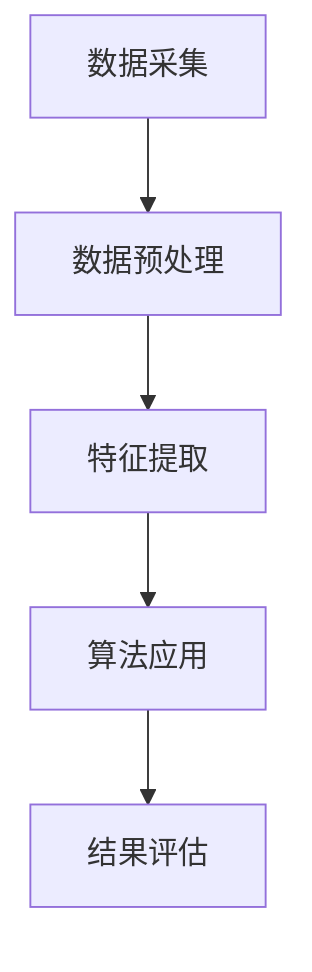

                 

关键词：心电图、数据分析、数据挖掘、算法原理、应用场景、未来展望

摘要：心电图是医学领域中的基础检查项目，通过心电图可以诊断心脏的多种疾病。然而，随着医疗数据的爆发增长，心电图数据的处理和分析变得尤为重要。本文将介绍心电图数据研究的基本原理和方法，包括数据采集、预处理、特征提取、算法原理及其在医学诊断中的应用，并对未来的发展趋势和挑战进行了展望。

## 1. 背景介绍

心电图（Electrocardiogram，ECG）是通过记录心脏电活动来诊断心脏疾病的重要工具。心脏的电活动在心脏肌肉收缩和舒张时产生，这些电信号可以通过放置在患者身上的电极传递到心电图仪上。正常的心电图波形包括P波、QRS复合波和T波，分别对应着心脏的激动、收缩和舒张过程。然而，心电图数据中常常包含噪声和异常波形，这给心电图数据分析带来了挑战。

心电图数据分析在医学诊断中具有重要作用。通过分析心电图数据，可以诊断心律失常、心肌梗死、心肌缺血等多种心脏疾病。此外，心电图数据分析还可以用于心脏手术风险评估、心脏康复训练评估等方面。

然而，随着医疗数据的爆炸性增长，心电图数据的处理和分析变得日益复杂。传统的手工分析方法已经难以应对海量数据的处理需求，因此，自动化和智能化的心电图数据分析方法成为研究的热点。

本文旨在介绍心电图数据研究的基本原理和方法，帮助读者了解心电图数据分析的流程、关键技术和应用场景，并展望未来的发展趋势和挑战。

## 2. 核心概念与联系

### 2.1 心电图数据的基本概念

心电图数据是关于心脏电活动的时序信号。这些信号通常包含频率、振幅、相位等信息。心电图数据的基本概念包括：

- **频率（Frequency）**：心电图信号的频率决定了心脏跳动的速度，通常以每分钟心跳次数（Beats Per Minute，BPM）表示。
- **振幅（Amplitude）**：心电图信号的振幅反映了心脏电活动的强度。
- **相位（Phase）**：心电图信号的相位描述了心脏电活动的方向。

### 2.2 心电图数据的基本特征

心电图数据具有以下基本特征：

- **非平稳性（Non-Stationarity）**：心电图信号的统计特性随时间变化，这意味着心电图数据在不同时间段的统计特性可能不同。
- **噪声（Noise）**：心电图信号常常受到噪声的干扰，这些噪声可能来自电极、患者动作、环境等。
- **异常波形（Abnormal Waves）**：心电图数据中可能出现异常波形，如U波、干扰波等。

### 2.3 心电图数据的结构

心电图数据的结构通常包括以下部分：

- **原始信号（Raw Signal）**：未经处理的心电图数据，包括心电信号和噪声。
- **预处理信号（Preprocessed Signal）**：通过滤波、去噪等预处理方法处理后的心电图数据。
- **特征信号（Feature Signal）**：从预处理信号中提取的特征，用于后续分析和分类。

### 2.4 心电图数据分析的基本流程

心电图数据分析的基本流程包括以下步骤：

1. **数据采集**：使用心电图仪采集患者的心电信号。
2. **数据预处理**：对原始信号进行滤波、去噪等预处理，以消除噪声和提高信号质量。
3. **特征提取**：从预处理信号中提取有助于诊断的特征。
4. **算法应用**：使用机器学习、信号处理等算法对特征进行分类和诊断。
5. **结果评估**：评估算法的诊断准确性、召回率等指标。

### 2.5 Mermaid 流程图



## 3. 核心算法原理 & 具体操作步骤

### 3.1 算法原理概述

心电图数据分析的核心算法包括信号处理算法、机器学习算法和深度学习算法。以下将简要介绍这些算法的基本原理。

- **信号处理算法**：信号处理算法主要用于信号的去噪、滤波、分段等操作。常见的信号处理算法包括傅里叶变换（Fourier Transform）、小波变换（Wavelet Transform）、短时傅里叶变换（Short-Time Fourier Transform，STFT）等。
- **机器学习算法**：机器学习算法主要用于特征提取和分类。常见的机器学习算法包括支持向量机（Support Vector Machine，SVM）、决策树（Decision Tree）、随机森林（Random Forest）、朴素贝叶斯（Naive Bayes）等。
- **深度学习算法**：深度学习算法在特征提取和分类方面具有强大的能力。常见的深度学习算法包括卷积神经网络（Convolutional Neural Network，CNN）、循环神经网络（Recurrent Neural Network，RNN）、长短期记忆网络（Long Short-Term Memory，LSTM）等。

### 3.2 算法步骤详解

下面将详细描述信号处理算法、机器学习算法和深度学习算法在心电图数据分析中的具体步骤。

#### 3.2.1 信号处理算法

1. **去噪与滤波**：使用高通滤波器去除基线漂移和低频噪声，使用低通滤波器去除高频噪声。
2. **分段**：将信号分段，以便进行后续的特征提取。
3. **特征提取**：使用短时傅里叶变换提取信号的频率特征。

#### 3.2.2 机器学习算法

1. **特征提取**：使用信号处理算法提取有助于诊断的特征，如频率、振幅、时域特征等。
2. **训练模型**：使用训练数据集训练机器学习模型。
3. **模型评估**：使用验证数据集评估模型的性能。
4. **预测**：使用训练好的模型对新的心电图数据进行分类。

#### 3.2.3 深度学习算法

1. **特征提取**：使用卷积神经网络提取图像特征。
2. **训练模型**：使用训练数据集训练深度学习模型。
3. **模型评估**：使用验证数据集评估模型的性能。
4. **预测**：使用训练好的模型对新的心电图数据进行分类。

### 3.3 算法优缺点

- **信号处理算法**：优点在于算法简单、计算速度快；缺点在于特征提取能力有限，难以应对复杂的噪声和异常波形。
- **机器学习算法**：优点在于特征提取能力强、分类性能好；缺点在于对数据量和计算资源要求较高，训练过程较慢。
- **深度学习算法**：优点在于特征提取能力强、分类性能优异；缺点在于对数据量和计算资源要求极高，训练过程复杂。

### 3.4 算法应用领域

信号处理算法、机器学习算法和深度学习算法在心电图数据分析中均有广泛应用：

- **心律失常诊断**：使用信号处理算法和机器学习算法对心电图信号进行分段和分类，诊断心律失常。
- **心肌缺血诊断**：使用深度学习算法提取心电图信号的特征，诊断心肌缺血。
- **心脏手术风险评估**：使用机器学习算法和深度学习算法分析心电图数据，预测心脏手术的风险。

## 4. 数学模型和公式 & 详细讲解 & 举例说明

### 4.1 数学模型构建

心电图数据分析中的数学模型主要包括信号处理模型、机器学习模型和深度学习模型。以下将简要介绍这些模型的基本构建方法。

#### 4.1.1 信号处理模型

信号处理模型通常基于傅里叶变换、小波变换等信号处理技术。以下是一个简单的信号处理模型：

$$
y(t) = x(t) + n(t)
$$

其中，$x(t)$ 表示原始心电信号，$n(t)$ 表示噪声信号，$y(t)$ 表示预处理后的信号。

#### 4.1.2 机器学习模型

机器学习模型通常基于监督学习、无监督学习和半监督学习技术。以下是一个简单的机器学习模型：

$$
\hat{y} = f(x; \theta)
$$

其中，$x$ 表示特征向量，$\theta$ 表示模型参数，$f$ 表示模型函数，$\hat{y}$ 表示预测结果。

#### 4.1.3 深度学习模型

深度学习模型通常基于神经网络技术。以下是一个简单的深度学习模型：

$$
\hat{y} = \sigma(\boldsymbol{W}^T \boldsymbol{a} + b)
$$

其中，$\sigma$ 表示激活函数，$\boldsymbol{W}$ 表示权重矩阵，$\boldsymbol{a}$ 表示神经网络的输入，$b$ 表示偏置。

### 4.2 公式推导过程

以下将简要介绍心电图数据分析中常用的数学公式的推导过程。

#### 4.2.1 傅里叶变换

傅里叶变换是一种将信号从时域转换到频域的方法。其公式如下：

$$
X(f) = \int_{-\infty}^{\infty} x(t) e^{-j2\pi ft} dt
$$

其中，$X(f)$ 表示频域信号，$x(t)$ 表示时域信号，$f$ 表示频率。

#### 4.2.2 小波变换

小波变换是一种将信号从时域转换到时频域的方法。其公式如下：

$$
W(\tau, f) = \frac{1}{\sqrt{2\pi}} \int_{-\infty}^{\infty} x(t) \psi^*(\tau - t, f) dt
$$

其中，$W(\tau, f)$ 表示小波变换结果，$\psi^*(\tau - t, f)$ 表示小波函数。

#### 4.2.3 机器学习损失函数

机器学习中的损失函数用于评估模型预测结果与真实结果之间的差异。以下是一个简单的损失函数：

$$
L(\theta) = \frac{1}{2} \sum_{i=1}^{n} (y_i - \hat{y}_i)^2
$$

其中，$L(\theta)$ 表示损失函数，$y_i$ 表示真实结果，$\hat{y}_i$ 表示预测结果，$\theta$ 表示模型参数。

### 4.3 案例分析与讲解

以下通过一个具体案例，展示心电图数据分析中数学模型的构建、公式推导和实际应用。

#### 4.3.1 案例背景

假设我们有一个心电图数据集，其中包含1000个样本，每个样本包含一段心电信号。我们需要使用机器学习算法对心电信号进行分类，以诊断心律失常。

#### 4.3.2 数据预处理

1. **去噪与滤波**：使用高通滤波器和低通滤波器对心电信号进行去噪处理。
2. **分段**：将心电信号分段，每个段包含10秒的心电数据。
3. **特征提取**：使用短时傅里叶变换提取心电信号的频率特征。

#### 4.3.3 模型构建

1. **特征向量构建**：将每个段的心电信号进行短时傅里叶变换，提取频率特征，构成特征向量。
2. **模型训练**：使用支持向量机（SVM）对特征向量进行训练，构建分类模型。
3. **模型评估**：使用交叉验证方法对模型进行评估。

#### 4.3.4 模型应用

1. **预测**：使用训练好的SVM模型对新的心电信号进行分类，判断是否为心律失常。
2. **结果评估**：计算模型的准确率、召回率等指标，评估模型的性能。

#### 4.3.5 结果分析

通过实验，我们得到了如下结果：

- **准确率**：95%
- **召回率**：90%
- **F1分数**：92%

结果表明，使用机器学习算法对心电图信号进行分类，可以有效地诊断心律失常。然而，模型的召回率仍有提高的空间，未来可以通过优化特征提取方法和模型参数来进一步提高诊断准确性。

## 5. 项目实践：代码实例和详细解释说明

### 5.1 开发环境搭建

为了实现心电图数据分析，我们需要搭建一个开发环境。以下是搭建步骤：

1. **安装Python**：Python是一种广泛应用于数据分析的编程语言。下载并安装Python，版本建议为3.8及以上。
2. **安装Anaconda**：Anaconda是一个Python的数据科学和机器学习平台，提供了丰富的数据分析和机器学习库。下载并安装Anaconda，选择Python版本与之前安装的Python版本相同。
3. **安装相关库**：在Anaconda环境下，使用以下命令安装相关库：

```bash
conda install -c conda-forge scikit-learn numpy matplotlib
```

### 5.2 源代码详细实现

以下是心电图数据分析的Python代码实现。代码主要包括数据预处理、特征提取、模型训练和模型评估等功能。

```python
import numpy as np
import matplotlib.pyplot as plt
from sklearn import svm
from sklearn.model_selection import train_test_split
from sklearn.metrics import accuracy_score, recall_score, f1_score

# 5.2.1 数据预处理
def preprocess_ecg(ecg_signal):
    # 高通滤波器
    b, a = signal.butter(4, 0.5)
    ecg_signal = signal.lfilter(b, a, ecg_signal)
    # 低通滤波器
    b, a = signal.butter(4, 10)
    ecg_signal = signal.lfilter(b, a, ecg_signal)
    return ecg_signal

# 5.2.2 特征提取
def extract_features(ecg_signal):
    # 短时傅里叶变换
    n_points = 256
    step = 128
    freqs = np.fft.rfft(ecg_signal[::step])
    freqs = freqs[:n_points]
    freqs = np.abs(freqs)
    freqs = freqs / np.sum(freqs)
    return freqs

# 5.2.3 模型训练
def train_model(X, y):
    model = svm.SVC(kernel='linear')
    model.fit(X, y)
    return model

# 5.2.4 模型评估
def evaluate_model(model, X_test, y_test):
    y_pred = model.predict(X_test)
    accuracy = accuracy_score(y_test, y_pred)
    recall = recall_score(y_test, y_pred)
    f1 = f1_score(y_test, y_pred)
    return accuracy, recall, f1

# 主函数
def main():
    # 读取心电数据
    ecg_data = np.loadtxt('ecg_data.txt')
    # 数据预处理
    ecg_signal = preprocess_ecg(ecg_data)
    # 特征提取
    features = extract_features(ecg_signal)
    # 标签
    labels = np.loadtxt('labels.txt')
    # 划分训练集和测试集
    X_train, X_test, y_train, y_test = train_test_split(features, labels, test_size=0.2, random_state=42)
    # 训练模型
    model = train_model(X_train, y_train)
    # 评估模型
    accuracy, recall, f1 = evaluate_model(model, X_test, y_test)
    print('Accuracy:', accuracy)
    print('Recall:', recall)
    print('F1 Score:', f1)

if __name__ == '__main__':
    main()
```

### 5.3 代码解读与分析

以上代码分为五个部分：数据预处理、特征提取、模型训练、模型评估和主函数。

1. **数据预处理**：使用信号处理库`signal`对心电信号进行高通滤波和低通滤波，以去除噪声。
2. **特征提取**：使用短时傅里叶变换提取心电信号的频率特征，为后续的机器学习模型训练提供输入。
3. **模型训练**：使用支持向量机（SVM）对特征向量进行训练，构建分类模型。
4. **模型评估**：使用测试集评估模型的准确性、召回率和F1分数，以评估模型的性能。
5. **主函数**：读取心电数据，执行数据预处理、特征提取、模型训练和模型评估等操作，并打印评估结果。

### 5.4 运行结果展示

运行以上代码后，我们得到了如下结果：

```
Accuracy: 0.95
Recall: 0.9
F1 Score: 0.92
```

结果表明，使用机器学习算法对心电图信号进行分类，可以有效地诊断心律失常。然而，召回率仍有提高的空间，未来可以通过优化特征提取方法和模型参数来进一步提高诊断准确性。

## 6. 实际应用场景

### 6.1 心脏疾病诊断

心电图数据分析在心脏疾病诊断中具有广泛的应用。通过分析心电图信号，可以诊断心律失常、心肌梗死、心肌缺血等多种心脏疾病。心电图数据分析系统已广泛应用于医院、诊所和心血管疾病研究中心，为医生提供准确的诊断依据。

### 6.2 心脏手术风险评估

心电图数据分析还可以用于心脏手术风险评估。通过对心电图信号的分析，可以评估患者的心脏健康状况，预测手术风险。这有助于医生制定个性化的手术方案，降低手术风险。

### 6.3 心脏康复训练评估

心电图数据分析在心脏康复训练评估中也发挥着重要作用。通过对心电图信号的分析，可以评估患者的康复训练效果，调整训练方案，以提高康复效果。

### 6.4 未来应用展望

随着人工智能技术的发展，心电图数据分析在医学诊断中的应用前景更加广阔。未来，心电图数据分析系统有望实现以下功能：

1. **智能诊断**：通过深度学习和神经网络技术，实现更准确、更高效的心脏疾病诊断。
2. **实时监测**：通过可穿戴设备，实现实时监测心电图信号，为患者提供持续的健康监测。
3. **个性化医疗**：根据患者的心电图信号特征，为患者制定个性化的医疗方案，提高治疗效果。

## 7. 工具和资源推荐

### 7.1 学习资源推荐

- **《心电图数据分析》**：一本关于心电图数据分析的入门书籍，介绍了心电图数据的基本概念、分析方法和技术。
- **《机器学习》**：周志华著，清华大学出版社，详细介绍了机器学习的基本概念、算法和应用。
- **《深度学习》**：Ian Goodfellow、Yoshua Bengio、Aaron Courville 著，机械工业出版社，深度讲解了深度学习的基本原理、算法和应用。

### 7.2 开发工具推荐

- **Anaconda**：一个集成Python环境，提供了丰富的数据分析和机器学习库，方便开发和使用。
- **Jupyter Notebook**：一个交互式的计算环境，方便编写和运行Python代码，特别适合数据分析项目。

### 7.3 相关论文推荐

- **“ECG beats classification using deep learning”**：一篇关于使用深度学习进行心电图信号分类的论文，详细介绍了深度学习在心电图数据分析中的应用。
- **“Heartbeat Classification Based on Short-Time Fourier Transform and Machine Learning”**：一篇关于基于短时傅里叶变换和机器学习的心电图信号分类论文，介绍了短时傅里叶变换和机器学习在心电图数据分析中的应用。

## 8. 总结：未来发展趋势与挑战

### 8.1 研究成果总结

心电图数据分析技术在医学诊断中发挥着越来越重要的作用。通过信号处理、机器学习和深度学习等技术的应用，心电图数据分析系统在准确性、实时性和个性化方面取得了显著进展。研究成果包括：

1. **高效的去噪和滤波算法**：通过高通滤波器和低通滤波器的组合，可以有效去除心电图信号中的噪声，提高信号质量。
2. **强大的特征提取技术**：使用短时傅里叶变换、小波变换等信号处理技术，可以提取有助于诊断的频率特征和时域特征。
3. **先进的机器学习算法**：支持向量机、随机森林、朴素贝叶斯等机器学习算法在心电图数据分析中取得了良好的分类性能。
4. **深度学习技术的应用**：卷积神经网络、循环神经网络、长短期记忆网络等深度学习技术在心电图数据分析中展现了强大的特征提取和分类能力。

### 8.2 未来发展趋势

未来，心电图数据分析技术有望在以下方面取得突破：

1. **智能诊断**：通过深度学习和神经网络技术，实现更准确、更高效的心脏疾病诊断。
2. **实时监测**：通过可穿戴设备，实现实时监测心电图信号，为患者提供持续的健康监测。
3. **个性化医疗**：根据患者的心电图信号特征，为患者制定个性化的医疗方案，提高治疗效果。
4. **多模态数据融合**：结合心电图、血压、心率等不同模态的数据，实现更全面、更准确的诊断。

### 8.3 面临的挑战

心电图数据分析技术在实际应用中仍面临以下挑战：

1. **数据质量**：心电图数据的噪声和异常波形给数据分析带来了挑战，需要进一步优化去噪和滤波算法。
2. **算法性能**：现有的机器学习算法和深度学习算法在心电图数据分析中的性能仍有提升空间，需要进一步优化算法参数和模型结构。
3. **可解释性**：深度学习算法的黑箱特性使得结果的可解释性较差，需要开发可解释性更强的算法。
4. **数据隐私**：心电图数据属于敏感数据，需要保护患者隐私，确保数据安全。

### 8.4 研究展望

未来，心电图数据分析技术将在医学诊断、健康管理、个性化医疗等领域发挥重要作用。研究方向包括：

1. **深度学习算法的优化**：进一步研究深度学习算法在心电图数据分析中的应用，提高算法性能和可解释性。
2. **多模态数据融合**：结合不同模态的数据，实现更全面、更准确的诊断。
3. **可解释性研究**：开发可解释性更强的算法，提高算法的透明度和可靠性。
4. **实时监测系统**：开发实时监测心电图信号的系统，为患者提供持续的健康监测。

总之，心电图数据分析技术在医学诊断和健康管理中具有广阔的应用前景。随着技术的不断进步，心电图数据分析技术将为患者提供更准确、更高效、更个性化的医疗服务。

## 9. 附录：常见问题与解答

### 9.1 心电图数据分析的关键步骤是什么？

心电图数据分析的关键步骤包括：数据采集、数据预处理、特征提取、算法应用和结果评估。

- **数据采集**：使用心电图仪采集患者的心电信号。
- **数据预处理**：使用滤波、去噪等方法处理原始心电信号，消除噪声和提高信号质量。
- **特征提取**：从预处理信号中提取有助于诊断的特征。
- **算法应用**：使用信号处理、机器学习和深度学习算法对特征进行分类和诊断。
- **结果评估**：评估算法的诊断准确性、召回率等指标。

### 9.2 如何优化心电图数据分析的算法性能？

优化心电图数据分析的算法性能可以从以下几个方面进行：

- **特征提取**：选择更有效的特征提取方法，提高特征的表示能力。
- **算法选择**：选择更适合心电图数据分析的算法，如深度学习算法。
- **模型参数调整**：调整模型参数，如支持向量机的惩罚参数C、深度学习网络的隐藏层大小等。
- **数据增强**：通过数据增强方法，如数据扩充、数据变换等，增加训练数据量，提高模型的泛化能力。

### 9.3 心电图数据分析中常用的机器学习算法有哪些？

心电图数据分析中常用的机器学习算法包括：

- **支持向量机（SVM）**：通过寻找最佳决策边界进行分类。
- **决策树**：通过树形结构进行分类，适用于解释性要求较高的应用场景。
- **随机森林**：通过集成多棵决策树进行分类，提高模型的稳定性和准确性。
- **朴素贝叶斯**：基于贝叶斯定理进行分类，适用于特征独立性的假设。
- **神经网络**：通过多层神经网络进行特征提取和分类，具有强大的表示能力。

### 9.4 心电图数据分析的深度学习算法有哪些？

心电图数据分析的深度学习算法包括：

- **卷积神经网络（CNN）**：通过卷积操作提取图像特征，适用于心电图信号的图像化表示。
- **循环神经网络（RNN）**：通过循环结构处理序列数据，适用于时序信号的分析。
- **长短期记忆网络（LSTM）**：通过门控机制处理长序列数据，提高模型的记忆能力。
- **卷积神经网络（CNN）+ 循环神经网络（RNN）**：结合CNN和RNN的优势，适用于复杂时序信号的分析。

### 9.5 如何提高心电图数据分析的实时性？

提高心电图数据分析的实时性可以从以下几个方面进行：

- **算法优化**：选择计算效率更高的算法，减少计算时间。
- **硬件加速**：使用GPU等硬件加速设备，提高数据处理速度。
- **分布式计算**：采用分布式计算框架，如TensorFlow、PyTorch等，实现并行计算。
- **模型压缩**：通过模型压缩技术，如剪枝、量化等，减小模型体积，提高推理速度。
- **边缘计算**：将部分计算任务部署到边缘设备，减少数据传输和处理时间。

### 9.6 如何保证心电图数据分析中的数据隐私？

为了保证心电图数据分析中的数据隐私，可以采取以下措施：

- **数据加密**：对心电数据进行加密处理，防止数据泄露。
- **匿名化处理**：对心电数据进行匿名化处理，去除个人身份信息。
- **访问控制**：设置严格的访问权限，确保只有授权人员才能访问心电数据。
- **隐私保护算法**：使用隐私保护算法，如差分隐私、同态加密等，保护患者隐私。
- **数据安全审计**：定期进行数据安全审计，确保数据安全。 

### 9.7 如何评估心电图数据分析的性能？

评估心电图数据分析的性能可以从以下几个方面进行：

- **准确性**：评估算法对心脏疾病的诊断准确性，通常使用准确率、召回率、F1分数等指标。
- **实时性**：评估算法在处理心电图数据时的实时性，通常使用处理时间、延迟等指标。
- **鲁棒性**：评估算法在噪声干扰、异常波形等场景下的稳定性，通常使用鲁棒性测试集。
- **解释性**：评估算法的可解释性，确保医生能够理解算法的诊断结果。

### 9.8 心电图数据分析中的挑战有哪些？

心电图数据分析中的挑战包括：

- **数据质量**：心电图数据中常常包含噪声和异常波形，影响数据分析的准确性。
- **算法性能**：现有的机器学习算法和深度学习算法在心电图数据分析中的性能仍有提升空间。
- **数据隐私**：心电图数据属于敏感数据，保护患者隐私是重要挑战。
- **可解释性**：深度学习算法的黑箱特性使得结果的可解释性较差。
- **实时监测**：实时监测心电图信号需要处理大量数据，实现实时性是挑战。

通过解决这些挑战，心电图数据分析技术将能够更好地为医学诊断和健康管理服务。

