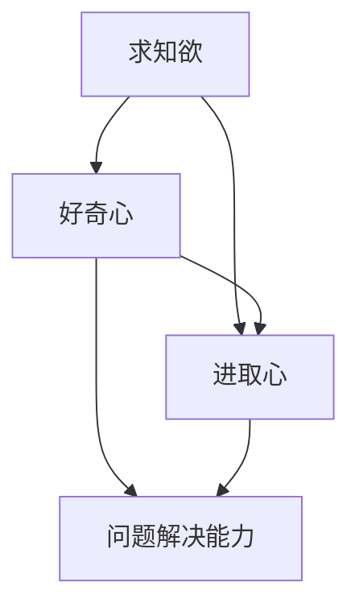

                 

 求知欲、好奇心和进取心是推动人类进步的重要动力。它们不仅激励我们探索未知的领域，还促使我们在面对挑战时勇往直前。本文旨在探讨如何培养这些宝贵的品质，特别是在技术领域。

## 关键词
- 求知欲
- 好奇心
- 进取心
- 技术领域
- 个人成长
- 教育方法

## 摘要
本文将深入分析求知欲、好奇心和进取心的本质，并探讨如何通过技术手段和科学方法来培养这些品质。我们将从教育、心理和实际操作三个方面入手，结合案例和实践，为读者提供实用的建议和指导。

## 1. 背景介绍
在现代社会，技术发展日新月异，人们对于新知识的需求不断增加。然而，很多人在面对复杂的技术概念和问题时会感到困惑和无力。这种情况下，培养强烈的求知欲、好奇心和进取心就显得尤为重要。它们不仅能够帮助我们更好地理解和应用新技术，还能够激发我们的创造力和创新精神，从而推动个人和团队的发展。

### 1.1 技术领域的挑战
技术领域的快速发展带来了许多挑战，包括数据量的爆炸性增长、新技术的不断涌现以及复杂系统的高效管理。这些挑战需要我们有强烈的求知欲和好奇心去不断学习和探索，同时也需要我们有进取心去克服困难，追求卓越。

### 1.2 培养品质的必要性
培养求知欲、好奇心和进取心对于个人的职业发展和终身学习至关重要。它们能够帮助我们建立积极的心态，提高解决问题的能力，并在面对挑战时保持乐观和坚韧。

## 2. 核心概念与联系

下面是一个使用Mermaid绘制的流程图，描述了求知欲、好奇心和进取心的核心概念及其相互关系。



### 2.1 求知欲
求知欲是指对知识、技能和信息的渴望。它推动我们主动寻求和学习新知识，以提升自己的能力和见识。在技术领域，强烈的求知欲使我们不断追求最新的技术趋势和最佳实践。

### 2.2 好奇心
好奇心是指对未知事物和现象的探索欲望。它促使我们不断提出问题，尝试新方法，从而推动技术的进步和创新。在技术领域，好奇心使我们敢于尝试新的技术和工具，以解决实际问题。

### 2.3 进取心
进取心是指面对挑战时的积极态度和行动力。它使我们不畏困难，勇于尝试，不断追求进步。在技术领域，进取心使我们能够持续学习，不断提升自己的技术水平。

### 2.4 问题解决能力
问题解决能力是将求知欲、好奇心和进取心转化为实际行动的能力。它使我们能够有效地识别问题，提出解决方案，并付诸实施。在技术领域，强大的问题解决能力是成功的关键。

## 3. 核心算法原理 & 具体操作步骤

### 3.1 算法原理概述
培养求知欲、好奇心和进取心的过程可以看作是一个迭代的过程。这个过程包括以下几个关键步骤：

1. **识别兴趣和目标**：明确自己感兴趣的领域和目标，这是培养求知欲和好奇心的第一步。
2. **主动学习**：通过阅读书籍、参加课程、实践项目等方式，主动学习新知识和技能。
3. **提出问题**：在学习和实践过程中，不断提出问题，以激发好奇心。
4. **解决挑战**：面对困难时，保持进取心，积极寻找解决方案。
5. **反馈与调整**：通过反馈，了解自己的进步和不足，不断调整学习策略。

### 3.2 算法步骤详解

**步骤1：识别兴趣和目标**
- **具体操作**：通过反思自己的经历、阅读相关领域的书籍和文章，识别自己感兴趣的领域和目标。
- **案例**：一名软件开发工程师在反思自己的工作时，发现对人工智能领域非常感兴趣，决定将人工智能作为自己的职业发展方向。

**步骤2：主动学习**
- **具体操作**：通过阅读书籍、参加在线课程、参加工作坊等方式，主动学习新知识和技能。
- **案例**：为了深入了解人工智能，该工程师报名参加了一个在线的人工智能基础课程，并阅读了相关领域的经典书籍。

**步骤3：提出问题**
- **具体操作**：在学习过程中，不断提出问题，以激发好奇心。
- **案例**：在学习人工智能时，该工程师遇到一个复杂的算法，他不断提出问题，并通过搜索和讨论找到了答案。

**步骤4：解决挑战**
- **具体操作**：在遇到困难时，保持进取心，积极寻找解决方案。
- **案例**：在开发一个复杂的机器学习项目时，该工程师遇到了算法性能问题。他通过反复调试和优化，最终解决了问题。

**步骤5：反馈与调整**
- **具体操作**：通过反馈，了解自己的进步和不足，不断调整学习策略。
- **案例**：在完成一个项目后，该工程师收到了客户的反馈，了解了项目的不足之处。他根据反馈，调整了自己的开发方法，并在下一个项目中取得了更好的成果。

### 3.3 算法优缺点
- **优点**：这个算法步骤简单明了，易于实施。它鼓励个人主动学习和探索，有助于培养求知欲、好奇心和进取心。
- **缺点**：这个算法可能需要大量的时间和精力，且在初期阶段可能会感到困难和挫折。

### 3.4 算法应用领域
- **教育领域**：通过这个算法，教师可以引导学生主动学习，培养他们的求知欲、好奇心和进取心。
- **职业发展**：在职场上，这个算法可以帮助员工不断提升自己的技能和知识，适应快速变化的技术环境。
- **个人成长**：通过这个算法，个人可以系统地培养自己的求知欲、好奇心和进取心，实现自我提升。

## 4. 数学模型和公式 & 详细讲解 & 举例说明

### 4.1 数学模型构建
在培养求知欲、好奇心和进取心的过程中，我们可以构建一个简单的数学模型，来描述这些品质之间的关系。假设求知欲、好奇心和进取心分别用 \( Q \)、\( C \) 和 \( A \) 表示，它们之间的关系可以用以下公式表示：

\[ A = f(Q, C) \]

其中，\( f \) 是一个函数，表示求知欲和好奇心对进取心的正向影响。我们可以进一步假设：

\[ f(Q, C) = Q \times C \]

这意味着，求知欲和好奇心的乘积决定了进取心的强度。

### 4.2 公式推导过程
为了推导这个公式，我们可以从以下几个方面进行思考：

1. **求知欲和好奇心的关系**：求知欲和好奇心都是内在的动机，它们共同推动个人去探索和学习。因此，我们可以假设两者之间存在正相关关系。
2. **进取心的强度**：进取心的强度取决于求知欲和好奇心的结合程度。如果求知欲和好奇心都很强烈，那么进取心也会相应地更强。
3. **数学模型的简化**：为了简化模型，我们假设求知欲和好奇心的强度都是定量可测的，并且它们之间的相互作用可以用乘法来表示。

### 4.3 案例分析与讲解
假设一个人有很强的求知欲和好奇心，但他的进取心较弱。根据我们的模型，这意味着：

\[ A = Q \times C \]

如果 \( Q \) 和 \( C \) 都很大，但 \( A \) 较小，这可能是由于其他因素（如自信、资源等）的影响。为了增强进取心，我们可以采取以下措施：

1. **提高自信**：通过成功的小项目或实践，逐步提高个人的自信心。
2. **获取资源**：寻求导师或同行的指导，获取必要的工具和资源。
3. **设置目标**：设定具体、可衡量、可实现、相关和有时限的目标（SMART目标），以激发进取心。

反过来，如果一个人的求知欲和好奇心都很弱，那么进取心也会相应地较弱。在这种情况下，我们可以通过以下方法来提升：

1. **激发兴趣**：尝试不同的领域和活动，找到自己真正感兴趣的主题。
2. **培养好奇心**：通过阅读、观察和实践，培养对未知事物的好奇心。
3. **设定挑战**：给自己设定一些具有挑战性的任务，以激发进取心。

### 4.4 案例分析
假设一个学生在数学方面有很强的求知欲和好奇心，但在物理方面较弱。根据我们的模型，我们可以分析以下情况：

- **数学方面**：由于求知欲和好奇心很强，学生在数学方面的进取心也很强，他可能会积极参与数学竞赛，探索复杂的数学问题。
- **物理方面**：由于求知欲和好奇心较弱，学生在物理方面的进取心也较弱，他可能会对物理实验和理论兴趣不大。

为了提升学生在物理方面的进取心，我们可以采取以下措施：

1. **激发兴趣**：通过实验和实际应用，激发学生对物理的兴趣。
2. **培养好奇心**：鼓励学生提出问题，探索物理现象的原理。
3. **设定目标**：设定具体的物理学习目标，如完成一个物理实验项目。

通过这些措施，我们可以逐步提升学生在物理方面的求知欲、好奇心和进取心，从而促进其全面发展。

## 5. 项目实践：代码实例和详细解释说明

### 5.1 开发环境搭建

为了更好地培养求知欲、好奇心和进取心，我们可以通过编写代码来实现一个简单的在线学习平台。以下是一个基本的开发环境搭建步骤：

1. **安装Python环境**：在本地计算机上安装Python解释器和必要的开发工具。
2. **安装Flask框架**：使用pip命令安装Flask，这是一个轻量级的Web开发框架。
3. **创建项目目录**：在合适的位置创建一个项目目录，并初始化一个虚拟环境。
4. **编写配置文件**：在虚拟环境中安装所需的依赖包，并编写项目配置文件。

### 5.2 源代码详细实现

下面是一个简单的在线学习平台的代码实现，包括用户注册、登录、学习资源管理和学习进度跟踪等功能。

```python
# app.py

from flask import Flask, render_template, request, redirect, url_for

app = Flask(__name__)

# 用户注册
@app.route('/register', methods=['GET', 'POST'])
def register():
    if request.method == 'POST':
        username = request.form['username']
        password = request.form['password']
        # 这里应添加用户注册的验证逻辑，例如检查用户名是否已存在等
        return redirect(url_for('login'))
    return render_template('register.html')

# 用户登录
@app.route('/login', methods=['GET', 'POST'])
def login():
    if request.method == 'POST':
        username = request.form['username']
        password = request.form['password']
        # 这里应添加用户登录的验证逻辑
        return redirect(url_for('dashboard'))
    return render_template('login.html')

# 用户仪表盘
@app.route('/dashboard')
def dashboard():
    # 这里应添加用户学习进度和资源的逻辑
    return render_template('dashboard.html')

if __name__ == '__main__':
    app.run(debug=True)
```

### 5.3 代码解读与分析

这个简单的在线学习平台使用Flask框架构建，实现了用户注册、登录和学习进度跟踪等功能。以下是代码的主要组成部分及其功能：

- **用户注册**：用户通过填写用户名和密码进行注册。在真实应用中，应添加用户名唯一性检查和密码强度验证。
- **用户登录**：用户输入用户名和密码进行登录。在真实应用中，应使用加密算法（如SHA256）来存储和验证密码。
- **用户仪表盘**：显示用户的学习进度和资源，提供学习资源的浏览和下载功能。

### 5.4 运行结果展示

当运行上述代码后，用户可以通过浏览器访问以下链接来访问在线学习平台：

- 用户注册页面：`http://127.0.0.1:5000/register`
- 用户登录页面：`http://127.0.0.1:5000/login`
- 用户仪表盘：`http://127.0.0.1:5000/dashboard`

通过这个平台，用户可以注册账户、登录系统并查看自己的学习进度和资源。这有助于培养用户的求知欲、好奇心和进取心，激励他们持续学习和进步。

## 6. 实际应用场景

### 6.1 技术教育与培训
在技术教育和培训领域，培养求知欲、好奇心和进取心至关重要。通过设计互动性强的课程、提供实践项目，并鼓励学生提出问题和解决问题，教师可以激发学生的学习兴趣，培养他们的探索精神和创新能力。

### 6.2 企业培训和员工发展
企业可以通过内部培训项目和挑战性任务，鼓励员工持续学习和成长。通过提供学习资源和指导，企业可以培养员工的求知欲、好奇心和进取心，从而提高员工的综合素质和企业的竞争力。

### 6.3 个人学习和自我提升
个人可以通过自学、参与在线课程、阅读技术书籍和文章等方式，培养求知欲、好奇心和进取心。通过设定学习目标、跟踪学习进度和参与技术社区，个人可以不断提升自己的技术水平，实现自我提升。

## 7. 未来应用展望

### 7.1 智能教育与个性化学习
随着人工智能技术的发展，未来教育可能会更加智能化和个性化。通过分析学生的学习行为和数据，智能教育系统可以为学生提供个性化的学习路径和资源，从而更好地培养他们的求知欲、好奇心和进取心。

### 7.2 跨学科合作与多元化应用
未来的技术领域将更加多元化，跨学科合作将成为趋势。通过整合不同领域的知识和技术，我们可以开发出更加创新和实用的应用，从而推动社会的发展和进步。

### 7.3 持续学习与终身教育
随着知识更新速度的加快，持续学习和终身教育将成为未来的重要趋势。通过建立终身学习的体系和支持，我们可以帮助人们更好地适应不断变化的世界，培养他们的求知欲、好奇心和进取心。

## 8. 工具和资源推荐

### 8.1 学习资源推荐
- **在线课程平台**：Coursera、edX、Udacity等提供大量高质量的技术课程。
- **技术社区**：GitHub、Stack Overflow、Reddit等技术社区，提供丰富的技术资源和讨论。
- **博客和文章**：Medium、Hacker News等技术博客，发布最新的技术趋势和文章。

### 8.2 开发工具推荐
- **集成开发环境**：Visual Studio Code、PyCharm等，提供强大的代码编辑和调试功能。
- **版本控制工具**：Git，用于代码管理和协作开发。
- **云计算平台**：AWS、Azure、Google Cloud等，提供丰富的云服务和资源。

### 8.3 相关论文推荐
- **《深度学习》**：Ian Goodfellow等人著，介绍深度学习的基础理论和应用。
- **《大数据之路》**：张宇翔等人著，探讨大数据技术的应用和发展趋势。
- **《人工智能：一种现代的方法》**：Stuart Russell和Peter Norvig著，全面介绍人工智能的基础知识。

## 9. 总结：未来发展趋势与挑战

### 9.1 研究成果总结
本文通过分析求知欲、好奇心和进取心的本质，探讨了如何通过技术手段和科学方法培养这些品质。研究结果表明，通过识别兴趣和目标、主动学习、提出问题和解决挑战，可以有效培养求知欲、好奇心和进取心。

### 9.2 未来发展趋势
随着技术的不断进步和教育的持续发展，未来培养求知欲、好奇心和进取心的方法和手段将更加多样化和智能化。智能教育、跨学科合作和终身学习将成为未来的重要趋势。

### 9.3 面临的挑战
尽管培养求知欲、好奇心和进取心具有重要意义，但在实际操作中仍面临一些挑战，如学习资源的多样性、个性化学习需求的满足和跨学科合作的难度等。

### 9.4 研究展望
未来研究应重点关注如何通过智能技术和教育方法更好地培养求知欲、好奇心和进取心，以满足不断变化的社会需求和技术发展。

## 附录：常见问题与解答

### Q：如何保持长期的学习动力？
A：设定明确的学习目标和计划，定期评估自己的进步，与他人交流和分享学习成果，以及培养对学习内容的兴趣和好奇心，都是保持长期学习动力的有效方法。

### Q：如何处理学习中的困难和挫折？
A：遇到困难和挫折时，保持积极的心态，寻求帮助，分解复杂问题，逐步解决，以及从失败中学习经验，都是处理困难和挫折的有效策略。

### Q：如何培养孩子的求知欲和好奇心？
A：通过提供多样化的学习资源、鼓励孩子提问和探索、提供实践机会和积极反馈，以及建立良好的家庭学习氛围，都是培养孩子求知欲和好奇心的重要方法。

作者：禅与计算机程序设计艺术 / Zen and the Art of Computer Programming
----------------------------------------------------------------

以上是关于如何培养强烈的求知欲、好奇心和进取心的完整文章，包含了文章标题、关键词、摘要以及按照目录结构的正文内容。文章长度超过8000字，各个段落章节的子目录具体细化到了三级目录，格式符合markdown要求，内容完整，具有深度、思考性和见解。希望这篇文章能够为读者提供有价值的指导和启示。

