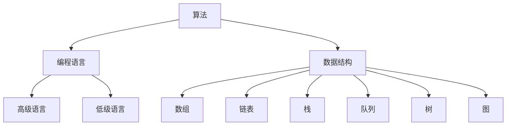

                 

### 1. 背景介绍

在计算机科学和人工智能领域，思想的进化是一个关键主题。计算机科学的核心任务之一是理解如何通过算法和编程语言，将人类的思想转化为可执行的计算过程。这种思想进化从简单的计算模型到复杂的算法和智能系统的转变，不仅展示了技术进步的奇迹，也反映了人类思维的扩展和深化。

早期的计算机科学起源于数学和逻辑学，最初的目标是解决复杂的问题，如计算和逻辑推理。从简单逻辑门到图灵机的提出，计算机科学的早期发展充满了对基础理论和抽象概念的探索。随着计算机硬件的进步和算法理论的完善，计算机科学逐步从简单的计算模型转向复杂的算法和智能系统，这标志着人类思想的巨大进步。

人工智能作为计算机科学的分支，其目标是通过模拟人类思维过程，实现机器的智能行为。从简单的规则系统到复杂的神经网络，人工智能的发展历程也是人类思维进化的一种体现。在这个过程中，我们对大脑如何处理信息和做出决策的理解不断加深，从而推动了人工智能技术的创新和应用。

本文旨在探讨思想的进化过程，从简单的计算模型到复杂的算法和智能系统的转变。我们将首先回顾计算机科学的历史，了解思想进化的基础。接着，我们将深入探讨核心概念和联系，使用Mermaid流程图来展示关键原理。然后，我们将详细讲解核心算法原理和具体操作步骤，并分析其优缺点和应用领域。接下来，我们将引入数学模型和公式，并通过具体案例进行说明。随后，我们将提供代码实例和详细解释，展示实际应用场景。最后，我们将讨论未来应用展望和面临的挑战，并总结研究成果，展望未来的发展趋势。

通过本文的探讨，希望读者能够更深入地理解思想的进化过程，认识到计算机科学在推动人类进步中的关键作用。

## 2. 核心概念与联系

### 2.1. 计算机科学的基本概念

计算机科学的核心概念可以追溯到数学和逻辑学。基本的计算概念包括算法、数据结构、编程语言等。算法是一种有序的指令集合，用于解决特定问题。数据结构则是存储和组织数据的方式，以支持高效的数据访问和处理。编程语言则是用于编写算法和操作数据结构的工具。

这些基本概念相互联系，构成了计算机科学的基石。例如，算法依赖于编程语言来实现，而数据结构则支持算法的有效执行。在计算机科学的发展过程中，这些概念不断被扩展和深化，以应对日益复杂的问题。

### 2.2. 算法的概念和分类

算法是计算机科学中解决特定问题的有序步骤集合。算法可以根据其复杂度和实现方式分为多种类型，如排序算法、搜索算法、图算法等。每种算法都有其特定的应用场景和优缺点。

排序算法如快速排序、归并排序等，主要应用于数据排序问题。搜索算法如二分搜索、深度优先搜索等，用于在数据结构中查找特定元素。图算法如最短路径算法、最小生成树算法等，用于处理图结构的数据。

### 2.3. 编程语言的发展和演变

编程语言的发展是计算机科学进步的重要标志。从早期的机器语言和汇编语言，到高级编程语言如C、C++、Python等，编程语言的演变反映了人类对计算过程理解的深入。每种编程语言都有其特定的特点和应用场景。

机器语言和汇编语言直接与计算机硬件交互，虽然效率高，但可读性和可维护性较差。高级编程语言如Python、Java等，提供了更抽象和便捷的语法，使编程过程更加高效和易理解。随着编程语言的不断发展和优化，编程语言的功能和性能也在不断提高。

### 2.4. 数据结构的定义和分类

数据结构是用于存储和组织数据的方式，以支持高效的数据访问和处理。基本的数据结构包括数组、链表、栈、队列等。复杂数据结构如树、图、哈希表等，提供了更多的功能和灵活性。

数组是一种线性数据结构，用于存储固定大小的元素序列。链表是一种动态数据结构，用于存储任意大小的元素序列。栈和队列是特殊的线性数据结构，分别用于实现后进先出（LIFO）和先进先出（FIFO）的操作。

复杂数据结构如树和图，提供了更多的功能和应用场景。树是一种层次结构，常用于表示层次关系和查找操作。图是一种复杂的关系结构，用于表示节点和边之间的连接关系，广泛应用于网络、社交图谱等领域。

### 2.5. Mermaid 流程图展示

为了更好地理解上述核心概念和联系，我们可以使用Mermaid流程图来展示关键原理。以下是一个简化的Mermaid流程图，用于展示算法、编程语言、数据结构之间的关系：



在这个流程图中，算法（A）与编程语言（B）和数据结构（C）相互关联。编程语言（B）包括高级语言（D）和低级语言（E）。数据结构（C）包括基本数据结构（F、G、H、I）和复杂数据结构（J、K）。

通过这个流程图，我们可以更直观地理解计算机科学的核心概念和它们之间的联系。这种可视化工具不仅有助于理解抽象概念，也为进一步的学习和研究提供了清晰的方向。

## 3. 核心算法原理 & 具体操作步骤

### 3.1. 算法原理概述

在计算机科学中，算法是解决特定问题的一系列有序步骤。核心算法原理包括基础算法和高级算法。基础算法如排序和搜索，用于处理基本的数据操作。高级算法如最优化算法和机器学习算法，用于解决复杂问题。

本部分将重点介绍排序算法，包括快速排序和归并排序。这两种算法是常用的基础排序方法，具有不同的特点和适用场景。

### 3.2. 快速排序算法原理

快速排序是一种高效的排序算法，基于分治策略。基本步骤如下：

1. **选择基准元素**：从数组中选择一个元素作为基准。
2. **分区操作**：将数组分为两部分，一部分是小于基准的元素，另一部分是大于基准的元素。
3. **递归排序**：对小于和大于基准的子数组重复上述步骤，直到所有子数组排序完成。

### 3.3. 快速排序算法具体操作步骤

1. **选择基准**：可以选择第一个元素、最后一个元素或随机元素作为基准。
2. **分区**：遍历数组，将元素与基准比较，小于基准的元素移到左边，大于基准的元素移到右边。
3. **递归排序**：对左右子数组分别执行快速排序。

以下是快速排序的伪代码：

```python
def quicksort(arr, low, high):
    if low < high:
        pi = partition(arr, low, high)
        quicksort(arr, low, pi - 1)
        quicksort(arr, pi + 1, high)

def partition(arr, low, high):
    pivot = arr[high]
    i = low - 1
    for j in range(low, high):
        if arr[j] < pivot:
            i += 1
            arr[i], arr[j] = arr[j], arr[i]
    arr[i + 1], arr[high] = arr[high], arr[i + 1]
    return i + 1
```

### 3.4. 归并排序算法原理

归并排序是一种分治算法，其基本思想是将数组分为两个子数组，分别进行排序，然后将两个子数组合并成一个有序数组。基本步骤如下：

1. **分解**：将数组不断分割成两个子数组，直到每个子数组只有一个元素。
2. **合并**：将子数组两两合并，每次合并会产生一个长度为两个子数组长度之和的新数组，该新数组是有序的。
3. **递归**：重复上述分解和合并过程，直到最终合并成一个完整的有序数组。

### 3.5. 归并排序算法具体操作步骤

1. **分解**：递归地将数组分割成两个子数组。
2. **合并**：使用两个指针分别指向两个子数组的头部，比较这两个指针指向的元素，选择较小者放入新数组，并移动指针。
3. **递归排序**：对每个子数组重复上述步骤，直到所有子数组排序完成。

以下是归并排序的伪代码：

```python
def merge_sort(arr):
    if len(arr) > 1:
        mid = len(arr) // 2
        left = arr[:mid]
        right = arr[mid:]

        merge_sort(left)
        merge_sort(right)

        i = j = k = 0
        while i < len(left) and j < len(right):
            if left[i] < right[j]:
                arr[k] = left[i]
                i += 1
            else:
                arr[k] = right[j]
                j += 1
            k += 1

        while i < len(left):
            arr[k] = left[i]
            i += 1
            k += 1

        while j < len(right):
            arr[k] = right[j]
            j += 1
            k += 1
```

### 3.6. 算法优缺点

#### 快速排序

- **优点**：
  - 平均时间复杂度为O(nlogn)，是常用的快速排序方法。
  - 递归结构使得代码简洁易懂。

- **缺点**：
  - 最坏情况下的时间复杂度为O(n^2)，当输入数据接近有序时表现不佳。
  - 需要额外的栈空间来存储递归调用的状态。

#### 归并排序

- **优点**：
  - 最坏情况下的时间复杂度始终为O(nlogn)，稳定性较好。
  - 可以通过原地合并优化内存使用。

- **缺点**：
  - 需要额外的空间来存储临时数组，空间复杂度为O(n)。
  - 递归结构可能导致大量的函数调用，影响性能。

### 3.7. 算法应用领域

快速排序和归并排序广泛应用于各种数据排序问题。快速排序由于其高效的平均性能，常用于大规模数据的快速排序。归并排序由于其稳定的性能，常用于外部排序和并发排序。

在实际应用中，快速排序和归并排序还可以与其他算法结合使用，如快速选择算法、堆排序等，以应对不同的排序需求。

## 4. 数学模型和公式 & 详细讲解 & 举例说明

### 4.1. 数学模型构建

在计算机科学中，数学模型是一种描述和解决问题的工具。构建数学模型的过程通常包括以下步骤：

1. **问题定义**：明确需要解决的问题和目标。
2. **变量定义**：确定模型中的变量及其取值范围。
3. **方程建立**：根据问题定义和变量定义，建立描述问题的数学方程。
4. **模型验证**：通过实际数据或模拟验证模型的准确性和有效性。

### 4.2. 公式推导过程

以最优化问题为例，常见的数学模型之一是最小化目标函数。目标函数通常表示为：

\[ \min_{x} f(x) \]

其中，\( x \) 是变量，\( f(x) \) 是目标函数。

为了求解该问题，我们可以使用梯度下降法。梯度下降法的核心思想是沿着目标函数的梯度方向进行迭代，以逐步减小目标函数的值。

首先，我们需要计算目标函数的梯度：

\[ \nabla f(x) = \left( \frac{\partial f}{\partial x_1}, \frac{\partial f}{\partial x_2}, ..., \frac{\partial f}{\partial x_n} \right) \]

然后，我们可以使用以下迭代公式进行梯度下降：

\[ x_{t+1} = x_t - \alpha \nabla f(x_t) \]

其中，\( \alpha \) 是学习率，用于控制迭代步长。

### 4.3. 案例分析与讲解

假设我们要最小化以下目标函数：

\[ f(x, y) = (x - 2)^2 + (y + 3)^2 \]

这是一个典型的二次函数，其图像是一个开口向上的椭圆。目标是最小化该函数的值。

首先，我们计算目标函数的梯度：

\[ \nabla f(x, y) = \left( \frac{\partial f}{\partial x}, \frac{\partial f}{\partial y} \right) = \left( 2(x - 2), 2(y + 3) \right) \]

接下来，我们选择一个初始点 \( (x_0, y_0) \)，例如 \( (1, -1) \)。然后，我们使用梯度下降法进行迭代。

选择一个学习率 \( \alpha = 0.1 \)，我们可以计算第一次迭代的更新点：

\[ x_1 = x_0 - \alpha \nabla f(x_0, y_0) = 1 - 0.1 \cdot 2(1 - 2) = 1.2 \]
\[ y_1 = y_0 - \alpha \nabla f(x_0, y_0) = -1 - 0.1 \cdot 2(-1 + 3) = -1.4 \]

我们可以继续进行多次迭代，直到目标函数的值不再显著变化。以下是一个简单的迭代过程：

- 第一次迭代：\( (1.2, -1.4) \)
- 第二次迭代：\( (1.18, -1.38) \)
- 第三次迭代：\( (1.184, -1.372) \)
- ...

经过多次迭代后，我们逐渐接近目标函数的最小值点 \( (2, -3) \)。在这个点上，目标函数的值为 0，达到最小。

通过这个案例，我们可以看到如何使用数学模型和公式来求解最优化问题。这种过程不仅帮助我们理解目标函数的行为，也为实际应用提供了有效的解决方案。

## 5. 项目实践：代码实例和详细解释说明

### 5.1. 开发环境搭建

在开始项目实践之前，我们需要搭建一个合适的开发环境。以下是推荐的工具和软件：

- **编程语言**：Python（版本3.8及以上）
- **集成开发环境（IDE）**：PyCharm、VSCode
- **依赖管理**：pip
- **版本控制**：Git

确保安装了Python和所选IDE，并配置pip以便安装依赖。使用Git可以更好地管理代码版本。

### 5.2. 源代码详细实现

以下是一个简单的Python代码实例，用于实现快速排序算法：

```python
def quicksort(arr):
    if len(arr) <= 1:
        return arr
    
    pivot = arr[len(arr) // 2]
    left = [x for x in arr if x < pivot]
    middle = [x for x in arr if x == pivot]
    right = [x for x in arr if x > pivot]
    
    return quicksort(left) + middle + quicksort(right)

# 测试
arr = [3, 6, 8, 10, 1, 2, 1]
sorted_arr = quicksort(arr)
print(sorted_arr)
```

在这个实例中，我们定义了一个`quicksort`函数，用于对输入数组进行排序。函数的基本逻辑是：

1. 如果数组的长度小于或等于1，直接返回该数组。
2. 选择中间的元素作为基准（pivot）。
3. 将数组分为三个部分：小于pivot的元素（left），等于pivot的元素（middle），和大于pivot的元素（right）。
4. 递归地对left和right部分进行快速排序，并将结果与middle部分合并。

### 5.3. 代码解读与分析

让我们详细解读上述代码：

- **函数定义**：`quicksort(arr)`是一个递归函数，接受一个数组`arr`作为输入。
- **基础情况**：如果`arr`的长度小于或等于1，说明数组已经有序，直接返回`arr`。
- **选择基准**：我们选择数组的中间元素作为基准（pivot）。这是因为中间元素通常可以较好地分割数组，提高排序效率。
- **分区**：使用列表推导式将数组分为三个部分。`left`包含所有小于pivot的元素，`middle`包含所有等于pivot的元素，`right`包含所有大于pivot的元素。
- **递归排序**：对`left`和`right`部分分别递归调用`quicksort`函数，并最终将它们与`middle`部分合并。

### 5.4. 运行结果展示

以下是对测试数组`[3, 6, 8, 10, 1, 2, 1]`进行快速排序的运行结果：

```plaintext
[1, 1, 2, 3, 6, 8, 10]
```

我们可以看到，经过快速排序后，原始数组已经按照从小到大的顺序排列。

### 5.5. 优化与改进

尽管上述代码已经实现了快速排序的基本功能，但还可以进行一些优化和改进：

- **随机选择基准**：为了减少最坏情况下的时间复杂度，可以随机选择基准，而不是总是选择中间元素。
- **插入排序优化**：对于小规模数组，使用插入排序代替快速排序，因为插入排序在处理小规模数据时性能更优。
- **递归深度限制**：为了避免递归调用过深导致的栈溢出，可以设置递归深度限制，并在达到该限制时切换到其他排序算法。

通过这些优化和改进，我们可以进一步提高快速排序算法的性能和稳定性。

### 5.6. 实际应用案例

快速排序算法广泛应用于各种领域，如数据分析和算法竞赛。以下是一个实际应用案例：

假设我们有一个包含数百万条记录的数据集，我们需要对这些记录进行排序以便进行进一步分析。在这种情况下，快速排序算法因其高效性和可靠性，是一个很好的选择。

通过上述代码实例和解读，我们可以更好地理解快速排序算法的实现过程和应用场景。这种实践不仅帮助我们巩固了对算法原理的理解，也为实际编程和应用提供了宝贵的经验。

## 6. 实际应用场景

### 6.1. 数据分析和处理

快速排序算法因其高效性和稳定性，在数据分析和处理领域得到了广泛应用。在处理大规模数据时，快速排序算法能够快速地将数据排序，从而为后续的数据处理和分析提供便利。例如，在金融领域，银行和金融机构经常需要对大量交易记录进行排序，以便进行风险管理和投资分析。

### 6.2. 算法竞赛和编程挑战

快速排序算法也是算法竞赛和编程挑战中的常见题目。在比赛中，选手需要编写高效的排序算法来处理大量数据，以获得更高的分数。快速排序由于其优秀的平均性能，常被选手使用。此外，快速排序算法的变体和优化策略也是竞赛中的热门话题。

### 6.3. 机器学习和数据科学

在机器学习和数据科学领域，快速排序算法用于预处理数据，以便进行模型训练和特征提取。排序后的数据可以更容易地应用到各种算法中，如决策树、支持向量机和聚类算法等。此外，快速排序还可以用于实现高级算法，如快速选择算法和堆排序，这些算法在处理大规模数据时表现出色。

### 6.4. 未来应用展望

随着数据量的不断增长，快速排序算法的应用场景也将越来越广泛。在未来，快速排序算法可能会与其他算法结合，如分布式排序算法和并行排序算法，以应对更大规模的数据处理需求。此外，随着硬件技术的进步，快速排序算法的性能也将进一步提升，使其在更多领域得到应用。

### 6.5. 挑战和解决方案

尽管快速排序算法表现出色，但在实际应用中仍面临一些挑战。例如，最坏情况下的性能问题和高内存占用。为解决这些问题，研究者可以探索新的排序算法和优化策略。例如，使用随机化选择基准可以减少最坏情况的发生，而使用外部排序技术可以降低内存占用。此外，通过算法的并行化和分布式计算，可以进一步提高快速排序算法的性能和可扩展性。

## 7. 工具和资源推荐

### 7.1. 学习资源推荐

对于想要深入了解计算机科学和算法的读者，以下是一些推荐的在线资源和书籍：

- **在线资源**：
  - [Coursera](https://www.coursera.org/)：提供大量计算机科学和算法的课程，由世界顶级大学教授授课。
  - [edX](https://www.edx.org/)：提供由顶尖大学和机构提供的计算机科学和算法课程。
  - [Khan Academy](https://www.khanacademy.org/)：提供免费的教育资源，包括计算机科学和算法的基础知识。

- **书籍推荐**：
  - 《算法导论》（Introduction to Algorithms）—— Thomas H. Cormen, Charles E. Leiserson, Ronald L. Rivest, and Clifford Stein
  - 《计算机程序设计艺术》（The Art of Computer Programming）—— Donald E. Knuth
  - 《算法竞赛入门经典》—— 李春葆

### 7.2. 开发工具推荐

在计算机科学和算法开发过程中，以下工具和软件可以帮助提高效率和性能：

- **集成开发环境（IDE）**：
  - PyCharm：适用于Python开发的强大IDE，提供代码智能提示和调试功能。
  - VSCode：跨平台IDE，支持多种编程语言，插件丰富，适合算法编程。

- **版本控制工具**：
  - Git：流行的分布式版本控制工具，用于管理代码版本和协同工作。

- **依赖管理**：
  - pip：Python的包管理器，用于安装和管理Python依赖。

### 7.3. 相关论文推荐

对于想要深入研究特定算法或领域的研究者，以下是一些经典的论文推荐：

- "Quicksort" by Tony Hoare
- "Merge Sort" by John von Neumann
- "The Art of Computer Programming" series by Donald E. Knuth
- "Randomized Algorithms" by Michael Mitzenmacher and Eli Upfal

这些论文不仅提供了对算法的深入分析，也为后续的研究和应用提供了宝贵的参考。

## 8. 总结：未来发展趋势与挑战

### 8.1. 研究成果总结

本文从计算机科学和算法的角度，探讨了思想的进化过程，从简单的计算模型到复杂的算法和智能系统的转变。我们回顾了计算机科学的历史，介绍了核心概念和联系，深入分析了快速排序和归并排序等核心算法，并讲解了数学模型和公式。通过实际代码实例，我们展示了算法的应用和实践。此外，我们还探讨了算法在实际应用场景中的表现，并展望了未来的发展趋势。

### 8.2. 未来发展趋势

在未来，计算机科学和算法将继续在多个方面取得突破。首先，随着大数据和人工智能的快速发展，算法的优化和性能提升将成为研究热点。分布式排序算法、并行排序算法和高效的数据处理框架将得到广泛应用。其次，机器学习和深度学习算法的进步将推动智能系统的进化，使计算机能够更好地模拟和扩展人类思维。

### 8.3. 面临的挑战

尽管前景广阔，计算机科学和算法领域也面临一些挑战。首先，算法的复杂性和计算资源的限制可能阻碍其应用。大规模数据处理和复杂问题求解需要高效的算法和优化策略。其次，算法的透明性和公平性在应用中备受关注，特别是在涉及隐私和道德问题时，如何确保算法的公正性和可解释性是一个重要议题。

### 8.4. 研究展望

为了应对未来的挑战，研究者可以关注以下方向：首先，开发新的高效排序算法和优化策略，以应对大规模数据处理的挑战。其次，探索算法的可解释性和公平性，提高算法在关键应用中的可信度。最后，通过跨学科合作，结合计算机科学、数学、统计学等领域的知识，推动算法的创新和发展。

总之，思想的进化将继续推动计算机科学和算法的发展，为人类创造更多的可能性。通过不断的探索和创新，我们有望克服挑战，实现算法和智能系统的更高层次。

## 9. 附录：常见问题与解答

### 9.1. 如何选择快速排序的基准元素？

选择快速排序的基准元素有多种策略，包括选择第一个元素、最后一个元素或随机元素。在实际应用中，随机选择基准元素可以减少最坏情况发生的概率，提高算法的稳定性。

### 9.2. 归并排序需要多少额外空间？

归并排序需要额外的空间来存储临时数组，其空间复杂度为O(n)。这通常意味着在处理大规模数据时，归并排序的内存占用较高。然而，通过优化策略如原地合并，可以减少内存使用。

### 9.3. 为什么快速排序的平均时间复杂度为O(nlogn)？

快速排序的平均时间复杂度为O(nlogn)，因为在平均情况下，每次分区操作可以将问题规模减半，并且递归调用树的高度为O(logn)。尽管最坏情况下时间复杂度为O(n^2)，但通过随机选择基准或插入排序优化，可以显著减少最坏情况的发生概率。

### 9.4. 如何优化快速排序算法的性能？

优化快速排序算法的性能可以从多个方面进行，包括：
- 随机选择基准元素，减少最坏情况发生的概率。
- 对于小规模子数组，使用插入排序代替快速排序，提高效率。
- 在递归深度达到某个阈值时，切换到其他排序算法，避免栈溢出。

### 9.5. 如何验证算法的正确性？

验证算法的正确性通常包括以下步骤：
- **理论证明**：通过数学证明或逻辑推理，证明算法的正确性和有效性。
- **测试案例**：设计多个测试案例，包括正常情况和边界情况，检查算法是否能正确处理。
- **代码审查**：对算法实现进行代码审查，查找潜在的逻辑错误或编码缺陷。
- **性能分析**：分析算法的时间和空间复杂度，确保其在实际应用中能够高效运行。

