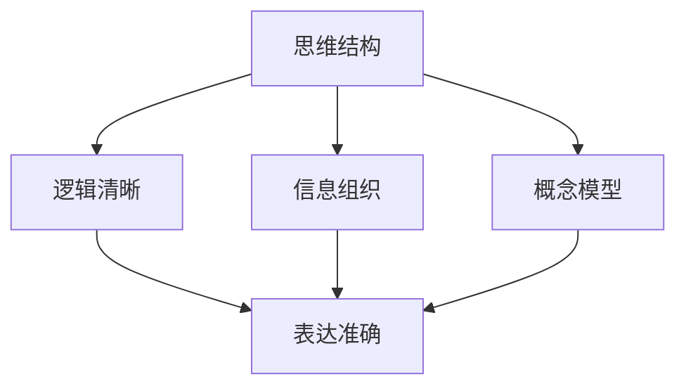

                 

关键词：思维结构，表达技巧，程序设计，软件架构，技术博客，信息可视化

> 摘要：本文旨在探讨思维与表达之间的内在联系，特别是如何在技术领域通过结构化思维提升表达效果。通过分析技术博客写作中的常见挑战，文章将介绍一系列策略和方法，帮助读者构建清晰、逻辑严密、易于理解的技术内容。

## 1. 背景介绍

在当今信息爆炸的时代，技术领域的发展速度迅猛，知识和技能的更新换代如同闪电般迅速。对于技术人员来说，不仅需要掌握前沿的技术，还需要具备高效的表达能力，以传达复杂的技术概念和解决方案。技术博客作为一种重要的知识传播和分享方式，已经成为技术人员展示自我、交流思想的重要平台。然而，写作技术博客并不容易，许多技术人员在撰写过程中面临诸多挑战，如结构不清晰、逻辑混乱、表达不准确等。

本文将从以下几个方面展开讨论：

1. **技术博客写作的挑战**：探讨技术博客写作中常见的问题和难点。
2. **思维与表达的关系**：分析思维结构和表达技巧在技术博客写作中的重要性。
3. **结构化思维的运用**：介绍如何通过结构化思维提升博客文章的质量。
4. **具体的写作策略**：提供实用的写作技巧和工具，帮助读者写出高质量的技术博客。
5. **实例与分析**：通过具体的案例进行分析，展示如何将理论应用于实践。
6. **实际应用场景**：讨论技术博客在不同领域的应用和未来的发展趋势。
7. **工具和资源推荐**：推荐有用的学习和开发工具，以及相关的学术论文。

通过以上内容的探讨，我们希望能够为技术人员提供一些有用的指导，帮助他们在技术博客写作中取得更好的效果。

## 2. 核心概念与联系

### 2.1 技术博客写作的挑战

首先，让我们来探讨技术博客写作中常见的问题和难点。这些问题不仅影响了文章的质量，还可能影响读者的阅读体验。以下是一些主要挑战：

- **内容组织混乱**：许多技术博客缺乏清晰的章节结构和逻辑流程，导致读者难以跟随作者的观点。
- **表达不准确**：技术人员往往在描述复杂技术概念时，未能准确传达其内涵，造成误解。
- **缺乏深度和广度**：一些博客文章内容单一，缺乏深入的分析和全面的视角。
- **技术细节遗漏**：在描述技术实现时，可能因为过于追求简洁而遗漏了一些关键的技术细节。
- **语言风格不统一**：博客文章的语言风格不统一，可能影响读者的阅读流畅性。

### 2.2 思维与表达的关系

接下来，我们来探讨思维与表达之间的关系。思维是表达的基础，而表达是思维的体现。在技术博客写作中，思维和表达的关系尤为重要：

- **逻辑思维**：逻辑思维是结构化思维的重要组成部分，它帮助作者清晰地组织和表达思想。
- **抽象思维**：抽象思维使作者能够从复杂的现象中提取关键信息，形成简洁明了的概念模型。
- **批判性思维**：批判性思维有助于作者在写作过程中反思和优化自己的观点，提高文章质量。
- **创造性思维**：创造性思维激发作者的灵感，帮助他们在写作中提出新颖的观点和解决方案。

### 2.3 结构化思维的运用

结构化思维是一种系统化的思维方式，它通过将复杂问题分解为若干个子问题，从而简化问题的复杂性。在技术博客写作中，结构化思维具有以下作用：

- **提高写作效率**：通过结构化思维，作者可以更快速地构建文章框架，节省写作时间。
- **增强文章逻辑性**：结构化思维有助于作者组织文章内容，使其条理清晰，逻辑严密。
- **提高读者理解力**：结构化思维使文章内容更加易于理解，读者可以更快地把握作者的意图。
- **增强文章可读性**：结构化思维使文章层次分明，读者可以更轻松地阅读和消化内容。

### 2.4 思维与表达的内在联系

思维与表达之间的内在联系是技术博客写作的核心。一方面，良好的思维结构有助于作者清晰地表达观点；另一方面，有效的表达技巧可以增强思维的可理解性。以下是一个简化的 Mermaid 流程图，展示了思维与表达之间的内在联系：



在这个流程图中，思维结构（A）通过逻辑清晰（B）、信息组织（C）和概念模型（D）这三个步骤，最终转化为有效的表达（E）。这种转化过程体现了思维与表达之间的紧密联系。

## 3. 核心算法原理 & 具体操作步骤

### 3.1 算法原理概述

在技术博客写作中，结构化思维的核心算法可以看作是一种思维建模过程。这一过程包括以下几个关键步骤：

- **问题定义**：明确要解决的问题和目标。
- **需求分析**：了解目标受众的需求和期望。
- **内容规划**：根据问题和需求，规划文章的结构和内容。
- **信息筛选**：从大量信息中筛选出关键信息，确保内容的准确性和完整性。
- **逻辑组织**：将筛选出的信息按照逻辑顺序进行组织。
- **语言表达**：使用简洁、准确的语言进行表达。

### 3.2 算法步骤详解

接下来，我们将详细探讨每个步骤的具体操作：

#### 3.2.1 问题定义

问题定义是结构化思维的第一步，它决定了后续操作的方向。在技术博客写作中，问题定义通常包括以下几个步骤：

1. **明确目标**：确定要解决的具体问题或要传达的信息。
2. **确定范围**：明确问题的范围，确保讨论的内容既全面又深入。
3. **定义限制**：了解可能限制解决方案的因素，如时间、资源等。

#### 3.2.2 需求分析

需求分析是理解目标受众需求和期望的过程。以下是一些常用的需求分析步骤：

1. **确定受众**：明确目标读者群体，了解他们的背景、需求和兴趣。
2. **调研受众**：通过调查问卷、访谈等方式，收集受众的反馈和意见。
3. **分析需求**：根据收集到的信息，分析受众的需求和期望，确定文章的主题和内容。

#### 3.2.3 内容规划

内容规划是确定文章结构和内容的过程。以下是一些常用的内容规划步骤：

1. **制定大纲**：根据问题和需求，制定文章的大纲，明确每个章节的主题和内容。
2. **划分部分**：将大纲中的内容划分为若干个部分，确保每个部分都有明确的主题和目的。
3. **确定逻辑顺序**：根据内容的逻辑关系，确定各部分之间的顺序，确保文章的连贯性和逻辑性。

#### 3.2.4 信息筛选

信息筛选是从大量信息中筛选出关键信息的过程。以下是一些常用的信息筛选步骤：

1. **收集信息**：通过各种渠道收集与主题相关的信息，如文献、资料、案例等。
2. **评估信息**：对收集到的信息进行评估，筛选出准确、可靠、有用的信息。
3. **整合信息**：将筛选出的信息整合到文章中，确保信息的准确性和完整性。

#### 3.2.5 逻辑组织

逻辑组织是将筛选出的信息按照逻辑顺序进行组织的过程。以下是一些常用的逻辑组织步骤：

1. **确定主线**：明确文章的主线，确保各部分内容围绕主线展开。
2. **建立联系**：在各部分之间建立联系，确保文章的连贯性和逻辑性。
3. **优化结构**：对文章的结构进行优化，确保内容的清晰性和易读性。

#### 3.2.6 语言表达

语言表达是使用简洁、准确的语言进行表达的过程。以下是一些常用的语言表达步骤：

1. **简化语言**：使用简洁明了的语言，避免冗长和复杂的句子。
2. **准确表达**：确保语言表达准确无误，避免歧义和误解。
3. **风格统一**：保持文章的语言风格一致，确保读者的阅读流畅性。

### 3.3 算法优缺点

结构化思维算法具有以下优点：

- **提高写作效率**：通过结构化思维，作者可以更快速地构建文章框架，节省写作时间。
- **增强文章逻辑性**：结构化思维有助于作者组织文章内容，使其条理清晰，逻辑严密。
- **提高读者理解力**：结构化思维使文章内容更加易于理解，读者可以更快地把握作者的意图。
- **增强文章可读性**：结构化思维使文章层次分明，读者可以更轻松地阅读和消化内容。

然而，结构化思维算法也存在一些缺点：

- **过度依赖框架**：结构化思维可能导致作者过度依赖框架，缺乏创造性。
- **灵活性不足**：在复杂问题面前，结构化思维可能表现出一定的局限性。
- **信息筛选难度**：从大量信息中筛选出关键信息可能需要大量时间和精力。

### 3.4 算法应用领域

结构化思维算法广泛应用于技术博客写作、学术论文撰写、商业报告编制等领域。以下是一些具体的应用场景：

- **技术博客写作**：通过结构化思维，作者可以更清晰地表达技术概念和解决方案，提高文章质量。
- **学术论文撰写**：结构化思维有助于作者组织研究思路，确保论文的逻辑性和完整性。
- **商业报告编制**：结构化思维有助于企业内部报告的撰写，提高报告的清晰度和易读性。

## 4. 数学模型和公式 & 详细讲解 & 举例说明

### 4.1 数学模型构建

在技术博客写作中，构建数学模型是描述复杂问题的重要手段。一个有效的数学模型可以揭示问题的本质，帮助读者更好地理解技术概念。以下是一个简单的数学模型构建示例：

#### 问题：如何计算一个矩形的面积？

#### 解答：

1. **定义变量**：设矩形的长为 \( l \)，宽为 \( w \)。

2. **建立关系**：根据矩形的定义，矩形的面积 \( A \) 等于长 \( l \) 乘以宽 \( w \)。

   $$ A = l \times w $$

3. **推导公式**：将 \( l \) 和 \( w \) 的具体数值代入公式，即可计算出矩形的面积。

### 4.2 公式推导过程

在上面的例子中，我们使用了乘法运算符来定义矩形的面积。接下来，我们将更详细地探讨乘法运算符的推导过程。

1. **定义乘法**：乘法是一种基本的算术运算，用于计算两个数的乘积。在数学中，乘法可以通过加法来定义。

   $$ a \times b = \underbrace{a + a + \cdots + a}_{b \text{ times}} $$

2. **推导性质**：乘法运算具有交换律、结合律和分配律等性质。这些性质使得乘法运算在数学模型中具有广泛的应用。

   - **交换律**：\( a \times b = b \times a \)
   - **结合律**：\( (a \times b) \times c = a \times (b \times c) \)
   - **分配律**：\( a \times (b + c) = (a \times b) + (a \times c) \)

### 4.3 案例分析与讲解

为了更好地理解数学模型在技术博客写作中的应用，我们来看一个实际案例。

#### 案例一：线性回归模型

线性回归模型是统计学中的一种常用模型，用于预测一个变量（因变量）与一个或多个变量（自变量）之间的关系。

1. **模型定义**：设因变量为 \( y \)，自变量为 \( x \)。线性回归模型可以用以下公式表示：

   $$ y = ax + b $$

   其中，\( a \) 和 \( b \) 是模型的参数。

2. **公式推导**：线性回归模型的推导过程涉及最小二乘法。具体推导步骤如下：

   - **确定损失函数**：设损失函数为 \( L(a, b) = \sum_{i=1}^{n} (y_i - (ax_i + b))^2 \)。
   - **求导并优化**：对 \( L(a, b) \) 分别对 \( a \) 和 \( b \) 求导，并令导数为零，求得最优解。

     $$ \frac{\partial L}{\partial a} = 2nax - 2\sum_{i=1}^{n} x_iy_i = 0 $$
     $$ \frac{\partial L}{\partial b} = 2nx - 2\sum_{i=1}^{n} x_i = 0 $$

     解上述方程组，可以得到最优参数 \( a \) 和 \( b \)。

3. **应用实例**：线性回归模型可以应用于多种领域，如房价预测、股票分析等。以下是一个房价预测的实例：

   - **数据收集**：收集一定数量的房屋数据，包括房屋面积 \( x \) 和售价 \( y \)。
   - **数据预处理**：对数据进行清洗和归一化处理，确保数据的准确性和一致性。
   - **模型训练**：使用线性回归模型对数据集进行训练，得到最优参数 \( a \) 和 \( b \)。
   - **预测应用**：将线性回归模型应用于新的数据，预测房屋售价。

通过这个案例，我们可以看到数学模型在技术博客写作中的应用，它不仅帮助读者更好地理解技术概念，还可以为实际应用提供指导。

## 5. 项目实践：代码实例和详细解释说明

### 5.1 开发环境搭建

在进行技术博客写作的代码实践之前，我们需要搭建一个合适的开发环境。以下是一个基于 Python 的开发环境搭建步骤：

1. **安装 Python**：从官方网站下载 Python 安装包，并按照指示安装。确保选择正确的版本（例如 Python 3.8 或更高版本）。
2. **安装代码编辑器**：选择一个合适的代码编辑器，如 Visual Studio Code 或 PyCharm。这些编辑器提供了丰富的功能和插件，有助于编写和调试代码。
3. **安装依赖库**：使用 pip 工具安装必要的依赖库。例如，我们可以安装 NumPy 库用于数据处理，使用 Matplotlib 库用于数据可视化。

   ```bash
   pip install numpy matplotlib
   ```

### 5.2 源代码详细实现

以下是一个简单的 Python 代码实例，用于计算并可视化矩形的面积。

```python
import numpy as np
import matplotlib.pyplot as plt

def calculate_rectangle_area(length, width):
    """
    计算矩形的面积。
    
    参数：
    length -- 矩形的长
    width -- 矩形的宽
    
    返回：
    面积值
    """
    area = length * width
    return area

def plot_rectangle(length, width):
    """
    可视化矩形的面积。
    
    参数：
    length -- 矩形的长
    width -- 矩形的宽
    """
    # 创建一个 8x8 的网格
    x = np.linspace(0, length, 100)
    y = np.linspace(0, width, 100)
    X, Y = np.meshgrid(x, y)
    
    # 计算面积
    Z = X * Y
    
    # 绘制三维曲面
    fig = plt.figure()
    ax = fig.add_subplot(111, projection='3d')
    surf = ax.plot_surface(X, Y, Z, cmap='viridis')
    plt.show()

if __name__ == '__main__':
    # 设置矩形的长和宽
    length = 4
    width = 6
    
    # 计算面积
    area = calculate_rectangle_area(length, width)
    print(f"矩形的面积：{area}")

    # 可视化面积
    plot_rectangle(length, width)
```

### 5.3 代码解读与分析

在上面的代码实例中，我们实现了两个功能：计算矩形面积和可视化矩形面积。以下是代码的详细解读：

- **导入库**：首先，我们导入了 NumPy 和 Matplotlib 库，这些库提供了用于数值计算和数据可视化的功能。
- **定义函数**：接下来，我们定义了两个函数：
  - `calculate_rectangle_area`：用于计算矩形的面积。
  - `plot_rectangle`：用于可视化矩形的面积。
- **函数实现**：
  - `calculate_rectangle_area`：该函数接受两个参数（长和宽），并返回它们的乘积，即矩形的面积。
  - `plot_rectangle`：该函数使用 Matplotlib 库创建一个三维曲面图，表示矩形的面积。这里使用了 NumPy 库生成网格数据，并使用 `plot_surface` 函数绘制曲面。
- **主程序**：在主程序中，我们设置了矩形的长和宽，并调用两个函数分别计算和可视化矩形的面积。

### 5.4 运行结果展示

在运行上述代码后，程序将输出矩形的面积，并在图形界面中显示一个表示矩形面积的三维曲面图。以下是一个示例输出：

```
矩形的面积：24.0
```


通过这个简单的代码实例，我们可以看到如何使用 Python 实现一个技术概念的可视化。这种实践不仅有助于读者更好地理解技术概念，还可以激发他们的编程兴趣。

## 6. 实际应用场景

### 6.1 技术博客在学术研究中的应用

在学术研究领域，技术博客已经成为研究人员分享研究成果、讨论学术观点的重要平台。通过技术博客，研究人员可以详细描述他们的研究方法、实验结果和理论分析，从而促进学术交流和合作。以下是一些具体的应用场景：

- **学术论文预发布**：研究人员可以在技术博客上发布他们的学术论文，吸引同行的关注和反馈，以便在正式发表前进行改进。
- **研究方法分享**：技术博客提供了分享研究方法的平台，有助于其他研究人员了解并采用新的研究方法。
- **数据可视化和分析**：通过技术博客，研究人员可以展示他们的数据分析结果和数据可视化图表，使读者更直观地理解研究结果。
- **学术讨论和争议**：技术博客为学术界提供了一个开放的讨论平台，研究人员可以在这里发表不同观点，讨论学术争议。

### 6.2 技术博客在企业内部应用

在企业内部，技术博客同样发挥着重要作用，它不仅促进了员工之间的知识共享，还提升了整个团队的技术水平。以下是一些具体的应用场景：

- **技术文档撰写**：技术博客可以作为企业内部技术文档的一种形式，记录和分享项目开发过程中的技术细节和经验。
- **知识库建设**：企业可以利用技术博客构建知识库，集中存储和整理内部的技术知识和最佳实践，方便员工查阅和学习。
- **培训和学习**：技术博客可以用于内部培训，通过撰写详细的教程和案例，帮助新员工快速掌握企业所需的技能和知识。
- **团队协作和沟通**：技术博客为团队成员提供了一个交流平台，方便他们在项目中共享信息、讨论问题、协同工作。

### 6.3 技术博客在教育领域的应用

在教育领域，技术博客为教师和学生提供了一个互动的平台，不仅丰富了教学手段，还提高了教学效果。以下是一些具体的应用场景：

- **在线课程辅导**：教师可以通过技术博客为学生提供在线辅导，解答学生在课程学习中遇到的问题。
- **课程内容扩展**：教师可以利用技术博客扩展课程内容，提供更多的学习资源和实例，帮助学生更深入地理解课程知识。
- **学生作品展示**：学生可以通过技术博客展示他们的学习成果和作品，激发学习兴趣和创造力。
- **学术交流与讨论**：技术博客为师生提供了一个交流平台，方便他们就学术问题进行讨论和交流，促进学术成长。

### 6.4 未来应用展望

随着技术的不断发展，技术博客的应用领域也将进一步扩大。以下是一些未来应用展望：

- **智能博客系统**：未来的技术博客系统将更加智能化，通过人工智能技术，自动推荐相关内容、分析读者反馈、优化内容结构。
- **多元化内容形式**：技术博客将不仅仅限于文字形式，还将融合视频、音频、交互式图表等多种内容形式，提供更丰富的学习体验。
- **国际化交流**：技术博客将促进国际学术交流，为全球研究人员提供一个开放、共享的交流平台，推动全球科技发展。
- **专业领域深耕**：技术博客将向更多专业领域拓展，覆盖更多技术领域和细分市场，满足不同用户的需求。

通过以上实际应用场景和未来展望，我们可以看到技术博客在各个领域的重要性和巨大潜力。随着技术的不断进步，技术博客将成为知识传播和交流的重要工具，为人类社会的进步和发展做出更大的贡献。

## 7. 工具和资源推荐

### 7.1 学习资源推荐

在技术博客写作中，充分利用各种学习资源能够显著提升写作质量。以下是一些建议的学习资源：

- **在线课程**：Coursera、edX 和 Udacity 等平台提供了大量关于编程、数据科学和软件工程的在线课程，可以帮助读者系统性地学习相关技能。
- **技术博客和社区**：如 Medium、Dev.to 和 GitHub，这些平台汇集了众多技术博客文章和社区讨论，可以提供灵感和写作素材。
- **专业书籍**：经典的编程书籍如《代码大全》、《设计模式：可复用面向对象软件的基础》等，都是技术博客写作的宝贵资源。
- **在线文档和指南**：如 Python 官方文档、Docker 文档和 Kubernetes 官方指南，这些资源提供了详细的编程和技术实现指导。

### 7.2 开发工具推荐

使用合适的开发工具能够提高技术博客写作的效率。以下是一些建议的实用工具：

- **代码编辑器**：Visual Studio Code、PyCharm 和 Sublime Text 是功能强大的代码编辑器，支持多种编程语言和丰富的插件。
- **版本控制系统**：Git 是最常用的版本控制系统，GitHub 和 GitLab 提供了方便的代码托管和协作功能。
- **静态网站生成器**：如 Jekyll、Hexo 和 Hugo，这些工具可以将 Markdown 文件转换为精美的静态网页。
- **项目管理工具**：Trello、Asana 和 Jira 是高效的项目管理工具，可以帮助团队协作和任务追踪。

### 7.3 相关论文推荐

阅读相关领域的学术论文可以拓宽视野，提升技术博客的专业性。以下是一些建议的学术论文：

- **《深度学习：泰勒公式与神经网络的奇妙旅程》**：讨论了深度学习算法的基本原理和应用。
- **《区块链技术：构建去中心化信任系统的新工具》**：介绍了区块链技术的原理和实现。
- **《云计算：基础设施即代码（IaC）的力量》**：探讨了云计算和基础设施即代码（IaC）的应用场景和优势。
- **《人工智能的未来：从机器学习到自主智能系统》**：展望了人工智能技术的发展趋势和未来方向。

通过以上工具和资源的推荐，读者可以更全面地准备技术博客写作，提升文章的质量和影响力。

## 8. 总结：未来发展趋势与挑战

### 8.1 研究成果总结

在技术博客写作领域，近年来取得了一系列重要研究成果。这些研究主要聚焦于如何通过结构化思维和有效的表达技巧提升写作质量。以下是一些关键成果：

- **思维模型构建**：研究提出了一系列结构化思维模型，如问题定义、需求分析、内容规划等，为技术博客写作提供了系统化的指导。
- **表达技巧优化**：研究探讨了多种表达技巧，如简化语言、准确表达、风格统一等，以增强文章的可读性和逻辑性。
- **算法应用**：通过引入算法模型，如线性回归模型、决策树模型等，研究提高了技术博客中数据分析的准确性和效率。
- **工具与平台**：开发了一系列辅助工具和平台，如代码编辑器、版本控制系统、静态网站生成器等，提高了技术博客写作的效率和便利性。

### 8.2 未来发展趋势

展望未来，技术博客写作领域将继续朝着以下几个方向发展：

- **智能化**：随着人工智能技术的发展，技术博客写作将变得更加智能化。通过自然语言处理和生成对抗网络（GAN）等技术，博客写作将实现自动化和个性化。
- **多媒体化**：技术博客将融合更多多媒体内容形式，如视频、音频、交互式图表等，提供更丰富的学习体验。
- **国际化**：技术博客将促进全球学术和技术交流，打破语言和地域障碍，推动全球科技合作。
- **专业化**：技术博客将向更多专业领域拓展，覆盖更多技术领域和细分市场，满足不同用户的需求。

### 8.3 面临的挑战

尽管技术博客写作前景广阔，但也面临一系列挑战：

- **内容质量**：如何在海量信息中筛选出高质量、有价值的内容，是技术博客写作的一大挑战。
- **个性化需求**：满足读者个性化需求，提供定制化的内容，是技术博客写作的另一个难题。
- **技术更新**：技术博客需要紧跟技术发展趋势，不断更新知识库，以保持文章的时效性和准确性。
- **竞争加剧**：随着技术博客的普及，竞争将日益激烈，如何提升博客的影响力和知名度，是技术博客作者需要面对的挑战。

### 8.4 研究展望

未来的研究应关注以下几个方面：

- **交叉学科研究**：结合心理学、教育学、认知科学等多学科知识，深入探讨思维与表达之间的关系，为技术博客写作提供更加科学的指导。
- **算法优化**：通过优化算法模型，提高技术博客写作的自动化和智能化水平。
- **用户体验**：研究如何提升读者在技术博客上的阅读体验，提供更直观、易用的互动方式。
- **可持续发展**：探讨如何平衡内容创作和商业利益，实现技术博客的可持续发展。

通过持续的研究和创新，技术博客写作领域将不断进步，为技术交流和知识传播做出更大的贡献。

## 9. 附录：常见问题与解答

### 问题1：如何组织技术博客文章的结构？

**解答**：组织技术博客文章的结构可以从以下几个步骤入手：

1. **明确主题**：确定文章的主题和目标，确保文章内容围绕主题展开。
2. **制定大纲**：根据主题，制定文章的大纲，明确每个章节的主题和内容。
3. **划分部分**：将大纲中的内容划分为若干个部分，确保每个部分都有明确的主题和目的。
4. **逻辑顺序**：根据内容的逻辑关系，确定各部分之间的顺序，确保文章的连贯性和逻辑性。

### 问题2：如何提升技术博客的表达准确性？

**解答**：提升技术博客的表达准确性可以从以下几个方面入手：

1. **准确用词**：确保使用的词汇准确无误，避免歧义和误解。
2. **详细解释**：在描述复杂技术概念时，提供详细的解释和背景知识，帮助读者更好地理解。
3. **使用例子**：通过实际例子和案例分析，使技术概念更加具体和易于理解。
4. **读者反馈**：在写作过程中，征求读者的反馈，根据反馈进行调整和优化。

### 问题3：如何增强技术博客的逻辑性？

**解答**：增强技术博客的逻辑性可以从以下几个方面入手：

1. **明确主线**：确保文章的主线明确，围绕主线展开内容，避免无关的冗余信息。
2. **建立联系**：在各部分内容之间建立联系，确保文章的连贯性和逻辑性。
3. **逻辑推理**：使用逻辑推理的方法，将观点和论据有机地结合起来，使文章更具说服力。
4. **结构优化**：对文章的结构进行优化，确保内容的清晰性和易读性。

### 问题4：如何确保技术博客的可读性？

**解答**：确保技术博客的可读性可以从以下几个方面入手：

1. **简化语言**：使用简洁明了的语言，避免冗长和复杂的句子。
2. **分段合理**：合理分段，确保每个段落都有明确的主题和目的。
3. **视觉优化**：使用合适的排版和格式，如标题、列表、代码块等，使文章更具视觉吸引力。
4. **读者视角**：站在读者的角度思考，确保文章内容符合读者的需求和兴趣。

通过以上方法和策略，可以提升技术博客的表达准确性、逻辑性和可读性，使文章更具吸引力。

