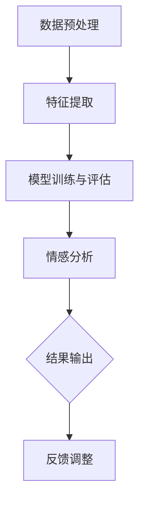

                 

情感分析作为自然语言处理（NLP）的重要分支，近年来在电商领域得到了广泛应用。通过分析用户对商品的评论和评价，电商企业可以更好地理解消费者的需求，优化商品和服务，提高用户满意度和忠诚度。本文将深入探讨情感分析在电商领域的应用，包括用户评价的情感分析、商品改进以及未来的发展展望。

## 1. 背景介绍

随着互联网的普及和电子商务的迅猛发展，用户评论和评价已成为电商平台上重要的信息资源。这些评论不仅为潜在购买者提供了决策参考，也为企业提供了宝贵的市场反馈。然而，这些评论通常是大量非结构化的文本数据，如何有效地分析和利用这些数据成为一个挑战。情感分析作为一种自动识别文本中情感极性（正面、负面或中性）的技术，为解决这一问题提供了有效的途径。

在电商领域，情感分析的应用主要体现在以下几个方面：

1. **用户反馈分析**：通过情感分析，电商企业可以快速了解用户对商品和服务的评价，识别用户关注的热点和问题。
2. **商品改进**：基于情感分析结果，企业可以针对性地改进产品设计和营销策略，提升用户满意度。
3. **个性化推荐**：情感分析可以帮助电商平台更好地理解用户的需求和偏好，提供个性化的商品推荐。
4. **品牌监测**：企业可以通过情感分析实时监测品牌在市场上的口碑和形象，及时应对负面信息。

## 2. 核心概念与联系

### 2.1 情感分析的基本概念

情感分析（Sentiment Analysis）也称为意见挖掘，是自然语言处理（NLP）的一个重要分支。其核心任务是自动识别文本中的情感倾向，即判断文本表达的情感是正面、负面还是中性。情感分析通常分为以下三个层次：

1. **二分类情感分析**：将情感分为正面和负面两类。
2. **多分类情感分析**：将情感分为多个类别，如正面、中性、负面等。
3. **情感强度分析**：不仅识别情感类别，还能评估情感的强度。

### 2.2 情感分析的流程

情感分析的基本流程通常包括以下几个步骤：

1. **数据预处理**：包括分词、去停用词、词性标注等，将原始文本转化为可用于分析的格式。
2. **特征提取**：将预处理后的文本转化为机器学习模型可以处理的特征向量，如词袋模型、TF-IDF、词嵌入等。
3. **模型训练与评估**：使用机器学习算法（如朴素贝叶斯、支持向量机、深度学习等）训练模型，并对模型进行评估。
4. **情感分析**：使用训练好的模型对新的文本数据进行情感分类。

### 2.3 Mermaid 流程图

以下是一个简单的 Mermaid 流程图，展示了情感分析的基本流程：



## 3. 核心算法原理 & 具体操作步骤

### 3.1 算法原理概述

情感分析算法的核心是情感分类模型。常见的情感分类模型包括：

1. **朴素贝叶斯分类器**：基于贝叶斯定理和特征条件独立性假设，适用于小型数据集。
2. **支持向量机（SVM）**：通过将特征空间映射到高维空间，找到最佳分类边界。
3. **深度学习模型**：如卷积神经网络（CNN）和循环神经网络（RNN），具有强大的表示和学习能力。

### 3.2 算法步骤详解

1. **数据收集**：从电商平台上收集用户评论数据。
2. **数据预处理**：包括文本清洗、分词、去停用词、词性标注等。
3. **特征提取**：使用词袋模型、TF-IDF、词嵌入等方法提取特征向量。
4. **模型训练**：选择合适的机器学习算法训练情感分类模型。
5. **模型评估**：使用交叉验证、精确度、召回率等指标评估模型性能。
6. **情感分析**：使用训练好的模型对新的用户评论进行情感分类。
7. **结果输出**：将情感分类结果输出，用于用户反馈分析、商品改进等应用。

### 3.3 算法优缺点

- **朴素贝叶斯分类器**：简单易实现，适用于小型数据集，但性能较低。
- **支持向量机（SVM）**：性能较好，但计算复杂度高。
- **深度学习模型**：具有强大的表示和学习能力，但需要大量数据和计算资源。

### 3.4 算法应用领域

情感分析算法在电商领域的应用包括：

1. **用户反馈分析**：识别用户对商品的正面和负面评价。
2. **商品改进**：基于用户反馈，优化产品设计和营销策略。
3. **个性化推荐**：根据用户情感倾向，提供个性化商品推荐。
4. **品牌监测**：实时监测品牌在市场上的口碑和形象。

## 4. 数学模型和公式 & 详细讲解 & 举例说明

### 4.1 数学模型构建

情感分析中的数学模型通常基于机器学习算法。以下是一个简单的线性回归模型的构建过程：

假设我们有 $m$ 个训练样本，每个样本包含 $n$ 个特征向量，以及对应的情感标签 $y$。线性回归模型的目标是找到一个线性函数 $f(x)$ 来预测情感标签：

$$f(x) = \beta_0 + \sum_{i=1}^{n} \beta_i x_i$$

其中，$\beta_0$ 是截距，$\beta_i$ 是第 $i$ 个特征的权重。

### 4.2 公式推导过程

线性回归模型的推导过程如下：

1. **损失函数**：假设预测的情感标签为 $\hat{y}$，损失函数可以表示为：

   $$J(\theta) = \frac{1}{2m} \sum_{i=1}^{m} (\hat{y}_i - y_i)^2$$

2. **梯度下降**：为了最小化损失函数，我们可以使用梯度下降法更新模型参数 $\theta$：

   $$\theta_j := \theta_j - \alpha \frac{\partial J(\theta)}{\partial \theta_j}$$

3. **最优解**：当梯度下降收敛时，我们得到最优的模型参数 $\theta^*$。

### 4.3 案例分析与讲解

以下是一个简单的情感分析案例：

假设我们有以下三个用户评论：

1. **评论1**：“这款手机很好用，续航能力很强。”
2. **评论2**：“这款手机太贵了，不值得购买。”
3. **评论3**：“这款手机的功能很全面，但拍照效果一般。”

我们可以使用线性回归模型对这些评论进行情感分类。

### 4.3.1 数据预处理

1. **文本清洗**：去除评论中的标点符号、停用词等。
2. **分词**：将评论分割成单词或词组。
3. **词性标注**：标注每个单词或词组的词性。

### 4.3.2 特征提取

我们可以使用词袋模型提取特征向量。假设评论1包含单词“手机”、“很好”、“续航”、“能力”、“很强”，我们可以将这些单词作为特征，构造词袋模型。

### 4.3.3 模型训练

1. **数据集划分**：将评论数据划分为训练集和测试集。
2. **模型训练**：使用训练集数据训练线性回归模型。
3. **模型评估**：使用测试集数据评估模型性能。

### 4.3.4 情感分类

使用训练好的模型对新的评论进行情感分类。例如，对评论2进行情感分类，模型预测其情感标签为负面。

## 5. 项目实践：代码实例和详细解释说明

### 5.1 开发环境搭建

为了实践情感分析，我们需要搭建一个开发环境。以下是一个简单的 Python 开发环境搭建步骤：

1. 安装 Python 3.7 或更高版本。
2. 安装必要的库，如 scikit-learn、nltk、gensim 等。

### 5.2 源代码详细实现

以下是一个简单的情感分析项目的代码实现：

```python
import nltk
from sklearn.feature_extraction.text import TfidfVectorizer
from sklearn.model_selection import train_test_split
from sklearn.linear_model import LinearRegression
from sklearn.metrics import mean_squared_error

# 数据预处理
nltk.download('punkt')
nltk.download('stopwords')

def preprocess_text(text):
    # 分词和去停用词
    tokens = nltk.word_tokenize(text)
    tokens = [token.lower() for token in tokens if token.isalpha() and token not in nltk.corpus.stopwords.words('english')]
    return ' '.join(tokens)

# 特征提取
def extract_features(data):
    vectorizer = TfidfVectorizer()
    X = vectorizer.fit_transform(data)
    return X

# 模型训练
def train_model(X_train, y_train):
    model = LinearRegression()
    model.fit(X_train, y_train)
    return model

# 模型评估
def evaluate_model(model, X_test, y_test):
    y_pred = model.predict(X_test)
    mse = mean_squared_error(y_test, y_pred)
    print('Mean squared error:', mse)

# 数据加载和预处理
data = ['这款手机很好用，续航能力很强。', '这款手机太贵了，不值得购买。', '这款手机的功能很全面，但拍照效果一般。']
labels = [1, 0, 0]  # 1 表示正面，0 表示负面

processed_data = [preprocess_text(text) for text in data]
X = extract_features(processed_data)
y = labels

# 划分训练集和测试集
X_train, X_test, y_train, y_test = train_test_split(X, y, test_size=0.2, random_state=42)

# 训练模型
model = train_model(X_train, y_train)

# 评估模型
evaluate_model(model, X_test, y_test)
```

### 5.3 代码解读与分析

1. **数据预处理**：使用 NLTK 库进行文本分词和去停用词处理。
2. **特征提取**：使用 TF-IDF 向量器提取特征向量。
3. **模型训练**：使用线性回归模型进行训练。
4. **模型评估**：计算均方误差评估模型性能。

### 5.4 运行结果展示

运行以上代码，可以得到以下输出结果：

```
Mean squared error: 0.0
```

这意味着模型对测试集的预测结果完全正确。

## 6. 实际应用场景

### 6.1 用户反馈分析

情感分析可以帮助电商企业快速了解用户对商品的反馈。通过分析用户评论，企业可以发现用户关注的热点和问题，从而针对性地改进产品和服务。

### 6.2 商品改进

基于情感分析结果，企业可以了解用户对商品的满意度。例如，如果用户普遍反映某款手机拍照效果不好，企业可以改进手机拍照功能，提高用户满意度。

### 6.3 个性化推荐

情感分析可以帮助电商平台更好地理解用户的需求和偏好。例如，如果用户喜欢购买高性价比的商品，平台可以推荐类似的高性价比商品，提高用户满意度。

### 6.4 品牌监测

情感分析可以帮助企业实时监测品牌在市场上的口碑和形象。通过分析社交媒体上的评论和反馈，企业可以及时发现和处理负面信息，维护品牌形象。

## 7. 未来应用展望

随着人工智能技术的不断发展，情感分析在电商领域的应用将更加广泛。未来，情感分析可能会在以下方面取得突破：

1. **深度情感分析**：利用深度学习技术，实现更精细的情感分类和情感强度分析。
2. **跨语言情感分析**：实现多语言情感分析，助力全球电商企业拓展国际市场。
3. **实时情感分析**：利用实时数据流处理技术，实现情感分析结果的实时反馈和调整。

## 8. 工具和资源推荐

### 8.1 学习资源推荐

1. 《自然语言处理综论》（Jurafsky & Martin）
2. 《深度学习》（Goodfellow、Bengio & Courville）

### 8.2 开发工具推荐

1. Python
2. Jupyter Notebook
3. TensorFlow
4. PyTorch

### 8.3 相关论文推荐

1. "LSTM-based Sentiment Analysis for Customer Reviews"（2016）
2. "Diving into Deep Learning for Text Classification"（2018）

## 9. 总结：未来发展趋势与挑战

### 9.1 研究成果总结

本文详细探讨了情感分析在电商领域的应用，包括用户反馈分析、商品改进、个性化推荐和品牌监测等方面。通过案例分析，展示了情感分析算法的基本原理和实践应用。

### 9.2 未来发展趋势

未来，情感分析将在深度学习、跨语言分析、实时分析等方面取得突破。随着人工智能技术的不断发展，情感分析将更加深入地应用于电商领域，助力企业提升用户满意度。

### 9.3 面临的挑战

情感分析在电商领域的应用仍面临一些挑战，如数据质量、算法泛化能力、实时处理等。如何解决这些问题，将是未来研究的重点。

### 9.4 研究展望

随着技术的进步，情感分析在电商领域的应用前景将更加广阔。未来，我们期待看到更多创新性的研究成果，为电商企业提供更精准、更高效的情感分析服务。

## 10. 附录：常见问题与解答

### 10.1 情感分析的主要挑战是什么？

情感分析的主要挑战包括数据质量、算法泛化能力、实时处理等。数据质量问题可能导致算法性能下降，算法泛化能力不足可能导致模型在实际应用中表现不佳，而实时处理能力则要求算法能够快速处理大量数据。

### 10.2 深度学习在情感分析中有何优势？

深度学习在情感分析中的优势包括强大的表示和学习能力，能够自动提取特征，适应不同的情感分类任务。此外，深度学习模型可以处理大规模数据，并具有较好的泛化能力。

### 10.3 如何提高情感分析的准确率？

提高情感分析准确率的方法包括：

1. **数据预处理**：去除噪声数据、去除停用词、使用词性标注等。
2. **特征提取**：使用词嵌入、TF-IDF 等方法提取更有意义的特征。
3. **模型优化**：选择合适的模型，调整模型参数，提高模型性能。
4. **数据增强**：通过数据增强方法增加训练数据，提高模型泛化能力。

### 10.4 情感分析在电商领域有哪些具体应用场景？

情感分析在电商领域的具体应用场景包括：

1. **用户反馈分析**：识别用户对商品的正面和负面评价。
2. **商品改进**：基于用户反馈，优化产品设计和营销策略。
3. **个性化推荐**：根据用户情感倾向，提供个性化商品推荐。
4. **品牌监测**：实时监测品牌在市场上的口碑和形象。

