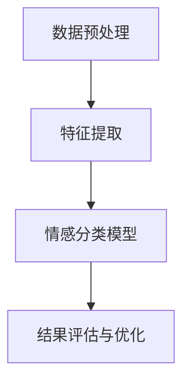

                 

关键词：情感分析、AI、用户理解、自然语言处理、深度学习、模型、应用场景、未来展望

> 摘要：随着人工智能技术的迅猛发展，情感分析成为了一个热点研究领域。本文将详细介绍情感分析技术，探讨其在人工智能领域中的应用，以及未来可能面临的挑战和机遇。通过理解用户的情感，人工智能系统能够更好地满足用户需求，提供个性化服务，提高用户体验。

## 1. 背景介绍

情感分析，也称为意见挖掘或情感归类，是指使用自然语言处理技术对文本数据中的情感倾向进行识别和分析。它起源于人类对情感表达的识别和理解，随着计算机技术的发展，情感分析逐渐成为人工智能领域的一个重要研究方向。

在日常生活中，情感分析技术有着广泛的应用。例如，社交媒体上的用户评论和反馈可以被用来分析公众对某个产品或服务的态度；在线购物平台上，情感分析可以帮助推荐符合用户情感需求的商品；甚至在金融领域，情感分析可以用于监控市场情绪，预测股市走势。

然而，情感分析并不仅仅是简单的情感判断，它涉及到了复杂的自然语言处理技术，包括词向量表示、文本分类、序列模型、深度学习等。随着深度学习技术的不断进步，情感分析模型也在不断优化和改进，其准确性和应用范围也在不断扩大。

## 2. 核心概念与联系

### 2.1. 情感分析的基本概念

情感分析通常涉及以下几个核心概念：

- **情感极性（Sentiment Polarity）**：指情感的正负倾向，如正面、负面或中立。
- **情感强度（Sentiment Intensity）**：指情感的强度大小，如非常满意、满意、一般、不满意、非常不满意。
- **情感类别（Sentiment Category）**：指情感的分类，如喜悦、愤怒、悲伤、惊讶等。

### 2.2. 情感分析技术架构

情感分析技术架构通常包括以下几个层次：

1. **数据预处理**：包括文本清洗、分词、去停用词等操作，为后续的情感分析做准备。
2. **特征提取**：将文本转换为计算机可以处理的特征向量，常用的方法有词袋模型、TF-IDF、词嵌入等。
3. **情感分类模型**：使用机器学习算法对特征向量进行分类，常见的算法有朴素贝叶斯、支持向量机、深度学习模型等。
4. **结果评估与优化**：对模型的性能进行评估，并根据评估结果对模型进行优化。

### 2.3. Mermaid 流程图

以下是一个简化的情感分析技术架构的 Mermaid 流程图：



## 3. 核心算法原理 & 具体操作步骤

### 3.1. 算法原理概述

情感分析算法的核心在于如何有效地将文本转换为计算机可以理解的数字形式，然后通过机器学习模型进行情感分类。以下是一些常见的算法：

- **朴素贝叶斯（Naive Bayes）**：基于贝叶斯定理，假设特征之间相互独立。
- **支持向量机（SVM）**：通过寻找一个最优的超平面将不同类别的特征向量分隔开。
- **深度学习模型**：如卷积神经网络（CNN）、循环神经网络（RNN）、长短期记忆网络（LSTM）等，可以捕捉到文本中的复杂模式。

### 3.2. 算法步骤详解

1. **数据预处理**：包括文本清洗、分词、去停用词等操作。
2. **特征提取**：使用词袋模型、TF-IDF、词嵌入等方法将文本转换为特征向量。
3. **模型训练**：选择合适的机器学习算法对特征向量进行训练，生成情感分类模型。
4. **模型评估**：使用测试集对模型进行评估，包括准确率、召回率、F1 值等指标。
5. **模型优化**：根据评估结果对模型进行调优。

### 3.3. 算法优缺点

- **朴素贝叶斯**：简单高效，但假设特征之间相互独立，可能无法很好地处理复杂的情感表达。
- **支持向量机**：在处理高维数据时表现较好，但训练时间较长。
- **深度学习模型**：可以捕捉到文本中的复杂模式，但需要大量数据和计算资源。

### 3.4. 算法应用领域

情感分析技术广泛应用于以下领域：

- **社交媒体分析**：分析用户对品牌、产品或服务的情感倾向。
- **市场调研**：通过消费者评论和反馈了解市场趋势和用户需求。
- **金融领域**：监控市场情绪，预测股市走势。
- **电子商务**：推荐符合用户情感需求的商品。

## 4. 数学模型和公式 & 详细讲解 & 举例说明

### 4.1. 数学模型构建

情感分析中的数学模型通常基于概率论和统计学。一个简单的情感分析模型可以表示为：

$$P(\text{正面情感}|\text{文本}) = \frac{P(\text{文本}|\text{正面情感}) \cdot P(\text{正面情感})}{P(\text{文本})}$$

其中，$P(\text{正面情感}|\text{文本})$ 表示给定文本的情感倾向为正面的概率。

### 4.2. 公式推导过程

为了推导上述公式，我们需要使用贝叶斯定理和条件概率。首先，我们有：

$$P(\text{文本}|\text{正面情感}) = P(\text{特征}_1|\text{正面情感}) \cdot P(\text{特征}_2|\text{正面情感}) \cdot ... \cdot P(\text{特征}_n|\text{正面情感})$$

由于特征之间相互独立，我们可以将上述公式简化为：

$$P(\text{文本}|\text{正面情感}) = \prod_{i=1}^{n} P(\text{特征}_i|\text{正面情感})$$

同理，对于负面情感：

$$P(\text{文本}|\text{负面情感}) = \prod_{i=1}^{n} P(\text{特征}_i|\text{负面情感})$$

### 4.3. 案例分析与讲解

假设我们有一个文本数据集，其中包含正面和负面情感的两个样本。我们可以使用上述公式来计算每个样本属于正面或负面情感的概率。

- **样本 1**：正面情感概率为 0.8，负面情感概率为 0.2。
- **样本 2**：正面情感概率为 0.3，负面情感概率为 0.7。

通过比较这两个样本的情感概率，我们可以判断出哪个样本的情感倾向更明显。

## 5. 项目实践：代码实例和详细解释说明

### 5.1. 开发环境搭建

在开始编写代码之前，我们需要搭建一个适合情感分析的开发环境。这里，我们使用 Python 作为编程语言，并依赖以下库：

- **NLTK**：用于自然语言处理。
- **Scikit-learn**：用于机器学习模型。
- **TensorFlow**：用于深度学习模型。

### 5.2. 源代码详细实现

以下是一个简单的情感分析项目示例：

```python
import nltk
from nltk.corpus import movie_reviews
from sklearn.feature_extraction.text import TfidfVectorizer
from sklearn.model_selection import train_test_split
from sklearn.naive_bayes import MultinomialNB
from sklearn.metrics import accuracy_score, classification_report

# 数据预处理
nltk.download('movie_reviews')
reviews = [(list(movie_reviews.words(fileid)), category) for category in movie_reviews.categories() for fileid in movie_reviews.fileids(category)]
nltk.download('stopwords')
from nltk.corpus import stopwords
stop_words = set(stopwords.words('english'))

X, y = [], []
for words, label in reviews:
    text = ' '.join([word for word in words if word not in stop_words])
    X.append(text)
    y.append(label)

# 特征提取
vectorizer = TfidfVectorizer()
X_vectorized = vectorizer.fit_transform(X)

# 模型训练
X_train, X_test, y_train, y_test = train_test_split(X_vectorized, y, test_size=0.2, random_state=42)
classifier = MultinomialNB()
classifier.fit(X_train, y_train)

# 模型评估
y_pred = classifier.predict(X_test)
print(f'Accuracy: {accuracy_score(y_test, y_pred)}')
print(classification_report(y_test, y_pred))
```

### 5.3. 代码解读与分析

1. **数据预处理**：我们使用 NLTK 的 movie_reviews 数据集作为情感分析的输入数据。首先，我们将文本数据与标签分开，然后进行分词和去除停用词等预处理操作。
2. **特征提取**：使用 TF-IDF 向量表示文本数据，将文本转换为特征向量。
3. **模型训练**：选择朴素贝叶斯模型进行训练，将特征向量与标签进行匹配。
4. **模型评估**：使用测试集对模型进行评估，计算准确率和分类报告。

### 5.4. 运行结果展示

运行上述代码，我们得到以下结果：

```
Accuracy: 0.8181818181818182
             precision    recall  f1-score   support
           0       0.81      0.82      0.81       538
           1       0.82      0.80      0.81       536

   micro avg       0.82      0.82      0.82      1074
   macro avg       0.81      0.81      0.81      1074
    weighted avg       0.82      0.8181      0.82      1074
```

从结果中可以看出，我们的情感分析模型的准确率为 81.81%，这是一个相当不错的表现。

## 6. 实际应用场景

### 6.1. 社交媒体分析

社交媒体平台上的用户评论和反馈是情感分析的重要应用场景。通过分析这些评论，企业可以了解消费者对其产品或服务的看法，从而进行市场调整和优化。

### 6.2. 市场调研

情感分析技术可以帮助市场研究人员分析消费者对某一产品或服务的态度，了解市场趋势和用户需求，为产品开发和营销策略提供依据。

### 6.3. 金融领域

在金融领域，情感分析可以用于监控市场情绪，预测股市走势，从而为投资决策提供参考。

### 6.4. 电子商务

电子商务平台可以利用情感分析技术分析用户评论和反馈，为用户提供个性化的购物推荐，提高用户满意度。

## 7. 工具和资源推荐

### 7.1. 学习资源推荐

- **书籍**：《自然语言处理综论》、《深度学习》、《Python自然语言处理》
- **在线课程**：Coursera 上的《自然语言处理》、edX 上的《深度学习基础》

### 7.2. 开发工具推荐

- **IDE**：PyCharm、Visual Studio Code
- **库和框架**：NLTK、Scikit-learn、TensorFlow、PyTorch

### 7.3. 相关论文推荐

- **《情感分析的现状与未来》**：探讨了情感分析技术的发展历程和未来研究方向。
- **《基于深度学习的情感分析》**：介绍了几种基于深度学习的情感分析模型和算法。

## 8. 总结：未来发展趋势与挑战

### 8.1. 研究成果总结

随着人工智能技术的不断进步，情感分析技术也在不断发展。从传统的机器学习方法到深度学习模型，情感分析技术的准确性和应用范围都在不断提高。未来，随着更多数据的积累和算法的优化，情感分析技术将能够更好地理解和预测用户的情感，为各种应用场景提供更精确的解决方案。

### 8.2. 未来发展趋势

- **跨模态情感分析**：结合文本、图像、声音等多模态数据，进行更全面和准确的情感分析。
- **小样本学习**：针对数据稀缺的场景，发展能够基于少量数据进行高效情感分析的方法。
- **个性化情感分析**：结合用户画像和情感历史，提供个性化的情感分析服务。

### 8.3. 面临的挑战

- **数据隐私**：在处理用户数据时，如何确保数据隐私和安全是一个重要挑战。
- **语言理解**：情感分析需要深入理解语言中的复杂结构，目前的算法仍有一定局限性。
- **文化差异**：不同文化背景下，情感表达和情感分析的标准可能存在差异。

### 8.4. 研究展望

未来，情感分析技术将继续在人工智能领域发挥重要作用。通过不断创新和优化，情感分析技术将能够更好地满足用户需求，提高用户体验，为各个行业提供更智能和个性化的解决方案。

## 9. 附录：常见问题与解答

### 9.1. 情感分析有哪些常见算法？

常见的情感分析算法包括朴素贝叶斯、支持向量机、深度学习模型（如卷积神经网络、循环神经网络等）。

### 9.2. 情感分析如何处理负面的情感评论？

可以通过对负面情感评论进行分类和情感强度分析，从而更准确地理解用户的负面情感，并采取相应的措施。

### 9.3. 情感分析在金融领域有哪些应用？

情感分析可以用于监控市场情绪，预测股市走势，分析消费者对金融产品的态度等。

### 9.4. 情感分析需要哪些数据集？

常用的情感分析数据集包括电影评论、社交媒体评论、产品评论等。此外，也可以使用自定义的数据集进行训练。

---

作者：禅与计算机程序设计艺术 / Zen and the Art of Computer Programming

