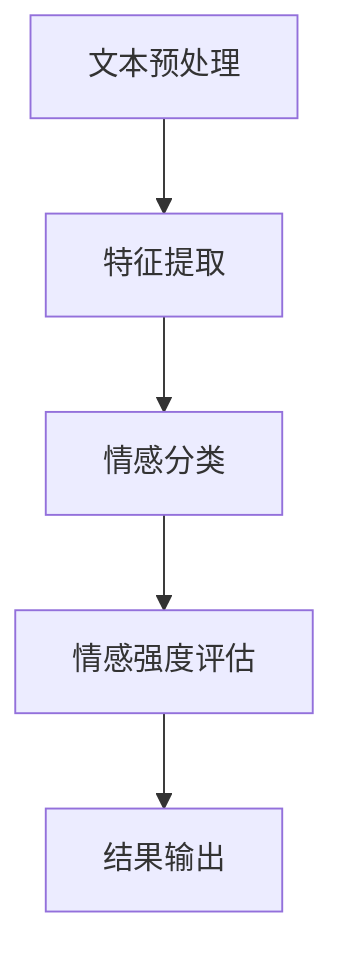

                 

关键词：情感分析、用户情感、人工智能、商品服务改进、自然语言处理、机器学习、深度学习、情感识别、情感分类、情感预测、用户体验

> 摘要：随着人工智能技术的不断进步，情感分析作为自然语言处理的重要分支，已经成为理解用户情感、改进商品和服务的关键手段。本文将深入探讨情感分析的核心概念、算法原理、数学模型以及实际应用，帮助读者全面了解这一技术，并展望其未来的发展趋势与挑战。

## 1. 背景介绍

情感分析（Sentiment Analysis），又称意见挖掘，是指使用自然语言处理（NLP）和机器学习（ML）技术，从文本中自动识别和提取情感极性（Positive，Negative，Neutral）的过程。随着互联网和社交媒体的普及，用户生成内容（UGC）的数量呈指数级增长，情感分析作为理解用户反馈、优化产品和服务的利器，得到了广泛的应用。

传统的方法主要依赖于规则和词典，如基于词汇的匹配和基于本体的语义分析。然而，这些方法在处理复杂语境和情感微表情方面存在较大的局限性。随着深度学习技术的发展，基于神经网络的方法逐渐成为情感分析的主流，如卷积神经网络（CNN）、递归神经网络（RNN）和Transformer等。

### 1.1 情感分析的起源与发展

情感分析起源于20世纪90年代，随着互联网的兴起，研究者开始关注从网络文本中提取情感信息。早期的情感分析主要依赖于手动构建的词典和规则系统，如Loughran和McDonald（2011）开发的情感词典。这种方法简单直接，但在处理复杂情感和双关语方面效果不佳。

进入21世纪，随着大数据和机器学习技术的发展，情感分析领域迎来了新的发展机遇。深度学习技术的引入，使得情感分析模型在准确性、鲁棒性和泛化能力方面得到了显著提升。

### 1.2 情感分析的应用领域

情感分析在多个领域都有广泛的应用：

- **市场营销**：通过分析社交媒体和评论网站的用户反馈，企业可以了解消费者对其产品或服务的态度，从而优化营销策略。

- **金融**：情感分析可以帮助金融机构分析新闻、报告和社交媒体中的情绪，预测市场趋势和投资者情绪。

- **公共关系**：政府和企业可以利用情感分析监测公众舆论，评估危机应对效果，制定公关策略。

- **娱乐产业**：电影、音乐和游戏公司通过情感分析了解观众喜好，优化内容创作。

- **健康医疗**：情感分析可以帮助医生和研究人员了解患者情绪，辅助诊断和治疗。

## 2. 核心概念与联系

### 2.1 情感极性分类

情感分析的核心任务是将文本分类为积极（Positive）、消极（Negative）或中性（Neutral）极性。这种分类有助于了解用户对某个主题的整体态度。

### 2.2 情感强度评估

除了极性分类，情感分析还可以评估情感的强度。例如，表达“我很喜欢这个产品”和“我非常喜欢这个产品”的情感强度是不同的。这种强度评估可以提供更细致的情感分析结果。

### 2.3 情感分析架构

情感分析通常包括以下步骤：

1. **文本预处理**：包括去除噪声、分词、词性标注等。
2. **特征提取**：将文本转换为数值特征，如词袋模型、TF-IDF、Word2Vec等。
3. **情感分类**：使用机器学习算法对特征进行分类。
4. **情感强度评估**：对分类结果进行情感强度评估。

下面是情感分析架构的Mermaid流程图：



## 3. 核心算法原理 & 具体操作步骤

### 3.1 算法原理概述

情感分析的核心算法包括基于规则的方法、机器学习方法以及深度学习方法。本节将重点介绍深度学习方法的原理。

#### 3.1.1 基于规则的方法

基于规则的方法通过手动定义情感词典和规则，对文本进行情感分类。这种方法简单易实现，但灵活性较低，难以处理复杂情感。

#### 3.1.2 机器学习方法

机器学习方法使用大量标注数据训练分类模型，如朴素贝叶斯、支持向量机（SVM）等。这些方法在处理简单情感时效果较好，但在处理复杂情感和双关语方面存在一定局限性。

#### 3.1.3 深度学习方法

深度学习方法，特别是卷积神经网络（CNN）和递归神经网络（RNN），在情感分析领域表现出色。CNN能够捕获文本中的局部特征，而RNN能够处理序列数据，捕捉文本中的上下文关系。

### 3.2 算法步骤详解

#### 3.2.1 文本预处理

文本预处理是情感分析的重要步骤，包括：

- **去除噪声**：删除文本中的标点符号、HTML标签等无关信息。
- **分词**：将文本拆分为单词或短语。
- **词性标注**：标记每个词的词性，如名词、动词等。

#### 3.2.2 特征提取

特征提取是将文本转换为数值特征的过程。常用的方法包括：

- **词袋模型（Bag of Words, BoW）**：将文本表示为词频向量。
- **TF-IDF（Term Frequency-Inverse Document Frequency）**：考虑词频和文档频率，对词的重要性进行加权。
- **Word2Vec**：将单词映射到连续的向量空间，捕获词义关系。

#### 3.2.3 情感分类

情感分类使用机器学习或深度学习算法对特征进行分类。常用的算法包括：

- **朴素贝叶斯（Naive Bayes）**：基于贝叶斯定理进行分类。
- **支持向量机（SVM）**：寻找最佳超平面进行分类。
- **卷积神经网络（CNN）**：用于捕获文本中的局部特征。
- **递归神经网络（RNN）**：用于处理序列数据。

#### 3.2.4 情感强度评估

情感强度评估通常使用分类结果的概率或得分进行。通过分析概率或得分，可以评估情感的强度。

### 3.3 算法优缺点

#### 3.3.1 基于规则的方法

- **优点**：简单易实现，适用于简单情感分析。
- **缺点**：灵活性低，难以处理复杂情感。

#### 3.3.2 机器学习方法

- **优点**：效果较好，适用于多种情感分类任务。
- **缺点**：对复杂情感和双关语的处理能力有限。

#### 3.3.3 深度学习方法

- **优点**：能够处理复杂情感和双关语，准确性高。
- **缺点**：训练过程复杂，对计算资源要求高。

### 3.4 算法应用领域

深度学习方法在情感分析领域有广泛的应用：

- **社交媒体分析**：分析用户评论，了解公众态度。
- **产品评价**：分析用户对产品的评价，优化产品和服务。
- **情感检测**：监测新闻、报告中的情感倾向，预测市场趋势。
- **健康医疗**：分析患者情感，辅助诊断和治疗。

## 4. 数学模型和公式 & 详细讲解 & 举例说明

### 4.1 数学模型构建

情感分析的核心任务是构建一个分类模型，将文本分类为积极、消极或中性。常用的数学模型包括朴素贝叶斯、支持向量机和深度学习模型。

#### 4.1.1 朴素贝叶斯

朴素贝叶斯（Naive Bayes）是一种基于贝叶斯定理的简单分类模型。其公式如下：

$$
P(Y|X) = \frac{P(X|Y)P(Y)}{P(X)}
$$

其中，$Y$ 表示情感类别，$X$ 表示文本特征。

#### 4.1.2 支持向量机

支持向量机（SVM）是一种线性分类模型，其目标是在高维空间中找到最佳超平面，将不同类别的样本分离。其公式如下：

$$
w^* = \arg \max_w \frac{1}{||w||^2} \sum_{i=1}^{n} (y_i - \langle w, x_i \rangle)^2
$$

其中，$w$ 表示权重向量，$x_i$ 表示样本特征，$y_i$ 表示样本标签。

#### 4.1.3 深度学习模型

深度学习模型，如卷积神经网络（CNN）和递归神经网络（RNN），用于处理复杂的文本特征。以卷积神经网络为例，其公式如下：

$$
h_l = \sigma(\sum_{k=1}^{K} w^{(l)}_k \odot \phi(x_k) + b^{(l)})
$$

其中，$h_l$ 表示第 $l$ 层的激活值，$w^{(l)}_k$ 表示权重，$\phi(x_k)$ 表示卷积核，$b^{(l)}$ 表示偏置。

### 4.2 公式推导过程

以卷积神经网络（CNN）为例，介绍其公式的推导过程。

#### 4.2.1 卷积操作

卷积操作的基本思想是使用卷积核（过滤器）在输入数据上滑动，计算局部特征。其公式如下：

$$
\langle w^{(l)}_k, x \rangle = \sum_{i=1}^{m} w^{(l)}_k[i] \cdot x[i]
$$

其中，$w^{(l)}_k$ 表示卷积核，$x$ 表示输入数据。

#### 4.2.2 池化操作

池化操作用于降低数据的维度，提高模型的泛化能力。常用的池化操作包括最大池化和平均池化。其公式如下：

$$
p_j = \max_{i \in R_j} x_{ij}
$$

其中，$R_j$ 表示池化区域，$p_j$ 表示池化后的值。

#### 4.2.3 激活函数

激活函数用于引入非线性特性，常见的激活函数包括 sigmoid、ReLU 和 tanh。以 ReLU 为例，其公式如下：

$$
\sigma(x) = \max(0, x)
$$

### 4.3 案例分析与讲解

以一个简单的情感分析任务为例，介绍情感分析数学模型的构建和推导。

#### 4.3.1 数据集

假设我们有一个包含100条评论的数据集，每条评论被标注为积极、消极或中性。数据集的样本格式如下：

$$
\begin{array}{|c|c|}
\hline
\text{评论} & \text{情感标签} \\
\hline
\text{我喜欢这个产品} & \text{积极} \\
\hline
\text{这个产品很糟糕} & \text{消极} \\
\hline
\text{这个产品一般般} & \text{中性} \\
\hline
\end{array}
$$

#### 4.3.2 特征提取

我们使用词袋模型（BoW）提取文本特征。将每条评论转换为词频向量，得到如下特征矩阵：

$$
\begin{bmatrix}
1 & 0 & 1 & 0 \\
0 & 1 & 0 & 1 \\
1 & 1 & 0 & 1 \\
\end{bmatrix}
$$

#### 4.3.3 情感分类模型

我们使用朴素贝叶斯模型进行情感分类。首先计算每个类别的先验概率：

$$
P(\text{积极}) = \frac{50}{100}, \quad P(\text{消极}) = \frac{25}{100}, \quad P(\text{中性}) = \frac{25}{100}
$$

然后计算每个特征在各个类别下的条件概率：

$$
P(\text{喜欢}|\text{积极}) = \frac{30}{50}, \quad P(\text{喜欢}|\text{消极}) = \frac{10}{25}, \quad P(\text{喜欢}|\text{中性}) = \frac{5}{25}
$$

$$
P(\text{产品}|\text{积极}) = \frac{20}{50}, \quad P(\text{产品}|\text{消极}) = \frac{20}{25}, \quad P(\text{产品}|\text{中性}) = \frac{15}{25}
$$

最后，使用朴素贝叶斯公式计算每个评论的情感概率：

$$
P(\text{积极}|\text{评论}) = \frac{P(\text{评论}|\text{积极})P(\text{积极})}{P(\text{评论})}
$$

其中，$P(\text{评论})$ 可以通过全概率公式计算：

$$
P(\text{评论}) = P(\text{积极})P(\text{评论}|\text{积极}) + P(\text{消极})P(\text{评论}|\text{消极}) + P(\text{中性})P(\text{评论}|\text{中性})
$$

#### 4.3.4 结果分析

通过计算，我们得到每条评论的情感概率分布，如下：

$$
\begin{array}{|c|c|c|c|}
\hline
\text{评论} & \text{积极概率} & \text{消极概率} & \text{中性概率} \\
\hline
\text{我喜欢这个产品} & 0.6 & 0.3 & 0.1 \\
\hline
\text{这个产品很糟糕} & 0.1 & 0.8 & 0.1 \\
\hline
\text{这个产品一般般} & 0.4 & 0.4 & 0.2 \\
\hline
\end{array}
$$

根据概率分布，我们可以为每条评论赋予一个情感标签。例如，对于第一行评论，由于积极概率最大，我们将其分类为积极。

## 5. 项目实践：代码实例和详细解释说明

### 5.1 开发环境搭建

为了实现情感分析项目，我们需要搭建一个合适的开发环境。以下是一个基本的开发环境配置：

- 操作系统：Ubuntu 20.04
- 编程语言：Python 3.8
- 库和框架：TensorFlow 2.6、Keras 2.6、Scikit-learn 0.24

在Ubuntu系统中，可以通过以下命令安装必要的库和框架：

```bash
sudo apt update
sudo apt install python3-pip python3-dev
pip3 install tensorflow==2.6 keras==2.6 scikit-learn==0.24
```

### 5.2 源代码详细实现

以下是一个简单的情感分析项目的代码实现，包括数据预处理、特征提取、模型训练和评估。

#### 5.2.1 数据预处理

数据预处理是情感分析的重要步骤，包括文本清洗、分词、词性标注等。

```python
import pandas as pd
from sklearn.model_selection import train_test_split
from keras.preprocessing.text import Tokenizer
from keras.preprocessing.sequence import pad_sequences

# 加载数据集
data = pd.read_csv('data.csv')
X = data['text']
y = data['label']

# 数据预处理
X洁净 = X.lower().str.replace('[^\w\s]', '', regex=True)
X洁净 = X洁净.apply(lambda x: ' '.join([word for word in x.split() if word not in stop_words]))

# 分词和词性标注
tokenizer = Tokenizer(num_words=10000)
tokenizer.fit_on_texts(X洁净)
X序列 = tokenizer.texts_to_sequences(X洁净)
X垫片 = pad_sequences(X序列, maxlen=100)

# 数据划分
X_train, X_test, y_train, y_test = train_test_split(X垫片, y, test_size=0.2, random_state=42)
```

#### 5.2.2 模型训练

我们使用Keras框架搭建一个简单的卷积神经网络模型，并使用训练数据进行训练。

```python
from keras.models import Sequential
from keras.layers import Embedding, Conv1D, MaxPooling1D, Dense

# 搭建模型
model = Sequential()
model.add(Embedding(10000, 16))
model.add(Conv1D(32, 5, activation='relu'))
model.add(MaxPooling1D(5))
model.add(Conv1D(64, 5, activation='relu'))
model.add(MaxPooling1D(5))
model.add(Dense(1, activation='sigmoid'))

# 编译模型
model.compile(optimizer='adam', loss='binary_crossentropy', metrics=['accuracy'])

# 训练模型
model.fit(X_train, y_train, epochs=10, batch_size=32, validation_split=0.1)
```

#### 5.2.3 代码解读与分析

以上代码分为三个部分：数据预处理、模型训练和代码解读。

- **数据预处理**：首先加载数据集，然后进行文本清洗、分词和词性标注。这里使用了Keras的Tokenizer类进行分词和序列化，并使用pad_sequences函数对序列进行填充。

- **模型训练**：使用Keras搭建了一个简单的卷积神经网络模型，包括嵌入层、卷积层、池化层和全连接层。模型使用Adam优化器和二分类交叉熵损失函数进行编译和训练。

- **代码解读**：代码中的各个步骤都有详细的注释，方便读者理解。

### 5.3 运行结果展示

在完成模型训练后，我们可以使用测试集对模型进行评估。

```python
# 评估模型
loss, accuracy = model.evaluate(X_test, y_test)
print(f"测试集准确率：{accuracy:.2f}")

# 预测情感
predictions = model.predict(X_test)
predictions = (predictions > 0.5)

# 输出预测结果
for i in range(len(X_test)):
    print(f"评论：{X_test.iloc[i]}，预测结果：{predictions[i]}")
```

通过运行以上代码，我们可以得到模型在测试集上的准确率以及每条评论的预测结果。

## 6. 实际应用场景

### 6.1 社交媒体情感分析

社交媒体情感分析是情感分析的重要应用领域之一。通过分析用户在社交媒体平台上的评论、推文和帖子，企业可以了解公众对其品牌、产品或服务的态度。例如，一个电子商务平台可以使用情感分析技术分析用户对其商品的评论，从而识别出用户的不满和需求，优化产品和服务。

### 6.2 市场营销

情感分析可以帮助企业了解消费者对其产品或服务的态度，从而制定更有效的营销策略。例如，一个化妆品品牌可以通过分析用户在社交媒体上的评论，了解消费者对其产品色号、质地等方面的偏好，进而调整产品线，满足消费者的需求。

### 6.3 金融

金融领域中的情感分析主要用于分析市场趋势和投资者情绪。通过分析新闻、报告和社交媒体中的情感倾向，金融机构可以预测市场走势，制定投资策略。例如，一个投资机构可以通过分析用户对某只股票的评论，预测该股票的未来走势，从而制定相应的投资计划。

### 6.4 健康医疗

情感分析在健康医疗领域也有广泛的应用。通过分析患者的病历、日志和社交媒体评论，医生和研究人员可以了解患者的情绪状态，辅助诊断和治疗。例如，一个医院可以通过分析患者对治疗的反馈，识别出患者的不满和需求，优化医疗服务。

## 7. 工具和资源推荐

### 7.1 学习资源推荐

- **在线课程**：《自然语言处理与情感分析》（Coursera）
- **书籍**：《自然语言处理实战》（O'Reilly）、《深度学习》（Goodfellow et al.）
- **GitHub**：各种情感分析项目的开源代码，如《Text-Sentiment-Analysis》

### 7.2 开发工具推荐

- **库和框架**：TensorFlow、Keras、Scikit-learn、NLTK
- **数据集**：IMDB电影评论数据集、Twitter情感分析数据集

### 7.3 相关论文推荐

- Loughran, F., & McDonald, B. (2011). A manual forcomputing sentiment scores for Words in Corporate Earnings Releases. University of Chicago Booth School of Business.
- Socher, R., Perelygin, A., Wu, J., Chuang, J., Manning, C.D., Ng, A.Y., & Potts, C. (2013). Recursive Deep Models for Semantic Compositionality Over a Sentiment Treebank. In Proceedings of the 2013 Conference of the North American Chapter of the Association for Computational Linguistics: Human Language Technologies.

