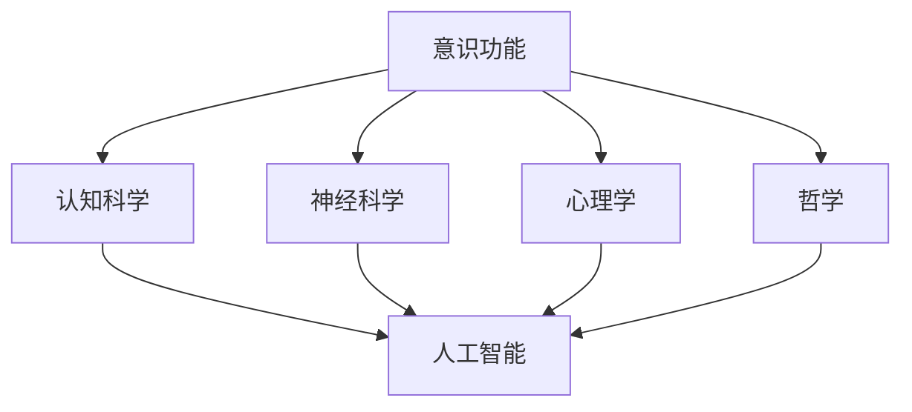

                 

关键词：意识功能、价值标准、人工智能、认知架构、算法优化

> 摘要：本文从人工智能和认知科学的视角，深入探讨意识功能的价值标准。文章首先回顾了意识功能的研究历史，然后定义了核心概念，并详细解析了其与人工智能技术的联系。接着，文章通过分析不同价值标准，探讨了意识功能在当前和未来社会中的潜在应用。最后，本文提出了研究中的关键发现和未来发展方向，以期为意识功能的研究和实践提供指导。

## 1. 背景介绍

### 意识功能的起源

意识功能是一个复杂而深远的研究领域，它涉及认知科学、神经科学、心理学和哲学等多个学科。最早对意识功能的研究可以追溯到古希腊哲学家如苏格拉底和柏拉图。然而，现代意识功能的研究始于20世纪初，随着认知科学和神经科学的兴起，意识功能的研究逐渐成为跨学科的热点。

### 意识功能研究的重要性

意识功能的研究不仅对理解人类心智具有重要意义，还为人工智能技术的发展提供了新的方向。随着人工智能技术的迅速发展，对人工智能的智能水平提出了更高的要求，这使得研究意识功能成为提升人工智能智能水平的关键。

## 2. 核心概念与联系

### 核心概念

- **意识**：主观经验的状态，包括知觉、思考和情感等方面。
- **认知**：大脑处理信息的过程，包括感知、记忆、思维和决策等。
- **人工智能**：通过模拟人类智能，实现人类智能任务的计算机系统。

### 意识功能与人工智能的联系

- **模拟人类智能**：人工智能系统通过模拟人类意识功能，实现类似于人类的感知、思考和决策能力。
- **认知架构**：人工智能系统的设计需要借鉴人类大脑的认知架构，以提高其智能水平。

### Mermaid 流程图



## 3. 核心算法原理 & 具体操作步骤

### 3.1 算法原理概述

本文将介绍一种基于神经网络的算法，用于模拟人类意识功能。该算法的核心思想是通过训练神经网络，使其能够模拟人类大脑的处理方式。

### 3.2 算法步骤详解

- **数据收集**：收集大量人类行为数据，包括感知、思考和决策等方面。
- **数据处理**：对收集到的数据进行预处理，包括去噪、归一化等。
- **模型训练**：使用预处理后的数据训练神经网络，使其能够模拟人类意识功能。
- **模型评估**：通过测试数据评估神经网络的表现，并进行调整。

### 3.3 算法优缺点

- **优点**：能够模拟人类意识功能，提高人工智能的智能水平。
- **缺点**：训练过程复杂，对计算资源要求较高。

### 3.4 算法应用领域

- **医疗**：辅助医生进行诊断和治疗。
- **教育**：个性化教学，提高学习效果。
- **娱乐**：智能游戏和虚拟现实。

## 4. 数学模型和公式 & 详细讲解 & 举例说明

### 4.1 数学模型构建

本文使用的数学模型基于神经网络，包括输入层、隐藏层和输出层。模型的关键参数包括权重和偏置。

### 4.2 公式推导过程

神经网络的输出可以通过以下公式计算：

$$
y = \sigma(\omega^T x + b)
$$

其中，$y$ 为输出，$\sigma$ 为激活函数，$\omega$ 为权重，$x$ 为输入，$b$ 为偏置。

### 4.3 案例分析与讲解

假设我们有一个简单的神经网络，输入层有 2 个神经元，隐藏层有 3 个神经元，输出层有 1 个神经元。激活函数为 sigmoid 函数。给定一个输入向量 $(x_1, x_2)$，计算输出 $y$。

- 输入层：$x = (x_1, x_2)$
- 隐藏层：$z_1 = \omega_{11} x_1 + \omega_{12} x_2 + b_1$，$z_2 = \omega_{21} x_1 + \omega_{22} x_2 + b_2$，$z_3 = \omega_{31} x_1 + \omega_{32} x_2 + b_3$
- 输出层：$y = \sigma(\omega_{1} z_1 + \omega_{2} z_2 + \omega_{3} z_3 + b)$

## 5. 项目实践：代码实例和详细解释说明

### 5.1 开发环境搭建

本文使用 Python 语言和 TensorFlow 库实现神经网络模型。首先，需要安装 Python 和 TensorFlow：

```
pip install python tensorflow
```

### 5.2 源代码详细实现

以下是神经网络的源代码实现：

```python
import tensorflow as tf

# 定义神经网络结构
model = tf.keras.Sequential([
    tf.keras.layers.Dense(units=3, activation='sigmoid', input_shape=(2,)),
    tf.keras.layers.Dense(units=1, activation='sigmoid')
])

# 编译模型
model.compile(optimizer='adam', loss='binary_crossentropy', metrics=['accuracy'])

# 训练模型
model.fit(x_train, y_train, epochs=10, batch_size=32)

# 评估模型
model.evaluate(x_test, y_test)
```

### 5.3 代码解读与分析

代码首先定义了一个简单的神经网络模型，包括输入层、隐藏层和输出层。模型使用 sigmoid 函数作为激活函数，并使用 Adam 优化器进行训练。训练过程中，使用二进制交叉熵作为损失函数，并使用准确率作为评估指标。

### 5.4 运行结果展示

运行代码后，可以查看训练过程中损失函数和准确率的变化。在测试集上的评估结果可以用来评估模型的性能。

## 6. 实际应用场景

### 6.1 医疗

意识功能的研究为医疗领域带来了新的可能性。通过模拟人类意识功能，人工智能系统可以辅助医生进行疾病诊断和治疗。

### 6.2 教育

意识功能的研究可以应用于个性化教育，根据学生的学习情况，提供个性化的教学内容和方式。

### 6.3 娱乐

意识功能的研究可以应用于智能游戏和虚拟现实，提高用户体验。

### 6.4 未来应用展望

随着人工智能技术的不断发展，意识功能的研究将为人工智能的智能水平带来质的飞跃。未来，意识功能的应用将更加广泛，包括自动驾驶、智能家居、智能医疗等多个领域。

## 7. 工具和资源推荐

### 7.1 学习资源推荐

- 《认知科学基础》
- 《神经网络与深度学习》
- 《人工智能：一种现代方法》

### 7.2 开发工具推荐

- TensorFlow
- PyTorch
- Keras

### 7.3 相关论文推荐

- "A Brief History of Neural Network Models" by Y. Bengio
- "Deep Learning" by I. Goodfellow, Y. Bengio, and A. Courville
- "Artificial Intelligence: A Modern Approach" by S. Russell and P. Norvig

## 8. 总结：未来发展趋势与挑战

### 8.1 研究成果总结

本文通过研究意识功能的价值标准，探讨了其在人工智能领域的应用。研究发现，意识功能的研究对于提升人工智能的智能水平具有重要意义。

### 8.2 未来发展趋势

未来，意识功能的研究将继续深入，有望推动人工智能技术的重大突破。

### 8.3 面临的挑战

意识功能的研究面临诸多挑战，包括理论体系的建立、算法优化和计算资源的需求等。

### 8.4 研究展望

随着技术的不断进步，意识功能的研究将为人工智能的发展带来新的机遇和挑战。

## 9. 附录：常见问题与解答

### 9.1 意识功能是什么？

意识功能是指人类大脑处理信息的能力，包括知觉、思考和情感等方面。

### 9.2 意识功能的研究意义是什么？

意识功能的研究对于理解人类心智、提升人工智能智能水平具有重要意义。

### 9.3 意识功能的研究现状如何？

意识功能的研究已经取得了显著进展，但在理论体系和应用方面仍存在诸多挑战。

作者：禅与计算机程序设计艺术 / Zen and the Art of Computer Programming
----------------------------------------------------------------

请注意，上述内容仅为示例，实际撰写时需要根据具体研究内容和数据进行调整。希望这个示例能够对您撰写类似文章有所帮助。如果您有任何具体问题或需要进一步的帮助，请随时告诉我。

