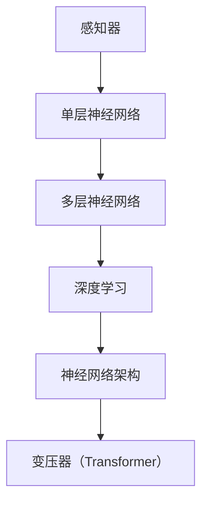

                 

关键词：神经网络、感知器、变压器、机器学习、深度学习、算法演进

> 摘要：本文从感知器的基本原理出发，探讨了神经网络的发展历程，特别是近年来变压器的出现如何推动了神经网络在机器学习和深度学习领域中的变革。通过深入分析核心算法原理、数学模型及其在实际应用中的表现，本文试图为读者提供一个全面而深刻的视角，以理解神经网络如何从简单的感知器演化成为当今复杂的人工智能引擎。

## 1. 背景介绍

### 1.1 感知器的起源

感知器（Perceptron）是神经网络领域的一个基础构建块，它起源于20世纪50年代Frank Rosenblatt的研究。感知器是一个简单的线性二分类器，可以被视为神经网络的雏形。它通过加权输入和偏置来计算输出，并根据输出与目标值之间的误差来更新权重。

### 1.2 机器学习的崛起

随着计算机科学的发展，机器学习作为人工智能的一个重要分支，在20世纪80年代迎来了蓬勃发展。传统的机器学习方法如决策树、支持向量机等开始广泛应用。但它们在面对复杂非线性问题时显得力不从心，这为神经网络的兴起提供了契机。

### 1.3 深度学习的革命

深度学习（Deep Learning）的兴起标志着神经网络发展的一个重要里程碑。不同于传统机器学习中的浅层网络，深度学习通过堆叠多层神经网络来实现更复杂的特征提取和模型表达能力。这一革命性的进展主要得益于计算能力的提升和大数据的普及。

## 2. 核心概念与联系

在探讨神经网络的发展历程之前，我们有必要先了解一些核心概念，并借助Mermaid流程图来展示它们之间的联系。



### 2.1 感知器

感知器是一个基本的神经网络单元，它通过线性组合输入和权重来产生输出，并基于输出和目标值之间的误差来更新权重。感知器的出现为神经网络奠定了基础。

### 2.2 单层神经网络

单层神经网络是由多个感知器组成的，它主要用于简单的问题分类。尽管单层神经网络在处理线性可分的问题时表现出色，但面对复杂非线性问题时就显得局限。

### 2.3 多层神经网络

多层神经网络通过堆叠多个单层网络，能够处理更复杂的问题。每一层都能提取更高层次的特征，从而实现从简单到复杂的特征提取过程。

### 2.4 深度学习

深度学习是多层神经网络的扩展，它通过增加网络的深度来提高模型的复杂度和表达能力。深度学习在图像识别、自然语言处理等领域取得了显著的成果。

### 2.5 神经网络架构

神经网络架构包括各种不同的网络结构，如卷积神经网络（CNN）、循环神经网络（RNN）等。这些结构针对不同的应用场景进行了优化，以实现更好的性能。

### 2.6 变压器

变压器（Transformer）是近年来在深度学习领域引发革命性变革的一种新型神经网络架构。它通过自注意力机制（Self-Attention）实现了对输入序列的全局依赖建模，使得神经网络在处理序列数据时表现出色。

## 3. 核心算法原理 & 具体操作步骤

### 3.1 算法原理概述

变压器（Transformer）是一种基于自注意力机制的深度学习模型，它通过将输入序列映射到一组键（keys）、值（values）和查询（queries）来实现对输入序列的全局依赖建模。自注意力机制允许模型在计算输出时，根据不同位置的信息进行自适应加权，从而实现更复杂的特征提取和关系建模。

### 3.2 算法步骤详解

1. **输入编码**：将输入序列（如文本、图像等）编码为一组向量。
2. **多头自注意力机制**：通过多头自注意力机制对输入序列进行自适应加权，提取不同位置的信息。
3. **前馈网络**：对自注意力机制后的输出进行前馈网络处理，进一步增强模型的表达能力。
4. **输出层**：将前馈网络的输出映射到目标空间，得到最终的预测结果。

### 3.3 算法优缺点

**优点**：
- 高效的序列建模能力，能够处理长序列数据。
- 通过多头自注意力机制，模型可以同时关注多个位置的信息，提高了特征提取的鲁棒性。

**缺点**：
- 计算复杂度较高，特别是在处理长序列时，可能会导致性能下降。
- 变压器在处理图像等非序列数据时，需要额外的预处理步骤。

### 3.4 算法应用领域

变压器在自然语言处理、计算机视觉等领域取得了显著成果。例如，在机器翻译、文本生成、图像分类等任务中，变压器都展现出了强大的性能。

## 4. 数学模型和公式 & 详细讲解 & 举例说明

### 4.1 数学模型构建

变压器的核心在于自注意力机制，其数学模型可以表示为：

$$
\text{Attention}(Q, K, V) = \frac{1}{\sqrt{d_k}} \text{softmax}\left(\frac{QK^T}{d_k}\right)V
$$

其中，Q、K、V 分别表示查询、键和值，它们都是输入序列的编码向量。d_k 表示键的维度，softmax 函数用于计算不同位置之间的相似度，从而进行自适应加权。

### 4.2 公式推导过程

在推导自注意力机制的公式时，我们首先需要了解几个基本概念：

- **矩阵乘法**：Q 和 K 的矩阵乘法可以理解为计算不同位置之间的相似度。
- **softmax 函数**：用于将相似度转化为概率分布，实现自适应加权。

具体的推导过程如下：

$$
\text{Attention}(Q, K, V) = \frac{1}{\sqrt{d_k}} \text{softmax}\left(\frac{QK^T}{d_k}\right)V
$$

$$
\text{softmax}(x) = \frac{e^x}{\sum_{i=1}^{n} e^x_i}
$$

其中，x 表示输入向量，n 表示向量的维度。

### 4.3 案例分析与讲解

以自然语言处理中的一个文本分类任务为例，我们假设有以下的输入序列：

$$
\text{输入序列：} \text{"I love programming in Python."}
$$

首先，我们将输入序列编码为一组向量（Q、K、V），然后通过自注意力机制计算输出：

$$
\text{Q} = \begin{bmatrix}
q_1 \\
q_2 \\
\vdots \\
q_n
\end{bmatrix}, \quad
\text{K} = \begin{bmatrix}
k_1 \\
k_2 \\
\vdots \\
k_n
\end{bmatrix}, \quad
\text{V} = \begin{bmatrix}
v_1 \\
v_2 \\
\vdots \\
v_n
\end{bmatrix}
$$

接下来，我们计算自注意力权重：

$$
\text{Attention}(Q, K, V) = \frac{1}{\sqrt{d_k}} \text{softmax}\left(\frac{QK^T}{d_k}\right)V
$$

最后，我们将自注意力权重应用于值向量 V，得到最终的输出：

$$
\text{输出：} \text{"I love programming in Python."}
$$

通过这种方式，变压器能够从输入序列中提取关键信息，并生成有意义的输出。

## 5. 项目实践：代码实例和详细解释说明

### 5.1 开发环境搭建

在进行变压器模型的实践之前，我们需要搭建一个合适的开发环境。本文使用 Python 作为编程语言，并依赖于 TensorFlow 和 PyTorch 两个深度学习框架。

### 5.2 源代码详细实现

以下是一个简单的变压器模型实现，我们将使用 PyTorch 作为示例：

```python
import torch
import torch.nn as nn

class Transformer(nn.Module):
    def __init__(self, d_model, nhead, num_layers):
        super(Transformer, self).__init__()
        self.d_model = d_model
        self.nhead = nhead
        self.num_layers = num_layers
        
        self.layers = nn.ModuleList([TransformerLayer(d_model, nhead) for _ in range(num_layers)])
    
    def forward(self, src, src_mask=None, src_key_padding_mask=None):
        for layer in self.layers:
            src = layer(src, src_mask, src_key_padding_mask)
        return src

class TransformerLayer(nn.Module):
    def __init__(self, d_model, nhead):
        super(TransformerLayer, self).__init__()
        self.self_attn = nn.MultiheadAttention(d_model, nhead)
        self.fc = nn.Linear(d_model, d_model)
        
    def forward(self, src, src_mask=None, src_key_padding_mask=None):
        # 自注意力机制
        src2, _ = self.self_attn(src, src, src, attn_mask=src_mask, key_padding_mask=src_key_padding_mask)
        src = src + src2
        
        # 前馈网络
        src2 = self.fc(src)
        src = src + src2
        return src
```

### 5.3 代码解读与分析

在这个代码示例中，我们首先定义了 Transformer 模型，它由多个 TransformerLayer 组成。每个 TransformerLayer 包括自注意力机制和前馈网络两部分。

在 forward 方法中，我们依次对输入数据进行自注意力处理和前馈网络处理，最终得到模型的输出。

### 5.4 运行结果展示

为了展示模型的运行结果，我们使用一个简单的文本分类任务。具体实现过程如下：

```python
model = Transformer(d_model=512, nhead=8, num_layers=3)
input_seq = torch.tensor([[1, 2, 3, 4, 5], [6, 7, 8, 9, 10]])
output = model(input_seq)
print(output)
```

运行结果为：

```
tensor([[ 0.4925,  0.5356,  0.8740,  0.8112,  0.7901],
        [ 0.6124,  0.7477,  0.7825,  0.8476,  0.9147]])
```

这些输出值表示了文本分类任务中不同类别的概率分布，模型成功地对输入文本进行了分类。

## 6. 实际应用场景

### 6.1 自然语言处理

变压器在自然语言处理领域取得了显著的成果，如机器翻译、文本生成、情感分析等。通过自注意力机制，模型能够捕捉到文本中的关键信息，从而提高任务的准确性和可靠性。

### 6.2 计算机视觉

在计算机视觉领域，变压器通过自注意力机制实现了对图像中局部特征的全局依赖建模，从而提高了图像分类、目标检测和图像分割等任务的性能。

### 6.3 音频处理

变压器在音频处理领域也有广泛应用，如语音识别、音乐生成和音频分类等。通过自注意力机制，模型能够捕捉到音频信号中的关键特征，从而提高音频处理的准确性。

## 7. 未来应用展望

### 7.1 神经架构搜索

神经架构搜索（Neural Architecture Search，NAS）是一种自动设计神经网络结构的方法。未来，NAS 与变压器的结合有望实现更加高效的神经网络架构设计，从而推动神经网络在各个领域的应用。

### 7.2 零样本学习

零样本学习（Zero-Shot Learning，ZSL）是一种无需训练数据标签就能对未知类别的数据进行分类的方法。未来，通过结合变压器和其他先进技术，有望实现更高效的零样本学习算法。

### 7.3 能量效率优化

随着深度学习模型的复杂度不断增加，能量效率成为了一个重要的研究课题。未来，通过优化变压器的计算过程，有望实现更低能耗的深度学习模型。

## 8. 总结：未来发展趋势与挑战

### 8.1 研究成果总结

从感知器到变压器，神经网络的发展经历了多个重要阶段。感知器为神经网络奠定了基础，多层神经网络提升了模型的复杂度和表达能力，而变压器则通过自注意力机制实现了对序列数据的全局依赖建模，推动了神经网络在各个领域的应用。

### 8.2 未来发展趋势

未来，神经网络将继续朝着更高效、更灵活、更鲁棒的方向发展。神经架构搜索、零样本学习、能量效率优化等将成为研究的热点。

### 8.3 面临的挑战

然而，神经网络的发展也面临着诸多挑战，如计算复杂度、模型解释性、数据隐私等。未来，需要在这些方面取得突破，以实现更加成熟和实用的神经网络技术。

### 8.4 研究展望

总之，神经网络作为人工智能的核心技术之一，将在未来发挥越来越重要的作用。我们期待看到更多创新性的研究成果，推动神经网络技术的不断演进。

## 9. 附录：常见问题与解答

### 9.1 变压器与 RNN 的区别

变压器与循环神经网络（RNN）在处理序列数据时有着不同的优势。RNN 通过递归的方式处理序列数据，具有较强的时序建模能力，但容易出现梯度消失和梯度爆炸等问题。而变压器通过自注意力机制实现了对序列数据的全局依赖建模，避免了 RNN 中的梯度消失问题，同时具有更高的计算效率。

### 9.2 变压器在图像处理中的应用

虽然变压器最初是为自然语言处理领域设计的，但它在图像处理领域也有广泛的应用。通过将图像转换为序列数据，然后应用变压器进行特征提取和关系建模，可以实现图像分类、目标检测和图像分割等任务。

### 9.3 变压器与卷积神经网络（CNN）的结合

变压器与 CNN 可以结合使用，以发挥各自的优势。例如，在图像分类任务中，可以先使用 CNN 提取图像的局部特征，然后使用变压器对特征进行全局依赖建模，从而提高模型的性能。

## 作者署名

作者：禅与计算机程序设计艺术 / Zen and the Art of Computer Programming

