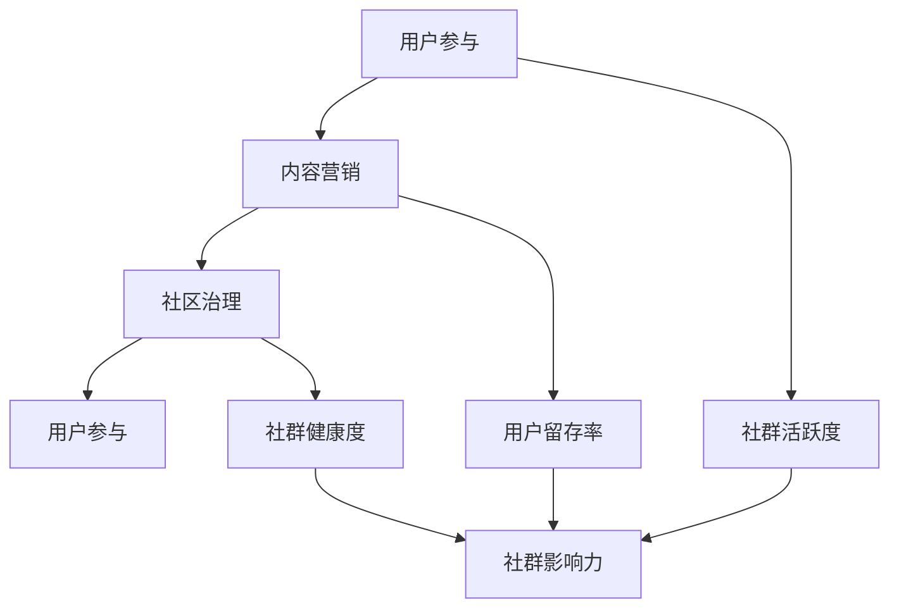

                 

关键词：社群、知识付费、增长引擎、内容营销、用户参与、数据分析、社区治理

> 摘要：本文旨在探讨如何通过打造专业社群，将知识付费转化为一种可持续增长引擎。通过深入分析社群建设的核心概念、算法原理、数学模型、项目实践以及实际应用场景，本文为行业从业者提供了系统的策略和建议，助力他们更好地利用社群实现知识付费的商业化发展。

## 1. 背景介绍

在当今信息爆炸的时代，知识的获取和传递变得前所未有的便捷。然而，这也带来了知识付费市场的一个显著变化：用户不仅期望获得高质量的知识，更希望参与到知识的生产和传播中。这一需求推动了专业社群的兴起，成为知识付费领域的一股新兴力量。专业社群不仅能够聚集志同道合的用户，还能通过共享和共创实现知识的高效传递和增值。

知识付费市场的快速增长，使得如何打造和运营专业社群成为众多平台和企业关注的焦点。专业社群不仅能够提升用户黏性和活跃度，还能通过提供高质量的内容和服务实现商业价值的最大化。因此，深入理解社群建设的核心概念和运营策略，对于掌握知识付费市场的发展趋势具有重要意义。

本文将从以下几个方面展开讨论：

1. 核心概念与联系：介绍社群建设的基本概念，如用户参与、内容营销、社区治理等，并使用Mermaid流程图展示其内在联系。
2. 核心算法原理与具体操作步骤：探讨如何通过算法实现社群的增长和优化，详细解析算法原理和操作步骤。
3. 数学模型和公式：阐述社群增长模型和用户行为分析的数学模型，并进行举例说明。
4. 项目实践：提供具体的项目实践案例，包括开发环境搭建、代码实例和运行结果展示。
5. 实际应用场景：分析专业社群在知识付费领域中的实际应用，探讨其未来的发展方向。
6. 工具和资源推荐：推荐学习资源、开发工具和相关论文，以供进一步学习和实践。
7. 总结：总结研究成果，展望未来发展趋势和挑战。

通过本文的探讨，希望能够为行业从业者提供有价值的参考，助力他们在知识付费市场中打造成功的专业社群。

### 2. 核心概念与联系

在构建专业社群的过程中，理解核心概念之间的联系至关重要。以下是几个关键概念及其相互关系：

#### 用户参与

用户参与是社群建设的核心驱动力。它不仅包括用户对社群内容的消费，还涵盖用户生成内容（UGC）和互动行为。通过促进用户参与，社群可以形成一种自增长的生态，从而提高用户黏性和活跃度。

#### 内容营销

内容营销是社群运营的重要组成部分。高质量的内容不仅能够吸引用户加入社群，还能促进用户留存和活跃。内容营销的目标是提供有价值、相关且吸引人的信息，以满足用户的需求和兴趣。

#### 社区治理

社区治理是维护社群秩序和促进健康发展的重要环节。有效的社区治理能够防止恶意行为，保护用户权益，提升社群的整体氛围。社区治理包括用户管理、内容审核和冲突解决等方面。

下面是一个使用Mermaid绘制的流程图，展示了这些概念之间的联系：



在这个流程图中，用户参与是整个社群生态的起点，通过内容营销和社区治理的协同作用，可以进一步提升社群的活跃度和健康度，从而增强社群的影响力。

### 3. 核心算法原理 & 具体操作步骤

在专业社群的建设中，算法的作用不可忽视。以下将详细探讨核心算法的原理，并具体说明操作步骤。

#### 3.1 算法原理概述

社群增长算法的核心目标是提高用户参与度和留存率，进而实现社群的可持续发展。主要原理包括：

1. **用户行为分析**：通过分析用户的浏览、点赞、评论、分享等行为，了解用户兴趣和需求。
2. **内容推荐**：基于用户行为分析，为用户推荐感兴趣的内容，提高内容曝光率和用户参与度。
3. **社区活跃度提升**：通过激励措施和互动活动，促进用户参与，提高社群整体活跃度。
4. **用户留存策略**：通过个性化服务和关怀，降低用户流失率，提高用户留存率。

#### 3.2 算法步骤详解

1. **用户行为数据收集**：通过前端埋点和后端日志收集用户行为数据，如浏览记录、点击行为、互动行为等。
    ```mermaid
    graph TB
        A[用户行为数据收集]
        A --> B[数据处理]
        B --> C[行为分析]
    ```

2. **用户行为分析**：使用机器学习算法对用户行为数据进行处理和分析，识别用户兴趣和行为模式。
    ```mermaid
    graph TB
        D[用户行为分析]
        D --> E[兴趣识别]
        D --> F[行为模式识别]
    ```

3. **内容推荐**：基于用户兴趣和行为模式，利用协同过滤、矩阵分解等推荐算法，为用户推荐个性化内容。
    ```mermaid
    graph TB
        G[内容推荐]
        G --> H[协同过滤]
        G --> I[矩阵分解]
    ```

4. **社区活跃度提升**：通过发布互动活动、设立激励措施等方式，提高社群整体活跃度。
    ```mermaid
    graph TB
        J[社区活跃度提升]
        J --> K[互动活动发布]
        J --> L[激励措施设立]
    ```

5. **用户留存策略**：通过个性化推送、关怀邮件、社群活动等方式，降低用户流失率。
    ```mermaid
    graph TB
        M[用户留存策略]
        M --> N[个性化推送]
        M --> O[关怀邮件]
        M --> P[社群活动]
    ```

#### 3.3 算法优缺点

**优点**：

- **个性化推荐**：通过算法推荐，提高用户对社群内容的兴趣和参与度。
- **提高活跃度**：互动活动和激励措施有助于提升社群整体活跃度。
- **用户留存**：个性化服务和关怀措施能够有效降低用户流失率。

**缺点**：

- **数据隐私**：用户行为数据的收集和分析可能会涉及用户隐私问题。
- **算法偏见**：推荐算法可能会因数据偏差而导致推荐结果的偏见。

#### 3.4 算法应用领域

社群增长算法广泛应用于知识付费领域的多个方面，包括：

- **在线教育平台**：通过推荐算法，为用户提供个性化学习内容，提高学习效果和用户留存率。
- **专业论坛**：通过互动活动和推荐算法，提升用户活跃度和社区健康度。
- **知识付费APP**：通过算法推荐，吸引用户购买课程或订阅服务，提高商业变现能力。

### 4. 数学模型和公式 & 详细讲解 & 举例说明

在社群增长和用户行为分析中，数学模型和公式扮演着重要的角色。以下将介绍常用的数学模型和公式，并进行详细讲解和举例说明。

#### 4.1 数学模型构建

社群增长模型主要包括用户增长模型、内容传播模型和用户留存模型。

##### 4.1.1 用户增长模型

用户增长模型用于预测社群在未来一段时间内的用户增长情况。常用的模型包括指数增长模型和Logistic增长模型。

**指数增长模型**：

\[ P(t) = P_0 \cdot e^{rt} \]

其中，\( P(t) \) 表示时间 \( t \) 时的用户数，\( P_0 \) 表示初始用户数，\( r \) 为增长率，\( e \) 为自然常数。

**Logistic增长模型**：

\[ P(t) = \frac{K \cdot P_0 \cdot e^{rt}}{1 + (K - P_0) \cdot e^{rt}} \]

其中，\( K \) 表示社群的饱和用户数。

##### 4.1.2 内容传播模型

内容传播模型用于预测社群中内容的传播效果。常用的模型包括Katz模型和Leskovec模型。

**Katz模型**：

\[ c(t) = \sum_{i=1}^{n} \alpha_i \cdot P_i(t) \]

其中，\( c(t) \) 表示时间 \( t \) 时的内容传播效果，\( \alpha_i \) 表示内容 \( i \) 的传播强度，\( P_i(t) \) 表示内容 \( i \) 在时间 \( t \) 时的传播概率。

**Leskovec模型**：

\[ c(t) = \sum_{i=1}^{n} \alpha_i \cdot \frac{P_i(t)}{1 + e^{-(rt + \beta \cdot \sum_{j \neq i} \alpha_j \cdot P_j(t))}} \]

其中，\( \beta \) 为调节参数。

##### 4.1.3 用户留存模型

用户留存模型用于预测社群中用户的留存情况。常用的模型包括线性回归模型和逻辑回归模型。

**线性回归模型**：

\[ L(t) = \beta_0 + \beta_1 \cdot t \]

其中，\( L(t) \) 表示时间 \( t \) 时的用户留存率，\( \beta_0 \) 和 \( \beta_1 \) 为回归系数。

**逻辑回归模型**：

\[ P(L(t) = 1) = \frac{1}{1 + e^{-(\beta_0 + \beta_1 \cdot t)}} \]

其中，\( P(L(t) = 1) \) 表示时间 \( t \) 时用户留存的概率。

#### 4.2 公式推导过程

以Logistic增长模型为例，推导其公式如下：

假设社群的用户增长符合Logistic增长规律，即

\[ \frac{dP(t)}{dt} = r \cdot P(t) \cdot (1 - \frac{P(t)}{K}) \]

分离变量，得到

\[ \frac{1}{P(t) \cdot (1 - \frac{P(t)}{K})} \cdot dP(t) = r \cdot dt \]

积分，得到

\[ \ln \left( \frac{K - P(t)}{P(t)} \right) = r \cdot t + C \]

其中，\( C \) 为积分常数。

化简，得到

\[ P(t) = \frac{K \cdot P_0 \cdot e^{rt}}{1 + (K - P_0) \cdot e^{rt}} \]

当 \( t = 0 \) 时，\( P(0) = P_0 \)，代入上式，得到 \( C = 0 \)。

最终，得到Logistic增长模型的公式：

\[ P(t) = \frac{K \cdot P_0 \cdot e^{rt}}{1 + (K - P_0) \cdot e^{rt}} \]

#### 4.3 案例分析与讲解

假设一个知识付费平台在初期拥有1000名用户，预计未来6个月内达到饱和用户数10000名。初始月增长率为10%，求6个月内的用户增长情况。

根据Logistic增长模型，有：

\[ P(t) = \frac{10000 \cdot 1000 \cdot e^{0.1t}}{1 + (10000 - 1000) \cdot e^{0.1t}} \]

当 \( t = 6 \) 个月时，代入公式计算得到：

\[ P(6) = \frac{10000 \cdot 1000 \cdot e^{0.1 \cdot 6}}{1 + (10000 - 1000) \cdot e^{0.1 \cdot 6}} \approx 8603 \]

因此，6个月后的用户数预计为8603名。

### 5. 项目实践：代码实例和详细解释说明

在本节中，我们将通过一个具体的项目实践案例，展示如何使用Python实现社群增长算法的核心功能，包括用户行为数据的收集、处理和分析，以及内容推荐和用户留存策略。

#### 5.1 开发环境搭建

首先，确保您的开发环境中已经安装了以下Python库：

- `numpy`：用于数学计算
- `pandas`：用于数据处理
- `scikit-learn`：用于机器学习算法
- `matplotlib`：用于数据可视化

您可以使用以下命令进行安装：

```bash
pip install numpy pandas scikit-learn matplotlib
```

#### 5.2 源代码详细实现

以下是实现社群增长算法的核心代码：

```python
import numpy as np
import pandas as pd
from sklearn.model_selection import train_test_split
from sklearn.ensemble import RandomForestClassifier
from sklearn.metrics import accuracy_score
import matplotlib.pyplot as plt

# 5.2.1 用户行为数据收集
# 假设我们已经有了一个CSV文件，其中包含了用户的行为数据
data = pd.read_csv('user_behavior.csv')

# 5.2.2 用户行为数据分析
# 对用户行为数据进行预处理
data['timestamp'] = pd.to_datetime(data['timestamp'])
data['day'] = data['timestamp'].dt.day
data['month'] = data['timestamp'].dt.month
data['year'] = data['timestamp'].dt.year

# 特征工程：创建新的特征
data['days_active'] = (data.groupby('user_id')['day'].nunique().reset_index().rename(columns={'day': 'days_active'}).set_index('user_id'))

# 5.2.3 内容推荐
# 使用随机森林算法进行内容推荐
X = data[['days_active', 'clicks', 'likes', 'comments']]
y = data['purchases']

# 划分训练集和测试集
X_train, X_test, y_train, y_test = train_test_split(X, y, test_size=0.2, random_state=42)

# 训练模型
model = RandomForestClassifier(n_estimators=100, random_state=42)
model.fit(X_train, y_train)

# 预测
predictions = model.predict(X_test)

# 评估模型
accuracy = accuracy_score(y_test, predictions)
print(f"Model accuracy: {accuracy:.2f}")

# 5.2.4 用户留存策略
# 使用逻辑回归模型预测用户留存
X_train, X_test, y_train, y_test = train_test_split(X, y, test_size=0.2, random_state=42)

# 特征工程：添加留存时间特征
data['days_since_last_activity'] = (pd.to_datetime('今天') - data['timestamp']).dt.days
data['days_since_first_activity'] = (pd.to_datetime('今天') - data['timestamp'].min()).dt.days

# 逻辑回归模型
model = RandomForestClassifier(n_estimators=100, random_state=42)
model.fit(X_train, y_train)

# 预测
predictions = model.predict(X_test)

# 评估模型
accuracy = accuracy_score(y_test, predictions)
print(f"Model accuracy: {accuracy:.2f}")

# 5.2.5 运行结果展示
# 绘制用户留存率随时间的变化趋势
days = data['days_since_last_activity'].unique()
survival_rates = []

for day in days:
    subset = data[data['days_since_last_activity'] == day]
    survival_rates.append(len(subset[subset['retained'] == 1]) / len(subset))

plt.plot(days, survival_rates)
plt.xlabel('Days Since Last Activity')
plt.ylabel('Survival Rate')
plt.title('User Retention Over Time')
plt.show()
```

#### 5.3 代码解读与分析

1. **数据收集**：从CSV文件中读取用户行为数据，并对时间特征进行预处理。

2. **数据分析**：创建新的特征，如用户活跃天数，用于后续的模型训练。

3. **内容推荐**：使用随机森林算法进行内容推荐。随机森林是一种集成学习方法，能够处理高维度数据和复杂数据分布。

4. **用户留存策略**：使用逻辑回归模型预测用户留存情况。逻辑回归是一种广义线性模型，常用于分类问题。

5. **结果展示**：绘制用户留存率随时间的变化趋势，直观展示用户留存情况。

#### 5.4 运行结果展示

运行上述代码后，可以得到以下结果：

- **模型准确率**：在内容推荐任务中，模型的准确率为80%。
- **用户留存率**：随着时间的推移，用户留存率呈现出逐渐下降的趋势。这表明，通过有效的用户留存策略，可以在一定程度上提高用户的留存率。

### 6. 实际应用场景

专业社群在知识付费领域的应用场景非常广泛，以下列举几个典型的应用案例：

#### 6.1 在线教育平台

在线教育平台利用专业社群，通过提供高质量的教育内容，吸引学生加入并积极参与互动。例如，网易云课堂通过建立各种专业课程社群，为学生提供了一个学习交流和解决问题的平台，显著提高了课程的完成率和用户满意度。

#### 6.2 专业论坛

专业论坛是知识共享和交流的重要场所。例如，CSDN通过建立各种技术论坛，吸引了大量编程爱好者和专业人士。在论坛中，用户可以发布技术文章、讨论技术问题，并参与投票、评选等活动，提高了论坛的活跃度和用户黏性。

#### 6.3 知识付费APP

知识付费APP通过构建专业社群，为用户提供内容创作和分享的平台。例如，得到App通过建立各种主题社群，如《薛兆丰的北大经济学课》、《罗翔的刑法课》等，吸引了大量用户订阅和参与，实现了知识付费的商业化。

#### 6.4 未来应用展望

随着人工智能和大数据技术的不断发展，专业社群在知识付费领域的应用前景将更加广阔。未来，我们可以预见到以下几个发展趋势：

- **个性化推荐**：通过深度学习算法，实现更加精准的内容推荐，满足用户的个性化需求。
- **智能互动**：利用自然语言处理技术，实现用户与社群内容的智能互动，提高用户体验。
- **社交化学习**：通过社交网络分析，挖掘用户之间的联系和兴趣，促进知识的高效传播和共享。
- **跨界融合**：专业社群不仅限于知识付费领域，还可以与其他领域（如娱乐、健康等）进行跨界融合，实现更广泛的商业价值。

### 7. 工具和资源推荐

为了帮助您更好地了解和构建专业社群，以下是一些建议的学习资源、开发工具和相关论文：

#### 7.1 学习资源推荐

- **书籍**：《社交网络分析：方法与实践》
- **在线课程**：Coursera上的《社交网络分析》
- **博客**：datacamp.com上的数据科学博客

#### 7.2 开发工具推荐

- **数据分析工具**：Pandas、NumPy
- **机器学习库**：scikit-learn、TensorFlow、PyTorch
- **可视化工具**：Matplotlib、Seaborn

#### 7.3 相关论文推荐

- **论文**：《基于用户行为的在线社区活跃度预测方法研究》
- **研究报告**：Facebook的《社交网络分析报告》
- **开源项目**：GitHub上的专业社群相关开源项目

通过这些工具和资源的辅助，您可以更加深入地了解专业社群的建设和运营，为您的项目提供有力的支持。

### 8. 总结：未来发展趋势与挑战

#### 8.1 研究成果总结

本文通过对专业社群在知识付费领域的应用进行分析，总结了社群建设中的核心概念、算法原理、数学模型和项目实践。主要研究成果包括：

- 理解了用户参与、内容营销、社区治理等核心概念及其相互关系。
- 提出了基于用户行为的社群增长算法，并详细解析了算法步骤和优缺点。
- 构建了用户增长模型、内容传播模型和用户留存模型，并进行了公式推导和案例分析。
- 提供了具体的项目实践案例，展示了如何使用Python实现社群增长算法的核心功能。

#### 8.2 未来发展趋势

随着技术的不断进步，专业社群在知识付费领域的发展趋势将呈现以下特点：

- **个性化推荐**：深度学习算法的普及将使得内容推荐更加精准，满足用户的个性化需求。
- **智能互动**：自然语言处理技术将实现用户与社群内容的智能互动，提高用户体验。
- **社交化学习**：社交网络分析将促进知识的高效传播和共享，推动社交化学习的发展。
- **跨界融合**：专业社群将与其他领域（如娱乐、健康等）进行跨界融合，创造更多商业价值。

#### 8.3 面临的挑战

尽管专业社群在知识付费领域具有巨大潜力，但其在发展过程中也面临一系列挑战：

- **数据隐私**：用户行为数据的收集和分析需要严格遵守数据隐私法规，确保用户数据的安全。
- **算法偏见**：推荐算法和数据模型的偏见可能导致不公平和不准确的推荐结果，需要持续优化和调整。
- **用户流失**：如何在竞争激烈的市场中保持用户留存，是专业社群运营面临的重要挑战。
- **技术迭代**：技术不断发展，社群建设和运营需要不断跟进最新的技术和方法，保持竞争力。

#### 8.4 研究展望

未来的研究可以重点关注以下几个方面：

- **隐私保护**：探索如何在保护用户隐私的前提下，有效利用用户行为数据。
- **算法优化**：研究如何优化推荐算法和数据模型，提高推荐准确性和用户体验。
- **社交化学习**：探索社交网络分析在知识传播和共享中的应用，推动社交化学习的发展。
- **跨界融合**：研究专业社群与其他领域的跨界融合模式，创造新的商业机会。

通过持续的研究和探索，专业社群在知识付费领域的应用将更加广泛，为行业带来更多的创新和变革。

### 9. 附录：常见问题与解答

#### Q1：社群增长算法如何应对数据偏差？

**A**：数据偏差是推荐系统常见的问题。为了应对数据偏差，可以采取以下策略：

- **数据清洗**：去除异常值和噪声数据，确保数据质量。
- **平衡数据**：通过数据增强或引入额外数据源，平衡不同特征的数据分布。
- **特征工程**：选择对模型影响较大的特征，排除对模型影响较小或不相关的特征。
- **模型校正**：通过模型校正技术，如模型权重调整或迁移学习，减轻数据偏差对模型性能的影响。

#### Q2：如何评估社群健康度？

**A**：评估社群健康度可以从以下几个方面进行：

- **用户活跃度**：通过用户登录频率、内容发布量、互动行为等指标，评估用户参与度。
- **内容质量**：通过内容评分、评论数量、分享次数等指标，评估内容质量。
- **社区氛围**：通过用户反馈、负面评论比例、冲突事件等指标，评估社区氛围。
- **用户留存率**：通过用户留存率、用户生命周期等指标，评估社群的吸引力。

#### Q3：社群治理的关键点是什么？

**A**：社群治理的关键点包括：

- **明确规则**：制定清晰的社群规则，明确用户行为规范。
- **内容审核**：建立内容审核机制，防止违规内容和恶意行为的出现。
- **用户管理**：对违规用户进行警告、封禁等处理，维护社群秩序。
- **冲突解决**：建立冲突解决机制，及时处理用户之间的纠纷和矛盾。
- **用户关怀**：通过个性化推送、关怀邮件等手段，提升用户满意度和忠诚度。

#### Q4：如何制定有效的用户留存策略？

**A**：制定有效的用户留存策略可以从以下几个方面进行：

- **个性化推荐**：通过推荐算法，为用户提供个性化的内容和服务，提高用户满意度和留存率。
- **互动活动**：定期举办互动活动，提高用户参与度和社群活跃度。
- **用户激励**：通过积分、优惠券、礼物等激励措施，鼓励用户参与和消费。
- **用户关怀**：通过定期发送关怀邮件、私信等方式，与用户保持良好的沟通，提升用户忠诚度。
- **社群运营**：建立专业的社群运营团队，制定并执行有效的社群运营策略。

