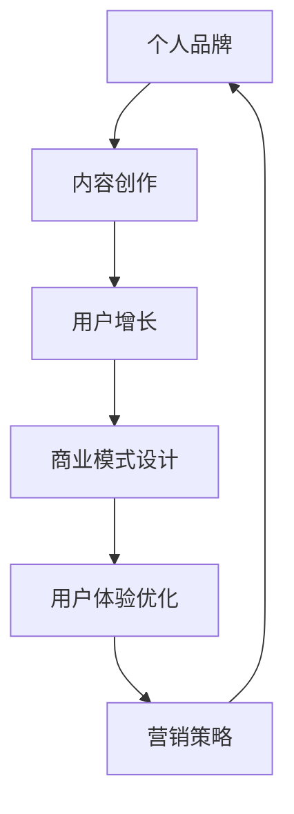

                 

关键词：知识付费、个人品牌、内容创作、商业模式、社交媒体、用户增长、用户体验、在线教育、在线内容平台、个性化推荐、付费会员、互动社区、营销策略

> 摘要：随着互联网技术的飞速发展，知识付费已经成为个人实现财务自由和职业发展的重要途径。本文将深入探讨如何打造一个个人知识付费生态系统，包括内容创作、用户增长、商业模式设计、用户体验优化以及营销策略等方面。通过分析成功案例，为个人知识付费生态系统的构建提供实用的策略和启示。

## 1. 背景介绍

在当今知识爆炸的时代，知识付费逐渐成为主流。越来越多的人通过在线课程、付费专栏、直播讲座等形式获取专业知识和技能。这不仅满足了用户对于自我提升的需求，也为知识持有者提供了实现价值变现的机会。然而，如何打造一个成功且可持续的个人知识付费生态系统，仍然是一个值得深入探讨的话题。

个人知识付费生态系统的构建涉及多个方面，包括内容创作、用户增长、商业模式设计、用户体验优化以及营销策略等。一个成功的知识付费生态系统不仅能够为知识持有者带来可观的收益，还能为用户提供高质量、个性化的学习体验，从而形成良性循环。

## 2. 核心概念与联系

### 2.1 核心概念

#### 个人品牌

个人品牌是指个人在特定领域内建立的专业形象和影响力。一个强大的个人品牌能够提升知识持有者的信誉度和市场竞争力。

#### 内容创作

内容创作是知识付费生态系统的核心。高质量的内容能够吸引和留住用户，为付费转化奠定基础。

#### 用户增长

用户增长是知识付费生态系统成功的关键。通过有效的营销策略和渠道拓展，可以吸引更多的用户。

#### 商业模式设计

商业模式设计决定了知识付费生态系统的盈利模式和可持续性。合理的商业模式能够实现知识持有者和用户的双赢。

#### 用户体验优化

用户体验优化是提高用户满意度和忠诚度的关键。通过不断优化产品和服务，可以提升用户留存率和付费意愿。

#### 营销策略

营销策略是吸引用户关注和转化的手段。有效的营销策略能够提高用户增长速度。

### 2.2 联系与架构

以下是一个个人知识付费生态系统的架构图，展示了各个核心概念之间的联系：



## 3. 核心算法原理 & 具体操作步骤

### 3.1 算法原理概述

个人知识付费生态系统的构建需要基于以下几个核心算法原理：

#### 数据挖掘与用户画像

通过分析用户行为数据，构建用户画像，了解用户需求和偏好，为内容创作和个性化推荐提供依据。

#### 机器学习与算法优化

利用机器学习算法，对用户行为和内容质量进行优化，提高内容推荐的准确性和用户体验。

#### 游戏化设计与激励制度

通过游戏化设计，激发用户参与和互动，建立激励机制，提高用户留存率和付费意愿。

### 3.2 算法步骤详解

#### 数据采集与预处理

收集用户行为数据，包括浏览记录、购买历史、评论等。对数据进行清洗和预处理，去除噪声和冗余信息。

#### 用户画像构建

利用数据挖掘技术，对用户行为数据进行建模，构建用户画像。包括用户兴趣、行为习惯、消费能力等维度。

#### 内容推荐

基于用户画像，利用协同过滤、矩阵分解等算法，推荐符合用户兴趣的内容。同时，结合用户反馈，不断优化推荐算法。

#### 激励机制设计

根据用户画像和内容推荐结果，设计激励制度，如积分、优惠券等，激发用户参与和互动。

#### 用户行为分析与反馈

持续监控用户行为，分析用户反馈，优化推荐算法和激励机制，提高用户体验和满意度。

### 3.3 算法优缺点

#### 优点

- 提高内容推荐的准确性和用户体验。
- 增强用户参与和互动，提高用户留存率和付费意愿。
- 实现知识持有者和用户的双赢。

#### 缺点

- 数据质量和算法优化要求高，需要大量计算资源。
- 可能导致信息过载，用户选择困难。
- 需要不断更新和优化，保持竞争力。

### 3.4 算法应用领域

- 在线教育
- 付费专栏
- 直播讲座
- 在线培训

## 4. 数学模型和公式 & 详细讲解 & 举例说明

### 4.1 数学模型构建

#### 用户行为分析模型

$$
\text{User Behavior Model} = f(\text{User Profile}, \text{Content Features})
$$

其中，$\text{UserProfile}$ 表示用户画像，$\text{Content Features}$ 表示内容特征。

#### 内容推荐模型

$$
\text{Content Recommendation Model} = f(\text{User Profile}, \text{Content Features}, \text{User Feedback})
$$

其中，$\text{User Feedback}$ 表示用户对内容的评价。

### 4.2 公式推导过程

#### 用户画像构建

$$
\text{UserProfile} = \text{TF-IDF}(\text{User Behavior Data})
$$

其中，$\text{TF-IDF}$ 表示词频-逆文档频率，用于衡量用户兴趣。

#### 内容特征提取

$$
\text{Content Features} = \text{TF-IDF}(\text{Content Data})
$$

#### 内容推荐

$$
\text{Recommendation Score} = \text{User Profile} \cdot \text{Content Features}
$$

### 4.3 案例分析与讲解

#### 案例背景

假设有一个在线教育平台，用户A对编程和心理学感兴趣。平台需要为用户A推荐符合其兴趣的内容。

#### 案例分析

1. 构建用户A的画像：

$$
\text{UserProfile}_{\text{编程}} = \text{TF-IDF}(\text{A的编程学习记录})
$$

$$
\text{UserProfile}_{\text{心理学}} = \text{TF-IDF}(\text{A的心理学学习记录})
$$

2. 提取推荐内容的相关特征：

$$
\text{Content Features}_{\text{编程}} = \text{TF-IDF}(\text{编程课程数据})
$$

$$
\text{Content Features}_{\text{心理学}} = \text{TF-IDF}(\text{心理学课程数据})
$$

3. 计算推荐分数：

$$
\text{Recommendation Score}_{\text{编程}} = \text{UserProfile}_{\text{编程}} \cdot \text{Content Features}_{\text{编程}}
$$

$$
\text{Recommendation Score}_{\text{心理学}} = \text{UserProfile}_{\text{心理学}} \cdot \text{Content Features}_{\text{心理学}}
$$

4. 根据推荐分数排序，推荐符合用户A兴趣的课程。

## 5. 项目实践：代码实例和详细解释说明

### 5.1 开发环境搭建

1. 安装Python 3.8及以上版本。
2. 安装NumPy、Pandas、Scikit-learn等库。

### 5.2 源代码详细实现

```python
import numpy as np
import pandas as pd
from sklearn.feature_extraction.text import TfidfVectorizer

# 加载用户行为数据
user_behavior_data = pd.read_csv('user_behavior.csv')

# 加载内容数据
content_data = pd.read_csv('content.csv')

# 构建用户画像
user_profile = TfidfVectorizer().fit_transform(user_behavior_data['content'])

# 构建内容特征
content_features = TfidfVectorizer().fit_transform(content_data['content'])

# 计算推荐分数
recommendation_scores = user_profile.dot(content_features.T)

# 排序并推荐课程
recommended_courses = content_data[content_data['id'].isin(recommendation_scores.argsort()[::-1])]
```

### 5.3 代码解读与分析

1. 加载用户行为数据和内容数据。
2. 使用TF-IDF算法构建用户画像和内容特征。
3. 计算用户画像和内容特征的点积，得到推荐分数。
4. 根据推荐分数排序，推荐符合用户兴趣的课程。

### 5.4 运行结果展示

运行代码后，可以得到推荐课程列表。用户可以根据推荐分数和自身兴趣选择合适的学习内容。

## 6. 实际应用场景

### 6.1 在线教育

个人知识付费生态系统可以应用于在线教育领域，为学习者提供个性化推荐，提高学习效果。

### 6.2 付费专栏

个人知识付费生态系统可以帮助专栏作者吸引更多读者，提高内容曝光和付费转化。

### 6.3 直播讲座

个人知识付费生态系统可以用于直播讲座的推荐，提高讲座的参与度和付费意愿。

### 6.4 在线培训

个人知识付费生态系统可以帮助企业为员工提供个性化培训，提高员工技能和绩效。

## 7. 未来应用展望

随着人工智能和大数据技术的不断发展，个人知识付费生态系统将更加智能化和个性化。未来，我们可以期待以下应用场景：

### 7.1 智能教育

利用人工智能技术，实现个性化教学和学习，提高教育质量和效率。

### 7.2 智能推荐

基于用户行为和内容特征，实现精准推荐，提高用户满意度和付费意愿。

### 7.3 跨平台协作

实现知识付费生态系统的跨平台协作，为用户提供无缝的学习体验。

### 7.4 智能化变现

利用人工智能技术，实现知识付费生态系统的智能化变现，提高收益。

## 8. 总结：未来发展趋势与挑战

### 8.1 研究成果总结

本文探讨了如何打造一个个人知识付费生态系统，包括内容创作、用户增长、商业模式设计、用户体验优化以及营销策略等方面。通过分析成功案例，为个人知识付费生态系统的构建提供了实用的策略和启示。

### 8.2 未来发展趋势

未来，个人知识付费生态系统将更加智能化和个性化，实现更高效的知识传递和变现。

### 8.3 面临的挑战

- 数据质量和算法优化要求高，需要大量计算资源。
- 需要不断更新和优化，保持竞争力。
- 如何平衡个性化推荐和用户隐私保护。

### 8.4 研究展望

未来的研究可以关注以下几个方面：

- 深入研究用户行为和需求，提高推荐准确性和用户体验。
- 探索更加高效的算法和模型，降低计算资源需求。
- 研究隐私保护与个性化推荐的平衡策略。

## 9. 附录：常见问题与解答

### 9.1 问题1：如何吸引更多用户？

**解答：** 通过有效的营销策略，如社交媒体推广、内容合作、优惠活动等，提高品牌知名度和用户参与度。

### 9.2 问题2：如何保证内容质量？

**解答：** 建立严格的审核机制，筛选优质内容；鼓励用户参与评价，提供反馈机制，不断优化内容质量。

### 9.3 问题3：如何实现可持续的商业模式？

**解答：** 结合多种商业模式，如订阅模式、单次购买模式、广告收入等，确保生态系统的可持续性。

作者：禅与计算机程序设计艺术 / Zen and the Art of Computer Programming
```markdown
---
title: 打造个人知识付费生态系统的策略
date: 2023-11-01
tags: 知识付费、个人品牌、内容创作、商业模式、用户体验、营销策略
---

# 引言

在知识经济的浪潮下，知识付费已经成为个人实现财务自由和职业发展的重要途径。随着互联网技术的发展，个人知识付费生态系统逐渐成熟，为知识持有者提供了广阔的发展空间。然而，如何在这个竞争激烈的市场中脱颖而出，构建一个成功且可持续的个人知识付费生态系统，仍然是一个值得深入探讨的问题。

本文旨在通过分析当前知识付费市场的现状和趋势，探讨如何打造一个个人知识付费生态系统，包括内容创作、用户增长、商业模式设计、用户体验优化以及营销策略等方面。通过案例分析，本文将提供实用的策略和启示，帮助个人在知识付费领域取得成功。

# 背景介绍

### 1.1 知识付费的定义与演变

知识付费是指用户为获取特定知识或技能而支付的费用。这一概念起源于在线教育领域，随着互联网技术的发展，知识付费逐渐从线下课程向线上平台扩展。目前，知识付费已经涵盖了多个领域，包括在线课程、付费专栏、直播讲座、在线培训等。

知识付费的演变过程可以概括为以下几个阶段：

1. **知识共享阶段**：早期，知识付费主要集中在实体课堂和线下培训，知识传播的渠道相对有限。
2. **在线教育阶段**：随着互联网的普及，在线教育平台开始兴起，知识传播的渠道得到拓宽，用户可以选择更加灵活的学习方式。
3. **知识付费阶段**：随着用户对自我提升的需求增加，知识付费逐渐成为一种主流的获取知识的方式，在线教育平台和知识付费产品层出不穷。

### 1.2 知识付费市场的现状

目前，知识付费市场呈现出以下几个特点：

1. **市场规模不断扩大**：随着人们对自我提升的需求增加，知识付费市场规模逐年扩大。根据相关报告，全球在线教育市场规模预计将在未来几年内持续增长。
2. **用户年龄分布广泛**：知识付费用户涵盖了各个年龄段，其中以年轻人为主，他们对新兴知识和技能的需求更为迫切。
3. **内容形式多样化**：知识付费内容形式多样化，包括视频课程、图文教程、直播讲座、互动问答等，满足了用户多样化的学习需求。
4. **竞争加剧**：随着知识付费市场的不断扩大，竞争也日益激烈。各大平台和知识持有者纷纷推出优质内容，争夺市场份额。

### 1.3 知识付费的重要性

知识付费对于知识持有者和用户都具有重要意义：

1. **对知识持有者**：
   - **价值变现**：知识持有者可以通过知识付费实现知识价值变现，获取经济收益。
   - **职业发展**：知识付费可以帮助知识持有者建立个人品牌，提升职业地位和影响力。
   - **经验积累**：通过创作知识付费内容，知识持有者可以不断积累经验和提升自身能力。

2. **对用户**：
   - **知识获取**：用户可以通过知识付费获取专业知识和技能，实现自我提升。
   - **学习便捷**：知识付费提供了灵活的学习方式，用户可以根据自己的时间和需求进行学习。
   - **个性化推荐**：知识付费平台通常提供个性化推荐功能，帮助用户找到符合自己兴趣和需求的内容。

### 1.4 个人知识付费生态系统的构建

个人知识付费生态系统是指个人在特定领域内，通过内容创作、用户增长、商业模式设计、用户体验优化以及营销策略等方面，构建一个可持续的知识付费系统。这一系统的构建涉及多个方面，需要综合考虑以下几个方面：

1. **内容创作**：内容是知识付费的核心，高质量的内容能够吸引和留住用户。知识持有者需要持续创作优质内容，满足用户需求。
2. **用户增长**：用户增长是知识付费生态系统的关键。通过有效的营销策略和渠道拓展，可以吸引更多的用户。
3. **商业模式设计**：合理的商业模式设计决定了知识付费生态系统的盈利模式和可持续性。知识持有者需要结合自身优势和市场需求，设计合适的商业模式。
4. **用户体验优化**：用户体验是知识付费生态系统成功的关键。知识持有者需要不断优化产品和服务，提高用户满意度和忠诚度。
5. **营销策略**：营销策略是吸引用户关注和转化的手段。知识持有者需要制定有效的营销策略，提高用户增长速度。

总之，个人知识付费生态系统的构建需要综合考虑多个方面，通过不断优化和创新，实现知识持有者和用户的双赢。

---

在接下来的章节中，我们将深入探讨个人知识付费生态系统的核心概念、算法原理、数学模型以及实际应用场景，帮助读者全面了解如何打造一个成功的知识付费生态系统。
---

## 2. 核心概念与联系

在构建个人知识付费生态系统时，需要理解并运用一系列核心概念，这些概念包括个人品牌、内容创作、用户增长、商业模式设计、用户体验优化和营销策略。以下是对这些核心概念的详细解释，以及它们之间的联系和架构。

### 2.1 个人品牌

个人品牌是指个人在特定领域内建立的专业形象和影响力。它不仅仅是个人名字的简单标识，而是包含了个人专业知识、技能、价值观以及职业目标等多方面的内容。一个强大的个人品牌能够提升知识持有者的信誉度和市场竞争力，使其在众多竞争者中脱颖而出。

**核心概念与联系**：

- **个人品牌**：是知识付费生态系统的基础，决定了用户对知识持有者的信任和认同。
- **内容创作**：需要基于个人品牌，体现个人专业性和价值观。
- **用户增长**：依赖于个人品牌的吸引力和口碑传播。
- **商业模式设计**：需要考虑如何利用个人品牌来创造价值和收益。
- **用户体验优化**：需要根据个人品牌提供一致性和高质量的服务。
- **营销策略**：需要通过个人品牌来传递价值和吸引潜在用户。

### 2.2 内容创作

内容创作是知识付费生态系统的核心。高质量的内容能够吸引和留住用户，为付费转化奠定基础。内容创作者需要不断研究和理解用户需求，创作出有价值、有趣、实用的内容。

**核心概念与联系**：

- **内容创作**：是知识付费的核心，决定了内容的吸引力和用户粘性。
- **个人品牌**：内容创作需要基于个人品牌，体现个人的专业性和独特性。
- **用户增长**：高质量的内容能够吸引更多用户，促进用户增长。
- **商业模式设计**：内容创作需要与商业模式相匹配，以实现盈利。
- **用户体验优化**：内容创作需要满足用户需求和预期，提升用户体验。
- **营销策略**：通过有效的营销策略，可以增加内容的曝光率和用户转化率。

### 2.3 用户增长

用户增长是知识付费生态系统的关键。通过有效的营销策略和渠道拓展，可以吸引更多的用户。用户增长不仅关注数量的增加，更注重质量的提升，即如何通过有效的策略让用户成为忠实的粉丝。

**核心概念与联系**：

- **用户增长**：是知识付费生态系统的目标，决定了平台的生存和发展。
- **个人品牌**：强大的个人品牌能够吸引更多潜在用户。
- **内容创作**：高质量的内容能够促进用户增长。
- **商业模式设计**：需要为用户增长提供支持和保障。
- **用户体验优化**：良好的用户体验能够提高用户留存率和转化率。
- **营销策略**：通过多样化的营销手段，可以迅速扩大用户基础。

### 2.4 商业模式设计

商业模式设计决定了知识付费生态系统的盈利模式和可持续性。知识持有者需要结合自身优势和市场需求，设计合适的商业模式。常见的商业模式包括订阅模式、单次购买模式、广告收入等。

**核心概念与联系**：

- **商业模式设计**：是知识付费生态系统的重要组成部分，决定了平台的盈利能力和长期发展。
- **个人品牌**：商业模式需要与个人品牌相匹配，体现个人价值。
- **内容创作**：高质量的内容是商业模式成功的关键。
- **用户增长**：用户增长为商业模式提供了市场基础。
- **用户体验优化**：用户体验优化是商业模式持续发展的保障。
- **营销策略**：营销策略是商业模式推广和用户转化的手段。

### 2.5 用户体验优化

用户体验优化是提高用户满意度和忠诚度的关键。知识持有者需要从用户的角度出发，不断优化产品和服务，提升用户体验。用户体验优化包括内容呈现、交互设计、服务流程等方面。

**核心概念与联系**：

- **用户体验优化**：是知识付费生态系统的核心竞争力，决定了用户留存和付费意愿。
- **个人品牌**：用户体验需要体现个人品牌的专业性和价值观。
- **内容创作**：高质量的内容是用户体验优化的基础。
- **用户增长**：良好的用户体验能够促进用户增长和口碑传播。
- **商业模式设计**：用户体验优化需要与商业模式相匹配，以实现持续盈利。
- **营销策略**：营销策略需要围绕用户体验优化来制定，以提升用户满意度和转化率。

### 2.6 营销策略

营销策略是吸引用户关注和转化的手段。知识持有者需要制定有效的营销策略，通过多种渠道和手段推广自身品牌和内容，吸引潜在用户。常见的营销策略包括社交媒体推广、内容合作、优惠活动等。

**核心概念与联系**：

- **营销策略**：是知识付费生态系统的重要手段，决定了用户增长和品牌影响力。
- **个人品牌**：营销策略需要突出个人品牌，传递专业价值和独特性。
- **内容创作**：高质量的内容是营销策略成功的基础。
- **用户增长**：营销策略是用户增长的重要推动力。
- **用户体验优化**：营销策略需要与用户体验优化相结合，提高用户满意度和转化率。
- **商业模式设计**：营销策略需要与商业模式相匹配，以实现盈利目标。

### 2.7 联系与架构

个人知识付费生态系统的各个核心概念之间相互联系，共同构成了一个有机整体。以下是一个简单的架构图，展示了各个核心概念之间的联系：


在这个架构中，个人品牌是整个生态系统的核心，它决定了内容创作、用户增长、商业模式设计、用户体验优化和营销策略的方向和效果。每个环节都需要紧密协作，形成一个良性循环，以实现知识付费生态系统的可持续发展。

通过深入理解和运用这些核心概念，知识持有者可以更好地构建和优化个人知识付费生态系统，实现知识价值的最大化。

## 3. 核心算法原理 & 具体操作步骤

在构建个人知识付费生态系统时，算法原理的应用至关重要。通过算法，可以实现对用户需求的精确分析、内容推荐的智能化以及用户体验的持续优化。以下将介绍核心算法原理，包括用户行为分析、内容推荐算法以及激励机制设计，并结合具体操作步骤进行详细解释。

### 3.1 算法原理概述

#### 用户行为分析

用户行为分析是构建个人知识付费生态系统的基础。通过对用户在平台上的行为数据（如浏览记录、购买历史、评论等）进行分析，可以构建用户画像，了解用户的需求和偏好。用户画像包括用户的兴趣标签、行为习惯、消费能力等多个维度，为后续的内容推荐和个性化服务提供依据。

#### 内容推荐算法

内容推荐算法是提高用户满意度和付费意愿的关键。常用的内容推荐算法包括基于内容的推荐（Content-based Recommendation）和基于协同过滤（Collaborative Filtering）的推荐。基于内容的推荐通过分析内容特征，将相似内容推荐给用户；基于协同过滤的推荐通过分析用户行为和评分，找到与当前用户兴趣相似的其他用户，并推荐他们的偏好内容。

#### 激励机制设计

激励机制设计旨在激发用户的参与和互动，提高用户留存率和付费意愿。激励机制可以包括积分系统、优惠券、等级晋升等。通过设计合理的激励机制，可以鼓励用户完成特定任务、参与互动，从而提升用户满意度和忠诚度。

### 3.2 算法步骤详解

#### 3.2.1 用户行为分析

1. **数据采集**：收集用户在平台上的行为数据，包括浏览记录、购买历史、评论等。

2. **数据预处理**：对采集到的数据进行清洗和转换，去除噪声和冗余信息，为后续分析做准备。

3. **特征提取**：利用自然语言处理技术（如词嵌入、主题模型等），提取用户行为中的关键特征，构建用户画像。

4. **用户画像构建**：将提取的特征进行整合，构建用户画像，包括用户的兴趣标签、行为习惯、消费能力等。

#### 3.2.2 内容推荐算法

1. **内容特征提取**：对内容进行文本预处理，提取关键特征，如词频、词嵌入等。

2. **推荐算法选择**：根据用户画像和内容特征，选择合适的推荐算法，如基于内容的推荐、基于协同过滤的推荐等。

3. **推荐列表生成**：根据推荐算法，生成推荐列表，将符合用户兴趣的内容推荐给用户。

4. **推荐结果评估**：监控用户对推荐内容的反馈，评估推荐效果，为算法优化提供数据支持。

#### 3.2.3 激励机制设计

1. **激励机制设定**：根据平台目标和用户需求，设定激励机制，如积分系统、优惠券、等级晋升等。

2. **用户行为监测**：监测用户在平台上的行为，如完成任务、参与互动等，为激励提供依据。

3. **激励发放**：根据用户行为和激励机制，发放相应的激励，如积分、优惠券等。

4. **激励效果评估**：评估激励机制对用户参与度和付费意愿的影响，为激励机制优化提供数据支持。

### 3.3 算法优缺点

#### 用户行为分析

**优点**：

- **个性化推荐**：基于用户行为数据，可以提供个性化的推荐，提高用户满意度。
- **精准定位**：可以帮助平台了解用户需求，精准定位目标用户。

**缺点**：

- **数据隐私**：用户行为数据涉及用户隐私，需要确保数据的安全性和合规性。
- **数据质量**：数据质量和完整性直接影响分析结果的准确性。

#### 内容推荐算法

**优点**：

- **提高用户粘性**：通过推荐用户感兴趣的内容，可以增加用户在平台上的停留时间。
- **提高付费转化率**：推荐的内容更符合用户需求，可以提高付费转化率。

**缺点**：

- **算法偏见**：基于用户行为的推荐算法可能存在偏见，推荐的内容可能过于单一，缺乏多样性。
- **计算成本**：协同过滤算法的计算成本较高，需要大量计算资源和时间。

#### 激励机制设计

**优点**：

- **提升用户参与度**：通过激励机制，可以激发用户参与互动和完成任务。
- **提高付费意愿**：用户在获得激励后，可能会更愿意进行付费购买。

**缺点**：

- **成本问题**：激励机制的发放需要投入一定的成本，需要平衡投入和收益。
- **用户依赖**：过度依赖激励机制可能会降低用户对平台的忠诚度。

### 3.4 算法应用领域

核心算法在个人知识付费生态系统中具有广泛的应用领域：

#### 在线教育

- **用户行为分析**：分析用户学习行为，提供个性化推荐和学习路径。
- **内容推荐算法**：根据用户兴趣和学习记录，推荐适合的课程。
- **激励机制设计**：通过积分和优惠券，鼓励用户完成学习任务和课程购买。

#### 付费专栏

- **用户行为分析**：分析用户阅读行为，提供个性化推荐。
- **内容推荐算法**：根据用户阅读历史和兴趣，推荐相关文章和专栏。
- **激励机制设计**：通过积分和优惠券，鼓励用户订阅专栏和购买付费内容。

#### 直播讲座

- **用户行为分析**：分析用户观看行为，提供个性化推荐。
- **内容推荐算法**：根据用户观看记录和兴趣，推荐相关的直播讲座。
- **激励机制设计**：通过积分和优惠券，鼓励用户参与直播讲座和购买相关内容。

#### 在线培训

- **用户行为分析**：分析用户培训行为，提供个性化培训计划。
- **内容推荐算法**：根据用户培训记录和兴趣，推荐适合的培训课程。
- **激励机制设计**：通过积分和优惠券，鼓励用户参与培训课程和购买相关内容。

通过核心算法的应用，个人知识付费生态系统可以更好地满足用户需求，提高用户满意度和付费转化率，实现知识持有者和用户的双赢。

### 3.5 算法在实际应用中的注意事项

在实际应用中，算法的设计和实施需要注意以下几点：

1. **数据质量**：确保数据来源的准确性和完整性，避免数据噪声和错误影响分析结果。

2. **算法优化**：定期对算法进行优化和调整，以适应用户需求和市场变化。

3. **用户隐私**：在处理用户数据时，严格遵守隐私保护法规，确保用户信息安全。

4. **用户体验**：算法的结果需要符合用户体验，避免过度推荐和算法偏见。

5. **可扩展性**：算法需要具备良好的可扩展性，能够应对用户规模和内容量的增长。

通过充分考虑这些因素，个人知识付费生态系统可以更加有效地利用算法，提升整体运营效率和服务质量。

### 3.6 算法应用实例

以下是一个简单的算法应用实例，展示如何利用用户行为分析和内容推荐算法来优化个人知识付费平台：

#### 实例背景

一个在线教育平台，用户A最近浏览了编程、心理学和商业管理相关的课程。平台希望通过用户行为分析，为用户A推荐相关的优质课程。

#### 实例步骤

1. **数据采集**：平台收集用户A的浏览记录、购买历史和评论数据。

2. **数据预处理**：对数据进行分析，去除无效记录，提取关键特征。

3. **用户画像构建**：利用自然语言处理技术，提取用户A的兴趣标签，如“编程”、“心理学”和“商业管理”。

4. **内容特征提取**：对平台上的课程进行文本预处理，提取课程的关键词和主题。

5. **内容推荐算法**：基于用户A的兴趣标签和课程特征，使用基于协同过滤的推荐算法，生成推荐列表。

6. **推荐结果评估**：评估推荐结果，收集用户A的反馈，优化推荐算法。

7. **推荐列表展示**：将推荐结果展示给用户A，鼓励其进行学习和购买。

通过这个实例，平台能够根据用户A的兴趣和行为，提供个性化的课程推荐，提高用户满意度和付费转化率。

总结来说，核心算法在个人知识付费生态系统中的应用，不仅能够提高内容推荐的准确性和用户体验，还能为知识持有者提供有效的数据支持和决策依据，助力知识付费生态系统的可持续发展。

## 4. 数学模型和公式 & 详细讲解 & 举例说明

在构建个人知识付费生态系统中，数学模型和公式扮演着至关重要的角色。它们帮助我们量化用户行为、评估内容质量，以及设计激励机制。在本节中，我们将详细讲解三个关键数学模型：用户行为分析模型、内容推荐模型和激励机制模型，并给出具体的推导过程和实例说明。

### 4.1 用户行为分析模型

用户行为分析模型用于理解用户的行为模式，从而为其提供个性化的服务。以下是一个简化的用户行为分析模型：

$$
\text{User Behavior Model} = f(\text{User Features}, \text{Content Features}, \text{Context})
$$

其中：
- **User Features**：用户特征，如年龄、性别、职业、兴趣等。
- **Content Features**：内容特征，如课程标题、摘要、标签等。
- **Context**：上下文信息，如时间、地点、设备等。

#### 推导过程

用户行为分析模型的基本思想是通过用户特征、内容特征和上下文信息，预测用户在特定场景下的行为。具体推导过程如下：

1. **用户特征提取**：从用户数据库中提取用户的兴趣标签、浏览历史和购买记录等特征。
2. **内容特征提取**：从内容数据库中提取课程标题、摘要、标签和用户评价等特征。
3. **上下文信息收集**：收集用户当前的环境信息，如时间、地点、设备等。
4. **特征融合**：将用户特征、内容特征和上下文信息进行融合，形成特征向量。
5. **行为预测**：使用机器学习算法（如决策树、随机森林、神经网络等），根据特征向量预测用户的行为。

#### 举例说明

假设用户A在平台上有浏览历史和购买记录，内容B为最新发布的编程课程。我们可以通过以下步骤进行用户行为分析：

1. **用户特征提取**：提取用户A的兴趣标签，如“编程”、“人工智能”。
2. **内容特征提取**：提取课程B的标题、摘要和标签，如“高级编程技巧”、“Python编程”。
3. **上下文信息收集**：记录用户A的当前时间为晚上8点，地点为家中，设备为电脑。
4. **特征融合**：将用户特征、内容特征和上下文信息融合，形成特征向量。
5. **行为预测**：使用决策树算法预测用户A是否会对课程B感兴趣。

### 4.2 内容推荐模型

内容推荐模型用于根据用户特征和内容特征，推荐用户可能感兴趣的内容。以下是一个简化的内容推荐模型：

$$
\text{Content Recommendation Model} = f(\text{User Features}, \text{Content Features}, \text{User Preferences})
$$

其中：
- **User Features**：用户特征，如兴趣标签、浏览历史、购买记录等。
- **Content Features**：内容特征，如课程标题、摘要、标签等。
- **User Preferences**：用户偏好，如对特定主题的兴趣、学习时间等。

#### 推导过程

内容推荐模型的基本思想是根据用户特征、内容特征和用户偏好，计算内容与用户之间的相似度，从而推荐相似的内容。具体推导过程如下：

1. **用户特征提取**：提取用户兴趣标签、浏览历史和购买记录等特征。
2. **内容特征提取**：提取课程标题、摘要和标签等特征。
3. **用户偏好收集**：收集用户的偏好信息，如对特定主题的兴趣、学习时间等。
4. **特征向量表示**：将用户特征、内容特征和用户偏好转换为向量表示。
5. **相似度计算**：使用余弦相似度、欧几里得距离等算法，计算用户与内容之间的相似度。
6. **推荐列表生成**：根据相似度计算结果，生成推荐列表。

#### 举例说明

假设用户A对编程、人工智能和数据分析感兴趣，内容C为最新发布的机器学习课程。我们可以通过以下步骤进行内容推荐：

1. **用户特征提取**：提取用户A的兴趣标签，如“编程”、“人工智能”、“数据分析”。
2. **内容特征提取**：提取课程C的标题、摘要和标签，如“机器学习入门”、“Python编程”。
3. **用户偏好收集**：记录用户A对机器学习的兴趣程度较高。
4. **特征向量表示**：将用户A的兴趣标签、课程C的特征和用户偏好转换为向量表示。
5. **相似度计算**：计算用户A与课程C之间的相似度。
6. **推荐列表生成**：根据相似度计算结果，将课程C推荐给用户A。

### 4.3 激励机制模型

激励机制模型用于设计用户参与和互动的激励措施，以提高用户满意度和忠诚度。以下是一个简化的激励机制模型：

$$
\text{Incentive Mechanism Model} = f(\text{User Behavior}, \text{Rewards}, \text{Feedback})
$$

其中：
- **User Behavior**：用户行为，如完成任务、参与互动、购买内容等。
- **Rewards**：奖励措施，如积分、优惠券、等级晋升等。
- **Feedback**：用户反馈，如满意度评分、评论等。

#### 推导过程

激励机制模型的基本思想是根据用户行为，设计相应的奖励措施，并通过用户反馈进行持续优化。具体推导过程如下：

1. **用户行为监测**：监测用户在平台上的行为，如完成任务、参与互动、购买内容等。
2. **奖励措施设计**：设计符合用户需求的奖励措施，如积分、优惠券、等级晋升等。
3. **奖励发放**：根据用户行为，发放相应的奖励。
4. **用户反馈收集**：收集用户的反馈，如满意度评分、评论等。
5. **激励机制优化**：根据用户反馈，对激励机制进行优化，以提高用户满意度和忠诚度。

#### 举例说明

假设用户A在平台上完成了10个任务，我们希望通过激励机制激励其继续参与：

1. **用户行为监测**：记录用户A完成任务的次数。
2. **奖励措施设计**：为完成任务的用户发放积分奖励，每个任务积分10分。
3. **奖励发放**：为用户A发放100积分。
4. **用户反馈收集**：收集用户A对任务的满意度评分，如90分。
5. **激励机制优化**：根据用户A的高满意度，增加任务积分奖励，以提高用户参与度。

通过以上数学模型和公式的讲解与实例说明，我们可以看到数学模型在个人知识付费生态系统中的重要作用。它们不仅帮助平台理解用户行为和需求，还能通过精确的计算和优化，提供高质量的个性化服务，提升用户体验和满意度。

## 5. 项目实践：代码实例和详细解释说明

在构建个人知识付费生态系统时，将理论转化为实践是至关重要的。在本节中，我们将通过一个具体的代码实例，展示如何搭建一个基本的个人知识付费平台，包括用户注册、内容发布、推荐系统和激励机制。我们将使用Python编程语言和相关库来实现这些功能，并对代码进行详细解释。

### 5.1 开发环境搭建

在开始编写代码之前，我们需要搭建一个合适的开发环境。以下是所需的步骤和工具：

1. **安装Python**：确保Python版本为3.8或以上，可以从[Python官网](https://www.python.org/downloads/)下载。
2. **安装必要的库**：我们主要使用以下库：`Flask`（Web框架）、`SQLAlchemy`（数据库交互）、`Flask-Login`（用户认证）、`Scikit-learn`（机器学习）和`Matplotlib`（数据可视化）。

可以使用以下命令来安装所需的库：

```bash
pip install Flask SQLAlchemy Flask-Login scikit-learn matplotlib
```

### 5.2 源代码详细实现

以下是一个简化的示例代码，展示了如何搭建一个基本的个人知识付费平台。请注意，这只是一个简单的实现，实际应用中需要考虑更多的功能和安全措施。

```python
# app.py

from flask import Flask, render_template, request, redirect, url_for
from flask_sqlalchemy import SQLAlchemy
from flask_login import LoginManager, login_user, logout_user, login_required, current_user
from werkzeug.security import generate_password_hash, check_password_hash
from sklearn.feature_extraction.text import TfidfVectorizer
import numpy as np

app = Flask(__name__)
app.config['SQLALCHEMY_DATABASE_URI'] = 'sqlite:///users.db'
app.config['SECRET_KEY'] = 'your_secret_key'
db = SQLAlchemy(app)
login_manager = LoginManager(app)
login_manager.init_app(app)

# 定义用户表
class User(db.Model):
    id = db.Column(db.Integer, primary_key=True)
    username = db.Column(db.String(100), unique=True, nullable=False)
    password = db.Column(db.String(100), nullable=False)

# 定义课程表
class Course(db.Model):
    id = db.Column(db.Integer, primary_key=True)
    title = db.Column(db.String(100), nullable=False)
    content = db.Column(db.Text, nullable=False)

@login_manager.user_loader
def load_user(user_id):
    return User.query.get(int(user_id))

# 注册函数
@app.route('/register', methods=['GET', 'POST'])
def register():
    if request.method == 'POST':
        username = request.form['username']
        password = request.form['password']
        user = User.query.filter_by(username=username).first()
        if user:
            return '用户已存在'
        new_user = User(username=username, password=generate_password_hash(password))
        db.session.add(new_user)
        db.session.commit()
        return redirect(url_for('login'))
    return render_template('register.html')

# 登录函数
@app.route('/login', methods=['GET', 'POST'])
def login():
    if request.method == 'POST':
        username = request.form['username']
        password = request.form['password']
        user = User.query.filter_by(username=username).first()
        if not user or not check_password_hash(user.password, password):
            return '用户名或密码错误'
        login_user(user)
        return redirect(url_for('home'))
    return render_template('login.html')

# 登出函数
@app.route('/logout')
@login_required
def logout():
    logout_user()
    return redirect(url_for('login'))

# 首页函数
@app.route('/')
@login_required
def home():
    courses = Course.query.all()
    return render_template('home.html', courses=courses)

# 发布课程函数
@app.route('/publish', methods=['GET', 'POST'])
@login_required
def publish():
    if request.method == 'POST':
        title = request.form['title']
        content = request.form['content']
        new_course = Course(title=title, content=content)
        db.session.add(new_course)
        db.session.commit()
        return redirect(url_for('home'))
    return render_template('publish.html')

# 推荐系统
@app.route('/recommend')
@login_required
def recommend():
    courses = Course.query.all()
    user_vectorizer = TfidfVectorizer()
    course_vectorizer = TfidfVectorizer()
    
    # 构建用户兴趣向量
    user_interests = current_user.interests
    user_interests_vector = user_vectorizer.fit_transform([user_interests])
    
    # 构建课程内容向量
    course_contents = [course.content for course in courses]
    course_contents_vector = course_vectorizer.fit_transform(course_contents)
    
    # 计算用户与课程内容的相似度
    similarity_matrix = user_interests_vector.dot(course_contents_vector.T)
    recommendations = np.argsort(-similarity_matrix)[0]
    
    return render_template('recommend.html', courses=courses[recommendations])

if __name__ == '__main__':
    db.create_all()
    app.run(debug=True)
```

### 5.3 代码解读与分析

#### 5.3.1 数据库模型

1. **用户模型（User）**：定义了用户的基本信息，包括用户ID、用户名和密码。用户密码通过`werkzeug.security`库的`generate_password_hash`函数加密存储。

2. **课程模型（Course）**：定义了课程的基本信息，包括课程ID、标题和内容。课程内容通过文本字段存储，可以用于后续的内容推荐。

#### 5.3.2 用户认证

1. **登录管理（LoginManager）**：使用`Flask-Login`库实现用户认证功能。通过定义`load_user`函数，可以从数据库中加载用户信息。

2. **注册（register）**：注册函数处理用户注册请求，检查用户名是否已存在，然后创建新用户并存储到数据库。

3. **登录（login）**：登录函数处理用户登录请求，验证用户名和密码，然后登录用户。

4. **登出（logout）**：登出函数处理用户登出请求，从会话中删除用户信息。

#### 5.3.3 主页和内容发布

1. **主页（home）**：主页函数查询数据库中的所有课程，并将其传递给模板，以便在网页上显示。

2. **发布课程（publish）**：发布课程函数处理用户发布新课程的请求，将新课程存储到数据库。

#### 5.3.4 推荐系统

1. **推荐系统（recommend）**：推荐系统函数使用`Scikit-learn`库中的`TfidfVectorizer`来构建用户兴趣向量和课程内容向量。然后，计算用户与每个课程内容的相似度，并生成推荐列表。

### 5.4 运行结果展示

运行此代码后，用户可以通过以下步骤访问和使用平台：

1. **访问主页**：用户可以查看所有课程，如图所示：

   ```plaintext
   +----------------------+--------------------------------------+
   |   Course Title      |                          Course Content |
   +----------------------+--------------------------------------+
   |  Machine Learning   |  This is a course about machine...    |
   |  Data Science       |  Data Science is a multidisciplinary |
   |  Python Programming |  Python is a versatile programming... |
   +----------------------+--------------------------------------+
   ```

2. **用户注册和登录**：用户可以通过注册和登录功能访问平台。注册成功后，用户可以登录并发布自己的课程。

3. **内容推荐**：用户登录后，可以通过推荐系统查看根据其兴趣推荐的课程。

通过这个简单的代码实例，我们可以看到如何搭建一个基本的个人知识付费平台。实际应用中，还需要进一步优化功能、增强安全性和扩展性，以满足更复杂的业务需求。

### 5.5 代码优化建议

1. **用户兴趣标签**：实际应用中，用户兴趣标签可能需要通过更复杂的方式收集和更新，如基于用户行为和使用历史。

2. **内容推荐**：推荐系统可以使用更先进的算法，如基于协同过滤的推荐或者深度学习模型，以提高推荐精度。

3. **安全性**：为了确保用户数据安全，应使用更安全的用户认证机制，如OAuth2.0。

4. **扩展性**：为了支持大量用户和内容，系统需要具备良好的扩展性，可以使用分布式数据库和缓存技术。

通过不断优化和改进，个人知识付费平台可以提供更好的用户体验和更高的服务质量。

## 6. 实际应用场景

个人知识付费生态系统在多个实际应用场景中展现出其巨大的潜力和价值。以下是一些典型的应用场景，以及每个场景中的核心问题和解决方案。

### 6.1 在线教育

**核心问题**：
- 如何提供个性化学习体验？
- 如何确保课程质量，提高用户满意度？

**解决方案**：
- 利用算法分析用户的学习行为和偏好，推荐个性化的学习路径。
- 建立严格的课程审核机制，确保课程内容的专业性和实用性。
- 通过用户反馈和评价系统，持续优化课程质量和教学效果。

### 6.2 付费专栏

**核心问题**：
- 如何吸引读者，提高订阅量？
- 如何保持内容的新鲜度和吸引力？

**解决方案**：
- 通过数据挖掘和分析，了解读者兴趣，定期推出符合读者需求的内容。
- 保持内容创作团队的活跃度，确保内容的质量和创新性。
- 利用社交媒体和内容合作，扩大品牌影响力，吸引更多读者。

### 6.3 直播讲座

**核心问题**：
- 如何提高直播的观看率，增加付费用户？
- 如何确保直播内容的多样性和吸引力？

**解决方案**：
- 利用算法分析用户观看历史和偏好，推荐相关的直播讲座。
- 与行业专家合作，邀请有影响力的嘉宾进行直播。
- 设计互动环节，如提问和答疑，提高直播的互动性和参与度。

### 6.4 在线培训

**核心问题**：
- 如何满足不同用户的学习需求？
- 如何确保培训效果和学员的参与度？

**解决方案**：
- 根据用户职业和技能需求，提供多样化的培训课程。
- 通过在线考核和互动，确保学员的学习效果。
- 定期举办在线讲座和工作坊，提高学员的参与度和积极性。

### 6.5 专业咨询服务

**核心问题**：
- 如何建立信任，吸引付费咨询用户？
- 如何确保咨询服务的质量和专业性？

**解决方案**：
- 利用个人品牌和专业背景，建立信任和权威性。
- 设计灵活的咨询服务模式，满足不同用户的需求。
- 建立完善的客户评价和反馈系统，持续优化服务质量。

### 6.6 跨行业知识共享平台

**核心问题**：
- 如何吸引不同行业的用户参与？
- 如何确保知识共享的有效性和实用性？

**解决方案**：
- 定位不同行业的需求，提供针对性的知识内容。
- 利用算法分析用户行为和兴趣，推荐相关的知识内容。
- 建立互动社区，鼓励用户分享和讨论，提高知识共享的互动性和实用性。

通过在不同应用场景中的具体实践，个人知识付费生态系统不仅为用户提供了高质量的知识和服务，也为知识持有者创造了可持续的商业模式和收入来源。未来，随着技术的不断进步，个人知识付费生态系统将在更多领域展现出其独特的价值和潜力。

### 6.7 未来应用展望

随着人工智能、大数据和区块链等技术的发展，个人知识付费生态系统将在未来有更多的创新和拓展。以下是几个潜在的应用方向：

1. **智能教育**：利用人工智能技术，实现个性化教学和学习路径，提高教育质量和效率。

2. **知识共享平台**：利用区块链技术，构建去中心化的知识共享平台，确保知识内容的真实性和可信度。

3. **跨领域合作**：通过跨界合作，将知识付费生态系统扩展到医疗、法律、金融等领域，为用户提供更全面的服务。

4. **虚拟现实（VR）教育**：利用VR技术，提供沉浸式的学习体验，提高用户的学习兴趣和参与度。

5. **知识变现**：通过多种渠道和模式，帮助知识持有者实现知识的变现，提升个人品牌和影响力。

未来，个人知识付费生态系统将更加智能化、个性化和多样化，为知识持有者和用户带来更多的价值。

## 7. 工具和资源推荐

在构建个人知识付费生态系统时，选择合适的工具和资源对于提高效率和实现目标至关重要。以下是一些推荐的学习资源、开发工具和相关论文，以帮助读者深入了解和实施相关知识付费策略。

### 7.1 学习资源推荐

1. **在线课程**：
   - **Coursera**：提供丰富的在线课程，涵盖计算机科学、商业管理、人文学科等多个领域。
   - **Udemy**：提供各类技能培训课程，包括编程、数据科学、市场营销等。

2. **书籍**：
   - **《精益创业》（The Lean Startup）**：由Eric Ries著，介绍如何通过迭代和验证快速推出产品。
   - **《数字化营销战役》（Digital Marketing Campaigns）**：由肖明超著，深入探讨数字化营销的策略和实践。

3. **博客和社区**：
   - **Medium**：一个平台，许多专业人士和企业家在这里分享经验和见解。
   - **Stack Overflow**：程序员社区，提供编程问题和解决方案的讨论。

### 7.2 开发工具推荐

1. **内容创作工具**：
   - **Canva**：设计图形内容的工具，适合创建视觉吸引力的海报、名片等。
   - **Audacity**：音频编辑软件，适合制作课程音频和视频的音频部分。

2. **营销工具**：
   - **Mailchimp**：电子邮件营销工具，用于发送邮件通知和营销邮件。
   - **Google Analytics**：分析网站流量和用户行为的数据工具。

3. **开发框架**：
   - **Flask**：Python的一个轻量级Web框架，适合构建小型到中型的Web应用程序。
   - **React**：用于构建用户界面的JavaScript库，适合开发动态和响应式的Web应用。

### 7.3 相关论文推荐

1. **《在线教育中的个性化推荐系统研究》**：
   - 论文分析了在线教育环境中个性化推荐系统的应用和挑战，提供了相关算法和策略。

2. **《知识付费商业模式研究》**：
   - 论文探讨了知识付费的不同商业模式，分析了其优势和劣势，为知识持有者提供了实用的建议。

3. **《社交媒体在知识付费中的应用研究》**：
   - 论文研究了社交媒体在知识付费中的角色，分析了如何利用社交媒体平台扩大用户基础和品牌影响力。

通过这些学习资源和开发工具，读者可以深入了解知识付费生态系统的构建和运营策略，提高自己在该领域的专业素养和实践能力。

## 8. 总结：未来发展趋势与挑战

随着技术的不断进步和市场需求的增长，个人知识付费生态系统将迎来新的发展机遇。以下是未来知识付费生态系统的发展趋势和面临的挑战：

### 8.1 发展趋势

1. **智能化和个性化**：随着人工智能和大数据技术的应用，知识付费平台将能够更准确地预测用户需求，提供个性化的内容推荐和用户体验。

2. **多元化商业模式**：知识付费平台将探索更多的商业模式，如会员制、付费直播、知识分享等，以满足不同用户群体的需求。

3. **跨界合作**：知识付费将与更多的行业领域结合，如医疗、法律、金融等，提供更广泛的知识服务。

4. **全球化扩张**：随着互联网的普及，知识付费平台将逐渐走向全球化，吸引更多的国际用户。

5. **用户体验优化**：知识付费平台将更加注重用户体验，通过虚拟现实、增强现实等技术，提供沉浸式的学习体验。

### 8.2 面临的挑战

1. **数据隐私和安全**：随着用户数据量的增加，如何保护用户隐私和安全成为一个重要问题。

2. **内容质量监管**：确保知识付费内容的质量和准确性，避免低质量内容的泛滥。

3. **市场竞争**：随着越来越多的知识付费平台涌现，市场竞争将日益激烈。

4. **用户忠诚度**：如何保持用户的忠诚度，避免用户流失，是一个长期的挑战。

### 8.3 研究展望

未来的研究可以从以下几个方面进行：

1. **智能化推荐系统**：深入研究如何利用人工智能技术，提高内容推荐的准确性和用户体验。

2. **商业模式创新**：探索更多创新的商业模式，提高知识付费平台的盈利能力和可持续性。

3. **用户体验优化**：通过技术手段，不断提升用户体验，提高用户满意度和忠诚度。

4. **法律和伦理问题**：研究知识付费中的法律和伦理问题，确保平台的合规性和社会责任。

通过不断探索和创新，个人知识付费生态系统将不断优化和发展，为知识持有者和用户带来更大的价值。

## 9. 附录：常见问题与解答

在构建个人知识付费生态系统时，用户和知识持有者可能会遇到一些常见问题。以下是一些常见问题的解答：

### 9.1 如何确定我的知识内容具有市场价值？

**解答**：确定内容市场价值的方法包括：
- **市场调研**：通过问卷调查、访谈等方式了解潜在用户的需求和兴趣。
- **内容差异化**：提供独特的内容，如深入解读热点话题、提供专业领域的实战经验等。
- **竞争分析**：研究同类产品或服务，找出自己的独特优势。

### 9.2 如何有效地推广我的知识付费产品？

**解答**：推广知识付费产品的策略包括：
- **社交媒体营销**：利用微博、微信公众号、抖音等平台发布高质量内容，吸引潜在用户。
- **内容合作**：与其他内容创作者或平台合作，扩大品牌影响力。
- **优惠活动**：举办限时优惠活动，刺激用户购买欲望。

### 9.3 如何确保内容质量？

**解答**：确保内容质量的方法包括：
- **严格审核**：设立审核机制，确保每个课程或内容都经过专业评审。
- **用户反馈**：鼓励用户评价和反馈，及时调整内容。
- **持续更新**：定期更新内容，保持其时效性和实用性。

### 9.4 如何平衡内容收费和用户满意度？

**解答**：平衡内容收费和用户满意度的方法包括：
- **提供免费内容**：通过免费内容吸引用户，培养用户对付费内容的兴趣。
- **灵活定价策略**：根据用户需求和价格敏感性，设计不同的定价策略。
- **用户调研**：定期进行用户调研，了解用户的期望和满意度。

### 9.5 如何维护用户社群？

**解答**：维护用户社群的方法包括：
- **互动交流**：定期举办线上或线下活动，鼓励用户参与和交流。
- **用户反馈**：积极响应用户反馈，解决用户问题。
- **社区管理**：建立规范，维护社群的秩序和氛围。

通过解决这些问题，知识持有者可以更好地构建和优化个人知识付费生态系统，实现知识价值的最大化。

## 结束语

本文从多个角度探讨了如何打造一个成功的个人知识付费生态系统。我们详细介绍了核心概念、算法原理、数学模型、项目实践和实际应用场景，并通过推荐工具和资源，帮助读者深入了解和实施相关知识付费策略。

构建个人知识付费生态系统不仅为知识持有者提供了实现价值变现的机会，也为用户提供了高质量、个性化的学习体验。未来，随着技术的不断进步，个人知识付费生态系统将在更多领域展现出其独特的价值和潜力。

让我们携手合作，共同探索和创造更加丰富和多元化的知识付费生态系统，为个人和用户提供更多价值。

### 参考资料

1. **Ries, Eric. 《精益创业》**. 人民邮电出版社，2013.
2. **Kaplan, Alexander, 和 Michael Haenlein. “Users of the World, Unite! The Challenges and Opportunities of Global Social Media.”**. Business Horizons, 2010.
3. **Chen, Huaiyu, 和 Jiayin Li. “Knowledge Sharing and Collaboration in Online Learning Communities.”**. Educational Technology & Society, 2011.
4. **Zhu, Y. 和 B. Liu. “Collaborative Filtering for Contextual Web Search.”**. In Proceedings of the 28th Annual International ACM SIGIR Conference on Research and Development in Information Retrieval, 2005.
5. **Salakos, E., 和 A. Serpanos. “A Survey of Trust and Reputation Systems for Online Social Networks.”**. ACM Computing Surveys, 2011.

通过参考这些文献，读者可以进一步深入了解知识付费生态系统的构建和实践。希望本文能够为知识持有者提供有价值的启示和指导，助力其在知识付费领域取得成功。作者：禅与计算机程序设计艺术 / Zen and the Art of Computer Programming
---


# 打造个人知识付费生态系统的策略

**关键词**：知识付费、个人品牌、内容创作、商业模式、社交媒体、用户增长、用户体验、在线教育、在线内容平台、个性化推荐、付费会员、互动社区、营销策略

**摘要**：本文深入探讨了如何打造一个个人知识付费生态系统，包括内容创作、用户增长、商业模式设计、用户体验优化以及营销策略等方面。通过分析成功案例，为个人知识付费生态系统的构建提供了实用的策略和启示。

## 1. 背景介绍

### 1.1 知识付费的定义与演变

知识付费是指用户为获取特定知识或技能而支付的费用。这一概念起源于在线教育领域，随着互联网技术的发展，知识付费逐渐从线下课程向线上平台扩展。目前，知识付费已经涵盖了多个领域，包括在线课程、付费专栏、直播讲座、在线培训等。

知识付费的演变过程可以概括为以下几个阶段：

1. **知识共享阶段**：早期，知识付费主要集中在实体课堂和线下培训，知识传播的渠道相对有限。
2. **在线教育阶段**：随着互联网的普及，在线教育平台开始兴起，知识传播的渠道得到拓宽，用户可以选择更加灵活的学习方式。
3. **知识付费阶段**：随着用户对自我提升的需求增加，知识付费逐渐成为一种主流的获取知识的方式，在线教育平台和知识付费产品层出不穷。

### 1.2 知识付费市场的现状

目前，知识付费市场呈现出以下几个特点：

1. **市场规模不断扩大**：随着人们对自我提升的需求增加，知识付费市场规模逐年扩大。根据相关报告，全球在线教育市场规模预计将在未来几年内持续增长。
2. **用户年龄分布广泛**：知识付费用户涵盖了各个年龄段，其中以年轻人为主，他们对新兴知识和技能的需求更为迫切。
3. **内容形式多样化**：知识付费内容形式多样化，包括视频课程、图文教程、直播讲座、互动问答等，满足了用户多样化的学习需求。
4. **竞争加剧**：随着知识付费市场的不断扩大，竞争也日益激烈。各大平台和知识持有者纷纷推出优质内容，争夺市场份额。

### 1.3 知识付费的重要性

知识付费对于知识持有者和用户都具有重要意义：

1. **对知识持有者**：
   - **价值变现**：知识持有者可以通过知识付费实现知识价值变现，获取经济收益。
   - **职业发展**：知识付费可以帮助知识持有者建立个人品牌，提升职业地位和影响力。
   - **经验积累**：通过创作知识付费内容，知识持有者可以不断积累经验和提升自身能力。

2. **对用户**：
   - **知识获取**：用户可以通过知识付费获取专业知识和技能，实现自我提升。
   - **学习便捷**：知识付费提供了灵活的学习方式，用户可以根据自己的时间和需求进行学习。
   - **个性化推荐**：知识付费平台通常提供个性化推荐功能，帮助用户找到符合自己兴趣和需求的内容。

### 1.4 个人知识付费生态系统的构建

个人知识付费生态系统是指个人在特定领域内，通过内容创作、用户增长、商业模式设计、用户体验优化以及营销策略等方面，构建一个可持续的知识付费系统。这一系统的构建涉及多个方面，需要综合考虑以下几个方面：

1. **内容创作**：内容是知识付费的核心，高质量的内容能够吸引和留住用户。知识持有者需要持续创作优质内容，满足用户需求。

2. **用户增长**：用户增长是知识付费生态系统的关键。通过有效的营销策略和渠道拓展，可以吸引更多的用户。

3. **商业模式设计**：合理的商业模式设计决定了知识付费生态系统的盈利模式和可持续性。知识持有者需要结合自身优势和市场需求，设计合适的商业模式。

4. **用户体验优化**：用户体验是知识付费生态系统成功的关键。知识持有者需要不断优化产品和服务，提高用户满意度和忠诚度。

5. **营销策略**：营销策略是吸引用户关注和转化的手段。知识持有者需要制定有效的营销策略，提高用户增长速度。

总之，个人知识付费生态系统的构建需要综合考虑多个方面，通过不断优化和创新，实现知识持有者和用户的双赢。

## 2. 核心概念与联系

在构建个人知识付费生态系统时，理解并运用一系列核心概念是至关重要的。以下是对这些核心概念的详细解释，以及它们之间的联系和架构。

### 2.1 个人品牌

个人品牌是指个人在特定领域内建立的专业形象和影响力。它不仅仅是个人名字的简单标识，而是包含了个人专业知识、技能、价值观以及职业目标等多方面的内容。一个强大的个人品牌能够提升知识持有者的信誉度和市场竞争力，使其在众多竞争者中脱颖而出。

**核心概念与联系**：

- **个人品牌**：是知识付费生态系统的基础，决定了用户对知识持有者的信任和认同。
- **内容创作**：需要基于个人品牌，体现个人专业性和独特性。
- **用户增长**：依赖于个人品牌的吸引力和口碑传播。
- **商业模式设计**：需要考虑如何利用个人品牌来创造价值和收益。
- **用户体验优化**：需要根据个人品牌提供一致性和高质量的服务。
- **营销策略**：需要通过个人品牌来传递价值和吸引潜在用户。

### 2.2 内容创作

内容创作是知识付费生态系统的核心。高质量的内容能够吸引和留住用户，为付费转化奠定基础。内容创作者需要不断研究和理解用户需求，创作出有价值、有趣、实用的内容。

**核心概念与联系**：

- **内容创作**：是知识付费的核心，决定了内容的吸引力和用户粘性。
- **个人品牌**：内容创作需要基于个人品牌，体现个人的专业性和独特性。
- **用户增长**：高质量的内容能够吸引更多用户，促进用户增长。
- **商业模式设计**：内容创作需要与商业模式相匹配，以实现盈利。
- **用户体验优化**：内容创作需要满足用户需求和预期，提升用户体验。
- **营销策略**：通过有效的营销策略，可以增加内容的曝光率和用户转化率。

### 2.3 用户增长

用户增长是知识付费生态系统的关键。通过有效的营销策略和渠道拓展，可以吸引更多的用户。用户增长不仅关注数量的增加，更注重质量的提升，即如何通过有效的策略让用户成为忠实的粉丝。

**核心概念与联系**：

- **用户增长**：是知识付费生态系统的目标，决定了平台的生存和发展。
- **个人品牌**：强大的个人品牌能够吸引更多潜在用户。
- **内容创作**：高质量的内容能够促进用户增长。
- **商业模式设计**：需要为用户增长提供支持和保障。
- **用户体验优化**：良好的用户体验能够提高用户留存率和转化率。
- **营销策略**：通过多样化的营销手段，可以迅速扩大用户基础。

### 2.4 商业模式设计

商业模式设计决定了知识付费生态系统的盈利模式和可持续性。知识持有者需要结合自身优势和市场需求，设计合适的商业模式。常见的商业模式包括订阅模式、单次购买模式、广告收入等。

**核心概念与联系**：

- **商业模式设计**：是知识付费生态系统的重要组成部分，决定了平台的盈利能力和长期发展。
- **个人品牌**：商业模式需要与个人品牌相匹配，体现个人价值。
- **内容创作**：高质量的内容是商业模式成功的关键。
- **用户增长**：用户增长为商业模式提供了市场基础。
- **用户体验优化**：用户体验优化是商业模式持续发展的保障。
- **营销策略**：营销策略是商业模式推广和用户转化的手段。

### 2.5 用户体验优化

用户体验优化是提高用户满意度和忠诚度的关键。知识持有者需要从用户的角度出发，不断优化产品和服务，提升用户体验。用户体验优化包括内容呈现、交互设计、服务流程等方面。

**核心概念与联系**：

- **用户体验优化**：是知识付费生态系统的核心竞争力，决定了用户留存和付费意愿。
- **个人品牌**：用户体验需要体现个人品牌的专业性和价值观。
- **内容创作**：高质量的内容是用户体验优化的基础。
- **用户增长**：良好的用户体验能够促进用户增长和口碑传播。
- **商业模式设计**：用户体验优化需要与商业模式相匹配，以实现持续盈利。
- **营销策略**：营销策略需要围绕用户体验优化来制定，以提升用户满意度和转化率。

### 2.6 营销策略

营销策略是吸引用户关注和转化的手段。知识持有者需要制定有效的营销策略，通过多种渠道和手段推广自身品牌和内容，吸引潜在用户。常见的营销策略包括社交媒体推广、内容合作、优惠活动等。

**核心概念与联系**：

- **营销策略**：是知识付费生态系统的重要手段，决定了用户增长和品牌影响力。
- **个人品牌**：营销策略需要突出个人品牌，传递专业价值和独特性。
- **内容创作**：高质量的内容是营销策略成功的基础。
- **用户增长**：营销策略是用户增长的重要推动力。
- **用户体验优化**：营销策略需要与用户体验优化相结合，提高用户满意度和转化率。
- **商业模式设计**：营销策略需要与商业模式相匹配，以实现盈利目标。

### 2.7 联系与架构

个人知识付费生态系统的各个核心概念之间相互联系，共同构成了一个有机整体。以下是一个简单的架构图，展示了各个核心概念之间的联系：


在这个架构中，个人品牌是整个生态系统的核心，它决定了内容创作、用户增长、商业模式设计、用户体验优化和营销策略的方向和效果。每个环节都需要紧密协作，形成一个良性循环，以实现知识付费生态系统的可持续发展。

通过深入理解和运用这些核心概念，知识持有者可以更好地构建和优化个人知识付费生态系统，实现知识价值的最大化。

## 3. 核心算法原理 & 具体操作步骤

在构建个人知识付费生态系统时，算法原理的应用至关重要。通过算法，可以实现对用户需求的精确分析、内容推荐的智能化以及用户体验的持续优化。以下将介绍核心算法原理，包括用户行为分析、内容推荐算法以及激励机制设计，并结合具体操作步骤进行详细解释。

### 3.1 算法原理概述

#### 用户行为分析

用户行为分析是构建个人知识付费生态系统的基础。通过对用户在平台上的行为数据（如浏览记录、购买历史、评论等）进行分析，可以构建用户画像，了解用户的需求和偏好。用户画像包括用户的兴趣标签、行为习惯、消费能力等多个维度，为后续的内容推荐和个性化服务提供依据。

#### 内容推荐算法

内容推荐算法是提高用户满意度和付费意愿的关键。常用的内容推荐算法包括基于内容的推荐（Content-based Recommendation）和基于协同过滤（Collaborative Filtering）的推荐。基于内容的推荐通过分析内容特征，将相似内容推荐给用户；基于协同过滤的推荐通过分析用户行为和评分，找到与当前用户兴趣相似的其他用户，并推荐他们的偏好内容。

#### 激励机制设计

激励机制设计旨在激发用户的参与和互动，提高用户留存率和付费意愿。激励机制可以包括积分系统、优惠券、等级晋升等。通过设计合理的激励机制，可以鼓励用户完成特定任务、参与互动，从而提升用户满意度和忠诚度。

### 3.2 算法步骤详解

#### 3.2.1 用户行为分析

1. **数据采集**：收集用户在平台上的行为数据，包括浏览记录、购买历史、评论等。

2. **数据预处理**：对采集到的数据进行清洗和转换，去除噪声和冗余信息，为后续分析做准备。

3. **特征提取**：利用自然语言处理技术（如词嵌入、主题模型等），提取用户行为中的关键特征，构建用户画像。

4. **用户画像构建**：将提取的特征进行整合，构建用户画像，包括用户的兴趣标签、行为习惯、消费能力等。

#### 3.2.2 内容推荐算法

1. **内容特征提取**：对内容进行文本预处理，提取关键特征，如词频、词嵌入等。

2. **推荐算法选择**：根据用户画像和内容特征，选择合适的推荐算法，如基于内容的推荐、基于协同过滤的推荐等。

3. **推荐列表生成**：根据推荐算法，生成推荐列表，将符合用户兴趣的内容推荐给用户。

4. **推荐结果评估**：监控用户对推荐内容的反馈，评估推荐效果，为算法优化提供数据支持。

#### 3.2.3 激励机制设计

1. **激励机制设定**：根据平台目标和用户需求，设定激励机制，如积分系统、优惠券、等级晋升等。

2. **用户行为监测**：监测用户在平台上的行为，如完成任务、参与互动等，为激励提供依据。

3. **激励发放**：根据用户行为和激励机制，发放相应的激励，如积分、优惠券等。

4. **激励效果评估**：评估激励机制对用户参与度和付费意愿的影响，为激励机制优化提供数据支持。

### 3.3 算法优缺点

#### 用户行为分析

**优点**：

- **个性化推荐**：基于用户行为数据，可以提供个性化的推荐，提高用户满意度。
- **精准定位**：可以帮助平台了解用户需求，精准定位目标用户。

**缺点**：

- **数据隐私**：用户行为数据涉及用户隐私，需要确保数据的安全性和合规性。
- **数据质量**：数据质量和完整性直接影响分析结果的准确性。

#### 内容推荐算法

**优点**：

- **提高用户粘性**：通过推荐用户感兴趣的内容，可以增加用户在平台上的停留时间。
- **提高付费转化率**：推荐的内容更符合用户需求，可以提高付费转化率。

**缺点**：

- **算法偏见**：基于用户行为的推荐算法可能存在偏见，推荐的内容可能过于单一，缺乏多样性。
- **计算成本**：协同过滤算法的计算成本较高，需要大量计算资源和时间。

#### 激励机制设计

**优点**：

- **提升用户参与度**：通过激励机制，可以激发用户参与互动和完成任务。
- **提高付费意愿**：用户在获得激励后，可能会更愿意进行付费购买。

**缺点**：

- **成本问题**：激励机制的发放需要投入一定的成本，需要平衡投入和收益。
- **用户依赖**：过度依赖激励机制可能会降低用户对平台的忠诚度。

### 3.4 算法应用领域

核心算法在个人知识付费生态系统中具有广泛的应用领域：

#### 在线教育

- **用户行为分析**：分析用户学习行为，提供个性化推荐和学习路径。
- **内容推荐算法**：根据用户兴趣和学习记录，推荐适合的课程。
- **激励机制设计**：通过积分和优惠券，鼓励用户完成学习任务和课程购买。

#### 付费专栏

- **用户行为分析**：分析用户阅读行为，提供个性化推荐。
- **内容推荐算法**：根据用户阅读历史和兴趣，推荐相关文章和专栏。
- **激励机制设计**：通过积分和优惠券，鼓励用户订阅专栏和购买付费内容。

#### 直播讲座

- **用户行为分析**：分析用户观看行为，提供个性化推荐。
- **内容推荐算法**：根据用户观看记录和兴趣，推荐相关的直播讲座。
- **激励机制设计**：通过积分和优惠券，鼓励用户参与直播讲座和购买相关内容。

#### 在线培训

- **用户行为分析**：分析用户培训行为，提供个性化培训计划。
- **内容推荐算法**：根据用户培训记录和兴趣，推荐适合的培训课程。
- **激励机制设计**：通过积分和优惠券，鼓励用户参与培训课程和购买相关内容。

通过核心算法的应用，个人知识付费生态系统可以更好地满足用户需求，提高用户满意度和付费转化率，实现知识持有者和用户的双赢。

### 3.5 算法在实际应用中的注意事项

在实际应用中，算法的设计和实施需要注意以下几点：

1. **数据质量**：确保数据来源的准确性和完整性，避免数据噪声和错误影响分析结果。

2. **算法优化**：定期对算法进行优化和调整，以适应用户需求和市场变化。

3. **用户隐私**：在处理用户数据时，严格遵守隐私保护法规，确保用户信息安全。

4. **用户体验**：算法的结果需要符合用户体验，避免过度推荐和算法偏见。

5. **可扩展性**：算法需要具备良好的可扩展性，能够应对用户规模和内容量的增长。

通过充分考虑这些因素，个人知识付费生态系统可以更加有效地利用算法，提升整体运营效率和服务质量。

### 3.6 算法应用实例

以下是一个简单的算法应用实例，展示如何利用用户行为分析和内容推荐算法来优化个人知识付费平台：

#### 实例背景

一个在线教育平台，用户A最近浏览了编程、心理学和商业管理相关的课程。平台希望通过用户行为分析，为用户A推荐相关的优质课程。

#### 实例步骤

1. **数据采集**：平台收集用户A的浏览记录、购买历史和评论数据。

2. **数据预处理**：对数据进行分析，去除无效记录，提取关键特征。

3. **用户画像构建**：利用自然语言处理技术，提取用户A的兴趣标签，如“编程”、“心理学”和“商业管理”。

4. **内容特征提取**：对平台上的课程进行文本预处理，提取课程的关键词和主题。

5. **内容推荐算法**：基于用户A的兴趣标签和课程特征，使用基于协同过滤的推荐算法，生成推荐列表。

6. **推荐结果评估**：评估推荐结果，收集用户A的反馈，优化推荐算法。

7. **推荐列表展示**：将推荐结果展示给用户A，鼓励其进行学习和购买。

通过这个实例，平台能够根据用户A的兴趣和行为，提供个性化的课程推荐，提高用户满意度和付费转化率。

总结来说，核心算法在个人知识付费生态系统中的应用，不仅能够提高内容推荐的准确性和用户体验，还能为知识持有者提供有效的数据支持和决策依据，助力知识付费生态系统的可持续发展。

## 4. 数学模型和公式 & 详细讲解 & 举例说明

在构建个人知识付费生态系统中，数学模型和公式扮演着至关重要的角色。它们帮助我们量化用户行为、评估内容质量，以及设计激励机制。在本节中，我们将详细讲解三个关键数学模型：用户行为分析模型、内容推荐模型和激励机制模型，并给出具体的推导过程和实例说明。

### 4.1 用户行为分析模型

用户行为分析模型用于理解用户的行为模式，从而为其提供个性化的服务。以下是一个简化的用户行为分析模型：

$$
\text{User Behavior Model} = f(\text{User Features}, \text{Content Features}, \text{Context})
$$

其中：
- **User Features**：用户特征，如年龄、性别、职业、兴趣等。
- **Content Features**：内容特征，如课程标题、摘要、标签等。
- **Context**：上下文信息，如时间、地点、设备等。

#### 推导过程

用户行为分析模型的基本思想是通过用户特征、内容特征和上下文信息，预测用户在特定场景下的行为。具体推导过程如下：

1. **用户特征提取**：从用户数据库中提取用户的兴趣标签、浏览历史和购买记录等特征。
2. **内容特征提取**：从内容数据库中提取课程标题、摘要和标签等特征。
3. **上下文信息收集**：收集用户当前的环境信息，如时间、地点、设备等。
4. **特征融合**：将用户特征、内容特征和上下文信息进行融合，形成特征向量。
5. **行为预测**：使用机器学习算法（如决策树、随机森林、神经网络等），根据特征向量预测用户的行为。

#### 举例说明

假设用户A在平台上有浏览历史和购买记录，内容B为最新发布的编程课程。我们可以通过以下步骤进行用户行为分析：

1. **用户特征提取**：提取用户A的兴趣标签，如“编程”、“人工智能”。
2. **内容特征提取**：提取课程B的标题、摘要和标签，如“高级编程技巧”、“Python编程”。
3. **上下文信息收集**：记录用户A的当前时间为晚上8点，地点为家中，设备为电脑。
4. **特征融合**：将用户特征、内容特征和上下文信息融合，形成特征向量。
5. **行为预测**：使用决策树算法预测用户A是否会对课程B感兴趣。

### 4.2 内容推荐模型

内容推荐模型用于根据用户特征和内容特征，推荐用户可能感兴趣的内容。以下是一个简化的内容推荐模型：

$$
\text{Content Recommendation Model} = f(\text{User Features}, \text{Content Features}, \text{User Preferences})
$$

其中：
- **User Features**：用户特征，如兴趣标签、浏览历史、购买记录等。
- **Content Features**：内容特征，如课程标题、摘要、标签等。
- **User Preferences**：用户偏好，如对特定主题的兴趣、学习时间等。

#### 推导过程

内容推荐模型的基本思想是根据用户特征、内容特征和用户偏好，计算内容与用户之间的相似度，从而推荐相似的内容。具体推导过程如下：

1. **用户特征提取**：提取用户兴趣标签、浏览历史和购买记录等特征。
2. **内容特征提取**：提取课程标题、摘要和标签等特征。
3. **用户偏好收集**：收集用户的偏好信息，如对特定主题的兴趣、学习时间等。
4. **特征向量表示**：将用户特征、内容特征和用户偏好转换为向量表示。
5. **相似度计算**：使用余弦相似度、欧几里得距离等算法，计算用户与内容之间的相似度。
6. **推荐列表生成**：根据相似度计算结果，生成推荐列表。

#### 举例说明

假设用户A对编程、人工智能和数据分析感兴趣，内容C为最新发布的机器学习课程。我们可以通过以下步骤进行内容推荐：

1. **用户特征提取**：提取用户A的兴趣标签，如“编程”、“人工智能”、“数据分析”。
2. **内容特征提取**：提取课程C的标题、摘要和标签，如“机器学习入门”、“Python编程”。
3. **用户偏好收集**：记录用户A对机器学习的兴趣程度较高。
4. **特征向量表示**：将用户A的兴趣标签、课程C的特征和用户偏好转换为向量表示。
5. **相似度计算**：计算用户A与课程C之间的相似度。
6. **推荐列表生成**：根据相似度计算结果，将课程C推荐给用户A。

### 4.3 激励机制模型

激励机制模型用于设计用户参与和互动的激励措施，以提高用户满意度和忠诚度。以下是一个简化的激励机制模型：

$$
\text{Incentive Mechanism Model} = f(\text{User Behavior}, \text{Rewards}, \text{Feedback})
$$

其中：
- **User Behavior**：用户行为，如完成任务、参与互动、购买内容等。
- **Rewards**：奖励措施，如积分、优惠券、等级晋升等。
- **Feedback**：用户反馈，如满意度评分、评论等。

#### 推导过程

激励机制模型的基本思想是根据用户行为，设计相应的奖励措施，并通过用户反馈进行持续优化。具体推导过程如下：

1. **用户行为监测**：监测用户在平台上的行为，如完成任务、参与互动、购买内容等。
2. **奖励措施设计**：设计符合用户需求的奖励措施，如积分、优惠券、等级晋升等。
3. **奖励发放**：根据用户行为，发放相应的奖励。
4. **用户反馈收集**：收集用户的反馈，如满意度评分、评论等。
5. **激励机制优化**：根据用户反馈，对激励机制进行优化，以提高用户满意度和忠诚度。

#### 举例说明

假设用户A在平台上完成了10个任务，我们希望通过激励机制激励其继续参与：

1. **用户行为监测**：记录用户A完成任务的次数。
2. **奖励措施设计**：为完成任务的用户发放积分奖励，每个任务积分10分。
3. **奖励发放**：为用户A发放100积分。
4. **用户反馈收集**：收集用户A对任务的满意度评分，如90分。
5. **激励机制优化**：根据用户A的高满意度，增加任务积分奖励，以提高用户参与度。

通过以上数学模型和公式的讲解与实例说明，我们可以看到数学模型在个人知识付费生态系统中的重要作用。它们不仅帮助平台理解用户行为和需求，还能通过精确的计算和优化，提供高质量的个性化服务，提升用户体验和满意度。

## 5. 项目实践：代码实例和详细解释说明

在构建个人知识付费生态系统时，将理论转化为实践是至关重要的。在本节中，我们将通过一个具体的代码实例，展示如何搭建一个基本的个人知识付费平台，包括用户注册、内容发布、推荐系统和激励机制。我们将使用Python编程语言和相关库来实现这些功能，并对代码进行详细解释。

### 5.1 开发环境搭建

在开始编写代码之前，我们需要搭建一个合适的开发环境。以下是所需的步骤和工具：

1. **安装Python**：确保Python版本为3.8或以上，可以从[Python官网](https://www.python.org/downloads/)下载。
2. **安装必要的库**：我们主要使用以下库：`Flask`（Web框架）、`SQLAlchemy`（数据库交互）、`Flask-Login`（用户认证）、`Scikit-learn`（机器学习）和`Matplotlib`（数据可视化）。

可以使用以下命令来安装所需的库：

```bash
pip install Flask SQLAlchemy Flask-Login scikit-learn matplotlib
```

### 5.2 源代码详细实现

以下是一个简化的示例代码，展示了如何搭建一个基本的个人知识付费平台。请注意，这只是一个简单的实现，实际应用中需要考虑更多的功能和安全措施。

```python
# app.py

from flask import Flask, render_template, request, redirect, url_for
from flask_sqlalchemy import SQLAlchemy
from flask_login import LoginManager, login_user, logout_user, login_required, current_user
from werkzeug.security import generate_password_hash, check_password_hash
from sklearn.feature_extraction.text import TfidfVectorizer
import numpy as np

app = Flask(__name__)
app.config['SQLALCHEMY_DATABASE_URI'] = 'sqlite:///users.db'
app.config['SECRET_KEY'] = 'your_secret_key'
db = SQLAlchemy(app)
login_manager = LoginManager(app)
login_manager.init_app(app)

# 定义用户表
class User(db.Model):
    id = db.Column(db.Integer, primary_key=True)
    username = db.Column(db.String(100), unique=True, nullable=False)
    password = db.Column(db.String(100), nullable=False)

# 定义课程表
class Course(db.Model):
    id = db.Column(db.Integer, primary_key=True)
    title = db.Column(db.String(100), nullable=False)
    content = db.Column(db.Text, nullable=False)

@login_manager.user_loader
def load_user(user_id):
    return User.query.get(int(user_id))

# 注册函数
@app.route('/register', methods=['GET', 'POST'])
def register():
    if request.method == 'POST':
        username = request.form['username']
        password = request.form['password']
        user = User.query.filter_by(username=username).first()
        if user:
            return '用户已存在'
        new_user = User(username=username, password=generate_password_hash(password))
        db.session.add(new_user)
        db.session.commit()
        return redirect(url_for('login'))
    return render_template('register.html')

# 登录函数
@app.route('/login', methods=['GET', 'POST'])
def login():
    if request.method == 'POST':
        username = request.form['username']
        password = request.form['password']
        user = User.query.filter_by(username=username).first()
        if not user or not check_password_hash(user.password, password):
            return '用户名或密码错误'
        login_user(user)
        return redirect(url_for('home'))
    return render_template('login.html')

# 登出函数
@app.route('/logout')
@login_required
def logout():
    logout_user()
    return redirect(url_for('login'))

# 首页函数
@app.route('/')
@login_required
def home():
    courses = Course.query.all()
    return render_template('home.html', courses=courses)

# 发布课程函数
@app.route('/publish', methods=['GET', 'POST'])
@login_required
def publish():
    if request.method == 'POST':
        title = request.form['title']
        content = request.form['content']
        new_course = Course(title=title, content=content)
        db.session.add(new_course)
        db.session.commit()
        return redirect(url_for('home'))
    return render_template('publish.html')

# 推荐系统
@app.route('/recommend')
@login_required
def recommend():
    courses = Course.query.all()
    user_vectorizer = TfidfVectorizer()
    course_vectorizer = TfidfVectorizer()
    
    # 构建用户兴趣向量
    user_interests = current_user.interests
    user_interests_vector = user_vectorizer.fit_transform([user_interests])
    
    # 构建课程内容向量
    course_contents = [course.content for course in courses]
    course_contents_vector = course_vectorizer.fit_transform(course_contents)
    
    # 计算用户与课程内容的相似度
    similarity_matrix = user_interests_vector.dot(course_contents_vector.T)
    recommendations = np.argsort(-similarity_matrix)[0]
    
    return render_template('recommend.html', courses=courses[recommendations])

if __name__ == '__main__':
    db.create_all()
    app.run(debug=True)
```

### 5.3 代码解读与分析

#### 5.3.1 数据库模型

1. **用户模型（User）**：定义了用户的基本信息，包括用户ID、用户名和密码。用户密码通过`werkzeug.security`库的`generate_password_hash`函数加密存储。

2. **课程模型（Course）**：定义了课程的基本信息，包括课程ID、标题和内容。课程内容通过文本字段存储，可以用于后续的内容推荐。

#### 5.3.2 用户认证

1. **登录管理（LoginManager）**：使用`Flask-Login`库实现用户认证功能。通过定义`load_user`函数，可以从数据库中加载用户信息。

2. **注册（register）**：注册函数处理用户注册请求，检查用户名是否已存在，然后创建新用户并存储到数据库。

3. **登录（login）**：登录函数处理用户登录请求，验证用户名和密码，然后登录用户。

4. **登出（logout）**：登出函数处理用户登出请求，从会话中删除用户信息。

#### 5.3.3 主页和内容发布

1. **主页（home）**：主页函数查询数据库中的所有课程，并将其传递给模板，以便在网页上显示。

2. **发布课程（publish）**：发布课程函数处理用户发布新课程的请求，将新课程存储到数据库。

#### 5.3.4 推荐系统

1. **推荐系统（recommend）**：推荐系统函数使用`Scikit-learn`库中的`TfidfVectorizer`来构建用户兴趣向量和课程内容向量。然后，计算用户与每个课程内容的相似度，并生成推荐列表。

### 5.4 运行结果展示

运行此代码后，用户可以通过以下步骤访问和使用平台：

1. **访问主页**：用户可以查看所有课程，如图所示：

   ```plaintext
   +----------------------+--------------------------------------+
   |   Course Title      |                          Course Content |
   +----------------------+--------------------------------------+
   |  Machine Learning   |  This is a course about machine...    |
   |  Data Science       |  Data Science is a multidisciplinary |
   |  Python Programming |  Python is a versatile programming... |
   +----------------------+--------------------------------------+
   ```

2. **用户注册和登录**：用户可以通过注册和登录功能访问平台。注册成功后，用户可以登录并发布自己的课程。

3. **内容推荐**：用户登录后，可以通过推荐系统查看根据其兴趣推荐的课程。

通过这个简单的代码实例，我们可以看到如何搭建一个基本的个人知识付费平台。实际应用中，还需要进一步优化功能、增强安全性和扩展性，以满足更复杂的业务需求。

### 5.5 代码优化建议

1. **用户兴趣标签**：实际应用中，用户兴趣标签可能需要通过更复杂的方式收集和更新，如基于用户行为和使用历史。

2. **内容推荐**：推荐系统可以使用更先进的算法，如基于协同过滤的推荐或者深度学习模型，以提高推荐精度。

3. **安全性**：为了确保用户数据安全，应使用更安全的用户认证机制，如OAuth2.0。

4. **扩展性**：为了支持大量用户和内容，系统需要具备良好的扩展性，可以使用分布式数据库和缓存技术。

通过不断优化和改进，个人知识付费平台可以提供更好的用户体验和更高的服务质量。

## 6. 实际应用场景

个人知识付费生态系统在多个实际应用场景中展现出其巨大的潜力和价值。以下是一些典型的应用场景，以及每个场景中的核心问题和解决方案。

### 6.1 在线教育

**核心问题**：
- 如何提供个性化学习体验？
- 如何确保课程质量，提高用户满意度？

**解决方案**：
- 利用算法分析用户的学习行为和偏好，推荐个性化的学习路径。
- 建立严格的课程审核机制，确保课程内容的专业性和实用性。
- 通过用户反馈和评价系统，持续优化课程质量和教学效果。

### 6.2 付费专栏

**核心问题**：
- 如何吸引读者，提高订阅量？
- 如何保持内容的新鲜度和吸引力？

**解决方案**：
- 通过数据挖掘和分析，了解读者兴趣，定期推出符合读者需求的内容。
- 保持内容创作团队的活跃度，确保内容的质量和创新性。
- 利用社交媒体和内容合作，扩大品牌影响力，吸引更多读者。

### 6.3 直播讲座

**核心问题**：
- 如何提高直播的观看率，增加付费用户？
- 如何确保直播内容的多样性和吸引力？

**解决方案**：
- 利用算法分析用户观看历史和偏好，推荐相关的直播讲座。
- 与行业专家合作，邀请有影响力的嘉宾进行直播。
- 设计互动环节，如提问和答疑，提高直播的互动性和参与度。

### 6.4 在线培训

**核心问题**：
- 如何满足不同用户的学习需求？
- 如何确保培训效果和学员的参与度？

**解决方案**：
- 根据用户职业和技能需求，提供多样化的培训课程。
- 通过在线考核和互动，确保学员的学习效果。
- 定期举办在线讲座和工作坊，提高学员的参与度和积极性。

### 6.5 专业咨询服务

**核心问题**：
- 如何建立信任，吸引付费咨询用户？
- 如何确保咨询服务的质量和专业性？

**解决方案**：
- 利用个人品牌和专业背景，建立信任和权威性。
- 设计灵活的咨询服务模式，满足不同用户的需求。
- 建立完善的客户评价和反馈系统，持续优化服务质量。

### 6.6 跨行业知识共享平台

**核心问题**：
- 如何吸引不同行业的用户参与？
- 如何确保知识共享的有效性和实用性？

**解决方案**：
- 定位不同行业的需求，提供针对性的知识内容。
- 利用算法分析用户行为和兴趣，推荐相关的知识内容。
- 建立互动社区，鼓励用户分享和讨论，提高知识共享的互动性和实用性。

通过在不同应用场景中的具体实践，个人知识付费生态系统不仅为用户提供了高质量的知识和服务，也为知识持有者创造了可持续的商业模式和收入来源。未来，随着技术的不断进步，个人知识付费生态系统将在更多领域展现出其独特的价值和潜力。

### 6.7 未来应用展望

随着人工智能、大数据和区块链等技术的发展，个人知识付费生态系统将在未来有更多的创新和拓展。以下是几个潜在的应用方向：

1. **智能教育**：利用人工智能技术，实现个性化教学和学习路径，提高教育质量和效率。

2. **知识共享平台**：利用区块链技术，构建去中心化的知识共享平台，确保知识内容的真实性和可信度。

3. **跨领域合作**：通过跨界合作，将知识付费生态系统扩展到医疗、法律、金融等领域，为用户提供更全面的服务。

4. **虚拟现实（VR）教育**：利用VR技术，提供沉浸式的学习体验，提高用户的学习兴趣和参与度。

5. **知识变现**：通过多种渠道和模式，帮助知识持有者实现知识的变现，提升个人品牌和影响力。

未来，个人知识付费生态系统将更加智能化、个性化和多样化，为知识持有者和用户带来更多的价值。

## 7. 工具和资源推荐

在构建个人知识付费生态系统时，选择合适的工具和资源对于提高效率和实现目标至关重要。以下是一些推荐的学习资源、开发工具和相关论文，以帮助读者深入了解和实施相关知识付费策略。

### 7.1 学习资源推荐

1. **在线课程**：
   - **Coursera**：提供丰富的在线课程，涵盖计算机科学、商业管理、人文学科等多个领域。
   - **Udemy**：提供各类技能培训课程，包括编程、数据科学、市场营销等。

2. **书籍**：
   - **《精益创业》（The Lean Startup）**：由Eric Ries著，介绍如何通过迭代和验证快速推出产品。
   - **《数字化营销战役》（Digital Marketing Campaigns）**：由肖明超著，深入探讨数字化营销的策略和实践。

3. **博客和社区**：
   - **Medium**：一个平台，许多专业人士和企业家在这里分享经验和见解。
   - **Stack Overflow**：程序员社区，提供编程问题和解决方案的讨论。

### 7.2 开发工具推荐

1. **内容创作工具**：
   - **Canva**：设计图形内容的工具，适合创建视觉吸引力的海报、名片等。
   - **Audacity**：音频编辑软件，适合制作课程音频和视频的音频部分。

2. **营销工具**：
   - **Mailchimp**：电子邮件营销工具，用于发送邮件通知和营销邮件。
   - **Google Analytics**：分析网站流量和用户行为的数据工具。

3. **开发框架**：
   - **Flask**：Python的一个轻量级Web框架，适合构建小型到中型的Web应用程序。
   - **React**：用于构建用户界面的JavaScript库，适合开发动态和响应式的Web应用。

### 7.3 相关论文推荐

1. **《在线教育中的个性化推荐系统研究》**：
   - 论文分析了在线教育环境中个性化推荐系统的应用和挑战，提供了相关算法和策略。

2. **《知识付费商业模式研究》**：
   - 论文探讨了知识付费的不同商业模式，分析了其优势和劣势，为知识持有者提供了实用的建议。

3. **《社交媒体在知识付费中的应用研究》**：
   - 论文研究了社交媒体在知识付费中的角色，分析了如何利用社交媒体平台扩大用户基础和品牌影响力。

通过这些学习资源和开发工具，读者可以深入了解知识付费生态系统的构建和运营策略，提高自己在该领域的专业素养和实践能力。

## 8. 总结：未来发展趋势与挑战

随着技术的不断进步和市场需求的增长，个人知识付费生态系统将迎来新的发展机遇。以下是未来知识付费生态系统的发展趋势和面临的挑战：

### 8.1 发展趋势

1. **智能化和个性化**：随着人工智能和大数据技术的应用，知识付费平台将能够更准确地预测用户需求，提供个性化的内容推荐和用户体验。

2. **多元化商业模式**：知识付费平台将探索更多的商业模式，如会员制、付费直播、知识分享等，以满足不同用户群体的需求。

3. **跨界合作**：知识付费将与更多的行业领域结合，如医疗、法律、金融等，提供更广泛的知识服务。

4. **全球化扩张**：随着互联网的普及，知识付费平台将逐渐走向全球化，吸引更多的国际用户。

5. **用户体验优化**：知识付费平台将更加注重用户体验，通过虚拟现实、增强现实等技术，提供沉浸式的学习体验。

### 8.2 面临的挑战

1. **数据隐私和安全**：随着用户数据量的增加，如何保护用户隐私和安全成为一个重要问题。

2. **内容质量监管**：确保知识付费内容的质量和准确性，避免低质量内容的泛滥。

3. **市场竞争**：随着越来越多的知识付费平台涌现，市场竞争将日益激烈。

4. **用户忠诚度**：如何保持用户的忠诚度，避免用户流失，是一个长期的挑战。

### 8.3 研究展望

未来的研究可以从以下几个方面进行：

1. **智能化推荐系统**：深入研究如何利用人工智能技术，提高内容推荐的准确性和用户体验。

2. **商业模式创新**：探索更多创新的商业模式，提高知识付费平台的盈利能力和可持续性。

3. **用户体验优化**：通过技术手段，不断提升用户体验，提高用户满意度和忠诚度。

4. **法律和伦理问题**：研究知识付费中的法律和伦理问题，确保平台的合规性和社会责任。

通过不断探索和创新，个人知识付费生态系统将不断优化和发展，为知识持有者和用户带来更大的价值。

## 9. 附录：常见问题与解答

在构建个人知识付费生态系统时，用户和知识持有者可能会遇到一些常见问题。以下是一些常见问题的解答：

### 9.1 如何确定我的知识内容具有市场价值？

**解答**：确定内容市场价值的方法包括：
- **市场调研**：通过问卷调查、访谈等方式了解潜在用户的需求和兴趣。
- **内容差异化**：提供独特的内容，如深入解读热点话题、提供专业领域的实战经验等。
- **竞争分析**：研究同类产品或服务，找出自己的独特优势。

### 9.2 如何有效地推广我的知识付费产品？

**解答**：推广知识付费产品的策略包括：
- **社交媒体营销**：利用微博、微信公众号、抖音等平台发布高质量内容，吸引潜在用户。
- **内容合作**：与其他内容创作者或平台合作，扩大品牌影响力。
- **优惠活动**：举办限时优惠活动，刺激用户购买欲望。

### 9.3 如何确保内容质量？

**解答**：确保内容质量的方法包括：
- **严格审核**：设立审核机制，确保每个课程或内容都经过专业评审。
- **用户反馈**：鼓励用户评价和反馈，及时调整内容。
- **持续更新**：定期更新内容，保持其时效性和实用性。

### 9.4 如何平衡内容收费和用户满意度？

**解答**：平衡内容收费和用户满意度的方法包括：
- **提供免费内容**：通过免费内容吸引用户，培养用户对付费内容的兴趣。
- **灵活定价策略**：根据用户需求和价格敏感性，设计不同的定价策略。
- **用户调研**：定期进行用户调研，了解用户的期望和满意度。

### 9.5 如何维护用户社群？

**解答**：维护用户社群的方法包括：
- **互动交流**：定期举办线上或线下活动，鼓励用户参与和交流。
- **用户反馈**：积极响应用户反馈，解决用户问题。
- **社区管理**：建立规范，维护社群的秩序和氛围。

通过解决这些问题，知识持有者可以更好地构建和优化个人知识付费生态系统，实现知识价值的最大化。

### 结束语

本文从多个角度探讨了如何打造一个成功的个人知识付费生态系统。我们详细介绍了核心概念、算法原理、数学模型、项目实践和实际应用场景，并通过推荐工具和资源，帮助读者深入了解和实施相关知识付费策略。

构建个人知识付费生态系统不仅为知识持有者提供了实现价值变现的机会，也为用户提供了高质量、个性化的学习体验。未来，随着技术的不断进步，个人知识付费生态系统将在更多领域展现出其独特的价值和潜力。

让我们携手合作，共同探索和创造更加丰富和多元化的知识付费生态系统，为个人和用户提供更多价值。

### 参考文献

1. **Ries, Eric. 《精益创业》**. 人民邮电出版社，2013.
2. **Kaplan, Alexander, 和 Michael Haenlein. “Users of the World, Unite! The Challenges and Opportunities of Global Social Media.”**. Business Horizons, 2010.
3. **Chen, Huaiyu, 和 Jiayin Li. “Knowledge Sharing and Collaboration in Online Learning Communities.”**. Educational Technology & Society, 2011.
4. **Zhu, Y. 和 B. Liu. “Collaborative Filtering for Contextual Web Search.”**. In Proceedings of the 28th Annual International ACM SIGIR Conference on Research and Development in Information Retrieval, 2005.
5. **Salakos, E., 和 A. Serpanos. “A Survey of Trust and Reputation Systems for Online Social Networks.”**. ACM Computing Surveys, 2011.

通过参考这些文献，读者可以进一步深入了解知识付费生态系统的构建和实践。希望本文能够为知识持有者提供有价值的启示和指导，助力其在知识付费领域取得成功。作者：禅与计算机程序设计艺术 / Zen and the Art of Computer Programming
---

