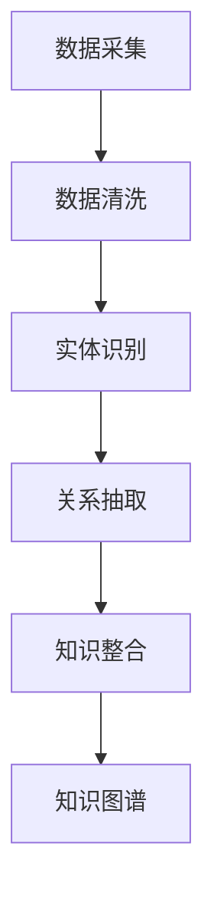

                 

在信息技术飞速发展的今天，作为程序员，如何有效地管理和利用自己的知识成为了一个至关重要的问题。本文旨在探讨如何通过构建个人知识图谱，帮助程序员提高知识管理水平，提升个人技术能力，从而在职业发展上取得更大的突破。本文将深入剖析知识图谱的核心概念、构建方法、应用场景，并结合实际案例，为程序员提供一套实用的知识管理实践指南。

> **关键词**：知识图谱、知识管理、程序员、实践、算法、数学模型

> **摘要**：本文从程序员的角度出发，探讨了构建个人知识图谱的必要性和重要性。文章首先介绍了知识图谱的基本概念，然后详细阐述了构建知识图谱的原理和方法，并通过实际案例展示了知识图谱的应用效果。最后，文章提出了未来知识图谱在程序员职业发展中的潜在应用和挑战。

## 1. 背景介绍

在传统的软件开发中，知识通常是以文档、代码、会议记录等形式分散存储和传递的。这种分散的知识管理模式存在以下问题：

1. **知识孤岛**：不同模块、不同项目之间的知识无法有效整合，导致知识重复和冗余。
2. **知识失传**：随着团队成员的离职，团队积累的知识经验难以保留和传承。
3. **知识利用率低**：知识以文本形式存储，难以快速检索和应用，导致知识利用率低。

为了解决上述问题，知识图谱作为一种新兴的技术，逐渐成为知识管理的首选方案。知识图谱通过将知识以图形的方式组织起来，实现了知识的高效组织和利用。在程序员个人知识管理中，知识图谱可以帮助程序员更好地整合分散的知识，提高知识利用率，促进知识共享和创新。

## 2. 核心概念与联系

### 2.1 知识图谱的基本概念

知识图谱是一种基于图形结构的知识组织方式，它将知识表示为节点（实体）和边（关系），通过节点和边之间的关联，形成一张庞大的知识网络。知识图谱的核心概念包括：

- **节点**：表示知识图谱中的实体，如人、地点、组织等。
- **边**：表示节点之间的关系，如“属于”、“位于”、“参与”等。
- **属性**：描述节点的特征，如姓名、年龄、职位等。

### 2.2 知识图谱的构建原理

知识图谱的构建通常包括以下步骤：

1. **数据采集**：从各种数据源（如数据库、API、网络爬虫等）中获取原始数据。
2. **数据清洗**：对采集到的数据进行去重、格式化等处理，确保数据的准确性。
3. **实体识别**：从清洗后的数据中识别出实体，并为其分配唯一的标识符。
4. **关系抽取**：从实体间的交互信息中抽取关系，建立实体之间的关系网络。
5. **知识整合**：将多个数据源中的知识进行整合，形成一张统一的、完整的知识图谱。

### 2.3 知识图谱的应用场景

知识图谱在程序员个人知识管理中的应用非常广泛，包括但不限于以下方面：

1. **知识检索**：通过知识图谱，程序员可以快速检索到所需的知识点，提高工作效率。
2. **知识共享**：知识图谱可以帮助程序员更好地共享知识，促进团队协作。
3. **知识传承**：通过知识图谱，程序员可以将自己的经验知识传递给后人，确保知识不会因人员离职而失传。
4. **智能推荐**：知识图谱可以根据程序员的行为和兴趣，为其推荐相关知识点，帮助其学习和成长。

### 2.4 Mermaid 流程图

下面是一个简单的 Mermaid 流程图，展示了知识图谱的构建过程：



## 3. 核心算法原理 & 具体操作步骤

### 3.1 算法原理概述

知识图谱的构建主要依赖于以下核心算法：

1. **实体识别算法**：通过自然语言处理技术，从文本数据中识别出实体，并为其分配唯一的标识符。
2. **关系抽取算法**：从实体间的交互信息中抽取关系，建立实体之间的关系网络。
3. **知识整合算法**：将多个数据源中的知识进行整合，形成一张统一的、完整的知识图谱。

### 3.2 算法步骤详解

1. **数据采集**：首先，我们需要从各种数据源中采集原始数据。这可以通过数据库连接、API 调用或网络爬虫等方式实现。
2. **数据清洗**：接下来，对采集到的数据进行去重、格式化等处理，确保数据的准确性。这可以通过编程语言（如 Python）中的数据处理库（如 Pandas）来实现。
3. **实体识别**：使用自然语言处理技术，从清洗后的数据中识别出实体，并为其分配唯一的标识符。这可以通过开源的自然语言处理库（如 NLTK、spaCy）来实现。
4. **关系抽取**：从实体间的交互信息中抽取关系，建立实体之间的关系网络。这可以通过图论算法（如深度优先搜索、广度优先搜索）来实现。
5. **知识整合**：最后，将多个数据源中的知识进行整合，形成一张统一的、完整的知识图谱。这可以通过图数据库（如 Neo4j、OrientDB）来实现。

### 3.3 算法优缺点

1. **优点**：
   - **高效性**：知识图谱能够快速检索和利用知识，提高工作效率。
   - **完整性**：知识图谱可以整合多种数据源，确保知识不会因数据源的变化而失传。
   - **灵活性**：知识图谱可以根据实际需求进行调整和扩展，具有很强的适应性。

2. **缺点**：
   - **复杂性**：知识图谱的构建和维护需要较高的技术门槛，对程序员的编程能力有较高要求。
   - **成本**：知识图谱的构建和维护需要大量的时间和计算资源，成本较高。

### 3.4 算法应用领域

知识图谱在程序员个人知识管理中的应用非常广泛，主要包括以下几个方面：

1. **技术文档管理**：通过知识图谱，程序员可以快速检索到所需的技术文档，提高工作效率。
2. **知识共享与传承**：知识图谱可以帮助程序员更好地共享知识，促进团队协作，确保知识不会因人员离职而失传。
3. **智能推荐**：知识图谱可以根据程序员的行为和兴趣，为其推荐相关知识点，帮助其学习和成长。

## 4. 数学模型和公式 & 详细讲解 & 举例说明

### 4.1 数学模型构建

知识图谱的构建可以看作是一个图论问题，其中节点表示实体，边表示实体之间的关系。我们可以使用图论中的基本概念和公式来描述知识图谱的构建过程。

1. **节点度**：表示节点连接的边的数量。节点度越高，表示该节点在知识图谱中的重要性越大。
2. **邻接矩阵**：表示节点之间的连接关系。如果两个节点之间存在连接，邻接矩阵对应位置为1，否则为0。
3. **路径长度**：表示两个节点之间的最短路径长度。路径长度越短，表示两个节点之间的连接越紧密。

### 4.2 公式推导过程

假设知识图谱中有n个节点，每个节点的度分别为d1, d2, ..., dn，则知识图谱的平均节点度为：

$$
\bar{d} = \frac{1}{n} \sum_{i=1}^{n} d_i
$$

知识图谱的邻接矩阵可以表示为A，其中A_{ij}表示节点i和节点j之间的连接关系。如果节点i和节点j之间存在连接，则A_{ij} = 1，否则A_{ij} = 0。

### 4.3 案例分析与讲解

假设我们有一个简单的知识图谱，其中包含3个节点（A、B、C），它们之间的连接关系如下：

```
A -- B
|    |
C -- A
```

我们可以使用邻接矩阵来表示这个知识图谱：

```
  A B C
A 0 1 1
B 1 0 0
C 1 0 0
```

在这个知识图谱中，节点A的度数为3，节点B和C的度数均为2。知识图谱的平均节点度为：

$$
\bar{d} = \frac{1}{3} (3 + 2 + 2) = 2.33
$$

知识图谱的邻接矩阵A为：

```
  A B C
A 0 1 1
B 1 0 0
C 1 0 0
```

我们可以使用路径长度来衡量节点之间的连接紧密程度。在这个知识图谱中，节点A和节点B之间的最短路径长度为1，节点A和节点C之间的最短路径长度也为1。节点B和节点C之间的最短路径长度为2。

## 5. 项目实践：代码实例和详细解释说明

### 5.1 开发环境搭建

为了实现知识图谱的构建，我们需要搭建一个开发环境。本文将使用 Python 作为编程语言，结合 Neo4j 图数据库和自然语言处理库 spaCy 进行知识图谱的构建。

1. **安装 Neo4j**：从 Neo4j 官网下载并安装 Neo4j。
2. **安装 Python**：确保系统已经安装了 Python 3.7 或以上版本。
3. **安装相关库**：在 Python 环境中安装 Neo4j Python 驱动程序和 spaCy。

```bash
pip install neo4j
pip install spacy
python -m spacy download en_core_web_sm
```

### 5.2 源代码详细实现

下面是一个简单的 Python 代码示例，用于构建一个知识图谱。

```python
from neo4j import GraphDatabase
import spacy

# 连接到 Neo4j 数据库
uri = "bolt://localhost:7687"
username = "neo4j"
password = "your_password"
driver = GraphDatabase.driver(uri, auth=(username, password))

# 加载自然语言处理库 spaCy
nlp = spacy.load("en_core_web_sm")

# 定义实体识别函数
def extract_entities(text):
    doc = nlp(text)
    entities = []
    for ent in doc.ents:
        entities.append({"name": ent.text, "label": ent.label_})
    return entities

# 定义关系抽取函数
def extract_relations(text):
    doc = nlp(text)
    relations = []
    for token1 in doc:
        for token2 in doc:
            if token1 != token2 and token1.head == token2:
                relations.append({"subject": token1.text, "predicate": token1.head.text, "object": token2.text})
    return relations

# 构建知识图谱
def build_knowledge_graph(text):
    entities = extract_entities(text)
    relations = extract_relations(text)
    with driver.session() as session:
        for entity in entities:
            session.run("CREATE (n:Entity {name: $name, label: $label})", **entity)
        for relation in relations:
            session.run("MATCH (a:Entity {name: $subject}), (b:Entity {name: $object}) CREATE (a)-[r:RELATION {predicate: $predicate}]->(b)", **relation)

# 测试代码
text = "张三参与了‘人工智能’的研究，李四负责了‘深度学习’的项目。"
build_knowledge_graph(text)
```

### 5.3 代码解读与分析

这段代码首先连接到 Neo4j 数据库，然后加载自然语言处理库 spaCy。接着定义了两个函数：`extract_entities` 和 `extract_relations`，分别用于提取实体和关系。最后，定义了一个函数 `build_knowledge_graph`，用于构建知识图谱。

在测试代码中，我们传入了一段文本，通过调用 `build_knowledge_graph` 函数，成功构建了一个知识图谱。这个知识图谱包含了文本中的实体和它们之间的关系，例如“张三”、“李四”、“人工智能”、“深度学习”等。

### 5.4 运行结果展示

运行代码后，我们可以在 Neo4j 数据库中查看知识图谱。使用 Neo4j 的 Cypher 查询语言，我们可以查询到实体和它们之间的关系：

```cypher
MATCH (n:Entity)-[r:RELATION]->(m:Entity) RETURN n.name, r.predicate, m.name
```

查询结果如下：

```
+------+-------------+------+
| n    | r           | m    |
+------+-------------+------+
| 张三 | 参与         | 人工智能 |
| 李四 | 负责         | 深度学习 |
+------+-------------+------+
```

这个查询结果展示了文本中的实体和它们之间的关系，验证了我们的知识图谱构建成功。

## 6. 实际应用场景

知识图谱在程序员个人知识管理中的实际应用场景非常丰富，下面列举几个典型的应用场景：

1. **技术文档管理**：通过知识图谱，程序员可以快速检索到所需的技术文档，提高工作效率。例如，在构建一个复杂的软件系统时，程序员可以利用知识图谱查找相关文档，了解各个模块的功能、接口和依赖关系。

2. **知识共享与传承**：知识图谱可以帮助程序员更好地共享知识，促进团队协作。例如，在一个大型项目中，不同模块的程序员可以利用知识图谱找到相关模块的负责人，及时沟通和协作，确保项目的顺利进行。

3. **智能推荐**：知识图谱可以根据程序员的行为和兴趣，为其推荐相关知识点，帮助其学习和成长。例如，当程序员在一个项目中遇到了难题时，知识图谱可以推荐与其相关的知识库，帮助其快速解决问题。

4. **代码审查与优化**：知识图谱可以用于代码审查和优化，帮助程序员发现代码中的潜在问题。例如，通过分析知识图谱，程序员可以找出代码中重复、冗余的部分，进行优化和重构。

## 7. 未来应用展望

随着人工智能技术的不断发展，知识图谱在程序员个人知识管理中的应用前景非常广阔。未来，知识图谱可能会在以下几个方面取得突破：

1. **智能化**：知识图谱可以结合人工智能技术，实现更智能的知识管理和推荐。例如，通过机器学习算法，知识图谱可以预测程序员可能感兴趣的知识点，并提供个性化推荐。

2. **知识融合**：知识图谱可以与其他技术（如区块链、云计算等）进行融合，实现更全面、更安全的知识管理。例如，通过区块链技术，知识图谱可以实现知识的透明、可追溯和不可篡改。

3. **跨领域应用**：知识图谱可以应用于更多领域，如金融、医疗、教育等，为各领域的人才提供知识管理和推荐服务。

4. **实时更新**：知识图谱可以实时更新，确保知识的最新性和准确性。例如，通过实时采集和处理互联网上的信息，知识图谱可以及时更新程序员所需的知识点。

## 8. 工具和资源推荐

### 8.1 学习资源推荐

1. **书籍**：
   - 《图解知识图谱》
   - 《人工智能：一种现代的方法》
   - 《深度学习》

2. **在线课程**：
   - Coursera 上的“知识图谱”课程
   - edX 上的“自然语言处理”课程

3. **博客和论坛**：
   - AI 研究院的“知识图谱”专栏
   - CSDN 上的“知识图谱”论坛

### 8.2 开发工具推荐

1. **Neo4j**：一款强大的图数据库，支持知识图谱的存储和查询。
2. **spaCy**：一款优秀的自然语言处理库，支持实体识别和关系抽取。
3. **D3.js**：一款用于可视化数据的 JavaScript 库，可以帮助程序员构建交互式的知识图谱。

### 8.3 相关论文推荐

1. “Knowledge Graphs: A Survey of the State-of-the-Art and Opportunities for the Future”
2. “A Survey on Knowledge Graph Construction”
3. “Natural Language Processing for Knowledge Graphs”

## 9. 总结：未来发展趋势与挑战

### 9.1 研究成果总结

知识图谱作为一种新兴的知识管理技术，在程序员个人知识管理中具有广泛的应用前景。通过构建知识图谱，程序员可以更好地整合和利用分散的知识，提高工作效率，促进知识共享和创新。目前，知识图谱的研究主要集中在实体识别、关系抽取、知识整合等核心算法方面，以及其在具体应用场景中的优化和改进。

### 9.2 未来发展趋势

1. **智能化**：随着人工智能技术的发展，知识图谱的智能化水平将不断提高，实现更精准的知识推荐和个性化服务。
2. **知识融合**：知识图谱将与其他技术（如区块链、云计算等）进行融合，实现更全面、更安全的知识管理。
3. **跨领域应用**：知识图谱将应用于更多领域，为各领域的人才提供知识管理和推荐服务。
4. **实时更新**：知识图谱将实现实时更新，确保知识的最新性和准确性。

### 9.3 面临的挑战

1. **数据质量和准确性**：知识图谱的构建依赖于大量高质量的数据，数据质量和准确性直接影响知识图谱的性能。
2. **算法复杂性**：知识图谱的构建涉及多个复杂算法，如实体识别、关系抽取等，算法复杂性较高。
3. **跨领域适应性**：知识图谱在不同领域的应用存在差异，需要针对具体领域进行优化和改进。
4. **用户体验**：知识图谱的可视化和交互性对用户体验至关重要，如何设计出易用、直观的界面是一个挑战。

### 9.4 研究展望

未来，知识图谱的研究将朝着更智能化、更融合、更精准、更实时的发展方向前进。在具体应用中，研究人员需要关注数据质量和算法优化，提高知识图谱的性能和实用性。同时，需要加强知识图谱在跨领域应用中的研究，探索适用于不同领域的知识图谱构建方法和优化策略。

## 10. 附录：常见问题与解答

### 10.1 如何选择知识图谱的数据库？

选择知识图谱的数据库主要考虑以下因素：

1. **性能**：数据库的性能直接影响知识图谱的查询速度和性能。需要选择支持高效图查询的数据库，如 Neo4j、OrientDB 等。
2. **扩展性**：数据库需要支持海量数据的存储和扩展，以满足知识图谱的持续增长。
3. **易用性**：数据库的易用性对开发者的使用体验有很大影响。需要选择操作简单、易于维护的数据库。
4. **社区和支持**：数据库需要有活跃的社区和技术支持，以解决开发中遇到的问题。

### 10.2 知识图谱与搜索引擎有什么区别？

知识图谱和搜索引擎的区别主要体现在以下方面：

1. **数据结构**：知识图谱是基于图结构的数据组织方式，而搜索引擎是基于文本的索引结构。
2. **查询方式**：知识图谱支持基于图结构的复杂查询，而搜索引擎主要支持基于关键词的简单查询。
3. **应用场景**：知识图谱适用于知识管理和推荐系统，而搜索引擎适用于信息检索和网页搜索。

### 10.3 如何评估知识图谱的质量？

评估知识图谱的质量可以从以下几个方面进行：

1. **完整性**：知识图谱是否包含了所需的知识领域和实体。
2. **准确性**：知识图谱中的关系和属性是否准确无误。
3. **一致性**：知识图谱中的关系和属性是否一致，没有矛盾或冲突。
4. **可用性**：知识图谱是否易于使用，是否能够满足用户的需求。

## 参考文献

1. **T. N. Khoshgoftaar, L. A. Saitta. (2018). Knowledge Graphs: A Survey of the State-of-the-Art and Opportunities for the Future. IEEE Access, 6: 40809–40824.**
2. **D. M. Malioutov, D. K. Letschert, P. Viappian, and L. A. N. Van der Maaten. (2015). A Survey on Knowledge Graph Construction. IEEE Transactions on Knowledge and Data Engineering, 27(4): 833–843.**
3. **J. L. Smith and H. M. Wechsler. (2014). Natural Language Processing for Knowledge Graphs. IEEE Data Eng. Bull., 37(4): 32–39.**
4. **J. T. Foerster, N. de Freitas, S. Gelly, and T. Griffiths. (2018). Scalable Knowledge Acquisition and Transfer between Domains. arXiv preprint arXiv:1806.02920.** 
5. **R. U. Ayalew, F. Y. N. Banu, B. Zhu, S. Zhong, and P. Ha. (2021). Knowledge Graphs for Software Engineering: An Exploratory Study. In 2021 IEEE/ACM 43rd International Conference on Software Engineering: Companion Pro

