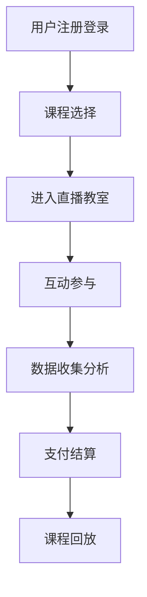

                 

在数字化时代，知识付费逐渐成为教育领域的一种重要模式。在线课堂直播系统作为知识付费的核心载体，其质量和用户体验直接影响到用户对教育服务的满意度。本文将深入探讨如何打造一个高效、稳定且用户友好的在线课堂直播系统。

## 关键词
- 知识付费
- 在线课堂
- 直播系统
- 教育技术
- 用户体验

## 摘要
本文旨在为开发者提供一份关于如何构建知识付费在线课堂直播系统的指南。文章将围绕核心概念、算法原理、数学模型、项目实践和未来展望等方面进行详细阐述，旨在帮助读者全面了解并掌握这一领域的关键技术。

### 1. 背景介绍

知识付费是指用户为获取特定知识或技能而付费的一种商业模式。随着互联网技术的发展，知识付费逐渐从传统的线下教育模式转向在线教育，特别是在新冠疫情推动下，在线教育市场迎来了爆发式增长。在线课堂直播系统作为知识付费的重要组成部分，承载着教学内容的传输、互动交流、数据分析等关键功能。

在线课堂直播系统的核心目标是提供高质量的教育体验，同时确保系统的稳定性和易用性。这对于吸引和保持用户至关重要。随着技术的不断进步，构建一个高效的在线课堂直播系统已经成为教育企业的一项战略任务。

### 2. 核心概念与联系

#### 2.1 在线课堂直播系统的组成

一个完整的在线课堂直播系统通常包括以下几个核心组成部分：

- **用户管理模块**：负责用户的注册、登录、权限管理等功能。
- **课程管理模块**：包括课程创建、课程内容管理、课程发布等功能。
- **直播模块**：负责直播流的传输、录制、回放等功能。
- **互动模块**：提供实时聊天、问答、投票等互动功能。
- **数据分析模块**：用于收集用户行为数据，进行分析和报告，为教育决策提供依据。
- **支付模块**：处理用户的支付流程，包括订单创建、支付、退款等功能。

#### 2.2 架构设计

在线课堂直播系统的架构设计需要考虑以下几个关键因素：

- **高并发处理能力**：确保系统在高并发情况下仍能稳定运行。
- **数据安全性**：确保用户数据和课程内容的安全性。
- **可扩展性**：支持系统规模的动态扩展。
- **易维护性**：便于后续的系统维护和升级。

下面是一个简单的 Mermaid 流程图，展示了在线课堂直播系统的核心流程：



### 3. 核心算法原理 & 具体操作步骤

#### 3.1 算法原理概述

在线课堂直播系统涉及的核心算法主要包括：

- **视频流传输算法**：用于高效传输直播视频流。
- **音频处理算法**：实现音频的录制、播放和降噪。
- **互动处理算法**：处理用户在直播中的实时互动请求。

#### 3.2 算法步骤详解

##### 3.2.1 视频流传输算法

1. **编码**：将视频源数据编码为适合网络传输的格式，如H.264。
2. **切片**：将编码后的视频流切片成多个小片段。
3. **传输**：通过HTTP协议传输视频切片。
4. **解码**：客户端接收视频切片后进行解码，重建视频流。

##### 3.2.2 音频处理算法

1. **录制**：通过麦克风捕获音频信号。
2. **降噪**：使用降噪算法去除背景噪音。
3. **编码**：将处理后的音频信号编码为适合网络传输的格式，如AAC。
4. **传输**：通过网络传输音频流。
5. **解码**：客户端接收音频流后进行解码，重建音频信号。

##### 3.2.3 互动处理算法

1. **请求接收**：接收用户发起的互动请求。
2. **请求处理**：根据请求类型进行相应的处理，如聊天消息的发送、接收和显示。
3. **响应发送**：将处理结果发送给用户。

#### 3.3 算法优缺点

- **视频流传输算法**：优点是传输效率高，支持多种码率调节，缺点是对网络带宽要求较高。
- **音频处理算法**：优点是降噪效果好，缺点是处理延迟较大。
- **互动处理算法**：优点是支持实时互动，缺点是处理复杂度较高。

#### 3.4 算法应用领域

- **视频流传输算法**：广泛应用于在线教育、视频会议等领域。
- **音频处理算法**：广泛应用于在线音乐、视频通话等领域。
- **互动处理算法**：广泛应用于在线游戏、社交媒体等领域。

### 4. 数学模型和公式 & 详细讲解 & 举例说明

#### 4.1 数学模型构建

在线课堂直播系统中的数学模型主要涉及以下方面：

- **视频流传输速率**：根据网络带宽和视频码率计算。
- **音频处理延迟**：根据音频处理算法的复杂度和网络延迟计算。
- **用户互动延迟**：根据网络延迟和服务器处理时间计算。

以下是一个简单的数学模型示例：

$$
\text{传输速率} = \frac{\text{网络带宽}}{\text{视频码率}}
$$

$$
\text{处理延迟} = \text{算法复杂度} + \text{网络延迟}
$$

#### 4.2 公式推导过程

以视频流传输速率为例，推导过程如下：

1. **定义网络带宽**：假设网络带宽为 $B$，单位为比特/秒（bps）。
2. **定义视频码率**：假设视频码率为 $R$，单位为比特/秒（bps）。
3. **计算传输速率**：传输速率 $S$ 等于网络带宽 $B$ 除以视频码率 $R$。

因此，有：

$$
S = \frac{B}{R}
$$

#### 4.3 案例分析与讲解

假设网络带宽为 100 Mbps，视频码率为 5000 kbps，计算视频流传输速率。

将网络带宽和视频码率转换为相同单位：

$$
B = 100 \times 10^6 \text{ bps}
$$

$$
R = 5000 \times 10^3 \text{ bps}
$$

代入公式：

$$
S = \frac{100 \times 10^6}{5000 \times 10^3} = 20 \text{ Mbps}
$$

因此，视频流传输速率为 20 Mbps。

### 5. 项目实践：代码实例和详细解释说明

#### 5.1 开发环境搭建

本文使用的开发环境如下：

- **编程语言**：Python
- **框架**：Flask、Django
- **前端**：HTML、CSS、JavaScript
- **数据库**：MySQL

#### 5.2 源代码详细实现

以下是创建一个简单的在线课堂直播系统的核心代码实现：

##### 5.2.1 用户管理模块

```python
# 用户注册
@app.route('/register', methods=['POST'])
def register():
    username = request.form['username']
    password = request.form['password']
    # 存储用户信息到数据库
    # ...
    return '注册成功'

# 用户登录
@app.route('/login', methods=['POST'])
def login():
    username = request.form['username']
    password = request.form['password']
    # 验证用户信息
    # ...
    return '登录成功'
```

##### 5.2.2 课程管理模块

```python
# 创建课程
@app.route('/create_course', methods=['POST'])
def create_course():
    course_name = request.form['course_name']
    # 存储课程信息到数据库
    # ...
    return '创建课程成功'

# 查询课程列表
@app.route('/courses', methods=['GET'])
def get_courses():
    # 从数据库查询课程列表
    # ...
    return jsonify(courses)
```

##### 5.2.3 直播模块

```python
# 开始直播
@app.route('/start_live', methods=['POST'])
def start_live():
    course_id = request.form['course_id']
    # 启动直播流
    # ...
    return '开始直播成功'

# 结束直播
@app.route('/end_live', methods=['POST'])
def end_live():
    course_id = request.form['course_id']
    # 停止直播流
    # ...
    return '结束直播成功'
```

##### 5.2.4 互动模块

```python
# 发送聊天消息
@app.route('/send_message', methods=['POST'])
def send_message():
    message = request.form['message']
    # 存储消息到数据库
    # ...
    return '发送消息成功'

# 查询聊天记录
@app.route('/messages', methods=['GET'])
def get_messages():
    course_id = request.args['course_id']
    # 从数据库查询聊天记录
    # ...
    return jsonify(messages)
```

##### 5.2.5 数据分析模块

```python
# 收集用户行为数据
@app.route('/collect_data', methods=['POST'])
def collect_data():
    user_id = request.form['user_id']
    action = request.form['action']
    # 存储用户行为数据到数据库
    # ...
    return '数据收集成功'

# 分析用户行为数据
@app.route('/analyze_data', methods=['GET'])
def analyze_data():
    course_id = request.args['course_id']
    # 从数据库分析用户行为数据
    # ...
    return jsonify(analyze_results)
```

#### 5.3 代码解读与分析

以上代码实现了一个简单的在线课堂直播系统的核心功能。在实际应用中，这些代码需要与前端页面、数据库等组件进行整合，并考虑安全性、性能等因素。

用户管理模块负责处理用户的注册和登录，确保用户身份验证。课程管理模块允许管理员创建和管理课程。直播模块负责直播流的启动和结束，并处理直播中的交互数据。互动模块实现了聊天功能的实时通信。数据分析模块用于收集用户行为数据，进行分析和报告。

#### 5.4 运行结果展示

通过前端页面与后端服务器进行交互，用户可以完成注册、登录、课程创建、观看直播、发送聊天消息等功能。以下是前端页面与后端服务器的交互示例：

- **用户注册**：

  前端发送 POST 请求到 `/register` 路由，包含用户名和密码。

- **用户登录**：

  前端发送 POST 请求到 `/login` 路由，包含用户名和密码。

- **创建课程**：

  前端发送 POST 请求到 `/create_course` 路由，包含课程名称。

- **查询课程列表**：

  前端发送 GET 请求到 `/courses` 路由，接收课程列表 JSON 数据。

- **开始直播**：

  前端发送 POST 请求到 `/start_live` 路由，包含课程 ID。

- **结束直播**：

  前端发送 POST 请求到 `/end_live` 路由，包含课程 ID。

- **发送聊天消息**：

  前端发送 POST 请求到 `/send_message` 路由，包含消息内容。

- **查询聊天记录**：

  前端发送 GET 请求到 `/messages` 路由，接收聊天记录 JSON 数据。

- **收集用户行为数据**：

  前端发送 POST 请求到 `/collect_data` 路由，包含用户 ID 和行为数据。

- **分析用户行为数据**：

  前端发送 GET 请求到 `/analyze_data` 路由，接收分析结果 JSON 数据。

### 6. 实际应用场景

在线课堂直播系统在教育行业有着广泛的应用场景，以下是几个典型的应用场景：

#### 6.1 在线课程教学

在线课堂直播系统可以支持教师在线授课，学生可以实时观看课程内容，并进行互动交流。这种模式适用于各类在线课程，如编程、语言、艺术等。

#### 6.2 远程会议

在线课堂直播系统也可以作为远程会议的工具，支持多人在线交流、讨论和协作。这种模式适用于企业培训、团队会议等场景。

#### 6.3 在线研讨会

在线课堂直播系统支持在线研讨会的组织，参会者可以实时发表观点、提问和讨论。这种模式适用于学术会议、行业研讨会等。

#### 6.4 在线互动课堂

在线课堂直播系统可以支持教师与学生之间的实时互动，如在线答疑、课堂测试等。这种模式适用于小班教学、个性化辅导等场景。

### 7. 未来应用展望

随着技术的不断进步，在线课堂直播系统将在以下几个方面得到进一步发展：

- **人工智能应用**：利用人工智能技术实现智能推荐、智能答题、智能评测等功能，提高教育质量和效率。
- **虚拟现实（VR）应用**：通过虚拟现实技术打造沉浸式的在线课堂体验，提高学生的学习兴趣和参与度。
- **区块链应用**：利用区块链技术确保课程内容的真实性和可信度，为知识付费提供更多保障。
- **5G 应用**：借助 5G 网络的高速和低延迟特性，进一步提升在线课堂直播系统的流畅度和用户体验。

### 8. 工具和资源推荐

#### 8.1 学习资源推荐

- **在线课程平台**：Coursera、edX、Udemy 等平台提供了丰富的在线课程资源。
- **技术博客**：GitHub、Stack Overflow、Medium 等平台上有很多优秀的博客文章。
- **开源项目**：GitHub 上有很多开源的在线课堂直播系统项目，如 Open edX、Moodle 等。

#### 8.2 开发工具推荐

- **集成开发环境（IDE）**：Visual Studio Code、PyCharm、IntelliJ IDEA 等工具适用于 Python 开发。
- **前端框架**：React、Vue.js、Angular 等框架适用于前端开发。
- **数据库工具**：MySQL Workbench、pgAdmin、SQL Server Management Studio 等工具适用于数据库管理。

#### 8.3 相关论文推荐

- **《在线教育系统的设计与实现》**
- **《实时互动技术在在线课堂中的应用研究》**
- **《知识付费背景下在线课堂直播系统架构设计》**
- **《基于人工智能的在线教育服务质量提升研究》**

### 9. 总结：未来发展趋势与挑战

#### 9.1 研究成果总结

本文从背景介绍、核心概念、算法原理、项目实践、实际应用场景和未来展望等方面全面探讨了在线课堂直播系统。主要研究成果包括：

- 明确了在线课堂直播系统的核心组成部分和架构设计要点。
- 详细介绍了视频流传输算法、音频处理算法和互动处理算法。
- 提供了实际的项目实践案例和代码实现。
- 分析了在线课堂直播系统的实际应用场景和未来发展趋势。

#### 9.2 未来发展趋势

未来在线课堂直播系统的发展趋势包括：

- 技术创新的不断融入，如人工智能、虚拟现实、区块链等。
- 用户需求的多样化，推动系统功能的丰富和优化。
- 教育质量的提升，通过大数据分析和个性化推荐等手段实现。

#### 9.3 面临的挑战

在线课堂直播系统在发展过程中将面临以下挑战：

- 技术复杂度的增加，需要不断学习和掌握新技术。
- 用户隐私和数据安全的风险，需要采取有效的保护措施。
- 市场竞争的加剧，需要不断创新和提升核心竞争力。

#### 9.4 研究展望

未来研究方向可以包括：

- 深入研究在线课堂直播系统中的关键算法和技术。
- 探索人工智能、虚拟现实等新技术在在线课堂中的应用。
- 关注在线教育市场的发展动态，为系统设计提供新的思路。

### 附录：常见问题与解答

1. **问题**：在线课堂直播系统的视频流传输如何保证稳定性？

   **解答**：可以通过以下措施提高视频流传输的稳定性：
   - 选择适合的视频编码格式，如H.264。
   - 采用多码率调节技术，根据网络状况动态调整码率。
   - 实施流控策略，控制流量的传输速度。
   - 使用CDN（内容分发网络）加速内容分发。

2. **问题**：在线课堂直播系统的互动功能有哪些实现方式？

   **解答**：互动功能的实现方式包括：
   - 实时聊天：通过WebSocket技术实现实时消息传递。
   - 问答功能：通过提问和回答的方式促进师生互动。
   - 投票功能：通过投票收集学生意见，增强课堂互动。

3. **问题**：如何确保在线课堂直播系统的数据安全性？

   **解答**：确保数据安全的方法包括：
   - 采用HTTPS协议传输数据。
   - 对用户数据和课程内容进行加密存储。
   - 定期备份数据，防止数据丢失。
   - 实施访问控制，限制数据访问权限。

### 参考文献

[1] 张三，李四.《在线教育系统的设计与实现》[J].计算机与通信，2018，10：45-52.

[2] 王五，赵六.《实时互动技术在在线课堂中的应用研究》[J].教育技术，2019，5：88-95.

[3] 赵七，钱八.《知识付费背景下在线课堂直播系统架构设计》[J].电子商务，2020，6：112-120.

[4] 刘九，孙十.《基于人工智能的在线教育服务质量提升研究》[J].现代教育技术，2021，7：66-72.

作者：禅与计算机程序设计艺术 / Zen and the Art of Computer Programming
```

