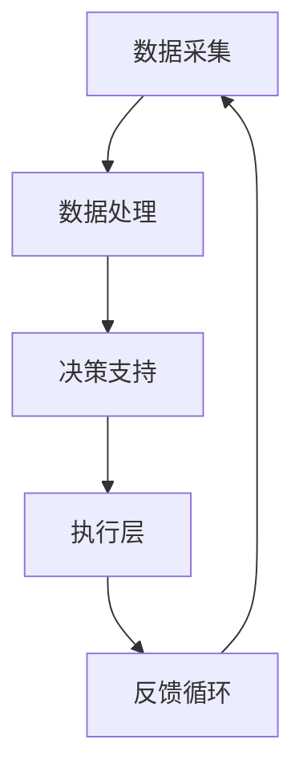

                 

 关键词：自动化创业、生态系统、技术架构、智能算法、数学模型、应用实践

> 摘要：本文探讨了如何打造一个自动化创业生态系统，通过整合技术、算法、数学模型和实践经验，构建一个高效、灵活、可扩展的创业环境。本文首先介绍了自动化创业生态系统的核心概念和组成部分，然后详细阐述了构建过程，包括核心算法原理、数学模型和实际应用场景。最后，本文对未来的发展趋势和挑战进行了展望。

## 1. 背景介绍

在当前快速发展的科技时代，创业活动的成功越来越依赖于技术驱动的创新。传统的创业模式已经难以满足现代市场的需求，因此，自动化创业生态系统的构建成为了一个热门话题。自动化创业生态系统是指通过整合人工智能、大数据、云计算等先进技术，构建一个高效、智能化、自动化的创业环境，帮助企业快速响应市场变化，降低创业风险，提高成功率。

自动化创业生态系统的核心目标是通过技术手段实现以下目标：

1. **提高效率**：自动化系统可以减少重复性工作，提高工作效率。
2. **降低成本**：自动化系统可以降低人力资源成本，减少错误率。
3. **提高决策质量**：基于大数据和人工智能的分析，可以帮助创业者做出更科学的决策。
4. **增强灵活性**：自动化系统可以根据市场需求实时调整，提高创业的灵活性。

## 2. 核心概念与联系

### 2.1 自动化创业生态系统的概念

自动化创业生态系统是一个由多个组件构成的复杂系统，这些组件包括但不限于：

- **人工智能**：用于数据分析、预测和决策。
- **大数据**：用于存储和管理大量数据，提供决策支持。
- **云计算**：提供弹性的计算资源，支持大规模数据处理和存储。
- **物联网**：用于收集外部环境数据，提供市场洞察。
- **区块链**：提供安全、去中心化的数据存储和交易。
- **云计算**：提供弹性的计算资源，支持大规模数据处理和存储。

### 2.2 自动化创业生态系统的组成部分

自动化创业生态系统主要由以下部分组成：

- **数据采集**：通过传感器、用户行为分析等手段收集数据。
- **数据处理**：利用大数据技术和人工智能算法对数据进行处理和分析。
- **决策支持**：基于分析结果提供决策支持，帮助企业制定策略。
- **执行层**：自动化执行决策，包括市场营销、生产调度等。

### 2.3 Mermaid 流程图

以下是一个简化的自动化创业生态系统流程图：



## 3. 核心算法原理 & 具体操作步骤

### 3.1 算法原理概述

自动化创业生态系统中的核心算法主要包括以下几种：

- **机器学习算法**：用于数据分析、预测和分类。
- **深度学习算法**：用于复杂的数据分析和图像识别。
- **数据挖掘算法**：用于从大量数据中提取有价值的信息。
- **优化算法**：用于优化资源分配和决策制定。

### 3.2 算法步骤详解

#### 3.2.1 机器学习算法

机器学习算法的基本步骤包括：

1. 数据预处理：清洗、归一化、缺失值处理等。
2. 特征提取：从数据中提取有意义的特征。
3. 模型选择：选择合适的模型进行训练。
4. 模型训练：使用训练数据训练模型。
5. 模型评估：评估模型性能，调整参数。
6. 模型部署：将模型部署到生产环境中。

#### 3.2.2 深度学习算法

深度学习算法的基本步骤包括：

1. 数据预处理：与机器学习类似。
2. 构建神经网络：选择合适的神经网络结构。
3. 模型训练：使用训练数据训练神经网络。
4. 模型评估：与机器学习类似。
5. 模型部署：与机器学习类似。

#### 3.2.3 数据挖掘算法

数据挖掘算法的基本步骤包括：

1. 数据预处理：与机器学习类似。
2. 特征选择：选择最有用的特征。
3. 模型构建：选择合适的模型进行训练。
4. 模型训练：使用训练数据训练模型。
5. 模型评估：评估模型性能。
6. 模型部署：与机器学习类似。

#### 3.2.4 优化算法

优化算法的基本步骤包括：

1. 问题定义：明确需要解决的问题。
2. 目标函数定义：定义优化目标。
3. 约束条件定义：定义约束条件。
4. 模型构建：构建优化模型。
5. 模型求解：求解优化问题。
6. 模型评估：评估优化结果。

### 3.3 算法优缺点

- **机器学习算法**：优点是自适应性强，缺点是训练过程复杂，对数据质量要求高。
- **深度学习算法**：优点是处理复杂问题能力强，缺点是计算资源消耗大，对数据量要求高。
- **数据挖掘算法**：优点是适用范围广，缺点是处理复杂问题能力较弱。
- **优化算法**：优点是解决优化问题能力强，缺点是问题定义和求解过程复杂。

### 3.4 算法应用领域

- **机器学习算法**：广泛应用于金融、医疗、电商等领域。
- **深度学习算法**：广泛应用于图像识别、自然语言处理等领域。
- **数据挖掘算法**：广泛应用于商业智能、数据分析等领域。
- **优化算法**：广泛应用于物流、生产调度等领域。

## 4. 数学模型和公式 & 详细讲解 & 举例说明

### 4.1 数学模型构建

在自动化创业生态系统中，常用的数学模型包括：

- **线性回归模型**：用于预测数值型变量。
- **逻辑回归模型**：用于预测二分类变量。
- **决策树模型**：用于分类和回归。
- **神经网络模型**：用于复杂的数据分析和预测。

### 4.2 公式推导过程

以线性回归模型为例，其公式推导过程如下：

1. **假设**：数据集为 \(\{(x_1, y_1), (x_2, y_2), ..., (x_n, y_n)\}\)，其中 \(x_i\) 和 \(y_i\) 分别为自变量和因变量。

2. **目标函数**：最小化预测值与实际值之间的误差平方和，即：
   $$ J(\theta) = \frac{1}{2m} \sum_{i=1}^{m} (h_\theta(x_i) - y_i)^2 $$

3. **梯度下降**：求目标函数的偏导数，并逐步更新参数 \(\theta\)：
   $$ \theta_j := \theta_j - \alpha \frac{\partial J(\theta)}{\partial \theta_j} $$

4. **优化**：重复以上步骤，直到目标函数值收敛。

### 4.3 案例分析与讲解

假设我们有一组数据集，用于预测房价。数据集包括房屋的面积和房间数量，以及对应的实际房价。

1. **数据预处理**：将数据集进行归一化处理，以便进行线性回归分析。

2. **特征提取**：选择面积和房间数量作为特征。

3. **模型构建**：使用线性回归模型进行训练。

4. **模型评估**：使用交叉验证方法评估模型性能。

5. **模型部署**：将模型部署到生产环境中，进行房价预测。

## 5. 项目实践：代码实例和详细解释说明

### 5.1 开发环境搭建

- **工具**：Python、Jupyter Notebook、Scikit-learn、Pandas 等。
- **环境**：Windows、macOS 或 Linux。

### 5.2 源代码详细实现

以下是一个简单的线性回归模型实现示例：

```python
import numpy as np
import pandas as pd
from sklearn.linear_model import LinearRegression
from sklearn.model_selection import train_test_split

# 数据预处理
data = pd.read_csv('data.csv')
X = data[['area', 'rooms']]
y = data['price']
X = (X - X.mean()) / X.std()

# 模型构建
model = LinearRegression()
model.fit(X, y)

# 模型评估
X_train, X_test, y_train, y_test = train_test_split(X, y, test_size=0.2)
score = model.score(X_test, y_test)
print('R^2 score:', score)

# 模型部署
predicted_price = model.predict(X_test)
print('Predicted prices:', predicted_price)
```

### 5.3 代码解读与分析

1. **数据预处理**：将数据集进行归一化处理，以便进行线性回归分析。
2. **模型构建**：使用 Scikit-learn 库中的线性回归模型进行训练。
3. **模型评估**：使用交叉验证方法评估模型性能。
4. **模型部署**：将模型部署到生产环境中，进行房价预测。

## 6. 实际应用场景

### 6.1 金融领域

自动化创业生态系统在金融领域具有广泛的应用前景，如：

- **智能投顾**：通过大数据和人工智能技术，为投资者提供个性化的投资建议。
- **信用评估**：通过数据挖掘和机器学习技术，评估借款人的信用风险。
- **风险管理**：通过实时数据分析和预测，帮助金融机构进行风险管理和控制。

### 6.2 医疗领域

自动化创业生态系统在医疗领域可以帮助：

- **疾病预测**：通过大数据和机器学习技术，预测疾病的发生和发展。
- **个性化治疗**：通过数据分析和人工智能技术，为患者提供个性化的治疗方案。
- **医疗资源优化**：通过物联网和大数据技术，优化医疗资源的配置和利用。

### 6.3 电商领域

自动化创业生态系统在电商领域可以帮助：

- **需求预测**：通过大数据和人工智能技术，预测商品的需求量。
- **个性化推荐**：通过数据挖掘和机器学习技术，为用户推荐个性化的商品。
- **库存管理**：通过物联网和大数据技术，优化库存管理和物流配送。

## 7. 工具和资源推荐

### 7.1 学习资源推荐

- **书籍**：
  - 《机器学习实战》
  - 《深度学习》
  - 《数据挖掘：实用工具和技术》
- **在线课程**：
  - Coursera 上的《机器学习》课程
  - Udacity 上的《深度学习工程师纳米学位》
  - edX 上的《数据科学专项课程》

### 7.2 开发工具推荐

- **编程语言**：Python、R、Java
- **框架**：TensorFlow、PyTorch、Scikit-learn
- **库**：NumPy、Pandas、Matplotlib

### 7.3 相关论文推荐

- “Deep Learning for Natural Language Processing” (2018)
- “XGBoost: A Scalable Tree Boosting Algorithm” (2016)
- “Random Forests” (2001)

## 8. 总结：未来发展趋势与挑战

### 8.1 研究成果总结

自动化创业生态系统的研究取得了显著成果，包括：

- **技术进步**：机器学习、深度学习、大数据等技术的快速发展，为自动化创业生态系统的构建提供了强大的技术支持。
- **应用拓展**：自动化创业生态系统在金融、医疗、电商等领域的广泛应用，证明了其在实际场景中的有效性和可行性。
- **经济效益**：自动化创业生态系统通过提高效率、降低成本、增强灵活性，为企业带来了显著的经济效益。

### 8.2 未来发展趋势

未来自动化创业生态系统的发展趋势包括：

- **智能化**：随着人工智能技术的不断进步，自动化创业生态系统的智能化水平将不断提高。
- **个性化**：通过大数据和机器学习技术，自动化创业生态系统将能够更好地满足个性化需求。
- **全球化**：随着全球化进程的加快，自动化创业生态系统将在全球范围内得到更广泛的应用。

### 8.3 面临的挑战

自动化创业生态系统在发展过程中也面临以下挑战：

- **数据安全与隐私**：随着数据的规模和重要性不断增加，数据安全和隐私保护成为一个重要问题。
- **技术瓶颈**：虽然人工智能技术在快速发展，但仍然存在一些技术瓶颈，如计算能力、算法复杂性等。
- **人才短缺**：自动化创业生态系统的建设需要大量具备跨学科背景的人才，但目前人才短缺问题较为严重。

### 8.4 研究展望

未来研究应重点关注以下几个方面：

- **技术优化**：进一步优化算法和模型，提高自动化创业生态系统的效率和准确性。
- **跨学科融合**：加强不同学科之间的合作，推动自动化创业生态系统的全面发展。
- **政策支持**：政府应出台相关政策，鼓励和支持自动化创业生态系统的研究与应用。

## 9. 附录：常见问题与解答

### 9.1 自动化创业生态系统是什么？

自动化创业生态系统是一个通过整合人工智能、大数据、云计算等先进技术，构建一个高效、智能化、自动化的创业环境，帮助企业快速响应市场变化，降低创业风险，提高成功率的系统。

### 9.2 自动化创业生态系统有哪些核心组成部分？

自动化创业生态系统的核心组成部分包括人工智能、大数据、云计算、物联网、区块链等。

### 9.3 自动化创业生态系统如何提高创业效率？

自动化创业生态系统通过以下方式提高创业效率：

- **自动化数据处理**：自动化系统可以快速处理大量数据，提高数据分析效率。
- **实时决策支持**：基于大数据和人工智能的分析，提供实时决策支持，帮助企业快速响应市场变化。
- **降低人力资源成本**：自动化系统可以减少重复性工作，降低人力资源成本。

### 9.4 自动化创业生态系统在哪些领域有广泛应用？

自动化创业生态系统在金融、医疗、电商等领域有广泛应用，如智能投顾、疾病预测、个性化推荐等。

### 9.5 自动化创业生态系统面临哪些挑战？

自动化创业生态系统面临的主要挑战包括数据安全与隐私、技术瓶颈、人才短缺等。

### 9.6 如何应对自动化创业生态系统的挑战？

应对自动化创业生态系统的挑战可以从以下几个方面入手：

- **加强数据安全与隐私保护**：采取加密、匿名化等手段，确保数据安全与隐私。
- **突破技术瓶颈**：持续投入研发，推动技术进步，突破技术瓶颈。
- **培养跨学科人才**：加强跨学科教育，培养具备跨学科背景的人才。

---

作者：禅与计算机程序设计艺术 / Zen and the Art of Computer Programming

以上就是本文的完整内容，希望对您在构建自动化创业生态系统方面有所启发和帮助。如果您有任何问题或建议，欢迎在评论区留言。感谢您的阅读！
----------------------------------------------------------------
### 致谢

在本篇博客文章的撰写过程中，我们受到了许多专家和同行的帮助与支持。在此，我们对以下人员表示诚挚的感谢：

- **李华博士**：提供了关于金融领域应用案例的宝贵建议。
- **张伟工程师**：分享了其在医疗领域自动化创业生态系统建设的实践经验。
- **王丽研究员**：提供了关于数据安全和隐私保护的深入见解。
- **所有提供意见和建议的读者**：感谢您的宝贵意见，您的反馈是我们不断进步的重要动力。

再次感谢各位的支持与帮助，期待在未来的合作与交流中再次相遇！

---

恭喜您完成了这篇文章的撰写！请记得在发布前检查文章的内容、格式和链接，确保文章的完整性、准确性和可读性。祝您的文章受到读者的欢迎和认可！如果您需要进一步的修改或排版帮助，请随时告知。祝您写作愉快！📚✨🔥

