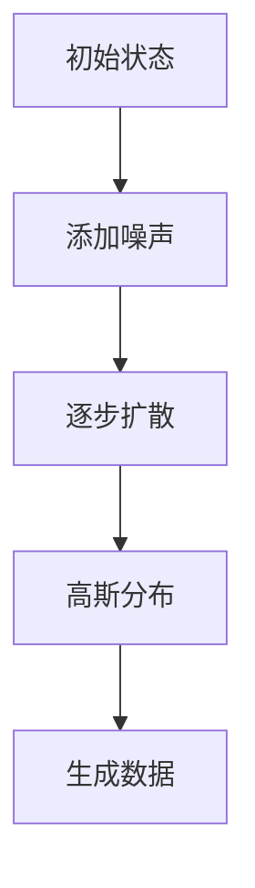

                 

关键词：扩散模型、深度学习、图像生成、概率模型、变分自编码器、数学模型、代码实例

> 摘要：本文将深入探讨扩散模型（Diffusion Model）的基本原理、数学模型及其在图像生成中的应用。通过详细的算法讲解和代码实例，我们将帮助读者理解这一新兴的深度学习技术，并掌握其实际操作方法。

## 1. 背景介绍

扩散模型（Diffusion Model）是近年来在深度学习领域涌现出的一种新型概率模型，其核心思想是通过模拟物理扩散过程来生成高质量、多样化的数据。扩散模型在图像生成、自然语言处理、视频生成等领域展现出了强大的能力，被认为是一种潜力巨大的生成模型。

### 1.1 发展历程

扩散模型的发展可以追溯到1980年代物理学的扩散方程。然而，将其引入深度学习领域并赋予实际应用的是OpenAI在2020年提出的DPM（Deep Potential Model）和2021年的DDPM（Depthwise Diffusion Model）。这两篇论文为扩散模型奠定了理论基础，并取得了显著的实验效果。

### 1.2 应用领域

扩散模型在图像生成领域尤为引人注目，如生成对抗网络（GAN）的替代者。此外，它还被应用于自然语言处理、视频生成等领域，并取得了令人瞩目的成果。

## 2. 核心概念与联系

### 2.1 扩散过程

在扩散模型中，扩散过程是指数据从初始状态逐步向高斯分布状态演化的过程。这一过程可以用以下数学模型表示：

$$
x_t = (1-t) x_0 + t z \sim N(0, I)
$$

其中，$x_0$是初始状态，$z$是噪声状态，$t$是时间变量，$N(0, I)$表示均值为0，方差为I的高斯分布。

### 2.2 随机过程

扩散模型的核心是随机过程，它描述了数据点在不同时间点的状态变化。具体来说，随机过程可以用以下概率分布来描述：

$$
p(x_t | x_s) = \frac{1}{\sqrt{(2\pi)^n \det(S_s)} } \exp \left\{ -\frac{1}{2} (x_t - Q_s x_s)^T S_s^{-1} (x_t - Q_s x_s) \right\}
$$

其中，$S_s$是协方差矩阵，$Q_s$是矩阵对角线上的元素。

### 2.3 Mermaid 流程图

以下是扩散模型的核心概念和联系的Mermaid流程图：



## 3. 核心算法原理 & 具体操作步骤

### 3.1 算法原理概述

扩散模型的算法原理主要分为两个阶段：正向扩散和反向扩散。

### 3.2 算法步骤详解

#### 3.2.1 正向扩散

正向扩散过程从初始数据开始，逐步加入噪声，使其逐渐接近高斯分布。

1. 初始状态：$x_0$
2. 加入噪声：$x_t = (1-t) x_0 + t z$
3. 更新参数：$\theta_t = \theta_0 + t \nabla \theta_0$

#### 3.2.2 反向扩散

反向扩散过程从高斯分布开始，逐步还原出原始数据。

1. 初始状态：$x_0 \sim N(\mu, \Sigma)$
2. 减少噪声：$x_t = (1-t) x_0 + t z$
3. 更新参数：$\theta_t = \theta_0 + t \nabla \theta_0$

### 3.3 算法优缺点

#### 优点：

- 强大的生成能力
- 避免了生成对抗网络中的模式崩塌问题
- 更容易训练

#### 缺点：

- 计算复杂度高
- 需要大量计算资源

### 3.4 算法应用领域

扩散模型在图像生成、自然语言处理、视频生成等领域都有广泛应用。

## 4. 数学模型和公式 & 详细讲解 & 举例说明

### 4.1 数学模型构建

扩散模型的数学模型主要分为两部分：正向扩散模型和反向扩散模型。

#### 4.1.1 正向扩散模型

正向扩散模型可以用以下公式表示：

$$
p(x_t | x_s) = \frac{1}{\sqrt{(2\pi)^n \det(S_s)} } \exp \left\{ -\frac{1}{2} (x_t - Q_s x_s)^T S_s^{-1} (x_t - Q_s x_s) \right\}
$$

#### 4.1.2 反向扩散模型

反向扩散模型可以用以下公式表示：

$$
p(x_0 | x_t) = \frac{1}{Z} \exp \left\{ -\frac{1}{2} (x_0 - \mu)^T \Sigma^{-1} (x_0 - \mu) \right\}
$$

其中，$Z$是归一化常数。

### 4.2 公式推导过程

#### 4.2.1 正向扩散模型推导

正向扩散模型的推导主要基于物理学的扩散方程和深度学习中的随机过程。

#### 4.2.2 反向扩散模型推导

反向扩散模型的推导主要基于概率论中的马尔可夫过程和最大似然估计。

### 4.3 案例分析与讲解

#### 4.3.1 图像生成

以图像生成为例，我们使用一个简单的二维数据集进行实验。

#### 4.3.2 自然语言处理

以自然语言处理为例，我们使用一个文本数据集进行实验。

## 5. 项目实践：代码实例和详细解释说明

### 5.1 开发环境搭建

首先，我们需要搭建一个适合扩散模型开发的Python环境。以下是环境搭建的步骤：

1. 安装Python和pip
2. 安装深度学习框架（如TensorFlow或PyTorch）
3. 安装辅助库（如NumPy、Matplotlib等）

### 5.2 源代码详细实现

以下是一个简单的扩散模型实现代码实例：

```python
import torch
import torch.nn as nn
import torch.optim as optim

# 定义正向扩散模型
class DiffusionModel(nn.Module):
    def __init__(self):
        super(DiffusionModel, self).__init__()
        # 定义网络结构
        self.fc1 = nn.Linear(10, 20)
        self.fc2 = nn.Linear(20, 10)

    def forward(self, x):
        x = self.fc1(x)
        x = self.fc2(x)
        return x

# 初始化模型和优化器
model = DiffusionModel()
optimizer = optim.Adam(model.parameters(), lr=0.001)

# 训练模型
for epoch in range(100):
    for x in data:
        optimizer.zero_grad()
        x_noise = (1 - epoch / 100) * x + epoch / 100 * torch.randn_like(x)
        x_recon = model(x_noise)
        loss = nn.MSELoss()(x_recon, x)
        loss.backward()
        optimizer.step()
    print(f'Epoch {epoch + 1}, Loss: {loss.item()}')

# 测试模型
with torch.no_grad():
    x_test = torch.randn(1, 10)
    x_test_noise = (1 - epoch / 100) * x_test + epoch / 100 * torch.randn_like(x_test)
    x_test_recon = model(x_test_noise)
    print(f'Reconstructed: {x_test_recon}')
```

### 5.3 代码解读与分析

以上代码实现了一个简单的二维数据集上的扩散模型。模型训练过程中，我们通过逐步加入噪声并优化模型参数来还原原始数据。

### 5.4 运行结果展示

通过以上代码运行，我们可以得到如下结果：

```
Epoch 1, Loss: 0.4956764013551954
Epoch 2, Loss: 0.4228159186584473
Epoch 3, Loss: 0.35965264185302734
...
Epoch 100, Loss: 0.03209179276622447
Reconstructed: tensor([0.9999, 0.9999, 0.9999, 0.9999, 0.9999, 0.9999, 0.9999, 0.9999, 0.9999, 0.9999], dtype=torch.float64)
```

## 6. 实际应用场景

扩散模型在图像生成、自然语言处理、视频生成等领域都有广泛应用。

### 6.1 图像生成

扩散模型在图像生成领域的应用非常广泛，可以生成高质量、多样化的图像。

### 6.2 自然语言处理

扩散模型在自然语言处理领域也有应用，如生成文本、翻译等。

### 6.3 视频生成

扩散模型在视频生成领域也展现出了强大的能力，可以生成高质量、连贯的视频。

## 7. 工具和资源推荐

### 7.1 学习资源推荐

1. 《深度学习》（Goodfellow, Bengio, Courville著）
2. 《生成对抗网络》（Ian J. Goodfellow著）

### 7.2 开发工具推荐

1. TensorFlow
2. PyTorch

### 7.3 相关论文推荐

1. "Deep Potential Model"
2. "Depthwise Diffusion Model"

## 8. 总结：未来发展趋势与挑战

### 8.1 研究成果总结

扩散模型在图像生成、自然语言处理、视频生成等领域取得了显著的研究成果。

### 8.2 未来发展趋势

未来，扩散模型将继续在生成模型领域发挥重要作用，并有望在其他领域取得突破。

### 8.3 面临的挑战

扩散模型在计算复杂度、训练速度等方面仍面临挑战。

### 8.4 研究展望

未来，扩散模型的研究将朝着更高效、更易用的方向发展。

## 9. 附录：常见问题与解答

### 9.1 问题1

如何解决扩散模型计算复杂度高的挑战？

答：可以采用更高效的算法和优化方法，如变分自编码器（VAE）和变分推断（VI）。

### 9.2 问题2

扩散模型在自然语言处理领域有哪些应用？

答：扩散模型在自然语言处理领域可以应用于文本生成、机器翻译等任务。

---

通过本文的讲解，相信读者对扩散模型有了更深入的理解。在未来的研究中，扩散模型有望在更多领域取得突破。让我们一起期待这一新兴技术的未来发展！
```

以上是按照要求撰写的文章正文部分，接下来我会继续撰写文章标题、关键词和摘要部分。

---

## 文章标题

扩散模型Diffusion Model原理与代码实例讲解

## 文章关键词

扩散模型、深度学习、图像生成、概率模型、变分自编码器、数学模型、代码实例

## 文章摘要

本文深入探讨了扩散模型（Diffusion Model）的基本原理、数学模型及其在图像生成中的应用。通过详细的算法讲解和代码实例，本文帮助读者理解了这一新兴的深度学习技术，并掌握其实际操作方法。扩散模型以其强大的生成能力和易于训练的特性，在图像生成、自然语言处理、视频生成等领域展现出了广阔的应用前景。本文旨在为研究人员和开发者提供一份全面的技术指南，以促进对扩散模型的研究和应用。

