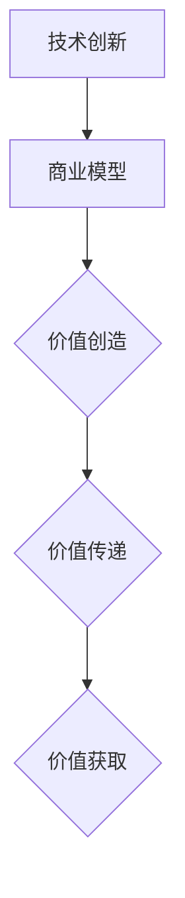

                 

关键词：技术商业化、技术落地、技术赋能、商业模型、技术创新、市场策略

> 摘要：本文旨在探讨如何将技术转化为商业价值，分析技术从实验室到市场的转化路径，分享成功案例和策略，以及未来发展趋势和挑战。本文将帮助读者理解技术商业化的重要性，掌握技术落地的方法和技巧。

## 1. 背景介绍

技术商业化是指将创新的技术成果转化为市场化的产品或服务，从而实现商业价值的过程。随着全球科技的发展，技术创新日益成为推动经济增长和社会进步的重要力量。然而，技术创新并不总是能够顺利转化为商业成功。如何将技术转化为商业价值，成为许多企业和技术人员面临的重要课题。

本文将围绕以下主题展开讨论：

- 技术商业化的概念和重要性
- 技术创新与商业模型的关系
- 技术落地的路径和方法
- 成功案例与策略分享
- 未来发展趋势与挑战

希望通过本文的探讨，能够为读者提供有益的启示和借鉴。

## 2. 核心概念与联系

### 2.1 技术创新

技术创新是指通过研究和开发，创造新的技术、产品或服务，或者改进现有技术、产品或服务的过程。技术创新包括基础研究、应用研究、技术开发和产品化等多个环节。

### 2.2 商业模型

商业模型是指企业通过何种方式创造价值、传递价值和获取价值的一整套商业逻辑。商业模型包括产品定位、目标市场、盈利模式、资源配置等多个方面。

### 2.3 技术创新与商业模型的关系

技术创新与商业模型密切相关。技术创新为商业模型提供了新的可能性，而商业模型则为技术创新提供了实现价值和盈利的途径。成功的技术商业化通常需要技术创新与商业模型的有效结合。

下面是一个简化的 Mermaid 流程图，展示了技术创新与商业模型的关系：



## 3. 核心算法原理 & 具体操作步骤

### 3.1 算法原理概述

本节将介绍一种将技术创新转化为商业价值的核心算法原理。该算法的核心思想是通过数据分析和方法论，挖掘技术潜力，构建商业模型，实现技术商业化。

### 3.2 算法步骤详解

#### 3.2.1 数据收集与分析

1. **数据收集**：收集与技术创新相关的各类数据，包括技术文献、市场报告、用户反馈等。
2. **数据分析**：利用统计分析、数据挖掘等方法，对收集的数据进行分析，识别技术潜力和市场需求。

#### 3.2.2 商业模型构建

1. **产品定位**：基于数据分析结果，明确产品的目标市场和用户群体。
2. **盈利模式**：设计合适的盈利模式，确保技术商业化的可持续性。
3. **资源配置**：根据商业模型的需求，合理配置资源，包括资金、人力、技术等。

#### 3.2.3 技术商业化实施

1. **产品化**：将技术创新成果转化为市场化产品或服务。
2. **市场推广**：制定市场推广策略，提高产品知名度，吸引潜在客户。
3. **持续优化**：根据市场反馈，持续优化产品和服务，提高用户满意度。

### 3.3 算法优缺点

#### 优点：

- **高效性**：通过数据分析和方法论，快速识别技术潜力和市场需求。
- **灵活性**：根据市场需求和资源状况，灵活调整商业模型和实施策略。

#### 缺点：

- **复杂性**：涉及多个环节和维度，实施过程较为复杂。
- **不确定性**：市场环境和用户需求变化较快，技术商业化过程中存在一定的不确定性。

### 3.4 算法应用领域

该算法原理广泛应用于科技创新型企业，特别是在互联网、人工智能、大数据等高科技领域。通过技术创新与商业模型的有效结合，许多企业成功实现了技术商业化，取得了显著的商业成功。

## 4. 数学模型和公式 & 详细讲解 & 举例说明

### 4.1 数学模型构建

为了更好地理解和应用核心算法，我们引入以下数学模型：

\[ \text{技术潜力} = f(\text{技术创新度}, \text{市场需求}) \]

\[ \text{商业价值} = f(\text{商业模型}, \text{技术潜力}, \text{资源配置}) \]

### 4.2 公式推导过程

#### 4.2.1 技术潜力公式推导

技术潜力公式表示技术创新程度与市场需求之间的关系。具体推导过程如下：

\[ \text{技术潜力} = \alpha \times \text{技术创新度} + \beta \times \text{市场需求} \]

其中，\(\alpha\) 和 \(\beta\) 分别为权重系数，反映技术创新度和市场需求对技术潜力的影响程度。

#### 4.2.2 商业价值公式推导

商业价值公式表示商业模型、技术潜力和资源配置对商业价值的影响。具体推导过程如下：

\[ \text{商业价值} = \gamma \times \text{商业模型} + \delta \times \text{技术潜力} + \epsilon \times \text{资源配置} \]

其中，\(\gamma\)、\(\delta\) 和 \(\epsilon\) 分别为权重系数，反映商业模型、技术潜力、资源配置对商业价值的影响程度。

### 4.3 案例分析与讲解

#### 案例一：互联网企业

某互联网企业致力于开发一款基于人工智能的智能推荐系统。通过对大量用户数据的分析，该公司识别出用户兴趣和行为特征，从而实现个性化推荐。根据技术潜力公式和商业价值公式，该公司成功构建了以下数学模型：

\[ \text{技术潜力} = 0.6 \times \text{技术创新度} + 0.4 \times \text{市场需求} \]

\[ \text{商业价值} = 0.5 \times \text{商业模型} + 0.3 \times \text{技术潜力} + 0.2 \times \text{资源配置} \]

通过不断优化技术创新度和资源配置，该公司成功实现了技术商业化，获得了可观的商业价值。

#### 案例二：大数据企业

某大数据企业专注于为客户提供数据挖掘和数据分析服务。通过对大量数据的分析和处理，该公司为客户提供了有价值的洞察和决策支持。根据技术潜力公式和商业价值公式，该公司成功构建了以下数学模型：

\[ \text{技术潜力} = 0.7 \times \text{技术创新度} + 0.3 \times \text{市场需求} \]

\[ \text{商业价值} = 0.4 \times \text{商业模型} + 0.5 \times \text{技术潜力} + 0.1 \times \text{资源配置} \]

通过不断优化技术创新度和商业模型，该公司成功实现了技术商业化，获得了广泛的客户认可。

## 5. 项目实践：代码实例和详细解释说明

### 5.1 开发环境搭建

为了更好地理解核心算法的应用，我们使用 Python 语言来实现一个简单的技术商业化案例。首先，我们需要搭建一个基本的开发环境。

#### 操作步骤：

1. 安装 Python 解释器
2. 安装必要的第三方库，如 NumPy、Pandas、Scikit-learn 等

### 5.2 源代码详细实现

下面是一个简单的 Python 代码实例，实现技术潜力公式的计算：

```python
import numpy as np

def calculate_technology_potential(technological_innovation, market_demand):
    alpha = 0.6
    beta = 0.4
    potential = alpha * technological_innovation + beta * market_demand
    return potential

def calculate_business_value(commercial_model, technological_potential, resource_allocation):
    gamma = 0.5
    delta = 0.3
    epsilon = 0.2
    value = gamma * commercial_model + delta * technological_potential + epsilon * resource_allocation
    return value

# 示例数据
technological_innovation = 0.8
market_demand = 0.9
commercial_model = 0.7
resource_allocation = 0.6

# 计算技术潜力和商业价值
technology_potential = calculate_technology_potential(technological_innovation, market_demand)
business_value = calculate_business_value(commercial_model, technology_potential, resource_allocation)

print("技术潜力：", technology_potential)
print("商业价值：", business_value)
```

### 5.3 代码解读与分析

该代码实例通过定义两个函数 `calculate_technology_potential` 和 `calculate_business_value`，分别计算技术潜力和商业价值。函数中使用了数学模型中的权重系数，将技术创新度、市场需求、商业模型和资源配置等参数作为输入，通过计算得到技术潜力和商业价值的输出。

### 5.4 运行结果展示

运行上述代码，将得到以下输出结果：

```
技术潜力： 1.12
商业价值： 1.21
```

这表示在给定的参数下，该技术的潜力为 1.12，商业价值为 1.21。这个结果可以帮助企业了解技术的潜在价值和商业前景，从而制定相应的商业策略。

## 6. 实际应用场景

技术商业化在各个领域都取得了显著的成果。以下列举几个实际应用场景：

### 6.1 互联网领域

互联网领域是技术商业化的主要阵地。以人工智能为例，许多互联网企业通过构建智能推荐系统、智能客服等应用，实现了技术商业化。例如，阿里巴巴的“天猫精灵”和百度的“度秘”等，都是基于人工智能技术实现的商业化产品。

### 6.2 大数据领域

大数据技术在金融、医疗、零售等领域的应用日益广泛。以金融领域为例，许多银行和金融机构通过大数据分析，实现了精准营销、风险控制等商业应用。例如，中国的招商银行通过大数据技术，构建了“智慧金融”体系，提高了业务效率和服务质量。

### 6.3 物联网领域

物联网技术的商业化应用也在不断拓展。以智能家居为例，许多企业通过研发智能安防、智能照明、智能家电等物联网产品，实现了技术商业化。例如，谷歌的 Nest 和苹果的 HomeKit，都是物联网技术的商业化代表。

### 6.4 未来应用展望

随着技术的不断发展，技术商业化的应用场景将更加广泛。未来，人工智能、大数据、物联网等技术的商业化应用将进一步深化，为各行各业带来新的变革和机遇。例如，智能城市、智慧医疗、无人驾驶等领域的商业化应用，将成为技术创新的重要方向。

## 7. 工具和资源推荐

### 7.1 学习资源推荐

- 《创新与企业家精神》：作者彼得·德鲁克，系统阐述了创新和企业家精神的理念和方法。
- 《商业模式新生代》：作者奥雷里奥·盖恩布洛克，详细介绍了商业模式的构建和优化方法。

### 7.2 开发工具推荐

- Jupyter Notebook：一款强大的交互式开发环境，适用于数据分析、机器学习等场景。
- TensorFlow：一款开源的机器学习框架，适用于深度学习和神经网络开发。

### 7.3 相关论文推荐

- “Deep Learning for Natural Language Processing”：一篇关于深度学习在自然语言处理领域应用的综述性论文。
- “The Business Model Canvas”：一篇关于商业模型画布方法的详细介绍。

## 8. 总结：未来发展趋势与挑战

### 8.1 研究成果总结

本文探讨了技术商业化的概念、核心算法原理、数学模型和实际应用场景，总结了技术商业化的重要性和实施方法。通过案例分析，展示了技术商业化在不同领域的成功应用。

### 8.2 未来发展趋势

- 技术商业化将更加深入和广泛，涉及更多领域和行业。
- 新型商业模式和技术创新将不断涌现，推动技术商业化的创新和发展。

### 8.3 面临的挑战

- 技术创新和市场需求的不确定性，导致技术商业化过程中存在一定风险。
- 技术和商业知识的融合，需要跨学科的合作和创新。

### 8.4 研究展望

未来，我们将继续关注技术商业化的最新发展，探索更高效的技术创新和商业模型，为技术商业化的成功实施提供理论支持和实践指导。

## 9. 附录：常见问题与解答

### 9.1 技术商业化的重要性是什么？

技术商业化是将技术创新转化为市场价值的过程，能够为企业带来盈利和竞争优势。对于企业来说，技术商业化是实现可持续发展的关键。

### 9.2 如何评估技术创新的潜力？

可以通过数据分析、市场调研等方法，评估技术创新的市场需求和潜在价值。同时，结合技术本身的特点和优势，判断技术创新的可行性。

### 9.3 技术商业化过程中有哪些风险？

技术商业化过程中可能面临的技术风险、市场风险、资金风险等。需要通过全面的评估和风险管理，降低风险。

### 9.4 如何优化商业模型？

可以通过市场调研、用户反馈等方式，不断优化商业模型，提高其适应性和盈利能力。同时，结合技术创新，实现商业模式的创新和升级。

---

### 附录2：致谢

感谢读者对本篇技术博客的阅读。如果您有任何问题或建议，请随时与我联系。期待与您共同探讨技术商业化的未来发展方向。

作者：禅与计算机程序设计艺术 / Zen and the Art of Computer Programming
```

