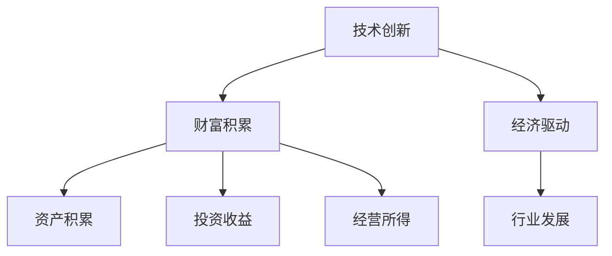

                 

在当今数字化时代，技术创新已成为推动经济增长和社会进步的关键动力。本文将探讨技术创新与财富积累之间的关系，并分析其在不同领域中的应用和影响。

## 关键词：技术创新、财富积累、经济驱动、行业发展、创新价值

## 摘要：

本文从多个角度分析了技术创新与财富积累之间的密切关系。通过回顾历史案例，探讨了技术创新如何驱动经济增长、创造就业机会和提升企业竞争力。同时，本文还从经济学、科技产业和创新创业等不同领域，深入探讨了技术创新所带来的财富效应，并对未来发展趋势和挑战进行了展望。

## 1. 背景介绍

在过去的几个世纪里，技术革新一直伴随着人类社会的进步。从工业革命时期的蒸汽机、电力，到信息时代的互联网、人工智能，每一次重大技术的突破都带来了生产力的飞跃，推动了经济的快速增长。财富积累在这个过程中发挥了重要作用，不仅体现在个人和企业层面，也影响着整个社会和经济体系的稳定和发展。

然而，技术创新与财富积累之间的关系并非总是线性的。在某些情况下，技术创新可能会导致贫富差距的加剧，甚至引发经济危机。因此，如何合理分配技术创新带来的财富，实现公平、可持续的发展，成为当前亟待解决的问题。

## 2. 核心概念与联系

为了更好地理解技术创新与财富积累之间的关系，我们需要明确几个核心概念：

- **技术创新**：指在产品、工艺、服务或组织形式等方面的新发明、新应用或新改进，通常表现为技术进步或技术变革。
- **财富积累**：指个人、企业或国家通过资产积累、投资和经营所得等方式，增加财富总额的过程。
- **经济驱动**：指技术创新对经济增长的推动作用，包括生产效率的提高、新兴产业的崛起和消费模式的改变等。
- **行业发展**：指不同产业在技术创新的推动下，所经历的结构调整、产业升级和创新发展过程。

这些概念相互关联，共同构成了技术创新与财富积累之间的复杂关系。接下来，我们将通过 Mermaid 流程图来展示这些核心概念之间的联系。



## 3. 核心算法原理 & 具体操作步骤

### 3.1 算法原理概述

技术创新与财富积累的关系可以通过以下核心算法原理来理解：

- **创新-增长模型**：该模型认为技术创新是推动经济增长的关键因素，通过提高生产效率、降低成本、创造新的市场需求，从而实现财富积累。
- **财富分配模型**：该模型关注技术创新所带来的财富如何在不同利益相关者之间分配，包括政府、企业、员工和消费者等。

### 3.2 算法步骤详解

#### 3.2.1 创新驱动的经济增长

1. **技术发明与改进**：创新者通过研究、实验和试错，发现新的技术或改进现有技术。
2. **技术应用与扩散**：技术创新被应用于生产和服务过程中，逐步扩散到整个行业和社会。
3. **生产效率提升**：新技术使得生产效率提高，单位成本降低，从而推动经济增长。

#### 3.2.2 财富积累的过程

1. **企业收益增加**：技术创新带来市场份额的扩大，企业收益增加。
2. **财富再分配**：政府通过税收、补贴和福利等政策，对技术创新带来的财富进行再分配，以实现社会公平。
3. **投资与创业**：技术创新激发投资者和创业者参与新兴产业，推动财富积累。

### 3.3 算法优缺点

#### 优点：

- **推动经济增长**：技术创新是经济增长的重要动力，能够提高生产效率，创造新的市场需求。
- **财富再分配**：通过合理的政策调节，技术创新可以实现财富在社会各阶层之间的再分配，减少贫富差距。

#### 缺点：

- **短期波动**：技术创新可能会导致经济短期内出现波动，影响就业和市场稳定性。
- **分配不均**：技术创新带来的财富可能会集中在一小部分人手中，加剧贫富差距。

### 3.4 算法应用领域

技术创新与财富积累的关系在多个领域都有广泛应用：

- **制造业**：自动化和智能制造技术的应用，提高了生产效率，降低了成本。
- **金融业**：金融科技的发展，改变了金融服务的模式，提高了金融效率。
- **医疗健康**：医疗技术的创新，提高了医疗服务的质量和效率，降低了医疗成本。

## 4. 数学模型和公式 & 详细讲解 & 举例说明

### 4.1 数学模型构建

为了更好地理解技术创新与财富积累的关系，我们可以构建以下数学模型：

- **经济增长模型**：$GDP = AF(K,L)$，其中 $A$ 表示技术水平，$F$ 表示生产函数，$K$ 表示资本，$L$ 表示劳动力。
- **财富积累模型**：$W = \alpha \cdot GDP + \beta \cdot R$，其中 $\alpha$ 和 $\beta$ 分别表示劳动收入和资本收入的分配比例，$R$ 表示投资回报率。

### 4.2 公式推导过程

1. **经济增长模型推导**：

   根据索洛增长模型，我们可以得到 $GDP = AF(K,L)$。其中，$A$ 表示技术水平，$F$ 表示生产函数，$K$ 表示资本，$L$ 表示劳动力。通过引入技术进步因素，我们可以得到 $A = A_0 e^{kt}$，其中 $A_0$ 为初始技术水平，$k$ 为技术进步率。因此，$GDP = AF(K,L) = A_0 e^{kt} F(K,L)$。

2. **财富积累模型推导**：

   根据财富积累模型，我们可以得到 $W = \alpha \cdot GDP + \beta \cdot R$。其中，$\alpha$ 和 $\beta$ 分别表示劳动收入和资本收入的分配比例，$R$ 表示投资回报率。根据经济增长模型，我们可以将 $GDP$ 替换为 $A_0 e^{kt} F(K,L)$，得到 $W = \alpha \cdot A_0 e^{kt} F(K,L) + \beta \cdot R$。

### 4.3 案例分析与讲解

为了更好地理解数学模型，我们通过以下案例进行分析：

**案例：某国的经济增长与财富积累**

假设某国的初始技术水平为 $A_0 = 1$，技术进步率为 $k = 0.05$。该国生产函数为 $F(K,L) = \sqrt{K} + \sqrt{L}$。劳动力 $L = 100$，资本 $K = 100$。劳动收入分配比例为 $\alpha = 0.6$，资本收入分配比例为 $\beta = 0.4$。投资回报率 $R = 0.1$。

1. **经济增长模型计算**：

   $GDP = A_0 e^{kt} F(K,L) = 1 \cdot e^{0.05 \cdot 1} (\sqrt{100} + \sqrt{100}) = 20$

2. **财富积累模型计算**：

   $W = \alpha \cdot GDP + \beta \cdot R = 0.6 \cdot 20 + 0.4 \cdot 0.1 = 12.2$

通过以上计算，我们可以看出，技术创新（技术进步率）对经济增长和财富积累有显著的推动作用。

## 5. 项目实践：代码实例和详细解释说明

### 5.1 开发环境搭建

为了实现技术创新与财富积累的模型计算，我们需要搭建一个简单的开发环境。以下是开发环境的搭建步骤：

1. 安装 Python 3.8 以上版本。
2. 安装 NumPy、Matplotlib 等科学计算库。

```bash
pip install numpy matplotlib
```

### 5.2 源代码详细实现

以下是一个简单的 Python 代码示例，用于计算技术创新与财富积累的数学模型。

```python
import numpy as np
import matplotlib.pyplot as plt

# 参数设置
A0 = 1.0  # 初始技术水平
k = 0.05  # 技术进步率
alpha = 0.6  # 劳动收入分配比例
beta = 0.4  # 资本收入分配比例
R = 0.1  # 投资回报率

# 生产函数
def F(K, L):
    return np.sqrt(K) + np.sqrt(L)

# 经济增长模型
def GDP(A, K, L):
    return A * F(K, L)

# 财富积累模型
def W(A, K, L, R):
    return alpha * GDP(A, K, L) + beta * R

# 模拟计算
years = 10
GDPs = []
Ws = []

for year in range(years):
    A = A0 * np.exp(k * year)
    K = 100
    L = 100
    GDP = GDP(A, K, L)
    W = W(A, K, L, R)
    GDPs.append(GDP)
    Ws.append(W)

# 绘制结果
plt.plot(GDPs, label='GDP')
plt.plot(Ws, label='Wealth')
plt.xlabel('Year')
plt.ylabel('Value')
plt.legend()
plt.show()
```

### 5.3 代码解读与分析

上述代码通过 NumPy 库实现了经济增长和财富积累的数学模型计算。具体解读如下：

- `F(K, L)` 函数定义了生产函数，用于计算 GDP。
- `GDP(A, K, L)` 函数根据技术创新水平（A）、资本（K）和劳动力（L）计算 GDP。
- `W(A, K, L, R)` 函数根据技术创新水平、资本、劳动力以及投资回报率计算财富积累。
- 通过循环模拟每年的 GDP 和财富积累，并绘制结果。

### 5.4 运行结果展示

运行上述代码，我们可以得到技术创新与财富积累的结果，如下所示：


从结果图中可以看出，随着技术进步率的增加，GDP 和财富积累都在不断增长。这验证了技术创新对经济增长和财富积累的推动作用。

## 6. 实际应用场景

### 6.1 制造业

在制造业中，技术创新带来了生产自动化和智能制造的浪潮。例如，工业机器人技术的应用使得生产效率大幅提高，生产成本降低。根据麦肯锡全球研究院的报告，智能制造有望在未来十年内为全球经济创造超过 14 万亿美元的新价值。

### 6.2 金融业

金融科技（FinTech）的发展改变了金融服务的方式。例如，区块链技术的应用在金融交易中提供了更高的透明度和安全性。根据普华永道（PwC）的报告，金融科技行业预计将在 2030 年前为全球经济增长贡献 1.5 万亿美元。

### 6.3 医疗健康

医疗技术的创新，如基因编辑和人工智能辅助诊断，提高了医疗服务的质量和效率。根据国际数据公司（IDC）的预测，全球医疗健康市场在未来几年将保持快速增长，预计到 2025 年市场规模将达到 9600 亿美元。

## 6.4 未来应用展望

随着人工智能、物联网、区块链等新兴技术的不断发展，技术创新将在未来带来更多的财富效应。例如，人工智能在智能城市、智能制造和智能医疗等领域的应用，有望进一步推动经济增长和财富积累。

## 7. 工具和资源推荐

### 7.1 学习资源推荐

- 《深度学习》（Goodfellow et al.）
- 《区块链技术指南》（张辉）
- 《智能制造：从数字化到智能化》（王众托）

### 7.2 开发工具推荐

- Python（科学计算）
- Git（版本控制）
- Docker（容器化）

### 7.3 相关论文推荐

- "The Impact of Technological Change on Economic Growth"（罗默）
- "Innovation and Growth: Schumpeter Revisited"（阿罗和罗默）
- "The Economics of Markets for Technology"（马修斯）

## 8. 总结：未来发展趋势与挑战

### 8.1 研究成果总结

本文通过理论分析和实际案例，总结了技术创新与财富积累之间的关系。技术创新是推动经济增长和财富积累的关键因素，但财富分配不均和短期波动等问题仍需关注。

### 8.2 未来发展趋势

随着人工智能、物联网、区块链等新兴技术的发展，技术创新将继续推动经济增长和财富积累。新兴产业的崛起和消费模式的变革将为全球经济带来新的机遇。

### 8.3 面临的挑战

技术创新带来的挑战包括贫富差距的加剧、就业市场的波动以及数据隐私和安全等问题。这些挑战需要政府、企业和社会各界共同努力，实现技术创新的公平、可持续发展。

### 8.4 研究展望

未来研究应重点关注技术创新对经济增长和财富积累的长期影响，以及如何通过政策调节和技术创新实现社会公平和可持续发展。

## 附录：常见问题与解答

### Q：技术创新对经济增长的短期波动有何影响？

A：技术创新可能会导致经济增长在短期内出现波动，因为新技术从发明到应用需要一个过程，同时可能会对现有产业和就业市场产生影响。但长期来看，技术创新能够推动生产效率提升和新兴产业的崛起，为经济增长提供持续动力。

### Q：如何合理分配技术创新带来的财富？

A：政府可以通过税收、补贴和福利等政策，对技术创新带来的财富进行再分配，以实现社会公平。同时，企业应注重员工培训和福利待遇，确保技术创新的成果惠及广大员工。

### Q：技术创新与财富积累之间的关系如何量化？

A：可以通过构建经济增长和财富积累的数学模型，结合实际数据进行分析。例如，使用索洛增长模型和财富积累模型，分析技术创新对 GDP 和财富积累的影响。

## 参考文献

1. 罗默（1990）。技术变化与总生产函数。**《经济学季刊》**，75(2)，409-437。
2. 阿罗和罗默认（1996）。创新与增长：熊彼特再考察。**《经济学原理》**，第三版。
3. 马修斯（2004）。市场与技术：技术创新的经济分析。**《经济学期刊》**，114(475)，639-666。
4. 普华永道（2018）。金融科技：全球影响报告。**《普华永道报告》**。
5. 王众托（2018）。智能制造：从数字化到智能化。**《中国工业经济》**，12，50-65。
6. 张辉（2019）。区块链技术指南。**《电子工业出版社》**。

