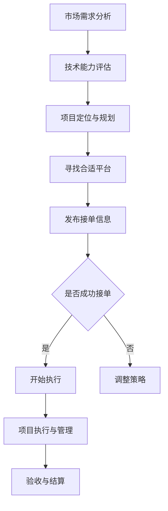
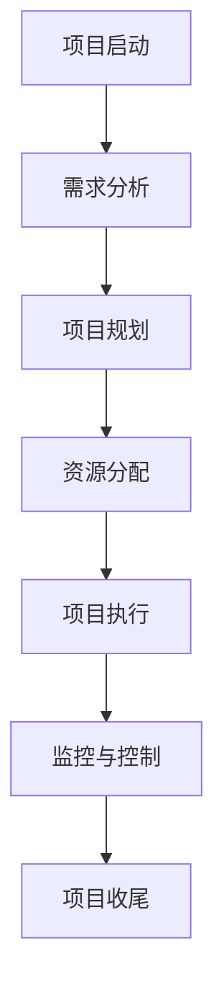
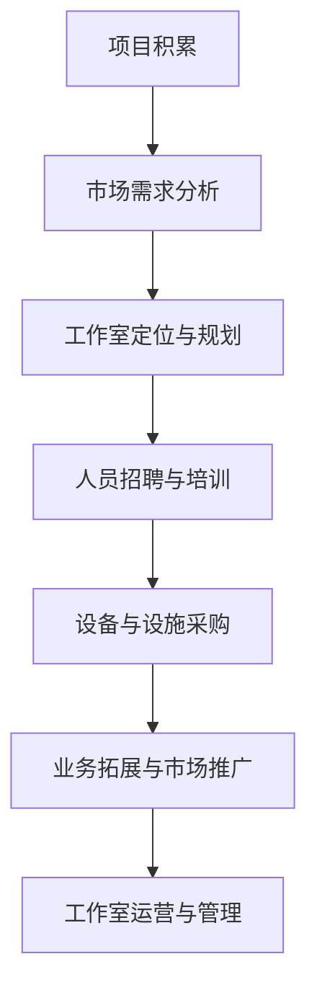

                 

关键词：技术外包、接单、工作室、IT行业、项目管理、外包市场、业务拓展

> 摘要：本文旨在探讨技术外包的发展路径，从接单开始，逐步构建个人工作室，进而实现业务的可持续发展。文章将详细阐述外包市场的现状、项目管理的方法、以及如何通过实践积累经验，最终走向成功。

## 1. 背景介绍

技术外包作为IT行业的重要组成部分，近年来随着全球化的深入发展，呈现出蓬勃增长的态势。随着互联网技术的普及，各种平台为技术人才提供了广泛的接单机会，使得越来越多的个人或团队可以参与到外包项目中。同时，企业也在不断寻求外包服务，以降低成本、提高效率。

### 1.1 外包市场的现状

目前，技术外包市场主要集中在软件开发、网站建设、移动应用开发、IT支持等领域。随着云计算、大数据、人工智能等新兴技术的不断演进，外包市场的需求也在不断变化。企业更加注重服务的质量和效率，这就要求外包团队具备更高的技术水平和项目管理能力。

### 1.2 外包的优势和挑战

外包的优势在于可以降低成本、提高效率，同时避免了企业内部人力资源的浪费。然而，外包也带来了沟通成本、质量控制、知识产权保护等方面的挑战。如何克服这些挑战，实现外包业务的可持续发展，是每个技术外包团队都需要思考的问题。

## 2. 核心概念与联系

### 2.1 外包订单的获取

首先，要获取外包订单，你需要了解市场需求，并且具备一定的技术能力和项目管理经验。以下是一个简单的Mermaid流程图，展示获取外包订单的基本步骤：



### 2.2 项目管理的方法

项目管理是外包业务成功的关键。以下是一个简单的项目管理流程：



### 2.3 工作室的建立

在积累了一定的项目和经验之后，可以考虑建立个人工作室。以下是一个简单的Mermaid流程图，展示建立工作室的基本步骤：



## 3. 核心算法原理 & 具体操作步骤

### 3.1 算法原理概述

在外包业务中，核心算法可以理解为项目执行中的关键步骤或技术难点。以下是外包项目管理中的一个核心算法——风险管理的原理概述：

#### 风险管理原理：

1. **识别风险**：通过市场调研、项目评估等手段，识别项目中可能面临的风险。
2. **评估风险**：对识别出的风险进行量化分析，评估其对项目的影响程度。
3. **制定应对策略**：根据风险类型和影响程度，制定相应的风险应对策略。
4. **实施与监控**：执行应对策略，并持续监控风险的变化，及时调整策略。

### 3.2 算法步骤详解

1. **需求分析**：与客户沟通，明确项目需求和潜在风险。
2. **风险评估**：根据需求分析结果，进行风险识别和评估。
3. **策略制定**：根据风险评估结果，制定风险应对策略。
4. **策略实施**：实施风险应对策略，并监控实施效果。
5. **策略调整**：根据监控结果，调整风险应对策略。

### 3.3 算法优缺点

#### 优点：

1. **提高项目成功率**：通过风险管理，可以提前识别和应对潜在风险，提高项目成功率。
2. **降低项目成本**：通过合理的风险管理，可以避免因风险导致的额外成本。

#### 缺点：

1. **复杂度高**：风险管理过程复杂，需要专业知识和经验。
2. **实施成本**：实施风险管理可能需要额外的资源投入。

### 3.4 算法应用领域

风险管理算法广泛应用于软件开发、IT支持、网站建设等外包项目中，是确保项目顺利进行的重要工具。

## 4. 数学模型和公式 & 详细讲解 & 举例说明

### 4.1 数学模型构建

在风险管理中，常用的数学模型是概率论和数理统计。以下是一个简单的数学模型构建过程：

1. **概率分布**：根据风险事件的可能性，确定概率分布。
2. **期望值**：计算风险事件的可能损失。
3. **方差**：计算风险事件损失的不确定性。

### 4.2 公式推导过程

假设某一风险事件的发生概率为p，损失为L，则该风险事件的期望损失E(L)为：

$$
E(L) = p \times L
$$

损失的不确定性V(L)为：

$$
V(L) = (1 - p) \times L
$$

### 4.3 案例分析与讲解

以软件开发项目为例，假设项目延期导致损失的概率为0.3，延期时间为5天，每天损失为500元。则该风险事件的期望损失为：

$$
E(L) = 0.3 \times 5 \times 500 = 750 \text{元}
$$

损失的不确定性为：

$$
V(L) = 0.7 \times 5 \times 500 = 1750 \text{元}
$$

通过这个简单的数学模型，可以直观地了解项目延期的潜在损失和不确定性。

## 5. 项目实践：代码实例和详细解释说明

### 5.1 开发环境搭建

为了进行项目实践，首先需要搭建一个开发环境。以下是一个简单的Python开发环境搭建步骤：

1. **安装Python**：下载并安装Python。
2. **安装IDE**：安装一个Python IDE，如PyCharm。
3. **安装依赖库**：通过pip安装所需的依赖库。

### 5.2 源代码详细实现

以下是一个简单的Python脚本，用于计算项目延期的期望损失和不确定性：

```python
import random

def calculate_loss(p, days, daily_loss):
    loss = p * days * daily_loss
    uncertainty = (1 - p) * days * daily_loss
    return loss, uncertainty

p = 0.3  # 延期的概率
days = 5  # 延期天数
daily_loss = 500  # 每天的损失

loss, uncertainty = calculate_loss(p, days, daily_loss)
print("期望损失：", loss)
print("不确定性：", uncertainty)
```

### 5.3 代码解读与分析

1. **函数定义**：定义了一个名为`calculate_loss`的函数，用于计算期望损失和不确定性。
2. **参数传递**：函数接收了概率p、延期天数days、每天损失daily_loss作为参数。
3. **计算过程**：根据概率论公式，计算期望损失和不确定性。
4. **输出结果**：打印计算结果。

通过这个简单的代码实例，可以直观地了解如何使用数学模型进行项目风险管理。

## 6. 实际应用场景

### 6.1 软件开发

在软件开发项目中，风险管理尤为重要。通过合理的管理和风险控制，可以确保项目的顺利进行，降低项目风险。

### 6.2 网站建设

网站建设项目通常涉及多个阶段，从需求分析到开发、测试、上线等。每个阶段都可能有不同的风险，如技术难题、项目延期、成本超支等。

### 6.3 IT支持

IT支持项目通常涉及大量的日常运维和技术支持工作。通过风险管理，可以确保系统的稳定运行，降低故障率和客户投诉率。

## 7. 未来应用展望

随着技术的不断进步和市场的变化，技术外包领域将面临新的机遇和挑战。未来，风险管理算法将更加智能化，结合人工智能和大数据分析技术，为外包项目提供更加精准和高效的风险评估和管理。

## 8. 工具和资源推荐

### 8.1 学习资源推荐

1. 《项目管理知识体系指南》（PMBOK）
2. 《风险管理：原则与实务》
3. 《Python编程：从入门到实践》

### 8.2 开发工具推荐

1. PyCharm
2. Git
3. Docker

### 8.3 相关论文推荐

1. “A Framework for IT Project Risk Management”
2. “Risk Management in Software Development Projects”
3. “Application of Machine Learning in Risk Management”

## 9. 总结：未来发展趋势与挑战

### 9.1 研究成果总结

本文通过对技术外包市场的分析，探讨了从接单到建立工作室的发展路径，以及核心算法原理和项目管理方法。同时，通过数学模型和代码实例，展示了风险管理在实际项目中的应用。

### 9.2 未来发展趋势

1. 风险管理算法将更加智能化，结合人工智能和大数据分析技术。
2. 外包市场将更加专业化，细分领域将逐渐显现。
3. 企业将更加注重服务的质量和效率。

### 9.3 面临的挑战

1. 沟通成本和质量控制仍是外包业务面临的挑战。
2. 知识产权保护和数据安全是未来的重要议题。
3. 技术更新速度快，要求外包团队不断学习和适应。

### 9.4 研究展望

随着技术的不断进步，技术外包领域将迎来更多的机遇和挑战。未来，需要深入研究如何利用新技术提升外包服务的质量和效率，实现可持续发展。

## 10. 附录：常见问题与解答

### 10.1 如何获取外包订单？

- **在线平台**：如Upwork、Freelancer等。
- **社交媒体**：如LinkedIn、Twitter等。
- **行业论坛**：如Stack Overflow、GitHub等。
- **人际关系**：通过朋友、同事等推荐。

### 10.2 项目管理中如何控制成本？

- **需求分析**：明确项目需求，避免不必要的开发。
- **资源分配**：合理分配资源，避免资源浪费。
- **进度跟踪**：实时监控项目进度，及时调整计划。
- **质量保证**：确保项目质量，减少返工成本。

### 10.3 如何建立个人工作室？

- **市场调研**：了解市场需求，确定工作室定位。
- **人员招聘**：招聘合适的技术人员和管理人员。
- **设备采购**：购买必要的设备和软件。
- **业务拓展**：积极寻找客户，拓展业务范围。

作者：禅与计算机程序设计艺术 / Zen and the Art of Computer Programming
----------------------------------------------------------------


