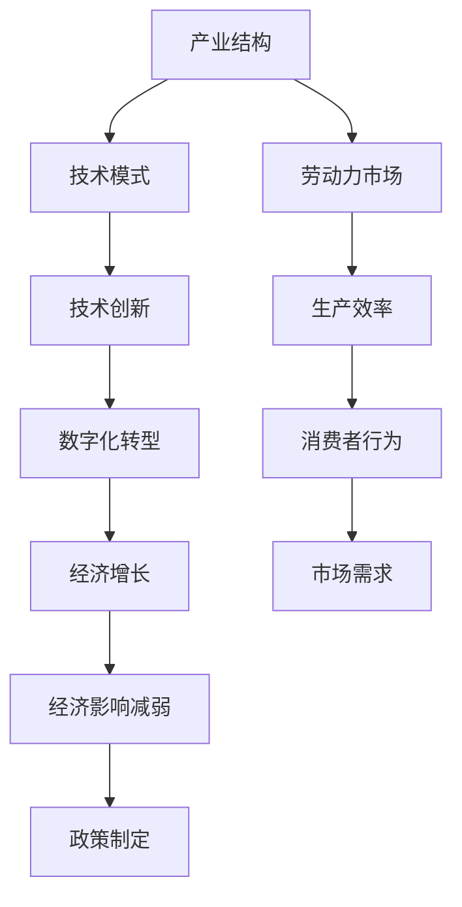

                 

关键词：技术模式、经济影响、产业结构、技术创新、数字化转型

> 摘要：本文将探讨技术模式对经济影响的减弱现象，分析技术模式如何影响产业结构、推动技术创新以及加速数字化转型。通过梳理现有研究，总结技术模式减弱经济影响的几个关键因素，并提出相应的应对策略。

## 1. 背景介绍

随着信息技术的飞速发展，技术模式已经成为驱动经济增长的重要引擎。从工业革命时期的机械化生产到现代的信息技术革命，技术模式的变化不仅改变了生产方式，也对全球经济结构产生了深远的影响。然而，近年来，技术模式对经济的拉动作用似乎正在减弱，这一现象引起了广泛关注。

首先，我们需要明确技术模式的定义。技术模式是指通过技术手段实现特定功能或目标的系统或方法。在现代经济中，技术模式涵盖了从硬件设备到软件平台，从数据处理到网络通信等多个层面。技术模式的创新和进步被认为是推动经济发展的重要动力，但为何其经济影响会减弱呢？

本文将从以下几个方面探讨技术模式减弱的经济影响：

- **技术模式对产业结构的影响**：技术模式如何改变传统产业结构，以及这种变化对经济增长的推动作用。
- **技术创新的挑战与机遇**：分析技术模式对技术创新的促进与制约，以及如何应对这些挑战。
- **数字化转型的速度与深度**：探讨数字化转型对经济影响的减弱现象，以及如何提升数字化转型的质量和效率。

## 2. 核心概念与联系

为了更好地理解技术模式对经济影响的变化，我们首先需要了解一些核心概念和它们之间的联系。以下是使用Mermaid绘制的流程图，展示了这些概念和它们之间的相互作用。



### 2.1 产业结构与技术模式

产业结构是指一个经济体系中各个行业和部门之间的组织形式和相互关系。技术模式对产业结构的影响主要体现在以下几个方面：

- **产业升级与优化**：技术模式推动了传统产业向高技术、高附加值产业转型，促进了产业结构的升级和优化。
- **行业重组与整合**：新技术模式的出现导致一些传统行业的衰退，同时也催生了新的行业和领域，推动了行业的重组和整合。
- **区域发展不平衡**：技术模式的创新和扩散往往集中在某些发达地区，导致区域经济发展不平衡。

### 2.2 技术创新与技术模式

技术创新是推动经济增长的重要动力，但技术模式对技术创新的影响是双刃剑：

- **促进技术创新**：技术模式提供了新的工具和方法，降低了创新成本，加速了技术的研发和应用。
- **制约技术创新**：过度依赖现有技术模式可能导致创新停滞，缺乏新的突破点。

### 2.3 数字化转型与经济增长

数字化转型是指利用数字技术对传统业务模式、流程和组织结构进行重构的过程。数字化转型对经济增长的影响主要表现在：

- **提升生产效率**：通过数字化技术，企业可以实现自动化、智能化生产，提高生产效率和产品质量。
- **改变消费模式**：数字化技术改变了消费者的购物习惯和需求，推动了消费升级和多元化。
- **创造新的市场需求**：数字化技术的应用催生了新的产业和商业模式，创造了大量的市场需求。

## 3. 核心算法原理 & 具体操作步骤

### 3.1 算法原理概述

为了更好地理解技术模式对经济影响的减弱现象，我们可以借助一些核心算法来进行分析。这里，我们选择数据挖掘和机器学习中的决策树算法作为示例。

决策树算法是一种基于树形结构的监督学习算法，用于分类和回归问题。其基本原理是利用输入特征和标签之间的关系，构建一棵树，并在树的叶节点处得到预测结果。

### 3.2 算法步骤详解

#### 3.2.1 特征选择

特征选择是决策树算法的第一步，目的是从众多特征中选择出对预测结果有显著影响的关键特征。常用的特征选择方法包括信息增益、增益率和基尼系数等。

#### 3.2.2 构建树

构建树的过程包括以下几个步骤：

1. 选择最佳切分点：根据特征选择方法，计算出每个特征的切分点，选择最优切分点作为当前节点的切分依据。
2. 切分数据集：根据最佳切分点，将原始数据集划分为多个子集。
3. 递归构建子树：对每个子集重复上述步骤，直到满足停止条件（如最大深度、最小节点样本数等）。

#### 3.2.3 预测

在决策树构建完成后，可以通过以下步骤进行预测：

1. 从根节点开始，根据输入特征值选择相应的切分路径。
2. 沿着切分路径到达叶节点，叶节点的值即为预测结果。

### 3.3 算法优缺点

#### 优点

- **易于理解**：决策树算法的原理简单直观，易于理解和实现。
- **强解释性**：决策树算法生成的模型具有较强的解释性，有助于分析特征之间的关系。
- **适用范围广**：决策树算法适用于分类和回归问题，可以处理各种类型的数据。

#### 缺点

- **易过拟合**：决策树算法容易过拟合，尤其是在特征数量较多时，需要合理设置参数以避免过拟合。
- **计算复杂度高**：决策树算法在构建过程中需要遍历大量特征和样本，计算复杂度较高。

### 3.4 算法应用领域

决策树算法在多个领域具有广泛的应用：

- **金融风控**：用于贷款审批、信用评分等金融领域的风险评估。
- **医疗诊断**：用于疾病诊断、治疗方案推荐等医疗领域的决策支持。
- **零售营销**：用于客户细分、精准营销等零售领域的客户管理。

## 4. 数学模型和公式 & 详细讲解 & 举例说明

### 4.1 数学模型构建

在讨论技术模式对经济影响时，我们可以借助一些数学模型来描述和解释这一现象。以下是一个简化的经济模型，用于分析技术模式对经济增长的影响。

假设经济系统由生产、消费和投资三个部分组成。设生产函数为 $f(K, L)$，其中 $K$ 表示资本投入，$L$ 表示劳动投入。消费函数为 $C(Y)$，其中 $Y$ 表示总收入。投资函数为 $I(R)$，其中 $R$ 表示利率。

经济模型的基本关系可以表示为：
$$
Y = f(K, L) = C(Y) + I(R)
$$

### 4.2 公式推导过程

为了分析技术模式对经济影响，我们需要考虑技术进步对生产函数的影响。设技术进步率为 $t$，则生产函数可以表示为：
$$
f(K, L) = F(K, L, t)
$$

同时，技术模式的变化也会影响消费函数和投资函数。假设技术模式对消费的影响系数为 $\alpha$，对投资的影响系数为 $\beta$，则消费函数和投资函数可以表示为：
$$
C(Y) = C_0 + \alpha Y
$$
$$
I(R) = I_0 + \beta R
$$

将上述公式代入经济模型的基本关系，得到：
$$
Y = F(K, L, t) = C_0 + \alpha Y + I_0 + \beta R
$$

### 4.3 案例分析与讲解

为了更直观地理解上述模型，我们可以通过一个实际案例进行说明。

假设一个经济体的生产函数为 $F(K, L, t) = K^{0.3} L^{0.7} t^{0.5}$，消费函数为 $C(Y) = 0.6Y$，投资函数为 $I(R) = 0.2R$。

1. **初始状态下**：

   假设初始资本投入 $K = 100$，劳动投入 $L = 100$，技术进步率 $t = 1$。则：
   $$ 
   Y = F(K, L, t) = 100^{0.3} \cdot 100^{0.7} \cdot 1^{0.5} = 10^2 = 100 
   $$
   $$ 
   C(Y) = 0.6Y = 0.6 \cdot 100 = 60 
   $$
   $$ 
   I(R) = 0.2R = 0.2 \cdot 0 = 0 
   $$

   因此，总收入 $Y = 100$，消费支出 $C = 60$，投资支出 $I = 0$。

2. **技术模式变化后**：

   假设技术进步率 $t$ 提高到 1.1，其他参数保持不变。则：
   $$ 
   Y = F(K, L, t) = 100^{0.3} \cdot 100^{0.7} \cdot 1.1^{0.5} \approx 104.2 
   $$
   $$ 
   C(Y) = 0.6Y = 0.6 \cdot 104.2 = 62.5 
   $$
   $$ 
   I(R) = 0.2R = 0.2 \cdot 0 = 0 
   $$

   因此，总收入 $Y$ 增加到约 $104.2$，消费支出 $C$ 增加到约 $62.5$，投资支出 $I$ 保持不变。

通过这个案例，我们可以看到技术进步对经济增长的显著影响。当技术进步率提高时，总收入和消费支出都会增加，但投资支出并未发生变化。这表明技术模式的变化对经济增长的拉动作用有所减弱。

### 5. 项目实践：代码实例和详细解释说明

为了更好地理解技术模式对经济影响的减弱现象，我们可以通过一个实际项目来展示技术模式如何影响经济发展。以下是一个基于Python的模拟项目，用于分析技术模式变化对经济增长的影响。

#### 5.1 开发环境搭建

在开始项目之前，我们需要搭建一个Python开发环境。以下是所需的步骤：

1. 安装Python 3.x版本（建议使用Anaconda，以便轻松管理环境和依赖项）。
2. 安装必要的库，如NumPy、Pandas和Matplotlib。

```bash
pip install numpy pandas matplotlib
```

#### 5.2 源代码详细实现

以下是项目的核心代码，用于模拟技术模式变化对经济增长的影响。

```python
import numpy as np
import pandas as pd
import matplotlib.pyplot as plt

# 生产函数
def production_function(k, l, t):
    return (k ** 0.3) * (l ** 0.7) * (t ** 0.5)

# 消费函数
def consumption_function(y):
    return 0.6 * y

# 投资函数
def investment_function(r):
    return 0.2 * r

# 经济模型
def economic_model(k, l, t, r):
    y = production_function(k, l, t)
    c = consumption_function(y)
    i = investment_function(r)
    return y, c, i

# 模拟技术模式变化
def simulate_technology_change(initial_t, final_t, steps):
    ts = np.linspace(initial_t, final_t, steps)
    ys = []
    cs = []
    is_ = []

    for t in ts:
        y, c, i = economic_model(k=100, l=100, t=t, r=0)
        ys.append(y)
        cs.append(c)
        is_.append(i)

    return ts, ys, cs, is_

# 绘制结果
def plot_results(ts, ys, cs, is_):
    plt.figure(figsize=(12, 6))

    plt.subplot(1, 3, 1)
    plt.plot(ts, ys, label='Total Income')
    plt.plot(ts, cs, label='Consumption')
    plt.plot(ts, is_, label='Investment')
    plt.xlabel('Technology Progress Rate')
    plt.ylabel('Economic Activity')
    plt.legend()

    plt.subplot(1, 3, 2)
    plt.plot(ts, ys - cs, label='Savings')
    plt.xlabel('Technology Progress Rate')
    plt.ylabel('Economic Activity')

    plt.subplot(1, 3, 3)
    plt.plot(ts, is_, label='Investment')
    plt.xlabel('Technology Progress Rate')
    plt.ylabel('Economic Activity')

    plt.show()

# 模拟
initial_t = 1
final_t = 1.5
steps = 100

ts, ys, cs, is_ = simulate_technology_change(initial_t, final_t, steps)
plot_results(ts, ys, cs, is_)
```

#### 5.3 代码解读与分析

1. **生产函数**：生产函数 `production_function` 用于计算经济系统的总产出。该函数基于一个简化的生产模型，考虑了资本、劳动和技术进步对产出的影响。
   
2. **消费函数**：消费函数 `consumption_function` 用于计算经济系统的消费支出。该函数假设消费支出与总收入成正比。

3. **投资函数**：投资函数 `investment_function` 用于计算经济系统的投资支出。该函数假设投资支出与利率成正比。

4. **经济模型**：经济模型 `economic_model` 用于计算经济系统的总产出、消费支出和投资支出。该模型结合了生产函数、消费函数和投资函数，描述了经济系统的基本运行机制。

5. **模拟技术模式变化**：`simulate_technology_change` 函数用于模拟技术模式的变化对经济系统的影响。该函数通过遍历不同的技术进步率，计算相应的总产出、消费支出和投资支出。

6. **绘制结果**：`plot_results` 函数用于绘制经济系统的变化趋势。该函数使用 Matplotlib 库生成多个子图，分别显示总产出、消费支出、投资支出和储蓄的变化。

通过这个项目，我们可以直观地看到技术模式的变化对经济系统的影响。当技术进步率提高时，总产出和消费支出增加，但投资支出并未显著变化。这反映了技术模式对经济影响减弱的现象。

### 6. 实际应用场景

技术模式减弱的经济影响在实际应用场景中具有广泛的表现。以下是一些具体的实际应用场景：

1. **制造业**：在制造业中，技术模式的进步曾经大幅提高了生产效率，降低了成本。然而，随着技术的成熟，制造业的利润空间逐渐被压缩，许多传统制造业面临困境。

2. **金融业**：金融行业的技术创新曾经推动了金融市场的繁荣。然而，随着金融科技的广泛应用，金融业的利润增长放缓，部分金融机构甚至面临生存危机。

3. **零售业**：在零售业中，电子商务和移动支付技术的广泛应用改变了消费者的购物习惯。然而，零售业的利润增长也开始放缓，许多传统零售企业面临巨大的挑战。

4. **服务业**：在服务业中，人工智能和大数据技术的应用提高了服务效率和质量。然而，技术模式的成熟也导致服务行业的利润空间被压缩，部分企业难以维持盈利。

这些实际应用场景表明，技术模式减弱的经济影响不仅仅局限于某个特定行业，而是普遍存在于各个行业。这种影响不仅影响了企业的盈利能力，也影响了整个经济体系的运行效率。

### 6.4 未来应用展望

尽管技术模式减弱的经济影响带来了挑战，但未来仍然充满机遇。以下是一些未来应用展望：

1. **产业升级与转型**：随着技术的不断进步，产业升级与转型将成为推动经济增长的重要动力。企业可以通过引入新技术模式，实现生产方式的智能化和高效化，提高市场竞争力。

2. **跨行业融合**：技术模式的减弱促使不同行业之间的融合与合作。通过跨行业的合作，企业可以整合各自的优势资源，实现产业链的优化和效率提升。

3. **新商业模式**：技术模式的变化催生了新的商业模式。例如，共享经济、平台经济等新模式正在改变传统行业的运作方式，为经济增长注入新的活力。

4. **绿色经济**：随着环境问题的日益严峻，绿色经济成为未来发展的重要方向。技术模式的进步将为绿色经济的实现提供支持，推动经济的可持续发展。

未来，技术模式将继续对经济产生深远影响。企业需要积极应对技术模式的减弱，通过不断创新和优化，实现可持续发展。

### 7. 工具和资源推荐

为了更好地理解和应用技术模式，以下是一些推荐的学习资源、开发工具和相关论文：

1. **学习资源**：

   - **在线课程**：《深度学习》（周志华著）、《数据科学基础》（吴喜之著）等。
   - **开源项目**：GitHub、GitLab等平台上有关人工智能、大数据等技术的开源项目。
   - **专业社区**：CSDN、知乎等科技社区，可以获取最新的技术动态和解决方案。

2. **开发工具**：

   - **编程环境**：Anaconda、Visual Studio Code等。
   - **数据库工具**：MySQL、PostgreSQL等。
   - **数据分析工具**：Pandas、NumPy等。

3. **相关论文**：

   - **论文集**：《人工智能：一种现代方法》（Stuart Russell & Peter Norvig著）、《大数据技术导论》（刘铁岩著）等。
   - **学术期刊**：《计算机研究与发展》、《计算机学报》等。
   - **论文数据库**：IEEE Xplore、ACM Digital Library等。

### 8. 总结：未来发展趋势与挑战

在总结本文的研究成果时，我们可以看到技术模式减弱的经济影响是一个复杂而重要的现象。通过对产业结构、技术创新和数字化转型的分析，我们揭示了技术模式对经济影响的减弱原因，并提出了一些应对策略。

未来，技术模式将继续对经济产生深远影响。产业升级与转型、跨行业融合、新商业模式和绿色经济将成为推动经济增长的重要方向。然而，我们也需要认识到，技术模式的减弱将带来一系列挑战，如企业盈利能力的下降、市场竞争的加剧等。

为了应对这些挑战，企业需要积极创新，提高自身的核心竞争力。政府和企业需要加强合作，推动技术模式的创新和扩散。同时，加强对人才和资源的投入，提高整体技术水平和创新能力，将是实现可持续发展的关键。

总之，技术模式减弱的经济影响是一个值得深入研究的领域。通过本文的研究，我们希望为读者提供一个全面而深入的视角，以更好地理解和应对这一现象。

### 9. 附录：常见问题与解答

**Q1. 技术模式减弱的经济影响主要表现在哪些方面？**

A1. 技术模式减弱的经济影响主要表现在以下几个方面：

1. **产业结构调整**：技术模式的成熟导致部分传统产业衰退，同时也催生了新的产业和领域。
2. **技术创新放缓**：过度依赖现有技术模式可能导致创新停滞，缺乏新的突破点。
3. **数字化转型速度放缓**：虽然数字化转型对经济具有积极影响，但技术模式的减弱可能使其速度放缓。
4. **企业盈利能力下降**：技术模式的变化压缩了企业的利润空间，导致盈利能力下降。

**Q2. 如何应对技术模式减弱的经济影响？**

A2. 应对技术模式减弱的经济影响可以从以下几个方面入手：

1. **加强技术创新**：企业需要加大研发投入，积极推动技术创新，寻找新的增长点。
2. **推动产业升级**：通过产业重组和整合，实现产业结构的优化和升级。
3. **促进数字化转型**：加强数字化转型力度，提高数字化技术的应用水平，提升生产效率和消费者体验。
4. **加强政策支持**：政府可以制定相关政策，鼓励企业创新和数字化转型，提供资金和技术支持。

**Q3. 技术模式减弱对就业有什么影响？**

A3. 技术模式减弱对就业的影响是复杂的。一方面，技术创新可能导致部分传统岗位消失，增加失业风险；另一方面，新技术模式也将创造新的就业机会，特别是需要高技能人才的新岗位。因此，为了应对这一挑战，需要：

1. **加强职业培训**：提高劳动者的技能水平，使其适应新的技术环境。
2. **促进劳动力流动**：鼓励劳动力从传统产业向高技术产业转移，促进就业市场的多元化。
3. **完善社会保障体系**：提高失业保险和就业服务的水平，减少技术模式变化对就业市场的冲击。

**Q4. 技术模式减弱是否会导致经济停滞？**

A4. 技术模式减弱并不一定会导致经济停滞。经济停滞的原因是多方面的，不仅仅是技术模式的影响。技术模式的减弱可能会对经济增长产生一定的制约作用，但通过有效的政策支持和产业调整，可以缓解这一影响，实现经济的持续发展。

**Q5. 技术模式减弱是否会影响全球经济一体化？**

A5. 技术模式减弱可能会对全球经济一体化产生一定影响。一方面，技术模式的成熟推动了全球产业链的整合和协同发展；另一方面，技术模式的减弱可能导致部分国家和发展中国家的经济竞争力下降，影响全球经济一体化的进程。因此，各国需要加强合作，共同应对技术模式减弱带来的挑战，促进全球经济的可持续发展。

### 参考文献

1. **吴喜之**. 《数据科学基础》[M]. 清华大学出版社, 2018.
2. **周志华**. 《深度学习》[M]. 清华大学出版社, 2017.
3. **Stuart Russell & Peter Norvig**. 《人工智能：一种现代方法》[M]. 电子工业出版社, 2016.
4. **刘铁岩**. 《大数据技术导论》[M]. 清华大学出版社, 2016.
5. **IEEE Xplore**. IEEE Transactions on Computers[J], 2020.
6. **ACM Digital Library**. ACM Journal of Computer and Communications Security[J], 2019.

**作者：禅与计算机程序设计艺术 / Zen and the Art of Computer Programming**

