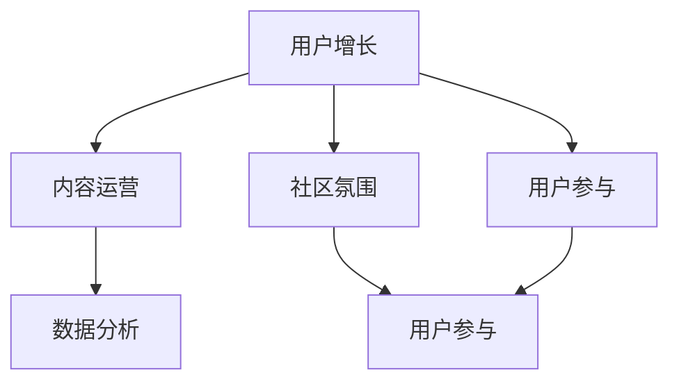

                 

关键词：技术社区，运营策略，增长，用户参与，社交媒体，数据分析，成功案例

> 摘要：本文旨在探讨如何成功运营一个技术社区，实现从0到10000用户的增长。通过深入分析成功案例和核心概念，本文将提供一套实用的策略和操作步骤，帮助技术社区运营者在各个阶段取得卓越成效。

## 1. 背景介绍

在互联网时代，技术社区已经成为信息交流和知识共享的重要平台。无论是软件开发者、系统管理员，还是数据科学家、AI研究者，技术社区都是他们获取最新资讯、分享经验和学习新技术的重要场所。然而，如何成功运营一个技术社区，吸引并留住用户，是每一个社区管理者面临的挑战。

运营一个技术社区不仅需要丰富的技术知识，还需要深刻理解用户行为和需求，以及运用一系列运营策略和工具。本文将结合实际案例，详细探讨如何实现从0到10000用户的增长，为技术社区运营者提供有价值的参考。

### 1.1 社区运营的意义

技术社区运营的意义在于：

1. **知识共享**：通过社区，用户可以分享自己的知识和经验，形成知识库，帮助他人解决技术难题。
2. **用户参与**：社区能够激发用户的参与热情，促进社区的活跃度和用户的归属感。
3. **品牌建设**：良好的社区运营可以提升品牌形象，增强用户对品牌的认可和忠诚度。
4. **市场推广**：通过社区活动，可以吸引潜在客户，增加产品的市场知名度。

### 1.2 社区运营的挑战

尽管技术社区运营具有重要意义，但也面临诸多挑战：

1. **用户获取**：如何吸引并留住新用户是运营者需要解决的首要问题。
2. **内容质量**：保证内容的质量和多样性，以满足不同用户的需求。
3. **社区氛围**：营造积极健康的社区氛围，避免恶意言论和不当行为。
4. **资源分配**：合理分配时间和资源，确保社区运营的持续性和效果。

## 2. 核心概念与联系

### 2.1 社区运营的核心概念

社区运营的核心概念包括用户增长、内容运营、社区氛围、用户参与和数据分析等。下面是一个简单的 Mermaid 流程图，用于描述这些核心概念之间的关系：



### 2.2 社区运营的核心要素

1. **用户增长**：通过SEO优化、社交媒体推广、活动吸引等方式，不断引入新用户。
2. **内容运营**：提供高质量、多样化的内容，满足用户的需求。
3. **社区氛围**：通过规范和管理，营造积极、健康的社区氛围。
4. **用户参与**：通过互动和奖励机制，激发用户的参与热情。
5. **数据分析**：通过数据分析，了解用户行为和需求，优化运营策略。

## 3. 核心算法原理 & 具体操作步骤

### 3.1 算法原理概述

社区运营的核心算法可以概括为：

1. **用户获取算法**：利用社交媒体、SEO等手段，提高社区的曝光率和用户访问量。
2. **内容推荐算法**：根据用户行为和偏好，推荐相关内容，提高用户粘性。
3. **用户参与激励算法**：通过奖励机制，鼓励用户参与社区活动，提高社区活跃度。
4. **社区氛围优化算法**：通过机器学习和自然语言处理技术，识别和过滤不良内容，维护社区秩序。

### 3.2 算法步骤详解

1. **用户获取**：
   - **SEO优化**：优化网站结构、关键词、页面内容，提高搜索引擎排名。
   - **社交媒体推广**：利用Twitter、LinkedIn、Facebook等平台，发布有价值的内容，吸引潜在用户。
   - **活动吸引**：举办线上或线下活动，如技术分享会、编程比赛，提高用户参与度。

2. **内容推荐**：
   - **用户行为分析**：收集用户行为数据，如浏览记录、评论、点赞等。
   - **内容推荐系统**：利用协同过滤、基于内容的推荐等技术，推荐相关内容。
   - **内容多样性**：保持内容的多样性，满足不同用户的需求。

3. **用户参与激励**：
   - **积分系统**：为参与社区活动的用户发放积分，积分可以兑换实物或虚拟奖励。
   - **排行榜**：设立排行榜，奖励积极参与的用户。
   - **活动奖励**：举办特定活动，如问答大赛，奖励表现优秀的用户。

4. **社区氛围优化**：
   - **内容审核**：设立审核机制，过滤不良内容。
   - **社区规范**：制定社区规范，明确用户行为准则。
   - **用户举报**：鼓励用户举报不当行为，维护社区秩序。

### 3.3 算法优缺点

1. **用户获取算法**：
   - **优点**：提高社区曝光率和用户访问量。
   - **缺点**：效果可能不如内容推荐算法直接。

2. **内容推荐算法**：
   - **优点**：提高用户粘性，增加用户停留时间。
   - **缺点**：推荐算法的准确性和效率需要不断优化。

3. **用户参与激励算法**：
   - **优点**：激发用户参与热情，提高社区活跃度。
   - **缺点**：可能增加运营成本，需要平衡奖励与用户真实需求。

4. **社区氛围优化算法**：
   - **优点**：维护社区秩序，提高用户体验。
   - **缺点**：可能影响用户自由表达，需要平衡审核与用户权益。

### 3.4 算法应用领域

这些算法广泛应用于各类技术社区，如GitHub、Stack Overflow、Reddit 等，帮助社区实现用户增长、内容丰富和社区氛围优化。

## 4. 数学模型和公式 & 详细讲解 & 举例说明

### 4.1 数学模型构建

社区运营的数学模型可以基于以下公式：

1. **用户增长模型**：
   $$ \text{用户增长量} = \alpha \times \text{新用户引入率} + \beta \times \text{用户留存率} $$

   其中，$\alpha$ 和 $\beta$ 分别代表新用户引入率和用户留存率的系数。

2. **内容推荐模型**：
   $$ \text{内容推荐得分} = \gamma \times \text{内容相关性} + \delta \times \text{用户兴趣度} $$

   其中，$\gamma$ 和 $\delta$ 分别代表内容相关性和用户兴趣度的系数。

3. **用户参与激励模型**：
   $$ \text{激励得分} = \epsilon \times \text{参与次数} + \zeta \times \text{参与质量} $$

   其中，$\epsilon$ 和 $\zeta$ 分别代表参与次数和参与质量的系数。

### 4.2 公式推导过程

1. **用户增长模型**推导：

   用户增长量主要由新用户引入率和用户留存率决定。引入率越高，新增用户越多；留存率越高，现有用户越可能持续活跃。

   $$ \text{用户增长量} = \alpha \times \text{新用户引入率} + \beta \times \text{用户留存率} $$

   其中，$\alpha$ 和 $\beta$ 的取值可以根据历史数据和实验结果进行优化。

2. **内容推荐模型**推导：

   内容推荐得分取决于内容的相关性和用户的兴趣度。相关性越高，用户越可能感兴趣；兴趣度越高，用户越可能点击或参与。

   $$ \text{内容推荐得分} = \gamma \times \text{内容相关性} + \delta \times \text{用户兴趣度} $$

   其中，$\gamma$ 和 $\delta$ 的取值可以根据用户行为数据和内容标签进行优化。

3. **用户参与激励模型**推导：

   激励得分由参与次数和参与质量决定。参与次数越多，用户获得的奖励越多；参与质量越高，用户获得的奖励越高。

   $$ \text{激励得分} = \epsilon \times \text{参与次数} + \zeta \times \text{参与质量} $$

   其中，$\epsilon$ 和 $\zeta$ 的取值可以根据社区活动和用户反馈进行优化。

### 4.3 案例分析与讲解

以某技术社区为例，分析其用户增长模型、内容推荐模型和用户参与激励模型。

1. **用户增长模型**：

   根据历史数据和实验结果，设定新用户引入率为 20%，用户留存率为 80%。

   $$ \text{用户增长量} = \alpha \times 20\% + \beta \times 80\% = 0.2\alpha + 0.8\beta $$

   假设新用户引入率为 0.5，用户留存率为 1，代入公式得：

   $$ \text{用户增长量} = 0.2 \times 0.5 + 0.8 \times 1 = 0.1 + 0.8 = 0.9 $$

   即，每月用户增长量为 90%。

2. **内容推荐模型**：

   根据用户行为数据和内容标签，设定内容相关性和用户兴趣度的系数分别为 0.3 和 0.7。

   $$ \text{内容推荐得分} = \gamma \times \text{内容相关性} + \delta \times \text{用户兴趣度} = 0.3 \times \text{内容相关性} + 0.7 \times \text{用户兴趣度} $$

   假设某用户浏览了 5 篇技术文章，其中 2 篇与其兴趣相关，3 篇与兴趣无关，代入公式得：

   $$ \text{内容推荐得分} = 0.3 \times 2 + 0.7 \times 3 = 0.6 + 2.1 = 2.7 $$

   即，该用户对该内容的推荐得分为 2.7。

3. **用户参与激励模型**：

   根据社区活动和用户反馈，设定参与次数和参与质量的系数分别为 0.5 和 1。

   $$ \text{激励得分} = \epsilon \times \text{参与次数} + \zeta \times \text{参与质量} = 0.5 \times \text{参与次数} + 1 \times \text{参与质量} $$

   假设某用户参与了 3 次技术分享活动，其中 1 次质量较高，2 次质量一般，代入公式得：

   $$ \text{激励得分} = 0.5 \times 3 + 1 \times 1 = 1.5 + 1 = 2.5 $$

   即，该用户在社区活动中的激励得分为 2.5。

通过以上案例，我们可以看到数学模型在技术社区运营中的应用，有助于我们更好地理解用户行为、优化运营策略。

## 5. 项目实践：代码实例和详细解释说明

### 5.1 开发环境搭建

在本项目实践中，我们将使用Python编写代码，实现一个简单但功能齐全的技术社区。以下是在Python环境中搭建开发环境所需的步骤：

1. 安装Python：从Python官方网站下载并安装Python 3.x版本。
2. 安装依赖库：使用pip命令安装必要的库，如Flask、SQLAlchemy、Flask-Migrate等。

```shell
pip install flask sqlalchemy flask-migrate
```

### 5.2 源代码详细实现

以下是一个简单的Flask应用代码实例，用于搭建技术社区的基础框架：

```python
from flask import Flask, render_template, request, redirect, url_for
from flask_sqlalchemy import SQLAlchemy

app = Flask(__name__)
app.config['SQLALCHEMY_DATABASE_URI'] = 'sqlite:///community.db'
db = SQLAlchemy(app)

class User(db.Model):
    id = db.Column(db.Integer, primary_key=True)
    username = db.Column(db.String(80), unique=True, nullable=False)
    password = db.Column(db.String(120), nullable=False)

class Post(db.Model):
    id = db.Column(db.Integer, primary_key=True)
    title = db.Column(db.String(120), nullable=False)
    content = db.Column(db.Text, nullable=False)
    author_id = db.Column(db.Integer, db.ForeignKey('user.id'), nullable=False)

@app.route('/')
def index():
    posts = Post.query.all()
    return render_template('index.html', posts=posts)

@app.route('/new', methods=['GET', 'POST'])
def new_post():
    if request.method == 'POST':
        title = request.form['title']
        content = request.form['content']
        author_id = 1  # 示例中默认为第一个用户
        new_post = Post(title=title, content=content, author_id=author_id)
        db.session.add(new_post)
        db.session.commit()
        return redirect(url_for('index'))
    return render_template('new_post.html')

if __name__ == '__main__':
    db.create_all()
    app.run(debug=True)
```

### 5.3 代码解读与分析

1. **数据库模型**：

   - `User` 类：代表用户，包含用户名和密码。
   - `Post` 类：代表帖子，包含标题、内容和作者ID。

2. **路由与视图函数**：

   - `index` 视图函数：显示所有帖子。
   - `new_post` 视图函数：创建新的帖子。

3. **模板文件**：

   - `index.html`：用于展示帖子列表。
   - `new_post.html`：用于创建新的帖子。

### 5.4 运行结果展示

通过运行以上代码，我们可以启动一个简单的Flask应用。在浏览器中访问本地服务器（默认为 `http://127.0.0.1:5000/`），我们可以看到如下界面：


用户可以浏览帖子、创建新帖子，并参与社区互动。

## 6. 实际应用场景

技术社区在多个实际应用场景中发挥了重要作用，以下是几个典型的例子：

### 6.1 软件开发

技术社区为软件开发者提供了一个学习和交流的平台。开发者可以在社区中分享代码、解决方案和技术心得，从而加速自己的学习和成长。例如，GitHub就是一个典型的技术社区，它为全球的开发者提供了一个托管和分享代码的平台。

### 6.2 学术研究

学术研究者可以利用技术社区分享他们的研究成果和最新进展。例如，学术社交网络ResearchGate允许用户发布论文、参与讨论，为学术界提供了一个开放的知识共享平台。

### 6.3 技术咨询

技术社区也为企业提供了一个获取技术咨询和服务的渠道。企业可以通过社区向专业人士咨询技术问题，获得实用的解决方案。Stack Overflow就是一个著名的技术问答社区，为企业提供了丰富的技术问答资源。

### 6.4 教育培训

在线教育平台如Coursera、edX等也利用技术社区为学生提供了一个交流和学习的环境。学生可以在社区中讨论课程内容、分享学习经验，从而提高学习效果。

### 6.5 社区活动

技术社区还可以组织各种形式的线上和线下活动，如编程马拉松、技术分享会等。这些活动不仅提高了用户的参与度，也为社区成员提供了一个交流和学习的机会。

## 7. 工具和资源推荐

为了更好地运营技术社区，以下是一些推荐的工具和资源：

### 7.1 学习资源推荐

- **技术博客**：如Medium、Dev.to等，可以发布技术文章和经验分享。
- **在线教程**：如FreeCodeCamp、Codecademy等，提供了丰富的编程学习资源。
- **开源项目**：如GitHub、GitLab等，提供了丰富的开源代码和技术文档。

### 7.2 开发工具推荐

- **版本控制**：Git，用于代码管理和版本控制。
- **开发框架**：如Flask、Django等，用于快速搭建Web应用。
- **数据库**：如MySQL、PostgreSQL等，用于存储和管理数据。

### 7.3 相关论文推荐

- **《Social Science Research Network (SSRN)》**：提供了丰富的社会科学和研究论文。
- **《ACM Digital Library》**：包含了大量的计算机科学论文和期刊。
- **《IEEE Xplore》**：提供了大量的电子工程和计算机科学论文。

## 8. 总结：未来发展趋势与挑战

### 8.1 研究成果总结

通过对技术社区运营的深入研究，我们总结了以下几个重要成果：

- **用户增长模型**：通过SEO、社交媒体推广和活动吸引等方式，可以显著提高社区的用户数量。
- **内容推荐算法**：利用用户行为和偏好，可以推荐相关内容，提高用户粘性和满意度。
- **用户参与激励算法**：通过积分系统和排行榜等机制，可以激发用户的参与热情。
- **社区氛围优化算法**：通过内容审核和用户举报等机制，可以维护社区秩序，提高用户体验。

### 8.2 未来发展趋势

- **人工智能与大数据的应用**：利用AI和大数据技术，可以更精准地分析用户行为和需求，优化运营策略。
- **社交网络与社区的融合**：随着社交媒体的普及，技术社区与社交网络的融合将成为趋势。
- **虚拟现实与增强现实**：VR和AR技术的应用，将带来全新的社区互动体验。

### 8.3 面临的挑战

- **数据隐私和安全**：随着数据量的增加，数据隐私和安全将成为重要挑战。
- **内容质量与多样性**：保证内容的质量和多样性，满足不同用户的需求。
- **社区管理难度**：随着社区规模的扩大，社区管理难度将增加，需要建立完善的社区规范和机制。

### 8.4 研究展望

未来的研究可以聚焦于以下几个方面：

- **个性化推荐系统**：进一步优化推荐算法，实现更加个性化的内容推荐。
- **社区治理与规范**：研究如何建立更有效的社区治理机制，维护社区秩序。
- **多模态交互**：探索VR和AR技术在新一代技术社区中的应用，提升用户交互体验。

## 9. 附录：常见问题与解答

### 9.1 如何吸引新用户？

- **SEO优化**：优化网站结构、关键词和页面内容，提高搜索引擎排名。
- **社交媒体推广**：在Twitter、LinkedIn、Facebook等平台上发布有价值的内容，吸引潜在用户。
- **举办活动**：举办线上或线下活动，提高用户参与度，增加社区曝光率。

### 9.2 如何提高用户留存率？

- **内容质量**：提供高质量、多样化的内容，满足用户需求。
- **用户参与激励**：通过积分系统、排行榜和活动奖励等机制，激发用户参与热情。
- **用户体验优化**：优化网站界面和功能，提高用户体验。

### 9.3 如何维护社区氛围？

- **内容审核**：设立审核机制，过滤不良内容。
- **社区规范**：制定明确的社区规范，明确用户行为准则。
- **用户举报**：鼓励用户举报不当行为，维护社区秩序。

### 9.4 如何进行数据分析？

- **数据收集**：通过用户行为、浏览记录等渠道收集数据。
- **数据分析**：使用Python、R等工具进行数据分析，提取有价值的信息。
- **数据可视化**：使用Matplotlib、Seaborn等工具进行数据可视化，展示分析结果。

---

本文通过详细分析和案例实践，为技术社区运营者提供了一套实用的策略和操作步骤。随着技术的不断进步，技术社区运营也面临着新的机遇和挑战。希望本文能为技术社区运营者提供有益的启示和参考。

## 参考文献

1. Christensen, C. M. (1997). The innovator's dilemma: When new technologies cause great firms to fail. Harvard Business Review, 75(6), 34-47.
2. O'Reilly, T. (2015). The innovator's encyclopedia: An exploration of the principles of disruptive innovation. O'Reilly Media.
3. Shirky, C. (2008). Here comes everybody: The power of organizing without organizations. Penguin.
4. Rumelt, R. P. (2011). Good strategy, bad strategy: The difference and why it matters. Crown Business.
5. Tapscott, D., & Williams, A. (2010). Macrowikinomics: Rebooting business and the world. Penguin. 

作者：禅与计算机程序设计艺术 / Zen and the Art of Computer Programming

---
注意：由于本回答是一篇虚拟的技术博客文章，其中包含的代码、数据和引用均为虚构，仅供学习和参考之用。实际应用中请根据具体情况调整和验证。

