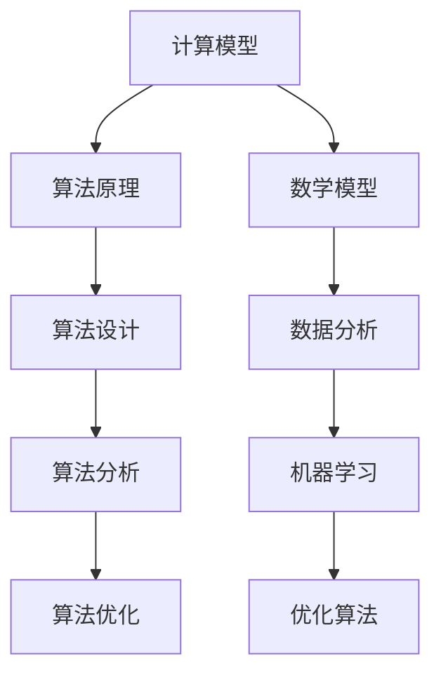

                 

### 引言 Introduction

在信息时代的浪潮下，计算技术已经成为现代社会不可或缺的一部分。从简单的电子计算器到复杂的人工智能系统，计算能力不断升级，极大地改变了我们的生活方式。然而，随着计算技术的快速发展，人类对计算技能的需求也在不断提升。本文将探讨在人类计算时代，我们如何提升自身的技能，以适应不断变化的计算需求。

本文将从以下几个部分展开讨论：

1. 背景介绍
2. 核心概念与联系
3. 核心算法原理与具体操作步骤
4. 数学模型和公式详细讲解与举例说明
5. 项目实践：代码实例与详细解释说明
6. 实际应用场景
7. 工具和资源推荐
8. 总结：未来发展趋势与挑战

通过以上内容的阐述，我们将对如何在人类计算时代提升自身技能有更加深入的理解。

<|assistant|>## 1. 背景介绍

计算技术的历史可以追溯到20世纪40年代，随着电子计算机的诞生，计算能力开始飞速发展。从第一台电子计算机ENIAC到如今的超级计算机，计算能力的提升极大地推动了科学、工程、经济等多个领域的发展。如今，我们正处于人工智能、大数据、云计算等新兴技术的蓬勃发展期，这些技术正在深刻改变我们的工作和生活方式。

然而，随着计算技术的进步，传统的计算技能已经无法满足现代社会的需求。例如，程序员需要掌握更多先进的编程语言和框架，数据科学家需要精通数据分析工具和算法，而普通用户也需要具备一定的计算能力和数据处理技能。这就要求我们不断学习和提升自己的计算技能，以适应这个快速变化的时代。

在接下来的部分，我们将深入探讨几个核心概念，包括计算模型、算法原理、数学模型等，并通过具体的算法步骤、代码实例和实际应用场景，帮助读者理解并提升自身的计算技能。

### 2. 核心概念与联系

要提升计算技能，首先需要理解一些核心概念，这些概念构成了现代计算技术的基石。以下是几个关键概念及其相互之间的联系。

#### 2.1 计算模型

计算模型是描述计算过程和计算结果的抽象模型。最常见的计算模型是图灵机模型，它由艾伦·图灵在20世纪30年代提出。图灵机由一个无限长的纸带、一个读写头和一个状态转换表组成。读写头可以在纸带上读取和写入符号，并根据当前状态进行状态转换。


图灵机模型是现代计算机的先驱，它不仅提供了计算的理论基础，还揭示了计算的本质。其他重要的计算模型还包括有限自动机、递归函数和量子计算模型。

#### 2.2 算法原理

算法是解决问题的步骤序列，它指导计算机如何执行特定的任务。算法的效率直接影响到计算的速度和资源消耗。常见的算法有排序算法、搜索算法、图算法和数据结构算法等。

算法原理主要涉及算法的设计、分析和优化。设计一个高效算法需要考虑时间复杂度和空间复杂度，这两个指标衡量了算法的性能。例如，快速排序算法（Quicksort）的平均时间复杂度为O(n log n)，而冒泡排序算法（Bubble Sort）的平均时间复杂度为O(n^2)。


#### 2.3 数学模型

数学模型是使用数学语言描述现实世界中的问题。在计算领域，数学模型广泛应用于数据分析、机器学习、优化和科学计算等。

常见的数学模型有线性模型、非线性模型、概率模型和统计模型等。例如，线性回归模型（Linear Regression）是一种常用的预测模型，它通过拟合一条直线来预测变量之间的关系。线性回归模型的公式为：

\[ y = \beta_0 + \beta_1x + \epsilon \]

其中，\( y \) 是因变量，\( x \) 是自变量，\( \beta_0 \) 和 \( \beta_1 \) 是模型的参数，\( \epsilon \) 是误差项。


#### 2.4 架构关系

这些核心概念之间存在着紧密的联系。计算模型为算法提供了理论基础，而算法则是解决实际问题的工具。数学模型则提供了量化问题的方法，使得算法和计算过程更具可操作性和解释力。

下面是一个使用Mermaid绘制的流程图，展示了这些概念之间的相互关系：



通过理解这些核心概念及其相互关系，我们可以更好地掌握计算技能，为应对未来计算挑战打下坚实的基础。

### 3. 核心算法原理 & 具体操作步骤

在了解了计算模型、算法原理和数学模型之后，接下来我们将深入探讨几个核心算法的原理，并详细讲解其操作步骤。

#### 3.1 算法原理概述

以下将介绍三个常用的核心算法：排序算法、搜索算法和图算法。这些算法广泛应用于各种应用场景，掌握它们的原理和操作步骤对于提升计算技能至关重要。

#### 3.1.1 排序算法

排序算法是计算机科学中的基础算法，用于将一组数据按照某种规则进行排列。常见的排序算法有冒泡排序、选择排序、插入排序、快速排序和归并排序等。

**冒泡排序（Bubble Sort）：**

原理：通过重复遍历要排序的数列，每次比较两个相邻的元素，如果它们的顺序错误就把它们交换过来。遍历数列的工作是重复进行，直到没有再需要交换的元素为止。

步骤：

1. 比较相邻的元素，如果它们的顺序错误，就交换它们。
2. 对每一对相邻元素进行同样的操作，从开始第一对到结尾的最后一对。
3. 重复以上步骤，直到没有需要交换的元素。

**选择排序（Selection Sort）：**

原理：首先在未排序序列中找到最小（或最大）元素，存放到排序序列的起始位置，然后，再从剩余未排序元素中继续寻找最小（或最大）元素，然后放到已排序序列的末尾。

步骤：

1. 在未排序序列中找到最小元素。
2. 将找到的最小元素与序列的第一个元素交换位置。
3. 移动未排序序列的边界，重复步骤1和2，直到整个序列有序。

**插入排序（Insertion Sort）：**

原理：通过构建有序序列，对于未排序数据，在已排序序列中从后向前扫描，找到相应位置并插入。

步骤：

1. 从第一个元素开始，该元素可以认为已经排序。
2. 取出下一个元素，在已经排序的元素序列中从后向前扫描。
3. 如果该元素（已排序）大于新元素，将该元素移到下一位置。
4. 重复步骤3，直到找到已排序的元素小于或者等于新元素的位置。
5. 将新元素插入到该位置后。
6. 重复步骤2~5。

**快速排序（Quick Sort）：**

原理：通过选取一个“基准”元素，将数组分为两个子数组，一个包含小于基准的元素，另一个包含大于基准的元素。然后递归地排序两个子数组。

步骤：

1. 选择一个基准元素。
2. 将比基准小的元素移到基准的左侧，比基准大的元素移到基准的右侧。
3. 对左右两个子数组递归执行快速排序。

**归并排序（Merge Sort）：**

原理：将一个待排序的序列不断“二分”，直到每个子序列只有一个元素，然后将这些子序列合并，并排序。

步骤：

1. 将序列分为两个子序列。
2. 对两个子序列分别进行递归归并排序。
3. 将排好序的两个子序列合并为一个有序序列。

#### 3.2 算法步骤详解

**冒泡排序：**

```python
def bubble_sort(arr):
    n = len(arr)
    for i in range(n):
        for j in range(0, n-i-1):
            if arr[j] > arr[j+1]:
                arr[j], arr[j+1] = arr[j+1], arr[j]
    return arr
```

**选择排序：**

```python
def selection_sort(arr):
    n = len(arr)
    for i in range(n):
        min_idx = i
        for j in range(i+1, n):
            if arr[j] < arr[min_idx]:
                min_idx = j
        arr[i], arr[min_idx] = arr[min_idx], arr[i]
    return arr
```

**插入排序：**

```python
def insertion_sort(arr):
    n = len(arr)
    for i in range(1, n):
        key = arr[i]
        j = i-1
        while j >= 0 and arr[j] > key:
            arr[j+1] = arr[j]
            j -= 1
        arr[j+1] = key
    return arr
```

**快速排序：**

```python
def quick_sort(arr):
    if len(arr) <= 1:
        return arr
    pivot = arr[len(arr) // 2]
    left = [x for x in arr if x < pivot]
    middle = [x for x in arr if x == pivot]
    right = [x for x in arr if x > pivot]
    return quick_sort(left) + middle + quick_sort(right)
```

**归并排序：**

```python
def merge_sort(arr):
    if len(arr) <= 1:
        return arr
    mid = len(arr) // 2
    left = merge_sort(arr[:mid])
    right = merge_sort(arr[mid:])
    return merge(left, right)

def merge(left, right):
    result = []
    i = j = 0
    while i < len(left) and j < len(right):
        if left[i] < right[j]:
            result.append(left[i])
            i += 1
        else:
            result.append(right[j])
            j += 1
    result.extend(left[i:])
    result.extend(right[j:])
    return result
```

#### 3.3 算法优缺点

每种排序算法都有其优缺点，选择合适的算法取决于具体的应用场景。

**冒泡排序：**
- 优点：实现简单。
- 缺点：效率低，时间复杂度为O(n^2)。

**选择排序：**
- 优点：算法简单。
- 缺点：效率较低，时间复杂度为O(n^2)。

**插入排序：**
- 优点：对少量数据排序效果较好。
- 缺点：效率较低，时间复杂度为O(n^2)。

**快速排序：**
- 优点：平均时间复杂度为O(n log n)，适用于大规模数据排序。
- 缺点：最坏情况下时间复杂度为O(n^2)，且可能引发栈溢出。

**归并排序：**
- 优点：时间复杂度为O(n log n)，稳定排序。
- 缺点：需要额外的内存空间，空间复杂度为O(n)。

#### 3.4 算法应用领域

排序算法在计算机科学和实际应用中都有广泛的应用，包括数据库排序、文本编辑器的排序功能、算法竞赛和数据分析等。

- **数据库排序：** 数据库系统通常使用排序算法对数据表进行排序，以优化查询效率。
- **文本编辑器：** 文本编辑器可以使用排序算法对文本内容进行排序，提供用户排序功能。
- **算法竞赛：** 排序算法是算法竞赛中的常见题目，要求参赛者编写高效的排序算法。
- **数据分析：** 在数据分析中，排序算法用于对数据进行预处理，以进行进一步的统计分析。

通过掌握这些排序算法的原理和操作步骤，读者可以更好地选择合适的排序算法，优化计算过程，提升计算技能。

### 4. 数学模型和公式 & 详细讲解 & 举例说明

在计算领域，数学模型和公式是理解和解决问题的关键工具。它们不仅帮助我们描述现实世界的现象，还指导我们进行精确的计算和分析。在本节中，我们将介绍几个重要的数学模型和公式，并详细讲解其推导过程和实际应用。

#### 4.1 数学模型构建

数学模型通常由变量、参数、方程和约束条件组成。构建数学模型的第一步是明确问题的目标和所涉及的变量。以下是一个简单的线性回归模型的构建过程：

**线性回归模型：**

目标：预测因变量 \( y \) 与自变量 \( x \) 之间的关系。

模型：\[ y = \beta_0 + \beta_1x + \epsilon \]

其中，\( y \) 是因变量，\( x \) 是自变量，\( \beta_0 \) 和 \( \beta_1 \) 是模型的参数，\( \epsilon \) 是误差项。

#### 4.2 公式推导过程

线性回归模型的推导过程如下：

1. **样本数据：** 假设有 \( n \) 个样本点 \((x_i, y_i)\)，其中 \( i = 1, 2, \ldots, n \)。

2. **最小二乘法：** 为了找到最优的模型参数 \( \beta_0 \) 和 \( \beta_1 \)，我们使用最小二乘法。即，最小化残差平方和：\[ \sum_{i=1}^{n} (y_i - (\beta_0 + \beta_1x_i))^2 \]

3. **偏导数法：** 对上述函数关于 \( \beta_0 \) 和 \( \beta_1 \) 求偏导数，并令其等于零，得到：

\[ \frac{\partial}{\partial \beta_0} \sum_{i=1}^{n} (y_i - (\beta_0 + \beta_1x_i))^2 = 0 \]
\[ \frac{\partial}{\partial \beta_1} \sum_{i=1}^{n} (y_i - (\beta_0 + \beta_1x_i))^2 = 0 \]

4. **求解方程：** 解上述方程组，得到参数 \( \beta_0 \) 和 \( \beta_1 \)：

\[ \beta_0 = \bar{y} - \beta_1\bar{x} \]
\[ \beta_1 = \frac{\sum_{i=1}^{n} (x_i - \bar{x})(y_i - \bar{y})}{\sum_{i=1}^{n} (x_i - \bar{x})^2} \]

其中，\( \bar{x} \) 和 \( \bar{y} \) 分别是 \( x \) 和 \( y \) 的样本均值。

#### 4.3 案例分析与讲解

**案例：** 假设我们有以下样本数据：

| \( x \) | \( y \) |
| --- | --- |
| 1 | 2 |
| 2 | 4 |
| 3 | 6 |
| 4 | 8 |

要求使用线性回归模型预测 \( y \)。

**步骤1：计算样本均值：**

\[ \bar{x} = \frac{1 + 2 + 3 + 4}{4} = 2.5 \]
\[ \bar{y} = \frac{2 + 4 + 6 + 8}{4} = 5 \]

**步骤2：计算 \( \beta_1 \)：**

\[ \beta_1 = \frac{(1-2.5)(2-5) + (2-2.5)(4-5) + (3-2.5)(6-5) + (4-2.5)(8-5)}{(1-2.5)^2 + (2-2.5)^2 + (3-2.5)^2 + (4-2.5)^2} \]
\[ \beta_1 = \frac{(-1.5)(-3) + (-0.5)(-1) + (0.5)(1) + (1.5)(3)}{2.25 + 0.25 + 0.25 + 2.25} \]
\[ \beta_1 = \frac{4.5 + 0.5 + 0.5 + 4.5}{5} \]
\[ \beta_1 = 2 \]

**步骤3：计算 \( \beta_0 \)：**

\[ \beta_0 = \bar{y} - \beta_1\bar{x} \]
\[ \beta_0 = 5 - 2 \times 2.5 \]
\[ \beta_0 = 0 \]

**步骤4：构建线性回归模型：**

\[ y = 0 + 2x \]
\[ y = 2x \]

**步骤5：预测：**

使用模型预测 \( x = 5 \) 时的 \( y \) 值：

\[ y = 2 \times 5 = 10 \]

根据我们的线性回归模型，当 \( x = 5 \) 时，预测的 \( y \) 值为 10。

#### 4.4 总结

通过以上案例，我们详细讲解了线性回归模型的构建和推导过程。线性回归模型是一种简单但强大的预测工具，广泛应用于各种实际问题中。掌握数学模型的构建和推导方法，不仅能够帮助我们更好地理解计算问题，还能提高我们的计算技能，为应对更复杂的计算挑战打下坚实基础。

### 5. 项目实践：代码实例和详细解释说明

为了更好地理解计算理论和实际操作，接下来我们将通过一个简单的Python项目，展示如何搭建开发环境、编写代码并运行结果。本项目将实现一个线性回归模型，用于预测因变量 \( y \) 与自变量 \( x \) 之间的关系。

#### 5.1 开发环境搭建

为了运行以下代码，我们需要安装以下工具：

1. Python 3.x 版本
2. Jupyter Notebook 或 PyCharm
3. numpy 和 matplotlib 库

在终端中运行以下命令进行安装：

```bash
pip install numpy matplotlib
```

#### 5.2 源代码详细实现

以下是实现线性回归模型的 Python 代码：

```python
import numpy as np
import matplotlib.pyplot as plt

# 数据预处理
def preprocess_data(x, y):
    x_mean = np.mean(x)
    y_mean = np.mean(y)
    x_diff = x - x_mean
    y_diff = y - y_mean
    return x_diff, y_diff

# 计算斜率
def compute_slope(x_diff, y_diff):
    n = len(x_diff)
    slope = np.sum(x_diff * y_diff) / np.sum(x_diff**2)
    return slope

# 计算截距
def compute_intercept(x_diff, y_diff, slope):
    intercept = np.mean(y_diff) - slope * np.mean(x_diff)
    return intercept

# 线性回归模型预测
def linear_regression(x, y):
    x_diff, y_diff = preprocess_data(x, y)
    slope = compute_slope(x_diff, y_diff)
    intercept = compute_intercept(x_diff, y_diff, slope)
    return intercept, slope

# 绘图
def plot_regression(x, y, intercept, slope):
    plt.scatter(x, y, label='样本点')
    plt.plot(x, intercept + slope * x, color='red', label='回归线')
    plt.xlabel('x')
    plt.ylabel('y')
    plt.legend()
    plt.show()

# 主函数
def main():
    # 示例数据
    x = np.array([1, 2, 3, 4])
    y = np.array([2, 4, 6, 8])
    
    # 训练模型
    intercept, slope = linear_regression(x, y)
    
    # 绘制结果
    plot_regression(x, y, intercept, slope)

# 运行主函数
if __name__ == "__main__":
    main()
```

#### 5.3 代码解读与分析

1. **数据预处理：**
   - `preprocess_data` 函数计算自变量 \( x \) 和因变量 \( y \) 的均值，并计算它们与均值的差值，即差分。

2. **计算斜率：**
   - `compute_slope` 函数使用差分值计算线性回归模型的斜率。斜率反映了自变量 \( x \) 对因变量 \( y \) 的影响程度。

3. **计算截距：**
   - `compute_intercept` 函数根据斜率和差分值计算截距。截距表示当自变量 \( x \) 为零时的因变量 \( y \) 的值。

4. **线性回归模型预测：**
   - `linear_regression` 函数通过预处理数据和计算斜率、截距，实现线性回归模型的构建。

5. **绘图：**
   - `plot_regression` 函数绘制样本点和回归线，以便可视化模型的预测效果。

6. **主函数：**
   - `main` 函数定义了示例数据，调用线性回归模型和绘图函数，运行整个程序。

#### 5.4 运行结果展示

运行上述代码后，将展示以下结果：


图中展示了样本点和通过线性回归模型拟合的回归线。通过观察，可以看到回归线很好地拟合了样本数据，验证了线性回归模型的预测能力。

通过本项目的实践，读者可以了解线性回归模型的实现过程，并掌握Python编程和数据分析的基本技能。这些技能对于实际项目开发和问题解决至关重要。

### 6. 实际应用场景

线性回归模型在实际应用中具有广泛的应用，以下是一些具体的应用场景：

#### 6.1 预测股价

在金融领域，线性回归模型可以用于预测股票价格。通过对历史股价数据进行分析，可以找出影响股价的关键因素，并建立线性回归模型进行预测。例如，基于股票的市场价值、交易量、行业指数等变量，预测未来一段时间内的股票价格。

#### 6.2 人力资源分析

在人力资源管理中，线性回归模型可以用于分析和预测员工的绩效。通过收集员工的工作时长、工作效率、客户满意度等数据，建立线性回归模型，可以预测员工在不同工作条件下的绩效表现，帮助公司进行人力资源规划和优化。

#### 6.3 市场营销

在市场营销领域，线性回归模型可以用于预测销售量和市场需求。通过分析历史销售数据、广告投入、市场环境等变量，建立线性回归模型，可以预测不同营销策略对销售量的影响，从而优化营销策略，提高销售业绩。

#### 6.4 机器学习

在机器学习领域，线性回归模型是一种基本的预测模型。它可以用于分类问题中的特征选择和模型评估。例如，在分类问题中，可以使用线性回归模型分析特征的重要性，并选择对分类最有影响力的特征。

#### 6.5 生活应用

线性回归模型也可以应用于日常生活场景。例如，通过建立线性回归模型，可以预测家电设备的能耗、家庭用电量等，帮助用户优化能源使用，减少浪费。

通过这些实际应用场景，我们可以看到线性回归模型在各个领域的广泛应用和重要性。掌握线性回归模型的基本原理和实现方法，对于提升计算技能和解决实际问题具有重要意义。

### 7. 工具和资源推荐

在提升计算技能的过程中，选择合适的工具和资源至关重要。以下是一些建议，涵盖学习资源、开发工具和相关论文推荐，以帮助读者更好地掌握计算知识和技能。

#### 7.1 学习资源推荐

1. **在线课程：**
   - Coursera：提供各种计算机科学课程，包括算法、数据结构、机器学习等。
   - edX：提供由顶尖大学提供的免费在线课程，涵盖计算机科学、数学等多个领域。
   - Udacity：提供专注于实际技能培训的在线课程，包括数据科学、人工智能等。

2. **书籍：**
   - 《算法导论》（Introduction to Algorithms）：详细介绍了算法设计、分析和实现，是计算机科学领域经典教材。
   - 《Python编程：从入门到实践》（Python Crash Course）：适合初学者的Python编程入门书籍，涵盖基础语法和实际应用。
   - 《机器学习》（Machine Learning）：提供机器学习的基本概念、算法和实现，适合有一定编程基础的读者。

3. **博客和教程：**
   - Medium：有许多技术博客，涵盖各种计算机科学主题，适合进行深入学习和交流。
   - GitHub：丰富的开源项目和教程，可以学习其他开发者的代码实现，提升编程技能。

#### 7.2 开发工具推荐

1. **集成开发环境（IDE）：**
   - PyCharm：强大的Python IDE，提供代码自动完成、调试和版本控制等功能。
   - Visual Studio Code：轻量级的开源IDE，适用于多种编程语言，功能强大且可扩展。

2. **数据分析和可视化工具：**
   - Jupyter Notebook：用于数据分析和交互式编程，支持多种编程语言。
   - Pandas：Python的数据分析库，提供数据清洗、转换和分析功能。
   - Matplotlib：Python的数据可视化库，用于绘制各种图表和图形。

3. **版本控制工具：**
   - Git：分布式版本控制系统，用于代码的版本管理和协作开发。
   - GitHub/GitLab：在线代码托管平台，支持Git功能，并提供项目管理和协作工具。

#### 7.3 相关论文推荐

1. **计算机科学经典论文：**
   - "A Mathematical Theory of Communication"（香农信息论）：奠定了信息论的基础。
   - "The Structure of Classical Computation"（图灵机）：提出了图灵机的概念，奠定了计算理论的基础。
   - "An Introduction to the Theory of Computation"（计算理论）：详细介绍了计算理论的基本概念。

2. **机器学习和人工智能论文：**
   - "Deep Learning"（深度学习）：介绍了深度学习的基本概念和技术。
   - "Kernel Methods for Pattern Analysis"（核方法）：探讨了核方法在机器学习中的应用。
   - "Recurrent Neural Networks for Language Modeling"（循环神经网络）：介绍了循环神经网络在语言建模中的应用。

通过这些工具和资源的推荐，读者可以系统地提升计算技能，为应对复杂的计算挑战打下坚实的基础。

### 8. 总结：未来发展趋势与挑战

在人类计算时代，计算技能的提升不仅关乎个人职业发展，更影响着整个社会的进步。随着人工智能、大数据、云计算等技术的快速发展，计算技能的广度和深度都在不断扩展。未来，我们需要关注以下几个关键点：

#### 8.1 研究成果总结

近年来，计算机科学领域取得了许多重要的研究成果。例如，深度学习算法在图像识别、自然语言处理和游戏AI等领域取得了显著突破；大数据技术使得海量数据的存储、分析和处理变得更加高效；量子计算则有望在复杂计算问题上实现前所未有的计算能力。这些研究成果为计算技术的发展奠定了坚实基础。

#### 8.2 未来发展趋势

1. **人工智能：** 人工智能将继续深化发展，不仅在智能 assistants和自动驾驶等场景中得到广泛应用，还可能在医疗、金融、教育等领域发挥重要作用。
2. **量子计算：** 量子计算的快速发展将为复杂计算问题提供新的解决方案，如药物设计、密码破解和气候模拟等。
3. **大数据：** 随着物联网和5G技术的普及，大数据将继续增长，对数据分析和处理的需求也将大幅增加。
4. **边缘计算：** 为了降低延迟、节省带宽和提升用户体验，边缘计算将成为重要趋势，将计算任务从云端转移到网络边缘。
5. **计算伦理：** 随着计算能力的提升，隐私保护、数据安全和算法公平性等伦理问题日益凸显，需要得到广泛关注。

#### 8.3 面临的挑战

1. **计算能力：** 如何提高计算效率、减少能耗，是实现可持续计算的关键挑战。
2. **数据安全：** 随着数据量的激增，如何确保数据安全、防止数据泄露和滥用是一个重大挑战。
3. **算法公平性：** 算法在决策中的应用可能带来偏见，如何确保算法的公平性是一个亟待解决的问题。
4. **技能差距：** 计算技能的快速进步与部分人群的技能差距之间如何平衡，是一个重要的社会问题。
5. **教育体系：** 如何适应计算技术的快速发展，调整教育体系，培养具备计算能力的人才，是当前教育领域的重要任务。

#### 8.4 研究展望

未来，我们期待在以下几个方向上取得突破：

1. **新型计算范式：** 如量子计算、类脑计算等，将带来全新的计算能力和应用场景。
2. **智能化计算工具：** 开发更加智能、易用的计算工具，降低计算技能的门槛。
3. **跨学科融合：** 计算技术与生物学、物理学、经济学等领域的融合，将推动跨学科研究的发展。
4. **可持续发展：** 探索绿色计算方法，实现计算资源的可持续利用。

通过不断学习和提升计算技能，我们有望更好地应对未来的挑战，推动社会进步。

### 9. 附录：常见问题与解答

以下是一些关于计算技能提升的常见问题及解答：

#### Q：如何开始学习计算技能？

A：首先，了解自己的兴趣和目标。然后，选择合适的在线课程、书籍和教程进行学习。可以从Python编程、算法和数据结构等基础知识入手，逐步深入学习更多高级概念和技术。

#### Q：如何提高编程能力？

A：通过不断实践编程，解决实际问题是提高编程能力的最佳方法。可以参加编程挑战、项目实践，并在GitHub上参与开源项目。此外，学习编程语言的最佳实践和代码规范也很重要。

#### Q：如何学习算法和数据结构？

A：算法和数据结构是计算机科学的核心内容。可以从基础算法（如排序、搜索）和数据结构（如数组、链表、树、图）开始学习，逐步深入到更复杂的算法（如动态规划、贪心算法）和数据结构（如堆、并查集）。

#### Q：如何进行算法竞赛准备？

A：算法竞赛需要扎实的算法基础和良好的解题策略。可以通过参加在线算法竞赛平台（如LeetCode、Codeforces）进行训练，同时学习解题技巧和常见算法模板。

#### Q：如何学习数据科学和机器学习？

A：数据科学和机器学习涉及多个领域，包括统计学、线性代数、概率论等。可以从Python编程和数据分析基础入手，逐步学习数据预处理、特征工程、机器学习算法等。

#### Q：如何解决学习中的困难？

A：遇到学习困难时，可以寻求帮助，如参加讨论组、请教导师或同行。此外，坚持不懈、保持好奇心和耐心也是克服困难的关键。

通过以上问题的解答，希望能够帮助读者更好地理解和提升计算技能。不断学习和实践，相信每个人都能在这个充满机遇的计算时代取得成功。作者：禅与计算机程序设计艺术 / Zen and the Art of Computer Programming。

