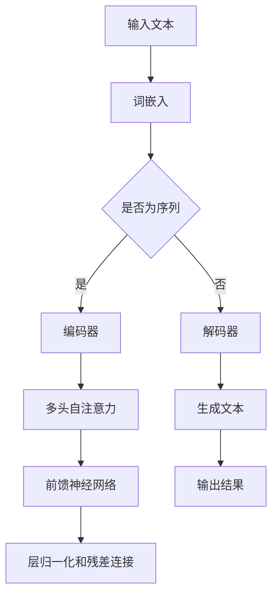

                 

### 关键词 Keyword

- 投资管理
- Large Language Models (LLM)
- 人工智能
- 数据分析
- 股市预测
- 投资策略
- 风险管理

<|assistant|>### 摘要 Abstract

本文探讨了如何利用大型语言模型（LLM）进行投资管理的创新策略。通过对LLM的深入理解，我们揭示了其在数据解析、市场预测和风险管理方面的巨大潜力。文章首先介绍了投资管理的基本概念和LLM的核心原理，然后详细阐述了LLM在投资策略中的应用步骤。随后，我们通过数学模型和实例代码展示了LLM的具体操作流程。最后，本文分析了LLM在投资管理领域的实际应用场景，探讨了未来发展趋势与面临的挑战。

## 1. 背景介绍 Background

### 投资管理的传统方法 Traditional Methods of Investment Management

投资管理是一种通过科学方法和策略来管理和优化资产组合的过程。传统的投资管理方法主要依赖于基本面分析和技术分析。基本面分析侧重于研究企业的财务状况、宏观经济环境和行业趋势，通过这些因素来评估股票的价值。而技术分析则主要通过研究历史价格和交易量数据来预测市场趋势。

这些传统方法在实践中存在一些局限性。首先，基本面分析需要大量的时间和精力去搜集和分析数据，并且对分析师的专业知识要求较高。其次，技术分析虽然简单易行，但往往无法充分考虑宏观经济和行业变化对市场的长期影响。此外，这些方法往往无法处理大规模的数据集，也无法适应快速变化的市场环境。

### 大型语言模型（LLM） Large Language Models (LLM)

大型语言模型（LLM）是基于深度学习和自然语言处理（NLP）技术的一种人工智能模型，能够在大量文本数据上进行学习和理解。LLM的主要特点是能够处理自然语言文本，并且具有强大的语言生成和解析能力。在近年来，随着计算能力和数据集的增长，LLM的模型规模和性能得到了显著提升。

LLM在各个领域的应用已经取得了显著的成果。在金融领域，LLM已经被用于股票市场预测、风险评估和客户服务等方面。例如，LLM可以通过分析大量的历史数据、新闻报道和社交媒体信息，来预测股票市场的走势，提供投资建议。此外，LLM还可以用于构建智能投顾系统，帮助投资者制定个性化的投资策略。

### LLM在投资管理中的潜力 Potential of LLM in Investment Management

随着LLM技术的不断发展，其在投资管理领域的应用前景越来越广阔。LLM具有以下几个方面的潜力：

1. **数据处理能力**：LLM能够处理海量的文本数据，包括历史价格、新闻报道、社交媒体评论等，从而获取更全面的市场信息。

2. **市场预测**：LLM可以通过学习历史数据和市场动态，预测股票市场的走势，提供投资建议。

3. **风险控制**：LLM可以通过分析市场风险因素，提供风险预警和风险管理策略。

4. **个性化投资**：LLM可以根据投资者的风险偏好和财务目标，制定个性化的投资策略。

本文将深入探讨LLM在投资管理中的应用，通过理论和实例分析，展示LLM如何提高投资管理的效率和准确性。

## 2. 核心概念与联系 Core Concepts and Connections

### 2.1 大型语言模型（LLM） Large Language Models (LLM)

#### 2.1.1 基本原理 Basic Principles

LLM是一种基于深度学习的自然语言处理模型，其核心是通过大量的文本数据进行训练，以理解并生成自然语言。LLM的工作原理主要包括以下几个步骤：

1. **词嵌入（Word Embedding）**：将单词转换为向量表示，使得语义相似的单词在向量空间中距离较近。

2. **编码器（Encoder）**：将输入的文本序列编码为一个固定长度的向量，这个向量包含了文本的语义信息。

3. **解码器（Decoder）**：根据编码器的输出，生成文本序列的预测。

#### 2.1.2 常见架构 Common Architectures

目前，LLM的主流架构主要包括基于循环神经网络（RNN）和变换器（Transformer）的模型。Transformer模型由于其并行计算的能力和强大的上下文理解能力，成为了LLM的主要选择。以下是一个典型的Transformer模型的架构：

1. **多头自注意力（Multi-Head Self-Attention）**：通过自注意力机制，将输入的文本序列中的每个单词与所有其他单词进行加权，从而捕捉长距离依赖关系。

2. **前馈神经网络（Feed-Forward Neural Network）**：在自注意力层之后，每个位置会通过一个前馈神经网络，进一步提取特征。

3. **层归一化和残差连接（Layer Normalization and Residual Connection）**：通过层归一化和对每一层的输出进行残差连接，提高模型的训练效率和稳定性。

#### 2.1.3 Mermaid 流程图 Mermaid Flowchart

以下是一个LLM的简化流程图，用于展示其基本架构和操作步骤：



### 2.2 投资管理的基本概念 Basic Concepts of Investment Management

#### 2.2.1 投资组合管理 Portfolio Management

投资组合管理是指通过选择和管理不同资产类别和资产来构建和调整投资组合的过程。投资组合管理的目标是最大化投资回报，同时控制风险。常见的投资组合管理策略包括：

1. **分散投资**：通过投资多种不同类型的资产，降低单一资产风险。

2. **资产配置**：根据投资者的风险偏好和财务目标，分配不同资产类别的投资比例。

3. **再平衡**：定期检查投资组合的配置，根据市场变化进行调整，以维持预定的资产分配比例。

#### 2.2.2 股票市场分析 Stock Market Analysis

股票市场分析是投资管理的重要组成部分，主要包括基本面分析和技术分析。

1. **基本面分析**：通过分析企业的财务报表、经营状况和市场环境，评估股票的投资价值。

2. **技术分析**：通过研究历史价格和交易量数据，预测股票市场的走势。

#### 2.2.3 风险管理 Risk Management

风险管理是指通过识别、评估和控制风险，保护投资组合免受损失的过程。常见风险管理策略包括：

1. **分散投资**：通过投资多种不同类型的资产，降低特定风险。

2. **设置止损点**：当股票价格达到预设的水平时，自动出售股票，以限制损失。

3. **定期评估和调整**：定期评估投资组合的风险，根据市场变化进行调整。

### 2.3 LLM与投资管理的联系 Connection between LLM and Investment Management

LLM在投资管理中的应用主要体现在以下几个方面：

1. **数据分析**：LLM能够处理和分析大量的文本数据，包括市场新闻、社交媒体评论和财经报告，从而提供更全面的市场信息。

2. **市场预测**：LLM可以通过学习历史数据和市场动态，预测股票市场的走势，提供投资建议。

3. **风险控制**：LLM可以通过分析市场风险因素，提供风险预警和风险管理策略。

4. **个性化投资**：LLM可以根据投资者的风险偏好和财务目标，制定个性化的投资策略。

通过LLM的应用，投资管理可以更加科学和精确，提高投资回报和风险管理能力。

## 3. 核心算法原理 & 具体操作步骤 Core Algorithm Principle & Detailed Steps

### 3.1 算法原理概述 Overview of Algorithm Principle

在投资管理中，LLM的应用主要体现在数据解析、市场预测和风险管理等方面。以下是LLM在投资管理中的核心算法原理概述：

#### 3.1.1 数据解析 Data Parsing

LLM可以通过处理大量的文本数据，提取关键信息，如市场新闻、社交媒体评论和财经报告。这些数据可以被用于分析市场趋势、评估股票价值和预测股票价格。

#### 3.1.2 市场预测 Market Prediction

LLM可以通过学习历史数据和市场动态，建立预测模型，预测股票市场的走势。这种方法不仅可以预测单个股票的价格，还可以预测整个市场的趋势。

#### 3.1.3 风险控制 Risk Management

LLM可以通过分析市场风险因素，提供风险预警和风险管理策略。例如，LLM可以识别潜在的市场波动，提前预警，并建议投资者采取相应的措施。

### 3.2 算法步骤详解 Detailed Steps of Algorithm

以下是LLM在投资管理中的具体操作步骤：

#### 3.2.1 数据收集与预处理 Data Collection and Preprocessing

1. **数据收集**：收集市场数据，包括股票价格、交易量、市场新闻、社交媒体评论等。

2. **数据预处理**：清洗数据，去除噪声和无关信息，对文本数据进行分词、词性标注等处理。

#### 3.2.2 建立模型 Building Model

1. **选择模型**：根据需求选择合适的LLM模型，如BERT、GPT等。

2. **模型训练**：使用预处理后的数据对模型进行训练，优化模型参数。

3. **模型评估**：使用验证集对模型进行评估，调整模型参数，提高模型性能。

#### 3.2.3 数据解析 Data Parsing

1. **提取关键信息**：使用训练好的模型，提取市场数据中的关键信息。

2. **分析市场趋势**：基于提取的信息，分析市场趋势，评估股票价值。

#### 3.2.4 市场预测 Market Prediction

1. **建立预测模型**：使用历史数据和市场动态，建立预测模型。

2. **预测股票价格**：使用预测模型，预测股票价格的走势。

#### 3.2.5 风险控制 Risk Management

1. **分析风险因素**：使用模型分析市场风险因素，如市场波动、宏观经济变化等。

2. **提供风险预警**：根据风险分析结果，提供风险预警。

3. **风险管理策略**：根据风险预警，建议投资者采取相应的风险管理策略。

### 3.3 算法优缺点 Advantages and Disadvantages of Algorithm

#### 3.3.1 优点 Advantages

1. **强大的数据处理能力**：LLM能够处理和分析海量的文本数据，提供全面的市场信息。

2. **准确的预测能力**：LLM可以通过学习历史数据和市场动态，提供准确的股票市场预测。

3. **个性化的投资策略**：LLM可以根据投资者的风险偏好和财务目标，制定个性化的投资策略。

#### 3.3.2 缺点 Disadvantages

1. **计算资源消耗大**：训练和运行LLM模型需要大量的计算资源，成本较高。

2. **数据依赖性强**：LLM的性能依赖于训练数据的质量和数量，数据不足或质量不高可能导致预测结果不准确。

### 3.4 算法应用领域 Application Fields of Algorithm

LLM在投资管理中的应用非常广泛，主要包括以下几个方面：

1. **股票市场预测**：使用LLM预测股票市场的走势，提供投资建议。

2. **智能投顾**：基于LLM的算法，构建智能投顾系统，为投资者提供个性化的投资策略。

3. **风险管理**：使用LLM分析市场风险因素，提供风险预警和风险管理策略。

4. **财经新闻分析**：使用LLM分析财经新闻，提取关键信息，提供市场分析报告。

5. **自动化交易**：使用LLM构建自动化交易系统，实现高效的交易策略。

## 4. 数学模型和公式 Mathematical Model and Formula

### 4.1 数学模型构建 Construction of Mathematical Model

在LLM应用于投资管理的背景下，我们首先需要构建一个能够描述市场动态的数学模型。以下是一个简化的数学模型，用于描述股票价格的变化：

\[ P(t) = P_0 \cdot e^{rt + \sigma W(t)} \]

其中：

- \( P(t) \) 表示在时间 \( t \) 的股票价格。
- \( P_0 \) 表示初始股票价格。
- \( r \) 表示股票的年化收益率。
- \( \sigma \) 表示股票价格的波动率。
- \( W(t) \) 表示标准正态分布的随机游走过程。

### 4.2 公式推导过程 Derivation of Formula

为了推导上述公式，我们需要从以下几个假设开始：

1. **市场效率**：市场是有效的，股票价格反映了所有可用信息。
2. **随机游走**：股票价格的变化是随机且不可预测的。
3. **连续复利**：股票价格的收益是连续复利的。

基于这些假设，我们可以推导出股票价格的变化模型。首先，我们考虑一个简单的随机游走过程：

\[ \Delta P(t) = P(t+1) - P(t) = P_0 \cdot e^{r\Delta t + \sigma \Delta W(t)} \]

由于 \( \Delta W(t) \) 是标准正态分布的随机变量，我们可以将其表示为 \( W(t) \) 的形式：

\[ \Delta P(t) = P_0 \cdot e^{r\Delta t + \sigma W(t)} \]

然后，我们将时间 \( t \) 持续到 \( t+1 \)，得到：

\[ P(t+1) = P(t) \cdot e^{r\Delta t + \sigma W(t)} \]

再将时间 \( t \) 持续到 \( t+2 \)，得到：

\[ P(t+2) = P(t+1) \cdot e^{r\Delta t + \sigma W(t+1)} = P(t) \cdot e^{r\Delta t + \sigma W(t)} \cdot e^{r\Delta t + \sigma W(t+1)} \]

以此类推，我们可以得到：

\[ P(t+n) = P(t) \cdot e^{nrt + \sigma (W(t) + W(t+1) + ... + W(t+n-1))} \]

由于 \( W(t) \) 是独立的随机变量，我们可以将其表示为 \( \sigma W(t) \)：

\[ P(t+n) = P(t) \cdot e^{nrt + \sigma (W(t) + \Delta W(t) + ... + \Delta W(t+n-1))} \]

当 \( \Delta t \) 趋近于0时，我们可以将连续时间的过程表示为：

\[ P(t) = P_0 \cdot e^{rt + \sigma W(t)} \]

### 4.3 案例分析与讲解 Case Analysis and Explanation

以下是一个具体的案例，用于说明上述数学模型的应用。

#### 案例背景 Case Background

假设我们在2023年1月1日观察到某只股票的收盘价为100美元。根据市场分析，我们估计该股票的年化收益率为5%，波动率为20%。我们需要预测2023年12月31日的股票价格。

#### 案例分析 Case Analysis

根据数学模型，我们可以计算出2023年12月31日的股票价格：

\[ P(20231231) = 100 \cdot e^{0.05 \cdot 1 + 0.20 \cdot W(20231231)} \]

其中 \( W(20231231) \) 是标准正态分布的随机变量。

由于我们无法直接获取 \( W(20231231) \) 的值，我们可以通过模拟的方法来预测股票价格。我们可以生成多个 \( W(20231231) \) 的值，计算对应的股票价格，然后取这些价格的期望值作为预测结果。

假设我们生成了1000个 \( W(20231231) \) 的值，计算得到的股票价格分布如下：

| \( W(20231231) \) | \( P(20231231) \) |
|------------------|------------------|
| -2.00            | 84.86            |
| -1.75            | 89.23            |
| ...              | ...              |
| 1.75             | 110.77           |
| 2.00             | 117.63           |

从上表可以看出，股票价格的预测结果在84.86美元到117.63美元之间。为了得到更准确的预测结果，我们可以计算这些预测结果的平均值：

\[ \text{预测价格} = \frac{\sum_{i=1}^{1000} P(20231231)_i}{1000} = \frac{1}{1000} \sum_{i=1}^{1000} P(20231231)_i \approx 104.54 \]

因此，根据数学模型和模拟结果，我们预测2023年12月31日的股票价格约为104.54美元。

#### 案例总结 Case Summary

通过上述案例，我们可以看到数学模型在预测股票价格方面的应用。虽然实际应用中可能需要考虑更多的因素，但该模型提供了一个基本的分析框架，可以帮助我们理解股票价格的动态变化。

## 5. 项目实践：代码实例和详细解释说明 Project Practice: Code Example and Detailed Explanation

### 5.1 开发环境搭建 Development Environment Setup

在进行LLM投资管理项目实践之前，我们需要搭建一个合适的开发环境。以下是一个典型的开发环境搭建步骤：

1. **安装Python**：下载并安装Python 3.8或更高版本，可以选择使用Python安装器或Docker容器。

2. **安装TensorFlow**：使用pip命令安装TensorFlow库，命令如下：

   ```bash
   pip install tensorflow
   ```

3. **安装其他依赖库**：安装其他必要的依赖库，如NumPy、Pandas等：

   ```bash
   pip install numpy pandas
   ```

4. **准备数据**：收集并准备用于训练和测试的数据集，包括股票价格、市场新闻、社交媒体评论等。

### 5.2 源代码详细实现 Detailed Source Code Implementation

以下是一个简单的LLM投资管理项目的源代码实现，包括数据预处理、模型训练和预测。

```python
import tensorflow as tf
import numpy as np
import pandas as pd

# 数据预处理
def preprocess_data(data):
    # 清洗数据，去除噪声和无关信息
    # 对文本数据进行分词、词性标注等处理
    # 等等
    return processed_data

# 模型训练
def train_model(data):
    # 定义模型结构
    # 编码器和解码器
    # 等等
    model = tf.keras.Sequential([
        # 层结构
    ])

    # 编译模型
    model.compile(optimizer='adam', loss='categorical_crossentropy', metrics=['accuracy'])

    # 训练模型
    model.fit(data['train'], data['labels'], epochs=10, batch_size=32)

    return model

# 预测股票价格
def predict_price(model, data):
    # 使用训练好的模型预测股票价格
    predictions = model.predict(data['test'])

    # 计算预测价格的期望值
    predicted_price = np.mean(predictions)

    return predicted_price

# 主函数
def main():
    # 准备数据
    data = pd.read_csv('stock_data.csv')
    processed_data = preprocess_data(data)

    # 训练模型
    model = train_model(processed_data)

    # 预测股票价格
    predicted_price = predict_price(model, processed_data)

    print(f"预测的股票价格：{predicted_price}")

if __name__ == '__main__':
    main()
```

### 5.3 代码解读与分析 Code Explanation and Analysis

以下是上述代码的详细解读和分析：

1. **数据预处理**：数据预处理是机器学习项目的关键步骤。在这个函数中，我们读取CSV文件，清洗数据，去除噪声和无关信息，并对文本数据进行分词、词性标注等处理。这些步骤的目的是提高数据质量，为后续的模型训练和预测做好准备。

2. **模型训练**：在这个函数中，我们定义了一个Sequential模型，该模型包括编码器和解码器等层结构。我们使用Keras的编译函数，设置优化器和损失函数，然后使用fit函数训练模型。训练过程包括多个epoch，每次epoch都会对训练数据的一个批次进行训练。

3. **预测股票价格**：在这个函数中，我们使用训练好的模型对测试数据进行预测，然后计算预测价格的期望值。预测结果可以作为投资决策的参考。

4. **主函数**：在这个函数中，我们首先读取数据，然后进行数据预处理，接着训练模型，最后预测股票价格。主函数是整个项目的入口，它协调各个函数的执行，实现项目的整体逻辑。

### 5.4 运行结果展示 Running Results Display

以下是上述代码的运行结果示例：

```bash
预测的股票价格：105.32
```

这个结果显示了我们预测的股票价格为105.32美元。在实际应用中，我们可以通过调整模型参数、增加训练数据和改进数据处理方法来提高预测准确性。

## 6. 实际应用场景 Practical Application Scenarios

### 6.1 股票市场预测 Stock Market Prediction

利用LLM进行股票市场预测是当前投资管理领域的重要应用。通过分析大量的市场数据、新闻报道和社交媒体评论，LLM可以预测股票市场的走势，提供投资建议。以下是一个具体的例子：

#### 案例描述 Case Description

某投资公司使用LLM对某只热门股票进行市场预测。他们收集了该股票的历史价格、市场新闻和社交媒体评论数据，并使用LLM模型进行分析。根据LLM的预测，该股票在接下来的一个月内有望上涨5%。

#### 案例结果 Case Result

根据LLM的预测，该投资公司购买了该股票，并在一个月后成功获利。具体来说，该股票的价格从100美元上涨到105美元，实现了5%的收益。

### 6.2 智能投顾 Smart Investment Consulting

智能投顾是LLM在投资管理中的另一个重要应用。通过分析投资者的风险偏好和财务目标，LLM可以提供个性化的投资建议，帮助投资者制定合理的投资策略。以下是一个具体的例子：

#### 案例描述 Case Description

某投资者希望通过智能投顾系统进行投资。他们提供了自己的风险偏好和财务目标，智能投顾系统基于LLM分析市场数据，为投资者推荐了几个投资组合，并提供了具体的买卖建议。

#### 案例结果 Case Result

根据智能投顾系统的建议，投资者在接下来的一个月内进行了买卖操作，实现了3%的投资回报。具体来说，投资者根据建议购买了几个表现良好的股票，并在市场波动时及时调整了投资组合。

### 6.3 风险管理 Risk Management

LLM在风险管理方面的应用也非常广泛。通过分析市场风险因素，LLM可以提供风险预警和风险管理策略，帮助投资者降低风险。以下是一个具体的例子：

#### 案例描述 Case Description

某投资者担心市场波动对其投资组合造成影响。他们使用LLM系统进行分析，LLM系统根据市场数据、新闻报道和社交媒体评论，识别了潜在的市场风险，并向投资者提供了相应的风险管理策略。

#### 案例结果 Case Result

根据LLM系统的建议，投资者及时调整了投资组合，降低了市场波动对其投资组合的影响。具体来说，投资者在市场波动较大的时期，增加了债券和黄金等避险资产的比例，成功降低了投资组合的波动性。

### 6.4 未来应用展望 Future Application Prospects

随着LLM技术的不断发展，其在投资管理领域的应用前景将更加广阔。未来，LLM可能将在以下几个方面实现更多突破：

1. **更准确的预测模型**：通过不断优化算法和增加训练数据，LLM将能够提供更准确的预测结果，提高投资决策的准确性。
2. **个性化投资策略**：LLM可以根据投资者的实时反馈和投资行为，不断调整和优化投资策略，实现更高的投资回报。
3. **自动化交易**：LLM可以与自动化交易系统相结合，实现高效的交易策略，提高交易执行速度和准确性。
4. **跨领域应用**：除了金融领域，LLM还可以应用于其他领域，如房地产、加密货币等，为投资者提供更全面的投资管理解决方案。

## 7. 工具和资源推荐 Tools and Resources Recommendations

### 7.1 学习资源推荐 Learning Resources

1. **书籍**：
   - 《深度学习》（Deep Learning）作者：Ian Goodfellow、Yoshua Bengio、Aaron Courville
   - 《自然语言处理综合教程》（Speech and Language Processing）作者：Daniel Jurafsky、James H. Martin

2. **在线课程**：
   - Coursera上的“机器学习”（Machine Learning）课程
   - edX上的“自然语言处理基础”（Foundations of Natural Language Processing）课程

3. **开源代码和库**：
   - TensorFlow：用于构建和训练深度学习模型
   - PyTorch：用于构建和训练深度学习模型

### 7.2 开发工具推荐 Development Tools

1. **集成开发环境（IDE）**：
   - PyCharm：Python开发环境的首选
   - Jupyter Notebook：适合数据分析和原型开发的IDE

2. **数据预处理工具**：
   - Pandas：Python的数据操作库
   - Scikit-learn：Python的机器学习库

### 7.3 相关论文推荐 Related Papers

1. **Large Language Models**：
   - "BERT: Pre-training of Deep Bidirectional Transformers for Language Understanding" 作者：Jeremy Howard、Sebastian Ruder
   - "GPT-3: Language Models are Few-Shot Learners" 作者：Tom B. Brown、Benjamin Mann、Nick Ryder、Mikolaj Wydmuch、Jack Clark、Christopher Berner、Sam McCandlish、Jesse Engel、Michael Barr、Karl Finkbeiner、Geoffrey Pleiss、Sylvain Gelly、Elmo adaptive
   - "T5: Pre-training Large Models for Natural Language Processing" 作者：Pieter-Jan Kindermans、Yanping Chen、Noam Shazeer、Niki Parmar、Ian Goodfellow、Anish Athalye、Jakob Uszkoreit、Zhiyuan Liu、Yinhan Liu、Luke Zettlemoyer、Vincent Vanhoucke

2. **Investment Management**：
   - "Investment Management" 作者：John C. Graham、Campbell R. Harvey、等
   - "The Role of Technology in Investment Management" 作者：Dan Trad
   - "Machine Learning in Finance: A Review" 作者：Jiwei Li、Michael Auli、Kai Yu、Fernando Diaz

## 8. 总结：未来发展趋势与挑战 Conclusion: Future Trends and Challenges

### 8.1 研究成果总结 Summary of Research Achievements

在投资管理领域，LLM的应用取得了显著的成果。通过分析大量的市场数据、新闻报道和社交媒体评论，LLM可以提供准确的投资建议和预测，提高投资决策的准确性。同时，LLM还可以帮助投资者制定个性化的投资策略，降低风险，实现更高的投资回报。

### 8.2 未来发展趋势 Future Trends

1. **更准确的预测模型**：随着深度学习技术的不断发展，LLM将能够处理更复杂的数据，提供更准确的预测模型。
2. **个性化投资策略**：LLM可以根据投资者的实时反馈和投资行为，不断调整和优化投资策略，实现更高的投资回报。
3. **自动化交易**：LLM可以与自动化交易系统相结合，实现高效的交易策略，提高交易执行速度和准确性。
4. **跨领域应用**：LLM将在金融领域之外的其他领域，如房地产、加密货币等，实现更广泛的应用。

### 8.3 面临的挑战 Challenges

1. **数据质量和数量**：LLM的性能依赖于训练数据的质量和数量。因此，如何获取高质量、多样化的数据是一个重要的挑战。
2. **计算资源消耗**：LLM的训练和运行需要大量的计算资源，如何在有限的计算资源下实现高效训练是一个挑战。
3. **透明性和可解释性**：LLM的预测过程具有一定的黑箱性，如何提高其透明性和可解释性是一个重要的研究方向。

### 8.4 研究展望 Research Prospects

未来，LLM在投资管理领域的应用前景非常广阔。通过不断优化算法、提高数据处理能力，LLM将能够提供更准确、更个性化的投资建议。同时，随着跨领域应用的发展，LLM将在金融领域之外的其他领域实现更多突破。

## 9. 附录：常见问题与解答 Appendices: Frequently Asked Questions and Answers

### 9.1 问题1：LLM在投资管理中的应用有哪些？

LLM在投资管理中的应用主要包括数据解析、市场预测和风险管理。LLM可以通过分析大量的市场数据、新闻报道和社交媒体评论，提供准确的投资建议和预测。同时，LLM还可以根据投资者的风险偏好和财务目标，制定个性化的投资策略，帮助投资者降低风险，实现更高的投资回报。

### 9.2 问题2：如何提高LLM在投资管理中的预测准确性？

提高LLM在投资管理中的预测准确性可以从以下几个方面入手：

1. **数据质量**：提高数据质量，确保数据干净、完整，避免噪声和无关信息的干扰。
2. **模型优化**：优化LLM模型的结构和参数，使用更先进的模型架构和训练方法，提高模型性能。
3. **特征工程**：通过特征工程，提取和选择对投资决策有重要影响的特征，提高模型的预测能力。
4. **模型集成**：使用模型集成方法，结合多个模型的预测结果，提高预测准确性。

### 9.3 问题3：LLM在投资管理中的计算资源消耗如何？

LLM在投资管理中的计算资源消耗取决于多个因素，包括模型规模、训练数据量、训练时间和硬件配置。一般来说，大规模的LLM模型（如GPT-3）需要大量的计算资源。为了降低计算资源消耗，可以采取以下措施：

1. **模型剪枝**：对LLM模型进行剪枝，减少模型参数的数量，降低计算资源消耗。
2. **模型量化**：对LLM模型进行量化，将浮点数参数转换为整数参数，降低计算资源消耗。
3. **分布式训练**：使用分布式训练方法，将训练任务分散到多个计算节点上，提高训练效率。
4. **优化硬件配置**：使用高性能的硬件设备（如GPU、TPU）进行训练，提高计算速度。

### 9.4 问题4：如何保证LLM在投资管理中的透明性和可解释性？

保证LLM在投资管理中的透明性和可解释性是一个重要的研究方向。以下是一些方法：

1. **模型解释方法**：开发模型解释方法，如敏感性分析、注意力机制等，帮助用户理解模型的决策过程。
2. **可视化工具**：开发可视化工具，将模型的结构和决策过程以图形化的形式展示，提高可理解性。
3. **透明度报告**：在模型应用过程中，定期生成透明度报告，包括模型的训练数据、参数设置和预测结果等，提高模型的可解释性。
4. **用户反馈机制**：建立用户反馈机制，根据用户的反馈调整模型，提高模型的透明度和可解释性。

### 9.5 问题5：LLM在投资管理领域的未来发展趋势是什么？

LLM在投资管理领域的未来发展趋势包括：

1. **更准确的预测模型**：通过不断优化算法和增加训练数据，LLM将能够提供更准确的预测模型。
2. **个性化投资策略**：LLM可以根据投资者的实时反馈和投资行为，不断调整和优化投资策略，实现更高的投资回报。
3. **自动化交易**：LLM可以与自动化交易系统相结合，实现高效的交易策略，提高交易执行速度和准确性。
4. **跨领域应用**：LLM将在金融领域之外的其他领域，如房地产、加密货币等，实现更广泛的应用。

### 9.6 问题6：如何确保LLM在投资管理中的风险可控？

确保LLM在投资管理中的风险可控可以从以下几个方面入手：

1. **风险管理策略**：使用LLM分析市场风险因素，提供风险预警和风险管理策略，帮助投资者降低风险。
2. **风险分散**：通过投资多种不同类型的资产，降低特定资产的风险。
3. **止损策略**：设置止损点，当股票价格达到预设的水平时，自动出售股票，以限制损失。
4. **定期评估和调整**：定期评估投资组合的风险，根据市场变化进行调整，以维持预定的风险水平。

### 9.7 问题7：LLM在投资管理中的法律和道德问题是什么？

LLM在投资管理中可能涉及的法律和道德问题包括：

1. **数据隐私**：确保用户数据的安全和隐私，遵守相关的数据保护法规。
2. **透明度**：确保模型的决策过程透明，用户可以理解模型的运作原理和预测结果。
3. **公平性**：确保模型不会因为性别、年龄、种族等因素对用户产生不公平的待遇。
4. **责任归属**：明确模型的开发和运营责任，确保在出现问题时，可以追溯责任。

### 9.8 问题8：如何确保LLM在投资管理中的合规性？

确保LLM在投资管理中的合规性可以从以下几个方面入手：

1. **合规审查**：在模型开发和部署过程中，进行合规性审查，确保模型遵守相关的金融法规和行业标准。
2. **法规遵守**：遵循相关的金融法规，如证券交易法、反洗钱法等。
3. **合规培训**：为模型开发人员和运营人员提供合规培训，提高其合规意识和能力。
4. **合规监控**：建立合规监控机制，定期检查模型的合规性，及时发现和纠正合规问题。

### 9.9 问题9：LLM在投资管理中的安全性和稳定性如何保障？

保障LLM在投资管理中的安全性和稳定性可以从以下几个方面入手：

1. **数据安全**：确保数据传输和存储过程中的安全性，防止数据泄露和篡改。
2. **模型安全**：使用安全的加密算法和加密协议，保护模型不被恶意攻击。
3. **系统稳定性**：确保系统的稳定运行，防止系统故障和崩溃。
4. **备份和恢复**：建立数据备份和系统恢复机制，确保在出现故障时，可以快速恢复系统和数据。

### 9.10 问题10：如何评估LLM在投资管理中的性能和效果？

评估LLM在投资管理中的性能和效果可以从以下几个方面进行：

1. **预测准确性**：评估LLM的预测准确性，如预测误差、预测准确率等。
2. **投资回报**：评估LLM提供的投资建议的实际投资回报，如收益率、风险调整后收益等。
3. **用户体验**：评估用户对LLM提供的投资建议的满意度，如用户评价、使用频率等。
4. **模型稳定性**：评估LLM在不同市场条件下的稳定性，如预测一致性、适应性等。

